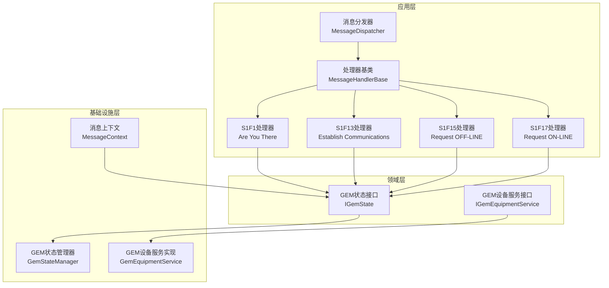
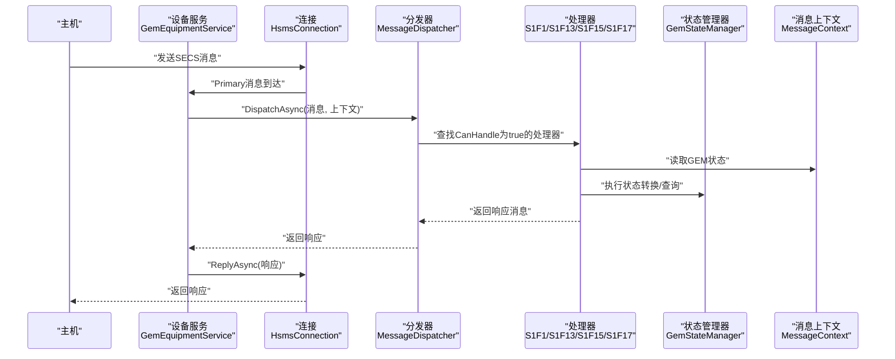
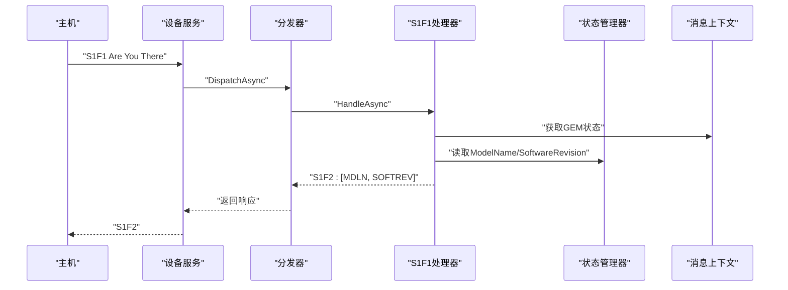
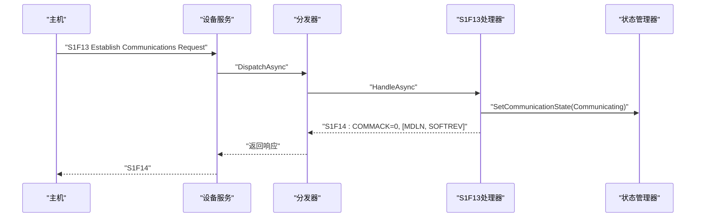
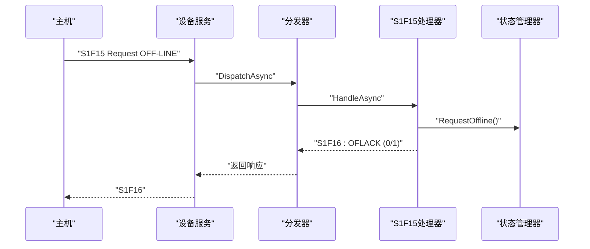
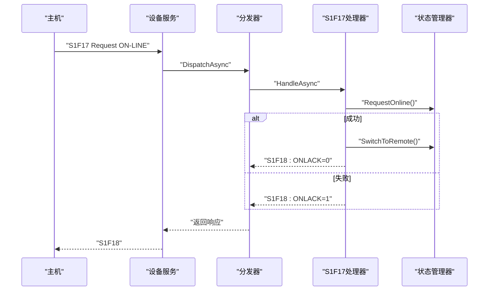
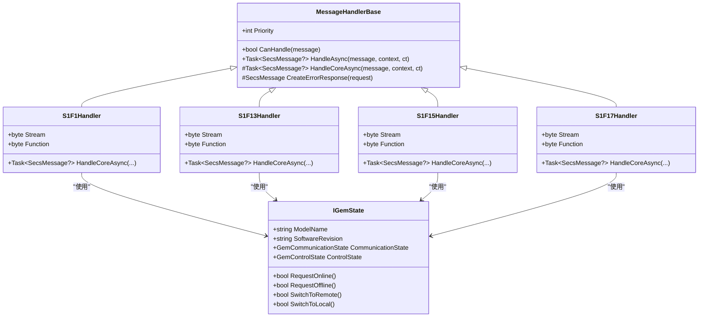

# Stream 1 处理器

<cite>
**本文档引用的文件**
- [StreamOneHandlers.cs](file://WebGem/SECS2GEM/Application/Handlers/StreamOneHandlers.cs)
- [GemEquipmentService.cs](file://WebGem/SECS2GEM/Application/Services/GemEquipmentService.cs)
- [GemStateManager.cs](file://WebGem/SECS2GEM/Application/State/GemStateManager.cs)
- [MessageDispatcher.cs](file://WebGem/SECS2GEM/Application/Messaging/MessageDispatcher.cs)
- [MessageContext.cs](file://WebGem/SECS2GEM/Infrastructure/Connection/MessageContext.cs)
- [IGemEquipmentService.cs](file://WebGem/SECS2GEM/Domain/Interfaces/IGemEquipmentService.cs)
- [IGemState.cs](file://WebGem/SECS2GEM/Domain/Interfaces/IGemState.cs)
- [GemStates.cs](file://WebGem/SECS2GEM/Core/Enums/GemStates.cs)
- [StateChangedEvent.cs](file://WebGem/SECS2GEM/Domain/Events/StateChangedEvent.cs)
- [MessageHandlerTests.cs](file://WebGem/SECS2GEM.Tests/MessageHandlerTests.cs)
</cite>

## 目录
1. [简介](#简介)
2. [项目结构](#项目结构)
3. [核心组件](#核心组件)
4. [架构总览](#架构总览)
5. [详细组件分析](#详细组件分析)
6. [依赖关系分析](#依赖关系分析)
7. [性能考虑](#性能考虑)
8. [故障排除指南](#故障排除指南)
9. [结论](#结论)

## 简介
本文件面向Stream 1处理器集合，深入解析以下四个关键处理器：
- S1F1 Are You There（连接检测）
- S1F13 Establish Communications Request（通信建立）
- S1F15 Request OFF-LINE（离线请求）
- S1F17 Request ON-LINE（在线请求）

文档将阐述每个处理器的业务逻辑、状态转换、响应生成、GEM状态管理的应用示例（设备状态变更与通信状态管理），以及完整的消息交互流程与错误处理机制。同时提供可视化图示帮助理解处理器间的协作关系与状态流转。

## 项目结构
Stream 1处理器位于应用层的处理器目录中，配合消息分发器、状态管理器与设备服务共同构成完整的SECS/GEM处理链路。下图展示了处理器与核心组件的关系：

图表来源
- [StreamOneHandlers.cs:1-211](file://WebGem/SECS2GEM/Application/Handlers/StreamOneHandlers.cs#L1-L211)
- [MessageDispatcher.cs:1-123](file://WebGem/SECS2GEM/Application/Messaging/MessageDispatcher.cs#L1-L123)
- [GemStateManager.cs:1-492](file://WebGem/SECS2GEM/Application/State/GemStateManager.cs#L1-L492)
- [GemEquipmentService.cs:1-456](file://WebGem/SECS2GEM/Application/Services/GemEquipmentService.cs#L1-L456)
- [MessageContext.cs:1-65](file://WebGem/SECS2GEM/Infrastructure/Connection/MessageContext.cs#L1-L65)

章节来源
- [StreamOneHandlers.cs:1-211](file://WebGem/SECS2GEM/Application/Handlers/StreamOneHandlers.cs#L1-L211)
- [MessageDispatcher.cs:1-123](file://WebGem/SECS2GEM/Application/Messaging/MessageDispatcher.cs#L1-L123)
- [GemStateManager.cs:1-492](file://WebGem/SECS2GEM/Application/State/GemStateManager.cs#L1-L492)
- [GemEquipmentService.cs:1-456](file://WebGem/SECS2GEM/Application/Services/GemEquipmentService.cs#L1-L456)
- [MessageContext.cs:1-65](file://WebGem/SECS2GEM/Infrastructure/Connection/MessageContext.cs#L1-L65)

## 核心组件
- 处理器基类：提供统一的模板方法模式框架，封装异常处理与错误响应生成，定义CanHandle与HandleAsync的通用流程。
- 消息分发器：维护处理器列表，按优先级排序，负责将消息路由到首个CanHandle为true的处理器。
- GEM状态管理器：实现通信状态、控制状态与处理状态的管理，提供状态转换验证与事件发布。
- 设备服务：整合连接、分发与状态管理，注册默认处理器，驱动状态机与事件流。
- 消息上下文：向处理器提供设备ID、系统字节、连接对象与GEM状态的访问能力。

章节来源
- [StreamOneHandlers.cs:20-86](file://WebGem/SECS2GEM/Application/Handlers/StreamOneHandlers.cs#L20-L86)
- [MessageDispatcher.cs:27-123](file://WebGem/SECS2GEM/Application/Messaging/MessageDispatcher.cs#L27-L123)
- [GemStateManager.cs:22-350](file://WebGem/SECS2GEM/Application/State/GemStateManager.cs#L22-L350)
- [GemEquipmentService.cs:33-456](file://WebGem/SECS2GEM/Application/Services/GemEquipmentService.cs#L33-L456)
- [MessageContext.cs:12-65](file://WebGem/SECS2GEM/Infrastructure/Connection/MessageContext.cs#L12-L65)

## 架构总览
下图展示从消息接收、分发到处理器响应的完整流程，以及状态管理在其中的作用：

图表来源
- [GemEquipmentService.cs:343-358](file://WebGem/SECS2GEM/Application/Services/GemEquipmentService.cs#L343-L358)
- [MessageDispatcher.cs:67-91](file://WebGem/SECS2GEM/Application/Messaging/MessageDispatcher.cs#L67-L91)
- [StreamOneHandlers.cs:48-86](file://WebGem/SECS2GEM/Application/Handlers/StreamOneHandlers.cs#L48-L86)
- [GemStateManager.cs:22-350](file://WebGem/SECS2GEM/Application/State/GemStateManager.cs#L22-L350)

## 详细组件分析

### S1F1 Are You There 处理器
- 业务逻辑：接收主机的Are You There请求，返回设备型号与软件版本信息。
- 关键点：
  - 使用消息上下文中的GEM状态读取ModelName与SoftwareRevision。
  - 生成S1F2响应，包含设备型号与软件版本的ASCII字符串列表。
- 错误处理：若处理器内部异常且请求为W-Bit消息，则返回S9F7错误响应。

图表来源
- [StreamOneHandlers.cs:94-114](file://WebGem/SECS2GEM/Application/Handlers/StreamOneHandlers.cs#L94-L114)
- [GemStateManager.cs:35-43](file://WebGem/SECS2GEM/Application/State/GemStateManager.cs#L35-L43)

章节来源
- [StreamOneHandlers.cs:89-114](file://WebGem/SECS2GEM/Application/Handlers/StreamOneHandlers.cs#L89-L114)
- [MessageHandlerTests.cs:24-45](file://WebGem/SECS2GEM.Tests/MessageHandlerTests.cs#L24-L45)

### S1F13 Establish Communications Request 处理器
- 业务逻辑：建立通信请求，设置通信状态为“通信中”，并返回通信确认与设备信息。
- 关键点：
  - 将通信状态从“等待通信请求”转换为“通信中”。
  - 生成S1F14响应，COMMACK=0表示接受，随后包含设备型号与软件版本。
- 状态管理：依赖GEM状态管理器的状态转换验证，确保状态转换合法。

图表来源
- [StreamOneHandlers.cs:122-149](file://WebGem/SECS2GEM/Application/Handlers/StreamOneHandlers.cs#L122-L149)
- [GemStateManager.cs:201-223](file://WebGem/SECS2GEM/Application/State/GemStateManager.cs#L201-L223)

章节来源
- [StreamOneHandlers.cs:117-149](file://WebGem/SECS2GEM/Application/Handlers/StreamOneHandlers.cs#L117-L149)
- [MessageHandlerTests.cs:67-105](file://WebGem/SECS2GEM.Tests/MessageHandlerTests.cs#L67-L105)

### S1F15 Request OFF-LINE 处理器
- 业务逻辑：请求离线，尝试将控制状态从在线切换到离线。
- 关键点：
  - 调用GEM状态管理器的RequestOffline方法，根据结果生成OFLACK=0（成功）或OFLACK=1（失败）。
  - 若离线成功，控制状态变为“设备离线”。
- 状态管理：离线请求仅在当前控制状态为在线时有效。

图表来源
- [StreamOneHandlers.cs:154-174](file://WebGem/SECS2GEM/Application/Handlers/StreamOneHandlers.cs#L154-L174)
- [GemStateManager.cs:285-298](file://WebGem/SECS2GEM/Application/State/GemStateManager.cs#L285-L298)

章节来源
- [StreamOneHandlers.cs:151-174](file://WebGem/SECS2GEM/Application/Handlers/StreamOneHandlers.cs#L151-L174)
- [MessageHandlerTests.cs:108-134](file://WebGem/SECS2GEM.Tests/MessageHandlerTests.cs#L108-L134)

### S1F17 Request ON-LINE 处理器
- 业务逻辑：请求在线，尝试将控制状态从离线切换到在线，并默认进入远程控制模式。
- 关键点：
  - 若RequestOnline成功，自动切换到远程控制模式（OnlineRemote），ONLACK=0。
  - 若RequestOnline失败，ONLACK=1。
- 状态管理：在线请求的前提是通信状态必须为“通信中”。

图表来源
- [StreamOneHandlers.cs:179-209](file://WebGem/SECS2GEM/Application/Handlers/StreamOneHandlers.cs#L179-L209)
- [GemStateManager.cs:263-280](file://WebGem/SECS2GEM/Application/State/GemStateManager.cs#L263-L280)
- [GemStateManager.cs:328-347](file://WebGem/SECS2GEM/Application/State/GemStateManager.cs#L328-L347)

章节来源
- [StreamOneHandlers.cs:176-209](file://WebGem/SECS2GEM/Application/Handlers/StreamOneHandlers.cs#L176-L209)
- [MessageHandlerTests.cs:136-161](file://WebGem/SECS2GEM.Tests/MessageHandlerTests.cs#L136-L161)

### GEM状态管理在处理器中的应用示例
- 设备状态变更：
  - S1F1处理器通过读取GEM状态的ModelName与SoftwareRevision，确保响应数据来自当前状态。
  - S1F13处理器在建立通信后将通信状态设为“通信中”，驱动后续在线请求的可用性。
- 通信状态管理：
  - S1F13处理器设置通信状态为“通信中”，使S1F17处理器能够成功请求在线。
  - S1F15处理器在离线时将控制状态设为“设备离线”，确保设备处于安全状态。
- 状态事件与通知：
  - 状态管理器在状态转换时发布事件，设备服务订阅这些事件以更新全局状态与触发自动行为（如自动上线与远程模式切换）。

章节来源
- [GemStateManager.cs:22-350](file://WebGem/SECS2GEM/Application/State/GemStateManager.cs#L22-L350)
- [GemEquipmentService.cs:363-398](file://WebGem/SECS2GEM/Application/Services/GemEquipmentService.cs#L363-L398)
- [StateChangedEvent.cs:11-110](file://WebGem/SECS2GEM/Domain/Events/StateChangedEvent.cs#L11-L110)

## 依赖关系分析
- 处理器对GEM状态的依赖：所有Stream 1处理器均通过消息上下文访问IGemState，实现对设备状态与通信状态的读取与修改。
- 分发器与处理器：分发器维护处理器列表，按优先级匹配，处理器实现CanHandle与HandleAsync。
- 设备服务与状态管理：设备服务持有状态管理器实例，负责初始化、状态转换与事件发布；同时注册默认处理器。

图表来源
- [StreamOneHandlers.cs:20-211](file://WebGem/SECS2GEM/Application/Handlers/StreamOneHandlers.cs#L20-L211)
- [IGemState.cs:20-166](file://WebGem/SECS2GEM/Domain/Interfaces/IGemState.cs#L20-L166)

章节来源
- [StreamOneHandlers.cs:20-211](file://WebGem/SECS2GEM/Application/Handlers/StreamOneHandlers.cs#L20-L211)
- [IGemState.cs:20-166](file://WebGem/SECS2GEM/Domain/Interfaces/IGemState.cs#L20-L166)

## 性能考虑
- 处理器优先级：分发器按优先级排序处理器，避免不必要的遍历，提升路由效率。
- 异常处理：处理器基类统一捕获异常并生成S9F7响应，减少重复代码，提高稳定性。
- 状态锁：状态管理器使用锁保护状态字段，避免并发冲突，保证状态一致性。
- 事件发布：状态变化事件仅在必要时发布，降低事件风暴风险。

## 故障排除指南
- 无处理器匹配：当消息无法被任何处理器处理时，分发器会根据WBit决定是否返回S9F7错误响应。
- 状态转换失败：若状态转换不被允许，处理器应返回相应的拒绝码（如OFLACK=1或ONLACK=1）。
- 连接未就绪：设备服务在非连接状态下发送消息会抛出异常，需先确保连接处于Selected状态。
- 自动上线与模式切换：设备服务在进入“通信中”状态时可自动执行在线请求与远程/本地模式切换，需检查配置项以避免意外状态变更。

章节来源
- [MessageDispatcher.cs:83-91](file://WebGem/SECS2GEM/Application/Messaging/MessageDispatcher.cs#L83-L91)
- [GemEquipmentService.cs:196-202](file://WebGem/SECS2GEM/Application/Services/GemEquipmentService.cs#L196-L202)
- [GemEquipmentService.cs:372-384](file://WebGem/SECS2GEM/Application/Services/GemEquipmentService.cs#L372-L384)

## 结论
Stream 1处理器集合围绕GEM状态管理实现了标准的SECS/GEM消息处理流程。通过处理器基类的统一框架、分发器的高效路由、状态管理器的严格转换验证与设备服务的事件驱动机制，系统能够可靠地处理连接检测、通信建立、离线与在线请求，并在出现异常时提供一致的错误响应。建议在生产环境中结合测试用例持续验证状态转换与消息交互的正确性，确保设备状态与通信状态的一致性与安全性。