# Stream 2 处理器

<cite>
**本文档引用的文件**
- [StreamTwoHandlers.cs](file://WebGem/SECS2GEM/Application/Handlers/StreamTwoHandlers.cs)
- [EquipmentConstant.cs](file://WebGem/SECS2GEM/Domain/Models/EquipmentConstant.cs)
- [StatusVariable.cs](file://WebGem/SECS2GEM/Domain/Models/StatusVariable.cs)
- [EventReport.cs](file://WebGem/SECS2GEM/Domain/Models/EventReport.cs)
- [ProcessProgram.cs](file://WebGem/SECS2GEM/Domain/Models/ProcessProgram.cs)
- [IGemState.cs](file://WebGem/SECS2GEM/Domain/Interfaces/IGemState.cs)
- [SecsFormat.cs](file://WebGem/SECS2GEM/Core/Enums/SecsFormat.cs)
- [GemStateManager.cs](file://WebGem/SECS2GEM/Application/State/GemStateManager.cs)
- [GemEquipmentService.cs](file://WebGem/SECS2GEM/Application/Services/GemEquipmentService.cs)
- [SecsItem.cs](file://WebGem/SECS2GEM/Core/Entities/SecsItem.cs)
- [MessageHandlerTests.cs](file://WebGem/SECS2GEM.Tests/MessageHandlerTests.cs)
</cite>

## 目录
1. [简介](#简介)
2. [项目结构](#项目结构)
3. [核心组件](#核心组件)
4. [架构概览](#架构概览)
5. [详细组件分析](#详细组件分析)
6. [依赖关系分析](#依赖关系分析)
7. [性能考虑](#性能考虑)
8. [故障排除指南](#故障排除指南)
9. [结论](#结论)

## 简介

Stream 2处理器集合是SECS/GEM协议中负责设备控制和配置的核心组件。本文档深入介绍了四个关键的Stream 2处理器：

- **S2F11 Constant Definition处理器**：设备常量定义处理器
- **S2F13 Variable Definition处理器**：状态变量定义机制
- **S2F15 Event Report Definition处理器**：事件报告定义
- **S2F17 Process Program Definition处理器**：工艺程序定义

这些处理器实现了GEM协议中设备常量管理、状态变量配置、事件报告机制和工艺程序控制等核心功能。

## 项目结构

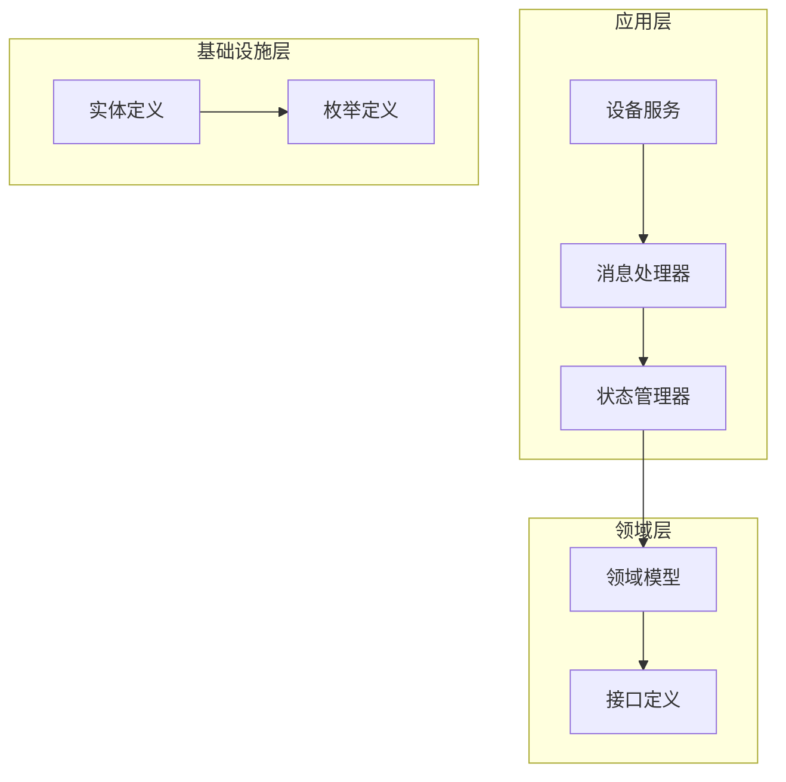

**图表来源**
- [StreamTwoHandlers.cs:1-331](file://WebGem/SECS2GEM/Application/Handlers/StreamTwoHandlers.cs#L1-L331)
- [GemStateManager.cs:1-492](file://WebGem/SECS2GEM/Application/State/GemStateManager.cs#L1-L492)

**章节来源**
- [StreamTwoHandlers.cs:1-331](file://WebGem/SECS2GEM/Application/Handlers/StreamTwoHandlers.cs#L1-L331)
- [GemEquipmentService.cs:1-456](file://WebGem/SECS2GEM/Application/Services/GemEquipmentService.cs#L1-L456)

## 核心组件

### 设备常量管理系统

设备常量系统是GEM协议中用于配置设备参数的核心机制，通过S2F13/S2F14查询，通过S2F15/S2F16设置。

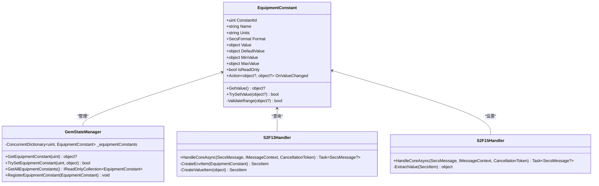

**图表来源**
- [EquipmentConstant.cs:1-122](file://WebGem/SECS2GEM/Domain/Models/EquipmentConstant.cs#L1-L122)
- [GemStateManager.cs:152-194](file://WebGem/SECS2GEM/Application/State/GemStateManager.cs#L152-L194)
- [StreamTwoHandlers.cs:13-138](file://WebGem/SECS2GEM/Application/Handlers/StreamTwoHandlers.cs#L13-L138)

### 状态变量定义机制

状态变量系统用于表示设备的实时状态信息，通过S1F3/S1F4查询，通过S6F11事件报告上报。

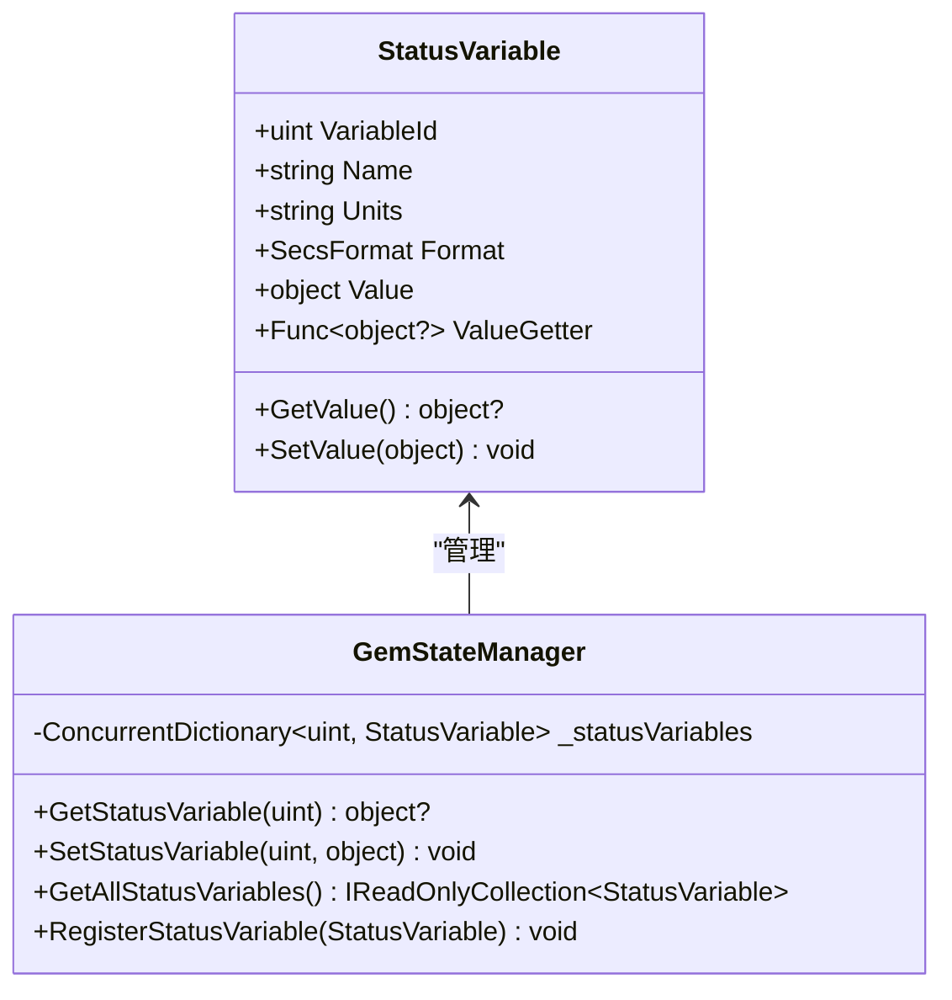

**图表来源**
- [StatusVariable.cs:1-61](file://WebGem/SECS2GEM/Domain/Models/StatusVariable.cs#L1-L61)
- [GemStateManager.cs:109-150](file://WebGem/SECS2GEM/Application/State/GemStateManager.cs#L109-L150)

### 事件报告定义系统

事件报告系统管理事件、报告、变量之间的关联关系，支持S2F33/S2F35/S2F37等消息的处理。

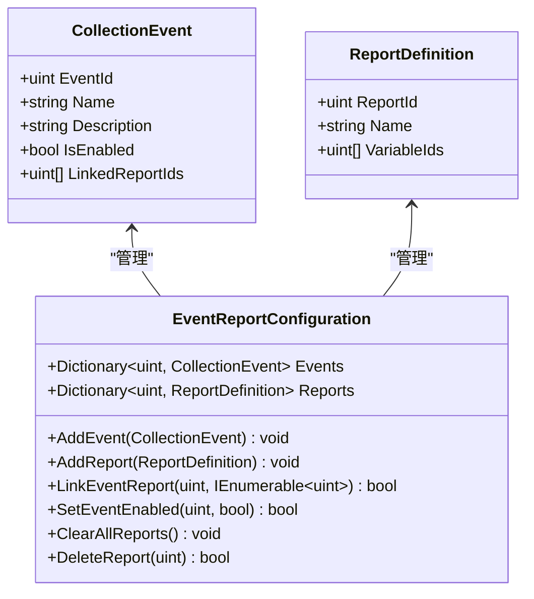

**图表来源**
- [EventReport.cs:1-159](file://WebGem/SECS2GEM/Domain/Models/EventReport.cs#L1-L159)

### 工艺程序定义系统

工艺程序系统用于管理设备的配方信息，支持不同类型的工艺程序存储和管理。

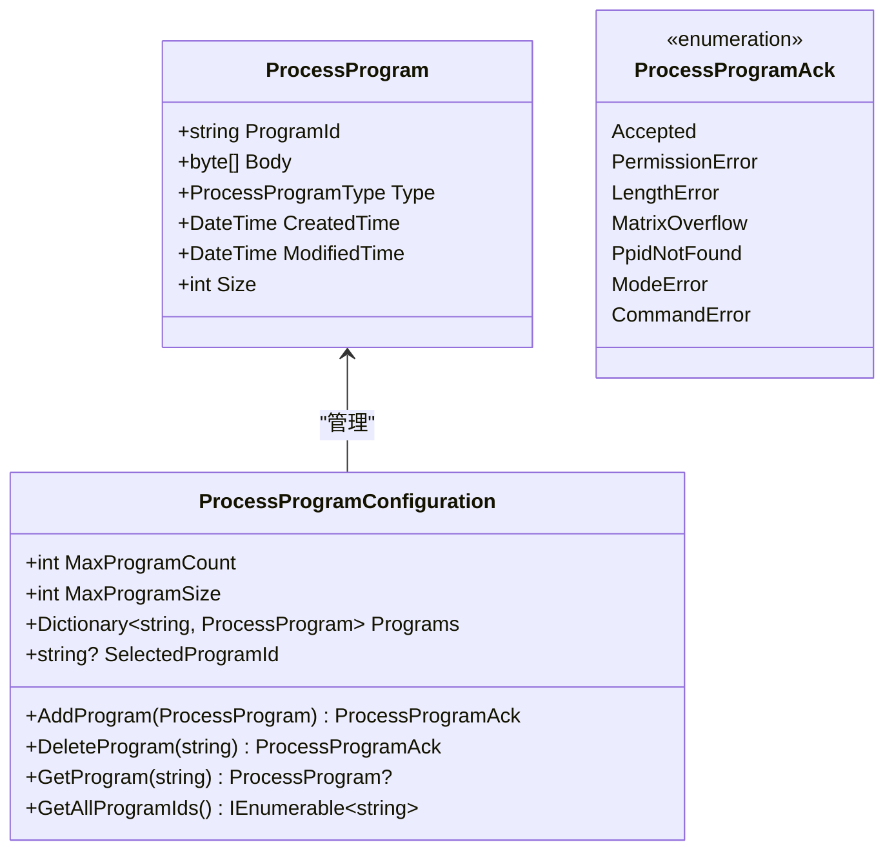

**图表来源**
- [ProcessProgram.cs:1-164](file://WebGem/SECS2GEM/Domain/Models/ProcessProgram.cs#L1-L164)

**章节来源**
- [EquipmentConstant.cs:1-122](file://WebGem/SECS2GEM/Domain/Models/EquipmentConstant.cs#L1-L122)
- [StatusVariable.cs:1-61](file://WebGem/SECS2GEM/Domain/Models/StatusVariable.cs#L1-L61)
- [EventReport.cs:1-159](file://WebGem/SECS2GEM/Domain/Models/EventReport.cs#L1-L159)
- [ProcessProgram.cs:1-164](file://WebGem/SECS2GEM/Domain/Models/ProcessProgram.cs#L1-L164)

## 架构概览

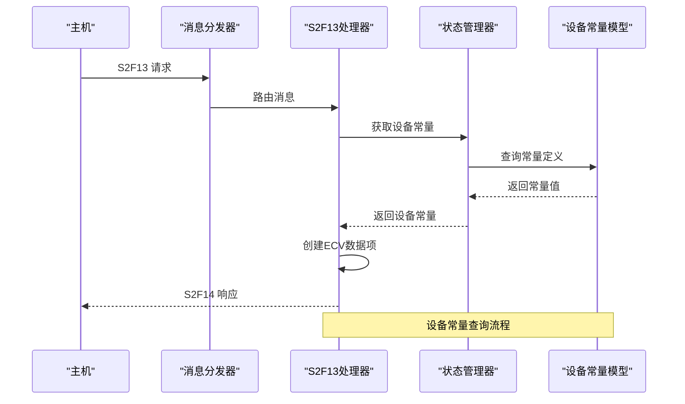

**图表来源**
- [StreamTwoHandlers.cs:18-57](file://WebGem/SECS2GEM/Application/Handlers/StreamTwoHandlers.cs#L18-L57)
- [GemStateManager.cs:152-194](file://WebGem/SECS2GEM/Application/State/GemStateManager.cs#L152-L194)

**章节来源**
- [GemEquipmentService.cs:407-443](file://WebGem/SECS2GEM/Application/Services/GemEquipmentService.cs#L407-L443)
- [StreamTwoHandlers.cs:1-331](file://WebGem/SECS2GEM/Application/Handlers/StreamTwoHandlers.cs#L1-L331)

## 详细组件分析

### S2F13 Constant Definition处理器

S2F13处理器负责处理设备常量查询请求，实现设备常量的获取和格式化输出。

#### 数据结构分析

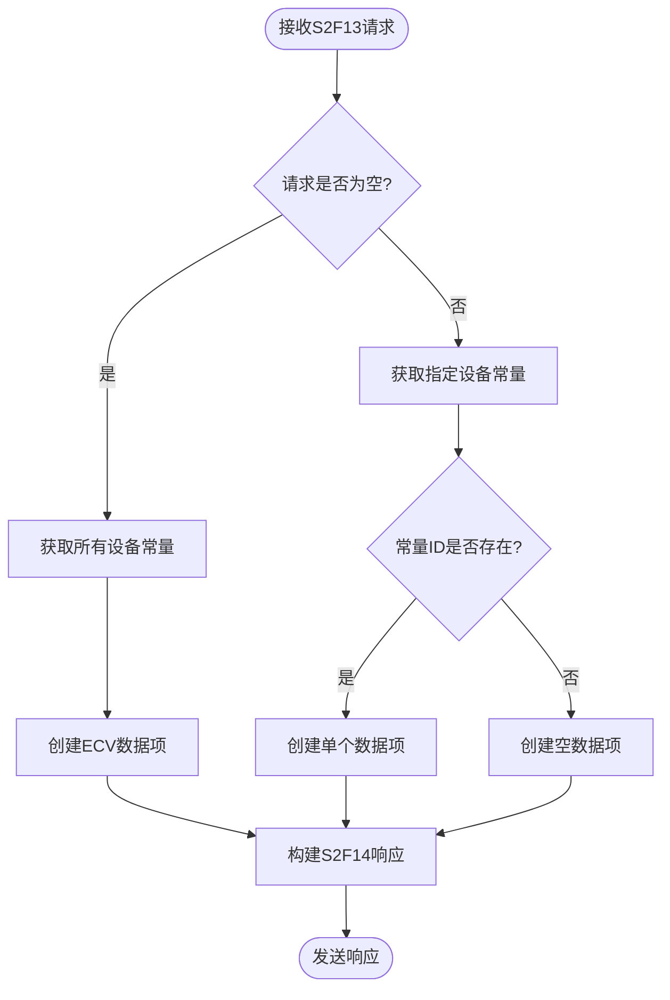

**图表来源**
- [StreamTwoHandlers.cs:18-57](file://WebGem/SECS2GEM/Application/Handlers/StreamTwoHandlers.cs#L18-L57)

#### 验证逻辑

S2F13处理器实现了以下验证逻辑：
- 请求格式验证：检查消息体的结构完整性
- 常量ID有效性验证：确保请求的设备常量ID存在
- 空请求处理：支持查询所有设备常量的功能

#### 配置管理功能

处理器支持设备常量的动态配置：
- 支持批量查询多个设备常量
- 自动处理不同数据类型的格式转换
- 提供空值处理机制

**章节来源**
- [StreamTwoHandlers.cs:13-78](file://WebGem/SECS2GEM/Application/Handlers/StreamTwoHandlers.cs#L13-L78)
- [EquipmentConstant.cs:76-96](file://WebGem/SECS2GEM/Domain/Models/EquipmentConstant.cs#L76-L96)

### S2F15 Variable Definition处理器

S2F15处理器负责处理设备常量设置请求，实现设备常量的更新和验证。

#### 数据结构分析

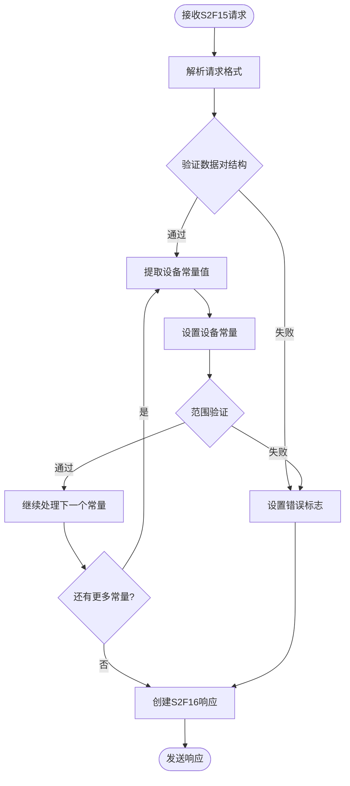

**图表来源**
- [StreamTwoHandlers.cs:91-121](file://WebGem/SECS2GEM/Application/Handlers/StreamTwoHandlers.cs#L91-L121)

#### 验证逻辑

S2F15处理器实现了严格的验证机制：
- **数据类型转换**：根据SECS格式自动转换数据类型
- **范围验证**：检查数值型常量是否在允许范围内
- **只读保护**：防止修改只读设备常量
- **格式兼容性**：确保输入数据与设备常量定义的格式匹配

#### 配置管理功能

处理器提供了完整的配置管理能力：
- 支持批量设置多个设备常量
- 实时验证和错误处理
- 细粒度的错误码返回机制

**章节来源**
- [StreamTwoHandlers.cs:86-138](file://WebGem/SECS2GEM/Application/Handlers/StreamTwoHandlers.cs#L86-L138)
- [EquipmentConstant.cs:98-119](file://WebGem/SECS2GEM/Domain/Models/EquipmentConstant.cs#L98-L119)

### S2F17 Process Program Definition处理器

S2F17处理器负责处理工艺程序定义请求，实现工艺程序的配置和管理。

#### 数据结构分析

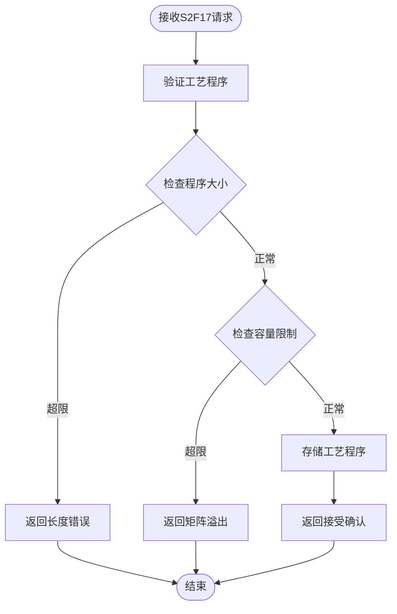

**图表来源**
- [ProcessProgram.cs:84-99](file://WebGem/SECS2GEM/Domain/Models/ProcessProgram.cs#L84-L99)

#### 验证逻辑

S2F17处理器实现了多层次的验证机制：
- **大小验证**：检查工艺程序大小是否超过最大限制
- **容量验证**：确保程序数量不超过配置的最大值
- **重复检查**：防止重复存储相同ID的工艺程序

#### 配置管理功能

处理器提供了灵活的配置管理：
- 可配置的最大程序数量和大小限制
- 动态的程序存储和检索机制
- 完整的生命周期管理

**章节来源**
- [ProcessProgram.cs:60-135](file://WebGem/SECS2GEM/Domain/Models/ProcessProgram.cs#L60-L135)

### S2F11 Constant Definition处理器

S2F11处理器负责处理设备常量定义请求，实现设备常量的注册和管理。

#### 数据结构分析

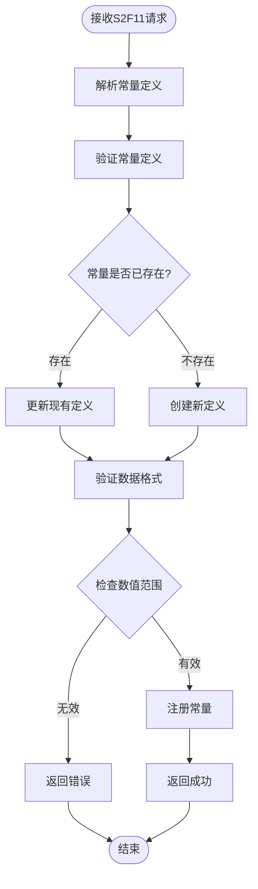

**图表来源**
- [EquipmentConstant.cs:76-96](file://WebGem/SECS2GEM/Domain/Models/EquipmentConstant.cs#L76-L96)

#### 验证逻辑

S2F11处理器实现了全面的验证机制：
- **格式验证**：确保数据格式与定义一致
- **范围验证**：检查数值型数据的有效范围
- **唯一性验证**：确保常量ID的唯一性
- **类型兼容性**：验证数据类型与格式的匹配

#### 配置管理功能

处理器提供了完善的配置管理：
- 支持多种数据格式的设备常量
- 动态的常量注册和更新机制
- 完整的错误处理和反馈机制

**章节来源**
- [EquipmentConstant.cs:1-122](file://WebGem/SECS2GEM/Domain/Models/EquipmentConstant.cs#L1-L122)

## 依赖关系分析

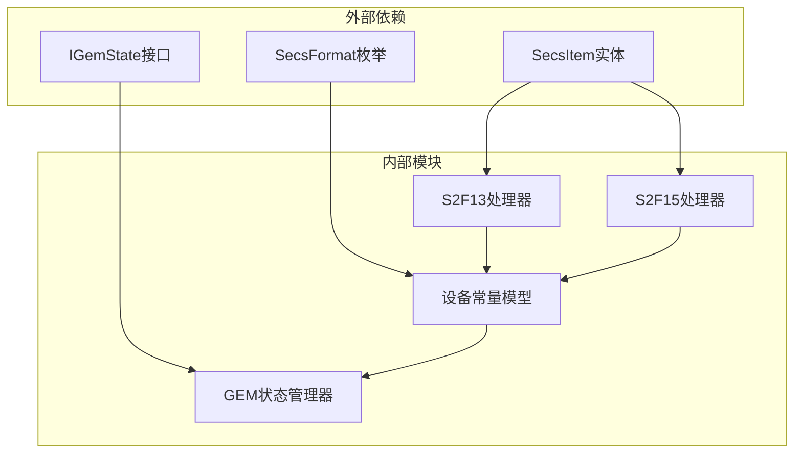

**图表来源**
- [StreamTwoHandlers.cs:1-331](file://WebGem/SECS2GEM/Application/Handlers/StreamTwoHandlers.cs#L1-L331)
- [GemStateManager.cs:1-492](file://WebGem/SECS2GEM/Application/State/GemStateManager.cs#L1-L492)

**章节来源**
- [IGemState.cs:1-166](file://WebGem/SECS2GEM/Domain/Interfaces/IGemState.cs#L1-L166)
- [SecsFormat.cs:1-112](file://WebGem/SECS2GEM/Core/Enums/SecsFormat.cs#L1-L112)

## 性能考虑

### 内存管理

- **并发安全**：使用ConcurrentDictionary确保多线程环境下的安全性
- **内存优化**：采用不可变设计减少内存分配
- **缓存策略**：合理使用缓存避免重复计算

### 处理效率

- **异步处理**：所有处理器都支持异步操作提高响应性
- **流式处理**：支持大数据量的流式处理
- **批量操作**：支持批量设备常量和状态变量操作

### 错误处理

- **快速失败**：及时发现和处理错误情况
- **优雅降级**：在异常情况下保持系统稳定性
- **资源清理**：确保异常情况下的资源正确释放

## 故障排除指南

### 常见问题诊断

#### 设备常量设置失败

**症状**：S2F15响应显示设置失败

**可能原因**：
1. 设备常量ID不存在
2. 数据类型不匹配
3. 数值超出范围
4. 常量被标记为只读

**解决方案**：
1. 验证设备常量ID的有效性
2. 检查数据格式与定义的一致性
3. 确认数值在允许范围内
4. 检查常量的只读属性

#### 事件报告配置错误

**症状**：事件报告定义不生效

**可能原因**：
1. 事件ID未正确注册
2. 报告ID关联失败
3. 变量ID不存在

**解决方案**：
1. 确保事件定义已正确注册
2. 验证报告与事件的关联关系
3. 检查变量ID的有效性

#### 工艺程序存储失败

**症状**：S2F17响应显示存储失败

**可能原因**：
1. 工艺程序大小超限
2. 程序数量达到上限
3. 程序ID重复

**解决方案**：
1. 检查工艺程序大小是否符合限制
2. 确认程序数量未超过最大值
3. 验证程序ID的唯一性

### 调试技巧

#### 日志记录

建议启用详细的日志记录来跟踪处理器的执行过程：
- 记录所有消息的接收和发送
- 跟踪设备常量的设置过程
- 记录错误和异常情况

#### 单元测试

利用现有的单元测试框架进行功能验证：
- 测试设备常量的增删改查
- 验证事件报告的配置流程
- 确认错误处理的正确性

**章节来源**
- [MessageHandlerTests.cs:1-279](file://WebGem/SECS2GEM.Tests/MessageHandlerTests.cs#L1-L279)

## 结论

Stream 2处理器集合为SECS/GEM协议提供了完整的设备控制和配置功能。通过精心设计的数据结构、严格的验证逻辑和灵活的配置管理，这些处理器能够满足工业自动化环境中对设备常量管理、状态变量配置、事件报告机制和工艺程序控制的各种需求。

系统的主要优势包括：
- **模块化设计**：清晰的职责分离和接口定义
- **扩展性强**：支持自定义处理器和配置
- **可靠性高**：完善的错误处理和恢复机制
- **性能优异**：异步处理和内存优化

通过本文档提供的详细分析和实践指导，开发者可以更好地理解和使用这些处理器，为工业控制系统提供稳定可靠的SECS/GEM协议支持。