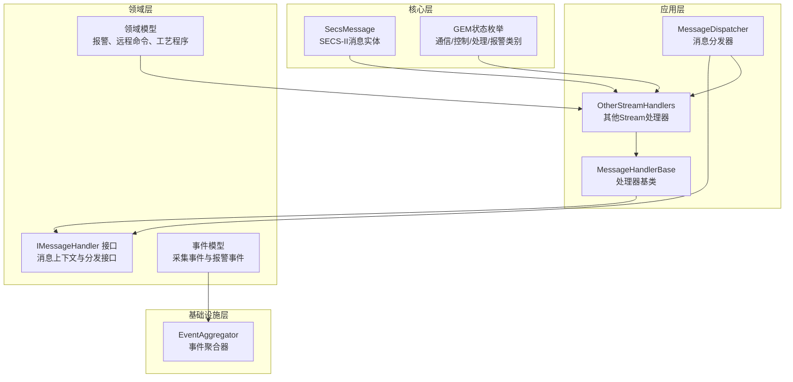
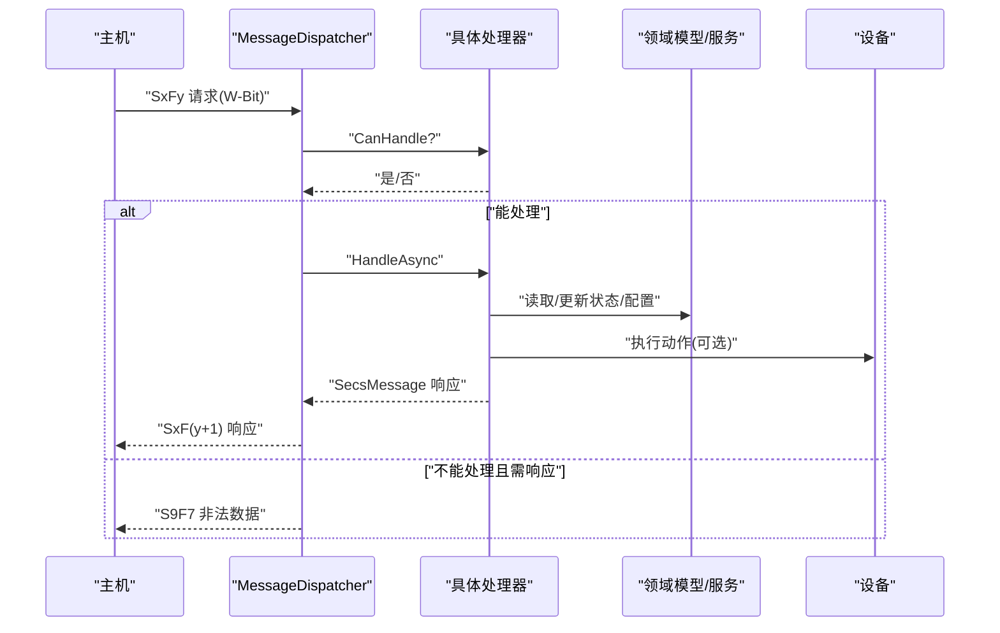
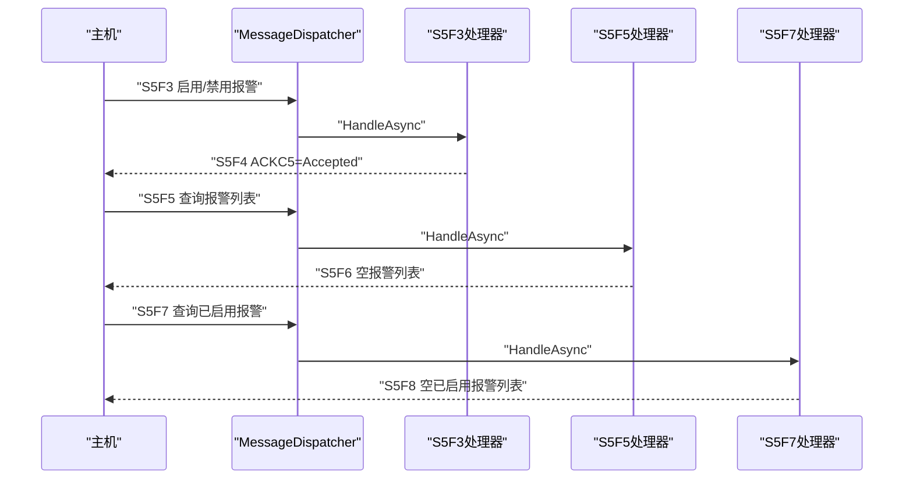
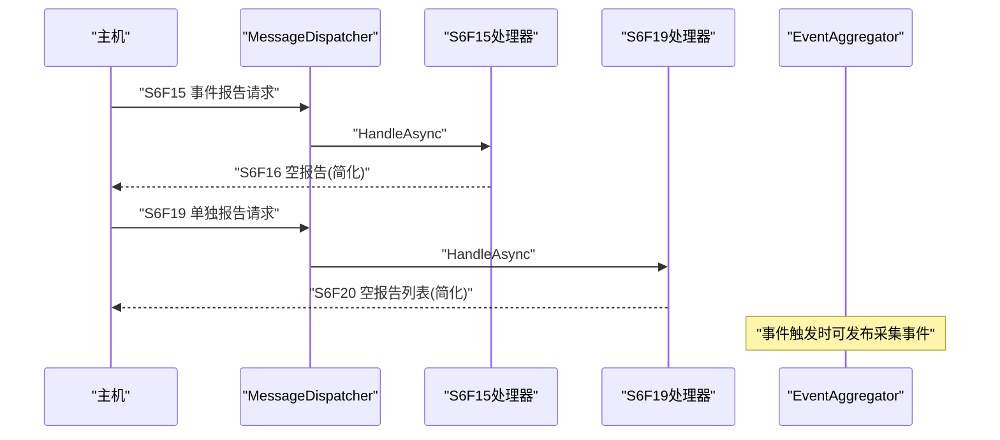
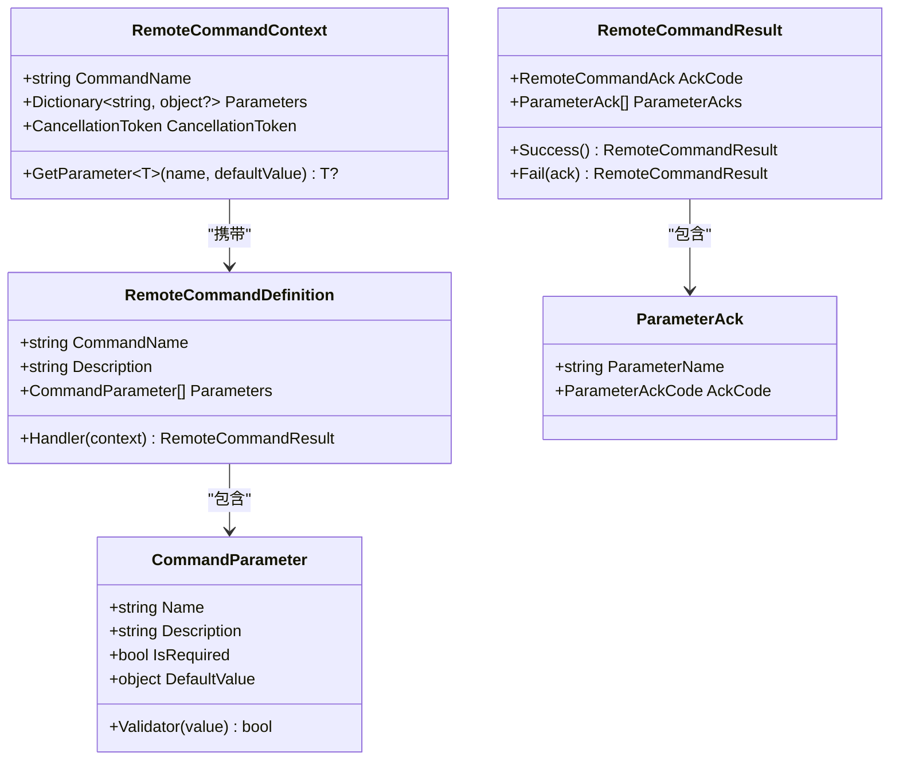
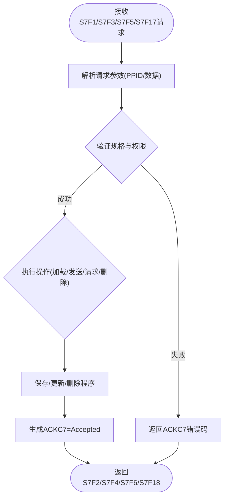
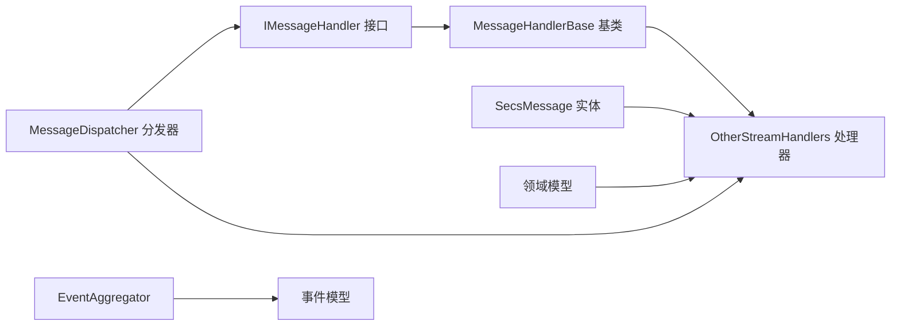

# 其他Stream处理器

<cite>
**本文引用的文件**
- [OtherStreamHandlers.cs](file://WebGem/SECS2GEM/Application/Handlers/OtherStreamHandlers.cs)
- [MessageHandlerBase.cs](file://WebGem/SECS2GEM/Application/Handlers/StreamOneHandlers.cs)
- [IMessageHandler.cs](file://WebGem/SECS2GEM/Domain/Interfaces/IMessageHandler.cs)
- [MessageDispatcher.cs](file://WebGem/SECS2GEM/Application/Messaging/MessageDispatcher.cs)
- [SecsMessage.cs](file://WebGem/SECS2GEM/Core/Entities/SecsMessage.cs)
- [AlarmInfo.cs](file://WebGem/SECS2GEM/Domain/Models/AlarmInfo.cs)
- [RemoteCommand.cs](file://WebGem/SECS2GEM/Domain/Models/RemoteCommand.cs)
- [ProcessProgram.cs](file://WebGem/SECS2GEM/Domain/Models/ProcessProgram.cs)
- [GemStates.cs](file://WebGem/SECS2GEM/Core/Enums/GemStates.cs)
- [EventAggregator.cs](file://WebGem/SECS2GEM/Infrastructure/Services/EventAggregator.cs)
- [CollectionEventTriggeredEvent.cs](file://WebGem/SECS2GEM/Domain/Events/CollectionEventTriggeredEvent.cs)
- [GEM协议规范.md](file://WebGem/SECS2GEM/GEM_Protocol_Specification.md)
</cite>

## 目录
1. [简介](#简介)
2. [项目结构](#项目结构)
3. [核心组件](#核心组件)
4. [架构总览](#架构总览)
5. [详细组件分析](#详细组件分析)
6. [依赖关系分析](#依赖关系分析)
7. [性能考量](#性能考量)
8. [故障排除指南](#故障排除指南)
9. [结论](#结论)
10. [附录](#附录)

## 简介
本文件面向SECS-II/GEM协议中的其他Stream处理器，重点围绕以下四类处理器进行系统性说明：
- S5F1 报警定义与管理：涵盖报警启用/禁用、报警列表查询与已启用报警查询的处理逻辑与响应机制。
- S6F17 数据采集请求：解释如何处理数据采集相关的请求与响应，以及与事件报告的协作关系。
- S16F17 远程命令执行：介绍远程命令的定义、参数校验、执行流程与安全确认码机制。
- S18F1 工艺程序上传：说明工艺程序的加载、发送、请求与删除流程，以及ACKC7确认码的使用。

文档将从架构、数据流、处理逻辑、错误处理与异常恢复、安全考虑等方面进行全面阐述，并提供与其他处理器的协作关系图与实际应用场景。

## 项目结构
SECS2GEM采用分层与模块化设计，处理器按Stream/Function组织在Application/Handlers目录下，消息实体与协议规范位于Core与Domain层，消息分发与上下文接口位于Application与Domain层，事件聚合与状态枚举分别位于Infrastructure与Core层。

**图表来源**
- [OtherStreamHandlers.cs:1-276](file://WebGem/SECS2GEM/Application/Handlers/OtherStreamHandlers.cs#L1-L276)
- [MessageHandlerBase.cs:20-86](file://WebGem/SECS2GEM/Application/Handlers/StreamOneHandlers.cs#L20-L86)
- [IMessageHandler.cs:63-129](file://WebGem/SECS2GEM/Domain/Interfaces/IMessageHandler.cs#L63-L129)
- [MessageDispatcher.cs:27-121](file://WebGem/SECS2GEM/Application/Messaging/MessageDispatcher.cs#L27-L121)
- [SecsMessage.cs:18-139](file://WebGem/SECS2GEM/Core/Entities/SecsMessage.cs#L18-L139)
- [GemStates.cs:10-174](file://WebGem/SECS2GEM/Core/Enums/GemStates.cs#L10-L174)
- [EventAggregator.cs:17-218](file://WebGem/SECS2GEM/Infrastructure/Services/EventAggregator.cs#L17-L218)
- [CollectionEventTriggeredEvent.cs:9-49](file://WebGem/SECS2GEM/Domain/Events/CollectionEventTriggeredEvent.cs#L9-L49)

**章节来源**
- [OtherStreamHandlers.cs:1-276](file://WebGem/SECS2GEM/Application/Handlers/OtherStreamHandlers.cs#L1-L276)
- [IMessageHandler.cs:1-131](file://WebGem/SECS2GEM/Domain/Interfaces/IMessageHandler.cs#L1-L131)
- [MessageDispatcher.cs:1-122](file://WebGem/SECS2GEM/Application/Messaging/MessageDispatcher.cs#L1-L122)
- [SecsMessage.cs:1-209](file://WebGem/SECS2GEM/Core/Entities/SecsMessage.cs#L1-L209)
- [GemStates.cs:1-176](file://WebGem/SECS2GEM/Core/Enums/GemStates.cs#L1-L176)
- [EventAggregator.cs:1-219](file://WebGem/SECS2GEM/Infrastructure/Services/EventAggregator.cs#L1-L219)
- [CollectionEventTriggeredEvent.cs:1-101](file://WebGem/SECS2GEM/Domain/Events/CollectionEventTriggeredEvent.cs#L1-L101)

## 核心组件
- 消息处理器基类与策略模式：通过MessageHandlerBase统一处理流程骨架，子类仅实现具体逻辑；IMessageHandler定义策略接口，支持优先级与动态注册。
- 消息分发器：MessageDispatcher维护处理器列表，按优先级排序后匹配CanHandle，委托处理并生成响应。
- SECS-II消息实体：封装Stream/Function/W-Bit与数据项，提供响应消息工厂方法与SML输出。
- 领域模型：AlarmInfo/AlarmDefinition（报警）、RemoteCommandDefinition/RemoteCommandContext/RemoteCommandResult（远程命令）、ProcessProgram/ProcessProgramConfiguration（工艺程序）。
- 事件系统：EventAggregator实现观察者模式，支持异步/同步事件发布与订阅，异常隔离。

**章节来源**
- [MessageHandlerBase.cs:20-86](file://WebGem/SECS2GEM/Application/Handlers/StreamOneHandlers.cs#L20-L86)
- [IMessageHandler.cs:63-129](file://WebGem/SECS2GEM/Domain/Interfaces/IMessageHandler.cs#L63-L129)
- [MessageDispatcher.cs:27-121](file://WebGem/SECS2GEM/Application/Messaging/MessageDispatcher.cs#L27-L121)
- [SecsMessage.cs:18-139](file://WebGem/SECS2GEM/Core/Entities/SecsMessage.cs#L18-L139)
- [AlarmInfo.cs:8-81](file://WebGem/SECS2GEM/Domain/Models/AlarmInfo.cs#L8-L81)
- [RemoteCommand.cs:9-189](file://WebGem/SECS2GEM/Domain/Models/RemoteCommand.cs#L9-L189)
- [ProcessProgram.cs:9-164](file://WebGem/SECS2GEM/Domain/Models/ProcessProgram.cs#L9-L164)
- [EventAggregator.cs:17-218](file://WebGem/SECS2GEM/Infrastructure/Services/EventAggregator.cs#L17-L218)

## 架构总览
处理器遵循“策略+责任链”模式：MessageDispatcher根据消息的Stream/Function查找能处理的处理器，调用HandleAsync生成响应；若无处理器匹配且消息要求回复，则返回S9F7（非法数据）错误。

**图表来源**
- [MessageDispatcher.cs:67-91](file://WebGem/SECS2GEM/Application/Messaging/MessageDispatcher.cs#L67-L91)
- [IMessageHandler.cs:84-87](file://WebGem/SECS2GEM/Domain/Interfaces/IMessageHandler.cs#L84-L87)
- [MessageHandlerBase.cs:48-66](file://WebGem/SECS2GEM/Application/Handlers/StreamOneHandlers.cs#L48-L66)

## 详细组件分析

### S5F1 报警定义与管理处理器
S5F1属于Stream 5（异常处理），负责报警的上报与确认。本项目中OtherStreamHandlers提供了S5F3/S5F5/S5F7等配套处理器，形成完整的报警生命周期管理。

- S5F3 Enable/Disable Alarm Send：简化实现直接返回ACKC5=Accepted，作为报警启用/禁用的确认。
- S5F5 List Alarms Request：返回空报警列表，便于上位机查询设备支持的报警集合。
- S5F7 List Enabled Alarm Request：返回空已启用报警列表，便于查询当前生效的报警。

**图表来源**
- [OtherStreamHandlers.cs:9-67](file://WebGem/SECS2GEM/Application/Handlers/OtherStreamHandlers.cs#L9-L67)
- [IMessageHandler.cs:84-87](file://WebGem/SECS2GEM/Domain/Interfaces/IMessageHandler.cs#L84-L87)

**章节来源**
- [OtherStreamHandlers.cs:9-67](file://WebGem/SECS2GEM/Application/Handlers/OtherStreamHandlers.cs#L9-L67)
- [AlarmInfo.cs:8-81](file://WebGem/SECS2GEM/Domain/Models/AlarmInfo.cs#L8-L81)
- [GemStates.cs:128-174](file://WebGem/SECS2GEM/Core/Enums/GemStates.cs#L128-L174)
- [GEM协议规范.md:855-885](file://WebGem/SECS2GEM/GEM_Protocol_Specification.md#L855-L885)

### S6F17 数据采集请求处理器
S6F17属于Stream 6（数据采集），用于请求事件报告数据。本项目中OtherStreamHandlers提供了S6F15/S6F19等请求处理器，配合事件聚合器实现数据采集与报告。

- S6F15 Event Report Request：请求特定事件的报告数据，简化实现返回空报告结构。
- S6F19 Individual Report Request：请求特定报告的数据，简化实现返回空报告列表。

**图表来源**
- [OtherStreamHandlers.cs:72-113](file://WebGem/SECS2GEM/Application/Handlers/OtherStreamHandlers.cs#L72-L113)
- [IMessageHandler.cs:84-87](file://WebGem/SECS2GEM/Domain/Interfaces/IMessageHandler.cs#L84-L87)
- [EventAggregator.cs:25-45](file://WebGem/SECS2GEM/Infrastructure/Services/EventAggregator.cs#L25-L45)

**章节来源**
- [OtherStreamHandlers.cs:72-113](file://WebGem/SECS2GEM/Application/Handlers/OtherStreamHandlers.cs#L72-L113)
- [CollectionEventTriggeredEvent.cs:9-49](file://WebGem/SECS2GEM/Domain/Events/CollectionEventTriggeredEvent.cs#L9-L49)
- [GEM协议规范.md:887-921](file://WebGem/SECS2GEM/GEM_Protocol_Specification.md#L887-L921)

### S16F17 远程命令执行处理器
S16F17属于Stream 16（远程命令），用于执行主机下发的命令。本项目中OtherStreamHandlers提供了S16F17处理器框架，结合RemoteCommand模型实现命令定义、参数校验与执行结果返回。

- 远程命令定义：RemoteCommandDefinition包含命令名称、描述、参数定义与处理器委托。
- 参数定义：CommandParameter支持必需参数、默认值与自定义验证器。
- 执行上下文：RemoteCommandContext提供参数访问与取消令牌。
- 执行结果：RemoteCommandResult包含确认码与参数确认列表，确认码枚举RemoteCommandAck定义了多种状态。

**图表来源**
- [RemoteCommand.cs:9-189](file://WebGem/SECS2GEM/Domain/Models/RemoteCommand.cs#L9-L189)

**章节来源**
- [RemoteCommand.cs:9-189](file://WebGem/SECS2GEM/Domain/Models/RemoteCommand.cs#L9-L189)
- [GEM协议规范.md:825-853](file://WebGem/SECS2GEM/GEM_Protocol_Specification.md#L825-L853)

### S18F1 工艺程序上传处理器
S18F1属于Stream 18（工艺程序上传），用于上传、删除与请求工艺程序。本项目中OtherStreamHandlers提供了S7F1/S7F3/S7F5/S7F17/S7F19等处理器，配合ProcessProgram模型实现完整的程序管理。

- 工艺程序模型：ProcessProgram包含PPID、PPBODY、类型与时间戳等属性。
- 配方配置：ProcessProgramConfiguration提供最大数量、大小限制与增删查操作。
- 确认码：ProcessProgramAck定义了ACKC7的各种状态，如Accepted、LengthError、MatrixOverflow等。

**图表来源**
- [OtherStreamHandlers.cs:118-228](file://WebGem/SECS2GEM/Application/Handlers/OtherStreamHandlers.cs#L118-L228)
- [ProcessProgram.cs:9-164](file://WebGem/SECS2GEM/Domain/Models/ProcessProgram.cs#L9-L164)

**章节来源**
- [ProcessProgram.cs:9-164](file://WebGem/SECS2GEM/Domain/Models/ProcessProgram.cs#L9-L164)
- [OtherStreamHandlers.cs:118-228](file://WebGem/SECS2GEM/Application/Handlers/OtherStreamHandlers.cs#L118-L228)

## 依赖关系分析
- 处理器与接口：各处理器继承MessageHandlerBase并实现IMessageHandler，通过CanHandle与HandleAsync完成职责分离。
- 分发器与处理器：MessageDispatcher维护处理器列表，按优先级匹配，避免循环依赖，支持动态注册/注销。
- 消息实体：SecsMessage提供不可变设计与响应工厂方法，确保线程安全与协议一致性。
- 领域模型：AlarmInfo/RemoteCommand/ProcessProgram独立于处理器，通过接口与分发器交互，降低耦合度。
- 事件系统：EventAggregator与采集事件模型解耦事件发布与订阅，异常隔离提升稳定性。

**图表来源**
- [IMessageHandler.cs:63-129](file://WebGem/SECS2GEM/Domain/Interfaces/IMessageHandler.cs#L63-L129)
- [MessageHandlerBase.cs:20-86](file://WebGem/SECS2GEM/Application/Handlers/StreamOneHandlers.cs#L20-L86)
- [MessageDispatcher.cs:27-121](file://WebGem/SECS2GEM/Application/Messaging/MessageDispatcher.cs#L27-L121)
- [SecsMessage.cs:18-139](file://WebGem/SECS2GEM/Core/Entities/SecsMessage.cs#L18-L139)
- [EventAggregator.cs:17-218](file://WebGem/SECS2GEM/Infrastructure/Services/EventAggregator.cs#L17-L218)

**章节来源**
- [IMessageHandler.cs:1-131](file://WebGem/SECS2GEM/Domain/Interfaces/IMessageHandler.cs#L1-L131)
- [MessageDispatcher.cs:1-122](file://WebGem/SECS2GEM/Application/Messaging/MessageDispatcher.cs#L1-L122)
- [SecsMessage.cs:1-209](file://WebGem/SECS2GEM/Core/Entities/SecsMessage.cs#L1-L209)
- [EventAggregator.cs:1-219](file://WebGem/SECS2GEM/Infrastructure/Services/EventAggregator.cs#L1-L219)

## 性能考量
- 处理器优先级：通过Priority控制匹配顺序，避免不必要的遍历，提高响应速度。
- 异步处理：MessageHandlerBase与EventAggregator均采用异步模式，减少阻塞，提升吞吐量。
- 不可变消息：SecsMessage不可变设计降低锁竞争，适合高并发场景。
- 事件隔离：EventAggregator对订阅者异常隔离，避免单点故障影响整体事件流。

[本节为通用性能建议，不直接分析具体文件]

## 故障排除指南
- 无处理器匹配：当消息要求回复且无处理器能处理时，MessageDispatcher返回S9F7（非法数据）错误，检查处理器注册与Stream/Function映射。
- 异常处理：MessageHandlerBase捕获异常并返回S9F7或适当错误响应，确保系统稳定运行。
- 报警与事件：S5F3/S5F5/S5F7/S6F15/S6F19等处理器为简化实现，若出现异常，检查上游消息格式与参数合法性。
- 工艺程序：ACKC7错误码指示具体问题（长度错误、矩阵溢出、PPID不存在等），结合ProcessProgramConfiguration进行容量与大小校验。

**章节来源**
- [MessageDispatcher.cs:83-91](file://WebGem/SECS2GEM/Application/Messaging/MessageDispatcher.cs#L83-L91)
- [MessageHandlerBase.cs:53-66](file://WebGem/SECS2GEM/Application/Handlers/StreamOneHandlers.cs#L53-L66)
- [ProcessProgram.cs:85-118](file://WebGem/SECS2GEM/Domain/Models/ProcessProgram.cs#L85-L118)

## 结论
本文档系统梳理了SECS2GEM中其他Stream处理器的功能边界与实现要点，重点覆盖了报警管理、数据采集请求、远程命令执行与工艺程序上传四大场景。通过策略+责任链的架构设计、不可变消息与事件隔离机制，系统实现了高内聚、低耦合与良好的扩展性。建议在生产环境中结合具体的业务需求，逐步替换简化实现为完整功能，并完善参数校验、权限控制与审计日志。

[本节为总结性内容，不直接分析具体文件]

## 附录
- 实际应用场景示例
  - 报警管理：主机通过S5F3启用/禁用报警，S5F5/S5F7查询报警列表，设备端返回S5F4/S5F6/S5F8确认与数据。
  - 数据采集：主机通过S6F15请求事件报告，设备端返回S6F16空报告（简化实现），或在事件聚合器驱动下发布采集事件。
  - 远程命令：主机下发S2F41命令，设备端解析参数并通过RemoteCommandDefinition执行，返回S2F42确认与参数确认列表。
  - 工艺程序：主机通过S7F1/S7F3/S7F5/S7F17/S7F19进行程序加载、发送、请求与删除，设备端返回对应ACKC7确认码。
- 与其他处理器的协作关系
  - 与S1F系列处理器协作：建立通信、上下线切换等基础能力，为其他处理器提供运行环境。
  - 与事件系统协作：通过EventAggregator发布采集事件，触发S6F11事件报告发送。
  - 与领域模型协作：AlarmInfo/RemoteCommand/ProcessProgram等模型为处理器提供数据支撑。

**章节来源**
- [GEM协议规范.md:825-921](file://WebGem/SECS2GEM/GEM_Protocol_Specification.md#L825-L921)
- [EventAggregator.cs:25-45](file://WebGem/SECS2GEM/Infrastructure/Services/EventAggregator.cs#L25-L45)
- [CollectionEventTriggeredEvent.cs:9-49](file://WebGem/SECS2GEM/Domain/Events/CollectionEventTriggeredEvent.cs#L9-L49)