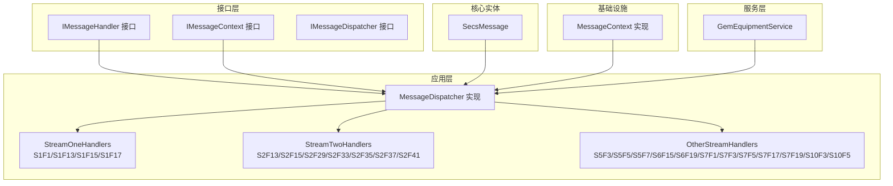
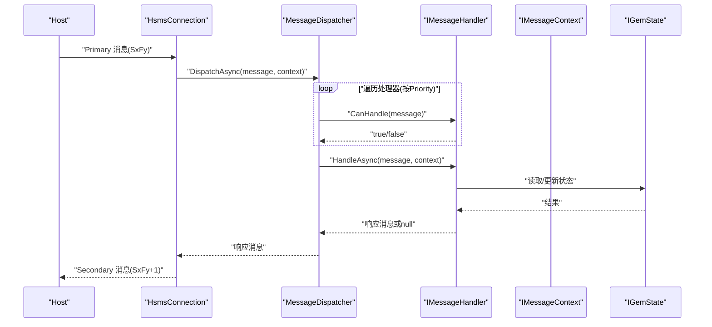
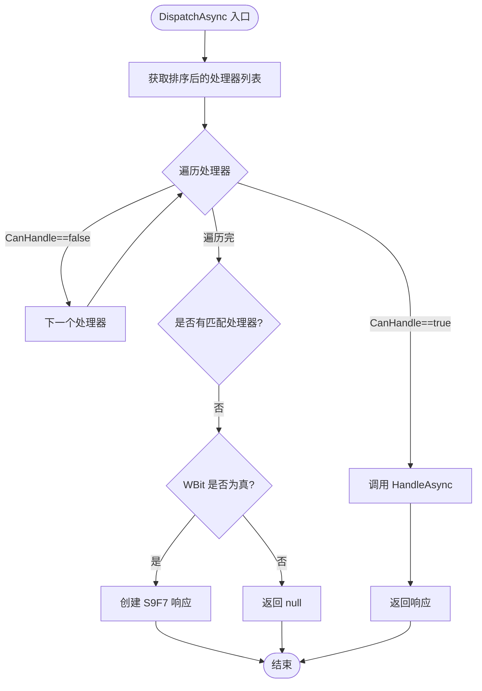
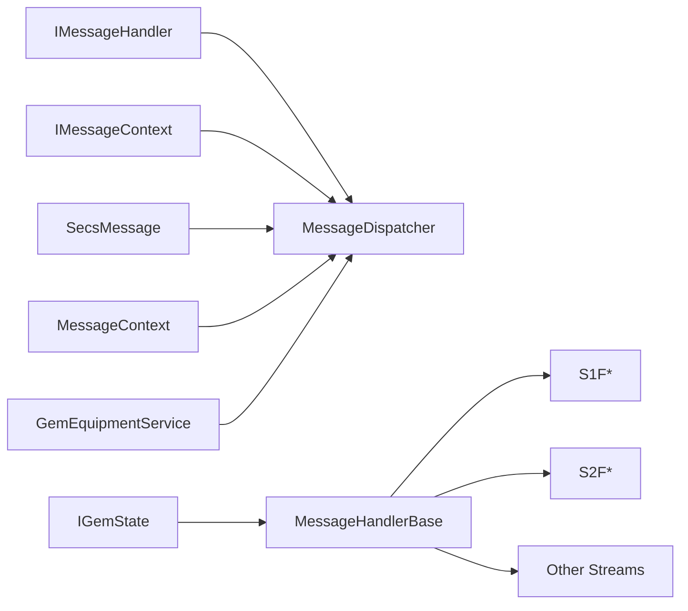

# 处理器系统

<cite>
**本文引用的文件**
- [IMessageHandler.cs](file://WebGem/SECS2GEM/Domain/Interfaces/IMessageHandler.cs)
- [MessageDispatcher.cs](file://WebGem/SECS2GEM/Application/Messaging/MessageDispatcher.cs)
- [StreamOneHandlers.cs](file://WebGem/SECS2GEM/Application/Handlers/StreamOneHandlers.cs)
- [StreamTwoHandlers.cs](file://WebGem/SECS2GEM/Application/Handlers/StreamTwoHandlers.cs)
- [OtherStreamHandlers.cs](file://WebGem/SECS2GEM/Application/Handlers/OtherStreamHandlers.cs)
- [SecsMessage.cs](file://WebGem/SECS2GEM/Core/Entities/SecsMessage.cs)
- [MessageContext.cs](file://WebGem/SECS2GEM/Infrastructure/Connection/MessageContext.cs)
- [IGemEquipmentService.cs](file://WebGem/SECS2GEM/Domain/Interfaces/IGemEquipmentService.cs)
- [GemEquipmentService.cs](file://WebGem/SECS2GEM/Application/Services/GemEquipmentService.cs)
- [MessageHandlerTests.cs](file://WebGem/SECS2GEM.Tests/MessageHandlerTests.cs)
- [IGemState.cs](file://WebGem/SECS2GEM/Domain/Interfaces/IGemState.cs)
- [IEventAggregator.cs](file://WebGem/SECS2GEM/Domain/Interfaces/IEventAggregator.cs)
</cite>

## 目录
1. [简介](#简介)
2. [项目结构](#项目结构)
3. [核心组件](#核心组件)
4. [架构总览](#架构总览)
5. [详细组件分析](#详细组件分析)
6. [依赖关系分析](#依赖关系分析)
7. [性能考量](#性能考量)
8. [故障排查指南](#故障排查指南)
9. [结论](#结论)
10. [附录](#附录)

## 简介
本文件面向处理器系统，系统性阐述 IMessageHandler 接口的设计理念与实现要求，涵盖消息匹配逻辑、处理流程、优先级机制、注册与注销流程、生命周期管理，并提供自定义处理器开发指南（消息验证、响应生成、错误处理最佳实践）。同时，针对不同 Stream 类型（1-10）的处理器实现差异进行深入解析，给出完整开发示例与调试技巧，帮助开发者快速上手并高质量扩展处理器体系。

## 项目结构
处理器系统主要分布在以下模块：
- 接口层：定义 IMessageHandler、IMessageContext、IMessageDispatcher 等核心接口
- 应用层：实现消息分发器 MessageDispatcher，以及各 Stream 的处理器集合
- 核心实体：SECS-II 消息模型 SecsMessage
- 基础设施：消息上下文 MessageContext，提供回复能力
- 服务层：设备服务 GemEquipmentService，负责生命周期与默认处理器注册
- 测试：MessageHandlerTests，验证处理器与分发器行为

图表来源
- [IMessageHandler.cs:50-129](file://WebGem/SECS2GEM/Domain/Interfaces/IMessageHandler.cs#L50-L129)
- [MessageDispatcher.cs:27-121](file://WebGem/SECS2GEM/Application/Messaging/MessageDispatcher.cs#L27-L121)
- [StreamOneHandlers.cs:20-210](file://WebGem/SECS2GEM/Application/Handlers/StreamOneHandlers.cs#L20-L210)
- [StreamTwoHandlers.cs:13-330](file://WebGem/SECS2GEM/Application/Handlers/StreamTwoHandlers.cs#L13-L330)
- [OtherStreamHandlers.cs:9-275](file://WebGem/SECS2GEM/Application/Handlers/OtherStreamHandlers.cs#L9-L275)
- [SecsMessage.cs:18-208](file://WebGem/SECS2GEM/Core/Entities/SecsMessage.cs#L18-L208)
- [MessageContext.cs:12-63](file://WebGem/SECS2GEM/Infrastructure/Connection/MessageContext.cs#L12-L63)
- [GemEquipmentService.cs:115-455](file://WebGem/SECS2GEM/Application/Services/GemEquipmentService.cs#L115-L455)

章节来源
- [IMessageHandler.cs:50-129](file://WebGem/SECS2GEM/Domain/Interfaces/IMessageHandler.cs#L50-L129)
- [MessageDispatcher.cs:27-121](file://WebGem/SECS2GEM/Application/Messaging/MessageDispatcher.cs#L27-L121)
- [GemEquipmentService.cs:115-455](file://WebGem/SECS2GEM/Application/Services/GemEquipmentService.cs#L115-L455)

## 核心组件
- IMessageHandler：策略模式的处理器接口，定义 CanHandle 与 HandleAsync 两个核心方法，支持 Priority 优先级属性
- IMessageContext：消息处理上下文，提供设备ID、连接、GEM状态、System Bytes、接收时间，以及 ReplyAsync 发送响应的能力
- IMessageDispatcher：责任链+策略模式的分发器，维护处理器列表，按优先级排序，逐个调用 CanHandle，找到首个匹配的处理器执行 HandleAsync
- MessageDispatcher：默认分发器实现，支持注册/注销处理器，未匹配时根据 WBit 决定返回 S9F7 或 null
- MessageHandlerBase：模板方法基类，统一异常处理、日志记录与错误响应生成，子类仅需实现 HandleCoreAsync
- SecsMessage：SECS-II 消息实体，封装 Stream/Function/WBit/Item 等字段，提供常用工厂方法与响应构造

章节来源
- [IMessageHandler.cs:50-129](file://WebGem/SECS2GEM/Domain/Interfaces/IMessageHandler.cs#L50-L129)
- [MessageDispatcher.cs:27-121](file://WebGem/SECS2GEM/Application/Messaging/MessageDispatcher.cs#L27-L121)
- [StreamOneHandlers.cs:20-86](file://WebGem/SECS2GEM/Application/Handlers/StreamOneHandlers.cs#L20-L86)
- [SecsMessage.cs:18-208](file://WebGem/SECS2GEM/Core/Entities/SecsMessage.cs#L18-L208)

## 架构总览
处理器系统采用“接口抽象 + 责任链 + 策略 + 模板方法”的组合架构：
- 接口层定义处理器契约与上下文契约
- 应用层通过 MessageDispatcher 实现消息路由与优先级匹配
- 基础设施层提供消息上下文，承载回复能力
- 服务层负责生命周期管理与默认处理器注册
- 各 Stream 的处理器实现遵循模板方法，统一异常与错误响应

图表来源
- [MessageDispatcher.cs:67-91](file://WebGem/SECS2GEM/Application/Messaging/MessageDispatcher.cs#L67-L91)
- [IMessageHandler.cs:75-87](file://WebGem/SECS2GEM/Domain/Interfaces/IMessageHandler.cs#L75-L87)
- [MessageContext.cs:59-62](file://WebGem/SECS2GEM/Infrastructure/Connection/MessageContext.cs#L59-L62)
- [IGemState.cs:20-163](file://WebGem/SECS2GEM/Domain/Interfaces/IGemState.cs#L20-L163)

## 详细组件分析

### IMessageHandler 接口与 MessageHandlerBase 基类
- 设计理念
  - 策略模式：每个 Stream/Function 组合可拥有独立处理器
  - 开闭原则：新增消息类型只需实现接口，无需修改既有代码
  - 模板方法：MessageHandlerBase 统一异常处理、日志记录与错误响应生成
- 关键点
  - Priority：数值越小优先级越高，默认 0；MessageDispatcher 按优先级升序排序
  - CanHandle：基于 Stream/Function 匹配；MessageHandlerBase 已实现精确匹配
  - HandleAsync：捕获异常并按 WBit 生成 S9F7 或返回 null；子类实现 HandleCoreAsync
  - CreateErrorResponse：默认生成 S9F7(7)，携带原始消息 Header

```mermaid
classDiagram
class IMessageHandler {
+int Priority
+bool CanHandle(message)
+Task~SecsMessage?~ HandleAsync(message, context, cancellationToken)
}
class MessageHandlerBase {
+virtual int Priority
#abstract byte Stream
#abstract byte Function
+virtual bool CanHandle(message)
+Task~SecsMessage?~ HandleAsync(message, context, cancellationToken)
#abstract Task~SecsMessage?~ HandleCoreAsync(message, context, cancellationToken)
#SecsMessage CreateErrorResponse(request)
}
class S1F1Handler
class S1F13Handler
class S1F15Handler
class S1F17Handler
class S2F13Handler
class S2F15Handler
class S2F29Handler
class S2F33Handler
class S2F35Handler
class S2F37Handler
class S2F41Handler
class S5F3Handler
class S5F5Handler
class S5F7Handler
class S6F15Handler
class S6F19Handler
class S7F1Handler
class S7F3Handler
class S7F5Handler
class S7F17Handler
class S7F19Handler
class S10F3Handler
class S10F5Handler
IMessageHandler <|.. MessageHandlerBase
MessageHandlerBase <|-- S1F1Handler
MessageHandlerBase <|-- S1F13Handler
MessageHandlerBase <|-- S1F15Handler
MessageHandlerBase <|-- S1F17Handler
MessageHandlerBase <|-- S2F13Handler
MessageHandlerBase <|-- S2F15Handler
MessageHandlerBase <|-- S2F29Handler
MessageHandlerBase <|-- S2F33Handler
MessageHandlerBase <|-- S2F35Handler
MessageHandlerBase <|-- S2F37Handler
MessageHandlerBase <|-- S2F41Handler
MessageHandlerBase <|-- S5F3Handler
MessageHandlerBase <|-- S5F5Handler
MessageHandlerBase <|-- S5F7Handler
MessageHandlerBase <|-- S6F15Handler
MessageHandlerBase <|-- S6F19Handler
MessageHandlerBase <|-- S7F1Handler
MessageHandlerBase <|-- S7F3Handler
MessageHandlerBase <|-- S7F5Handler
MessageHandlerBase <|-- S7F17Handler
MessageHandlerBase <|-- S7F19Handler
MessageHandlerBase <|-- S10F3Handler
MessageHandlerBase <|-- S10F5Handler
```

图表来源
- [IMessageHandler.cs:63-87](file://WebGem/SECS2GEM/Domain/Interfaces/IMessageHandler.cs#L63-L87)
- [StreamOneHandlers.cs:20-86](file://WebGem/SECS2GEM/Application/Handlers/StreamOneHandlers.cs#L20-L86)
- [StreamTwoHandlers.cs:13-138](file://WebGem/SECS2GEM/Application/Handlers/StreamTwoHandlers.cs#L13-L138)
- [OtherStreamHandlers.cs:9-275](file://WebGem/SECS2GEM/Application/Handlers/OtherStreamHandlers.cs#L9-L275)

章节来源
- [IMessageHandler.cs:63-87](file://WebGem/SECS2GEM/Domain/Interfaces/IMessageHandler.cs#L63-L87)
- [StreamOneHandlers.cs:20-86](file://WebGem/SECS2GEM/Application/Handlers/StreamOneHandlers.cs#L20-L86)

### 消息分发器 MessageDispatcher
- 职责
  - 维护处理器列表，按 Priority 升序排序
  - 收到消息后遍历处理器，调用 CanHandle 找到首个匹配者
  - 调用 HandleAsync 并返回响应；若无匹配且 WBit=true，则返回 S9F7
- 注册/注销
  - RegisterHandler：添加处理器并标记未排序
  - UnregisterHandler：移除处理器
- 性能特性
  - 排序缓存：首次排序后缓存结果，避免重复排序
  - 线程安全：使用锁保护处理器列表与排序状态

图表来源
- [MessageDispatcher.cs:67-91](file://WebGem/SECS2GEM/Application/Messaging/MessageDispatcher.cs#L67-L91)
- [MessageDispatcher.cs:96-108](file://WebGem/SECS2GEM/Application/Messaging/MessageDispatcher.cs#L96-L108)

章节来源
- [MessageDispatcher.cs:27-121](file://WebGem/SECS2GEM/Application/Messaging/MessageDispatcher.cs#L27-L121)

### Stream 1 处理器（设备状态）
- S1F1：Are You There，返回设备型号与软件版本
- S1F13：Establish Communications Request，设置通信状态为 Communicating，返回 COMMACK 与设备信息
- S1F15：Request OFF-LINE，尝试切换到离线，返回 OFLACK
- S1F17：Request ON-LINE，尝试切换到在线并进入 Remote 模式，返回 ONLACK
- 特殊处理：均继承 MessageHandlerBase，自动捕获异常并按 WBit 生成 S9F7

章节来源
- [StreamOneHandlers.cs:89-210](file://WebGem/SECS2GEM/Application/Handlers/StreamOneHandlers.cs#L89-L210)

### Stream 2 处理器（设备控制）
- S2F13：Equipment Constant Request，查询设备常量；支持全量或指定 ECID 列表
- S2F15：New Equipment Constant Send，设置设备常量；返回 EAC
- S2F29：Equipment Constant Namelist Request，返回设备常量定义清单
- S2F33：Define Report，简化实现：接受所有报告定义，返回 DRACK
- S2F35：Link Event Report，简化实现：接受所有事件报告链接，返回 LRACK
- S2F37：Enable/Disable Event Report，简化实现：接受所有启用/禁用请求，返回 ERACK
- S2F41：Host Command Send，支持注册自定义 RCMD 命令，返回 HCACK 与参数确认列表
- 特殊处理：S2F13/S2F15 对 SecsItem 值进行格式提取与类型转换；S2F41 支持动态命令注册

章节来源
- [StreamTwoHandlers.cs:13-330](file://WebGem/SECS2GEM/Application/Handlers/StreamTwoHandlers.cs#L13-L330)

### 其他 Stream 处理器（5-10）
- S5F3/S5F5/S5F7：Alarm Management，简化实现：接受启用/禁用、列出报警与启用报警请求，返回 ACKC5/空列表
- S6F15/S6F19：Data Collection，请求事件/报告数据，简化实现：返回空报告
- S7F1/S7F3/S7F5/S7F17/S7F19：Process Program Management，简化实现：接受加载/发送/请求/删除/当前 EPPD，返回相应 ACK
- S10F3/S10F5：Terminal Services，单块/多块终端显示，简化实现：接受显示请求，返回 ACKC10
- 特殊处理：均为简化实现，便于快速集成与演示

章节来源
- [OtherStreamHandlers.cs:9-275](file://WebGem/SECS2GEM/Application/Handlers/OtherStreamHandlers.cs#L9-L275)

### 消息上下文 IMessageContext 与 MessageContext
- 提供设备ID、连接、GEM状态、System Bytes、接收时间
- ReplyAsync：委托底层连接发送响应消息
- 在 MessageDispatcher 中，上下文由连接层注入，确保处理器可直接回复

章节来源
- [IMessageHandler.cs:15-48](file://WebGem/SECS2GEM/Domain/Interfaces/IMessageHandler.cs#L15-L48)
- [MessageContext.cs:12-63](file://WebGem/SECS2GEM/Infrastructure/Connection/MessageContext.cs#L12-L63)

### 设备服务与生命周期管理
- GemEquipmentService：负责服务启动/停止、连接管理、事件聚合、默认处理器注册
- 默认处理器注册：在构造函数中调用 RegisterDefaultHandlers，按 Stream 分组注册对应处理器
- 自定义处理器注册：通过 RegisterHandler 动态注册，立即生效

章节来源
- [GemEquipmentService.cs:115-455](file://WebGem/SECS2GEM/Application/Services/GemEquipmentService.cs#L115-L455)

## 依赖关系分析
- IMessageHandler 与 IMessageDispatcher：分发器持有处理器集合，按优先级匹配
- MessageHandlerBase 与各具体处理器：模板方法统一异常与错误响应
- IMessageContext 与 MessageContext：上下文提供回复能力
- SecsMessage：作为输入输出载体贯穿整个处理链
- IGemState：处理器读取/更新设备状态
- IGemEquipmentService：服务层负责生命周期与默认处理器注册

图表来源
- [IMessageHandler.cs:63-87](file://WebGem/SECS2GEM/Domain/Interfaces/IMessageHandler.cs#L63-L87)
- [MessageDispatcher.cs:27-121](file://WebGem/SECS2GEM/Application/Messaging/MessageDispatcher.cs#L27-L121)
- [MessageContext.cs:12-63](file://WebGem/SECS2GEM/Infrastructure/Connection/MessageContext.cs#L12-L63)
- [GemEquipmentService.cs:115-455](file://WebGem/SECS2GEM/Application/Services/GemEquipmentService.cs#L115-L455)

章节来源
- [IMessageHandler.cs:63-87](file://WebGem/SECS2GEM/Domain/Interfaces/IMessageHandler.cs#L63-L87)
- [MessageDispatcher.cs:27-121](file://WebGem/SECS2GEM/Application/Messaging/MessageDispatcher.cs#L27-L121)

## 性能考量
- 优先级排序缓存：MessageDispatcher 首次排序后缓存结果，避免重复排序开销
- 线程安全：注册/注销与排序过程使用锁保护，确保并发安全
- 异常处理：MessageHandlerBase 捕获异常并按 WBit 生成 S9F7，减少异常传播成本
- 处理器数量：默认处理器按 Stream 分组注册，建议按需裁剪以降低匹配轮询次数

[本节为通用性能讨论，不直接分析具体文件]

## 故障排查指南
- 无处理器匹配
  - 现象：返回 S9F7 或 null（取决于 WBit）
  - 排查：确认是否已注册对应 Stream/Function 的处理器；检查 CanHandle 匹配条件
- 优先级问题
  - 现象：自定义处理器未生效
  - 排查：检查 Priority 数值（越小优先级越高）；确认排序是否被缓存
- 异常导致无响应
  - 现象：异常未被捕获导致无响应
  - 排查：确认是否继承 MessageHandlerBase；检查异常路径是否生成 S9F7
- 上下文回复失败
  - 现象：ReplyAsync 未发送响应
  - 排查：确认 IMessageContext 注入正确；检查连接层回复逻辑

章节来源
- [MessageDispatcher.cs:83-91](file://WebGem/SECS2GEM/Application/Messaging/MessageDispatcher.cs#L83-L91)
- [StreamOneHandlers.cs:53-66](file://WebGem/SECS2GEM/Application/Handlers/StreamOneHandlers.cs#L53-L66)
- [MessageContext.cs:59-62](file://WebGem/SECS2GEM/Infrastructure/Connection/MessageContext.cs#L59-L62)

## 结论
处理器系统通过接口抽象、责任链与策略模式实现了高内聚、低耦合的消息处理架构；模板方法基类统一了异常与错误响应处理；分发器支持优先级与动态注册，满足扩展需求。针对不同 Stream 的处理器实现差异清晰，便于按需定制。结合测试用例与调试技巧，开发者可快速构建高质量的自定义处理器。

[本节为总结性内容，不直接分析具体文件]

## 附录

### 自定义处理器开发指南
- 设计步骤
  - 继承 MessageHandlerBase，重写 Stream/Function 属性与 HandleCoreAsync
  - 在 HandleCoreAsync 中完成消息验证、业务处理与响应生成
  - 如需覆盖默认行为，设置较低的 Priority 值
- 消息验证
  - 使用 SecsMessage 的 IsPrimary/IsSecondary 等属性辅助判断
  - 对 Item 进行格式与范围校验，必要时抛出明确异常
- 响应生成
  - 使用 SecsMessage.CreateReply 或工厂方法构造响应
  - 对于错误情况，优先返回 S9F7（当 WBit 为真时）
- 错误处理
  - 保持异常捕获与 S9F7 生成的一致性
  - 对于非 WBit 消息，可返回 null 表示不响应
- 生命周期管理
  - 在 GemEquipmentService.StartAsync 后注册自定义处理器
  - 通过 RegisterHandler 动态注册，UnregisterHandler 动态注销
- 最佳实践
  - 明确优先级，避免与默认处理器冲突
  - 保持处理器职责单一，复杂逻辑拆分为子方法
  - 使用 IGemState 读取/更新状态，避免直接操作内部状态

章节来源
- [IMessageHandler.cs:63-87](file://WebGem/SECS2GEM/Domain/Interfaces/IMessageHandler.cs#L63-L87)
- [StreamOneHandlers.cs:20-86](file://WebGem/SECS2GEM/Application/Handlers/StreamOneHandlers.cs#L20-L86)
- [GemEquipmentService.cs:445-451](file://WebGem/SECS2GEM/Application/Services/GemEquipmentService.cs#L445-L451)

### 不同 Stream 类型的处理器实现差异
- Stream 1（设备状态）
  - 侧重状态查询与通信建立，典型消息：S1F1/S1F13/S1F15/S1F17
  - 处理器直接读取/更新 IGemState，返回标准响应
- Stream 2（设备控制）
  - 侧重设备常量与事件报告管理，典型消息：S2F13/S2F15/S2F29/S2F33/S2F35/S2F37/S2F41
  - 需要对 SecsItem 值进行格式提取与类型转换；S2F41 支持动态命令注册
- Stream 5（报警管理）
  - 简化实现：接受启用/禁用、列出报警与启用报警请求
- Stream 6（数据采集）
  - 简化实现：请求事件/报告数据，返回空报告
- Stream 7（配方管理）
  - 简化实现：接受加载/发送/请求/删除/当前 EPPD
- Stream 10（终端服务）
  - 简化实现：单块/多块终端显示，返回 ACKC10

章节来源
- [StreamOneHandlers.cs:89-210](file://WebGem/SECS2GEM/Application/Handlers/StreamOneHandlers.cs#L89-L210)
- [StreamTwoHandlers.cs:13-330](file://WebGem/SECS2GEM/Application/Handlers/StreamTwoHandlers.cs#L13-L330)
- [OtherStreamHandlers.cs:9-275](file://WebGem/SECS2GEM/Application/Handlers/OtherStreamHandlers.cs#L9-L275)

### 完整开发示例与调试技巧
- 示例：自定义 S1F1 处理器
  - 继承 MessageHandlerBase，重写 Stream/Function 与 HandleCoreAsync
  - 返回 S1F2 响应，包含设备型号与软件版本
- 示例：自定义 S2F41 命令处理器
  - 注册命令：RegisterCommand("RCMD", handler)
  - 在 HandleCoreAsync 中解析 RCMD 与参数，返回 HCACK 与参数确认列表
- 调试技巧
  - 使用测试用例验证 CanHandle 与 HandleAsync 行为
  - 通过 MessageDispatcher 的优先级测试，确认覆盖顺序
  - 在异常路径验证 S9F7 生成逻辑

章节来源
- [MessageHandlerTests.cs:24-220](file://WebGem/SECS2GEM.Tests/MessageHandlerTests.cs#L24-L220)
- [StreamOneHandlers.cs:94-114](file://WebGem/SECS2GEM/Application/Handlers/StreamOneHandlers.cs#L94-L114)
- [StreamTwoHandlers.cs:270-330](file://WebGem/SECS2GEM/Application/Handlers/StreamTwoHandlers.cs#L270-L330)