# 消息处理器基类

<cite>
**本文档引用的文件**
- [StreamOneHandlers.cs](file://WebGem/SECS2GEM/Application/Handlers/StreamOneHandlers.cs)
- [IMessageHandler.cs](file://WebGem/SECS2GEM/Domain/Interfaces/IMessageHandler.cs)
- [MessageDispatcher.cs](file://WebGem/SECS2GEM/Application/Messaging/MessageDispatcher.cs)
- [SecsMessage.cs](file://WebGem/SECS2GEM/Core/Entities/SecsMessage.cs)
- [MessageHandlerTests.cs](file://WebGem/SECS2GEM.Tests/MessageHandlerTests.cs)
- [GemStates.cs](file://WebGem/SECS2GEM/Core/Enums/GemStates.cs)
- [MessageLogger.cs](file://WebGem/SECS2GEM/Infrastructure/Logging/MessageLogger.cs)
- [StreamTwoHandlers.cs](file://WebGem/SECS2GEM/Application/Handlers/StreamTwoHandlers.cs)
- [OtherStreamHandlers.cs](file://WebGem/SECS2GEM/Application/Handlers/OtherStreamHandlers.cs)
</cite>

## 目录
1. [简介](#简介)
2. [项目结构](#项目结构)
3. [核心组件](#核心组件)
4. [架构概览](#架构概览)
5. [详细组件分析](#详细组件分析)
6. [依赖关系分析](#依赖关系分析)
7. [性能考虑](#性能考虑)
8. [故障排除指南](#故障排除指南)
9. [结论](#结论)

## 简介

消息处理器基类是SECS2GEM项目中消息处理系统的核心抽象层，基于模板方法模式设计，为所有SECS-II消息处理器提供统一的处理框架。该基类实现了标准的处理流程，包括消息匹配、异常处理、日志记录和响应生成，同时允许子类专注于具体的业务逻辑实现。

SECS2GEM遵循SEMI E30标准，支持完整的GEM（Generic Equipment Model）协议，涵盖设备状态管理、通信控制、数据采集、配方管理等多个功能领域。消息处理器基类的设计体现了面向对象设计的最佳实践，通过抽象化公共逻辑和策略化具体实现，实现了高度的模块化和可扩展性。

## 项目结构

SECS2GEM项目的整体架构采用分层设计，消息处理系统位于应用层的核心位置：

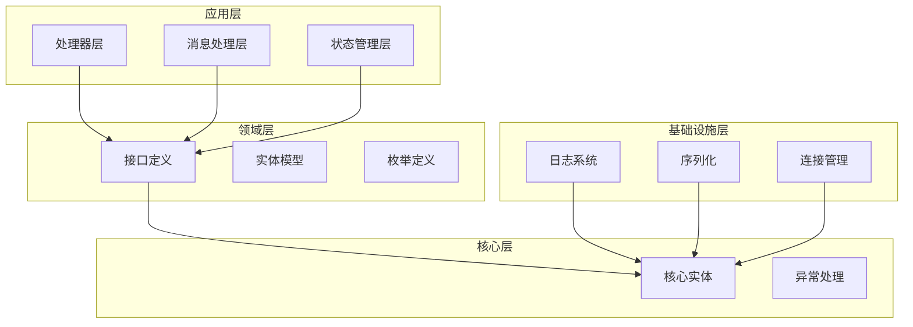

**图表来源**
- [StreamOneHandlers.cs:1-211](file://WebGem/SECS2GEM/Application/Handlers/StreamOneHandlers.cs#L1-L211)
- [IMessageHandler.cs:1-131](file://WebGem/SECS2GEM/Domain/Interfaces/IMessageHandler.cs#L1-L131)

**章节来源**
- [StreamOneHandlers.cs:1-211](file://WebGem/SECS2GEM/Application/Handlers/StreamOneHandlers.cs#L1-L211)
- [IMessageHandler.cs:1-131](file://WebGem/SECS2GEM/Domain/Interfaces/IMessageHandler.cs#L1-L131)

## 核心组件

### 消息处理器基类设计

消息处理器基类是整个消息处理系统的核心，它定义了标准的处理流程和接口规范：

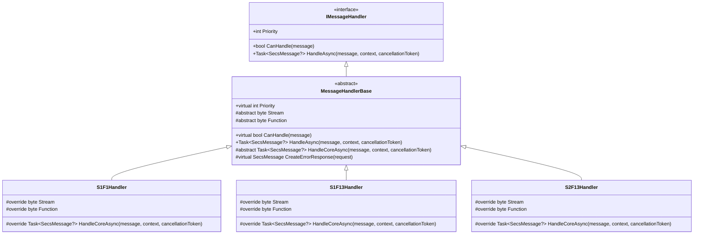

**图表来源**
- [StreamOneHandlers.cs:20-86](file://WebGem/SECS2GEM/Application/Handlers/StreamOneHandlers.cs#L20-L86)
- [StreamOneHandlers.cs:94-114](file://WebGem/SECS2GEM/Application/Handlers/StreamOneHandlers.cs#L94-L114)
- [StreamOneHandlers.cs:122-149](file://WebGem/SECS2GEM/Application/Handlers/StreamOneHandlers.cs#L122-L149)

### 模板方法模式实现

消息处理器基类采用了经典的模板方法模式，定义了处理流程的骨架：

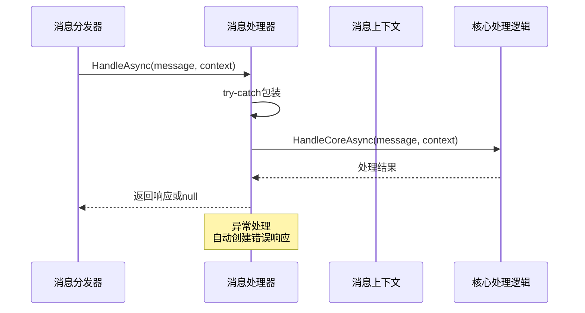

**图表来源**
- [StreamOneHandlers.cs:48-86](file://WebGem/SECS2GEM/Application/Handlers/StreamOneHandlers.cs#L48-L86)

**章节来源**
- [StreamOneHandlers.cs:20-86](file://WebGem/SECS2GEM/Application/Handlers/StreamOneHandlers.cs#L20-L86)

## 架构概览

消息处理系统的整体架构基于责任链模式和策略模式的组合：

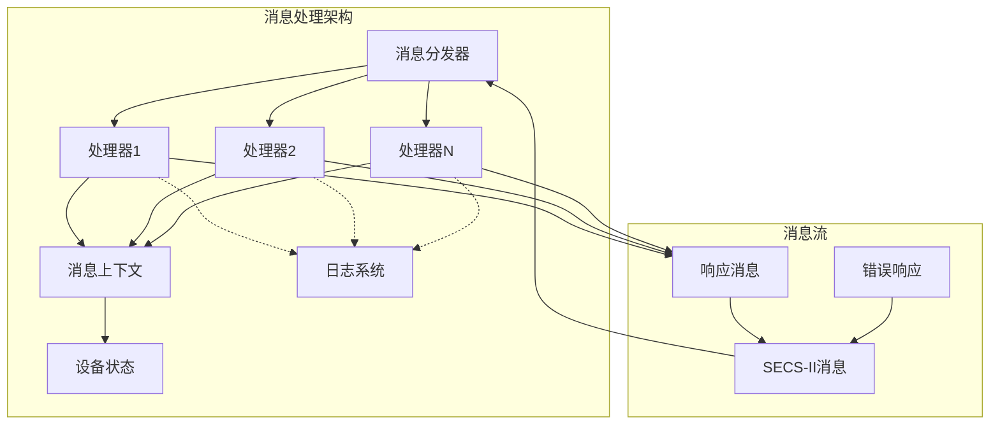

**图表来源**
- [MessageDispatcher.cs:27-91](file://WebGem/SECS2GEM/Application/Messaging/MessageDispatcher.cs#L27-L91)
- [IMessageHandler.cs:63-88](file://WebGem/SECS2GEM/Domain/Interfaces/IMessageHandler.cs#L63-L88)

### 优先级机制

消息处理器支持优先级机制，确保消息能够按照预定义的顺序被处理：

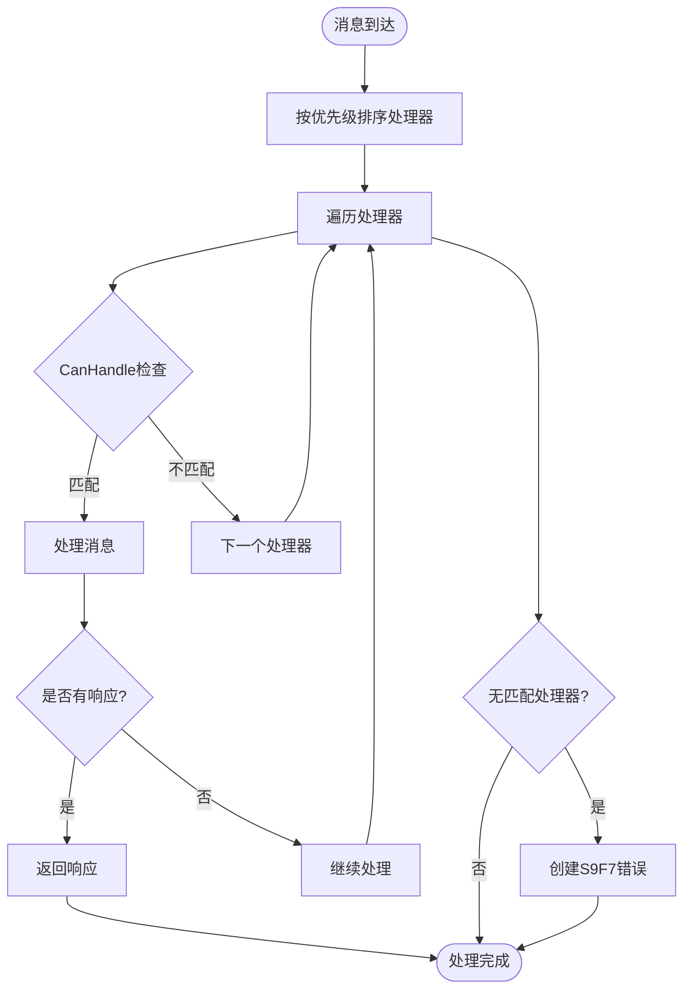

**图表来源**
- [MessageDispatcher.cs:96-108](file://WebGem/SECS2GEM/Application/Messaging/MessageDispatcher.cs#L96-L108)

**章节来源**
- [MessageDispatcher.cs:27-122](file://WebGem/SECS2GEM/Application/Messaging/MessageDispatcher.cs#L27-L122)

## 详细组件分析

### 消息处理器基类详解

#### Priority属性优先级机制

Priority属性定义了处理器的执行优先级，数值越小优先级越高。这是消息分发系统的核心机制：

| 优先级范围 | 用途 | 示例 |
|-----------|------|------|
| 0-99 | 高优先级处理器 | 特殊控制消息、紧急状态处理 |
| 100-199 | 标准处理器 | 常规业务逻辑处理 |
| 200+ | 低优先级处理器 | 辅助功能、调试信息 |

优先级机制确保了关键消息能够得到及时处理，同时允许用户自定义处理器的执行顺序。

#### CanHandle方法消息匹配逻辑

CanHandle方法实现了精确的消息匹配，基于Stream和Function两个关键属性：

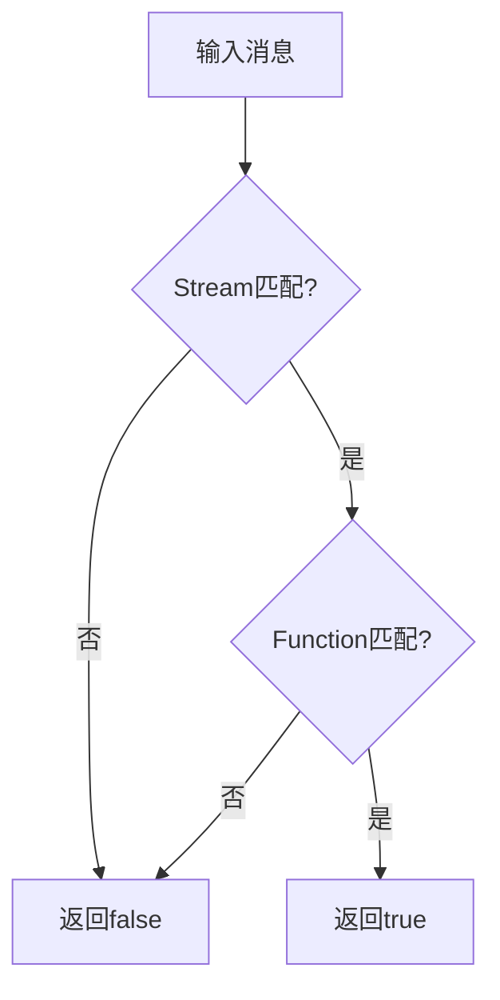

**图表来源**
- [StreamOneHandlers.cs:40-43](file://WebGem/SECS2GEM/Application/Handlers/StreamOneHandlers.cs#L40-L43)

#### HandleAsync方法完整处理流程

HandleAsync方法实现了完整的处理流程，包含了异常处理和响应生成：

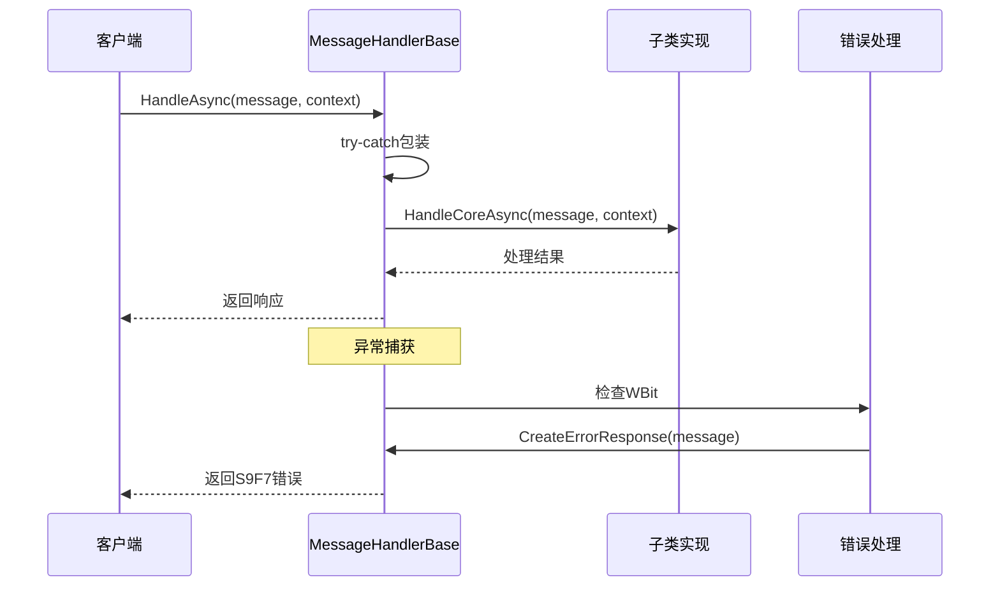

**图表来源**
- [StreamOneHandlers.cs:48-86](file://WebGem/SECS2GEM/Application/Handlers/StreamOneHandlers.cs#L48-L86)

**章节来源**
- [StreamOneHandlers.cs:40-86](file://WebGem/SECS2GEM/Application/Handlers/StreamOneHandlers.cs#L40-L86)

### 异常处理机制

消息处理器基类提供了完善的异常处理机制，确保系统在异常情况下仍能正常运行：

#### 异常捕获策略

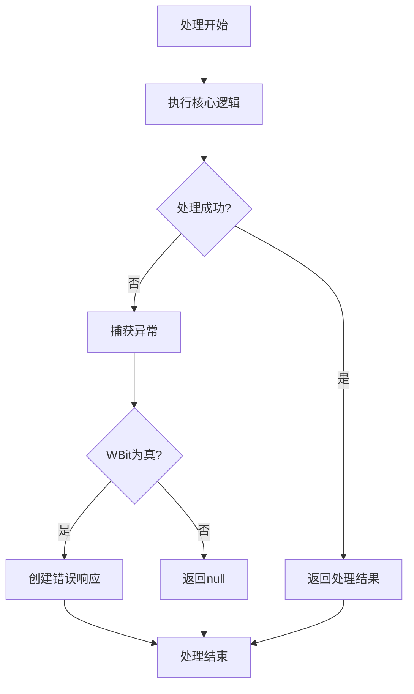

**图表来源**
- [StreamOneHandlers.cs:53-66](file://WebGem/SECS2GEM/Application/Handlers/StreamOneHandlers.cs#L53-L66)

#### 错误响应生成

CreateErrorResponse方法负责生成标准的SECS-II错误响应，遵循SEMI E30标准：

| 错误类型 | Stream | Function | 用途 |
|----------|--------|----------|------|
| 非法数据 | 9 | 7 | 通用错误响应 |
| 设备ID错误 | 9 | 1 | 设备ID相关错误 |
| 流错误 | 9 | 3 | Stream参数错误 |
| 功能错误 | 9 | 5 | Function参数错误 |
| 数据错误 | 9 | 7 | 消息数据格式错误 |
| 超时错误 | 9 | 9 | 通信超时错误 |

**章节来源**
- [StreamOneHandlers.cs:79-85](file://WebGem/SECS2GEM/Application/Handlers/StreamOneHandlers.cs#L79-L85)

### 日志记录和错误响应

#### 日志记录集成

消息处理器基类虽然不直接包含日志逻辑，但通过IMessageContext接口与日志系统集成：

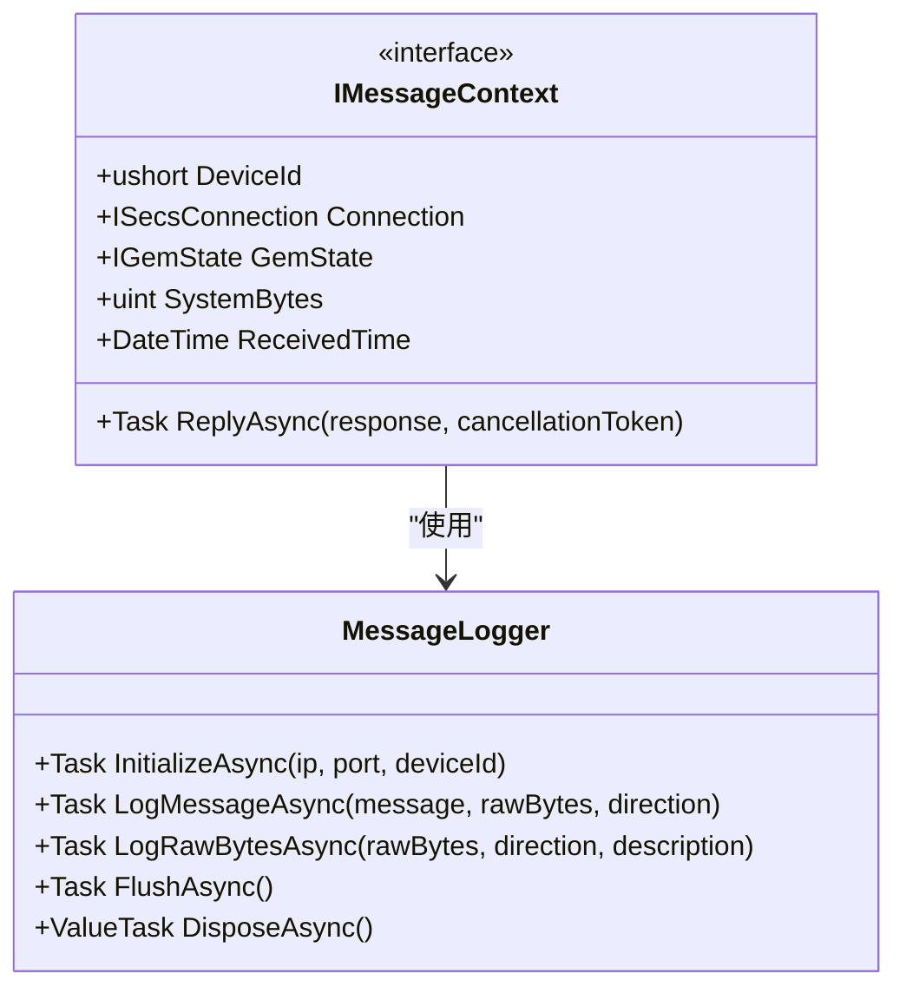

**图表来源**
- [IMessageHandler.cs:15-48](file://WebGem/SECS2GEM/Domain/Interfaces/IMessageHandler.cs#L15-L48)
- [MessageLogger.cs:23-438](file://WebGem/SECS2GEM/Infrastructure/Logging/MessageLogger.cs#L23-L438)

#### 错误响应生成场景

错误响应生成主要发生在以下场景：

1. **异常处理**：核心处理逻辑抛出异常时
2. **消息格式错误**：无法解析或验证消息时
3. **权限不足**：处理器无权处理特定消息时
4. **系统资源不足**：内存、CPU等资源不足时

**章节来源**
- [MessageLogger.cs:23-438](file://WebGem/SECS2GEM/Infrastructure/Logging/MessageLogger.cs#L23-L438)

### 继承示例和最佳实践

#### 基础处理器实现

以下是一个完整的处理器实现示例：

```mermaid
classDiagram
class MessageHandlerBase {
<<abstract>>
+virtual int Priority
#abstract byte Stream
#abstract byte Function
+virtual bool CanHandle(message)
+Task~SecsMessage?~ HandleAsync(message, context, cancellationToken)
#abstract Task~SecsMessage?~ HandleCoreAsync(message, context, cancellationToken)
#virtual SecsMessage CreateErrorResponse(request)
}
class ExampleHandler {
#override byte Stream = 1
#override byte Function = 1
#override Task~SecsMessage?~ HandleCoreAsync(message, context, cancellationToken) {
// 实现具体的业务逻辑
return Task.FromResult<SecsMessage?>(response);
}
}
MessageHandlerBase <|-- ExampleHandler
```

**图表来源**
- [StreamOneHandlers.cs:94-114](file://WebGem/SECS2GEM/Application/Handlers/StreamOneHandlers.cs#L94-L114)

#### 最佳实践建议

1. **优先级设置**
   - 为关键处理器设置较低的优先级值
   - 避免优先级冲突，确保唯一性
   - 考虑处理器间的依赖关系

2. **异常处理**
   - 在HandleCoreAsync中进行详细的异常捕获
   - 提供有意义的错误信息
   - 避免吞掉重要的异常信息

3. **性能优化**
   - 避免在处理器中执行长时间阻塞操作
   - 使用异步编程模式
   - 合理使用缓存机制

4. **代码组织**
   - 每个处理器只处理单一消息类型
   - 保持处理器的职责单一性
   - 提供清晰的错误信息

**章节来源**
- [StreamOneHandlers.cs:94-211](file://WebGem/SECS2GEM/Application/Handlers/StreamOneHandlers.cs#L94-L211)

## 依赖关系分析

消息处理器基类的依赖关系体现了良好的分层设计：

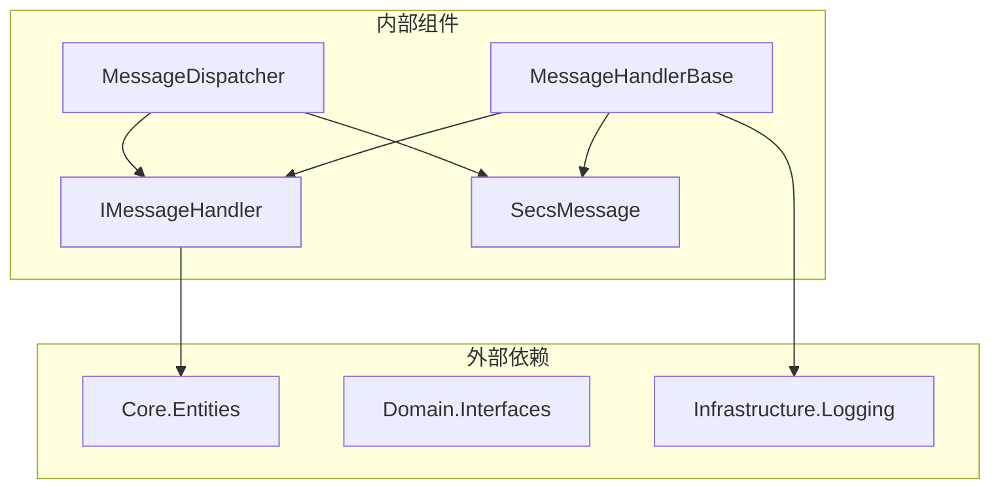

**图表来源**
- [StreamOneHandlers.cs:1-211](file://WebGem/SECS2GEM/Application/Handlers/StreamOneHandlers.cs#L1-L211)
- [IMessageHandler.cs:1-131](file://WebGem/SECS2GEM/Domain/Interfaces/IMessageHandler.cs#L1-L131)

### 处理器类型分布

项目中不同类型的消息处理器分布如下：

| 处理器类型 | 数量 | 示例 |
|-----------|------|------|
| S1F1系列 | 4 | 连接检测、通信建立、状态切换 |
| S2F13系列 | 6 | 设备常量管理、报告定义 |
| S5F3系列 | 3 | 报警管理 |
| S6F15系列 | 2 | 事件报告 |
| S7F1系列 | 5 | 配方管理 |
| S10F3系列 | 2 | 终端显示 |

**章节来源**
- [StreamOneHandlers.cs:94-211](file://WebGem/SECS2GEM/Application/Handlers/StreamOneHandlers.cs#L94-L211)
- [StreamTwoHandlers.cs:13-331](file://WebGem/SECS2GEM/Application/Handlers/StreamTwoHandlers.cs#L13-L331)
- [OtherStreamHandlers.cs:9-276](file://WebGem/SECS2GEM/Application/Handlers/OtherStreamHandlers.cs#L9-L276)

## 性能考虑

### 处理器注册和查找

消息分发器使用线程安全的列表存储处理器，并在需要时进行排序：

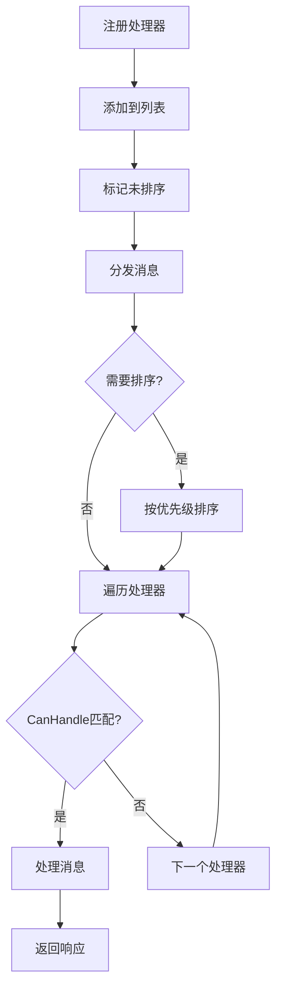

**图表来源**
- [MessageDispatcher.cs:37-108](file://WebGem/SECS2GEM/Application/Messaging/MessageDispatcher.cs#L37-L108)

### 异步处理优化

消息处理器基类完全支持异步处理模式，避免阻塞主线程：

1. **异步I/O操作**：数据库访问、网络通信
2. **并发处理**：多个消息同时处理
3. **资源管理**：及时释放异步资源

### 内存管理

1. **对象池**：重用消息对象
2. **垃圾回收**：及时释放临时对象
3. **内存监控**：定期检查内存使用情况

## 故障排除指南

### 常见问题诊断

#### 处理器不匹配问题

当消息无法被任何处理器处理时，系统会返回S9F7错误：

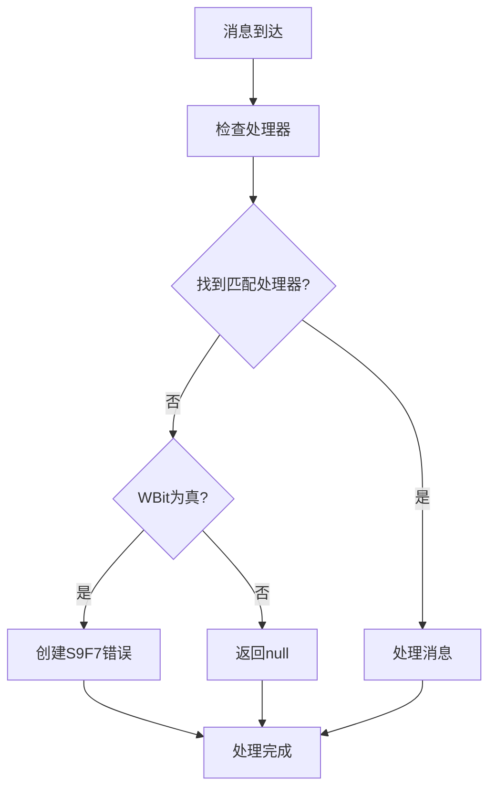

**图表来源**
- [MessageDispatcher.cs:74-91](file://WebGem/SECS2GEM/Application/Messaging/MessageDispatcher.cs#L74-L91)

#### 优先级冲突解决

当多个处理器都声称能处理同一消息时，系统会根据优先级决定：

1. **检查处理器列表**：确认所有处理器的优先级设置
2. **验证CanHandle实现**：确保匹配逻辑正确
3. **测试处理器顺序**：验证优先级排序效果

#### 异常处理调试

1. **启用详细日志**：记录异常堆栈信息
2. **检查上下文信息**：验证消息上下文的完整性
3. **单元测试覆盖**：编写针对异常场景的测试用例

**章节来源**
- [MessageHandlerTests.cs:165-220](file://WebGem/SECS2GEM.Tests/MessageHandlerTests.cs#L165-L220)

### 性能问题排查

#### 处理器性能监控

1. **响应时间测量**：记录每个处理器的处理时间
2. **并发性能测试**：模拟高并发场景
3. **内存泄漏检测**：监控内存使用趋势

#### 优化建议

1. **处理器合并**：将功能相似的处理器合并
2. **缓存策略**：实现适当的缓存机制
3. **异步优化**：改进异步处理模式

## 结论

消息处理器基类是SECS2GEM项目中设计精良的抽象层，它成功地将模板方法模式应用于消息处理场景，为开发者提供了清晰的扩展点和强大的功能。通过统一的处理流程、完善的异常处理机制和灵活的优先级系统，该基类确保了消息处理系统的稳定性、可维护性和可扩展性。

该设计充分体现了面向对象设计的最佳实践，通过抽象化公共逻辑和策略化具体实现，实现了高度的模块化。同时，与其他组件的良好集成确保了整个系统的协调运作。

对于开发者而言，理解和掌握消息处理器基类的设计理念和实现细节，是开发高质量SECS-II消息处理功能的关键。通过遵循最佳实践和充分利用提供的工具，可以快速构建稳定可靠的消息处理系统。