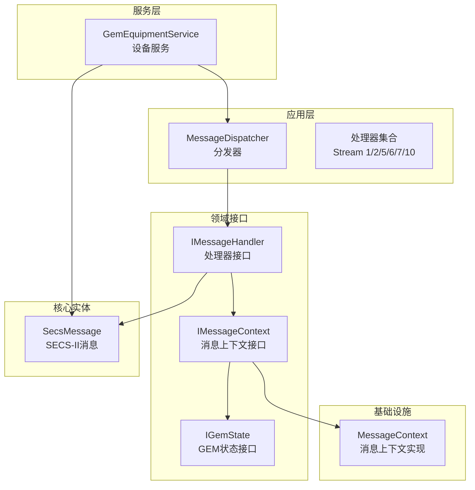
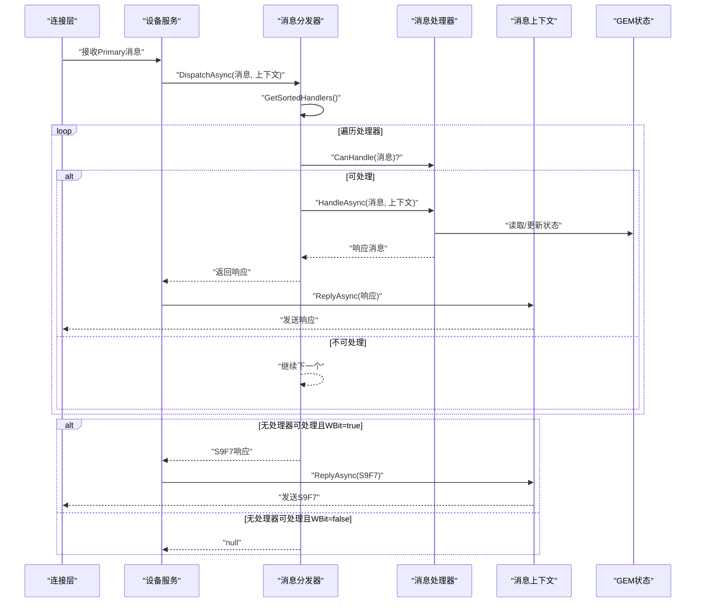
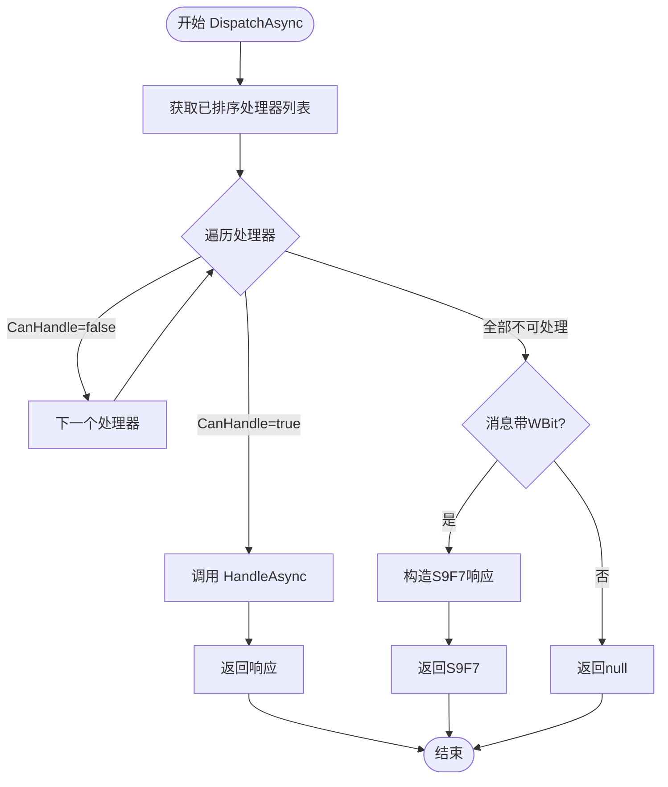
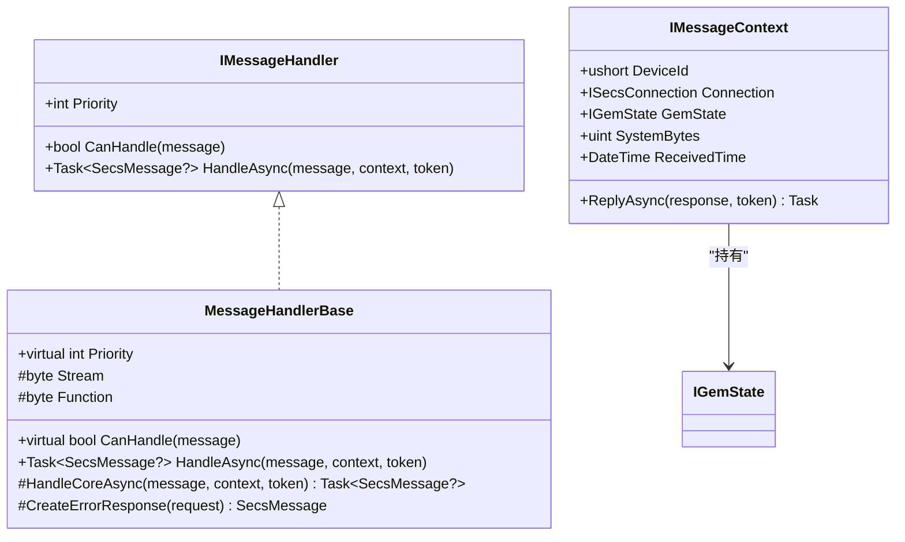
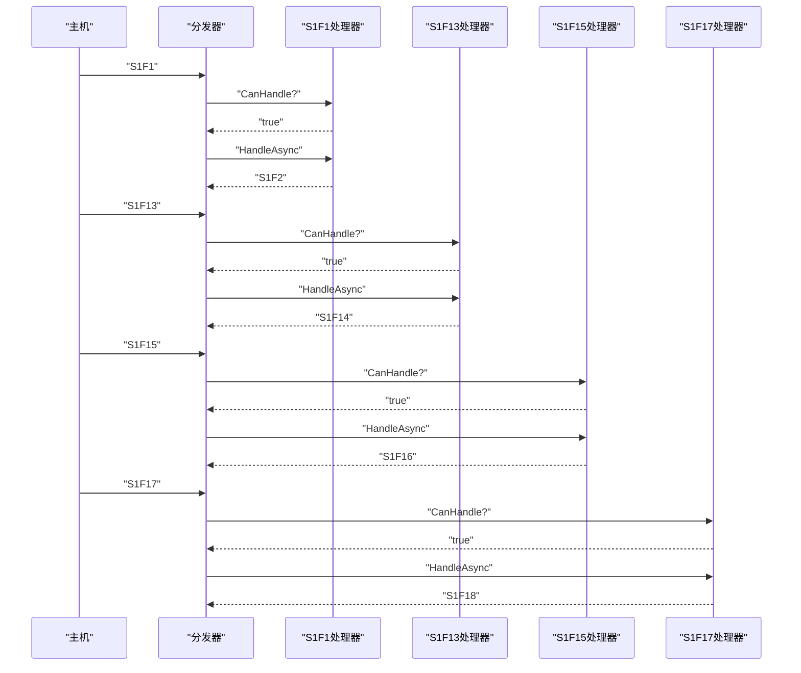
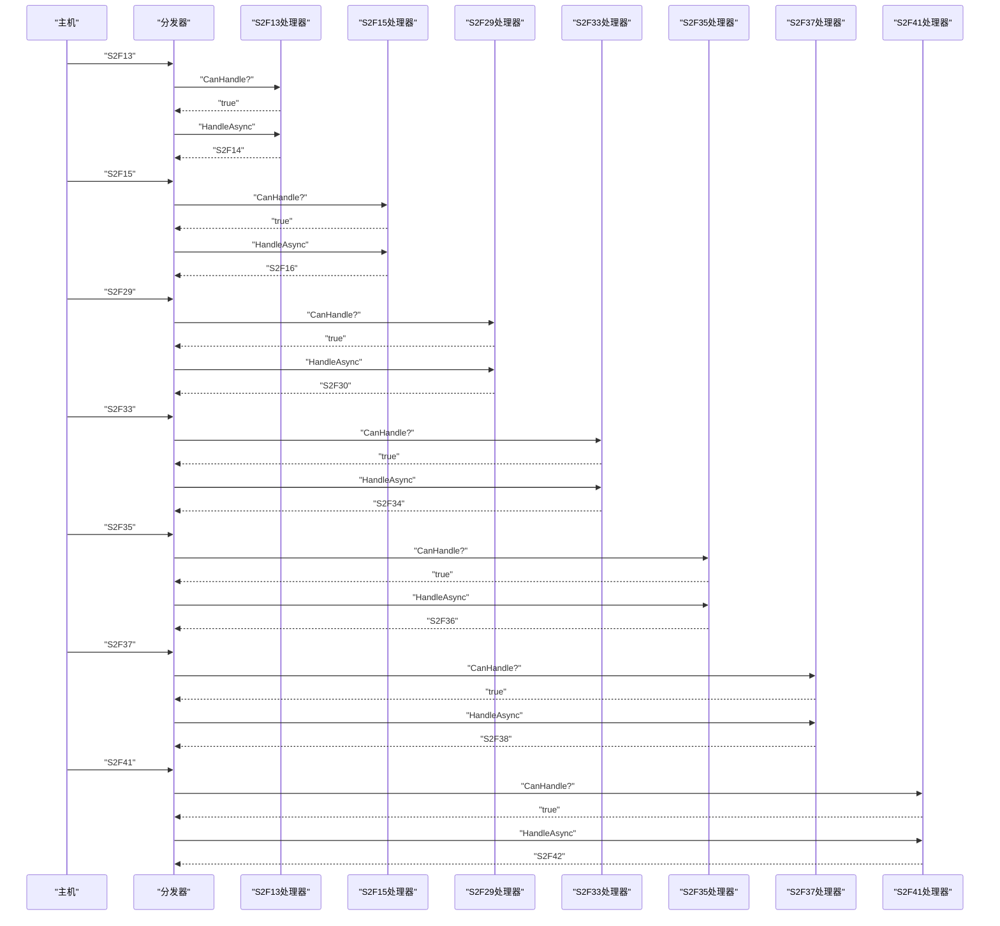
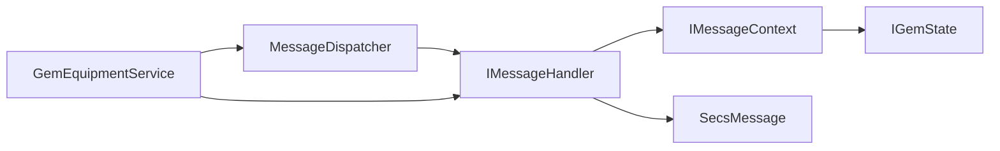

# 消息分发器

<cite>
**本文引用的文件**
- [MessageDispatcher.cs](file://WebGem/SECS2GEM/Application/Messaging/MessageDispatcher.cs)
- [IMessageHandler.cs](file://WebGem/SECS2GEM/Domain/Interfaces/IMessageHandler.cs)
- [StreamOneHandlers.cs](file://WebGem/SECS2GEM/Application/Handlers/StreamOneHandlers.cs)
- [StreamTwoHandlers.cs](file://WebGem/SECS2GEM/Application/Handlers/StreamTwoHandlers.cs)
- [OtherStreamHandlers.cs](file://WebGem/SECS2GEM/Application/Handlers/OtherStreamHandlers.cs)
- [SecsMessage.cs](file://WebGem/SECS2GEM/Core/Entities/SecsMessage.cs)
- [IGemState.cs](file://WebGem/SECS2GEM/Domain/Interfaces/IGemState.cs)
- [MessageContext.cs](file://WebGem/SECS2GEM/Infrastructure/Connection/MessageContext.cs)
- [GemEquipmentService.cs](file://WebGem/SECS2GEM/Application/Services/GemEquipmentService.cs)
</cite>

## 目录
1. [简介](#简介)
2. [项目结构](#项目结构)
3. [核心组件](#核心组件)
4. [架构总览](#架构总览)
5. [详细组件分析](#详细组件分析)
6. [依赖关系分析](#依赖关系分析)
7. [性能考量](#性能考量)
8. [故障排查指南](#故障排查指南)
9. [结论](#结论)
10. [附录](#附录)

## 简介
本文件聚焦于消息分发器模块，系统性阐述 MessageDispatcher 的分发机制、处理器注册体系与消息路由逻辑；详解各 Stream 类型处理器的实现与消息处理模式；提供 IMesssageHandler 接口实现指南、消息验证与响应生成规范；说明处理器优先级机制、错误处理策略与性能优化要点，并给出自定义处理器开发示例与最佳实践。

## 项目结构
消息分发器位于应用层，围绕接口驱动的处理器体系工作，配合实体模型与上下文对象完成消息的接收、分发与响应。

图表来源
- [MessageDispatcher.cs:27-121](file://WebGem/SECS2GEM/Application/Messaging/MessageDispatcher.cs#L27-L121)
- [IMessageHandler.cs:63-129](file://WebGem/SECS2GEM/Domain/Interfaces/IMessageHandler.cs#L63-L129)
- [MessageContext.cs:12-63](file://WebGem/SECS2GEM/Infrastructure/Connection/MessageContext.cs#L12-L63)
- [SecsMessage.cs:18-139](file://WebGem/SECS2GEM/Core/Entities/SecsMessage.cs#L18-L139)
- [GemEquipmentService.cs:110-133](file://WebGem/SECS2GEM/Application/Services/GemEquipmentService.cs#L110-L133)

章节来源
- [MessageDispatcher.cs:27-121](file://WebGem/SECS2GEM/Application/Messaging/MessageDispatcher.cs#L27-L121)
- [GemEquipmentService.cs:110-133](file://WebGem/SECS2GEM/Application/Services/GemEquipmentService.cs#L110-L133)

## 核心组件
- 消息分发器：维护处理器列表，按优先级排序后逐个匹配 CanHandle，命中即委托处理并返回响应；若无处理器可处理且消息带 W-Bit，则返回 S9F7 错误。
- 处理器接口：定义优先级、CanHandle 与 HandleAsync；通过模板方法 MessageHandlerBase 统一异常与日志处理。
- 上下文接口与实现：提供设备 ID、连接、GEM 状态、System Bytes、接收时间以及回复能力。
- SECS-II 消息实体：封装 Stream/Function/WBit/Item 等协议字段，提供常用工厂方法与响应构造。

章节来源
- [MessageDispatcher.cs:27-121](file://WebGem/SECS2GEM/Application/Messaging/MessageDispatcher.cs#L27-L121)
- [IMessageHandler.cs:63-129](file://WebGem/SECS2GEM/Domain/Interfaces/IMessageHandler.cs#L63-L129)
- [MessageContext.cs:12-63](file://WebGem/SECS2GEM/Infrastructure/Connection/MessageContext.cs#L12-L63)
- [SecsMessage.cs:18-139](file://WebGem/SECS2GEM/Core/Entities/SecsMessage.cs#L18-L139)

## 架构总览
消息从连接层到达服务层，服务层触发分发器进行路由；分发器根据处理器优先级与 CanHandle 判定选择处理器；处理器在上下文中访问设备状态并生成响应；必要时通过上下文回发响应。

图表来源
- [GemEquipmentService.cs:342-356](file://WebGem/SECS2GEM/Application/Services/GemEquipmentService.cs#L342-L356)
- [MessageDispatcher.cs:67-91](file://WebGem/SECS2GEM/Application/Messaging/MessageDispatcher.cs#L67-L91)
- [IMessageHandler.cs:74-87](file://WebGem/SECS2GEM/Domain/Interfaces/IMessageHandler.cs#L74-L87)
- [MessageContext.cs:59-62](file://WebGem/SECS2GEM/Infrastructure/Connection/MessageContext.cs#L59-L62)

## 详细组件分析

### 分发器与路由逻辑
- 注册/注销：线程安全地增删处理器，标记未排序以便惰性排序。
- 排序策略：按 Priority 升序排序（数值越小优先级越高），仅在变更后重新排序。
- 匹配与执行：遍历处理器，首个 CanHandle 返回 true 的处理器被调用 HandleAsync。
- 错误处理：若无处理器可处理且消息带 W-Bit，则构造 S9F7（非法数据）响应；否则返回 null（不期望响应）。

图表来源
- [MessageDispatcher.cs:67-120](file://WebGem/SECS2GEM/Application/Messaging/MessageDispatcher.cs#L67-L120)

章节来源
- [MessageDispatcher.cs:27-121](file://WebGem/SECS2GEM/Application/Messaging/MessageDispatcher.cs#L27-L121)

### 处理器接口与基类
- IMessageHandler：定义 Priority、CanHandle、HandleAsync；默认 Priority 为 0（可通过虚属性覆盖）。
- MessageHandlerBase：统一模板方法骨架，提供 CanHandle 基于 Stream/Function 的匹配；HandleAsync 包裹异常并按需返回 S9F7；提供 CreateErrorResponse 以生成标准错误响应。

图表来源
- [IMessageHandler.cs:63-129](file://WebGem/SECS2GEM/Domain/Interfaces/IMessageHandler.cs#L63-L129)
- [StreamOneHandlers.cs:20-86](file://WebGem/SECS2GEM/Application/Handlers/StreamOneHandlers.cs#L20-L86)

章节来源
- [IMessageHandler.cs:63-129](file://WebGem/SECS2GEM/Domain/Interfaces/IMessageHandler.cs#L63-L129)
- [StreamOneHandlers.cs:20-86](file://WebGem/SECS2GEM/Application/Handlers/StreamOneHandlers.cs#L20-L86)

### Stream 1 处理器（设备状态）
- S1F1：Are You There，返回设备型号与软件版本（S1F2）。
- S1F13：Establish Communications Request，建立通信并返回 COMMACK 与设备信息（S1F14）。
- S1F15：Request OFF-LINE，尝试切换至离线并返回 OFLACK（S1F16）。
- S1F17：Request ON-LINE，尝试切换至在线并进入 Remote 模式，返回 ONLACK（S1F18）。

图表来源
- [StreamOneHandlers.cs:94-210](file://WebGem/SECS2GEM/Application/Handlers/StreamOneHandlers.cs#L94-L210)
- [MessageDispatcher.cs:67-91](file://WebGem/SECS2GEM/Application/Messaging/MessageDispatcher.cs#L67-L91)

章节来源
- [StreamOneHandlers.cs:94-210](file://WebGem/SECS2GEM/Application/Handlers/StreamOneHandlers.cs#L94-L210)

### Stream 2 处理器（设备控制）
- S2F13：Equipment Constant Request，查询设备常量（S2F14）。
- S2F15：New Equipment Constant Send，设置设备常量（S2F16）。
- S2F29：Equipment Constant Namelist Request，返回常量定义列表（S2F30）。
- S2F33：Define Report，定义事件报告（S2F34）。
- S2F35：Link Event Report，链接事件报告（S2F36）。
- S2F37：Enable/Disable Event Report，启用/禁用事件报告（S2F38）。
- S2F41：Host Command Send，执行主机命令并返回 HCACK 与参数确认（S2F42）。

图表来源
- [StreamTwoHandlers.cs:13-330](file://WebGem/SECS2GEM/Application/Handlers/StreamTwoHandlers.cs#L13-L330)
- [MessageDispatcher.cs:67-91](file://WebGem/SECS2GEM/Application/Messaging/MessageDispatcher.cs#L67-L91)

章节来源
- [StreamTwoHandlers.cs:13-330](file://WebGem/SECS2GEM/Application/Handlers/StreamTwoHandlers.cs#L13-L330)

### 其他 Stream 处理器（S5/S6/S7/S10）
- S5F3/S5F5/S5F7：启用/禁用报警、列出报警、列出已启用报警。
- S6F15/S6F19：请求事件报告与单个报告数据。
- S7F1/S7F3/S7F5/S7F17/S7F19：进程程序加载、发送、请求、删除与当前 EPPD 请求。
- S10F3/S10F5：终端显示（单块/多块）。

这些处理器均采用统一模板方法，简化实现并保持一致性。

章节来源
- [OtherStreamHandlers.cs:9-275](file://WebGem/SECS2GEM/Application/Handlers/OtherStreamHandlers.cs#L9-L275)

### 上下文与状态
- IMessageContext：提供设备 ID、连接、GEM 状态、System Bytes、接收时间与 ReplyAsync 能力。
- MessageContext：在服务层构建，注入到分发器，使处理器可直接回复消息。
- IGemState：提供设备型号、软件版本、通信/控制/处理状态、在线/远程模式、状态变量与设备常量的读写与注册。

章节来源
- [MessageContext.cs:12-63](file://WebGem/SECS2GEM/Infrastructure/Connection/MessageContext.cs#L12-L63)
- [IGemState.cs:20-163](file://WebGem/SECS2GEM/Domain/Interfaces/IGemState.cs#L20-L163)

## 依赖关系分析
- 分发器依赖处理器接口与消息实体；处理器依赖上下文与状态接口；服务层负责装配与注册默认处理器。
- 处理器与上下文之间为弱耦合：处理器只依赖接口，便于替换与扩展。
- 分发器内部对处理器列表加锁并惰性排序，避免频繁排序成本。

图表来源
- [MessageDispatcher.cs:27-121](file://WebGem/SECS2GEM/Application/Messaging/MessageDispatcher.cs#L27-L121)
- [GemEquipmentService.cs:407-443](file://WebGem/SECS2GEM/Application/Services/GemEquipmentService.cs#L407-L443)

章节来源
- [GemEquipmentService.cs:407-443](file://WebGem/SECS2GEM/Application/Services/GemEquipmentService.cs#L407-L443)

## 性能考量
- 处理器排序：仅在注册/注销或首次访问时排序，避免每次分发重复排序。
- 线程安全：使用锁保护处理器列表，确保并发注册/注销安全。
- 响应策略：优先返回响应消息，减少无效计算；无响应需求时返回 null。
- 错误路径：异常捕获与 S9F7 生成在处理器基类中统一处理，降低重复代码与出错概率。

## 故障排查指南
- 无响应或延迟：检查处理器是否正确注册、CanHandle 条件是否满足、优先级是否过低导致被更早处理器拦截。
- S9F7 错误：确认消息 W-Bit 设置与处理器是否能处理；若无法处理且 W-Bit 为真，分发器会自动返回 S9F7。
- 异常处理：处理器基类已捕获异常并按需返回 S9F7；若处理器未覆盖错误响应生成，注意在 HandleCoreAsync 中抛出明确异常以便统一处理。
- 上下文问题：确认 IMessageContext 的 ReplyAsync 能力正常，设备状态与连接对象有效。

章节来源
- [MessageDispatcher.cs:67-120](file://WebGem/SECS2GEM/Application/Messaging/MessageDispatcher.cs#L67-L120)
- [StreamOneHandlers.cs:53-85](file://WebGem/SECS2GEM/Application/Handlers/StreamOneHandlers.cs#L53-L85)

## 结论
消息分发器通过“责任链+策略”模式实现了高内聚、低耦合的消息路由；结合模板方法基类与接口抽象，既保证了默认行为的一致性，又允许灵活扩展。按 Stream/Function 的处理器划分清晰，便于维护与测试；优先级与惰性排序兼顾了灵活性与性能。建议在新增处理器时遵循接口约定、合理设置优先级，并在 HandleCoreAsync 中做好输入校验与异常边界处理。

## 附录

### 处理器开发指南
- 实现 IMessageHandler：定义 Priority、CanHandle 与 HandleAsync；或继承 MessageHandlerBase 以获得统一异常与日志处理。
- 消息验证：在 CanHandle 中校验消息的 Stream/Function 与数据结构；在 HandleCoreAsync 中校验数据项与业务规则。
- 响应生成：使用 SecsMessage 工厂方法或构造函数生成响应；确保 Function 为对应 Secondary（+1），W-Bit 为 false。
- 上下文使用：通过 IMessageContext 访问设备状态、连接与回复能力；必要时在上下文中携带 System Bytes 与接收时间。
- 错误处理：优先返回 S9F7（当 W-Bit 为真）；否则返回 null；在基类中已统一封装异常捕获。

章节来源
- [IMessageHandler.cs:63-129](file://WebGem/SECS2GEM/Domain/Interfaces/IMessageHandler.cs#L63-L129)
- [StreamOneHandlers.cs:20-86](file://WebGem/SECS2GEM/Application/Handlers/StreamOneHandlers.cs#L20-L86)
- [SecsMessage.cs:140-206](file://WebGem/SECS2GEM/Core/Entities/SecsMessage.cs#L140-L206)

### 自定义处理器开发示例（步骤）
- 步骤 1：新建类实现 IMessageHandler 或继承 MessageHandlerBase。
- 步骤 2：在 CanHandle 中限定 Stream/Function 并做基础校验。
- 步骤 3：在 HandleCoreAsync 中读取上下文状态、解析消息数据、生成响应。
- 步骤 4：在 GemEquipmentService 中注册处理器（RegisterHandler）。
- 步骤 5：根据需要调整 Priority 以控制匹配顺序。

章节来源
- [GemEquipmentService.cs:448-451](file://WebGem/SECS2GEM/Application/Services/GemEquipmentService.cs#L448-L451)
- [IMessageHandler.cs:63-87](file://WebGem/SECS2GEM/Domain/Interfaces/IMessageHandler.cs#L63-L87)