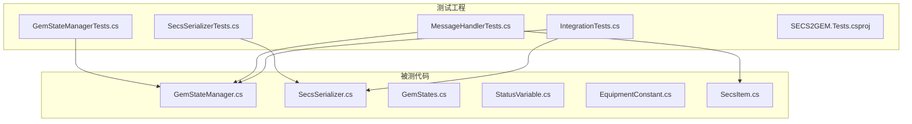
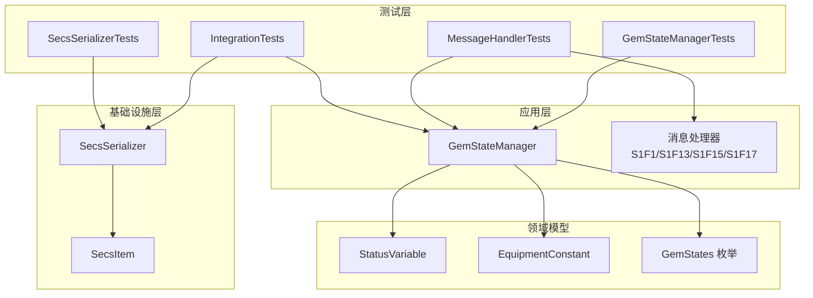
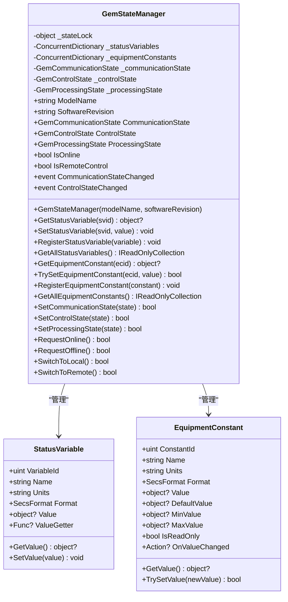
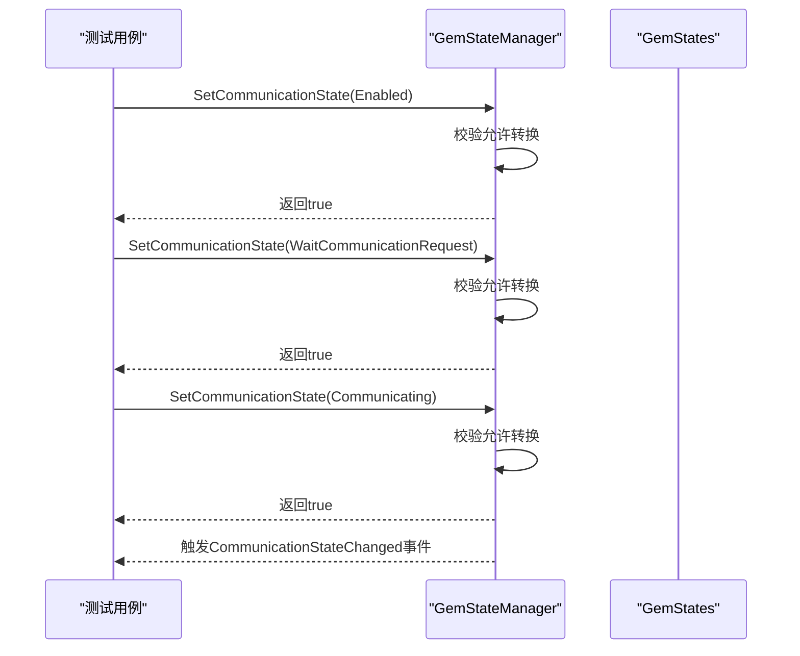
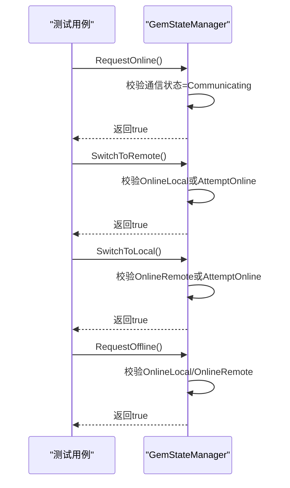
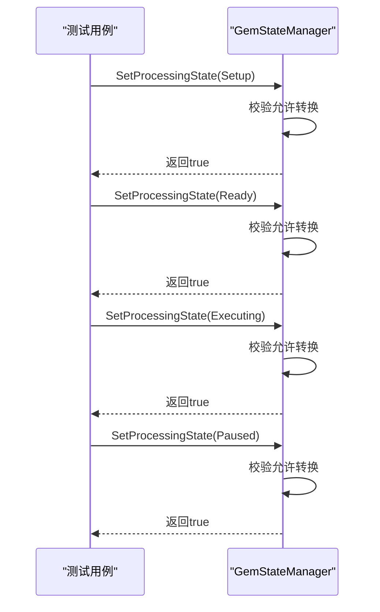
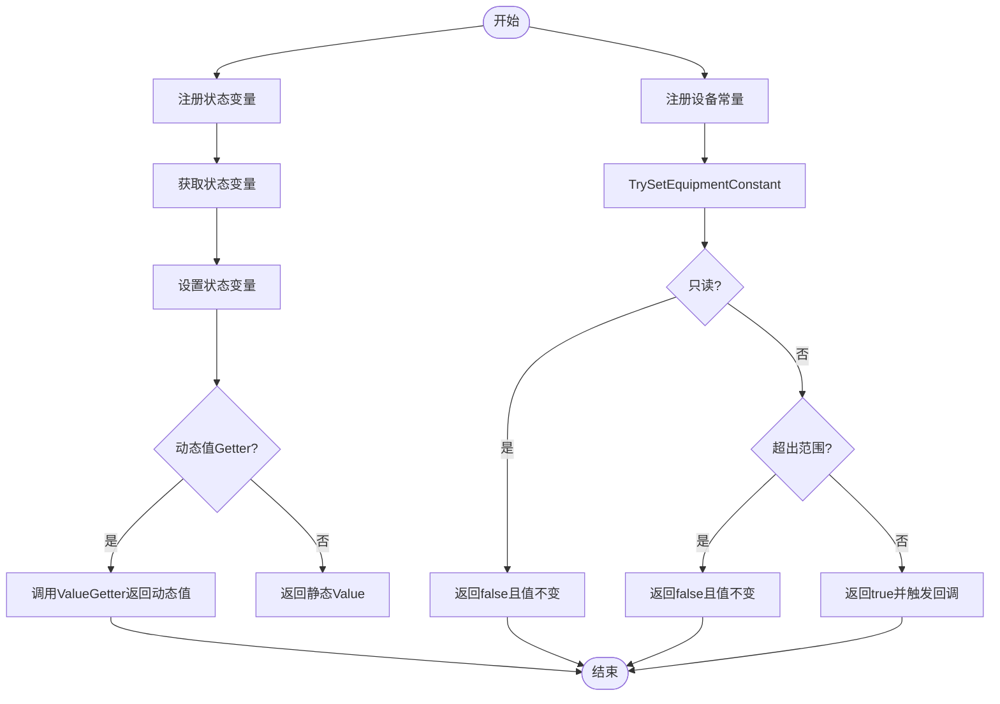
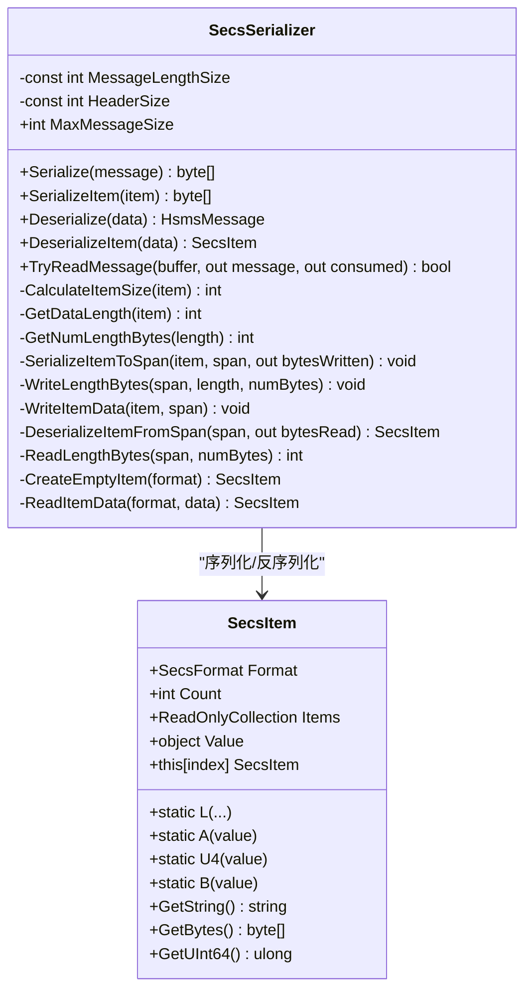
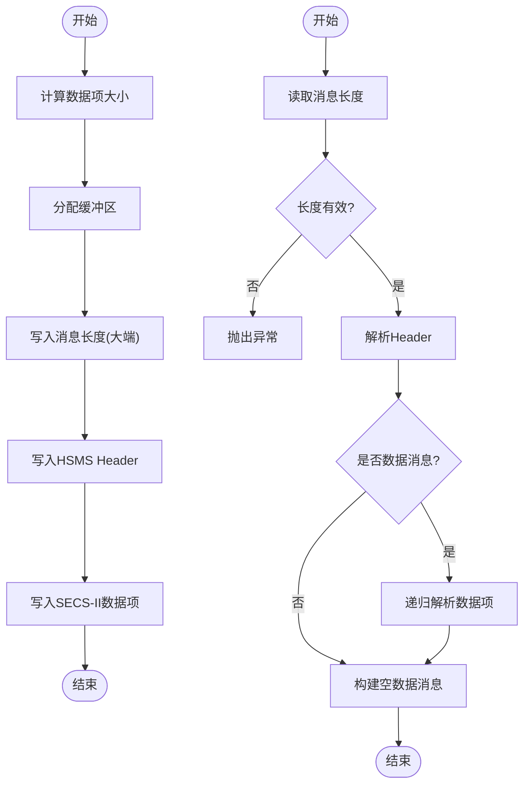
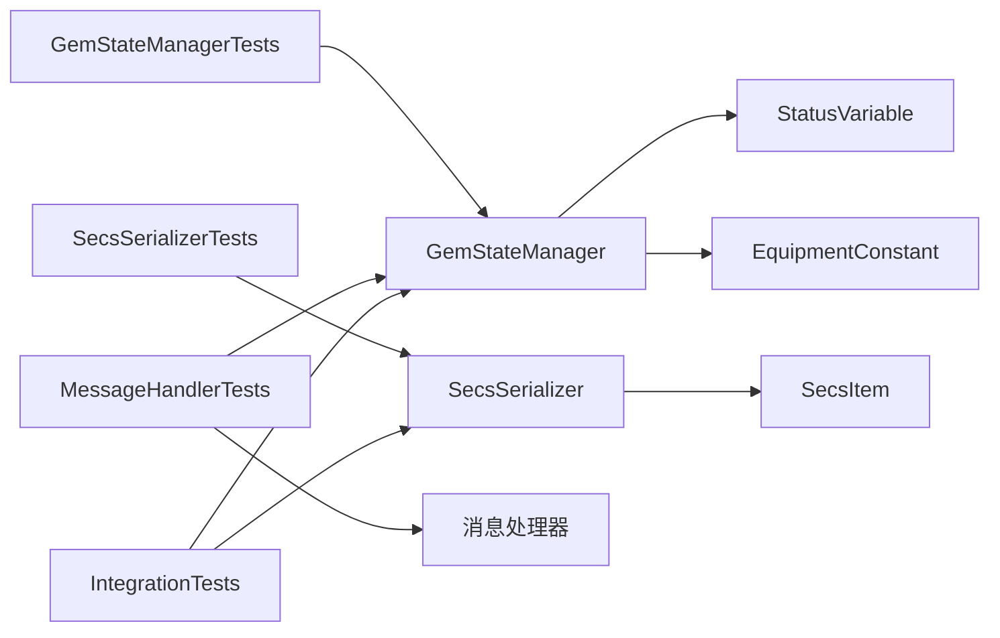

# 单元测试

<cite>
**本文引用的文件**
- [GemStateManagerTests.cs](file://WebGem/SECS2GEM.Tests/GemStateManagerTests.cs)
- [SecsSerializerTests.cs](file://WebGem/SECS2GEM.Tests/SecsSerializerTests.cs)
- [GemStateManager.cs](file://WebGem/SECS2GEM/Application/State/GemStateManager.cs)
- [SecsSerializer.cs](file://WebGem/SECS2GEM/Infrastructure/Serialization/SecsSerializer.cs)
- [GemStates.cs](file://WebGem/SECS2GEM/Core/Enums/GemStates.cs)
- [StatusVariable.cs](file://WebGem/SECS2GEM/Domain/Models/StatusVariable.cs)
- [EquipmentConstant.cs](file://WebGem/SECS2GEM/Domain/Models/EquipmentConstant.cs)
- [SecsItem.cs](file://WebGem/SECS2GEM/Core/Entities/SecsItem.cs)
- [MessageHandlerTests.cs](file://WebGem/SECS2GEM.Tests/MessageHandlerTests.cs)
- [IntegrationTests.cs](file://WebGem/SECS2GEM.Tests/IntegrationTests.cs)
- [SECS2GEM.Tests.csproj](file://WebGem/SECS2GEM.Tests/SECS2GEM.Tests.csproj)
</cite>

## 目录
1. [简介](#简介)
2. [项目结构](#项目结构)
3. [核心组件](#核心组件)
4. [架构总览](#架构总览)
5. [详细组件分析](#详细组件分析)
6. [依赖关系分析](#依赖关系分析)
7. [性能考量](#性能考量)
8. [故障排查指南](#故障排查指南)
9. [结论](#结论)
10. [附录](#附录)

## 简介
本文件面向SECS2-GEM项目的单元测试，聚焦以下两个测试类：
- GemStateManagerTests：覆盖状态管理器的状态转换、状态变量与设备常量的注册与获取、事件触发等行为。
- SecsSerializerTests：覆盖SECS-II数据项与HSMS消息的序列化/反序列化、往返测试、TryReadMessage等能力。

同时，本文提供测试用例设计原则、断言方法、测试数据准备策略、测试覆盖率建议与最佳实践，并给出可维护的单元测试编写指导。

## 项目结构
测试工程位于 WebGem/SECS2GEM.Tests，包含多个测试类，其中与本文目标最相关的两类如下：
- 状态管理与消息处理：GemStateManagerTests、MessageHandlerTests
- 序列化与集成：SecsSerializerTests、IntegrationTests

图表来源
- [GemStateManagerTests.cs:1-365](file://WebGem/SECS2GEM.Tests/GemStateManagerTests.cs#L1-L365)
- [SecsSerializerTests.cs:1-296](file://WebGem/SECS2GEM.Tests/SecsSerializerTests.cs#L1-L296)
- [GemStateManager.cs:1-492](file://WebGem/SECS2GEM/Application/State/GemStateManager.cs#L1-L492)
- [SecsSerializer.cs:1-662](file://WebGem/SECS2GEM/Infrastructure/Serialization/SecsSerializer.cs#L1-L662)
- [GemStates.cs:1-176](file://WebGem/SECS2GEM/Core/Enums/GemStates.cs#L1-L176)
- [StatusVariable.cs:1-61](file://WebGem/SECS2GEM/Domain/Models/StatusVariable.cs#L1-L61)
- [EquipmentConstant.cs:1-122](file://WebGem/SECS2GEM/Domain/Models/EquipmentConstant.cs#L1-L122)
- [SecsItem.cs:1-480](file://WebGem/SECS2GEM/Core/Entities/SecsItem.cs#L1-L480)

章节来源
- [SECS2GEM.Tests.csproj:1-25](file://WebGem/SECS2GEM.Tests/SECS2GEM.Tests.csproj#L1-L25)

## 核心组件
- 状态管理器（GemStateManager）
  - 维护三类状态：通信状态、控制状态、处理状态；提供状态转换、事件发布、状态变量与设备常量管理。
- 序列化器（SecsSerializer）
  - 实现SECS-II数据项与HSMS消息的序列化/反序列化，支持大端序、长度字段、嵌套列表、TryReadMessage等。

章节来源
- [GemStateManager.cs:22-492](file://WebGem/SECS2GEM/Application/State/GemStateManager.cs#L22-L492)
- [SecsSerializer.cs:27-662](file://WebGem/SECS2GEM/Infrastructure/Serialization/SecsSerializer.cs#L27-L662)

## 架构总览
下图展示测试与被测组件的关系及关键交互路径。

图表来源
- [GemStateManagerTests.cs:1-365](file://WebGem/SECS2GEM.Tests/GemStateManagerTests.cs#L1-L365)
- [SecsSerializerTests.cs:1-296](file://WebGem/SECS2GEM.Tests/SecsSerializerTests.cs#L1-L296)
- [MessageHandlerTests.cs:1-279](file://WebGem/SECS2GEM.Tests/MessageHandlerTests.cs#L1-L279)
- [IntegrationTests.cs:1-194](file://WebGem/SECS2GEM.Tests/IntegrationTests.cs#L1-L194)
- [GemStateManager.cs:22-492](file://WebGem/SECS2GEM/Application/State/GemStateManager.cs#L22-L492)
- [SecsSerializer.cs:27-662](file://WebGem/SECS2GEM/Infrastructure/Serialization/SecsSerializer.cs#L27-L662)
- [GemStates.cs:1-176](file://WebGem/SECS2GEM/Core/Enums/GemStates.cs#L1-L176)
- [StatusVariable.cs:1-61](file://WebGem/SECS2GEM/Domain/Models/StatusVariable.cs#L1-L61)
- [EquipmentConstant.cs:1-122](file://WebGem/SECS2GEM/Domain/Models/EquipmentConstant.cs#L1-L122)
- [SecsItem.cs:1-480](file://WebGem/SECS2GEM/Core/Entities/SecsItem.cs#L1-L480)

## 详细组件分析

### GemStateManagerTests 测试场景与设计
本测试类围绕状态管理器的行为进行系统化验证，涵盖：
- 初始状态验证：构造函数初始化、标准状态变量注册。
- 通信状态转换：Disabled→Enabled→WaitCommunicationRequest→Communicating，以及事件触发。
- 控制状态转换：EquipmentOffline→AttemptOnline→OnlineLocal/OnlineRemote，以及RequestOffline。
- 处理状态转换：Idle→Setup/Ready/Executing/Paused 的合法路径。
- 状态变量注册与获取：注册、更新、动态值获取、全量查询。
- 设备常量注册与设置：注册、只读保护、范围校验、变更回调。

测试设计要点
- 使用事实性测试（Fact）覆盖确定性场景；使用理论性测试（Theory）结合多组输入（如往返测试）。
- 通过事件订阅验证状态变化通知是否正确触发。
- 通过状态变量与设备常量的GetValue/SetValue/TrySetValue验证数据一致性与边界条件。
- 通过枚举定义（GemStates）明确状态转换规则，确保测试覆盖所有允许的转换路径。

章节来源
- [GemStateManagerTests.cs:19-365](file://WebGem/SECS2GEM.Tests/GemStateManagerTests.cs#L19-L365)
- [GemStateManager.cs:22-492](file://WebGem/SECS2GEM/Application/State/GemStateManager.cs#L22-L492)
- [GemStates.cs:10-121](file://WebGem/SECS2GEM/Core/Enums/GemStates.cs#L10-L121)
- [StatusVariable.cs:12-61](file://WebGem/SECS2GEM/Domain/Models/StatusVariable.cs#L12-L61)
- [EquipmentConstant.cs:12-122](file://WebGem/SECS2GEM/Domain/Models/EquipmentConstant.cs#L12-L122)

#### 状态管理器类图（代码级）

图表来源
- [GemStateManager.cs:22-492](file://WebGem/SECS2GEM/Application/State/GemStateManager.cs#L22-L492)
- [StatusVariable.cs:12-61](file://WebGem/SECS2GEM/Domain/Models/StatusVariable.cs#L12-L61)
- [EquipmentConstant.cs:12-122](file://WebGem/SECS2GEM/Domain/Models/EquipmentConstant.cs#L12-L122)

#### 通信状态转换序列图（代码级）

图表来源
- [GemStateManagerTests.cs:50-91](file://WebGem/SECS2GEM.Tests/GemStateManagerTests.cs#L50-L91)
- [GemStateManager.cs:201-223](file://WebGem/SECS2GEM/Application/State/GemStateManager.cs#L201-L223)
- [GemStates.cs:10-41](file://WebGem/SECS2GEM/Core/Enums/GemStates.cs#L10-L41)

#### 控制状态转换序列图（代码级）

图表来源
- [GemStateManagerTests.cs:98-171](file://WebGem/SECS2GEM.Tests/GemStateManagerTests.cs#L98-L171)
- [GemStateManager.cs:263-298](file://WebGem/SECS2GEM/Application/State/GemStateManager.cs#L263-L298)

#### 处理状态转换序列图（代码级）

图表来源
- [GemStateManagerTests.cs:176-218](file://WebGem/SECS2GEM.Tests/GemStateManagerTests.cs#L176-L218)
- [GemStateManager.cs:246-258](file://WebGem/SECS2GEM/Application/State/GemStateManager.cs#L246-L258)
- [GemStates.cs:89-120](file://WebGem/SECS2GEM/Core/Enums/GemStates.cs#L89-L120)

#### 状态变量与设备常量流程图（代码级）

图表来源
- [GemStateManagerTests.cs:223-362](file://WebGem/SECS2GEM.Tests/GemStateManagerTests.cs#L223-L362)
- [GemStateManager.cs:114-193](file://WebGem/SECS2GEM/Application/State/GemStateManager.cs#L114-L193)
- [StatusVariable.cs:47-58](file://WebGem/SECS2GEM/Domain/Models/StatusVariable.cs#L47-L58)
- [EquipmentConstant.cs:76-96](file://WebGem/SECS2GEM/Domain/Models/EquipmentConstant.cs#L76-L96)

### SecsSerializerTests 测试场景与设计
本测试类围绕序列化器的功能进行验证，包括：
- SecsItem序列化/反序列化：ASCII、U4、Binary、List等格式的字节流正确性。
- 往返测试（Round-trip）：不同数据类型与复杂消息结构的序列化后反序列化保持一致。
- HSMS消息序列化：Header长度、消息类型、数据项存在性等。
- TryReadMessage：不完整数据返回false，完整消息返回true并消费相应字节数。

测试设计要点
- 使用断言验证格式字节、长度字节、数据字节的组合是否符合SECS-II规范。
- 使用Theory与InlineData覆盖典型边界值（如最小/最大整型）。
- 通过嵌套列表与复杂消息结构验证递归解析的正确性。
- 通过TryReadMessage验证粘包/半包场景下的健壮性。

章节来源
- [SecsSerializerTests.cs:14-296](file://WebGem/SECS2GEM.Tests/SecsSerializerTests.cs#L14-L296)
- [SecsSerializer.cs:49-177](file://WebGem/SECS2GEM/Infrastructure/Serialization/SecsSerializer.cs#L49-L177)
- [SecsItem.cs:23-480](file://WebGem/SECS2GEM/Core/Entities/SecsItem.cs#L23-L480)

#### 序列化器类图（代码级）

图表来源
- [SecsSerializer.cs:27-662](file://WebGem/SECS2GEM/Infrastructure/Serialization/SecsSerializer.cs#L27-L662)
- [SecsItem.cs:23-480](file://WebGem/SECS2GEM/Core/Entities/SecsItem.cs#L23-L480)

#### 序列化/反序列化流程图（代码级）

图表来源
- [SecsSerializerTests.cs:225-256](file://WebGem/SECS2GEM.Tests/SecsSerializerTests.cs#L225-L256)
- [SecsSerializer.cs:49-126](file://WebGem/SECS2GEM/Infrastructure/Serialization/SecsSerializer.cs#L49-L126)

### 消息处理器与集成测试补充
- MessageHandlerTests：验证S1F1/S1F13/S1F15/S1F17消息处理器对状态管理器的影响，确保消息路由与响应正确。
- IntegrationTests：基于真实网络连接与序列化器，验证设备服务在完整通信流程中的行为（Select、S1F1、S1F13、Linktest等）。

章节来源
- [MessageHandlerTests.cs:1-279](file://WebGem/SECS2GEM.Tests/MessageHandlerTests.cs#L1-L279)
- [IntegrationTests.cs:1-194](file://WebGem/SECS2GEM.Tests/IntegrationTests.cs#L1-L194)

## 依赖关系分析
- 测试工程依赖被测项目（ProjectReference），使用xUnit作为测试框架，覆盖率为coverlet.collector。
- 测试类之间无直接依赖，均通过被测组件进行交互。
- 被测组件之间存在清晰的分层：状态管理器依赖领域模型（状态变量、设备常量），序列化器依赖实体（SecsItem）。

图表来源
- [GemStateManagerTests.cs:1-365](file://WebGem/SECS2GEM.Tests/GemStateManagerTests.cs#L1-L365)
- [SecsSerializerTests.cs:1-296](file://WebGem/SECS2GEM.Tests/SecsSerializerTests.cs#L1-L296)
- [MessageHandlerTests.cs:1-279](file://WebGem/SECS2GEM.Tests/MessageHandlerTests.cs#L1-L279)
- [IntegrationTests.cs:1-194](file://WebGem/SECS2GEM.Tests/IntegrationTests.cs#L1-L194)
- [GemStateManager.cs:22-492](file://WebGem/SECS2GEM/Application/State/GemStateManager.cs#L22-L492)
- [SecsSerializer.cs:27-662](file://WebGem/SECS2GEM/Infrastructure/Serialization/SecsSerializer.cs#L27-L662)
- [SecsItem.cs:23-480](file://WebGem/SECS2GEM/Core/Entities/SecsItem.cs#L23-L480)
- [StatusVariable.cs:12-61](file://WebGem/SECS2GEM/Domain/Models/StatusVariable.cs#L12-L61)
- [EquipmentConstant.cs:12-122](file://WebGem/SECS2GEM/Domain/Models/EquipmentConstant.cs#L12-L122)

## 性能考量
- 状态管理器内部使用并发字典存储状态变量与设备常量，避免锁竞争；状态转换采用轻量的枚举比较与事件发布，开销较低。
- 序列化器采用Span与大端序写入，减少内存拷贝；TryReadMessage先读长度再解析，避免不必要的解析开销。
- 建议在大规模批量测试中复用对象（如重复使用相同的SecsItem工厂方法创建的实例），以降低GC压力。

## 故障排查指南
常见问题与定位方法
- 状态转换失败：检查状态转换规则（枚举定义）与当前状态，确认是否满足转换条件。
- 状态变量/设备常量未生效：确认注册顺序、ID唯一性、动态值Getter是否返回预期值、只读/范围约束是否导致设置失败。
- 序列化/反序列化异常：核对格式字节、长度字节、数据字节是否符合规范；检查TryReadMessage返回值与消费字节数。
- 集成测试连接失败：确认端口、被动模式配置、Select请求/响应流程是否正确。

章节来源
- [GemStateManager.cs:357-455](file://WebGem/SECS2GEM/Application/State/GemStateManager.cs#L357-L455)
- [SecsSerializer.cs:139-177](file://WebGem/SECS2GEM/Infrastructure/Serialization/SecsSerializer.cs#L139-L177)
- [IntegrationTests.cs:53-194](file://WebGem/SECS2GEM.Tests/IntegrationTests.cs#L53-L194)

## 结论
本文系统梳理了SECS2-GEM项目中GemStateManagerTests与SecsSerializerTests的测试场景与实现细节，给出了状态管理器与序列化器的关键流程图与类图，明确了测试用例设计原则、断言方法与测试数据准备策略，并提供了可维护的单元测试编写建议。建议在后续迭代中持续扩展边界与异常场景测试，提升整体覆盖率与稳定性。

## 附录

### 测试用例设计原则
- 单一职责：每个测试关注一个行为或一条路径。
- 可重复性：测试数据自包含，避免外部状态影响。
- 明确断言：针对期望输出与副作用（如事件）进行断言。
- 边界与异常：覆盖空值、越界、只读、半包等边界与异常场景。
- 可维护性：使用工厂方法与共享Fixture，减少重复代码。

### 断言方法与测试数据准备
- 断言类型：Equal、True/False、NotNull/Null、Throws（异常场景）。
- 测试数据：使用SecsItem静态工厂方法快速构造典型数据项；使用Theory+InlineData覆盖多组输入。
- 事件验证：通过事件订阅捕获状态变化，验证事件触发时机与内容。

### 测试覆盖率要求与最佳实践
- 覆盖率建议：语句覆盖率≥80%，分支覆盖率≥70%，重点路径≥90%。
- 最佳实践：
  - 使用Fact与Theory结合，提高测试效率。
  - 将公共初始化逻辑抽取到构造函数或前置条件中。
  - 对关键路径增加注释说明“为什么这样断言”，便于维护。
  - 对异常场景使用异常断言，确保错误传播路径正确。