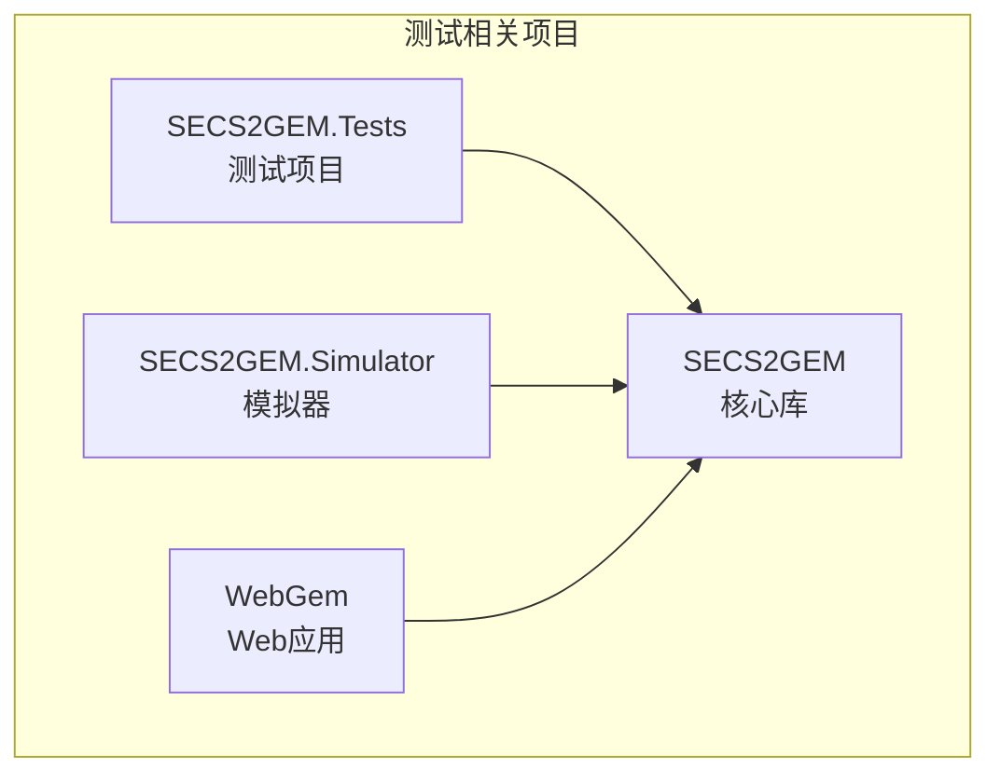
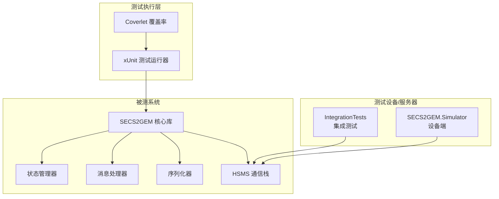
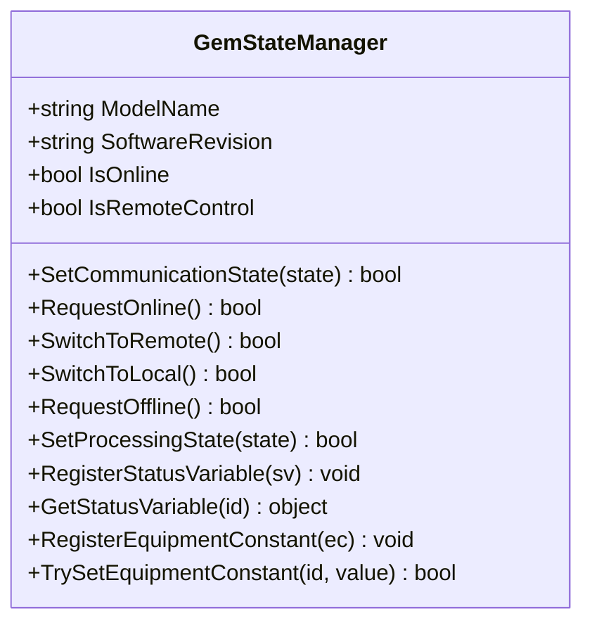
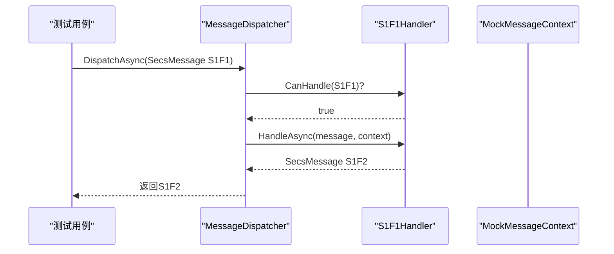
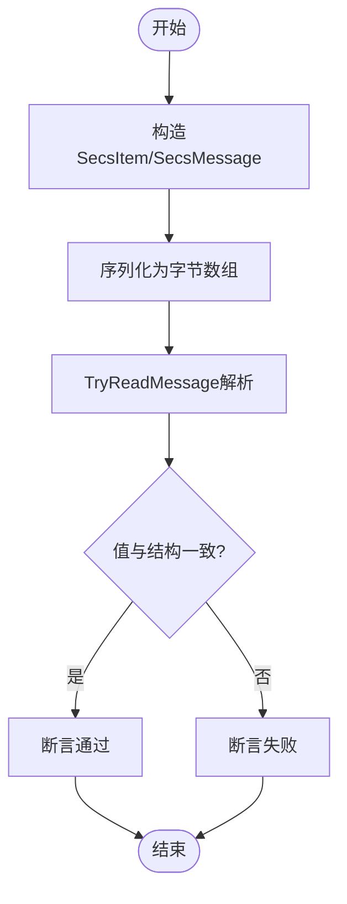
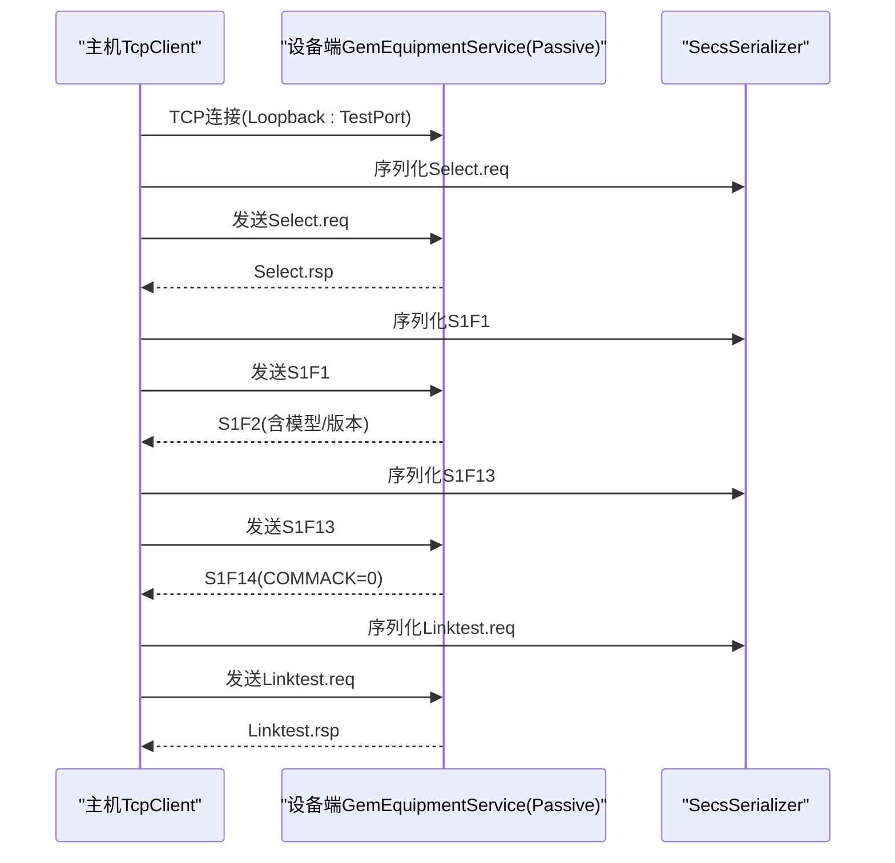
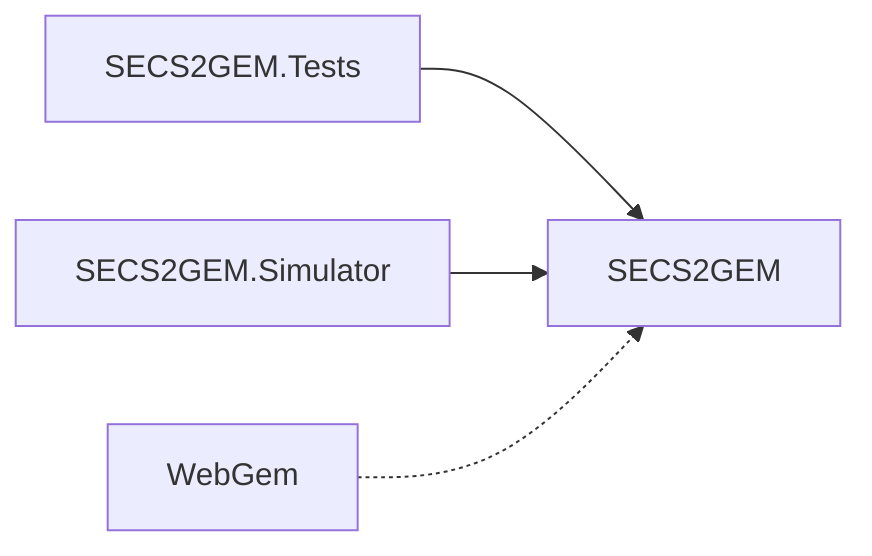

# 测试环境配置

<cite>
**本文引用的文件**
- [README.md](file://README.md)
- [SECS2GEM.Tests.csproj](file://WebGem/SECS2GEM.Tests/SECS2GEM.Tests.csproj)
- [SECS2GEM.csproj](file://WebGem/SECS2GEM/SECS2GEM.csproj)
- [SECS2GEM.Simulator.csproj](file://WebGem/SECS2GEM.Simulator/SECS2GEM.Simulator.csproj)
- [WebGem.csproj](file://WebGem/WebGem/WebGem.csproj)
- [GemStateManagerTests.cs](file://WebGem/SECS2GEM.Tests/GemStateManagerTests.cs)
- [IntegrationTests.cs](file://WebGem/SECS2GEM.Tests/IntegrationTests.cs)
- [MessageHandlerTests.cs](file://WebGem/SECS2GEM.Tests/MessageHandlerTests.cs)
- [SecsSerializerTests.cs](file://WebGem/SECS2GEM.Tests/SecsSerializerTests.cs)
- [launchSettings.json](file://WebGem/WebGem/Properties/launchSettings.json)
- [appsettings.json](file://WebGem/WebGem/appsettings.json)
- [appsettings.Development.json](file://WebGem/WebGem/appsettings.Development.json)
</cite>

## 目录
1. [简介](#简介)
2. [项目结构](#项目结构)
3. [核心组件](#核心组件)
4. [架构总览](#架构总览)
5. [详细组件分析](#详细组件分析)
6. [依赖分析](#依赖分析)
7. [性能考虑](#性能考虑)
8. [故障排除指南](#故障排除指南)
9. [结论](#结论)
10. [附录](#附录)

## 简介
本文件面向SECS2-GEM项目的测试环境配置与运行，覆盖以下方面：
- 测试项目的依赖配置与编译设置
- 测试运行时环境与网络端口配置
- 测试数据库、模拟设备与测试服务器的配置思路
- 测试数据准备与初始化方法
- 网络配置、端口与防火墙建议
- 部署脚本与自动化配置建议
- CI/CD流水线中测试执行策略
- 故障排除与性能调优建议

## 项目结构
SECS2-GEM采用多项目解决方案，测试相关的核心项目包括：
- SECS2GEM：核心库，包含协议实体、枚举、异常、领域模型、基础设施等
- SECS2GEM.Tests：测试项目，包含单元测试与集成测试
- SECS2GEM.Simulator：模拟器（WinForms），可作为测试设备侧
- WebGem：Web应用示例（非核心测试逻辑，但可用于端到端验证）

图表来源
- [SECS2GEM.Tests.csproj:1-25](file://WebGem/SECS2GEM.Tests/SECS2GEM.Tests.csproj#L1-L25)
- [SECS2GEM.Simulator.csproj:1-15](file://WebGem/SECS2GEM.Simulator/SECS2GEM.Simulator.csproj#L1-L15)
- [SECS2GEM.csproj:1-10](file://WebGem/SECS2GEM/SECS2GEM.csproj#L1-L10)
- [WebGem.csproj:1-14](file://WebGem/WebGem/WebGem.csproj#L1-L14)

章节来源
- [README.md:1-1](file://README.md#L1-L1)
- [SECS2GEM.Tests.csproj:1-25](file://WebGem/SECS2GEM.Tests/SECS2GEM.Tests.csproj#L1-L25)
- [SECS2GEM.Simulator.csproj:1-15](file://WebGem/SECS2GEM.Simulator/SECS2GEM.Simulator.csproj#L1-L15)
- [SECS2GEM.csproj:1-10](file://WebGem/SECS2GEM/SECS2GEM.csproj#L1-L10)
- [WebGem.csproj:1-14](file://WebGem/WebGem/WebGem.csproj#L1-L14)

## 核心组件
- 测试框架与工具
  - Microsoft.NET.Test.Sdk、xUnit、coverlet.collector
  - 测试项目引用核心库SECS2GEM
- 测试类型
  - 单元测试：状态管理器、消息处理器、序列化器
  - 集成测试：基于TCP的HSMS通信链路，模拟设备端Passive模式
- 运行时配置
  - Web应用使用launchSettings.json配置HTTP/HTTPS端口
  - appsettings.json与appsettings.Development.json控制日志级别

章节来源
- [SECS2GEM.Tests.csproj:1-25](file://WebGem/SECS2GEM.Tests/SECS2GEM.Tests.csproj#L1-L25)
- [GemStateManagerTests.cs:1-365](file://WebGem/SECS2GEM.Tests/GemStateManagerTests.cs#L1-L365)
- [MessageHandlerTests.cs:1-279](file://WebGem/SECS2GEM.Tests/MessageHandlerTests.cs#L1-L279)
- [SecsSerializerTests.cs:1-296](file://WebGem/SECS2GEM.Tests/SecsSerializerTests.cs#L1-L296)
- [IntegrationTests.cs:1-194](file://WebGem/SECS2GEM.Tests/IntegrationTests.cs#L1-L194)
- [launchSettings.json:1-24](file://WebGem/WebGem/Properties/launchSettings.json#L1-L24)
- [appsettings.json:1-10](file://WebGem/WebGem/appsettings.json#L1-L10)
- [appsettings.Development.json:1-9](file://WebGem/WebGem/appsettings.Development.json#L1-L9)

## 架构总览
测试环境围绕“核心库+测试项目+模拟器/设备端”的结构展开，测试覆盖从协议序列化、消息路由到完整HSMS链路的端到端场景。

图表来源
- [SECS2GEM.Tests.csproj:1-25](file://WebGem/SECS2GEM.Tests/SECS2GEM.Tests.csproj#L1-L25)
- [GemStateManagerTests.cs:1-365](file://WebGem/SECS2GEM.Tests/GemStateManagerTests.cs#L1-L365)
- [MessageHandlerTests.cs:1-279](file://WebGem/SECS2GEM.Tests/MessageHandlerTests.cs#L1-L279)
- [SecsSerializerTests.cs:1-296](file://WebGem/SECS2GEM.Tests/SecsSerializerTests.cs#L1-L296)
- [IntegrationTests.cs:1-194](file://WebGem/SECS2GEM.Tests/IntegrationTests.cs#L1-L194)
- [SECS2GEM.Simulator.csproj:1-15](file://WebGem/SECS2GEM.Simulator/SECS2GEM.Simulator.csproj#L1-L15)

## 详细组件分析

### 测试项目与依赖配置
- 目标框架与可空引用
  - SECS2GEM.Tests：net10.0
  - SECS2GEM：net9.0
  - SECS2GEM.Simulator：net9.0-windows
  - WebGem：net10.0（Web SDK）
- 关键包
  - Microsoft.NET.Test.Sdk、xunit、xunit.runner.visualstudio、coverlet.collector
  - 通过ProjectReference引用核心库
- 使用命名空间与using指令简化测试代码

章节来源
- [SECS2GEM.Tests.csproj:1-25](file://WebGem/SECS2GEM.Tests/SECS2GEM.Tests.csproj#L1-L25)
- [SECS2GEM.csproj:1-10](file://WebGem/SECS2GEM/SECS2GEM.csproj#L1-L10)
- [SECS2GEM.Simulator.csproj:1-15](file://WebGem/SECS2GEM.Simulator/SECS2GEM.Simulator.csproj#L1-L15)
- [WebGem.csproj:1-14](file://WebGem/WebGem/WebGem.csproj#L1-L14)

### 状态管理器测试（单元测试）
- 覆盖初始状态、通信状态转换、控制状态转换、处理状态转换
- 状态变量与设备常量的注册、更新与范围校验
- 事件触发与标准状态变量（如时钟）的注册

图表来源
- [GemStateManagerTests.cs:1-365](file://WebGem/SECS2GEM.Tests/GemStateManagerTests.cs#L1-L365)

章节来源
- [GemStateManagerTests.cs:1-365](file://WebGem/SECS2GEM.Tests/GemStateManagerTests.cs#L1-L365)

### 消息处理器与分发器测试（单元测试）
- S1F1、S1F13、S1F15、S1F17等消息处理逻辑
- MessageDispatcher按优先级路由消息并返回错误响应（如S9F7）

图表来源
- [MessageHandlerTests.cs:1-279](file://WebGem/SECS2GEM.Tests/MessageHandlerTests.cs#L1-L279)

章节来源
- [MessageHandlerTests.cs:1-279](file://WebGem/SECS2GEM.Tests/MessageHandlerTests.cs#L1-L279)

### 序列化器测试（单元测试）
- 对SecsItem的多种格式（ASCII、U4、List、Binary）进行序列化/反序列化
- 往返测试确保结构与字节序正确性
- HsmsMessage序列化与TryReadMessage解析

图表来源
- [SecsSerializerTests.cs:1-296](file://WebGem/SECS2GEM.Tests/SecsSerializerTests.cs#L1-L296)

章节来源
- [SecsSerializerTests.cs:1-296](file://WebGem/SECS2GEM.Tests/SecsSerializerTests.cs#L1-L296)

### 集成测试（端到端通信）
- 设备端以Passive模式监听指定端口
- 主机侧通过TcpClient连接并发送/接收HSMS消息
- 覆盖Select、S1F1、S1F13（建立通信）、Linktest等典型交互

图表来源
- [IntegrationTests.cs:1-194](file://WebGem/SECS2GEM.Tests/IntegrationTests.cs#L1-L194)

章节来源
- [IntegrationTests.cs:1-194](file://WebGem/SECS2GEM.Tests/IntegrationTests.cs#L1-L194)

## 依赖分析
- 测试项目对核心库的引用关系清晰，便于隔离测试边界
- 模拟器同样引用核心库，可作为独立设备端参与集成测试
- Web应用与核心库解耦，适合在不同环境中运行

图表来源
- [SECS2GEM.Tests.csproj:21-23](file://WebGem/SECS2GEM.Tests/SECS2GEM.Tests.csproj#L21-L23)
- [SECS2GEM.Simulator.csproj:11-13](file://WebGem/SECS2GEM.Simulator/SECS2GEM.Simulator.csproj#L11-L13)

章节来源
- [SECS2GEM.Tests.csproj:1-25](file://WebGem/SECS2GEM.Tests/SECS2GEM.Tests.csproj#L1-L25)
- [SECS2GEM.Simulator.csproj:1-15](file://WebGem/SECS2GEM.Simulator/SECS2GEM.Simulator.csproj#L1-L15)

## 性能考虑
- 测试并发与资源释放
  - 集成测试中应确保TcpClient与设备服务在测试结束后正确Dispose
  - 合理延时等待设备启动，避免竞争条件
- 序列化性能
  - 大消息或高频交互场景下，关注序列化/反序列化开销
  - 使用TryReadMessage减少重复解析
- 并发测试
  - 在多线程环境下验证状态管理器与消息分发器的线程安全

章节来源
- [IntegrationTests.cs:40-49](file://WebGem/SECS2GEM.Tests/IntegrationTests.cs#L40-L49)
- [SecsSerializerTests.cs:260-296](file://WebGem/SECS2GEM.Tests/SecsSerializerTests.cs#L260-L296)

## 故障排除指南
- 端口占用与防火墙
  - 集成测试默认端口为固定值，若冲突需修改测试端口并确保防火墙放行
- 连接失败
  - 检查设备端是否已StartAsync并进入Passive监听状态
  - 确认主机侧Loopback地址与端口匹配
- 消息解析异常
  - 使用SecsSerializer的TryReadMessage检查返回值与consumed长度
  - 核对消息头长度字段与实际字节数
- 日志与诊断
  - Web应用的日志级别可在appsettings.json中调整
  - 开发环境可参考appsettings.Development.json

章节来源
- [IntegrationTests.cs:18-38](file://WebGem/SECS2GEM.Tests/IntegrationTests.cs#L18-L38)
- [launchSettings.json:1-24](file://WebGem/WebGem/Properties/launchSettings.json#L1-L24)
- [appsettings.json:1-10](file://WebGem/WebGem/appsettings.json#L1-L10)
- [appsettings.Development.json:1-9](file://WebGem/WebGem/appsettings.Development.json#L1-L9)

## 结论
本测试环境以清晰的项目分层与完善的测试覆盖为基础，结合单元测试与集成测试，能够有效保障SECS2-GEM核心协议与状态机的正确性。通过模拟器与设备端的配合，可实现从协议序列化到端到端通信的全链路验证。建议在CI/CD中引入覆盖率统计与并行执行，持续提升测试效率与质量。

## 附录

### 测试数据库、模拟设备与测试服务器配置建议
- 测试数据库
  - 若业务涉及持久化，建议使用内存数据库或轻量级嵌入式数据库（如SQLite）进行测试
  - 通过配置文件或环境变量切换测试/开发/生产数据库
- 模拟设备
  - 使用SECS2GEM.Simulator作为设备端，或在集成测试中直接启动设备服务
  - 通过HsmsConfiguration创建Passive模式并指定端口
- 测试服务器
  - Web应用可通过launchSettings.json配置HTTP/HTTPS端口
  - 生产环境建议启用HTTPS并配置证书

章节来源
- [SECS2GEM.Simulator.csproj:1-15](file://WebGem/SECS2GEM.Simulator/SECS2GEM.Simulator.csproj#L1-L15)
- [IntegrationTests.cs:24-31](file://WebGem/SECS2GEM.Tests/IntegrationTests.cs#L24-L31)
- [launchSettings.json:1-24](file://WebGem/WebGem/Properties/launchSettings.json#L1-L24)

### 测试数据准备与初始化
- 单元测试通常无需外部数据，通过构造函数参数与状态管理器初始化即可
- 集成测试通过设备服务启动与TcpClient连接完成初始化
- 建议在IAsyncLifetime的InitializeAsync中集中完成设备启动与连接建立

章节来源
- [GemStateManagerTests.cs:14-17](file://WebGem/SECS2GEM.Tests/GemStateManagerTests.cs#L14-L17)
- [IntegrationTests.cs:21-38](file://WebGem/SECS2GEM.Tests/IntegrationTests.cs#L21-L38)

### 网络配置、端口与防火墙
- 默认端口
  - 集成测试使用固定端口（示例：15000），可在测试中动态分配或通过参数注入
- 防火墙
  - 开发机上放行本地回环端口；CI/CD环境确保容器或虚拟机开放对应端口
- HTTPS
  - Web应用支持HTTPS，可在launchSettings.json中配置多个URL

章节来源
- [IntegrationTests.cs](file://WebGem/SECS2GEM.Tests/IntegrationTests.cs#L19)
- [launchSettings.json:8-18](file://WebGem/WebGem/Properties/launchSettings.json#L8-L18)

### 部署脚本与自动化配置
- 建议脚本步骤
  - 安装.NET SDK（net9.0、net10.0）
  - 还原NuGet包
  - 编译测试项目
  - 运行xUnit测试并生成覆盖率报告
- CI/CD流水线
  - 触发条件：PR/MR合并请求或主分支推送
  - 步骤：安装SDK → Restore → Build → Test → Coverlet收集覆盖率 → 上传Artifacts

章节来源
- [SECS2GEM.Tests.csproj:1-25](file://WebGem/SECS2GEM.Tests/SECS2GEM.Tests.csproj#L1-L25)