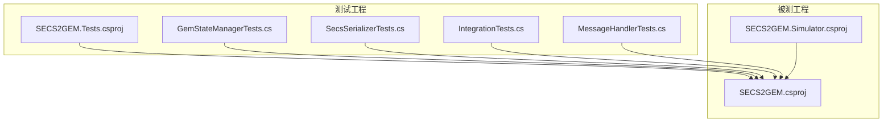
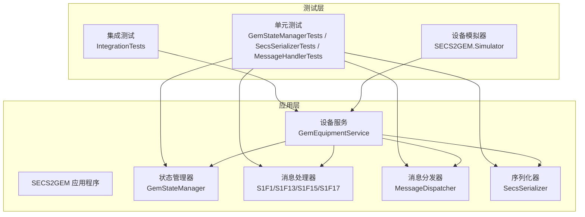
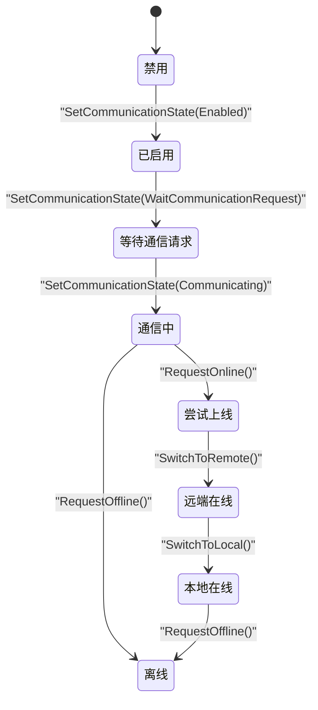
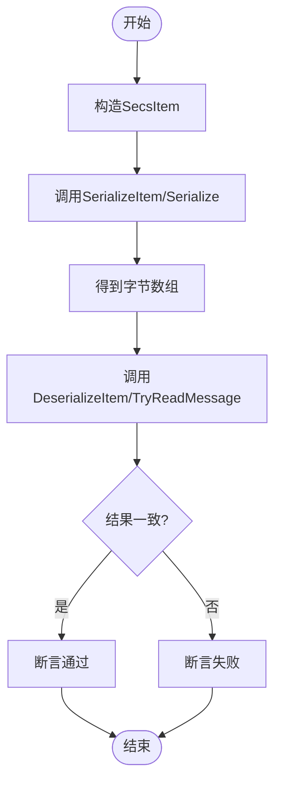
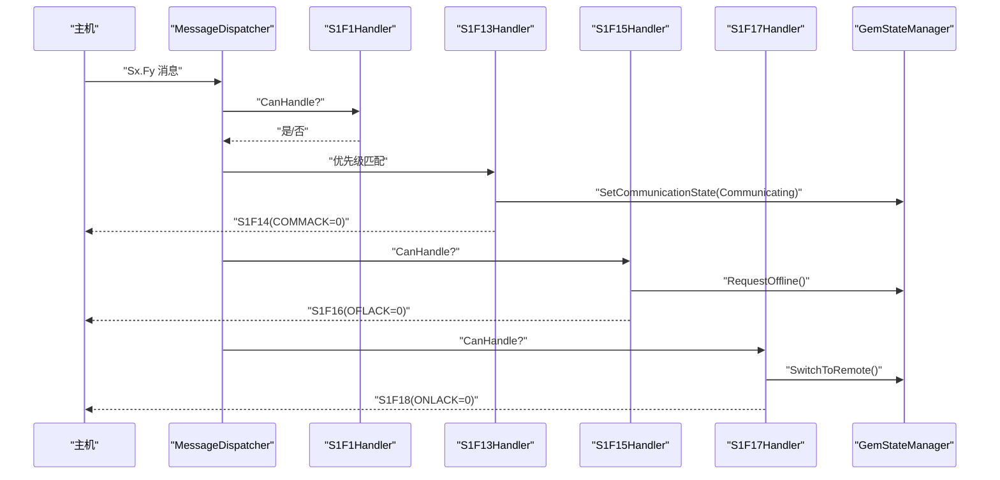
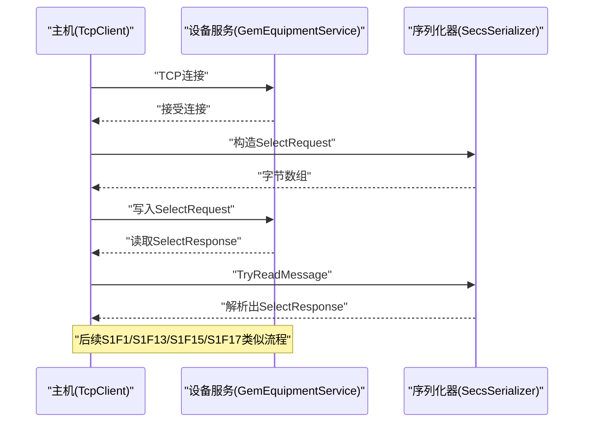
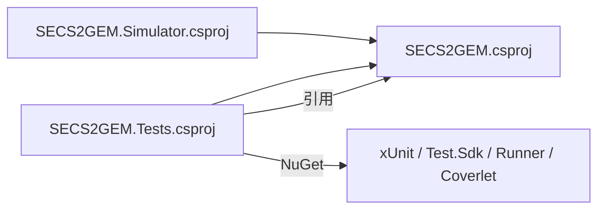

# 测试策略

<cite>
**本文引用的文件**
- [GemStateManagerTests.cs](file://WebGem/SECS2GEM.Tests/GemStateManagerTests.cs)
- [SecsSerializerTests.cs](file://WebGem/SECS2GEM.Tests/SecsSerializerTests.cs)
- [IntegrationTests.cs](file://WebGem/SECS2GEM.Tests/IntegrationTests.cs)
- [MessageHandlerTests.cs](file://WebGem/SECS2GEM.Tests/MessageHandlerTests.cs)
- [SECS2GEM.Tests.csproj](file://WebGem/SECS2GEM.Tests/SECS2GEM.Tests.csproj)
- [SECS2GEM.csproj](file://WebGem/SECS2GEM/SECS2GEM.csproj)
- [SECS2GEM.Simulator.csproj](file://WebGem/SECS2GEM.Simulator/SECS2GEM.Simulator.csproj)
- [README.md](file://README.md)
</cite>

## 目录
1. [引言](#引言)
2. [项目结构](#项目结构)
3. [核心组件](#核心组件)
4. [架构总览](#架构总览)
5. [详细组件分析](#详细组件分析)
6. [依赖关系分析](#依赖关系分析)
7. [性能与压力测试](#性能与压力测试)
8. [测试环境与数据准备](#测试环境与数据准备)
9. [持续集成与自动化测试](#持续集成与自动化测试)
10. [故障排查指南](#故障排查指南)
11. [结论](#结论)
12. [附录](#附录)

## 引言
本测试策略文档面向SECS2-GEM项目，系统性阐述单元测试、集成测试的设计与实施方法，覆盖状态管理、序列化、消息处理与设备模拟器等关键模块。文档同时给出测试最佳实践、覆盖率目标、设备模拟器使用方式、测试数据准备与环境配置、CI/CD与自动化测试流程建议，以及性能与压力测试方法与常见问题排查思路。

## 项目结构
测试工程位于WebGem/SECS2GEM.Tests，包含以下测试类：
- GemStateManagerTests：针对设备状态机的状态转换、状态变量与设备常量的单元测试
- SecsSerializerTests：针对SECS数据项与消息的序列化/反序列化、往返测试与HSMS消息读取的单元测试
- IntegrationTests：基于TCP的端到端集成测试，验证连接建立、选择请求、S1F1/S1F13/S1F15/S1F17等典型消息交互
- MessageHandlerTests：针对S1F1/S1F13/S1F15/S1F17等消息处理器与消息分发器的单元测试
- SECS2GEM.Tests.csproj：测试工程的NuGet包与项目引用配置

图表来源
- [SECS2GEM.Tests.csproj:1-25](file://WebGem/SECS2GEM.Tests/SECS2GEM.Tests.csproj#L1-L25)
- [SECS2GEM.csproj:1-10](file://WebGem/SECS2GEM/SECS2GEM.csproj#L1-L10)
- [SECS2GEM.Simulator.csproj:1-15](file://WebGem/SECS2GEM.Simulator/SECS2GEM.Simulator.csproj#L1-L15)

章节来源
- [SECS2GEM.Tests.csproj:1-25](file://WebGem/SECS2GEM.Tests/SECS2GEM.Tests.csproj#L1-L25)
- [SECS2GEM.csproj:1-10](file://WebGem/SECS2GEM/SECS2GEM.csproj#L1-L10)
- [SECS2GEM.Simulator.csproj:1-15](file://WebGem/SECS2GEM.Simulator/SECS2GEM.Simulator.csproj#L1-L15)

## 核心组件
- 状态管理器单元测试：覆盖初始状态、通信/控制/处理状态转换、标准与自定义状态变量、只读与范围约束的设备常量设置
- 序列化单元测试：覆盖ASCII/U4/Binary等格式的序列化与大端序校验、嵌套列表解析、复杂消息往返一致性、HSMS消息头长度与类型校验、TryReadMessage的不完整/完整数据处理
- 集成测试：通过TcpClient模拟主机侧，验证设备服务在被动模式下的连接接受、Select请求响应、S1F1/S1F13/S1F15/S1F17等消息链路
- 消息处理器单元测试：验证S1F1/S1F13/S1F15/S1F17处理器对状态机的影响与响应消息结构，以及消息分发器的路由与优先级

章节来源
- [GemStateManagerTests.cs:1-365](file://WebGem/SECS2GEM.Tests/GemStateManagerTests.cs#L1-L365)
- [SecsSerializerTests.cs:1-296](file://WebGem/SECS2GEM.Tests/SecsSerializerTests.cs#L1-L296)
- [IntegrationTests.cs:1-194](file://WebGem/SECS2GEM.Tests/IntegrationTests.cs#L1-L194)
- [MessageHandlerTests.cs:1-279](file://WebGem/SECS2GEM.Tests/MessageHandlerTests.cs#L1-L279)

## 架构总览
下图展示了测试策略在系统中的位置与交互关系：测试工程引用被测工程；集成测试通过网络层与被测设备服务交互；消息处理器与状态管理器共同构成业务处理链路。

图表来源
- [GemStateManagerTests.cs:1-365](file://WebGem/SECS2GEM.Tests/GemStateManagerTests.cs#L1-L365)
- [SecsSerializerTests.cs:1-296](file://WebGem/SECS2GEM.Tests/SecsSerializerTests.cs#L1-L296)
- [IntegrationTests.cs:1-194](file://WebGem/SECS2GEM.Tests/IntegrationTests.cs#L1-L194)
- [MessageHandlerTests.cs:1-279](file://WebGem/SECS2GEM.Tests/MessageHandlerTests.cs#L1-L279)
- [SECS2GEM.Simulator.csproj:1-15](file://WebGem/SECS2GEM.Simulator/SECS2GEM.Simulator.csproj#L1-L15)

## 详细组件分析

### 状态管理器测试（GemStateManager）
- 初始状态断言：模型名、软件版本、通信/控制/处理状态、在线与远程标志位
- 标准状态变量注册：时钟变量与控制状态变量的存在性与类型
- 通信状态转换：Disabled→Enabled→WaitCommunicationRequest→Communicating 的成功转换与事件触发
- 控制状态转换：离线→尝试上线→远端在线→本地在线→离线 的正确流转与在线标志变化
- 处理状态转换：Idle→Setup→Ready→Executing→Paused 的顺序转换
- 状态变量：注册/更新/动态值获取/全量查询
- 设备常量：注册/只读保护/数值范围校验/TrySet失败路径

图表来源
- [GemStateManagerTests.cs:1-365](file://WebGem/SECS2GEM.Tests/GemStateManagerTests.cs#L1-L365)

章节来源
- [GemStateManagerTests.cs:1-365](file://WebGem/SECS2GEM.Tests/GemStateManagerTests.cs#L1-L365)

### 序列化器测试（SecsSerializer）
- 数据项序列化：ASCII/U4/Binary格式字节序列与长度、大端序校验、空列表与嵌套列表
- 数据项反序列化：ASCII字符串还原、U4大端序解析、嵌套列表结构校验
- 往返测试：多组输入（空串、普通文本、极大/极小整数、复杂消息）的序列化-反序列化一致性
- HSMS消息序列化：数据消息最小长度、Select请求控制消息类型校验
- TryReadMessage：不完整长度字段返回false、完整消息可完整解析并消费字节数

图表来源
- [SecsSerializerTests.cs:1-296](file://WebGem/SECS2GEM.Tests/SecsSerializerTests.cs#L1-L296)

章节来源
- [SecsSerializerTests.cs:1-296](file://WebGem/SECS2GEM.Tests/SecsSerializerTests.cs#L1-L296)

### 消息处理器与分发器测试（MessageHandlerTests）
- S1F1处理器：返回S1F2，包含模型名与软件版本的两元素列表
- S1F13处理器：在前置状态满足条件下进入通信中，并返回S1F14（COMMACK=0）
- S1F15处理器：从在线状态切换至离线，并返回S1F16（OFLACK=0）
- S1F17处理器：在通信中状态下切换至远端在线，并返回S1F18（ONLACK=0）
- 分发器：按消息类型路由到对应处理器，无处理器时返回S9F7错误；支持优先级排序

图表来源
- [MessageHandlerTests.cs:1-279](file://WebGem/SECS2GEM.Tests/MessageHandlerTests.cs#L1-L279)

章节来源
- [MessageHandlerTests.cs:1-279](file://WebGem/SECS2GEM.Tests/MessageHandlerTests.cs#L1-L279)

### 集成测试（IntegrationTests）
- 生命周期：IAsyncLifetime，在InitializeAsync中以被动模式启动设备服务并等待；DisposeAsync中关闭客户端与释放资源
- 连接测试：主机通过TcpClient连接设备服务，验证连接成功
- Select请求：发送Select请求，接收Select响应（长度与类型校验）
- S1F1：请求设备模型与版本，期望S1F2响应
- S1F13：建立通信，期望S1F14（COMMACK=0）
- S1F15：请求离线，期望S1F16（OFLACK=0）
- S1F17：请求在线，期望S1F18（ONLACK=0）
- 辅助方法：SendSelectAsync与ReadResponseAsync封装重复逻辑

图表来源
- [IntegrationTests.cs:1-194](file://WebGem/SECS2GEM.Tests/IntegrationTests.cs#L1-L194)

章节来源
- [IntegrationTests.cs:1-194](file://WebGem/SECS2GEM.Tests/IntegrationTests.cs#L1-L194)

## 依赖关系分析
- 测试工程引用被测工程，确保测试可访问应用层组件（状态管理器、序列化器、消息处理器、设备服务等）
- 测试工程使用xUnit作为测试框架，Microsoft.NET.Test.Sdk提供运行时，coverlet.collector用于覆盖率收集
- 设备模拟器项目引用被测工程，便于在真实网络环境下进行端到端验证

图表来源
- [SECS2GEM.Tests.csproj:1-25](file://WebGem/SECS2GEM.Tests/SECS2GEM.Tests.csproj#L1-L25)
- [SECS2GEM.csproj:1-10](file://WebGem/SECS2GEM/SECS2GEM.csproj#L1-L10)
- [SECS2GEM.Simulator.csproj:1-15](file://WebGem/SECS2GEM.Simulator/SECS2GEM.Simulator.csproj#L1-L15)

章节来源
- [SECS2GEM.Tests.csproj:1-25](file://WebGem/SECS2GEM.Tests/SECS2GEM.Tests.csproj#L1-L25)
- [SECS2GEM.csproj:1-10](file://WebGem/SECS2GEM/SECS2GEM.csproj#L1-L10)
- [SECS2GEM.Simulator.csproj:1-15](file://WebGem/SECS2GEM.Simulator/SECS2GEM.Simulator.csproj#L1-L15)

## 性能与压力测试
- 单元测试层面：通过参数化测试（Theory/InlineData）覆盖边界值与极端输入，如极大/极小整数、超长ASCII字符串、深度嵌套列表，评估序列化/反序列化与状态转换的稳定性
- 集成测试层面：构造高频消息序列（如循环发送S1F1/S1F17），测量响应延迟与吞吐；结合TryReadMessage的缓冲区复用，验证粘包/半包处理的健壮性
- 压力测试建议：使用外部工具或脚本批量生成Sx.Fy消息，统计成功率、平均/95百分位延迟、异常率；结合设备模拟器进行端到端压测
- 资源与并发：关注TcpClient连接池、消息分发器的并发处理能力、状态管理器的线程安全与锁竞争

[本节为通用指导，无需列出具体文件来源]

## 测试环境与数据准备
- 环境要求：.NET 10.0（测试工程）、.NET 9.0（被测工程与模拟器）
- 端口预留：集成测试使用固定端口（示例：15000），需确保测试期间无其他进程占用
- 配置要点：设备服务采用被动模式（Passive）启动，AutoOnline与InitialRemoteMode按需开启
- 测试数据：消息体数据建议来源于实际协议规范，确保ASCII、U4、Binary等格式的边界值覆盖；状态变量与设备常量的ID与范围需符合GEM规范
- 日志与诊断：集成测试可结合日志输出定位问题；设备模拟器可辅助观察消息收发

章节来源
- [IntegrationTests.cs:1-194](file://WebGem/SECS2GEM.Tests/IntegrationTests.cs#L1-L194)
- [SECS2GEM.Tests.csproj:1-25](file://WebGem/SECS2GEM.Tests/SECS2GEM.Tests.csproj#L1-L25)
- [SECS2GEM.csproj:1-10](file://WebGem/SECS2GEM/SECS2GEM.csproj#L1-L10)
- [SECS2GEM.Simulator.csproj:1-15](file://WebGem/SECS2GEM.Simulator/SECS2GEM.Simulator.csproj#L1-L15)

## 持续集成与自动化测试
- 测试执行：在CI流水线中安装.NET SDK后，直接执行测试工程的构建与测试命令，自动收集测试结果
- 覆盖率：启用coverlet.collector，生成覆盖率报告（cobertura/json/html），设定阈值（如语句覆盖率≥80%、分支覆盖率≥70%）
- 并行与隔离：测试之间避免共享状态；集成测试使用随机端口或容器化隔离，减少相互干扰
- 报告与归档：上传测试日志与覆盖率报告，便于回溯与审计

章节来源
- [SECS2GEM.Tests.csproj:1-25](file://WebGem/SECS2GEM.Tests/SECS2GEM.Tests.csproj#L1-L25)

## 故障排查指南
- 单元测试失败
  - 序列化/反序列化：检查格式码与长度字段计算是否符合协议；确认大端序处理与数组切片边界
  - 状态转换：核对前置状态是否满足转换条件；关注事件订阅与异步回调时机
  - 状态变量/设备常量：确认ID唯一性与类型匹配；只读/范围限制的TrySet应返回false且值不变
- 集成测试失败
  - 连接问题：确认端口未被占用；检查防火墙与Loopback地址；适当增加初始化等待时间
  - 消息解析：使用TryReadMessage逐帧解析，记录已消费字节数；对比期望的消息类型与内容
  - 设备模拟器：优先使用内置模拟器进行端到端验证，必要时开启详细日志
- 性能问题
  - 优化序列化路径：减少中间对象分配；复用缓冲区；避免不必要的装箱/拆箱
  - 并发优化：降低锁粒度；使用异步I/O；合理设置队列与背压策略

章节来源
- [SecsSerializerTests.cs:1-296](file://WebGem/SECS2GEM.Tests/SecsSerializerTests.cs#L1-L296)
- [GemStateManagerTests.cs:1-365](file://WebGem/SECS2GEM.Tests/GemStateManagerTests.cs#L1-L365)
- [IntegrationTests.cs:1-194](file://WebGem/SECS2GEM.Tests/IntegrationTests.cs#L1-L194)
- [MessageHandlerTests.cs:1-279](file://WebGem/SECS2GEM.Tests/MessageHandlerTests.cs#L1-L279)

## 结论
本测试策略以单元测试保证核心算法与状态机的正确性，以集成测试覆盖端到端通信链路，辅以消息处理器与分发器的专项验证。通过设备模拟器与参数化测试提升覆盖率与鲁棒性，并结合CI/CD与覆盖率指标保障质量门槛。建议在持续迭代中逐步完善压力测试与回归测试矩阵，确保系统在高负载与复杂场景下的稳定性。

## 附录
- 测试覆盖率建议
  - 语句覆盖率：≥80%
  - 分支覆盖率：≥70%
  - 方法覆盖率：≥90%
  - 行为覆盖率：重点覆盖状态转换、异常路径与边界条件
- 关键测试清单
  - 状态管理器：初始状态、所有状态转换、状态变量与设备常量
  - 序列化器：所有格式的序列化/反序列化、往返测试、TryReadMessage
  - 消息处理器：S1F1/S1F13/S1F15/S1F17的响应与状态影响、分发器路由与优先级
  - 集成测试：连接、Select、S1F1、S1F13、S1F15、S1F17的完整链路

[本节为通用指导，无需列出具体文件来源]