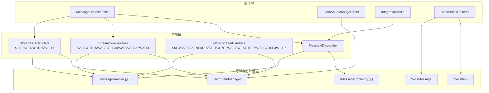
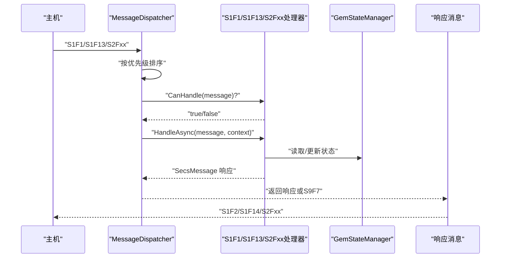
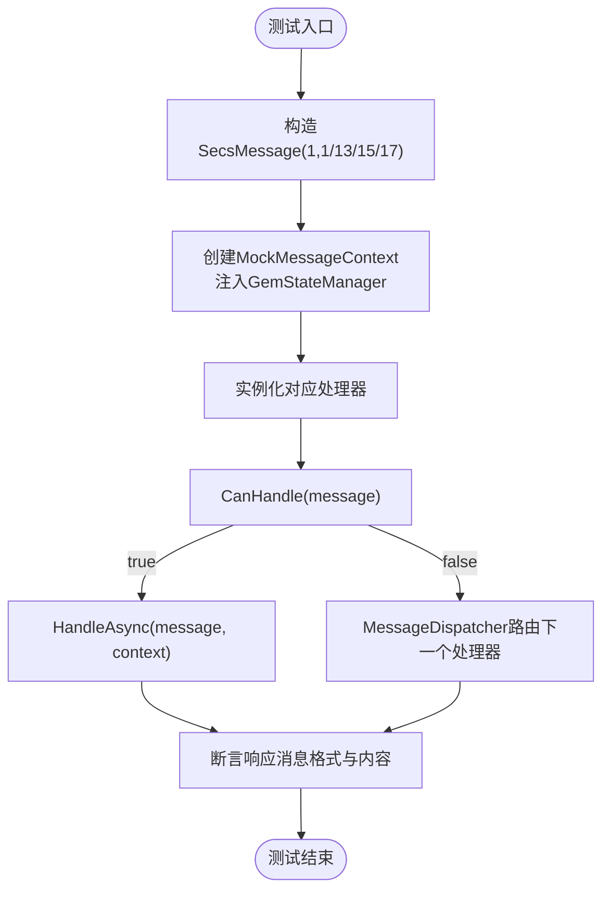
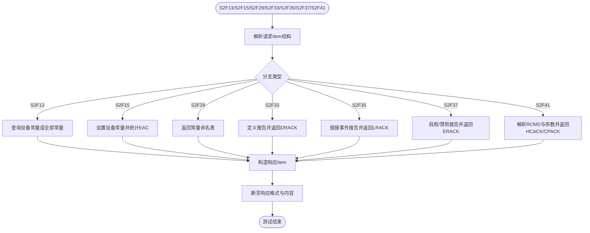
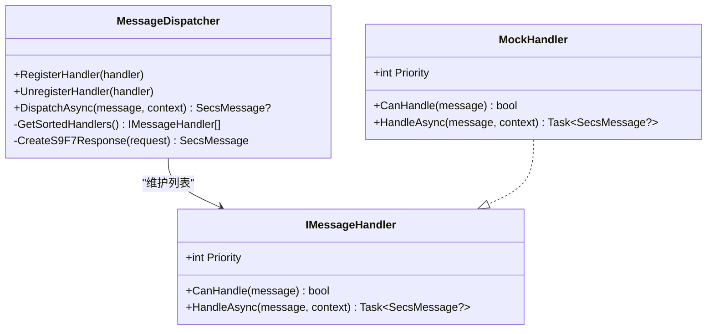
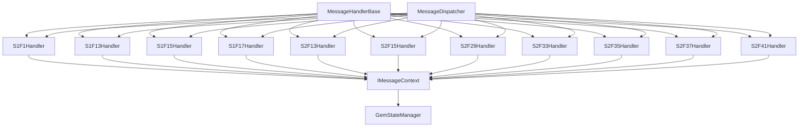

# 消息处理器测试

<cite>
**本文档引用的文件**
- [MessageHandlerTests.cs](file://WebGem/SECS2GEM.Tests/MessageHandlerTests.cs)
- [StreamOneHandlers.cs](file://WebGem/SECS2GEM/Application/Handlers/StreamOneHandlers.cs)
- [StreamTwoHandlers.cs](file://WebGem/SECS2GEM/Application/Handlers/StreamTwoHandlers.cs)
- [OtherStreamHandlers.cs](file://WebGem/SECS2GEM/Application/Handlers/OtherStreamHandlers.cs)
- [MessageDispatcher.cs](file://WebGem/SECS2GEM/Application/Messaging/MessageDispatcher.cs)
- [IMessageHandler.cs](file://WebGem/SECS2GEM/Domain/Interfaces/IMessageHandler.cs)
- [IMessageContext.cs](file://WebGem/SECS2GEM/Domain/Interfaces/IMessageContext.cs)
- [SecsMessage.cs](file://WebGem/SECS2GEM/Core/Entities/SecsMessage.cs)
- [SecsItem.cs](file://WebGem/SECS2GEM/Core/Entities/SecsItem.cs)
- [GemStateManager.cs](file://WebGem/SECS2GEM/Application/State/GemStateManager.cs)
- [GemStateManagerTests.cs](file://WebGem/SECS2GEM.Tests/GemStateManagerTests.cs)
- [IntegrationTests.cs](file://WebGem/SECS2GEM.Tests/IntegrationTests.cs)
- [SecsSerializerTests.cs](file://WebGem/SECS2GEM.Tests/SecsSerializerTests.cs)
</cite>

## 目录
1. [简介](#简介)
2. [项目结构](#项目结构)
3. [核心组件](#核心组件)
4. [架构总览](#架构总览)
5. [详细组件分析](#详细组件分析)
6. [依赖关系分析](#依赖关系分析)
7. [性能考虑](#性能考虑)
8. [故障排除指南](#故障排除指南)
9. [结论](#结论)
10. [附录](#附录)

## 简介
本测试文档聚焦于SECS2-GEM项目的消息处理器测试，特别是MessageHandlerTests中对Stream处理器的测试方法。文档系统性地解释了StreamOneHandlers与StreamTwoHandlers的测试策略，涵盖消息格式验证、处理器路由测试、异常处理测试、自定义消息处理器正确性验证、数据驱动测试与边界条件测试，并提供测试用例设计、模拟数据构造与结果验证方法，以确保消息处理的完整性与可靠性。

## 项目结构
SECS2-GEM采用分层架构，消息处理涉及以下关键模块：
- 应用层处理器：按Stream分类的处理器（S1/S2/其他）
- 消息分发器：负责将消息路由到合适的处理器
- 状态管理：维护设备状态并影响处理器行为
- 实体与序列化：SECS消息与数据项的建模与序列化
- 测试层：单元测试、集成测试与序列化测试

图表来源
- [StreamOneHandlers.cs:1-211](file://WebGem/SECS2GEM/Application/Handlers/StreamOneHandlers.cs#L1-L211)
- [StreamTwoHandlers.cs:1-331](file://WebGem/SECS2GEM/Application/Handlers/StreamTwoHandlers.cs#L1-L331)
- [OtherStreamHandlers.cs:1-276](file://WebGem/SECS2GEM/Application/Handlers/OtherStreamHandlers.cs#L1-L276)
- [MessageDispatcher.cs:1-123](file://WebGem/SECS2GEM/Application/Messaging/MessageDispatcher.cs#L1-L123)
- [IMessageHandler.cs:1-131](file://WebGem/SECS2GEM/Domain/Interfaces/IMessageHandler.cs#L1-L131)
- [IMessageContext.cs:1-48](file://WebGem/SECS2GEM/Domain/Interfaces/IMessageContext.cs#L1-L48)
- [GemStateManager.cs:1-492](file://WebGem/SECS2GEM/Application/State/GemStateManager.cs#L1-L492)
- [SecsMessage.cs:1-209](file://WebGem/SECS2GEM/Core/Entities/SecsMessage.cs#L1-L209)
- [SecsItem.cs:1-480](file://WebGem/SECS2GEM/Core/Entities/SecsItem.cs#L1-L480)
- [MessageHandlerTests.cs:1-279](file://WebGem/SECS2GEM.Tests/MessageHandlerTests.cs#L1-L279)
- [GemStateManagerTests.cs:1-365](file://WebGem/SECS2GEM.Tests/GemStateManagerTests.cs#L1-L365)
- [IntegrationTests.cs:1-194](file://WebGem/SECS2GEM.Tests/IntegrationTests.cs#L1-L194)
- [SecsSerializerTests.cs:1-296](file://WebGem/SECS2GEM.Tests/SecsSerializerTests.cs#L1-L296)

章节来源
- [MessageHandlerTests.cs:1-279](file://WebGem/SECS2GEM.Tests/MessageHandlerTests.cs#L1-L279)
- [StreamOneHandlers.cs:1-211](file://WebGem/SECS2GEM/Application/Handlers/StreamOneHandlers.cs#L1-L211)
- [StreamTwoHandlers.cs:1-331](file://WebGem/SECS2GEM/Application/Handlers/StreamTwoHandlers.cs#L1-L331)
- [OtherStreamHandlers.cs:1-276](file://WebGem/SECS2GEM/Application/Handlers/OtherStreamHandlers.cs#L1-L276)
- [MessageDispatcher.cs:1-123](file://WebGem/SECS2GEM/Application/Messaging/MessageDispatcher.cs#L1-L123)
- [IMessageHandler.cs:1-131](file://WebGem/SECS2GEM/Domain/Interfaces/IMessageHandler.cs#L1-L131)
- [IMessageContext.cs:1-48](file://WebGem/SECS2GEM/Domain/Interfaces/IMessageContext.cs#L1-L48)
- [SecsMessage.cs:1-209](file://WebGem/SECS2GEM/Core/Entities/SecsMessage.cs#L1-L209)
- [SecsItem.cs:1-480](file://WebGem/SECS2GEM/Core/Entities/SecsItem.cs#L1-L480)
- [GemStateManager.cs:1-492](file://WebGem/SECS2GEM/Application/State/GemStateManager.cs#L1-L492)
- [GemStateManagerTests.cs:1-365](file://WebGem/SECS2GEM.Tests/GemStateManagerTests.cs#L1-L365)
- [IntegrationTests.cs:1-194](file://WebGem/SECS2GEM.Tests/IntegrationTests.cs#L1-L194)
- [SecsSerializerTests.cs:1-296](file://WebGem/SECS2GEM.Tests/SecsSerializerTests.cs#L1-L296)

## 核心组件
- 消息处理器接口与基类：定义处理器的统一行为与优先级机制，提供模板方法模式的异常处理与错误响应生成。
- Stream处理器：按Stream分类实现具体业务逻辑，如S1F1/S1F13/S1F15/S1F17（S1）、S2F13/S2F15/S2F29/S2F33/S2F35/S2F37/S2F41（S2）等。
- 消息分发器：维护处理器列表，按优先级排序并根据CanHandle进行路由，未匹配时按WBit返回S9F7错误。
- 状态管理器：提供设备状态（通信/控制/处理）与状态变量、设备常量的读写，影响处理器行为。
- 测试辅助：MockMessageContext与MockHandler用于隔离测试环境；测试用例覆盖消息格式、路由、优先级与异常处理。

章节来源
- [IMessageHandler.cs:63-88](file://WebGem/SECS2GEM/Domain/Interfaces/IMessageHandler.cs#L63-L88)
- [StreamOneHandlers.cs:20-86](file://WebGem/SECS2GEM/Application/Handlers/StreamOneHandlers.cs#L20-L86)
- [StreamTwoHandlers.cs:13-331](file://WebGem/SECS2GEM/Application/Handlers/StreamTwoHandlers.cs#L13-L331)
- [MessageDispatcher.cs:27-123](file://WebGem/SECS2GEM/Application/Messaging/MessageDispatcher.cs#L27-L123)
- [GemStateManager.cs:22-492](file://WebGem/SECS2GEM/Application/State/GemStateManager.cs#L22-L492)
- [MessageHandlerTests.cs:223-279](file://WebGem/SECS2GEM.Tests/MessageHandlerTests.cs#L223-L279)

## 架构总览
消息处理的端到端流程如下：
- 主机发送Primary消息（如S1F1、S1F13等）
- MessageDispatcher根据优先级与CanHandle选择处理器
- 处理器基于GemStateManager的状态与配置生成响应（如S1F2、S1F14等）
- 若未匹配处理器且WBit为真，返回S9F7错误

图表来源
- [MessageDispatcher.cs:67-91](file://WebGem/SECS2GEM/Application/Messaging/MessageDispatcher.cs#L67-L91)
- [StreamOneHandlers.cs:94-114](file://WebGem/SECS2GEM/Application/Handlers/StreamOneHandlers.cs#L94-L114)
- [StreamTwoHandlers.cs:13-138](file://WebGem/SECS2GEM/Application/Handlers/StreamTwoHandlers.cs#L13-L138)
- [GemStateManager.cs:22-492](file://WebGem/SECS2GEM/Application/State/GemStateManager.cs#L22-L492)

## 详细组件分析

### StreamOneHandlers 测试策略
S1F1、S1F13、S1F15、S1F17分别对应Are You There、建立通信、请求离线、请求上线等核心流程。测试要点：
- 消息格式验证：检查响应消息的Stream、Function、Item格式与内容。
- 处理器路由：验证MessageDispatcher能正确将消息路由到对应处理器。
- 状态转换：结合GemStateManager测试状态转换的正确性（如通信状态、控制状态）。
- 异常处理：验证MessageHandlerBase的异常捕获与S9F7错误响应生成。

图表来源
- [MessageHandlerTests.cs:24-161](file://WebGem/SECS2GEM.Tests/MessageHandlerTests.cs#L24-L161)
- [StreamOneHandlers.cs:94-210](file://WebGem/SECS2GEM/Application/Handlers/StreamOneHandlers.cs#L94-L210)
- [MessageDispatcher.cs:67-91](file://WebGem/SECS2GEM/Application/Messaging/MessageDispatcher.cs#L67-L91)

章节来源
- [MessageHandlerTests.cs:24-161](file://WebGem/SECS2GEM.Tests/MessageHandlerTests.cs#L24-L161)
- [StreamOneHandlers.cs:94-210](file://WebGem/SECS2GEM/Application/Handlers/StreamOneHandlers.cs#L94-L210)
- [GemStateManagerTests.cs:48-172](file://WebGem/SECS2GEM.Tests/GemStateManagerTests.cs#L48-L172)

### StreamTwoHandlers 测试策略
S2F13（查询设备常量）、S2F15（设置设备常量）、S2F29（设备常量命名表）、S2F33/S2F35/S2F37（报告定义/链接/启用/禁用）、S2F41（主机命令）等。测试要点：
- 数据驱动：针对不同输入（空列表、指定ECID、无效ECID）构造多种场景，验证输出结构与值。
- 边界条件：空消息、空列表、无效参数、只部分成功等情况下的EAC/DRACK/LRACK/ERACK/HCACK。
- 自定义处理器：S2F41支持注册自定义命令，测试命令注册、参数解析与ACK返回。

图表来源
- [StreamTwoHandlers.cs:13-331](file://WebGem/SECS2GEM/Application/Handlers/StreamTwoHandlers.cs#L13-L331)
- [MessageHandlerTests.cs:163-220](file://WebGem/SECS2GEM.Tests/MessageHandlerTests.cs#L163-L220)

章节来源
- [StreamTwoHandlers.cs:13-331](file://WebGem/SECS2GEM/Application/Handlers/StreamTwoHandlers.cs#L13-L331)
- [MessageHandlerTests.cs:163-220](file://WebGem/SECS2GEM.Tests/MessageHandlerTests.cs#L163-L220)

### 其他Stream处理器测试策略
S5F3/S5F5/S5F7（报警）、S6F15/S6F19（事件报告）、S7F1/S7F3/S7F5/S7F17/S7F19（配方）、S10F3/S10F5（终端显示）等。测试要点：
- 简化实现：多数处理器为“接受/返回空”简化逻辑，重点验证ACK码与基本结构。
- 结构一致性：确保响应消息的Stream、Function与Item结构符合协议规范。

章节来源
- [OtherStreamHandlers.cs:1-276](file://WebGem/SECS2GEM/Application/Handlers/OtherStreamHandlers.cs#L1-L276)

### 消息分发器测试策略
- 路由测试：注册多个处理器，验证MessageDispatcher能正确选择首个CanHandle为true的处理器。
- 优先级测试：通过MockHandler设置不同Priority，验证高优先级处理器被优先选择。
- 无处理器测试：发送未知消息，验证在WBit为真时返回S9F7。

图表来源
- [MessageDispatcher.cs:27-123](file://WebGem/SECS2GEM/Application/Messaging/MessageDispatcher.cs#L27-L123)
- [IMessageHandler.cs:63-88](file://WebGem/SECS2GEM/Domain/Interfaces/IMessageHandler.cs#L63-L88)
- [MessageHandlerTests.cs:250-279](file://WebGem/SECS2GEM.Tests/MessageHandlerTests.cs#L250-L279)

章节来源
- [MessageDispatcher.cs:27-123](file://WebGem/SECS2GEM/Application/Messaging/MessageDispatcher.cs#L27-L123)
- [MessageHandlerTests.cs:163-220](file://WebGem/SECS2GEM.Tests/MessageHandlerTests.cs#L163-L220)

### 自定义消息处理器测试方法
- 注册与路由：通过MessageDispatcher.RegisterHandler注册自定义处理器，验证CanHandle与HandleAsync。
- 优先级控制：通过Priority属性控制处理器优先级，确保覆盖默认行为。
- 模拟上下文：使用MockMessageContext注入GemStateManager与设备信息，避免外部依赖。
- 参数校验：对输入参数进行边界与异常场景测试，确保错误路径返回正确的ACK码或S9F7。

章节来源
- [MessageDispatcher.cs:37-58](file://WebGem/SECS2GEM/Application/Messaging/MessageDispatcher.cs#L37-L58)
- [MessageHandlerTests.cs:223-279](file://WebGem/SECS2GEM.Tests/MessageHandlerTests.cs#L223-L279)

### 数据驱动与边界条件测试
- 数据驱动：针对S2F13/S2F15/S2F29等处理器，构造多组输入（空列表、指定ID、无效ID、混合情况）进行批量验证。
- 边界条件：空消息、空Item、无效格式、越界值、只部分成功（EAC=1）等。
- 序列化一致性：结合SecsSerializerTests验证消息往返序列化与反序列化的正确性。

章节来源
- [SecsSerializerTests.cs:16-296](file://WebGem/SECS2GEM.Tests/SecsSerializerTests.cs#L16-L296)
- [SecsMessage.cs:1-209](file://WebGem/SECS2GEM/Core/Entities/SecsMessage.cs#L1-L209)
- [SecsItem.cs:1-480](file://WebGem/SECS2GEM/Core/Entities/SecsItem.cs#L1-L480)

### 结果验证方法
- 断言响应消息：检查Stream、Function、Item格式与值。
- 断言状态变化：结合GemStateManagerTests验证状态转换事件与状态值。
- 断言错误响应：验证S9F7错误消息的Header包含原始消息的Stream/Function。
- 断言优先级：验证高优先级处理器被优先选择。

章节来源
- [MessageHandlerTests.cs:24-220](file://WebGem/SECS2GEM.Tests/MessageHandlerTests.cs#L24-L220)
- [GemStateManagerTests.cs:1-365](file://WebGem/SECS2GEM.Tests/GemStateManagerTests.cs#L1-L365)

## 依赖关系分析
- 处理器依赖：各处理器依赖MessageHandlerBase的模板方法与异常处理机制。
- 上下文依赖：处理器通过IMessageContext访问设备ID、连接、状态与回复能力。
- 状态依赖：处理器行为受GemStateManager的状态与设备常量影响。
- 分发器依赖：MessageDispatcher依赖IMessageHandler接口与优先级排序。

图表来源
- [StreamOneHandlers.cs:20-210](file://WebGem/SECS2GEM/Application/Handlers/StreamOneHandlers.cs#L20-L210)
- [StreamTwoHandlers.cs:13-331](file://WebGem/SECS2GEM/Application/Handlers/StreamTwoHandlers.cs#L13-L331)
- [IMessageContext.cs:15-48](file://WebGem/SECS2GEM/Domain/Interfaces/IMessageContext.cs#L15-L48)
- [GemStateManager.cs:22-492](file://WebGem/SECS2GEM/Application/State/GemStateManager.cs#L22-L492)
- [MessageDispatcher.cs:27-123](file://WebGem/SECS2GEM/Application/Messaging/MessageDispatcher.cs#L27-L123)

章节来源
- [StreamOneHandlers.cs:20-210](file://WebGem/SECS2GEM/Application/Handlers/StreamOneHandlers.cs#L20-L210)
- [StreamTwoHandlers.cs:13-331](file://WebGem/SECS2GEM/Application/Handlers/StreamTwoHandlers.cs#L13-L331)
- [IMessageContext.cs:15-48](file://WebGem/SECS2GEM/Domain/Interfaces/IMessageContext.cs#L15-L48)
- [GemStateManager.cs:22-492](file://WebGem/SECS2GEM/Application/State/GemStateManager.cs#L22-L492)
- [MessageDispatcher.cs:27-123](file://WebGem/SECS2GEM/Application/Messaging/MessageDispatcher.cs#L27-L123)

## 性能考虑
- 处理器优先级缓存：MessageDispatcher对处理器列表按优先级排序后缓存，减少重复排序开销。
- 线程安全：GemStateManager内部使用锁保护状态变更，避免并发冲突。
- 序列化效率：SecsItem采用不可变设计与静态工厂方法，降低对象创建成本。

[本节为通用指导，无需列出章节来源]

## 故障排除指南
- 未匹配处理器：若MessageDispatcher未找到CanHandle为true的处理器且WBit为真，将返回S9F7。检查处理器注册与CanHandle实现。
- 状态不一致：若处理器依赖状态（如S1F13/S1F17），请先通过GemStateManagerTests验证状态转换逻辑。
- 序列化问题：若响应消息结构异常，参考SecsSerializerTests验证Item序列化/反序列化正确性。
- 自定义处理器：确保自定义处理器实现CanHandle与HandleAsync，并正确设置Priority。

章节来源
- [MessageDispatcher.cs:83-91](file://WebGem/SECS2GEM/Application/Messaging/MessageDispatcher.cs#L83-L91)
- [GemStateManagerTests.cs:48-172](file://WebGem/SECS2GEM.Tests/GemStateManagerTests.cs#L48-L172)
- [SecsSerializerTests.cs:160-296](file://WebGem/SECS2GEM.Tests/SecsSerializerTests.cs#L160-L296)

## 结论
MessageHandlerTests系统性地覆盖了SECS2-GEM的消息处理核心路径，通过严格的格式验证、路由测试、优先级验证与异常处理测试，确保处理器在真实场景中的可靠性。结合数据驱动与边界条件测试，以及与状态管理与序列化测试的协同，能够有效提升系统的完整性与可维护性。

[本节为总结性内容，无需列出章节来源]

## 附录
- 测试用例设计建议
  - 为每个Stream/Function组合编写独立测试用例，覆盖正常路径与异常路径。
  - 使用参数化测试（Theory）覆盖多组输入数据，提高测试覆盖率。
  - 对关键状态转换编写集成测试，验证端到端流程。
- 模拟数据构造
  - 使用SecsItem静态工厂方法快速构造不同格式的数据项。
  - 使用SecsMessage工厂方法构造标准消息，便于测试响应生成。
- 结果验证清单
  - 响应消息的Stream/Function/Item格式与值
  - 状态变化事件触发与状态值
  - 错误响应（S9F7）的Header包含原始消息信息
  - 处理器优先级生效与覆盖行为

[本节为通用指导，无需列出章节来源]