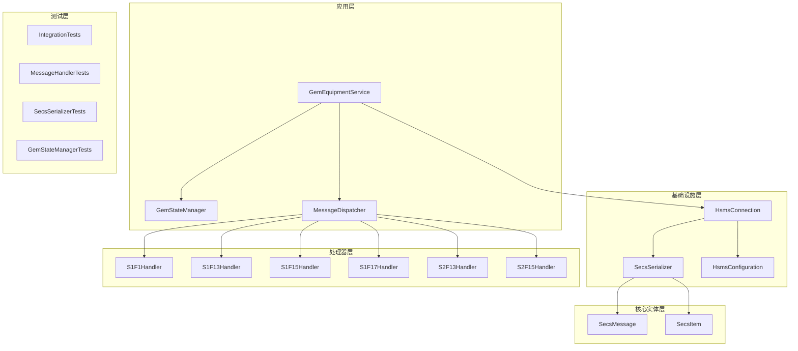
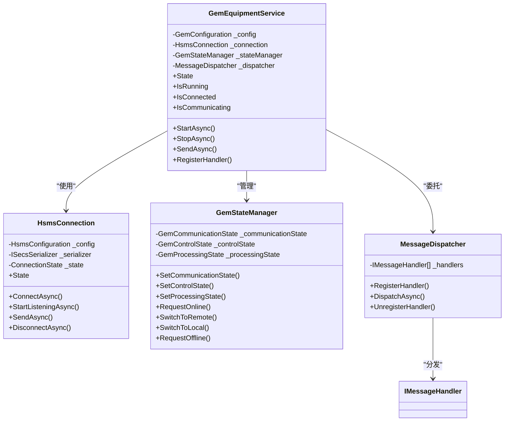
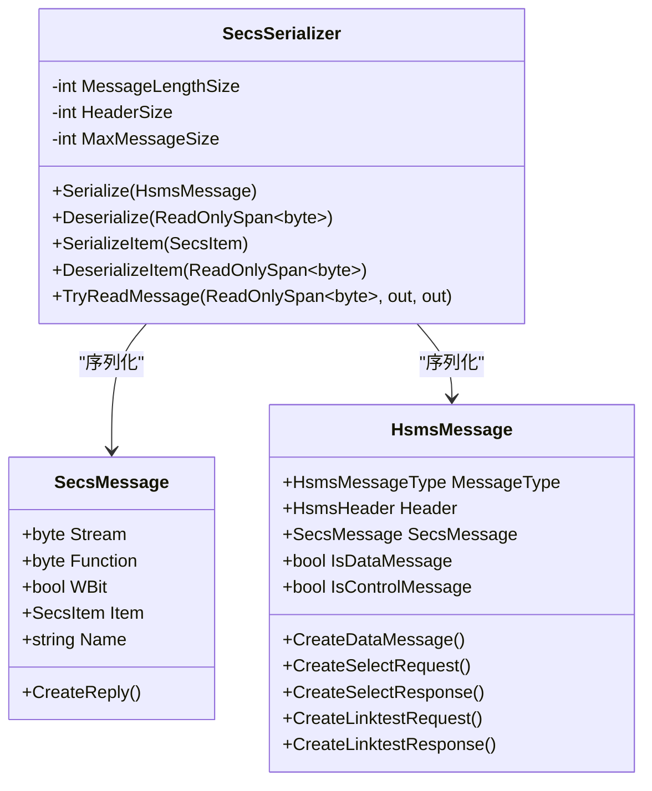
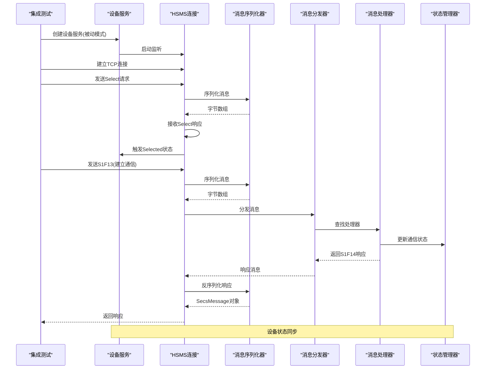
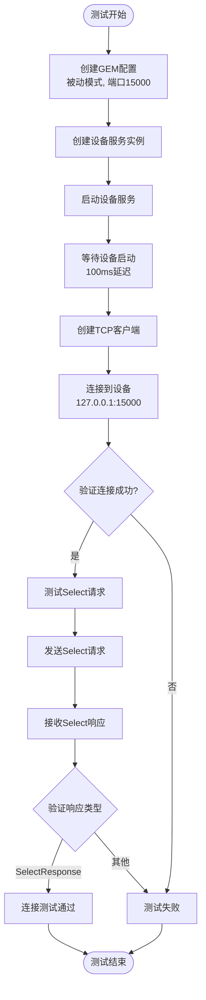
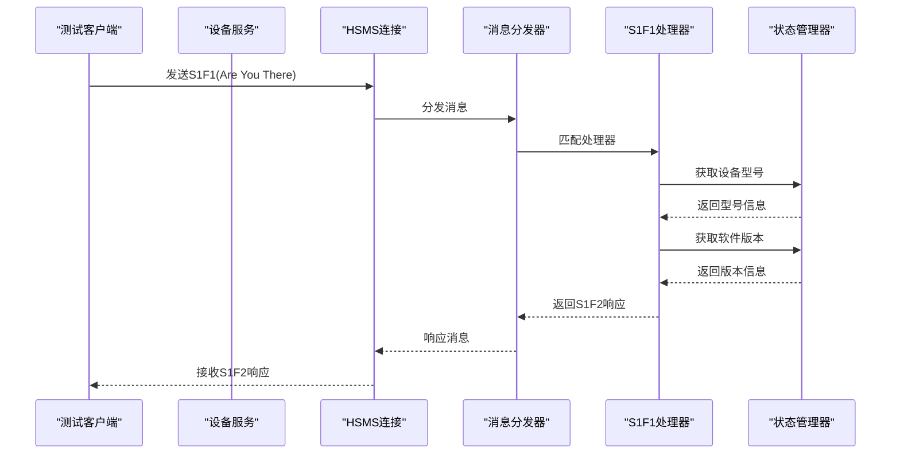
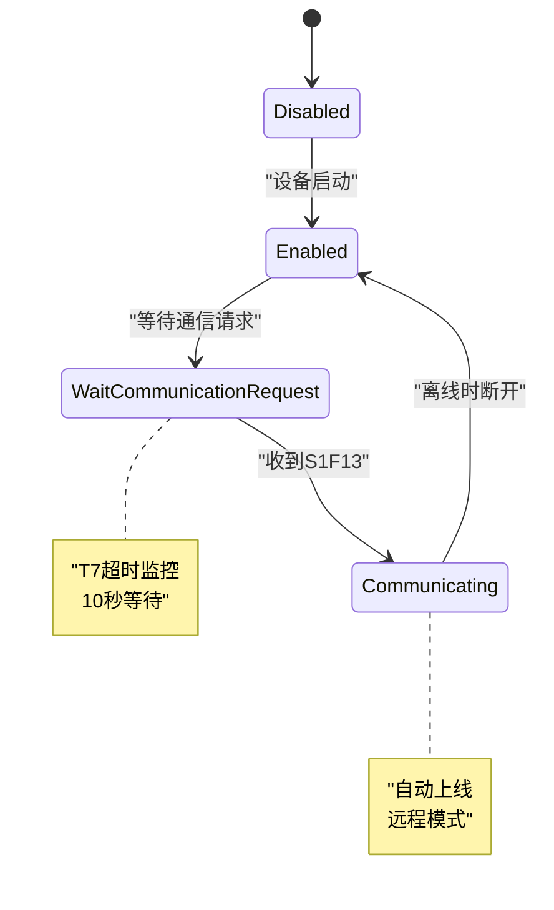
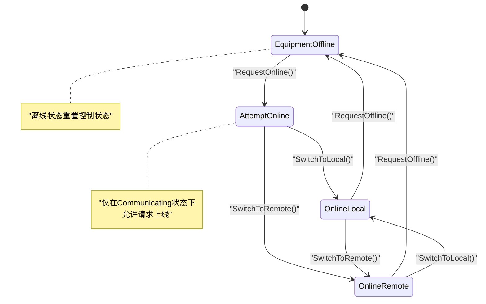
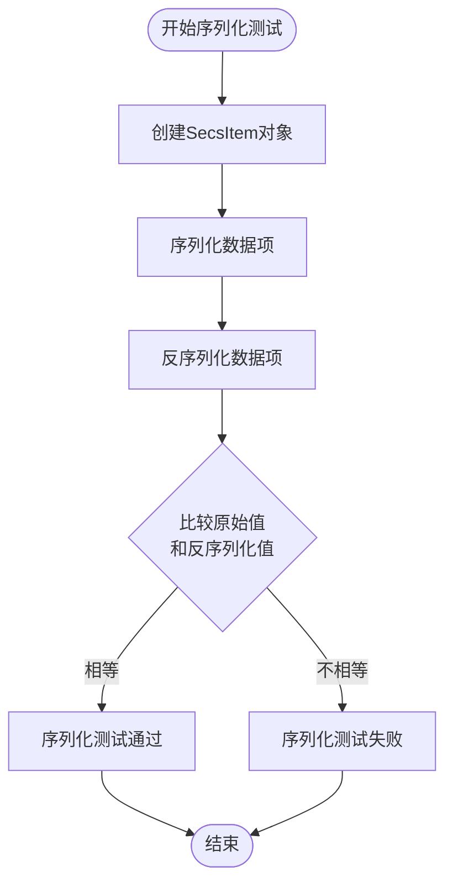
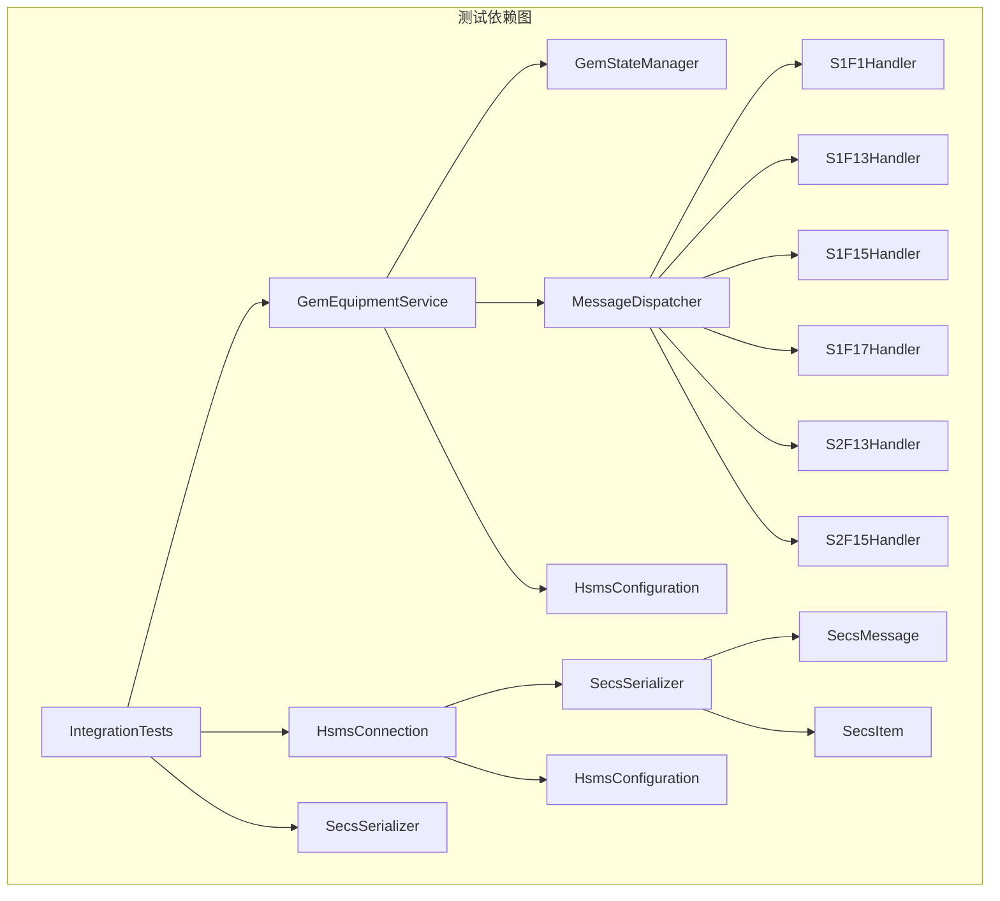

# 集成测试

<cite>
**本文档引用的文件**
- [IntegrationTests.cs](file://WebGem/SECS2GEM.Tests/IntegrationTests.cs)
- [GemEquipmentService.cs](file://WebGem/SECS2GEM/Application/Services/GemEquipmentService.cs)
- [HsmsConnection.cs](file://WebGem/SECS2GEM/Infrastructure/Connection/HsmsConnection.cs)
- [SecsSerializer.cs](file://WebGem/SECS2GEM/Infrastructure/Serialization/SecsSerializer.cs)
- [GemStateManager.cs](file://WebGem/SECS2GEM/Application/State/GemStateManager.cs)
- [MessageDispatcher.cs](file://WebGem/SECS2GEM/Application/Messaging/MessageDispatcher.cs)
- [SecsMessage.cs](file://WebGem/SECS2GEM/Core/Entities/SecsMessage.cs)
- [HsmsConfiguration.cs](file://WebGem/SECS2GEM/Infrastructure/Configuration/HsmsConfiguration.cs)
- [StreamOneHandlers.cs](file://WebGem/SECS2GEM/Application/Handlers/StreamOneHandlers.cs)
- [StreamTwoHandlers.cs](file://WebGem/SECS2GEM/Application/Handlers/StreamTwoHandlers.cs)
- [OtherStreamHandlers.cs](file://WebGem/SECS2GEM/Application/Handlers/OtherStreamHandlers.cs)
- [SECS2GEM.Tests.csproj](file://WebGem/SECS2GEM.Tests/SECS2GEM.Tests.csproj)
</cite>

## 目录
1. [简介](#简介)
2. [项目结构](#项目结构)
3. [核心组件](#核心组件)
4. [架构概览](#架构概览)
5. [详细组件分析](#详细组件分析)
6. [依赖关系分析](#依赖关系分析)
7. [性能考虑](#性能考虑)
8. [故障排除指南](#故障排除指南)
9. [结论](#结论)

## 简介

SECS2-GEM项目的集成测试旨在验证设备模拟器与核心库之间的完整通信链路。本测试文档详细说明了如何测试从HSMS连接建立到消息收发的完整SECS-II消息处理流程。

集成测试重点关注以下关键场景：
- 连接管理测试：验证设备服务的启动、连接接受和断开连接
- 消息处理测试：验证S1F1、S1F13、S1F15、S1F17等关键消息的处理
- 状态同步测试：验证GEM状态管理器的状态转换和事件通知
- 序列化测试：验证SECS消息的序列化和反序列化正确性

## 项目结构

SECS2-GEM项目采用分层架构设计，主要分为以下几个层次：

**图表来源**
- [GemEquipmentService.cs:1-456](file://WebGem/SECS2GEM/Application/Services/GemEquipmentService.cs#L1-L456)
- [HsmsConnection.cs:1-906](file://WebGem/SECS2GEM/Infrastructure/Connection/HsmsConnection.cs#L1-L906)
- [SecsSerializer.cs:1-662](file://WebGem/SECS2GEM/Infrastructure/Serialization/SecsSerializer.cs#L1-L662)

**章节来源**
- [GemEquipmentService.cs:1-456](file://WebGem/SECS2GEM/Application/Services/GemEquipmentService.cs#L1-L456)
- [HsmsConnection.cs:1-906](file://WebGem/SECS2GEM/Infrastructure/Connection/HsmsConnection.cs#L1-L906)

## 核心组件

### 设备服务组件

GemEquipmentService是整个系统的外观模式实现，整合了HSMS连接、消息分发和状态管理功能：

**图表来源**
- [GemEquipmentService.cs:33-454](file://WebGem/SECS2GEM/Application/Services/GemEquipmentService.cs#L33-L454)
- [HsmsConnection.cs:30-420](file://WebGem/SECS2GEM/Infrastructure/Connection/HsmsConnection.cs#L30-L420)
- [GemStateManager.cs:22-492](file://WebGem/SECS2GEM/Application/State/GemStateManager.cs#L22-L492)
- [MessageDispatcher.cs:27-123](file://WebGem/SECS2GEM/Application/Messaging/MessageDispatcher.cs#L27-L123)

### 序列化组件

SecsSerializer负责SECS-II消息的序列化和反序列化：

**图表来源**
- [SecsSerializer.cs:27-662](file://WebGem/SECS2GEM/Infrastructure/Serialization/SecsSerializer.cs#L27-L662)
- [SecsMessage.cs:18-209](file://WebGem/SECS2GEM/Core/Entities/SecsMessage.cs#L18-L209)

**章节来源**
- [GemEquipmentService.cs:33-454](file://WebGem/SECS2GEM/Application/Services/GemEquipmentService.cs#L33-L454)
- [SecsSerializer.cs:27-662](file://WebGem/SECS2GEM/Infrastructure/Serialization/SecsSerializer.cs#L27-L662)

## 架构概览

SECS2-GEM项目的集成测试架构展示了完整的消息处理链路：

**图表来源**
- [IntegrationTests.cs:14-194](file://WebGem/SECS2GEM.Tests/IntegrationTests.cs#L14-L194)
- [GemEquipmentService.cs:140-184](file://WebGem/SECS2GEM/Application/Services/GemEquipmentService.cs#L140-L184)
- [HsmsConnection.cs:550-610](file://WebGem/SECS2GEM/Infrastructure/Connection/HsmsConnection.cs#L550-L610)

**章节来源**
- [IntegrationTests.cs:14-194](file://WebGem/SECS2GEM.Tests/IntegrationTests.cs#L14-L194)
- [GemEquipmentService.cs:140-184](file://WebGem/SECS2GEM/Application/Services/GemEquipmentService.cs#L140-L184)

## 详细组件分析

### 连接管理测试

连接管理测试验证设备服务的生命周期管理和HSMS连接的建立过程：

**图表来源**
- [IntegrationTests.cs:21-62](file://WebGem/SECS2GEM.Tests/IntegrationTests.cs#L21-L62)

**章节来源**
- [IntegrationTests.cs:21-62](file://WebGem/SECS2GEM.Tests/IntegrationTests.cs#L21-L62)

### 消息处理测试

消息处理测试验证关键SECS-II消息的处理流程：

#### S1F1消息测试

S1F1消息用于设备状态查询，测试验证设备返回正确的型号和软件版本信息：

**图表来源**
- [IntegrationTests.cs:94-121](file://WebGem/SECS2GEM.Tests/IntegrationTests.cs#L94-L121)
- [StreamOneHandlers.cs:94-114](file://WebGem/SECS2GEM/Application/Handlers/StreamOneHandlers.cs#L94-L114)

#### S1F13消息测试

S1F13消息用于建立通信连接，测试验证通信状态的正确转换：

**图表来源**
- [IntegrationTests.cs:123-146](file://WebGem/SECS2GEM.Tests/IntegrationTests.cs#L123-L146)
- [GemStateManager.cs:201-223](file://WebGem/SECS2GEM/Application/State/GemStateManager.cs#L201-L223)

**章节来源**
- [IntegrationTests.cs:94-146](file://WebGem/SECS2GEM.Tests/IntegrationTests.cs#L94-L146)
- [StreamOneHandlers.cs:122-149](file://WebGem/SECS2GEM/Application/Handlers/StreamOneHandlers.cs#L122-L149)

### 状态同步测试

状态同步测试验证GEM状态管理器的状态转换和事件通知机制：

**图表来源**
- [GemStateManager.cs:263-348](file://WebGem/SECS2GEM/Application/State/GemStateManager.cs#L263-L348)

**章节来源**
- [GemStateManager.cs:196-350](file://WebGem/SECS2GEM/Application/State/GemStateManager.cs#L196-L350)

### 序列化测试

序列化测试验证SECS-II消息的序列化和反序列化正确性：

**图表来源**
- [SecsSerializerTests.cs:16-100](file://WebGem/SECS2GEM.Tests/SecsSerializerTests.cs#L16-L100)

**章节来源**
- [SecsSerializerTests.cs:16-296](file://WebGem/SECS2GEM.Tests/SecsSerializerTests.cs#L16-L296)

## 依赖关系分析

集成测试的依赖关系展示了各个组件之间的交互：

**图表来源**
- [IntegrationTests.cs:14-194](file://WebGem/SECS2GEM.Tests/IntegrationTests.cs#L14-L194)
- [GemEquipmentService.cs:33-454](file://WebGem/SECS2GEM/Application/Services/GemEquipmentService.cs#L33-L454)

**章节来源**
- [SECS2GEM.Tests.csproj:10-25](file://WebGem/SECS2GEM.Tests/SECS2GEM.Tests.csproj#L10-L25)

## 性能考虑

在集成测试中，需要考虑以下性能因素：

### 并发测试
- 使用多个TcpClient实例同时连接设备服务
- 验证连接池管理和资源回收
- 测试高并发下的消息处理能力

### 超时配置
- T3超时（回复超时）：45秒
- T6超时（控制事务）：5秒  
- T7超时（未选择超时）：10秒
- 心跳间隔：30秒，最大失败次数：3次

### 缓冲区管理
- 接收缓冲区：64KB
- 发送缓冲区：64KB
- 最大消息大小：16MB

## 故障排除指南

### 常见问题及解决方案

#### 连接失败
**症状**：测试无法连接到设备服务
**原因**：
- 端口被占用
- 设备服务未正确启动
- 网络配置错误

**解决方案**：
1. 检查端口配置（默认15000）
2. 验证设备服务启动状态
3. 使用netstat检查端口占用情况

#### 消息处理超时
**症状**：S1F13消息处理超时
**原因**：
- T7超时设置过短
- 网络延迟过高
- 设备状态未正确转换

**解决方案**：
1. 调整T7超时配置
2. 检查设备状态转换逻辑
3. 验证消息序列化正确性

#### 状态不同步
**症状**：设备状态与预期不符
**原因**：
- 状态转换验证失败
- 事件订阅未正确设置
- 并发访问冲突

**解决方案**：
1. 检查状态转换验证逻辑
2. 确认事件订阅完整性
3. 添加必要的锁机制

**章节来源**
- [HsmsConnection.cs:280-296](file://WebGem/SECS2GEM/Infrastructure/Connection/HsmsConnection.cs#L280-L296)
- [GemStateManager.cs:201-223](file://WebGem/SECS2GEM/Application/State/GemStateManager.cs#L201-L223)

## 结论

SECS2-GEM项目的集成测试文档提供了完整的测试框架和最佳实践指导。通过验证设备模拟器与核心库之间的完整通信链路，确保了SECS-II消息处理流程的正确性和可靠性。

关键测试场景包括：
- 连接管理：验证设备服务的启动、连接接受和断开连接
- 消息处理：验证关键SECS-II消息的处理和响应
- 状态同步：验证GEM状态管理器的状态转换和事件通知
- 序列化验证：验证SECS消息的序列化和反序列化正确性

集成测试的最佳实践包括：
- 使用IAsyncLifetime接口管理测试生命周期
- 实现完整的连接和消息处理流程
- 验证状态同步和事件通知机制
- 提供详细的错误处理和调试信息

通过这些测试，可以确保SECS2-GEM系统在实际部署环境中能够稳定可靠地运行。