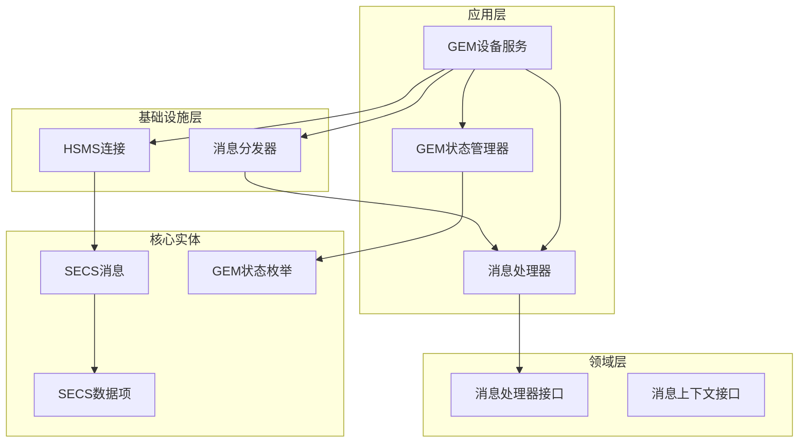
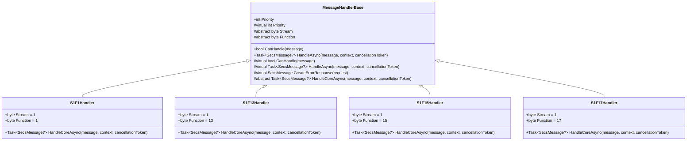
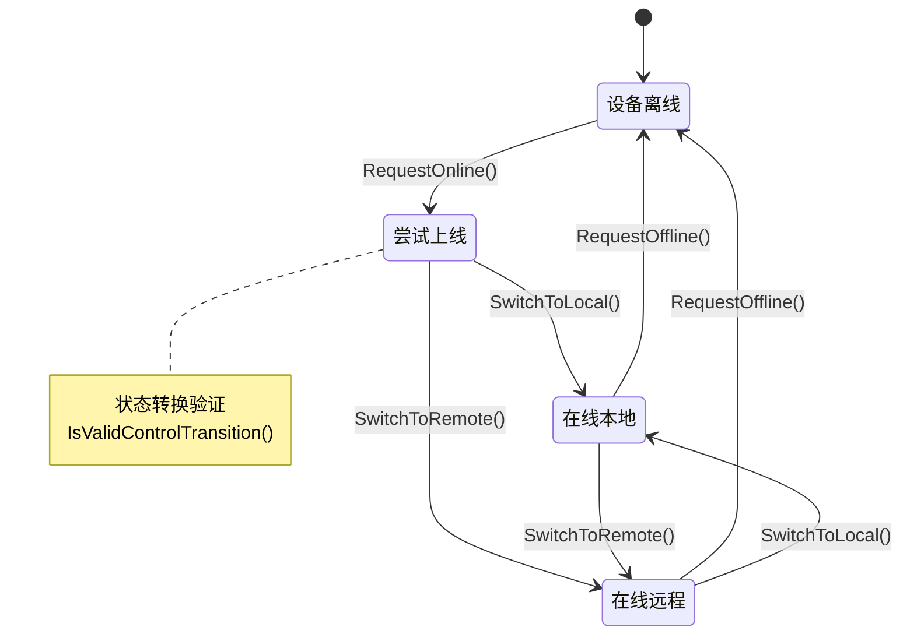
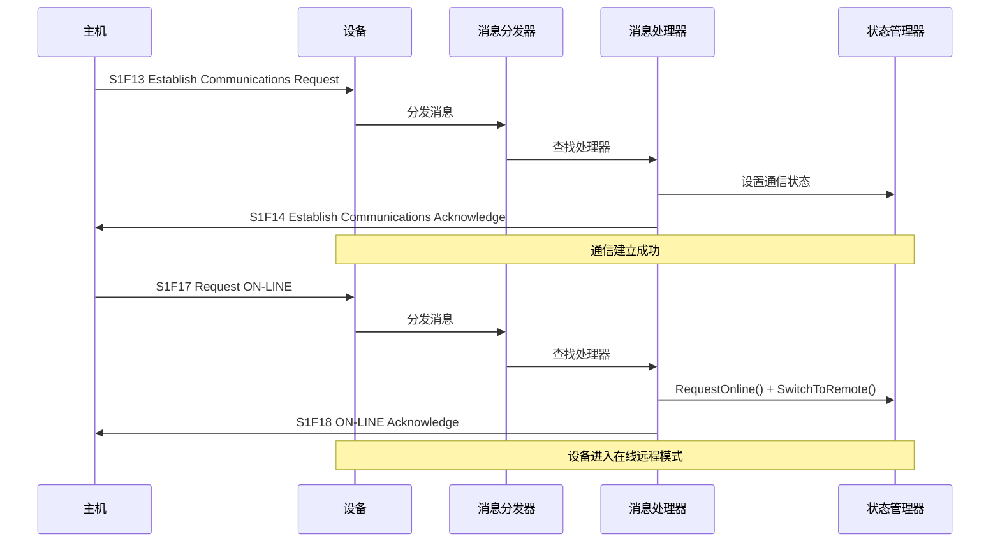
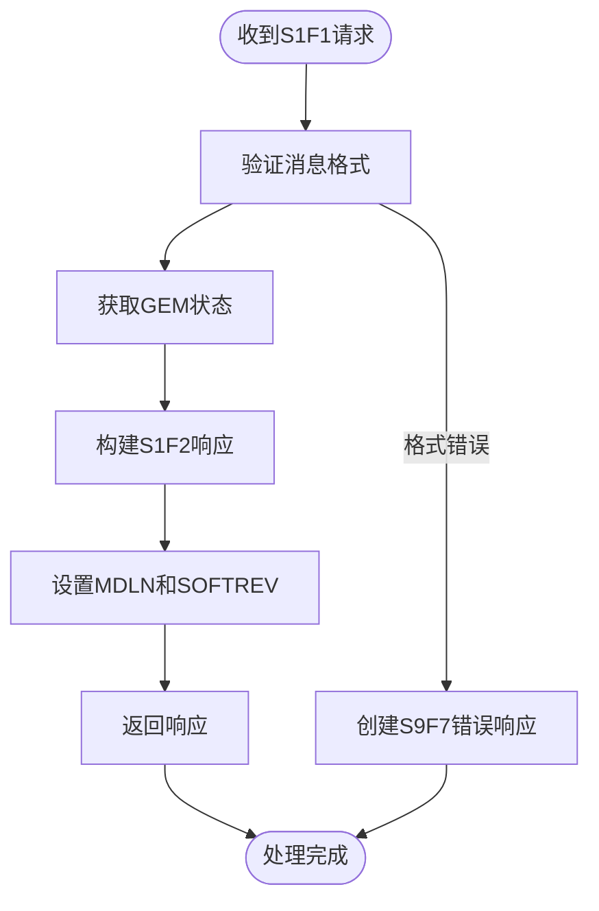
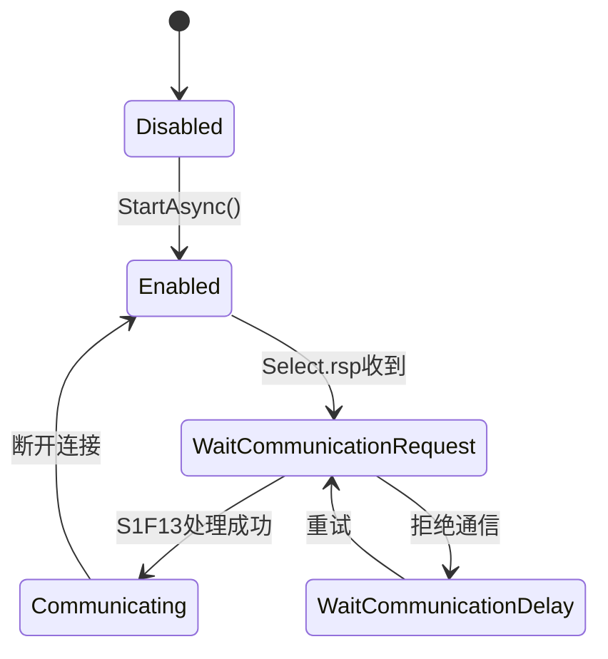
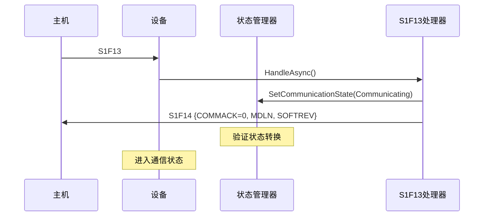
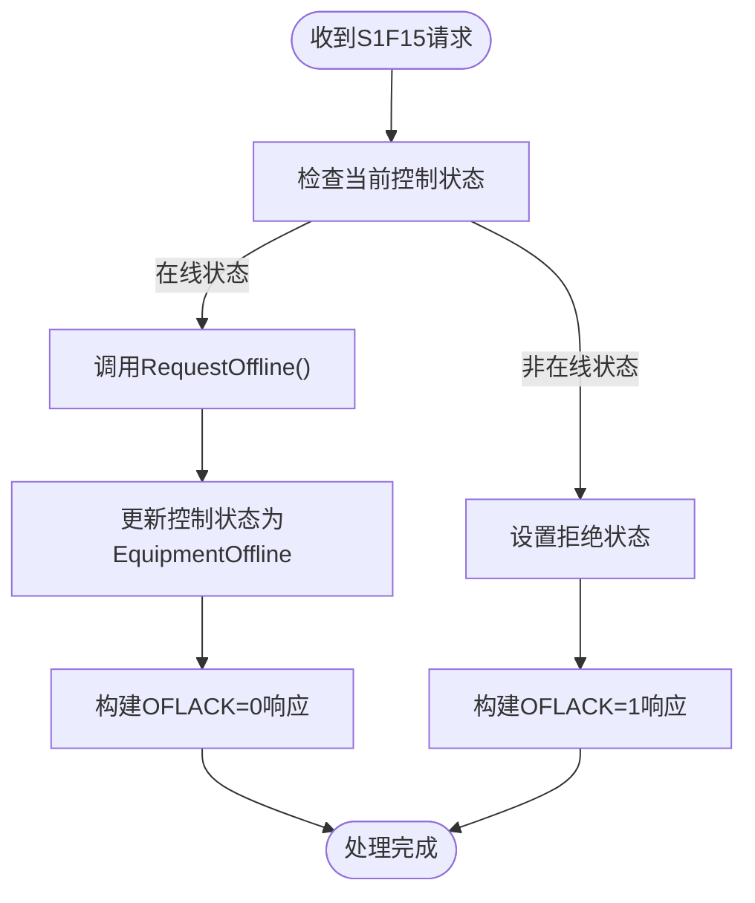
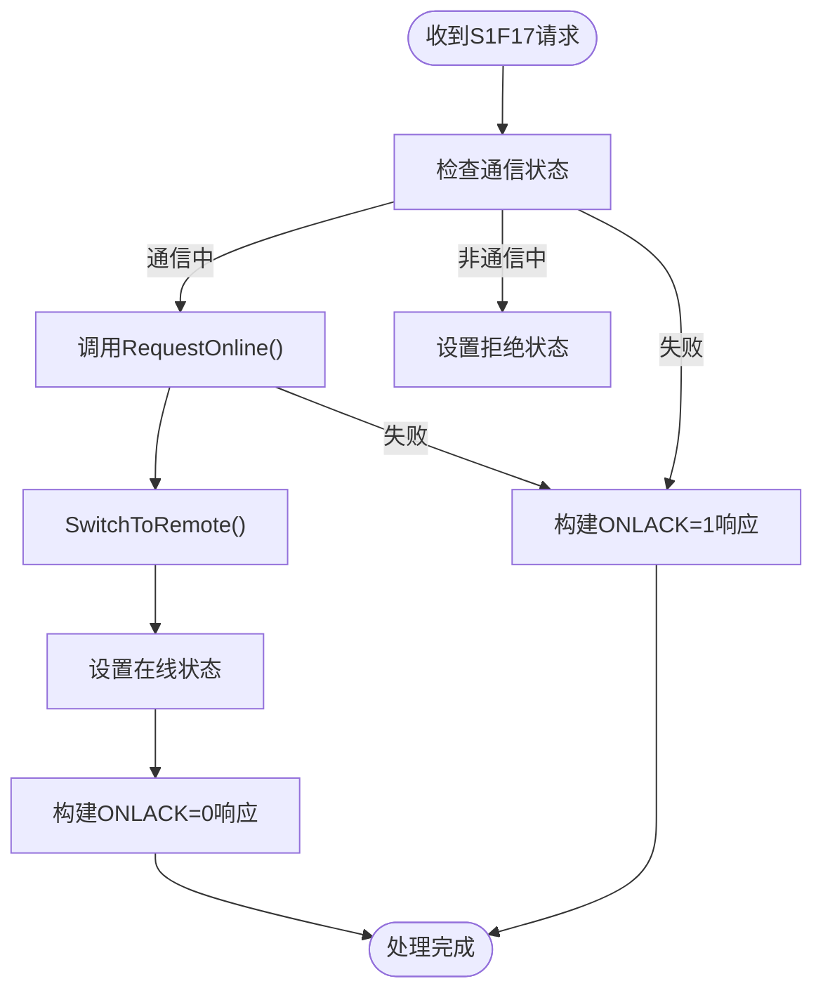
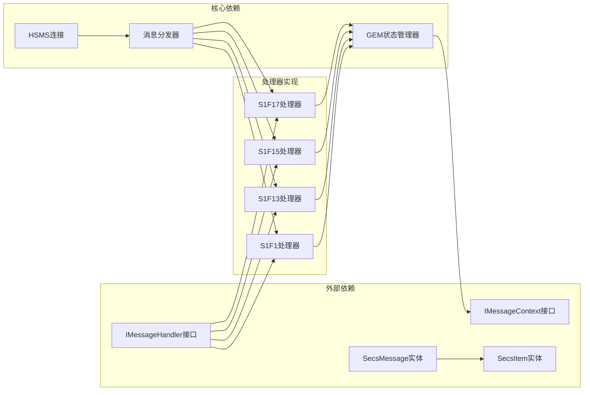

# Stream1消息处理器

<cite>
**本文档引用的文件**
- [StreamOneHandlers.cs](file://WebGem/SECS2GEM/Application/Handlers/StreamOneHandlers.cs)
- [GemEquipmentService.cs](file://WebGem/SECS2GEM/Application/Services/GemEquipmentService.cs)
- [GemStateManager.cs](file://WebGem/SECS2GEM/Application/State/GemStateManager.cs)
- [MessageDispatcher.cs](file://WebGem/SECS2GEM/Application/Messaging/MessageDispatcher.cs)
- [IMessageHandler.cs](file://WebGem/SECS2GEM/Domain/Interfaces/IMessageHandler.cs)
- [HsmsConnection.cs](file://WebGem/SECS2GEM/Infrastructure/Connection/HsmsConnection.cs)
- [SecsMessage.cs](file://WebGem/SECS2GEM/Core/Entities/SecsMessage.cs)
- [SecsItem.cs](file://WebGem/SECS2GEM/Core/Entities/SecsItem.cs)
- [ConnectionState.cs](file://WebGem/SECS2GEM/Core/Enums/ConnectionState.cs)
- [GemStates.cs](file://WebGem/SECS2GEM/Core/Enums/GemStates.cs)
- [MessageHandlerTests.cs](file://WebGem/SECS2GEM.Tests/MessageHandlerTests.cs)
- [HsmsConfiguration.cs](file://WebGem/SECS2GEM/Infrastructure/Configuration/HsmsConfiguration.cs)
</cite>

## 目录
1. [简介](#简介)
2. [项目结构](#项目结构)
3. [核心组件](#核心组件)
4. [架构概览](#架构概览)
5. [详细组件分析](#详细组件分析)
6. [依赖关系分析](#依赖关系分析)
7. [性能考虑](#性能考虑)
8. [故障排除指南](#故障排除指南)
9. [结论](#结论)

## 简介

Stream1消息处理器是SECS/GEM协议中最重要的通信管理组件之一，负责处理设备状态相关的消息交换。本文档深入分析S1F1、S1F13、S1F15、S1F17等关键消息处理器的实现原理和业务逻辑，涵盖设备连接检测、通信建立、离线/在线状态切换等核心功能。

这些处理器基于模板方法模式和策略模式设计，提供了统一的异常处理、日志记录和状态管理机制。通过严格的GEM状态转换规则，确保设备与主机之间的通信协调一致。

## 项目结构

SECS2GEM项目采用分层架构设计，Stream1消息处理器位于应用层的处理器模块中，与状态管理、消息分发、连接管理等核心组件紧密协作。

**图表来源**
- [StreamOneHandlers.cs:1-211](file://WebGem/SECS2GEM/Application/Handlers/StreamOneHandlers.cs#L1-L211)
- [GemEquipmentService.cs:1-456](file://WebGem/SECS2GEM/Application/Services/GemEquipmentService.cs#L1-L456)
- [GemStateManager.cs:1-492](file://WebGem/SECS2GEM/Application/State/GemStateManager.cs#L1-L492)

**章节来源**
- [StreamOneHandlers.cs:1-211](file://WebGem/SECS2GEM/Application/Handlers/StreamOneHandlers.cs#L1-L211)
- [GemEquipmentService.cs:1-456](file://WebGem/SECS2GEM/Application/Services/GemEquipmentService.cs#L1-L456)

## 核心组件

### 消息处理器基类

所有Stream1处理器都继承自`MessageHandlerBase`基类，该基类实现了模板方法模式，定义了统一的处理流程骨架。

**图表来源**
- [StreamOneHandlers.cs:20-86](file://WebGem/SECS2GEM/Application/Handlers/StreamOneHandlers.cs#L20-L86)
- [StreamOneHandlers.cs:94-210](file://WebGem/SECS2GEM/Application/Handlers/StreamOneHandlers.cs#L94-L210)

### GEM状态管理器

GEM状态管理器实现了完整的状态模式，管理设备的通信状态、控制状态和处理状态。

**图表来源**
- [GemStateManager.cs:263-348](file://WebGem/SECS2GEM/Application/State/GemStateManager.cs#L263-L348)

**章节来源**
- [GemStateManager.cs:1-492](file://WebGem/SECS2GEM/Application/State/GemStateManager.cs#L1-L492)

## 架构概览

Stream1消息处理器在整个SECS/GEM通信架构中扮演着关键角色，负责设备状态管理和通信控制。

**图表来源**
- [GemEquipmentService.cs:320-385](file://WebGem/SECS2GEM/Application/Services/GemEquipmentService.cs#L320-L385)
- [StreamOneHandlers.cs:122-149](file://WebGem/SECS2GEM/Application/Handlers/StreamOneHandlers.cs#L122-L149)

## 详细组件分析

### S1F1处理器 - 设备连接检测

S1F1处理器处理主机的Are You There连接检测请求，返回设备型号和软件版本信息。

#### 输入输出格式

| 消息类型 | 流号 | 功能号 | W-Bit | 数据项 | 说明 |
|---------|------|--------|-------|--------|------|
| 请求 | 1 | 1 | True | 无 | Are You There请求 |
| 响应 | 1 | 2 | False | L[A, A] | 设备型号 + 软件版本 |

#### 处理流程

**图表来源**
- [StreamOneHandlers.cs:99-113](file://WebGem/SECS2GEM/Application/Handlers/StreamOneHandlers.cs#L99-L113)

#### 业务逻辑

S1F1处理器实现了设备连接检测功能，通过返回设备的基本信息来确认设备的可用性。这是SECS/GEM协议中最基础的通信测试消息。

**章节来源**
- [StreamOneHandlers.cs:88-114](file://WebGem/SECS2GEM/Application/Handlers/StreamOneHandlers.cs#L88-L114)

### S1F13处理器 - 建立通信请求

S1F13处理器处理主机的通信建立请求，这是设备进入正常通信状态的关键步骤。

#### 输入输出格式

| 消息类型 | 流号 | 功能号 | W-Bit | 数据项 | 说明 |
|---------|------|--------|-------|--------|------|
| 请求 | 1 | 13 | True | L[A, A] | 设备型号 + 软件版本 |
| 响应 | 1 | 14 | False | L[B, L[A, A]] | COMMACK + 设备信息 |

#### 状态转换规则

**图表来源**
- [GemStateManager.cs:357-387](file://WebGem/SECS2GEM/Application/State/GemStateManager.cs#L357-L387)

#### 处理流程

**图表来源**
- [StreamOneHandlers.cs:127-148](file://WebGem/SECS2GEM/Application/Handlers/StreamOneHandlers.cs#L127-L148)

#### 错误处理机制

S1F13处理器对无效的状态转换进行严格验证，确保通信建立的正确性。如果状态转换不被允许，处理器会返回适当的错误响应。

**章节来源**
- [StreamOneHandlers.cs:116-149](file://WebGem/SECS2GEM/Application/Handlers/StreamOneHandlers.cs#L116-L149)

### S1F15处理器 - 请求离线

S1F15处理器处理主机的离线请求，使设备从在线状态切换到离线状态。

#### 输入输出格式

| 消息类型 | 流号 | 功能号 | W-Bit | 数据项 | 说明 |
|---------|------|--------|-------|--------|------|
| 请求 | 1 | 15 | True | 无 | 请求离线 |
| 响应 | 1 | 16 | False | B | OFLACK (0=成功, 1=失败) |

#### 状态转换规则

**图表来源**
- [StreamOneHandlers.cs:159-173](file://WebGem/SECS2GEM/Application/Handlers/StreamOneHandlers.cs#L159-L173)

#### 业务逻辑

S1F15处理器实现了设备离线功能，允许主机请求设备停止在线状态。处理器会验证当前状态是否允许离线操作，并返回相应的确认或拒绝响应。

**章节来源**
- [StreamOneHandlers.cs:151-174](file://WebGem/SECS2GEM/Application/Handlers/StreamOneHandlers.cs#L151-L174)

### S1F17处理器 - 请求在线

S1F17处理器处理主机的在线请求，使设备从离线状态切换到在线状态，并默认进入远程控制模式。

#### 输入输出格式

| 消息类型 | 流号 | 功能号 | W-Bit | 数据项 | 说明 |
|---------|------|--------|-------|--------|------|
| 请求 | 1 | 17 | True | 无 | 请求在线 |
| 响应 | 1 | 18 | False | B | ONLACK (0=接受, 1=拒绝) |

#### 状态转换流程

**图表来源**
- [StreamOneHandlers.cs:184-208](file://WebGem/SECS2GEM/Application/Handlers/StreamOneHandlers.cs#L184-L208)

#### 错误处理机制

S1F17处理器实现了智能的错误处理机制：
- 检查通信状态是否为Communicating
- 验证在线请求的有效性
- 返回适当的ONLACK响应码
- 在拒绝时保持设备的离线状态

**章节来源**
- [StreamOneHandlers.cs:176-209](file://WebGem/SECS2GEM/Application/Handlers/StreamOneHandlers.cs#L176-L209)

## 依赖关系分析

Stream1消息处理器与其他组件之间的依赖关系体现了清晰的分层架构设计。

**图表来源**
- [IMessageHandler.cs:63-88](file://WebGem/SECS2GEM/Domain/Interfaces/IMessageHandler.cs#L63-L88)
- [MessageDispatcher.cs:27-123](file://WebGem/SECS2GEM/Application/Messaging/MessageDispatcher.cs#L27-L123)

### 状态枚举定义

GEM协议定义了完整的状态体系，确保设备与主机之间的通信协调一致。

| 状态类型 | 状态枚举 | 描述 | 允许的转换 |
|----------|----------|------|------------|
| 通信状态 | Disabled | 通信禁用 | Enabled, WaitCommunicationRequest |
| 通信状态 | Enabled | 通信已启用 | Disabled, WaitCommunicationRequest |
| 通信状态 | WaitCommunicationRequest | 等待通信请求 | WaitCommunicationDelay, Communicating, Disabled |
| 控制状态 | EquipmentOffline | 设备离线 | AttemptOnline |
| 控制状态 | AttemptOnline | 尝试上线 | OnlineLocal, OnlineRemote, EquipmentOffline |
| 控制状态 | OnlineLocal | 在线本地控制 | OnlineRemote, EquipmentOffline |
| 控制状态 | OnlineRemote | 在线远程控制 | OnlineLocal, EquipmentOffline |

**章节来源**
- [GemStates.cs:10-121](file://WebGem/SECS2GEM/Core/Enums/GemStates.cs#L10-L121)

## 性能考虑

Stream1消息处理器在设计时充分考虑了性能优化和并发安全性：

### 并发安全设计

- 使用`lock`关键字保护状态转换的原子性
- 采用`ConcurrentDictionary`管理状态变量和设备常量
- 线程安全的状态管理器设计

### 内存管理

- 不可变设计的SECS消息和数据项
- 对象池化和重用机制减少GC压力
- 异步处理避免阻塞主线程

### 错误处理优化

- 统一的异常处理机制
- 快速失败策略
- 资源清理和释放

## 故障排除指南

### 常见问题及解决方案

#### 通信建立失败

**症状**: S1F13请求被拒绝，设备无法进入通信状态

**可能原因**:
1. 设备处于错误的通信状态
2. 主机提供的设备信息不匹配
3. 网络连接不稳定

**解决步骤**:
1. 检查设备的通信状态转换日志
2. 验证设备型号和软件版本信息
3. 确认网络连接的稳定性

#### 在线状态切换异常

**症状**: S1F17请求成功但设备未进入在线状态

**可能原因**:
1. RequestOnline()调用失败
2. SwitchToRemote()状态转换被拒绝
3. 控制状态验证失败

**解决步骤**:
1. 检查通信状态是否为Communicating
2. 验证状态转换规则
3. 查看状态变更事件日志

#### 离线请求处理错误

**症状**: S1F15请求返回OFLACK=1

**可能原因**:
1. 设备当前不在在线状态
2. RequestOffline()调用失败
3. 状态验证逻辑异常

**解决步骤**:
1. 确认设备的当前控制状态
2. 检查状态转换的有效性
3. 验证设备的在线状态

**章节来源**
- [MessageHandlerTests.cs:1-279](file://WebGem/SECS2GEM.Tests/MessageHandlerTests.cs#L1-L279)

## 结论

Stream1消息处理器是SECS/GEM协议通信管理的核心组件，通过四个关键处理器实现了完整的设备状态管理功能。该实现具有以下特点：

### 设计优势

1. **清晰的职责分离**: 每个处理器专注于特定的功能，便于维护和扩展
2. **严格的错误处理**: 统一的异常处理机制确保系统的稳定性
3. **灵活的状态管理**: 基于状态模式的设计支持复杂的业务逻辑
4. **高性能并发处理**: 线程安全的设计支持高并发场景

### 业务价值

- **设备连接检测**: S1F1处理器提供了基础的连接验证功能
- **通信建立管理**: S1F13处理器确保设备与主机的正确连接
- **在线状态控制**: S1F17处理器支持灵活的在线状态管理
- **离线状态处理**: S1F15处理器提供安全的离线操作能力

### 扩展性考虑

该实现为未来的功能扩展提供了良好的基础：
- 支持自定义处理器注册
- 灵活的状态转换规则
- 可配置的超时和重试机制
- 完善的日志和监控支持

通过深入理解这些处理器的实现原理，开发者可以更好地理解和应用SECS/GEM协议中的通信管理机制，为工业自动化和半导体制造等领域的设备通信提供可靠的技术支撑。