# Stream2消息处理器

<cite>
**本文档引用的文件**
- [StreamTwoHandlers.cs](file://WebGem/SECS2GEM/Application/Handlers/StreamTwoHandlers.cs)
- [GemStateManager.cs](file://WebGem/SECS2GEM/Application/State/GemStateManager.cs)
- [GemStates.cs](file://WebGem/SECS2GEM/Core/Enums/GemStates.cs)
- [IMessageHandler.cs](file://WebGem/SECS2GEM/Domain/Interfaces/IMessageHandler.cs)
- [IGemState.cs](file://WebGem/SECS2GEM/Domain/Interfaces/IGemState.cs)
- [MessageDispatcher.cs](file://WebGem/SECS2GEM/Application/Messaging/MessageDispatcher.cs)
- [GemEquipmentService.cs](file://WebGem/SECS2GEM/Application/Services/GemEquipmentService.cs)
- [HsmsConnection.cs](file://WebGem/SECS2GEM/Infrastructure/Connection/HsmsConnection.cs)
- [EquipmentConstant.cs](file://WebGem/SECS2GEM/Domain/Models/EquipmentConstant.cs)
- [StatusVariable.cs](file://WebGem/SECS2GEM/Domain/Models/StatusVariable.cs)
- [GemStateManagerTests.cs](file://WebGem/SECS2GEM.Tests/GemStateManagerTests.cs)
- [TransactionManager.cs](file://WebGem/SECS2GEM/Infrastructure/Services/TransactionManager.cs)
</cite>

## 目录
1. [简介](#简介)
2. [项目结构](#项目结构)
3. [核心组件](#核心组件)
4. [架构概览](#架构概览)
5. [详细组件分析](#详细组件分析)
6. [依赖关系分析](#依赖关系分析)
7. [性能考虑](#性能考虑)
8. [故障排除指南](#故障排除指南)
9. [结论](#结论)

## 简介

Stream2消息处理器是SECS/GEM协议实现中的核心组件，专门负责处理设备状态管理和配置相关的消息。本文档深入分析了S2F1、S2F3、S2F11、S2F13等状态管理相关消息处理器的实现机制，详细说明了设备状态查询、状态变更请求和状态确认等核心功能。

该处理器基于策略模式和模板方法模式设计，实现了高度模块化的消息处理架构。通过消息分发器和处理器基类，系统能够灵活地处理各种Stream2消息，同时保持良好的扩展性和维护性。

## 项目结构

Stream2消息处理器位于SECS2GEM应用程序的处理器层，采用清晰的分层架构：

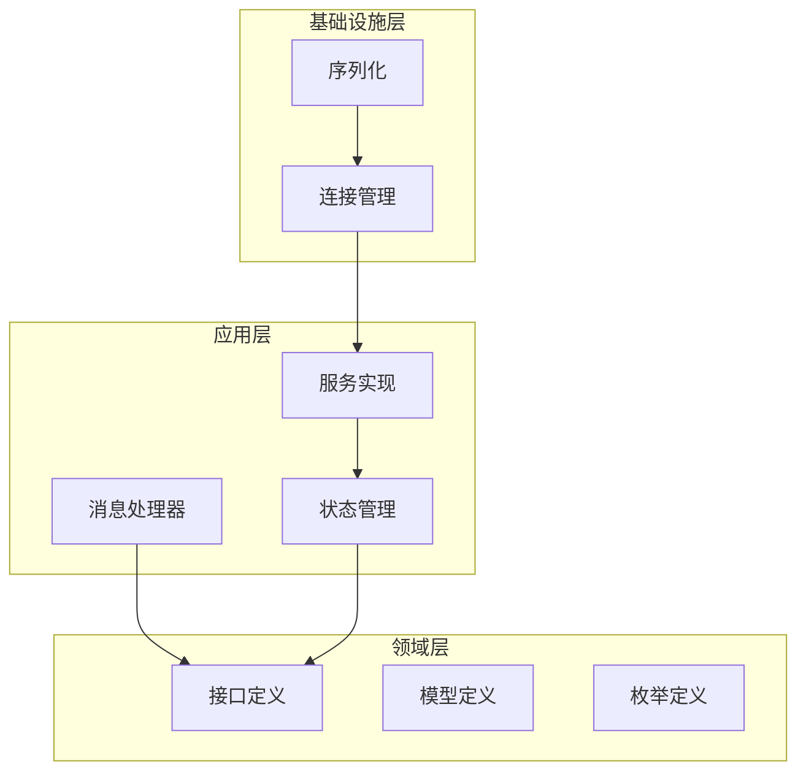

**图表来源**
- [StreamTwoHandlers.cs:1-331](file://WebGem/SECS2GEM/Application/Handlers/StreamTwoHandlers.cs#L1-L331)
- [GemEquipmentService.cs:1-456](file://WebGem/SECS2GEM/Application/Services/GemEquipmentService.cs#L1-L456)

**章节来源**
- [StreamTwoHandlers.cs:1-331](file://WebGem/SECS2GEM/Application/Handlers/StreamTwoHandlers.cs#L1-L331)
- [GemEquipmentService.cs:1-456](file://WebGem/SECS2GEM/Application/Services/GemEquipmentService.cs#L1-L456)

## 核心组件

### 消息处理器基类

所有Stream2处理器都继承自抽象基类，实现了统一的处理框架：

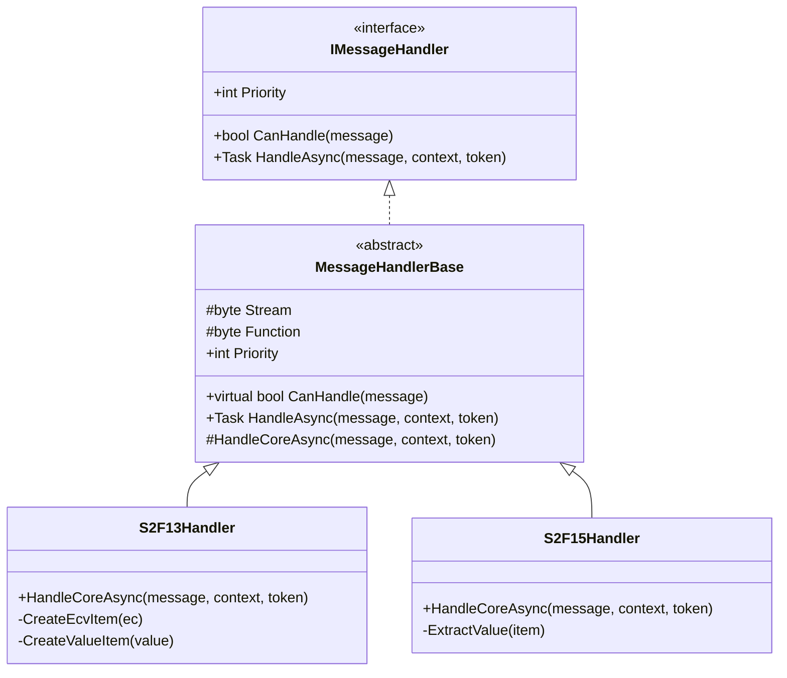

**图表来源**
- [IMessageHandler.cs:63-88](file://WebGem/SECS2GEM/Domain/Interfaces/IMessageHandler.cs#L63-L88)
- [StreamTwoHandlers.cs:13-78](file://WebGem/SECS2GEM/Application/Handlers/StreamTwoHandlers.cs#L13-L78)

### 状态管理器

GemStateManager实现了完整的GEM状态管理功能，包含三个独立的状态机：

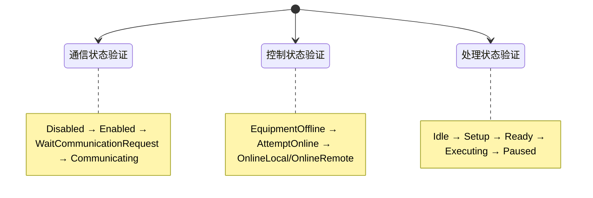

**图表来源**
- [GemStateManager.cs:196-457](file://WebGem/SECS2GEM/Application/State/GemStateManager.cs#L196-L457)
- [GemStates.cs:10-121](file://WebGem/SECS2GEM/Core/Enums/GemStates.cs#L10-L121)

**章节来源**
- [GemStateManager.cs:1-492](file://WebGem/SECS2GEM/Application/State/GemStateManager.cs#L1-L492)
- [GemStates.cs:1-176](file://WebGem/SECS2GEM/Core/Enums/GemStates.cs#L1-L176)

## 架构概览

Stream2消息处理器采用分层架构设计，实现了消息处理的完整生命周期：

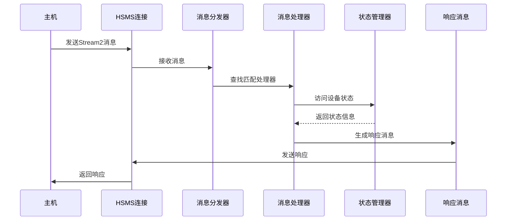

**图表来源**
- [MessageDispatcher.cs:67-91](file://WebGem/SECS2GEM/Application/Messaging/MessageDispatcher.cs#L67-L91)
- [GemEquipmentService.cs:343-358](file://WebGem/SECS2GEM/Application/Services/GemEquipmentService.cs#L343-L358)

**章节来源**
- [MessageDispatcher.cs:1-123](file://WebGem/SECS2GEM/Application/Messaging/MessageDispatcher.cs#L1-L123)
- [GemEquipmentService.cs:1-456](file://WebGem/SECS2GEM/Application/Services/GemEquipmentService.cs#L1-L456)

## 详细组件分析

### S2F13 - 设备常量请求处理器

S2F13处理器负责处理设备常量查询请求，实现了灵活的常量检索机制：

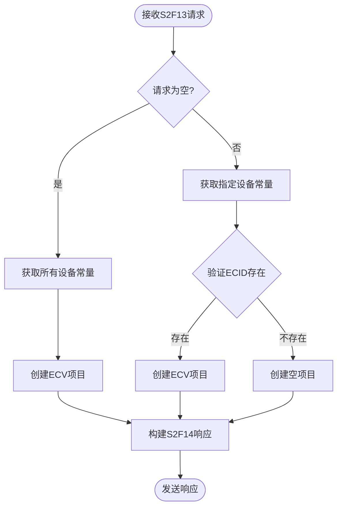

**图表来源**
- [StreamTwoHandlers.cs:18-57](file://WebGem/SECS2GEM/Application/Handlers/StreamTwoHandlers.cs#L18-L57)

#### 处理流程详解

1. **请求解析**: 处理器首先检查请求消息是否为空，决定是查询所有设备常量还是特定常量
2. **数据验证**: 对于特定常量请求，验证ECID的有效性
3. **响应构建**: 根据查询结果构建相应的ECV项目
4. **格式转换**: 支持多种数据类型的自动格式转换

**章节来源**
- [StreamTwoHandlers.cs:8-78](file://WebGem/SECS2GEM/Application/Handlers/StreamTwoHandlers.cs#L8-L78)

### S2F15 - 新设备常量发送处理器

S2F15处理器处理设备常量设置请求，提供了完整的数据验证和错误处理机制：

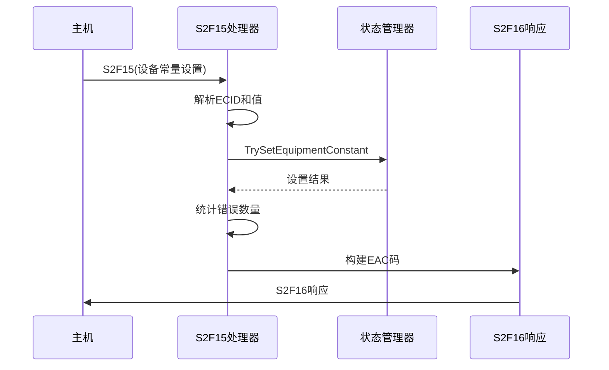

**图表来源**
- [StreamTwoHandlers.cs:91-121](file://WebGem/SECS2GEM/Application/Handlers/StreamTwoHandlers.cs#L91-L121)

#### 数据类型支持

处理器支持以下数据类型的自动提取和转换：

| 数据类型 | SECs格式 | C#类型 |
|---------|---------|--------|
| ASCII字符串 | ASCII/JIS8 | string |
| 有符号整数 | I1/I2/I4/I8 | long |
| 无符号整数 | U1/U2/U4/U8 | ulong |
| 浮点数 | F4/F8 | double |
| 布尔值 | Boolean | bool |
| 二进制数据 | Binary | byte[] |

**章节来源**
- [StreamTwoHandlers.cs:123-137](file://WebGem/SECS2GEM/Application/Handlers/StreamTwoHandlers.cs#L123-L137)

### S2F29 - 设备常量命名表请求处理器

S2F29处理器提供设备常量的详细信息查询功能：

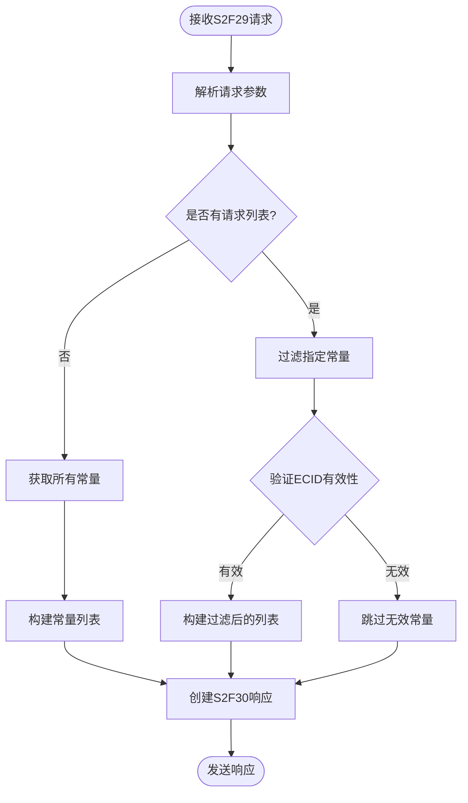

**图表来源**
- [StreamTwoHandlers.cs:148-193](file://WebGem/SECS2GEM/Application/Handlers/StreamTwoHandlers.cs#L148-L193)

**章节来源**
- [StreamTwoHandlers.cs:140-193](file://WebGem/SECS2GEM/Application/Handlers/StreamTwoHandlers.cs#L140-L193)

### S2F33/S2F35/S2F37 - 事件报告处理器

这些处理器简化了事件报告的定义、链接和启用/禁用操作：

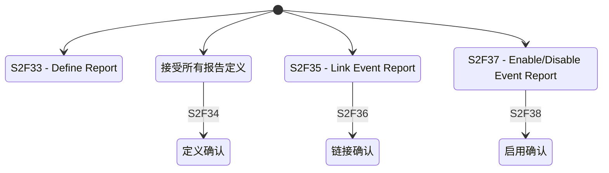

**图表来源**
- [StreamTwoHandlers.cs:198-262](file://WebGem/SECS2GEM/Application/Handlers/StreamTwoHandlers.cs#L198-L262)

**章节来源**
- [StreamTwoHandlers.cs:195-262](file://WebGem/SECS2GEM/Application/Handlers/StreamTwoHandlers.cs#L195-L262)

### S2F41 - 主机命令处理器

S2F41处理器提供了灵活的远程命令处理机制：

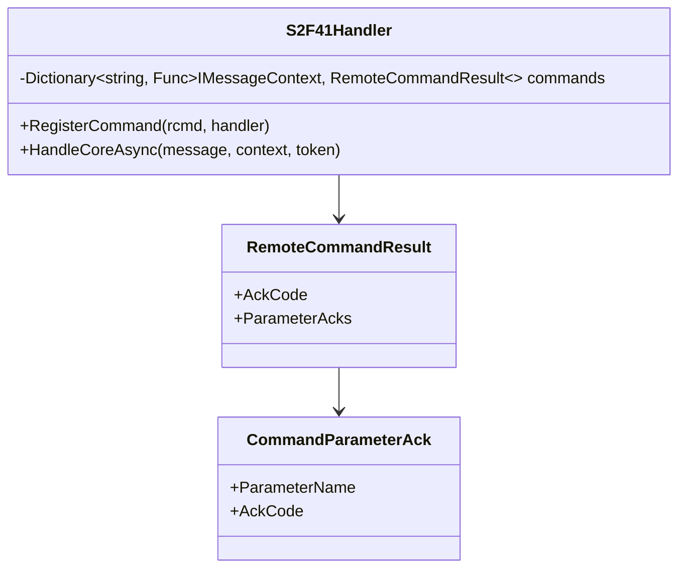

**图表来源**
- [StreamTwoHandlers.cs:270-330](file://WebGem/SECS2GEM/Application/Handlers/StreamTwoHandlers.cs#L270-L330)

**章节来源**
- [StreamTwoHandlers.cs:264-330](file://WebGem/SECS2GEM/Application/Handlers/StreamTwoHandlers.cs#L264-L330)

## 依赖关系分析

### 组件依赖图

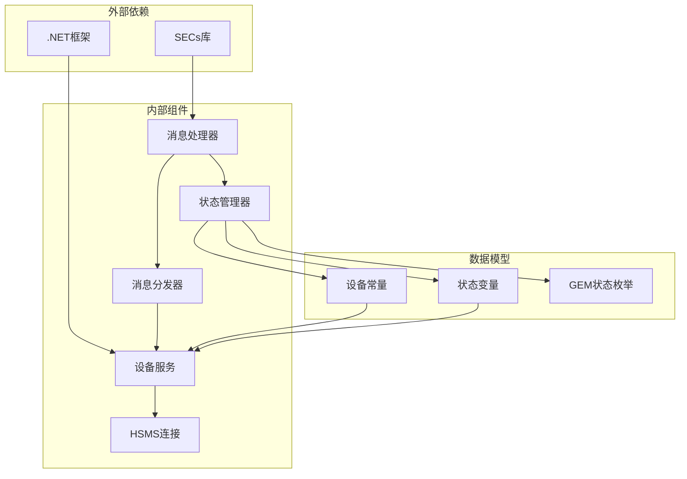

**图表来源**
- [GemEquipmentService.cs:33-133](file://WebGem/SECS2GEM/Application/Services/GemEquipmentService.cs#L33-L133)
- [GemStateManager.cs:22-107](file://WebGem/SECS2GEM/Application/State/GemStateManager.cs#L22-L107)

### 状态转换验证

状态管理器实现了严格的转换验证机制：

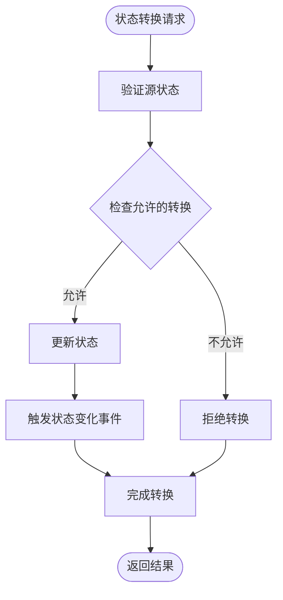

**图表来源**
- [GemStateManager.cs:352-457](file://WebGem/SECS2GEM/Application/State/GemStateManager.cs#L352-L457)

**章节来源**
- [GemStateManager.cs:196-457](file://WebGem/SECS2GEM/Application/State/GemStateManager.cs#L196-L457)

## 性能考虑

### 并发处理优化

系统采用了多种并发优化技术：

1. **线程安全的数据结构**: 使用ConcurrentDictionary确保多线程环境下的数据一致性
2. **锁粒度优化**: 在状态管理器中使用细粒度锁，减少锁竞争
3. **异步处理**: 所有I/O操作采用异步模式，提高吞吐量

### 内存管理

1. **对象池模式**: 复用消息对象，减少垃圾回收压力
2. **内存映射**: 大数据块使用内存映射文件
3. **及时释放**: 确保临时对象及时释放

### 缓存策略

1. **状态缓存**: 频繁访问的状态变量使用缓存
2. **查询缓存**: 设备常量查询结果缓存
3. **配置缓存**: 配置信息缓存以减少磁盘访问

## 故障排除指南

### 常见问题及解决方案

#### 状态转换失败

**问题**: 设备状态无法转换
**原因**: 验证规则阻止了转换
**解决方案**: 
1. 检查当前状态是否允许目标转换
2. 确认转换条件是否满足
3. 查看状态变化事件日志

#### 设备常量设置失败

**问题**: S2F15响应EAC=1
**原因**: 常量设置验证失败
**解决方案**:
1. 检查常量是否只读
2. 验证数值范围是否在允许范围内
3. 确认数据类型匹配

#### 消息处理超时

**问题**: 处理器无法响应消息
**原因**: 处理时间过长或死锁
**解决方案**:
1. 检查处理器实现是否阻塞
2. 优化数据库查询
3. 增加超时配置

**章节来源**
- [GemStateManagerTests.cs:98-171](file://WebGem/SECS2GEM.Tests/GemStateManagerTests.cs#L98-L171)

### 调试技巧

1. **启用详细日志**: 配置消息日志记录
2. **状态监控**: 监控状态变化事件
3. **性能分析**: 使用性能分析工具识别瓶颈
4. **单元测试**: 编写全面的单元测试覆盖

## 结论

Stream2消息处理器展现了现代工业控制系统中消息处理的最佳实践。通过模块化设计、严格的验证机制和灵活的扩展能力，该系统能够可靠地处理复杂的设备状态管理需求。

关键优势包括：
- **高内聚低耦合**: 每个处理器职责单一，易于维护
- **强类型安全**: 编译时类型检查减少运行时错误
- **可扩展性**: 插件式架构支持新功能快速集成
- **可靠性**: 完善的错误处理和状态管理机制

对于开发者而言，理解这些设计模式和实现细节有助于构建更加健壮和高效的设备状态控制系统。建议在实际项目中遵循这些最佳实践，确保系统的稳定性和可维护性。