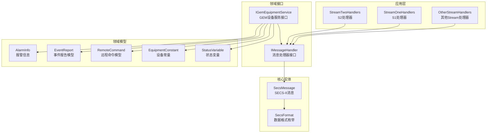
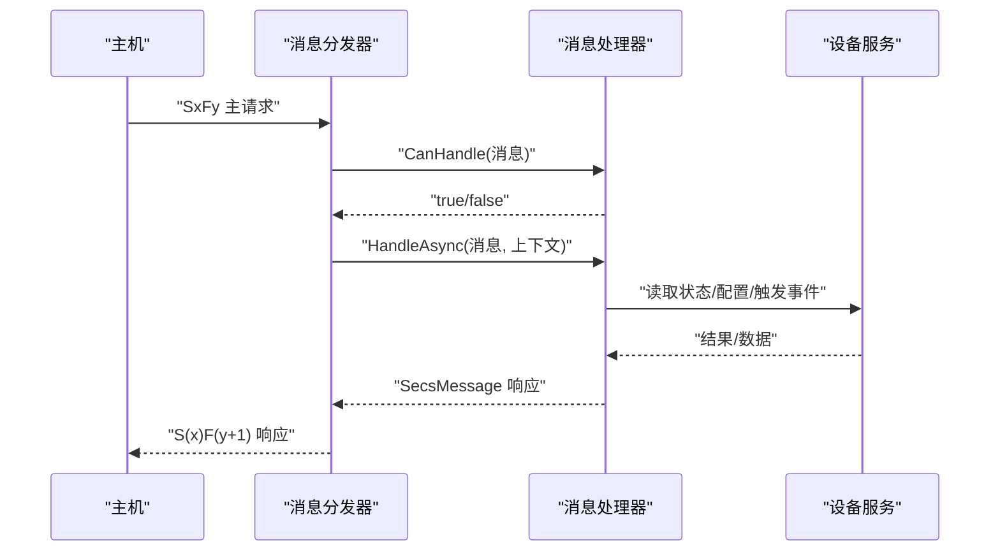
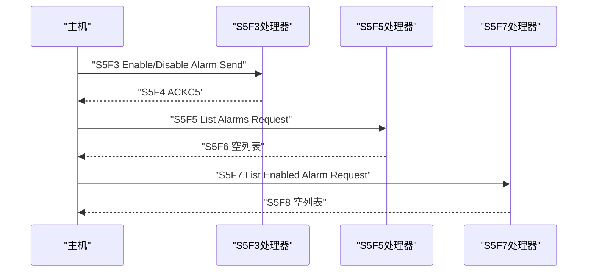
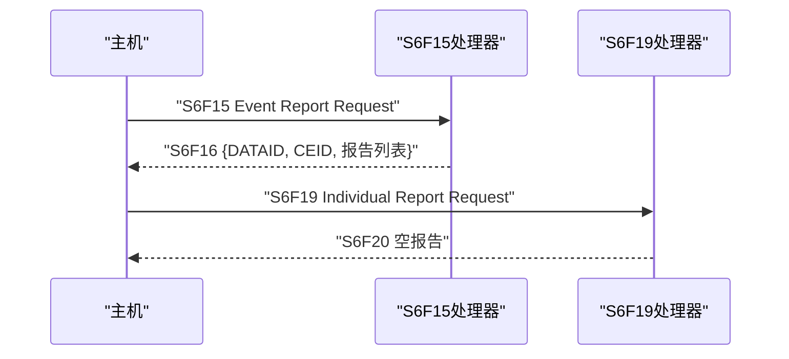
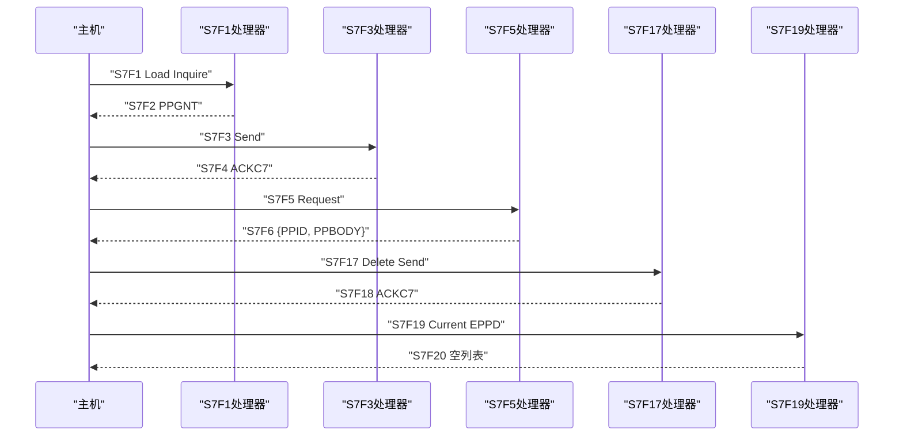
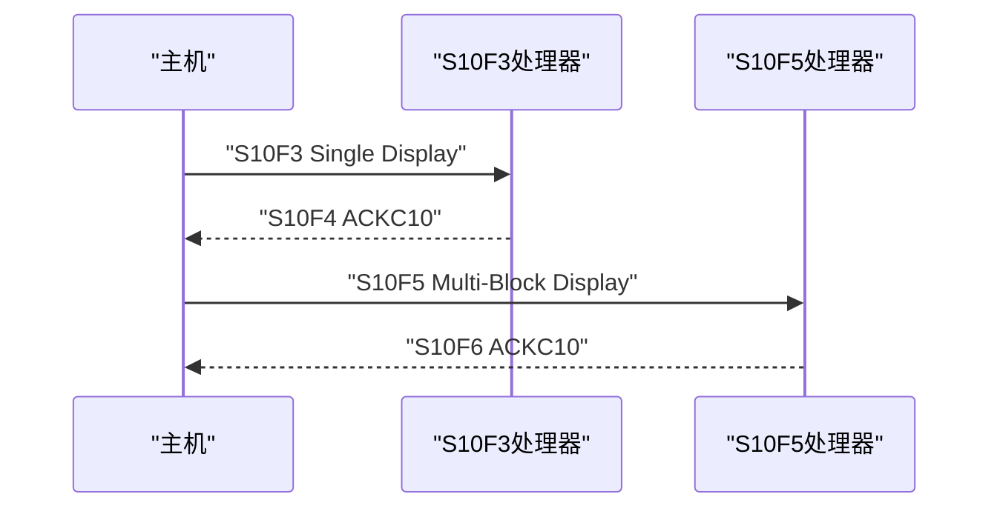
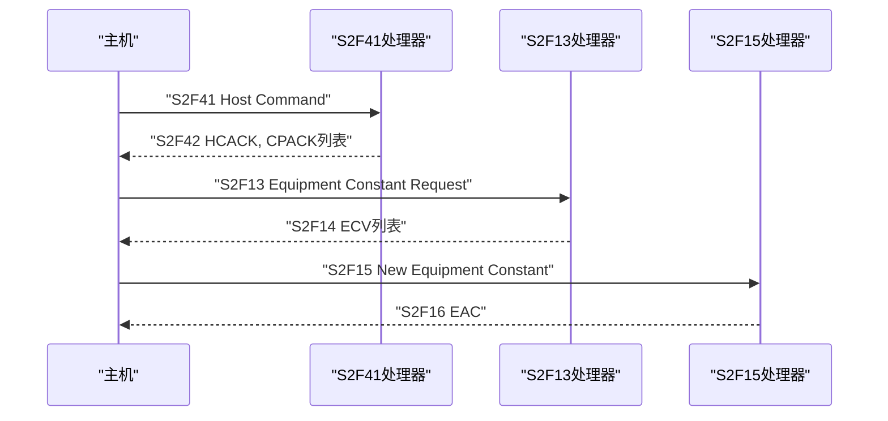
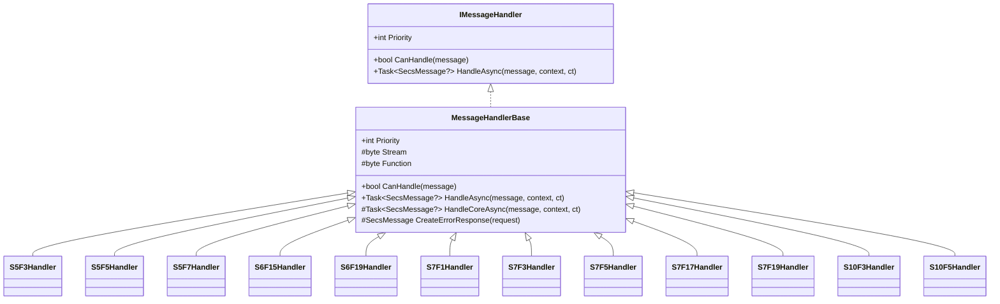

# 其他Stream处理器

<cite>
**本文引用的文件**
- [OtherStreamHandlers.cs](file://WebGem/SECS2GEM/Application/Handlers/OtherStreamHandlers.cs)
- [StreamOneHandlers.cs](file://WebGem/SECS2GEM/Application/Handlers/StreamOneHandlers.cs)
- [StreamTwoHandlers.cs](file://WebGem/SECS2GEM/Application/Handlers/StreamTwoHandlers.cs)
- [SecsMessage.cs](file://WebGem/SECS2GEM/Core/Entities/SecsMessage.cs)
- [IMessageHandler.cs](file://WebGem/SECS2GEM/Domain/Interfaces/IMessageHandler.cs)
- [IGemEquipmentService.cs](file://WebGem/SECS2GEM/Domain/Interfaces/IGemEquipmentService.cs)
- [AlarmInfo.cs](file://WebGem/SECS2GEM/Domain/Models/AlarmInfo.cs)
- [EventReport.cs](file://WebGem/SECS2GEM/Domain/Models/EventReport.cs)
- [RemoteCommand.cs](file://WebGem/SECS2GEM/Domain/Models/RemoteCommand.cs)
- [EquipmentConstant.cs](file://WebGem/SECS2GEM/Domain/Models/EquipmentConstant.cs)
- [StatusVariable.cs](file://WebGem/SECS2GEM/Domain/Models/StatusVariable.cs)
- [SecsFormat.cs](file://WebGem/SECS2GEM/Core/Enums/SecsFormat.cs)
- [HsmsMessageType.cs](file://WebGem/SECS2GEM/Core/Enums/HsmsMessageType.cs)
</cite>

## 目录
1. [简介](#简介)
2. [项目结构](#项目结构)
3. [核心组件](#核心组件)
4. [架构总览](#架构总览)
5. [详细组件分析](#详细组件分析)
6. [依赖关系分析](#依赖关系分析)
7. [性能考虑](#性能考虑)
8. [故障排除指南](#故障排除指南)
9. [结论](#结论)
10. [附录](#附录)

## 简介
本文档聚焦于SECS-II协议中除Stream 1与Stream 2之外的其他Stream处理器实现，涵盖S3、S4、S5、S6、S7、S8等消息类型的处理器设计与扩展点。重点解释以下能力：
- 数据传输：基于SECS-II消息模型的封装与响应机制
- 报警管理：S5F1报警发送与S5F3/S5F5/S5F7相关的报警控制与查询
- 事件报告：S6F11事件报告与S6F15/S6F19报告请求处理
- 远程命令：S2F41主机命令处理与S10F3/S10F5终端显示处理
- 自定义处理器：基于MessageHandlerBase的扩展指南与最佳实践

## 项目结构
SECS2GEM采用分层与按功能域划分的组织方式：
- Application/Handlers：按Stream分类的消息处理器
- Core/Entities：SECS-II消息与数据项实体
- Domain/Interfaces：领域接口与事件聚合器
- Domain/Models：报警、事件报告、远程命令、设备常量、状态变量等模型
- Infrastructure：序列化、连接、日志、事务管理等基础设施

图表来源
- [OtherStreamHandlers.cs:1-276](file://WebGem/SECS2GEM/Application/Handlers/OtherStreamHandlers.cs#L1-L276)
- [StreamOneHandlers.cs:1-211](file://WebGem/SECS2GEM/Application/Handlers/StreamOneHandlers.cs#L1-L211)
- [StreamTwoHandlers.cs:1-331](file://WebGem/SECS2GEM/Application/Handlers/StreamTwoHandlers.cs#L1-L331)
- [SecsMessage.cs:1-209](file://WebGem/SECS2GEM/Core/Entities/SecsMessage.cs#L1-L209)
- [IMessageHandler.cs:1-131](file://WebGem/SECS2GEM/Domain/Interfaces/IMessageHandler.cs#L1-L131)
- [IGemEquipmentService.cs:1-160](file://WebGem/SECS2GEM/Domain/Interfaces/IGemEquipmentService.cs#L1-L160)
- [AlarmInfo.cs:1-81](file://WebGem/SECS2GEM/Domain/Models/AlarmInfo.cs#L1-L81)
- [EventReport.cs:1-159](file://WebGem/SECS2GEM/Domain/Models/EventReport.cs#L1-L159)
- [RemoteCommand.cs:1-189](file://WebGem/SECS2GEM/Domain/Models/RemoteCommand.cs#L1-L189)
- [EquipmentConstant.cs:1-122](file://WebGem/SECS2GEM/Domain/Models/EquipmentConstant.cs#L1-L122)
- [StatusVariable.cs:1-61](file://WebGem/SECS2GEM/Domain/Models/StatusVariable.cs#L1-L61)
- [SecsFormat.cs:1-112](file://WebGem/SECS2GEM/Core/Enums/SecsFormat.cs#L1-L112)

章节来源
- [OtherStreamHandlers.cs:1-276](file://WebGem/SECS2GEM/Application/Handlers/OtherStreamHandlers.cs#L1-L276)
- [StreamOneHandlers.cs:1-211](file://WebGem/SECS2GEM/Application/Handlers/StreamOneHandlers.cs#L1-L211)
- [StreamTwoHandlers.cs:1-331](file://WebGem/SECS2GEM/Application/Handlers/StreamTwoHandlers.cs#L1-L331)
- [SecsMessage.cs:1-209](file://WebGem/SECS2GEM/Core/Entities/SecsMessage.cs#L1-L209)
- [IMessageHandler.cs:1-131](file://WebGem/SECS2GEM/Domain/Interfaces/IMessageHandler.cs#L1-L131)
- [IGemEquipmentService.cs:1-160](file://WebGem/SECS2GEM/Domain/Interfaces/IGemEquipmentService.cs#L1-L160)

## 核心组件
- 消息处理器基类：MessageHandlerBase提供模板方法模式，统一处理流程、异常捕获与错误响应生成
- SECS-II消息模型：SecsMessage封装Stream/Function/WBit与数据项，提供流畅的构建API
- 领域接口：IMessageHandler定义策略模式的处理器契约；IGemEquipmentService提供设备服务外观
- 领域模型：AlarmInfo、EventReport、RemoteCommand、EquipmentConstant、StatusVariable支撑各业务场景

章节来源
- [IMessageHandler.cs:50-88](file://WebGem/SECS2GEM/Domain/Interfaces/IMessageHandler.cs#L50-L88)
- [SecsMessage.cs:18-139](file://WebGem/SECS2GEM/Core/Entities/SecsMessage.cs#L18-L139)
- [IGemEquipmentService.cs:25-158](file://WebGem/SECS2GEM/Domain/Interfaces/IGemEquipmentService.cs#L25-L158)

## 架构总览
消息处理采用“策略+责任链”模式：
- MessageDispatcher维护处理器集合，按优先级匹配CanHandle
- 每个处理器负责一个或多个SxFy消息对
- 响应消息通过SecsMessage.CreateReply或构造对应次级消息返回

图表来源
- [IMessageHandler.cs:104-129](file://WebGem/SECS2GEM/Domain/Interfaces/IMessageHandler.cs#L104-L129)
- [OtherStreamHandlers.cs:9-276](file://WebGem/SECS2GEM/Application/Handlers/OtherStreamHandlers.cs#L9-L276)
- [StreamOneHandlers.cs:20-86](file://WebGem/SECS2GEM/Application/Handlers/StreamOneHandlers.cs#L20-L86)
- [StreamTwoHandlers.cs:1-331](file://WebGem/SECS2GEM/Application/Handlers/StreamTwoHandlers.cs#L1-L331)

## 详细组件分析

### S5系列：报警管理
- S5F3：Enable/Disable Alarm Send（ACKC5）
- S5F5：List Alarms Request（返回空列表）
- S5F7：List Enabled Alarm Request（返回空列表）

这些处理器均继承MessageHandlerBase，通过构造对应次级消息返回ACK或空列表，简化实现以满足基本协议交互。

图表来源
- [OtherStreamHandlers.cs:6-67](file://WebGem/SECS2GEM/Application/Handlers/OtherStreamHandlers.cs#L6-L67)
- [IMessageHandler.cs:50-88](file://WebGem/SECS2GEM/Domain/Interfaces/IMessageHandler.cs#L50-L88)

章节来源
- [OtherStreamHandlers.cs:6-67](file://WebGem/SECS2GEM/Application/Handlers/OtherStreamHandlers.cs#L6-L67)

### S6系列：事件报告
- S6F15：Event Report Request（DATAID/CEID/报告列表）
- S6F19：Individual Report Request（返回空报告）

处理器返回标准化的报告容器，便于上层事件聚合与上报。

图表来源
- [OtherStreamHandlers.cs:69-113](file://WebGem/SECS2GEM/Application/Handlers/OtherStreamHandlers.cs#L69-L113)

章节来源
- [OtherStreamHandlers.cs:69-113](file://WebGem/SECS2GEM/Application/Handlers/OtherStreamHandlers.cs#L69-L113)

### S7系列：配方管理
- S7F1：Process Program Load Inquire（PPGNT）
- S7F3：Process Program Send（ACKC7）
- S7F5：Process Program Request（返回空配方）
- S7F17：Delete Process Program Send（ACKC7）
- S7F19：Current EPPD Request（返回空配方列表）

处理器通过构造对应次级消息返回状态码或空数据，满足配方加载、发送、请求与删除的基本流程。

图表来源
- [OtherStreamHandlers.cs:115-228](file://WebGem/SECS2GEM/Application/Handlers/OtherStreamHandlers.cs#L115-L228)

章节来源
- [OtherStreamHandlers.cs:115-228](file://WebGem/SECS2GEM/Application/Handlers/OtherStreamHandlers.cs#L115-L228)

### S10系列：终端显示
- S10F3：Terminal Display, Single（ACKC10）
- S10F5：Terminal Display, Multi-Block（ACKC10）

处理器接受显示请求并返回ACKC10，实现基础的终端显示控制。

图表来源
- [OtherStreamHandlers.cs:231-275](file://WebGem/SECS2GEM/Application/Handlers/OtherStreamHandlers.cs#L231-L275)

章节来源
- [OtherStreamHandlers.cs:231-275](file://WebGem/SECS2GEM/Application/Handlers/OtherStreamHandlers.cs#L231-L275)

### S2系列：远程命令与设备常量（补充说明）
虽然本节主要关注其他Stream处理器，但S2系列与S10系列密切相关，涉及远程命令与设备常量，有助于理解整体数据流与控制面交互。

- S2F41：Host Command Send（注册命令处理器，返回HCACK与参数确认）
- S2F13/S2F15：设备常量查询与设置（EAC）
- S2F29：设备常量清单请求（返回常量元信息）
- S2F33/S2F35/S2F37：报告定义、事件报告链接与启用/禁用（DRACK/LRACK/ERACK）

图表来源
- [StreamTwoHandlers.cs:270-331](file://WebGem/SECS2GEM/Application/Handlers/StreamTwoHandlers.cs#L270-L331)
- [StreamTwoHandlers.cs:13-78](file://WebGem/SECS2GEM/Application/Handlers/StreamTwoHandlers.cs#L13-L78)
- [StreamTwoHandlers.cs:86-138](file://WebGem/SECS2GEM/Application/Handlers/StreamTwoHandlers.cs#L86-L138)

章节来源
- [StreamTwoHandlers.cs:270-331](file://WebGem/SECS2GEM/Application/Handlers/StreamTwoHandlers.cs#L270-L331)
- [StreamTwoHandlers.cs:13-78](file://WebGem/SECS2GEM/Application/Handlers/StreamTwoHandlers.cs#L13-L78)
- [StreamTwoHandlers.cs:86-138](file://WebGem/SECS2GEM/Application/Handlers/StreamTwoHandlers.cs#L86-L138)

## 依赖关系分析
- 处理器依赖：各SxFy处理器依赖MessageHandlerBase统一处理流程与错误响应
- 消息模型：SecsMessage提供不可变封装与响应消息工厂方法
- 领域服务：IGemEquipmentService对外暴露报警、事件报告、远程命令等能力
- 数据格式：SecsFormat定义SECS-II数据类型，用于设备常量与状态变量建模

图表来源
- [IMessageHandler.cs:50-88](file://WebGem/SECS2GEM/Domain/Interfaces/IMessageHandler.cs#L50-L88)
- [OtherStreamHandlers.cs:9-276](file://WebGem/SECS2GEM/Application/Handlers/OtherStreamHandlers.cs#L9-L276)

章节来源
- [IMessageHandler.cs:50-88](file://WebGem/SECS2GEM/Domain/Interfaces/IMessageHandler.cs#L50-L88)
- [OtherStreamHandlers.cs:9-276](file://WebGem/SECS2GEM/Application/Handlers/OtherStreamHandlers.cs#L9-L276)

## 性能考虑
- 处理器优先级：通过Priority属性控制匹配顺序，避免不必要的尝试
- 异常处理：统一的异常捕获与S9F7错误响应，减少异常传播成本
- 响应消息：使用SecsMessage.CreateReply或直接构造次级消息，降低序列化与网络开销
- 数据格式：SecsFormat枚举确保数据项类型一致，减少解析错误与重试

## 故障排除指南
- 未匹配处理器：检查CanHandle条件与Stream/Function映射
- 错误响应：当消息WBit为true且处理异常时，自动返回S9F7
- 报警与事件：确认AlarmInfo与EventReport配置正确，确保事件定义与报告定义关联
- 远程命令：验证命令名称大小写与参数校验器，确保参数名与值有效

章节来源
- [IMessageHandler.cs:50-88](file://WebGem/SECS2GEM/Domain/Interfaces/IMessageHandler.cs#L50-L88)
- [OtherStreamHandlers.cs:9-276](file://WebGem/SECS2GEM/Application/Handlers/OtherStreamHandlers.cs#L9-L276)
- [AlarmInfo.cs:1-81](file://WebGem/SECS2GEM/Domain/Models/AlarmInfo.cs#L1-L81)
- [EventReport.cs:1-159](file://WebGem/SECS2GEM/Domain/Models/EventReport.cs#L1-L159)
- [RemoteCommand.cs:1-189](file://WebGem/SECS2GEM/Domain/Models/RemoteCommand.cs#L1-L189)

## 结论
本文档梳理了S3至S8等其他Stream的消息处理器实现，明确了报警管理、事件报告与远程命令处理的关键路径，并提供了基于MessageHandlerBase的扩展指南。通过统一的处理器基类与清晰的领域模型，系统实现了高内聚、低耦合的消息处理架构，便于开发者快速实现定制化的业务需求。

## 附录

### 数据结构定义与处理逻辑概览
- 报警信息（AlarmInfo）：包含报警ID、文本、类别与报警码生成逻辑
- 事件报告（EventReport）：采集事件、报告定义与事件-报告关联管理
- 远程命令（RemoteCommand）：命令定义、参数校验与执行结果
- 设备常量（EquipmentConstant）：ECID、名称、单位、格式与值范围
- 状态变量（StatusVariable）：SVID、名称、单位与值获取器

章节来源
- [AlarmInfo.cs:8-43](file://WebGem/SECS2GEM/Domain/Models/AlarmInfo.cs#L8-L43)
- [EventReport.cs:10-60](file://WebGem/SECS2GEM/Domain/Models/EventReport.cs#L10-L60)
- [RemoteCommand.cs:9-61](file://WebGem/SECS2GEM/Domain/Models/RemoteCommand.cs#L9-L61)
- [EquipmentConstant.cs:12-62](file://WebGem/SECS2GEM/Domain/Models/EquipmentConstant.cs#L12-L62)
- [StatusVariable.cs:12-42](file://WebGem/SECS2GEM/Domain/Models/StatusVariable.cs#L12-L42)

### 自定义处理器开发指南
- 继承MessageHandlerBase并实现抽象属性Stream/Function
- 在HandleCoreAsync中编写具体处理逻辑，构造次级消息或返回null
- 如需错误响应，MessageHandlerBase会根据WBit自动创建S9F7
- 通过IMessageDispatcher注册处理器，支持优先级与动态增删

章节来源
- [IMessageHandler.cs:50-88](file://WebGem/SECS2GEM/Domain/Interfaces/IMessageHandler.cs#L50-L88)
- [OtherStreamHandlers.cs:9-276](file://WebGem/SECS2GEM/Application/Handlers/OtherStreamHandlers.cs#L9-L276)