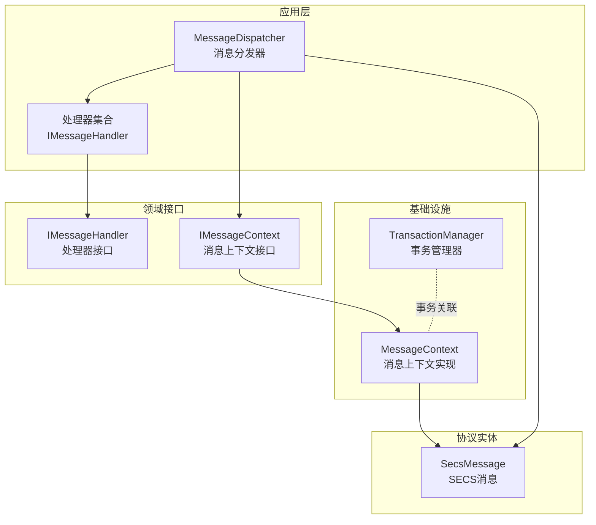
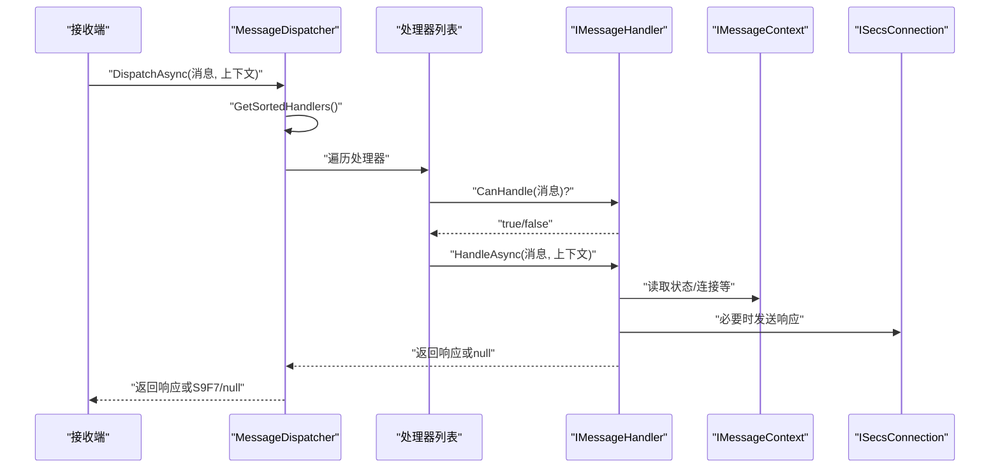
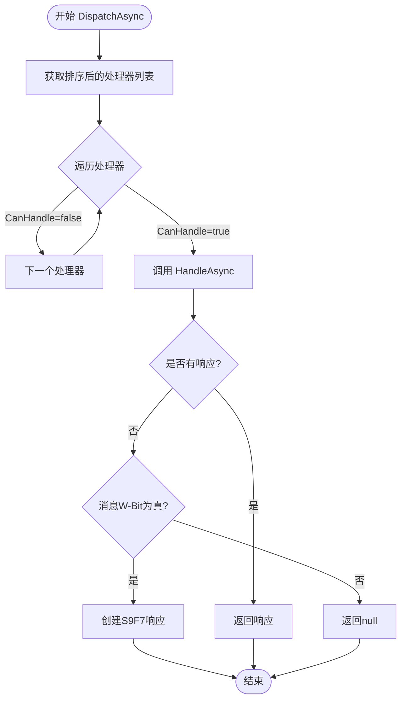
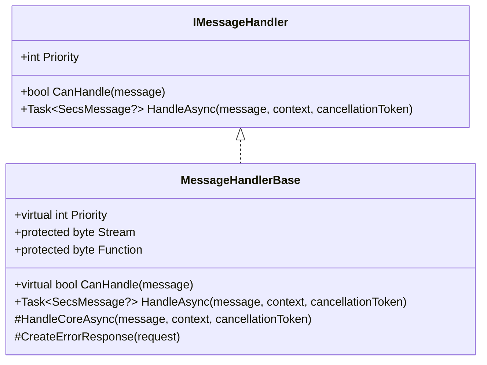
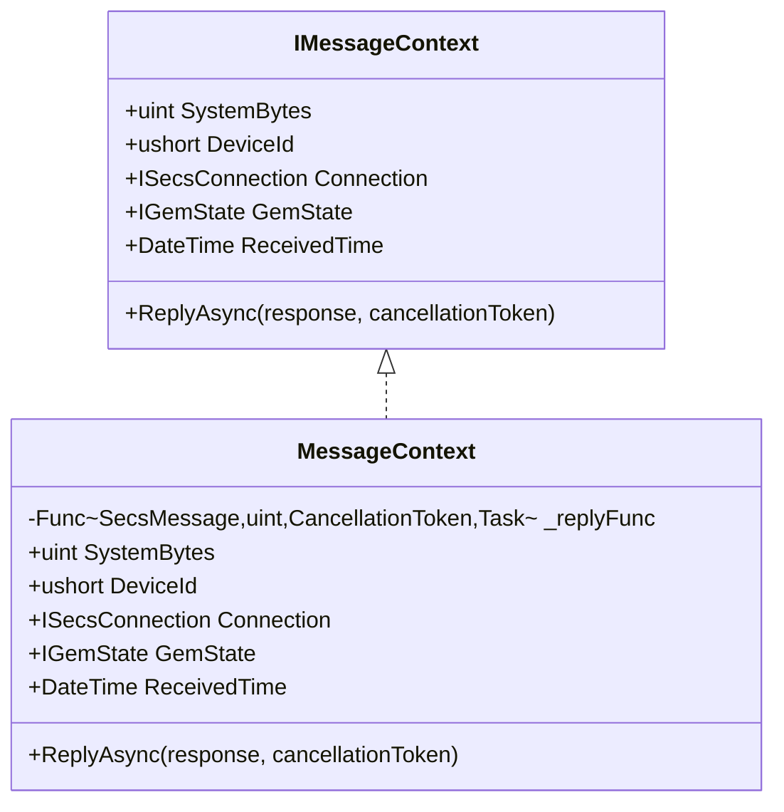
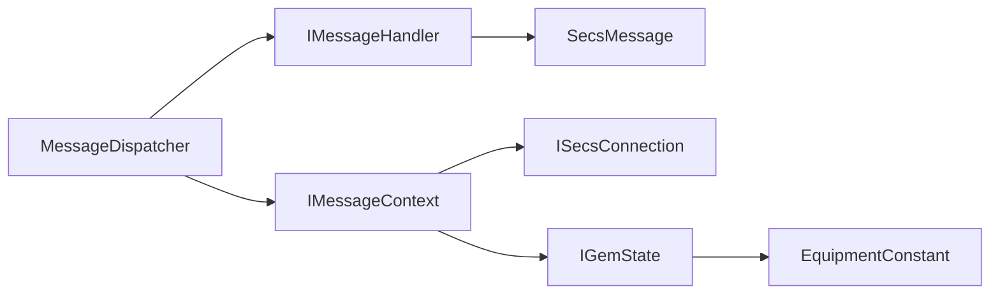

# 消息分发器

<cite>
**本文引用的文件**
- [MessageDispatcher.cs](file://WebGem/SECS2GEM/Application/Messaging/MessageDispatcher.cs)
- [IMessageHandler.cs](file://WebGem/SECS2GEM/Domain/Interfaces/IMessageHandler.cs)
- [IMessageContext.cs](file://WebGem/SECS2GEM/Infrastructure/Connection/MessageContext.cs)
- [TransactionManager.cs](file://WebGem/SECS2GEM/Infrastructure/Services/TransactionManager.cs)
- [StreamOneHandlers.cs](file://WebGem/SECS2GEM/Application/Handlers/StreamOneHandlers.cs)
- [StreamTwoHandlers.cs](file://WebGem/SECS2GEM/Application/Handlers/StreamTwoHandlers.cs)
- [OtherStreamHandlers.cs](file://WebGem/SECS2GEM/Application/Handlers/OtherStreamHandlers.cs)
- [SecsMessage.cs](file://WebGem/SECS2GEM/Core/Entities/SecsMessage.cs)
- [IGemState.cs](file://WebGem/SECS2GEM/Domain/Interfaces/IGemState.cs)
- [MessageHandlerTests.cs](file://WebGem/SECS2GEM.Tests/MessageHandlerTests.cs)
</cite>

## 目录
1. [简介](#简介)
2. [项目结构](#项目结构)
3. [核心组件](#核心组件)
4. [架构总览](#架构总览)
5. [详细组件分析](#详细组件分析)
6. [依赖关系分析](#依赖关系分析)
7. [性能考量](#性能考量)
8. [故障排查指南](#故障排查指南)
9. [结论](#结论)
10. [附录](#附录)

## 简介
本文件面向SECS/GEM场景下的消息分发器，系统性阐述MessageDispatcher的核心工作机制，包括消息路由算法、处理器选择策略、执行流程控制、优先级机制、异常处理策略与性能优化技术，并提供配置选项、扩展方法、使用示例与调试技巧，帮助开发者高效理解与优化消息处理性能。

## 项目结构
围绕消息分发器的关键目录与文件如下：
- 应用层消息分发：Application/Messaging/MessageDispatcher.cs
- 接口契约：Domain/Interfaces/IMessageHandler.cs、IMessageContext.cs
- 连接与上下文：Infrastructure/Connection/MessageContext.cs
- 事务管理：Infrastructure/Services/TransactionManager.cs
- 处理器实现：Application/Handlers/StreamOneHandlers.cs、StreamTwoHandlers.cs、OtherStreamHandlers.cs
- 协议实体：Core/Entities/SecsMessage.cs
- 状态接口：Domain/Interfaces/IGemState.cs
- 测试用例：SECS2GEM.Tests/MessageHandlerTests.cs

图表来源
- [MessageDispatcher.cs:1-123](file://WebGem/SECS2GEM/Application/Messaging/MessageDispatcher.cs#L1-L123)
- [IMessageHandler.cs:1-131](file://WebGem/SECS2GEM/Domain/Interfaces/IMessageHandler.cs#L1-L131)
- [IMessageContext.cs:1-65](file://WebGem/SECS2GEM/Infrastructure/Connection/MessageContext.cs#L1-L65)
- [TransactionManager.cs:1-201](file://WebGem/SECS2GEM/Infrastructure/Services/TransactionManager.cs#L1-L201)
- [SecsMessage.cs:1-209](file://WebGem/SECS2GEM/Core/Entities/SecsMessage.cs#L1-L209)

章节来源
- [MessageDispatcher.cs:1-123](file://WebGem/SECS2GEM/Application/Messaging/MessageDispatcher.cs#L1-L123)
- [IMessageHandler.cs:1-131](file://WebGem/SECS2GEM/Domain/Interfaces/IMessageHandler.cs#L1-L131)
- [IMessageContext.cs:1-65](file://WebGem/SECS2GEM/Infrastructure/Connection/MessageContext.cs#L1-L65)
- [TransactionManager.cs:1-201](file://WebGem/SECS2GEM/Infrastructure/Services/TransactionManager.cs#L1-L201)
- [SecsMessage.cs:1-209](file://WebGem/SECS2GEM/Core/Entities/SecsMessage.cs#L1-L209)

## 核心组件
- 消息分发器（MessageDispatcher）
  - 责任链+策略模式组合：维护处理器列表，按优先级排序；收到消息时遍历处理器，找到能处理的即委托执行；若无处理器能处理，依据W-Bit返回S9F7或null。
  - 关键点：线程安全（锁保护）、懒排序（首次访问时排序并缓存）、优先级控制（数值越小优先级越高）。
- 消息处理器接口（IMessageHandler）
  - 策略模式：每个Stream/Function组合可拥有独立处理器；支持优先级、CanHandle判断、HandleAsync处理。
- 消息上下文（IMessageContext/MessageContext）
  - 提供设备ID、当前连接、GEM状态、System Bytes、接收时间以及回复能力（ReplyAsync）。
- 协议实体（SecsMessage）
  - 封装Stream/Function/WBit/Item等协议字段，提供常用工厂方法与SML输出。

章节来源
- [MessageDispatcher.cs:27-123](file://WebGem/SECS2GEM/Application/Messaging/MessageDispatcher.cs#L27-L123)
- [IMessageHandler.cs:63-131](file://WebGem/SECS2GEM/Domain/Interfaces/IMessageHandler.cs#L63-L131)
- [IMessageContext.cs:12-65](file://WebGem/SECS2GEM/Infrastructure/Connection/MessageContext.cs#L12-L65)
- [SecsMessage.cs:18-139](file://WebGem/SECS2GEM/Core/Entities/SecsMessage.cs#L18-L139)

## 架构总览
消息从接收端进入，经由MessageDispatcher进行路由与执行；处理器基于IMessageHandler约定实现具体业务逻辑；上下文IMessageContext提供运行期所需资源；必要时通过TransactionManager进行事务管理与超时控制。

图表来源
- [MessageDispatcher.cs:67-91](file://WebGem/SECS2GEM/Application/Messaging/MessageDispatcher.cs#L67-L91)
- [IMessageHandler.cs:74-87](file://WebGem/SECS2GEM/Domain/Interfaces/IMessageHandler.cs#L74-L87)
- [IMessageContext.cs:59-62](file://WebGem/SECS2GEM/Infrastructure/Connection/MessageContext.cs#L59-L62)

## 详细组件分析

### 消息分发器（MessageDispatcher）
- 路由算法
  - 按优先级排序遍历处理器，首个CanHandle返回true的处理器即被选中执行。
  - 若无处理器匹配：当消息W-Bit为true时返回S9F7（非法数据）响应；否则返回null。
- 执行流程控制
  - DispatchAsync为异步入口；内部通过GetSortedHandlers获取有序副本，避免外部并发修改影响遍历顺序。
  - 优先级缓存：首次排序后标记_sorted=true，后续直接返回副本，减少重复排序成本。
- 线程安全
  - 注册/注销/排序均使用_lock保护；GetSortedHandlers返回副本，避免共享可变列表引发竞态。
- 性能优化
  - 懒排序：仅在处理器变更或首次访问时排序。
  - 有序遍历：一旦命中即短路返回，避免全量扫描。
- 异常处理策略
  - 处理器内部异常被捕获并根据W-Bit决定是否返回S9F7；未捕获异常不会传播至分发器外层。

图表来源
- [MessageDispatcher.cs:67-91](file://WebGem/SECS2GEM/Application/Messaging/MessageDispatcher.cs#L67-L91)
- [MessageDispatcher.cs:96-108](file://WebGem/SECS2GEM/Application/Messaging/MessageDispatcher.cs#L96-L108)
- [MessageDispatcher.cs:113-120](file://WebGem/SECS2GEM/Application/Messaging/MessageDispatcher.cs#L113-L120)

章节来源
- [MessageDispatcher.cs:27-123](file://WebGem/SECS2GEM/Application/Messaging/MessageDispatcher.cs#L27-L123)

### 消息处理器接口（IMessageHandler）
- 策略模式与模板方法
  - MessageHandlerBase提供统一的异常捕获与S9F7回退逻辑；子类仅需实现HandleCoreAsync。
  - CanHandle默认按Stream/Function精确匹配；子类可重写以支持更灵活的匹配规则。
- 优先级机制
  - Priority属性默认100；数值越小优先级越高。MessageDispatcher在GetSortedHandlers中按Priority升序排序。
- 错误响应
  - 当CanHandle为true但处理异常时，若消息W-Bit为true则返回S9F7；否则返回null。

图表来源
- [IMessageHandler.cs:63-88](file://WebGem/SECS2GEM/Domain/Interfaces/IMessageHandler.cs#L63-L88)
- [StreamOneHandlers.cs:20-86](file://WebGem/SECS2GEM/Application/Handlers/StreamOneHandlers.cs#L20-L86)

章节来源
- [IMessageHandler.cs:63-88](file://WebGem/SECS2GEM/Domain/Interfaces/IMessageHandler.cs#L63-L88)
- [StreamOneHandlers.cs:20-86](file://WebGem/SECS2GEM/Application/Handlers/StreamOneHandlers.cs#L20-L86)

### 消息上下文（IMessageContext/MessageContext）
- 上下文职责
  - 提供设备ID、当前连接、GEM状态、System Bytes、接收时间。
  - ReplyAsync封装底层回复发送逻辑，便于处理器在处理过程中直接回复。
- 与分发器协作
  - 分发器将IMessageContext传递给处理器；处理器通过上下文读取状态或发送响应。

图表来源
- [IMessageContext.cs:15-48](file://WebGem/SECS2GEM/Infrastructure/Connection/MessageContext.cs#L15-L48)
- [IMessageContext.cs:59-62](file://WebGem/SECS2GEM/Infrastructure/Connection/MessageContext.cs#L59-L62)

章节来源
- [IMessageContext.cs:12-65](file://WebGem/SECS2GEM/Infrastructure/Connection/MessageContext.cs#L12-L65)

### 协议实体（SecsMessage）
- 字段与语义
  - Stream/Function/WBit/Item构成SECS消息头部与载荷；IsPrimary/IsSecondary用于区分请求与响应。
  - 提供CreateReply便捷创建对应响应消息；S9Fx工厂方法用于构造S9F*错误消息。
- 与分发器交互
  - 分发器依据消息的Stream/Function选择处理器；若无匹配且W-Bit为true，则返回S9F7。

章节来源
- [SecsMessage.cs:18-139](file://WebGem/SECS2GEM/Core/Entities/SecsMessage.cs#L18-L139)
- [MessageDispatcher.cs:85-90](file://WebGem/SECS2GEM/Application/Messaging/MessageDispatcher.cs#L85-L90)

### 处理器实现示例
- S1F1/S1F13/S1F15/S1F17等基础消息处理器
  - 基于MessageHandlerBase，重写Stream/Function与HandleCoreAsync，实现设备状态与通信状态的处理。
- S2F13/S2F15等设备常量处理器
  - 支持查询/设置设备常量，按请求格式解析与构造响应。
- 其他流处理器（S5F3/S6F15等）
  - 实现报警、事件报告、配方管理等消息的简化处理。

章节来源
- [StreamOneHandlers.cs:94-210](file://WebGem/SECS2GEM/Application/Handlers/StreamOneHandlers.cs#L94-L210)
- [StreamTwoHandlers.cs:13-330](file://WebGem/SECS2GEM/Application/Handlers/StreamTwoHandlers.cs#L13-L330)
- [OtherStreamHandlers.cs:9-275](file://WebGem/SECS2GEM/Application/Handlers/OtherStreamHandlers.cs#L9-L275)

### 事务管理（TransactionManager）
- 作用
  - 为消息发送与响应等待提供事务管理，支持超时自动清理与异步等待。
- 与分发器关系
  - 分发器本身不直接管理事务；在需要等待响应的场景下，可通过上下文或上层服务结合TransactionManager实现。

章节来源
- [TransactionManager.cs:24-201](file://WebGem/SECS2GEM/Infrastructure/Services/TransactionManager.cs#L24-L201)

## 依赖关系分析
- 组件耦合
  - MessageDispatcher依赖IMessageHandler集合与IMessageContext；处理器依赖IGemState与ISecsConnection。
  - 通过接口解耦，支持动态注册/注销处理器与扩展新的消息类型。
- 直接与间接依赖
  - MessageDispatcher -> IMessageHandler（直接）
  - IMessageHandler -> SecsMessage（直接）
  - IMessageContext -> ISecsConnection/IGemState（直接）
  - IGemState -> EquipmentConstant/StatusVariable（通过状态模型）

图表来源
- [MessageDispatcher.cs:27-123](file://WebGem/SECS2GEM/Application/Messaging/MessageDispatcher.cs#L27-L123)
- [IMessageHandler.cs:74-87](file://WebGem/SECS2GEM/Domain/Interfaces/IMessageHandler.cs#L74-L87)
- [IMessageContext.cs:25-35](file://WebGem/SECS2GEM/Infrastructure/Connection/MessageContext.cs#L25-L35)
- [IGemState.cs:20-166](file://WebGem/SECS2GEM/Domain/Interfaces/IGemState.cs#L20-L166)

章节来源
- [MessageDispatcher.cs:27-123](file://WebGem/SECS2GEM/Application/Messaging/MessageDispatcher.cs#L27-L123)
- [IMessageHandler.cs:63-131](file://WebGem/SECS2GEM/Domain/Interfaces/IMessageHandler.cs#L63-L131)
- [IMessageContext.cs:12-65](file://WebGem/SECS2GEM/Infrastructure/Connection/MessageContext.cs#L12-L65)
- [IGemState.cs:20-166](file://WebGem/SECS2GEM/Domain/Interfaces/IGemState.cs#L20-L166)

## 性能考量
- 懒排序与缓存
  - 首次访问时对处理器按Priority排序并标记_sorted=true，后续直接返回副本，避免重复排序。
- 短路匹配
  - 一旦找到CanHandle为true的处理器即停止遍历，降低平均时间复杂度。
- 线程安全与锁粒度
  - 仅在注册/注销/排序时加锁，其他路径不持有锁，提升并发吞吐。
- 异常与回退
  - 处理器内部异常被捕获并按W-Bit决定是否返回S9F7，避免异常扩散影响整体稳定性。
- 扩展建议
  - 为高频消息引入局部缓存（如按Stream/Function的快速映射表）以进一步降低O(n)遍历成本。
  - 对长耗时处理器采用异步I/O与超时控制，配合TransactionManager实现可靠等待。

章节来源
- [MessageDispatcher.cs:96-108](file://WebGem/SECS2GEM/Application/Messaging/MessageDispatcher.cs#L96-L108)
- [MessageDispatcher.cs:74-81](file://WebGem/SECS2GEM/Application/Messaging/MessageDispatcher.cs#L74-L81)
- [StreamOneHandlers.cs:53-66](file://WebGem/SECS2GEM/Application/Handlers/StreamOneHandlers.cs#L53-L66)

## 故障排查指南
- 无处理器能处理
  - 现象：返回S9F7或null。
  - 排查：确认消息Stream/Function是否正确；检查处理器是否已注册；验证CanHandle匹配逻辑。
- 优先级不生效
  - 现象：高优先级处理器未被调用。
  - 排查：确认Priority数值设置；检查是否发生处理器变更导致未重新排序；验证GetSortedHandlers是否被正确调用。
- 异常导致无响应
  - 现象：处理器抛出异常且消息W-Bit为true时返回S9F7。
  - 排查：在MessageHandlerBase的异常捕获分支中确认逻辑；确保关键业务逻辑有适当try-catch。
- 单元测试参考
  - 路由正确性、无处理器时的S9F7回退、优先级排序验证等均有测试覆盖，可作为回归验证的依据。

章节来源
- [MessageHandlerTests.cs:163-221](file://WebGem/SECS2GEM.Tests/MessageHandlerTests.cs#L163-L221)
- [MessageDispatcher.cs:85-90](file://WebGem/SECS2GEM/Application/Messaging/MessageDispatcher.cs#L85-L90)
- [StreamOneHandlers.cs:53-66](file://WebGem/SECS2GEM/Application/Handlers/StreamOneHandlers.cs#L53-L66)

## 结论
MessageDispatcher通过责任链+策略模式实现了高内聚、低耦合的消息路由体系；借助优先级与懒排序机制兼顾灵活性与性能；结合IMessageContext与IMessageHandler接口，支持动态扩展与稳定运行。配合TransactionManager与完善的测试用例，可在复杂SECS/GEM场景中实现可靠的异步消息处理。

## 附录

### 配置选项与扩展方法
- 注册/注销处理器
  - 通过MessageDispatcher.RegisterHandler/UnregisterHandler动态管理处理器集合。
- 自定义处理器
  - 实现IMessageHandler或继承MessageHandlerBase，重写Stream/Function与HandleCoreAsync；设置Priority以控制匹配优先级。
- 上下文扩展
  - 通过IMessageContext提供的Connection与GemState访问设备状态与连接资源；必要时在MessageContext中注入自定义回复逻辑。

章节来源
- [MessageDispatcher.cs:37-58](file://WebGem/SECS2GEM/Application/Messaging/MessageDispatcher.cs#L37-L58)
- [IMessageHandler.cs:63-88](file://WebGem/SECS2GEM/Domain/Interfaces/IMessageHandler.cs#L63-L88)
- [IMessageContext.cs:12-65](file://WebGem/SECS2GEM/Infrastructure/Connection/MessageContext.cs#L12-L65)

### 使用示例（步骤说明）
- 场景：分发S1F1消息
  - 步骤1：创建MessageDispatcher实例。
  - 步骤2：注册S1F1Handler。
  - 步骤3：构造SecsMessage(1, 1, true)。
  - 步骤4：调用DispatchAsync(message, context)。
  - 步骤5：验证返回响应为S1F2并包含设备型号与软件版本。
- 场景：无匹配处理器
  - 步骤1：构造未知消息SecsMessage(99, 99, true)。
  - 步骤2：调用DispatchAsync。
  - 步骤3：验证返回S9F7。

章节来源
- [MessageHandlerTests.cs:26-45](file://WebGem/SECS2GEM.Tests/MessageHandlerTests.cs#L26-L45)
- [MessageHandlerTests.cs:184-197](file://WebGem/SECS2GEM.Tests/MessageHandlerTests.cs#L184-L197)

### 调试技巧
- 断点与日志
  - 在MessageDispatcher的DispatchAsync入口与GetSortedHandlers中设置断点，观察处理器排序与匹配过程。
  - 在IMessageHandler.HandleAsync中记录输入消息与输出响应，定位异常点。
- 单元测试驱动
  - 使用MessageHandlerTests中的路由与优先级测试作为回归基准，新增处理器后逐一验证。
- 性能观测
  - 在高并发场景下统计DispatchAsync耗时与处理器命中率，评估懒排序与短路匹配的效果。

章节来源
- [MessageHandlerTests.cs:163-221](file://WebGem/SECS2GEM.Tests/MessageHandlerTests.cs#L163-L221)
- [MessageDispatcher.cs:67-91](file://WebGem/SECS2GEM/Application/Messaging/MessageDispatcher.cs#L67-L91)