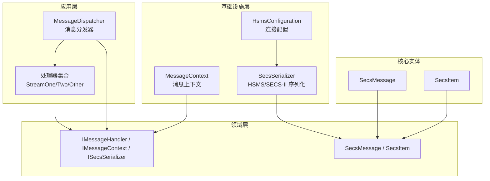
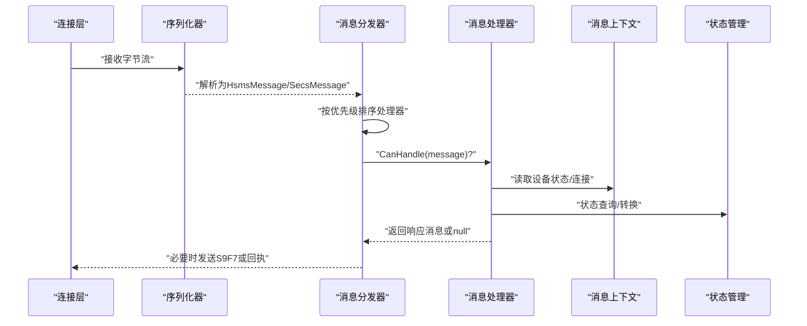
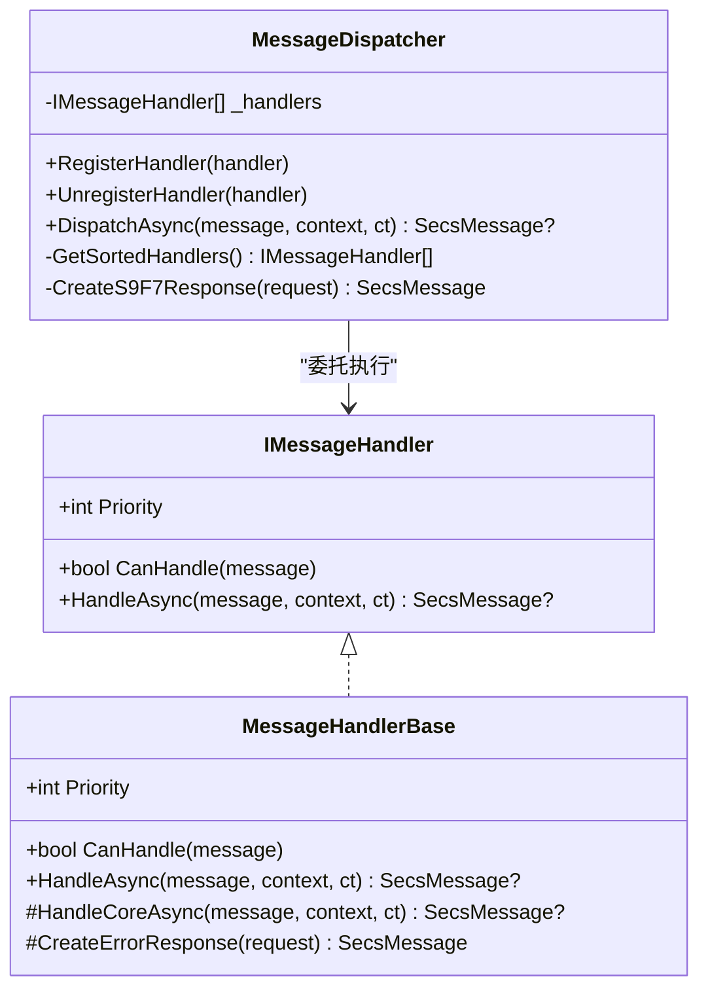
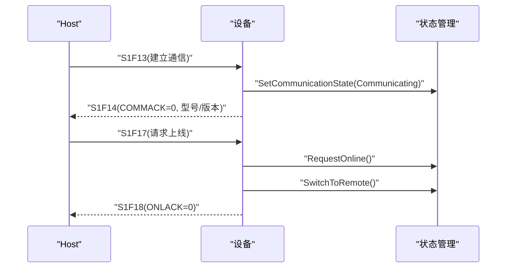
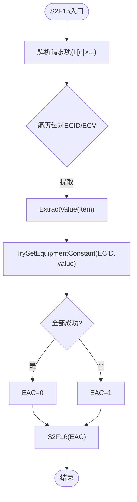
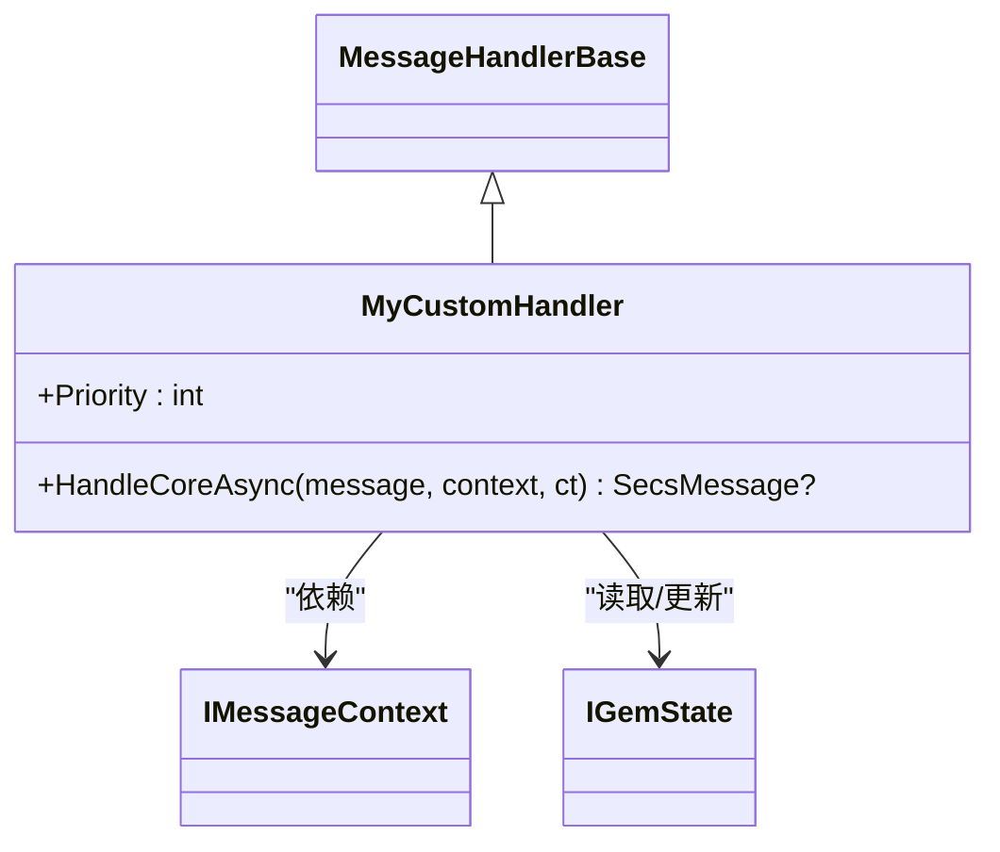
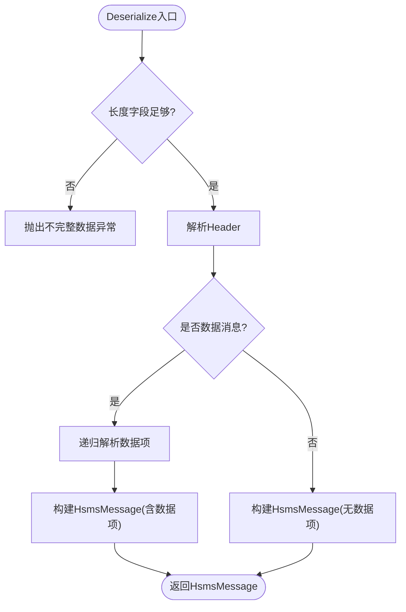
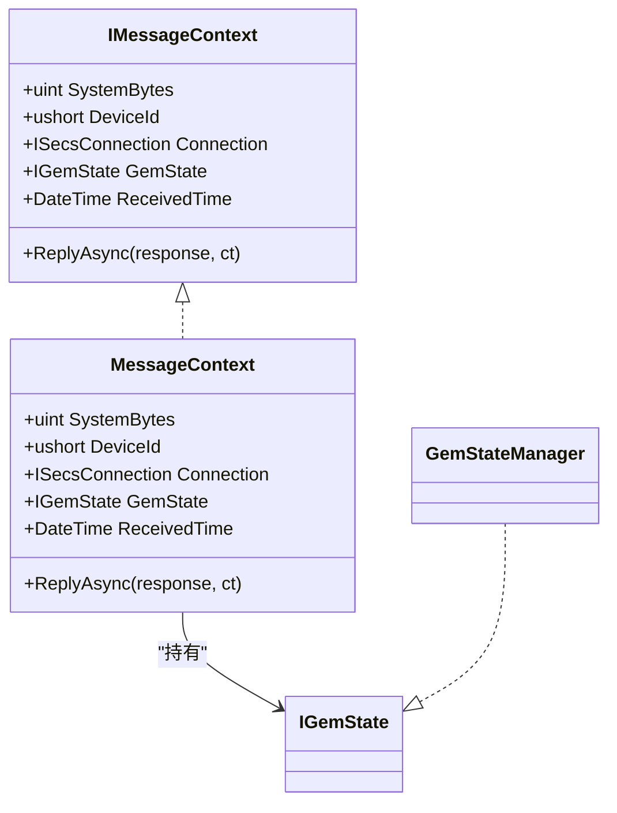
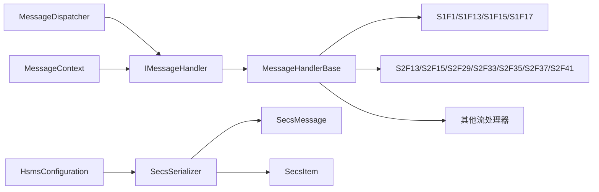

# 消息处理

<cite>
**本文引用的文件**
- [StreamOneHandlers.cs](file://WebGem/SECS2GEM/Application/Handlers/StreamOneHandlers.cs)
- [StreamTwoHandlers.cs](file://WebGem/SECS2GEM/Application/Handlers/StreamTwoHandlers.cs)
- [OtherStreamHandlers.cs](file://WebGem/SECS2GEM/Application/Handlers/OtherStreamHandlers.cs)
- [MessageDispatcher.cs](file://WebGem/SECS2GEM/Application/Messaging/MessageDispatcher.cs)
- [IMessageHandler.cs](file://WebGem/SECS2GEM/Domain/Interfaces/IMessageHandler.cs)
- [SecsMessage.cs](file://WebGem/SECS2GEM/Core/Entities/SecsMessage.cs)
- [SecsItem.cs](file://WebGem/SECS2GEM/Core/Entities/SecsItem.cs)
- [MessageContext.cs](file://WebGem/SECS2GEM/Infrastructure/Connection/MessageContext.cs)
- [ISecsSerializer.cs](file://WebGem/SECS2GEM/Domain/Interfaces/ISecsSerializer.cs)
- [SecsSerializer.cs](file://WebGem/SECS2GEM/Infrastructure/Serialization/SecsSerializer.cs)
- [GemStateManager.cs](file://WebGem/SECS2GEM/Application/State/GemStateManager.cs)
- [GemStates.cs](file://WebGem/SECS2GEM/Core/Enums/GemStates.cs)
- [GemStateException.cs](file://WebGem/SECS2GEM/Core/Exceptions/GemStateException.cs)
- [HsmsConfiguration.cs](file://WebGem/SECS2GEM/Infrastructure/Configuration/HsmsConfiguration.cs)
- [MessageHandlerTests.cs](file://WebGem/SECS2GEM.Tests/MessageHandlerTests.cs)
- [SecsSerializerTests.cs](file://WebGem/SECS2GEM.Tests/SecsSerializerTests.cs)
- [SECS2GEM.csproj](file://WebGem/SECS2GEM/SECS2GEM.csproj)
</cite>

## 目录
1. [简介](#简介)
2. [项目结构](#项目结构)
3. [核心组件](#核心组件)
4. [架构总览](#架构总览)
5. [详细组件分析](#详细组件分析)
6. [依赖关系分析](#依赖关系分析)
7. [性能考虑](#性能考虑)
8. [故障排查指南](#故障排查指南)
9. [结论](#结论)
10. [附录](#附录)

## 简介
本文件面向SECS2-GEM消息处理系统，围绕StreamOneHandlers与StreamTwoHandlers的实现机制展开，系统阐述消息路由、处理器注册与执行流程；介绍自定义消息处理器的开发方法与扩展点；深入解析SecsSerializer序列化器的工作原理与错误处理；提供最佳实践、性能优化建议、完整示例与调试技巧，并解释消息生命周期与异常处理策略。

## 项目结构
系统采用分层与职责分离的设计：
- 应用层：处理器与消息分发器，负责消息的识别、路由与响应生成
- 领域层：接口与模型，定义消息、数据项、上下文与序列化契约
- 基础设施层：连接、序列化、配置与日志等支撑能力
- 核心实体：SECS-II消息与数据项模型，提供不可变与类型安全的API
- 测试：覆盖消息处理器与序列化器的行为验证

**图表来源**
- [MessageDispatcher.cs:27-122](file://WebGem/SECS2GEM/Application/Messaging/MessageDispatcher.cs#L27-L122)
- [IMessageHandler.cs:51-130](file://WebGem/SECS2GEM/Domain/Interfaces/IMessageHandler.cs#L51-L130)
- [SecsMessage.cs:18-208](file://WebGem/SECS2GEM/Core/Entities/SecsMessage.cs#L18-L208)
- [SecsItem.cs:23-479](file://WebGem/SECS2GEM/Core/Entities/SecsItem.cs#L23-L479)
- [SecsSerializer.cs:27-661](file://WebGem/SECS2GEM/Infrastructure/Serialization/SecsSerializer.cs#L27-L661)
- [MessageContext.cs:12-64](file://WebGem/SECS2GEM/Infrastructure/Connection/MessageContext.cs#L12-L64)
- [HsmsConfiguration.cs:15-266](file://WebGem/SECS2GEM/Infrastructure/Configuration/HsmsConfiguration.cs#L15-L266)

**章节来源**
- [SECS2GEM.csproj:1-10](file://WebGem/SECS2GEM/SECS2GEM.csproj#L1-L10)

## 核心组件
- 消息处理器接口与基类：定义统一的CanHandle/HandleAsync契约，提供模板方法模式的异常与日志封装
- 消息分发器：维护处理器列表，按优先级排序并委托执行
- SECS-II消息与数据项：不可变模型，提供流畅的构建与访问API
- 序列化器：实现HSMS与SECS-II的双向序列化，支持大端序与递归结构
- 消息上下文：封装设备ID、连接、状态与回复能力
- 状态管理：GEM状态机，驱动在线/离线与控制模式转换

**章节来源**
- [IMessageHandler.cs:51-130](file://WebGem/SECS2GEM/Domain/Interfaces/IMessageHandler.cs#L51-L130)
- [MessageDispatcher.cs:27-122](file://WebGem/SECS2GEM/Application/Messaging/MessageDispatcher.cs#L27-L122)
- [SecsMessage.cs:18-208](file://WebGem/SECS2GEM/Core/Entities/SecsMessage.cs#L18-L208)
- [SecsItem.cs:23-479](file://WebGem/SECS2GEM/Core/Entities/SecsItem.cs#L23-L479)
- [SecsSerializer.cs:27-661](file://WebGem/SECS2GEM/Infrastructure/Serialization/SecsSerializer.cs#L27-L661)
- [MessageContext.cs:12-64](file://WebGem/SECS2GEM/Infrastructure/Connection/MessageContext.cs#L12-L64)
- [GemStateManager.cs:22-492](file://WebGem/SECS2GEM/Application/State/GemStateManager.cs#L22-L492)

## 架构总览
消息处理从底层连接接收字节流，经由序列化器解析为HSMS/SECS-II消息，再交由消息分发器根据Stream/Function路由至对应处理器，处理器基于上下文与状态机生成响应消息或触发业务动作。

**图表来源**
- [SecsSerializer.cs:93-126](file://WebGem/SECS2GEM/Infrastructure/Serialization/SecsSerializer.cs#L93-L126)
- [MessageDispatcher.cs:67-91](file://WebGem/SECS2GEM/Application/Messaging/MessageDispatcher.cs#L67-L91)
- [MessageContext.cs:12-64](file://WebGem/SECS2GEM/Infrastructure/Connection/MessageContext.cs#L12-L64)
- [GemStateManager.cs:22-492](file://WebGem/SECS2GEM/Application/State/GemStateManager.cs#L22-L492)

## 详细组件分析

### 消息处理器与分发器
- MessageHandlerBase：模板方法模式，统一异常捕获与错误响应生成；默认错误响应为S9F7（当W-Bit为true）
- MessageDispatcher：责任链+策略组合，维护处理器列表，按Priority排序，首个CanHandle的处理器即被委派执行
- 优先级：数值越小优先级越高；支持动态注册/注销

**图表来源**
- [IMessageHandler.cs:63-88](file://WebGem/SECS2GEM/Domain/Interfaces/IMessageHandler.cs#L63-L88)
- [StreamOneHandlers.cs:20-86](file://WebGem/SECS2GEM/Application/Handlers/StreamOneHandlers.cs#L20-L86)
- [MessageDispatcher.cs:27-122](file://WebGem/SECS2GEM/Application/Messaging/MessageDispatcher.cs#L27-L122)

**章节来源**
- [StreamOneHandlers.cs:20-211](file://WebGem/SECS2GEM/Application/Handlers/StreamOneHandlers.cs#L20-L211)
- [StreamTwoHandlers.cs:13-331](file://WebGem/SECS2GEM/Application/Handlers/StreamTwoHandlers.cs#L13-L331)
- [OtherStreamHandlers.cs:9-276](file://WebGem/SECS2GEM/Application/Handlers/OtherStreamHandlers.cs#L9-L276)
- [MessageDispatcher.cs:27-122](file://WebGem/SECS2GEM/Application/Messaging/MessageDispatcher.cs#L27-L122)
- [IMessageHandler.cs:63-88](file://WebGem/SECS2GEM/Domain/Interfaces/IMessageHandler.cs#L63-L88)

### StreamOneHandlers（S1F1/S1F13/S1F15/S1F17）
- S1F1：Are You There，返回设备型号与软件版本（S1F2）
- S1F13：Establish Communications Request，设置通信状态为Communicating并返回COMMACK（S1F14）
- S1F15：Request OFF-LINE，尝试切换到离线，返回OFLACK（S1F16）
- S1F17：Request ON-LINE，尝试上线并默认进入Remote模式，返回ONLACK（S1F18）

**图表来源**
- [StreamOneHandlers.cs:122-209](file://WebGem/SECS2GEM/Application/Handlers/StreamOneHandlers.cs#L122-L209)
- [GemStateManager.cs:263-348](file://WebGem/SECS2GEM/Application/State/GemStateManager.cs#L263-L348)

**章节来源**
- [StreamOneHandlers.cs:94-210](file://WebGem/SECS2GEM/Application/Handlers/StreamOneHandlers.cs#L94-L210)
- [GemStates.cs:10-81](file://WebGem/SECS2GEM/Core/Enums/GemStates.cs#L10-L81)
- [GemStateManager.cs:22-492](file://WebGem/SECS2GEM/Application/State/GemStateManager.cs#L22-L492)

### StreamTwoHandlers（S2F13/S2F15/S2F29/S2F33/S2F35/S2F37/S2F41）
- S2F13：Equipment Constant Request，查询设备常量（EC），返回ECV列表（S2F14）
- S2F15：New Equipment Constant Send，设置EC，返回EAC（S2F16）
- S2F29：Equipment Constant Namelist Request，返回EC定义清单（S2F30）
- S2F33：Define Report，简化实现为接受（DRACK=0，S2F34）
- S2F35：Link Event Report，简化实现为接受（LRACK=0，S2F36）
- S2F37：Enable/Disable Event Report，简化实现为接受（ERACK=0，S2F38）
- S2F41：Host Command Send，支持注册自定义RCMD命令，返回HCACK与参数确认（S2F42）

**图表来源**
- [StreamTwoHandlers.cs:86-138](file://WebGem/SECS2GEM/Application/Handlers/StreamTwoHandlers.cs#L86-L138)

**章节来源**
- [StreamTwoHandlers.cs:13-331](file://WebGem/SECS2GEM/Application/Handlers/StreamTwoHandlers.cs#L13-L331)
- [GemStateManager.cs:156-193](file://WebGem/SECS2GEM/Application/State/GemStateManager.cs#L156-L193)

### 其他流处理器（S5/S6/S7/S10）
- S5F3/S5F5/S5F7：报警相关，简化实现为接受或返回空列表
- S6F15/S6F19：事件报告请求，简化实现返回空报告
- S7F1/S7F3/S7F5/S7F17/S7F19：配方管理，简化实现为接受或返回空数据
- S10F3/S10F5：终端显示，简化实现为接受

这些处理器展示了“占位”与“可扩展”的设计：在保持协议兼容的同时，为后续业务实现预留空间。

**章节来源**
- [OtherStreamHandlers.cs:9-276](file://WebGem/SECS2GEM/Application/Handlers/OtherStreamHandlers.cs#L9-L276)

### 自定义消息处理器开发指南
- 继承MessageHandlerBase，重写Stream/Function与HandleCoreAsync
- 通过IMessageContext访问设备状态、连接与回复能力
- 通过GemStateManager读取/更新GEM状态，确保状态转换合法
- 严格遵守SECS-II格式与W-Bit语义，必要时返回S9F7
- 通过MessageDispatcher.RegisterHandler动态注册，利用Priority控制覆盖顺序

**图表来源**
- [StreamOneHandlers.cs:20-86](file://WebGem/SECS2GEM/Application/Handlers/StreamOneHandlers.cs#L20-L86)
- [IMessageHandler.cs:63-88](file://WebGem/SECS2GEM/Domain/Interfaces/IMessageHandler.cs#L63-L88)
- [GemStateManager.cs:22-492](file://WebGem/SECS2GEM/Application/State/GemStateManager.cs#L22-L492)

**章节来源**
- [StreamOneHandlers.cs:20-86](file://WebGem/SECS2GEM/Application/Handlers/StreamOneHandlers.cs#L20-L86)
- [IMessageHandler.cs:63-88](file://WebGem/SECS2GEM/Domain/Interfaces/IMessageHandler.cs#L63-L88)
- [GemStateManager.cs:22-492](file://WebGem/SECS2GEM/Application/State/GemStateManager.cs#L22-L492)

### SecsSerializer序列化器
- HSMS消息结构：4字节长度前缀 + 10字节Header + SECS-II数据项
- SECS-II数据项：格式字节（高6位格式，低2位长度字节数）+ 长度字节（1/2/3字节）+ 数据
- 大端序（Big-Endian）编码，支持递归List结构
- TryReadMessage：从缓冲区尝试读取完整消息，避免粘包拆包问题
- 错误处理：不完整数据、非法格式码、长度越界均抛出相应异常

**图表来源**
- [SecsSerializer.cs:93-126](file://WebGem/SECS2GEM/Infrastructure/Serialization/SecsSerializer.cs#L93-L126)
- [SecsSerializer.cs:417-477](file://WebGem/SECS2GEM/Infrastructure/Serialization/SecsSerializer.cs#L417-L477)

**章节来源**
- [SecsSerializer.cs:27-661](file://WebGem/SECS2GEM/Infrastructure/Serialization/SecsSerializer.cs#L27-L661)
- [ISecsSerializer.cs:21-61](file://WebGem/SECS2GEM/Domain/Interfaces/ISecsSerializer.cs#L21-L61)

### 消息上下文与状态管理
- IMessageContext：提供设备ID、连接、GEM状态、SystemBytes、接收时间与ReplyAsync能力
- MessageContext：内部实现，封装回复函数，便于在处理器中直接发送响应
- GemStateManager：封装通信/控制/处理三类状态机，提供状态查询、转换与事件通知

**图表来源**
- [IMessageHandler.cs:15-48](file://WebGem/SECS2GEM/Domain/Interfaces/IMessageHandler.cs#L15-L48)
- [MessageContext.cs:12-64](file://WebGem/SECS2GEM/Infrastructure/Connection/MessageContext.cs#L12-L64)
- [GemStateManager.cs:22-492](file://WebGem/SECS2GEM/Application/State/GemStateManager.cs#L22-L492)

**章节来源**
- [MessageContext.cs:12-64](file://WebGem/SECS2GEM/Infrastructure/Connection/MessageContext.cs#L12-L64)
- [GemStateManager.cs:22-492](file://WebGem/SECS2GEM/Application/State/GemStateManager.cs#L22-L492)

## 依赖关系分析
- 处理器依赖接口：IMessageHandler、IMessageContext、SecsMessage/SecsItem
- 分发器依赖处理器集合与排序逻辑
- 序列化器依赖枚举与异常类型，输出HsmsMessage/SecsMessage
- 上下文依赖连接与状态管理
- 配置影响序列化器最大消息大小与连接行为

**图表来源**
- [IMessageHandler.cs:63-88](file://WebGem/SECS2GEM/Domain/Interfaces/IMessageHandler.cs#L63-L88)
- [MessageDispatcher.cs:27-122](file://WebGem/SECS2GEM/Application/Messaging/MessageDispatcher.cs#L27-L122)
- [SecsSerializer.cs:27-661](file://WebGem/SECS2GEM/Infrastructure/Serialization/SecsSerializer.cs#L27-L661)
- [SecsMessage.cs:18-208](file://WebGem/SECS2GEM/Core/Entities/SecsMessage.cs#L18-L208)
- [SecsItem.cs:23-479](file://WebGem/SECS2GEM/Core/Entities/SecsItem.cs#L23-L479)
- [MessageContext.cs:12-64](file://WebGem/SECS2GEM/Infrastructure/Connection/MessageContext.cs#L12-L64)
- [HsmsConfiguration.cs:15-266](file://WebGem/SECS2GEM/Infrastructure/Configuration/HsmsConfiguration.cs#L15-L266)

**章节来源**
- [IMessageHandler.cs:63-88](file://WebGem/SECS2GEM/Domain/Interfaces/IMessageHandler.cs#L63-L88)
- [MessageDispatcher.cs:27-122](file://WebGem/SECS2GEM/Application/Messaging/MessageDispatcher.cs#L27-L122)
- [SecsSerializer.cs:27-661](file://WebGem/SECS2GEM/Infrastructure/Serialization/SecsSerializer.cs#L27-L661)
- [SecsMessage.cs:18-208](file://WebGem/SECS2GEM/Core/Entities/SecsMessage.cs#L18-L208)
- [SecsItem.cs:23-479](file://WebGem/SECS2GEM/Core/Entities/SecsItem.cs#L23-L479)
- [MessageContext.cs:12-64](file://WebGem/SECS2GEM/Infrastructure/Connection/MessageContext.cs#L12-L64)
- [HsmsConfiguration.cs:15-266](file://WebGem/SECS2GEM/Infrastructure/Configuration/HsmsConfiguration.cs#L15-L266)

## 性能考虑
- 缓冲区与Span：序列化器大量使用Span与预分配缓冲区，减少GC与内存拷贝
- 递归解析：List结构递归解析，注意深度与数据规模，结合MaxMessageSize限制
- 优先级缓存：分发器对处理器列表排序结果进行简单缓存，降低重复排序成本
- 并发安全：状态管理器使用锁保护关键状态字段，避免竞态
- 大端序：整型与浮点数均使用大端序，确保跨平台一致性
- 日志与调试：序列化器在调试路径输出字节与解析结果，便于定位问题

[本节为通用指导，不直接分析具体文件]

## 故障排查指南
- S9F7错误：当消息未被任何处理器处理且W-Bit为true时，分发器会返回S9F7（非法数据），检查处理器注册与CanHandle条件
- 不完整数据：TryReadMessage返回false或抛出异常，检查网络缓冲区与消息边界
- 格式异常：反序列化时遇到非法格式码或长度不匹配，检查上游发送方协议实现
- 状态异常：GEM状态转换非法时抛出GemStateException，核对状态转换规则与调用顺序
- 超时与重连：依据HsmsConfiguration中的T3/T6/T7/T8与心跳参数调整，避免频繁超时

**章节来源**
- [MessageDispatcher.cs:83-91](file://WebGem/SECS2GEM/Application/Messaging/MessageDispatcher.cs#L83-L91)
- [SecsSerializer.cs:139-177](file://WebGem/SECS2GEM/Infrastructure/Serialization/SecsSerializer.cs#L139-L177)
- [SecsSerializer.cs:417-477](file://WebGem/SECS2GEM/Infrastructure/Serialization/SecsSerializer.cs#L417-L477)
- [GemStateException.cs:41-151](file://WebGem/SECS2GEM/Core/Exceptions/GemStateException.cs#L41-L151)
- [HsmsConfiguration.cs:178-228](file://WebGem/SECS2GEM/Infrastructure/Configuration/HsmsConfiguration.cs#L178-L228)

## 结论
本系统以清晰的分层与接口设计实现了SECS2-GEM消息处理：处理器基类统一了异常与日志处理，分发器提供了灵活的路由与优先级机制；序列化器严格遵循HSMS/SECS-II规范，具备良好的可测试性与可扩展性；状态管理器与上下文为业务逻辑提供了可靠支撑。通过合理的扩展点与配置参数，系统能够满足不同设备与Host的交互需求。

[本节为总结，不直接分析具体文件]

## 附录

### 消息生命周期与异常处理策略
- 生命周期：接收字节流 → 序列化 → 分发 → 处理 → 响应/忽略 → 发送回执
- 异常策略：处理器内部异常被捕获并按W-Bit生成S9F7；序列化异常明确标识不完整数据或格式错误；状态异常提供详细的错误类型与上下文

**章节来源**
- [StreamOneHandlers.cs:53-85](file://WebGem/SECS2GEM/Application/Handlers/StreamOneHandlers.cs#L53-L85)
- [MessageDispatcher.cs:83-91](file://WebGem/SECS2GEM/Application/Messaging/MessageDispatcher.cs#L83-L91)
- [SecsSerializer.cs:95-98](file://WebGem/SECS2GEM/Infrastructure/Serialization/SecsSerializer.cs#L95-L98)
- [GemStateException.cs:41-151](file://WebGem/SECS2GEM/Core/Exceptions/GemStateException.cs#L41-L151)

### 最佳实践与性能优化建议
- 处理器开发
  - 明确CanHandle条件，避免误匹配
  - 优先使用IMessageContext提供的GEM状态与连接能力
  - 对外部输入进行严格的类型与范围校验
- 分发器使用
  - 合理设置Priority，避免覆盖默认行为
  - 动态注册/注销处理器时注意并发安全
- 序列化与网络
  - 合理设置MaxMessageSize，防止内存占用过高
  - 使用TryReadMessage处理粘包/半包，提升吞吐
  - 大端序编码确保跨平台一致性
- 状态管理
  - 严格遵循状态转换规则，避免非法状态
  - 使用事件订阅关注状态变化，及时刷新对外可见状态

**章节来源**
- [IMessageHandler.cs:63-88](file://WebGem/SECS2GEM/Domain/Interfaces/IMessageHandler.cs#L63-L88)
- [MessageDispatcher.cs:96-108](file://WebGem/SECS2GEM/Application/Messaging/MessageDispatcher.cs#L96-L108)
- [SecsSerializer.cs:42-42](file://WebGem/SECS2GEM/Infrastructure/Serialization/SecsSerializer.cs#L42-L42)
- [HsmsConfiguration.cs:99-102](file://WebGem/SECS2GEM/Infrastructure/Configuration/HsmsConfiguration.cs#L99-L102)
- [GemStateManager.cs:352-455](file://WebGem/SECS2GEM/Application/State/GemStateManager.cs#L352-L455)

### 完整消息处理示例（步骤说明）
- 示例：S1F13建立通信
  1) Host发送S1F13(携带MDLN/SOFTREV)
  2) 设备分发器匹配S1F13处理器
  3) 处理器设置通信状态为Communicating
  4) 生成S1F14(COMMACK=0, 返回MDLN/SOFTREV)
  5) 通过MessageContext.ReplyAsync发送响应
- 示例：S2F15设置设备常量
  1) Host发送S2F15(L[n]<L[2]<ECID,ECV>>...)
  2) 处理器遍历请求项，逐个TrySetEquipmentConstant
  3) 若全部成功EAC=0，否则EAC=1
  4) 生成S2F16(EAC)并发送

**章节来源**
- [StreamOneHandlers.cs:122-148](file://WebGem/SECS2GEM/Application/Handlers/StreamOneHandlers.cs#L122-L148)
- [StreamTwoHandlers.cs:86-121](file://WebGem/SECS2GEM/Application/Handlers/StreamTwoHandlers.cs#L86-L121)
- [MessageContext.cs:59-62](file://WebGem/SECS2GEM/Infrastructure/Connection/MessageContext.cs#L59-L62)

### 调试技巧
- 使用测试用例验证处理器行为与状态转换
- 在序列化器调试路径查看原始字节与解析结果
- 通过HsmsConfiguration开启消息日志，观察消息流向
- 利用分发器的优先级覆盖能力快速替换默认处理器进行对比测试

**章节来源**
- [MessageHandlerTests.cs:13-279](file://WebGem/SECS2GEM.Tests/MessageHandlerTests.cs#L13-L279)
- [SecsSerializerTests.cs:10-296](file://WebGem/SECS2GEM.Tests/SecsSerializerTests.cs#L10-L296)
- [SecsSerializer.cs:554-559](file://WebGem/SECS2GEM/Infrastructure/Serialization/SecsSerializer.cs#L554-L559)
- [HsmsConfiguration.cs:129-132](file://WebGem/SECS2GEM/Infrastructure/Configuration/HsmsConfiguration.cs#L129-L132)