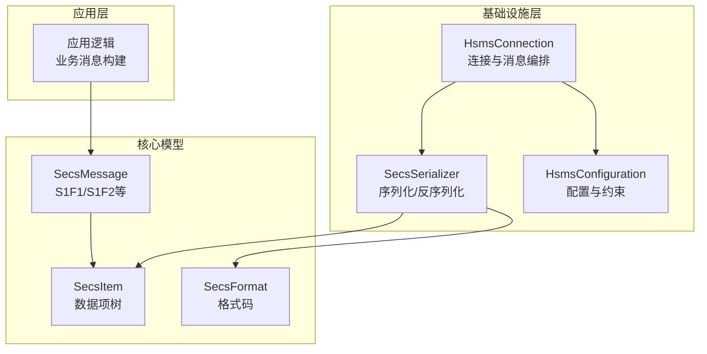
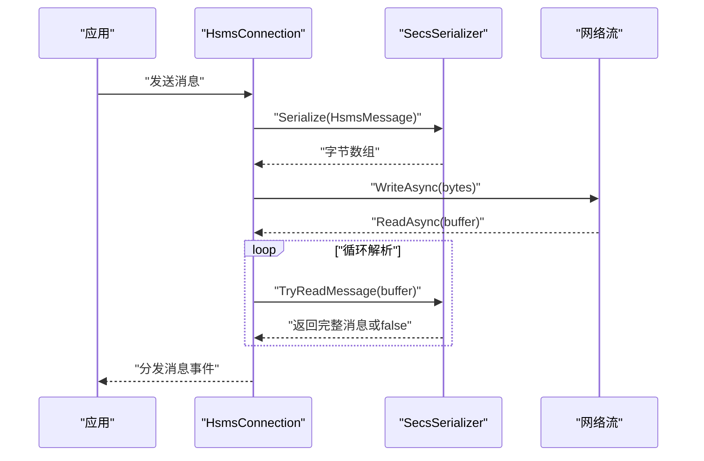
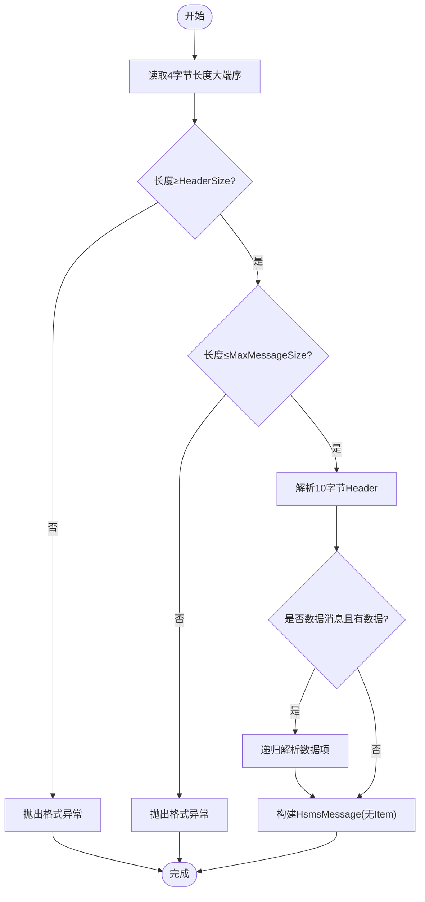
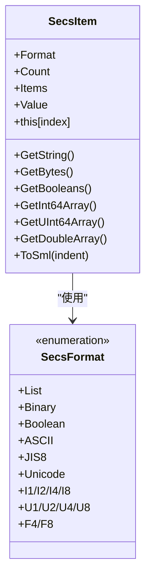
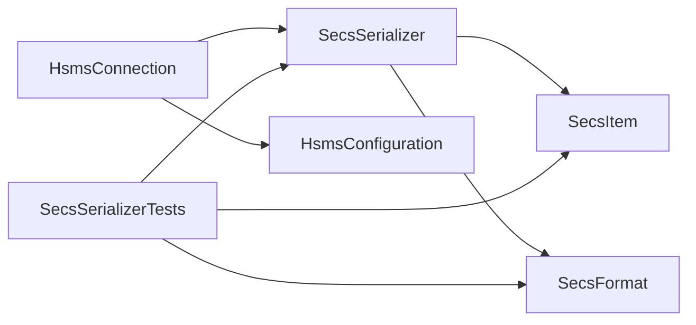

# 消息序列化

<cite>
**本文引用的文件**
- [SecsSerializer.cs](file://WebGem/SECS2GEM/Infrastructure/Serialization/SecsSerializer.cs)
- [SecsItem.cs](file://WebGem/SECS2GEM/Core/Entities/SecsItem.cs)
- [SecsMessage.cs](file://WebGem/SECS2GEM/Core/Entities/SecsMessage.cs)
- [SecsFormat.cs](file://WebGem/SECS2GEM/Core/Enums/SecsFormat.cs)
- [ISecsSerializer.cs](file://WebGem/SECS2GEM/Domain/Interfaces/ISecsSerializer.cs)
- [HsmsConnection.cs](file://WebGem/SECS2GEM/Infrastructure/Connection/HsmsConnection.cs)
- [SecsSerializerTests.cs](file://WebGem/SECS2GEM.Tests/SecsSerializerTests.cs)
- [HsmsConfiguration.cs](file://WebGem/SECS2GEM/Infrastructure/Configuration/HsmsConfiguration.cs)
- [SecsCommunicationException.cs](file://WebGem/SECS2GEM/Core/Exceptions/SecsCommunicationException.cs)
- [SecsTimeoutException.cs](file://WebGem/SECS2GEM/Core/Exceptions/SecsTimeoutException.cs)
</cite>

## 目录
1. [简介](#简介)
2. [项目结构](#项目结构)
3. [核心组件](#核心组件)
4. [架构总览](#架构总览)
5. [详细组件分析](#详细组件分析)
6. [依赖关系分析](#依赖关系分析)
7. [性能考量](#性能考量)
8. [故障排查指南](#故障排查指南)
9. [结论](#结论)
10. [附录](#附录)

## 简介
本文件面向开发者，系统性阐述 SECS-II 消息序列化系统的设计与实现，重点围绕 SecsSerializer 的编码/解码机制、数据类型转换与字节序处理，覆盖 B、A、I1/I2/I4/I8、F4/F8、U1/U2/U4/U8、Boolean、String 等格式的序列化规则；同时提供性能优化建议、内存管理策略、完整示例与错误处理机制，帮助提升消息传输效率与稳定性。

## 项目结构
该序列化系统位于基础设施层，核心文件如下：
- 序列化器：Infrastructure/Serialization/SecsSerializer.cs
- 数据项模型：Core/Entities/SecsItem.cs
- 消息模型：Core/Entities/SecsMessage.cs
- 格式枚举：Core/Enums/SecsFormat.cs
- 序列化器接口：Domain/Interfaces/ISecsSerializer.cs
- 连接与集成：Infrastructure/Connection/HsmsConnection.cs
- 配置：Infrastructure/Configuration/HsmsConfiguration.cs
- 测试：SECS2GEM.Tests/SecsSerializerTests.cs
- 异常体系：Core/Exceptions/*（通信、超时等）

图表来源
- [HsmsConnection.cs:120-139](file://WebGem/SECS2GEM/Infrastructure/Connection/HsmsConnection.cs#L120-L139)
- [SecsSerializer.cs:49-77](file://WebGem/SECS2GEM/Infrastructure/Serialization/SecsSerializer.cs#L49-L77)
- [SecsMessage.cs:93-104](file://WebGem/SECS2GEM/Core/Entities/SecsMessage.cs#L93-L104)
- [SecsItem.cs:51-65](file://WebGem/SECS2GEM/Core/Entities/SecsItem.cs#L51-L65)
- [SecsFormat.cs:13-110](file://WebGem/SECS2GEM/Core/Enums/SecsFormat.cs#L13-L110)
- [HsmsConfiguration.cs:99-102](file://WebGem/SECS2GEM/Infrastructure/Configuration/HsmsConfiguration.cs#L99-L102)

章节来源
- [HsmsConnection.cs:120-139](file://WebGem/SECS2GEM/Infrastructure/Connection/HsmsConnection.cs#L120-L139)
- [SecsSerializer.cs:49-77](file://WebGem/SECS2GEM/Infrastructure/Serialization/SecsSerializer.cs#L49-L77)
- [SecsMessage.cs:93-104](file://WebGem/SECS2GEM/Core/Entities/SecsMessage.cs#L93-L104)
- [SecsItem.cs:51-65](file://WebGem/SECS2GEM/Core/Entities/SecsItem.cs#L51-L65)
- [SecsFormat.cs:13-110](file://WebGem/SECS2GEM/Core/Enums/SecsFormat.cs#L13-L110)
- [HsmsConfiguration.cs:99-102](file://WebGem/SECS2GEM/Infrastructure/Configuration/HsmsConfiguration.cs#L99-L102)

## 核心组件
- SecsSerializer：实现 HSMS/SECS-II 消息与字节数组之间的双向转换，支持 TryReadMessage 流水式解析。
- SecsItem：不可变数据项模型，支持递归 List 结构与多格式值访问器。
- SecsMessage：封装 Stream/Function/WBit 与可选数据项。
- SecsFormat：定义 SECS-II 格式码（高6位），配合长度字节（低2位）编码。
- ISecsSerializer：序列化器接口，定义对外 API。

章节来源
- [SecsSerializer.cs:27-77](file://WebGem/SECS2GEM/Infrastructure/Serialization/SecsSerializer.cs#L27-L77)
- [SecsItem.cs:23-67](file://WebGem/SECS2GEM/Core/Entities/SecsItem.cs#L23-L67)
- [SecsMessage.cs:18-104](file://WebGem/SECS2GEM/Core/Entities/SecsMessage.cs#L18-L104)
- [SecsFormat.cs:13-110](file://WebGem/SECS2GEM/Core/Enums/SecsFormat.cs#L13-L110)
- [ISecsSerializer.cs:21-59](file://WebGem/SECS2GEM/Domain/Interfaces/ISecsSerializer.cs#L21-L59)

## 架构总览
序列化流程（HSMS 消息）：
- 序列化：计算消息体大小（Header+数据项），写入4字节长度（大端序），再写入10字节 Header，最后写入 SECS-II 数据项。
- 反序列化：先读取长度，校验范围，再解析 Header，若为数据消息则解析数据项。
- 流式解析：TryReadMessage 从缓冲区尝试提取完整消息，避免重复拷贝。

图表来源
- [HsmsConnection.cs:550-610](file://WebGem/SECS2GEM/Infrastructure/Connection/HsmsConnection.cs#L550-L610)
- [SecsSerializer.cs:139-177](file://WebGem/SECS2GEM/Infrastructure/Serialization/SecsSerializer.cs#L139-L177)

章节来源
- [HsmsConnection.cs:550-610](file://WebGem/SECS2GEM/Infrastructure/Connection/HsmsConnection.cs#L550-L610)
- [SecsSerializer.cs:139-177](file://WebGem/SECS2GEM/Infrastructure/Serialization/SecsSerializer.cs#L139-L177)

## 详细组件分析

### SecsSerializer 实现原理
- 编码规则
  - HSMS 消息头：4字节长度（大端序）+ 10字节 Header + 可选 SECS-II 数据项。
  - SECS-II 数据项：格式字节（高6位格式码，低2位长度字节数）+ 长度字节（1/2/3字节）+ 数据字节。
  - 字节序：所有整数与浮点数均采用大端序（Big-Endian）。
- 解码规则
  - 读取格式字节，分离格式码与长度字节数。
  - 读取长度字节，按长度字节数解析长度。
  - 对于 List 类型，长度表示子项数量；对于原子类型，长度表示字节数。
- 流式解析
  - TryReadMessage：先读取长度，校验最小/最大限制，再尝试解析完整消息，返回消耗字节数。

图表来源
- [SecsSerializer.cs:139-177](file://WebGem/SECS2GEM/Infrastructure/Serialization/SecsSerializer.cs#L139-L177)
- [SecsSerializer.cs:93-126](file://WebGem/SECS2GEM/Infrastructure/Serialization/SecsSerializer.cs#L93-L126)

章节来源
- [SecsSerializer.cs:49-177](file://WebGem/SECS2GEM/Infrastructure/Serialization/SecsSerializer.cs#L49-L177)

### 数据项模型与格式
- SecsItem
  - 不可变设计，支持递归 List。
  - 提供静态工厂方法创建不同格式的数据项。
  - 提供类型安全的值访问器（如 GetString、GetBytes、GetBooleans、GetInt64Array、GetUInt64Array、GetDoubleArray）。
- SecsFormat
  - 定义格式码（高6位），不包含长度字节数。
  - 支持 List、Binary、Boolean、ASCII/JIS8/Unicode、I1/I2/I4/I8、U1/U2/U4/U8、F4/F8。

图表来源
- [SecsItem.cs:23-67](file://WebGem/SECS2GEM/Core/Entities/SecsItem.cs#L23-L67)
- [SecsFormat.cs:13-110](file://WebGem/SECS2GEM/Core/Enums/SecsFormat.cs#L13-L110)

章节来源
- [SecsItem.cs:23-479](file://WebGem/SECS2GEM/Core/Entities/SecsItem.cs#L23-L479)
- [SecsFormat.cs:13-110](file://WebGem/SECS2GEM/Core/Enums/SecsFormat.cs#L13-L110)

### 各数据格式的序列化规则
- List
  - 格式字节：0x00 + 长度字节数
  - 长度：子项数量（非字节数）
  - 数据：逐个递归序列化子项
- Binary/B
  - 格式字节：0x20 + 长度字节数
  - 长度：字节数
  - 数据：原样复制字节
- Boolean
  - 格式字节：0x24 + 长度字节数
  - 长度：字节数（每个布尔占1字节）
  - 数据：0/1 字节（非零即真）
- ASCII/A 与 JIS8/J
  - 格式字节：0x40/0x44 + 长度字节数
  - 长度：字节数
  - 数据：按 ASCII 编码
- Unicode/U
  - 格式字节：0x48 + 长度字节数
  - 长度：字节数（每个字符2字节）
  - 数据：大端序 UTF-16
- I1/I2/I4/I8
  - 格式字节：0x64/0x68/0x70/0x60 + 长度字节数
  - 长度：字节数（1/2/4/8）
  - 数据：大端序有符号整数
- U1/U2/U4/U8
  - 格式字节：0xA4/0xA8/0xB0/0xA0 + 长度字节数
  - 长度：字节数（1/2/4/8）
  - 数据：大端序无符号整数
- F4/F8
  - 格式字节：0x90/0x80 + 长度字节数
  - 长度：字节数（4/8）
  - 数据：大端序 IEEE 754 浮点数

章节来源
- [SecsSerializer.cs:248-411](file://WebGem/SECS2GEM/Infrastructure/Serialization/SecsSerializer.cs#L248-L411)
- [SecsSerializer.cs:420-543](file://WebGem/SECS2GEM/Infrastructure/Serialization/SecsSerializer.cs#L420-L543)
- [SecsFormat.cs:13-110](file://WebGem/SECS2GEM/Core/Enums/SecsFormat.cs#L13-L110)

### 字节序与编码细节
- 所有整数与浮点数均使用大端序（Big-Endian）。
- 字符串使用 ASCII 或大端序 UTF-16（Unicode）。
- Boolean 使用 1 字节表示，非零为 true，零为 false。
- 长度字节数根据数据长度动态选择 1/2/3 字节。

章节来源
- [SecsSerializer.cs:284-301](file://WebGem/SECS2GEM/Infrastructure/Serialization/SecsSerializer.cs#L284-L301)
- [SecsSerializer.cs:342-409](file://WebGem/SECS2GEM/Infrastructure/Serialization/SecsSerializer.cs#L342-L409)
- [SecsSerializer.cs:545-559](file://WebGem/SECS2GEM/Infrastructure/Serialization/SecsSerializer.cs#L545-L559)

### 序列化性能优化与内存管理
- 零拷贝与 Span：大量使用 Span/ReadOnlySpan 避免中间数组分配。
- 预计算大小：CalculateItemSize 预估数据项大小，一次性分配缓冲区。
- 流式解析：TryReadMessage 从现有缓冲区解析，减少额外复制。
- 长度字节优化：根据长度自动选择 1/2/3 字节，兼顾空间与兼容性。
- 大端序原生支持：利用 BinaryPrimitives 的大端序读写，避免手工移位。

章节来源
- [SecsSerializer.cs:186-205](file://WebGem/SECS2GEM/Infrastructure/Serialization/SecsSerializer.cs#L186-L205)
- [SecsSerializer.cs:284-301](file://WebGem/SECS2GEM/Infrastructure/Serialization/SecsSerializer.cs#L284-L301)
- [SecsSerializer.cs:139-177](file://WebGem/SECS2GEM/Infrastructure/Serialization/SecsSerializer.cs#L139-L177)

### 完整序列化示例（路径指引）
- ASCII 字符串往返测试：[SecsSerializerTests.cs:16-34](file://WebGem/SECS2GEM.Tests/SecsSerializerTests.cs#L16-L34)
- U4 大端序验证：[SecsSerializerTests.cs:68-84](file://WebGem/SECS2GEM.Tests/SecsSerializerTests.cs#L68-L84)
- 嵌套 List 解析：[SecsSerializerTests.cs:135-156](file://WebGem/SECS2GEM.Tests/SecsSerializerTests.cs#L135-L156)
- 复杂消息结构往返：[SecsSerializerTests.cs:198-219](file://WebGem/SECS2GEM.Tests/SecsSerializerTests.cs#L198-L219)
- HSMS 消息序列化（含 Header）：[SecsSerializerTests.cs:225-242](file://WebGem/SECS2GEM.Tests/SecsSerializerTests.cs#L225-L242)
- TryReadMessage 流式解析：[SecsSerializerTests.cs:262-292](file://WebGem/SECS2GEM.Tests/SecsSerializerTests.cs#L262-L292)

章节来源
- [SecsSerializerTests.cs:16-292](file://WebGem/SECS2GEM.Tests/SecsSerializerTests.cs#L16-L292)

### 错误处理机制
- 输入完整性：TryReadMessage 在长度/Header/数据不足时返回 false，避免抛错。
- 格式异常：长度小于 HeaderSize、超过 MaxMessageSize、无效格式码等触发异常。
- 通信异常：连接失败、连接丢失、未选择状态等。
- 超时异常：事务超时（T3/T6/T7/T8）等。

章节来源
- [SecsSerializer.cs:139-177](file://WebGem/SECS2GEM/Infrastructure/Serialization/SecsSerializer.cs#L139-L177)
- [SecsSerializer.cs:420-477](file://WebGem/SECS2GEM/Infrastructure/Serialization/SecsSerializer.cs#L420-L477)
- [SecsCommunicationException.cs:113-151](file://WebGem/SECS2GEM/Core/Exceptions/SecsCommunicationException.cs#L113-L151)
- [SecsTimeoutException.cs:57-94](file://WebGem/SECS2GEM/Core/Exceptions/SecsTimeoutException.cs#L57-L94)

## 依赖关系分析
- HsmsConnection 依赖 SecsSerializer 进行消息编解码，并通过配置对象设置最大消息大小等约束。
- SecsSerializer 依赖 SecsItem/SecsFormat 进行数据项编码与解码。
- 测试用例覆盖了主要格式与往返一致性。

图表来源
- [HsmsConnection.cs:120-139](file://WebGem/SECS2GEM/Infrastructure/Connection/HsmsConnection.cs#L120-L139)
- [SecsSerializer.cs:27-77](file://WebGem/SECS2GEM/Infrastructure/Serialization/SecsSerializer.cs#L27-L77)
- [SecsSerializerTests.cs:1-10](file://WebGem/SECS2GEM.Tests/SecsSerializerTests.cs#L1-L10)

章节来源
- [HsmsConnection.cs:120-139](file://WebGem/SECS2GEM/Infrastructure/Connection/HsmsConnection.cs#L120-L139)
- [SecsSerializer.cs:27-77](file://WebGem/SECS2GEM/Infrastructure/Serialization/SecsSerializer.cs#L27-L77)
- [SecsSerializerTests.cs:1-10](file://WebGem/SECS2GEM.Tests/SecsSerializerTests.cs#L1-L10)

## 性能考量
- 零拷贝优先：尽量使用 Span/ReadOnlySpan 与原地写入，避免中间数组复制。
- 预分配缓冲区：基于预估大小一次性分配，减少扩容成本。
- 流式解析：在接收循环中反复调用 TryReadMessage，避免阻塞等待。
- 合理设置 MaxMessageSize：防止异常大的消息占用过多内存。
- 大端序原生支持：使用 BinaryPrimitives，避免自定义移位/掩码。

[本节为通用指导，无需特定文件来源]

## 故障排查指南
- 无法解析完整消息
  - 现象：TryReadMessage 返回 false，bytesConsumed 为 0。
  - 排查：确认缓冲区长度至少包含 4 字节长度字段；检查网络是否分片到达。
  - 参考：[SecsSerializer.cs:139-177](file://WebGem/SECS2GEM/Infrastructure/Serialization/SecsSerializer.cs#L139-L177)
- 长度异常
  - 现象：抛出格式异常（长度小于 HeaderSize 或超过 MaxMessageSize）。
  - 排查：检查上游是否正确写入 4 字节长度；调整 MaxMessageSize。
  - 参考：[SecsSerializer.cs:154-162](file://WebGem/SECS2GEM/Infrastructure/Serialization/SecsSerializer.cs#L154-L162)
- 数据不足
  - 现象：反序列化时提示数据不完整。
  - 排查：确认 Header 后剩余字节足够容纳数据项；检查长度字节与数据长度匹配。
  - 参考：[SecsSerializer.cs:422-470](file://WebGem/SECS2GEM/Infrastructure/Serialization/SecsSerializer.cs#L422-L470)
- 通信异常
  - 现象：连接失败、连接丢失、未选择状态。
  - 排查：检查 HsmsConfiguration 参数（端口、超时、心跳）；查看连接状态切换。
  - 参考：[SecsCommunicationException.cs:113-151](file://WebGem/SECS2GEM/Core/Exceptions/SecsCommunicationException.cs#L113-L151)
- 超时异常
  - 现象：事务等待超时（T3/T6/T7/T8）。
  - 排查：增大对应超时配置；检查对端响应能力。
  - 参考：[SecsTimeoutException.cs:57-94](file://WebGem/SECS2GEM/Core/Exceptions/SecsTimeoutException.cs#L57-L94)

章节来源
- [SecsSerializer.cs:139-177](file://WebGem/SECS2GEM/Infrastructure/Serialization/SecsSerializer.cs#L139-L177)
- [SecsSerializer.cs:422-470](file://WebGem/SECS2GEM/Infrastructure/Serialization/SecsSerializer.cs#L422-L470)
- [SecsCommunicationException.cs:113-151](file://WebGem/SECS2GEM/Core/Exceptions/SecsCommunicationException.cs#L113-L151)
- [SecsTimeoutException.cs:57-94](file://WebGem/SECS2GEM/Core/Exceptions/SecsTimeoutException.cs#L57-L94)

## 结论
本序列化系统以高性能与可维护性为目标，采用 Span/ReadOnlySpan 零拷贝与大端序原生支持，结合流式解析与预分配策略，实现了对 SECS-II/HSMS 消息的高效编解码。通过完善的异常体系与配置约束，系统在工程实践中具备良好的鲁棒性与扩展性。建议在生产环境中合理设置 MaxMessageSize、缓冲区大小与超时参数，并结合单元测试保障往返一致性。

[本节为总结，无需特定文件来源]

## 附录
- 常用消息工厂方法（示例路径）
  - S1F1 Are You There：[SecsMessage.cs:145-148](file://WebGem/SECS2GEM/Core/Entities/SecsMessage.cs#L145-L148)
  - S1F2 On Line Data：[SecsMessage.cs:155-162](file://WebGem/SECS2GEM/Core/Entities/SecsMessage.cs#L155-L162)
  - S1F13 Establish Communications Request：[SecsMessage.cs:169-176](file://WebGem/SECS2GEM/Core/Entities/SecsMessage.cs#L169-L176)
  - S1F14 Establish Communications Acknowledge：[SecsMessage.cs:184-194](file://WebGem/SECS2GEM/Core/Entities/SecsMessage.cs#L184-L194)
  - S9Fx Error：[SecsMessage.cs:201-204](file://WebGem/SECS2GEM/Core/Entities/SecsMessage.cs#L201-L204)

章节来源
- [SecsMessage.cs:145-204](file://WebGem/SECS2GEM/Core/Entities/SecsMessage.cs#L145-L204)