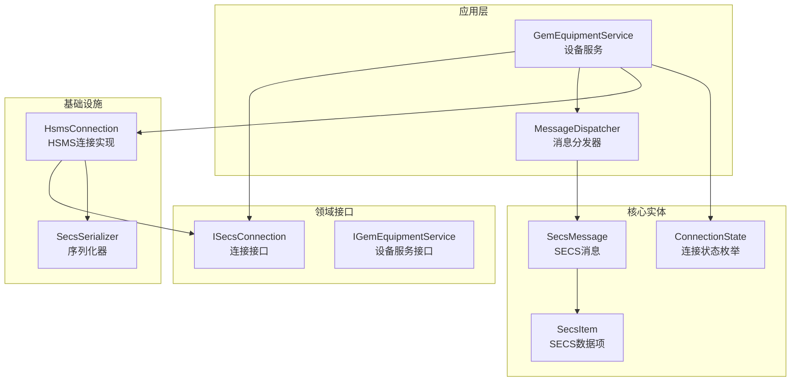
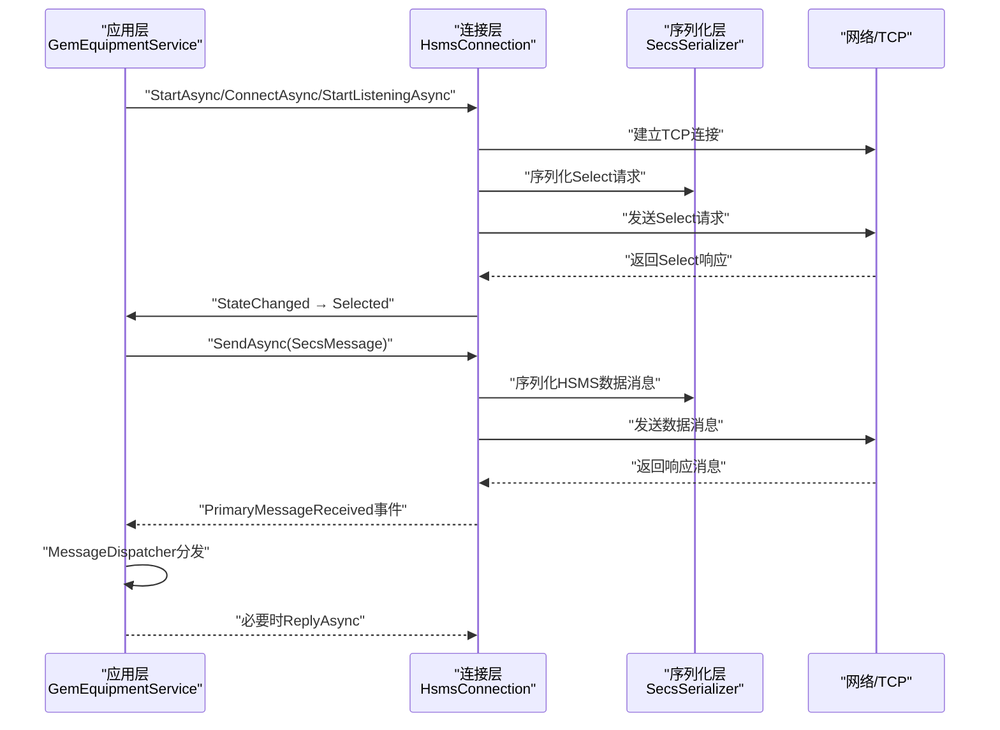
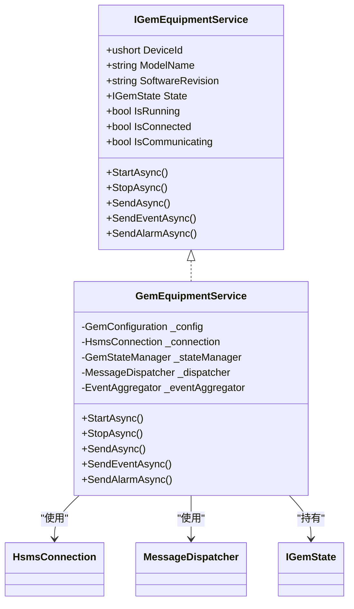
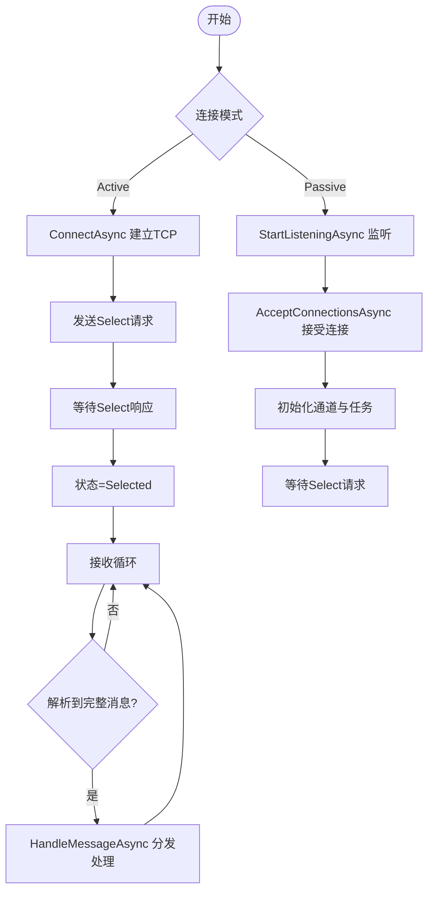
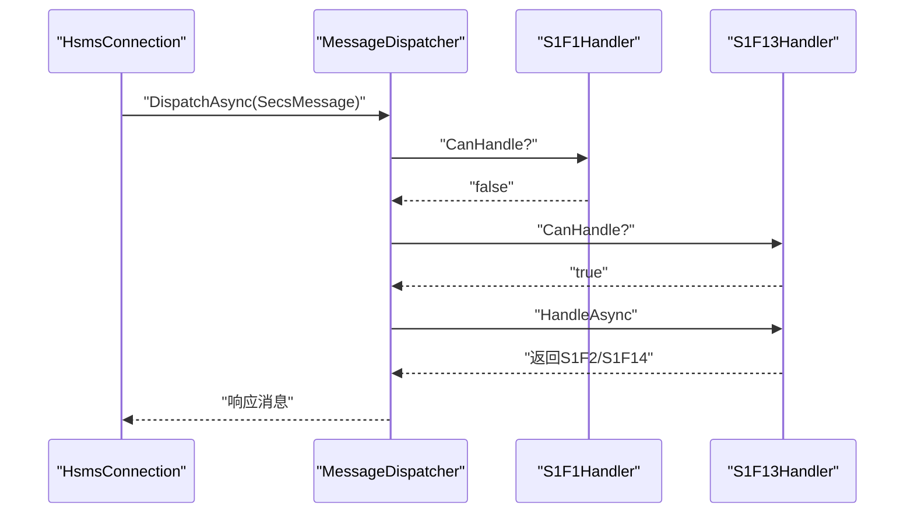
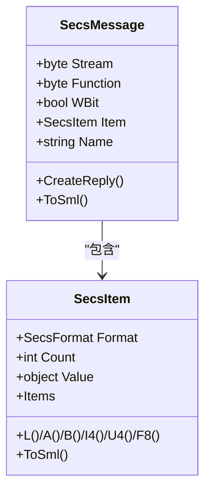
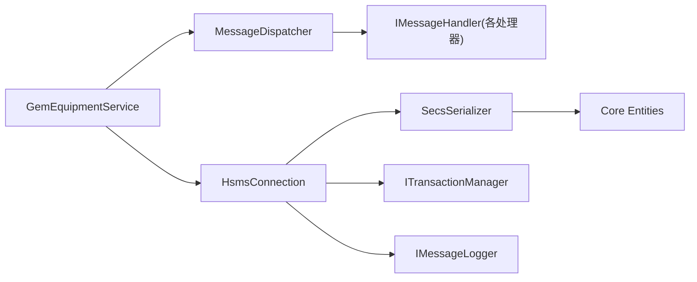

# 基础示例

<cite>
**本文引用的文件**
- [SECS2GEM.csproj](file://WebGem/SECS2GEM/SECS2GEM.csproj)
- [HsmsConfiguration.cs](file://WebGem/SECS2GEM/Infrastructure/Configuration/HsmsConfiguration.cs)
- [GemEquipmentService.cs](file://WebGem/SECS2GEM/Application/Services/GemEquipmentService.cs)
- [HsmsConnection.cs](file://WebGem/SECS2GEM/Infrastructure/Connection/HsmsConnection.cs)
- [ISecsConnection.cs](file://WebGem/SECS2GEM/Domain/Interfaces/ISecsConnection.cs)
- [IGemEquipmentService.cs](file://WebGem/SECS2GEM/Domain/Interfaces/IGemEquipmentService.cs)
- [SecsMessage.cs](file://WebGem/SECS2GEM/Core/Entities/SecsMessage.cs)
- [SecsItem.cs](file://WebGem/SECS2GEM/Core/Entities/SecsItem.cs)
- [ConnectionState.cs](file://WebGem/SECS2GEM/Core/Enums/ConnectionState.cs)
- [MessageDispatcher.cs](file://WebGem/SECS2GEM/Application/Messaging/MessageDispatcher.cs)
- [StreamOneHandlers.cs](file://WebGem/SECS2GEM/Application/Handlers/StreamOneHandlers.cs)
- [SecsSerializer.cs](file://WebGem/SECS2GEM/Infrastructure/Serialization/SecsSerializer.cs)
- [IntegrationTests.cs](file://WebGem/SECS2GEM.Tests/IntegrationTests.cs)
- [MessageHandlerTests.cs](file://WebGem/SECS2GEM.Tests/MessageHandlerTests.cs)
</cite>

## 目录
1. [简介](#简介)
2. [项目结构](#项目结构)
3. [核心组件](#核心组件)
4. [架构总览](#架构总览)
5. [详细组件分析](#详细组件分析)
6. [依赖关系分析](#依赖关系分析)
7. [性能与可靠性考虑](#性能与可靠性考虑)
8. [故障排查指南](#故障排查指南)
9. [结论](#结论)
10. [附录：可运行示例与最佳实践](#附录可运行示例与最佳实践)

## 简介
本“基础示例”面向初学者，帮助你快速掌握 SECS2GEM 的核心能力：初始化服务、建立 HSMS 连接、发送与接收 SECS 消息。文档将逐步解释每一步的代码实现、关键参数配置、事件处理与常见错误的解决方法，并提供可直接参考的文件路径与行号，便于你对照源码学习。

## 项目结构
SECS2GEM 采用分层清晰的结构：
- Core 层：定义 SECS 协议实体与枚举（如 SecsMessage、SecsItem、ConnectionState）
- Domain 层：定义接口契约（如 ISecsConnection、IGemEquipmentService）
- Infrastructure 层：提供连接、序列化、事务与日志等基础设施实现
- Application 层：封装业务服务（如 GemEquipmentService）、消息分发与处理器
- Tests 层：集成测试与处理器测试，验证端到端流程与消息路由

**图示来源**
- [GemEquipmentService.cs:33-133](file://WebGem/SECS2GEM/Application/Services/GemEquipmentService.cs#L33-L133)
- [HsmsConnection.cs:30-139](file://WebGem/SECS2GEM/Infrastructure/Connection/HsmsConnection.cs#L30-L139)
- [ISecsConnection.cs:56-142](file://WebGem/SECS2GEM/Domain/Interfaces/ISecsConnection.cs#L56-L142)
- [IGemEquipmentService.cs:6-24](file://WebGem/SECS2GEM/Domain/Interfaces/IGemEquipmentService.cs#L6-L24)
- [SecsMessage.cs:18-104](file://WebGem/SECS2GEM/Core/Entities/SecsMessage.cs#L18-L104)
- [SecsItem.cs:23-66](file://WebGem/SECS2GEM/Core/Entities/SecsItem.cs#L23-L66)
- [ConnectionState.cs:10-41](file://WebGem/SECS2GEM/Core/Enums/ConnectionState.cs#L10-L41)

**章节来源**
- [SECS2GEM.csproj:1-10](file://WebGem/SECS2GEM/SECS2GEM.csproj#L1-L10)

## 核心组件
- 设备服务（GemEquipmentService）：外观模式封装，负责启动/停止、注册默认处理器、事件发布、消息发送与状态管理。
- HSMS 连接（HsmsConnection）：实现 ISecsConnection，负责 TCP 连接、HSMS 控制消息（Select/Linktest/Separate）与数据消息的收发、心跳、事务管理与日志。
- 消息分发（MessageDispatcher）：责任链+策略模式，按优先级匹配处理器并返回响应。
- SECS 实体（SecsMessage/SecsItem）：不可变设计，提供流畅的工厂方法与 SML 表达。
- 配置（HsmsConfiguration）：集中管理网络、超时、心跳、缓冲区、消息日志等参数。

**章节来源**
- [GemEquipmentService.cs:33-133](file://WebGem/SECS2GEM/Application/Services/GemEquipmentService.cs#L33-L133)
- [HsmsConnection.cs:30-139](file://WebGem/SECS2GEM/Infrastructure/Connection/HsmsConnection.cs#L30-L139)
- [MessageDispatcher.cs:27-91](file://WebGem/SECS2GEM/Application/Messaging/MessageDispatcher.cs#L27-L91)
- [SecsMessage.cs:18-104](file://WebGem/SECS2GEM/Core/Entities/SecsMessage.cs#L18-L104)
- [SecsItem.cs:23-66](file://WebGem/SECS2GEM/Core/Entities/SecsItem.cs#L23-L66)
- [HsmsConfiguration.cs:15-133](file://WebGem/SECS2GEM/Infrastructure/Configuration/HsmsConfiguration.cs#L15-L133)

## 架构总览
下图展示了从应用层到基础设施层的关键交互，以及消息从发送到响应的典型路径。

**图示来源**
- [GemEquipmentService.cs:140-174](file://WebGem/SECS2GEM/Application/Services/GemEquipmentService.cs#L140-L174)
- [HsmsConnection.cs:146-186](file://WebGem/SECS2GEM/Infrastructure/Connection/HsmsConnection.cs#L146-L186)
- [ISecsConnection.cs:104-141](file://WebGem/SECS2GEM/Domain/Interfaces/ISecsConnection.cs#L104-L141)
- [SecsSerializer.cs:47-77](file://WebGem/SECS2GEM/Infrastructure/Serialization/SecsSerializer.cs#L47-L77)

## 详细组件分析

### 组件A：GemEquipmentService（设备服务）
- 角色与职责
  - 统一入口：整合连接、消息分发、状态管理与事件聚合
  - 生命周期：StartAsync/StopAsync，支持主动/被动模式
  - 消息发送：SendAsync（带事务等待响应）、SendOnlyAsync（单向）
  - 事件与报警：事件报告（S6F11）、报警（S5F1）上报与清理
  - 默认处理器：自动注册 S1/S2/S5/S6/S7/S10 等常用消息处理器
- 关键事件
  - ConnectionStateChanged：连接状态变化
  - MessageReceived：收到 Primary 消息
  - StateChanged：GEM 状态变化（通信/控制）

**图示来源**
- [IGemEquipmentService.cs:25-157](file://WebGem/SECS2GEM/Domain/Interfaces/IGemEquipmentService.cs#L25-L157)
- [GemEquipmentService.cs:33-133](file://WebGem/SECS2GEM/Application/Services/GemEquipmentService.cs#L33-L133)

**章节来源**
- [GemEquipmentService.cs:33-133](file://WebGem/SECS2GEM/Application/Services/GemEquipmentService.cs#L33-L133)
- [IGemEquipmentService.cs:25-157](file://WebGem/SECS2GEM/Domain/Interfaces/IGemEquipmentService.cs#L25-L157)

### 组件B：HsmsConnection（HSMS 连接）
- 连接模式
  - Active：主动发起 TCP 连接，随后发送 Select 请求
  - Passive：监听端口等待连接，收到连接后进入 Connected，等待 Select 请求
- 状态机
  - NotConnected → Connecting → Connected → Selected → Disconnecting
- 事务与心跳
  - 通过 TransactionManager 管理 Primary/Secondary 对应关系
  - 心跳 Linktest 循环，失败累计超过阈值自动断开
- 消息收发
  - 使用 Channel 异步发送队列
  - 接收循环持续读取并尝试解析完整消息

**图示来源**
- [HsmsConnection.cs:146-186](file://WebGem/SECS2GEM/Infrastructure/Connection/HsmsConnection.cs#L146-L186)
- [HsmsConnection.cs:191-275](file://WebGem/SECS2GEM/Infrastructure/Connection/HsmsConnection.cs#L191-L275)
- [HsmsConnection.cs:550-610](file://WebGem/SECS2GEM/Infrastructure/Connection/HsmsConnection.cs#L550-L610)
- [ConnectionState.cs:10-41](file://WebGem/SECS2GEM/Core/Enums/ConnectionState.cs#L10-L41)

**章节来源**
- [HsmsConnection.cs:30-139](file://WebGem/SECS2GEM/Infrastructure/Connection/HsmsConnection.cs#L30-L139)
- [ISecsConnection.cs:56-142](file://WebGem/SECS2GEM/Domain/Interfaces/ISecsConnection.cs#L56-L142)
- [ConnectionState.cs:10-41](file://WebGem/SECS2GEM/Core/Enums/ConnectionState.cs#L10-L41)

### 组件C：消息分发与处理器（MessageDispatcher + Handlers）
- 分发策略
  - 按优先级排序处理器，首个 CanHandle 返回 true 的处理器接管
  - 若无处理器，Primary 消息返回 S9F7（非法数据）
- 示例处理器
  - S1F1：Are You There → 返回 S1F2（设备型号与软件版本）
  - S1F13：建立通信 → 返回 S1F14（COMMACK=0 接受）
  - S1F15/S1F17：离线/在线请求 → 返回对应 ACK

**图示来源**
- [MessageDispatcher.cs:67-91](file://WebGem/SECS2GEM/Application/Messaging/MessageDispatcher.cs#L67-L91)
- [StreamOneHandlers.cs:94-114](file://WebGem/SECS2GEM/Application/Handlers/StreamOneHandlers.cs#L94-L114)
- [StreamOneHandlers.cs:122-148](file://WebGem/SECS2GEM/Application/Handlers/StreamOneHandlers.cs#L122-L148)

**章节来源**
- [MessageDispatcher.cs:27-91](file://WebGem/SECS2GEM/Application/Messaging/MessageDispatcher.cs#L27-L91)
- [StreamOneHandlers.cs:94-148](file://WebGem/SECS2GEM/Application/Handlers/StreamOneHandlers.cs#L94-L148)

### 组件D：SECS 消息与数据项
- SecsMessage
  - Stream/Function/WBit/Item 字段，提供工厂方法（如 S1F1、S1F13、S1F14）
  - CreateReply 便捷生成响应消息
- SecsItem
  - 不可变设计，支持 List/字符串/二进制/整数/浮点等格式
  - ToSml 输出人类可读的 SML 表达

**图示来源**
- [SecsMessage.cs:18-104](file://WebGem/SECS2GEM/Core/Entities/SecsMessage.cs#L18-L104)
- [SecsItem.cs:23-66](file://WebGem/SECS2GEM/Core/Entities/SecsItem.cs#L23-L66)

**章节来源**
- [SecsMessage.cs:18-104](file://WebGem/SECS2GEM/Core/Entities/SecsMessage.cs#L18-L104)
- [SecsItem.cs:23-66](file://WebGem/SECS2GEM/Core/Entities/SecsItem.cs#L23-L66)

## 依赖关系分析
- GemEquipmentService 依赖 HsmsConnection、MessageDispatcher、EventAggregator、GemStateManager
- HsmsConnection 依赖 ISecsSerializer、ITransactionManager、IMessageLogger
- MessageDispatcher 依赖 IMessageHandler
- SecsSerializer 依赖 Core 实体与异常类型

**图示来源**
- [GemEquipmentService.cs:110-133](file://WebGem/SECS2GEM/Application/Services/GemEquipmentService.cs#L110-L133)
- [HsmsConnection.cs:122-139](file://WebGem/SECS2GEM/Infrastructure/Connection/HsmsConnection.cs#L122-L139)
- [MessageDispatcher.cs:27-46](file://WebGem/SECS2GEM/Application/Messaging/MessageDispatcher.cs#L27-L46)
- [SecsSerializer.cs:27-44](file://WebGem/SECS2GEM/Infrastructure/Serialization/SecsSerializer.cs#L27-L44)

**章节来源**
- [GemEquipmentService.cs:110-133](file://WebGem/SECS2GEM/Application/Services/GemEquipmentService.cs#L110-L133)
- [HsmsConnection.cs:122-139](file://WebGem/SECS2GEM/Infrastructure/Connection/HsmsConnection.cs#L122-L139)
- [MessageDispatcher.cs:27-46](file://WebGem/SECS2GEM/Application/Messaging/MessageDispatcher.cs#L27-L46)

## 性能与可靠性考虑
- 缓冲区与消息大小
  - ReceiveBufferSize/SendBufferSize、MaxMessageSize 可根据网络环境与设备能力调整
- 超时参数
  - T3（回复超时）、T6（控制事务超时）、T7（未选择超时）、T8（字符间隔超时）影响连接稳定性
- 心跳与自动重连
  - LinktestInterval 与 MaxLinktestFailures 控制心跳频率与断开阈值
  - AutoReconnect 与 ReconnectDelay 控制断线后的恢复策略
- 异步与并发
  - Channel 发送队列 + 三个后台任务（接收/发送/心跳）提升吞吐与实时性

**章节来源**
- [HsmsConfiguration.cs:39-133](file://WebGem/SECS2GEM/Infrastructure/Configuration/HsmsConfiguration.cs#L39-L133)
- [HsmsConnection.cs:405-418](file://WebGem/SECS2GEM/Infrastructure/Connection/HsmsConnection.cs#L405-L418)

## 故障排查指南
- 连接失败
  - 确认 IP/端口正确，端口范围合法（1~65535）
  - 检查防火墙与网络可达性
  - 查看 HsmsConnection 抛出的连接异常与状态变化事件
- Select 超时
  - 检查 T6 与 T7 超时设置是否合理
  - 确保设备处于 Passive 模式时已 StartListeningAsync
- 发送消息无响应
  - 确认设备已进入 Selected/Communicating 状态
  - 检查消息 WBit 与处理器是否注册
- 心跳失败断开
  - 适当增大 LinktestInterval 与 MaxLinktestFailures
  - 检查网络抖动与丢包情况

**章节来源**
- [HsmsConfiguration.cs:178-199](file://WebGem/SECS2GEM/Infrastructure/Configuration/HsmsConfiguration.cs#L178-L199)
- [HsmsConnection.cs:280-296](file://WebGem/SECS2GEM/Infrastructure/Connection/HsmsConnection.cs#L280-L296)
- [HsmsConnection.cs:475-500](file://WebGem/SECS2GEM/Infrastructure/Connection/HsmsConnection.cs#L475-L500)

## 结论
通过本“基础示例”，你可以快速完成 SECS2GEM 的最小可用闭环：初始化设备服务、配置 HSMS 参数、建立连接、发送 SECS 消息并接收响应。建议先以 Passive 模式启动设备服务，再用 Host 端（或测试用例）发起连接与消息交互，逐步扩展到事件报告与报警上报场景。

## 附录：可运行示例与最佳实践
- 最简初始化与启动
  - 在你的应用入口创建 GemConfiguration（Passive/Active 任选其一），传入 HsmsConfiguration
  - 构造 GemEquipmentService 并调用 StartAsync
  - 订阅 ConnectionStateChanged 与 MessageReceived 事件
  - 参考路径：[GemEquipmentService.cs:110-158](file://WebGem/SECS2GEM/Application/Services/GemEquipmentService.cs#L110-L158)
- 建立 HSMS 连接
  - Passive：StartListeningAsync → 等待连接 → Select 请求 → Selected
  - Active：ConnectAsync → 发送 Select 请求 → Selected
  - 参考路径：[HsmsConnection.cs:146-186](file://WebGem/SECS2GEM/Infrastructure/Connection/HsmsConnection.cs#L146-L186)
- 发送基本 SECS 消息
  - 使用 SecsMessage 工厂方法构造消息（如 S1F1/S1F13）
  - 调用 GemEquipmentService.SendAsync（或 HsmsConnection.SendAsync）
  - 参考路径：[SecsMessage.cs:145-176](file://WebGem/SECS2GEM/Core/Entities/SecsMessage.cs#L145-L176)
- 常见初始化错误与解决
  - 端口非法：检查 HsmsConfiguration.Validate
  - 模式不匹配：Active/Passive 方法不可混用
  - 未选择状态发送：HsmsConnection 会在非 Selected 抛出异常
  - 参考路径：[HsmsConfiguration.cs:178-199](file://WebGem/SECS2GEM/Infrastructure/Configuration/HsmsConfiguration.cs#L178-L199)，[HsmsConnection.cs:427-432](file://WebGem/SECS2GEM/Infrastructure/Connection/HsmsConnection.cs#L427-L432)
- 端到端验证
  - 参考集成测试：设备接受连接、Select 响应、S1F1/S1F13/Linktest 响应
  - 参考路径：[IntegrationTests.cs:53-168](file://WebGem/SECS2GEM.Tests/IntegrationTests.cs#L53-L168)
- 处理器优先级与覆盖
  - 自定义处理器可通过 Priority 覆盖默认行为
  - 参考路径：[MessageHandlerTests.cs:200-218](file://WebGem/SECS2GEM.Tests/MessageHandlerTests.cs#L200-L218)