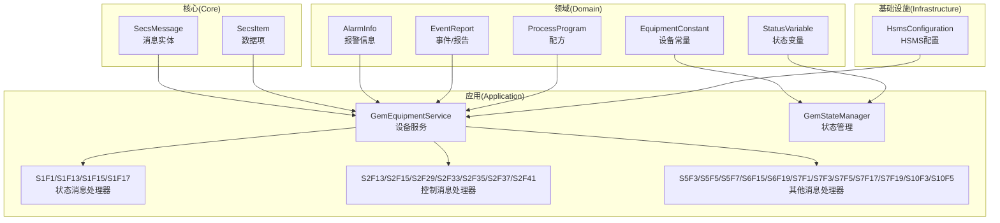
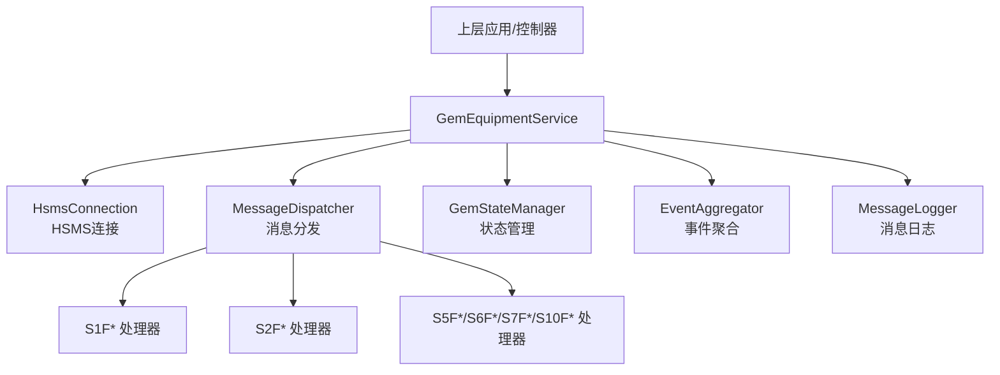
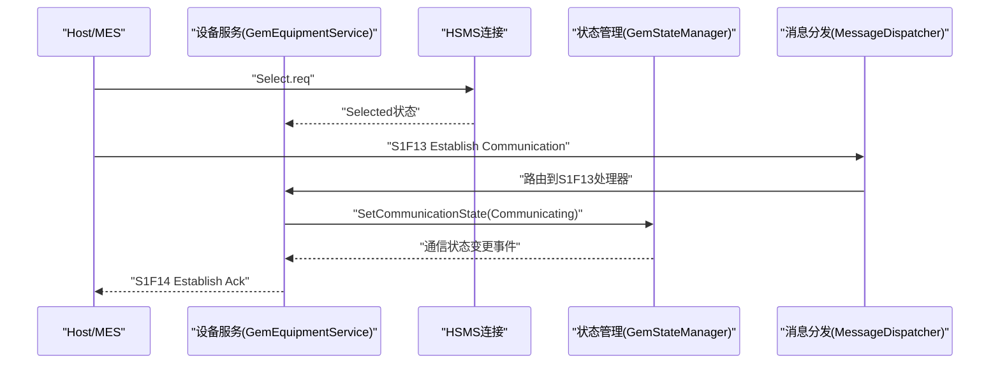
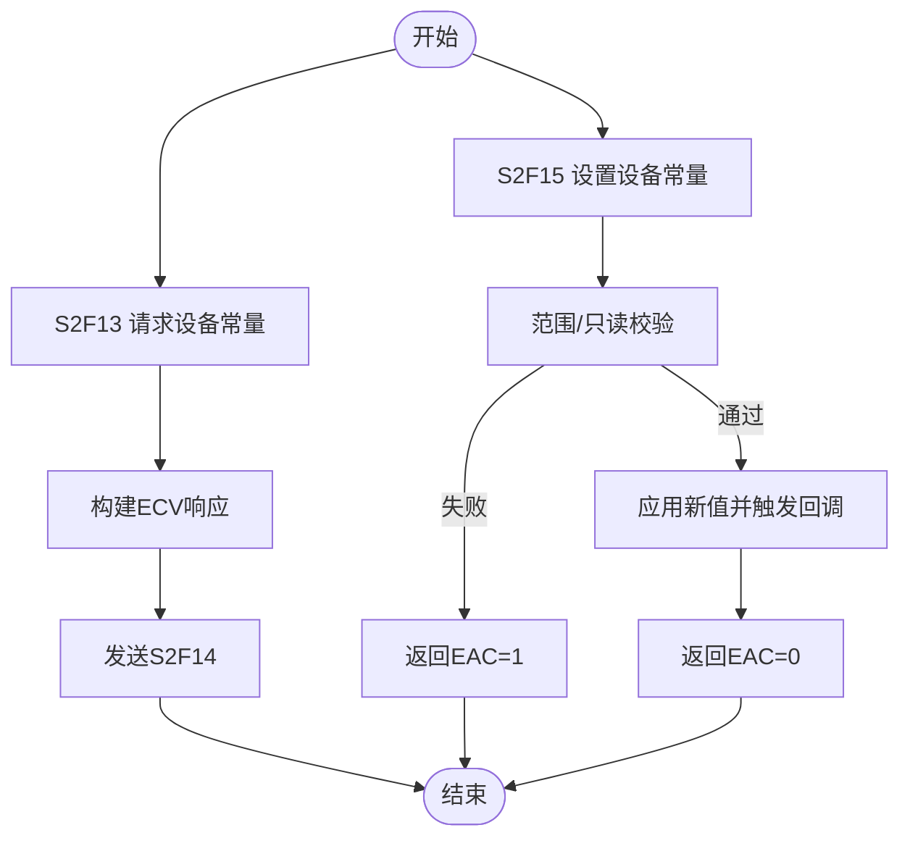
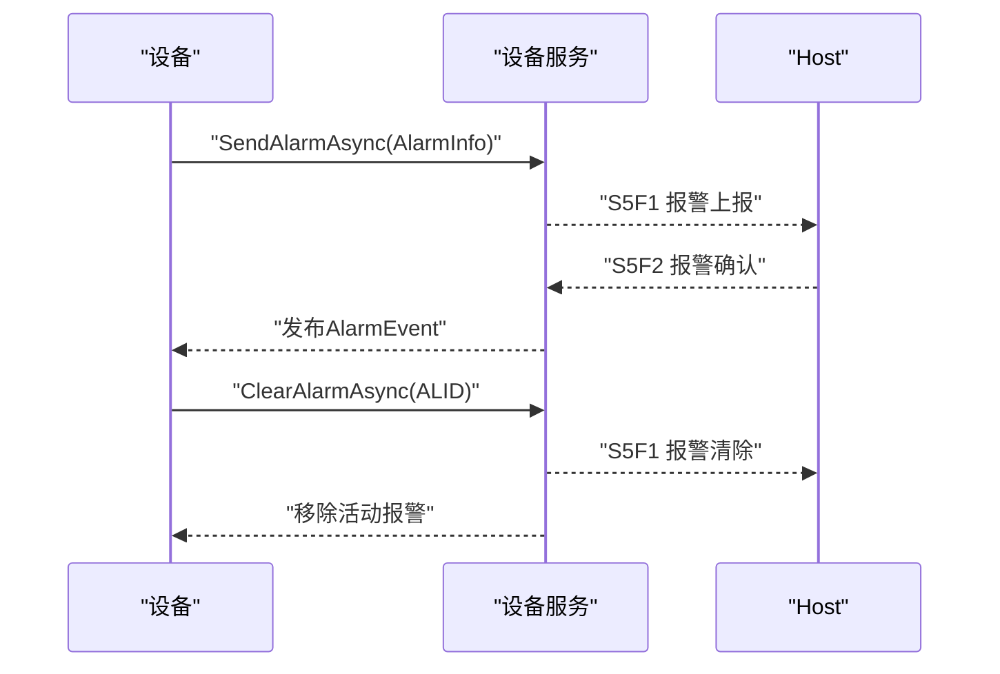
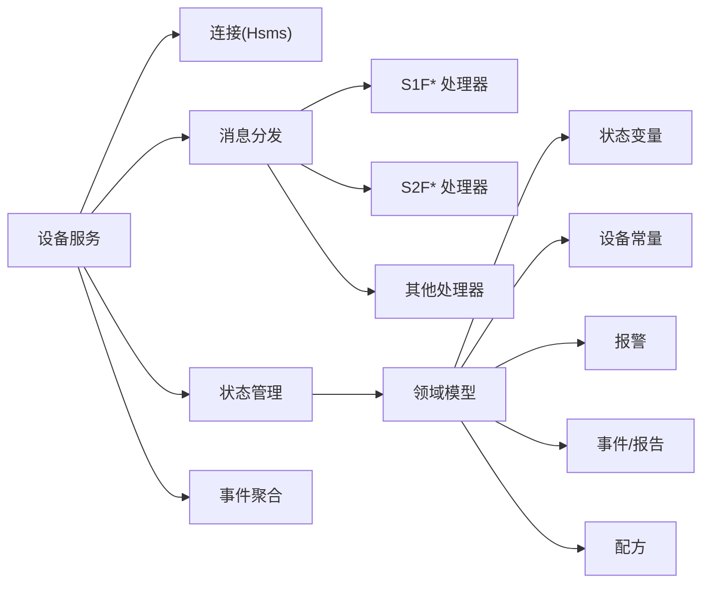

# 实际应用案例

<cite>
**本文引用的文件**   
- [README.md](file://README.md)
- [GEM协议规范文档.md](file://WebGem/SECS2GEM/GEM_Protocol_Specification.md)
- [SECS2GEM.csproj](file://WebGem/SECS2GEM/SECS2GEM.csproj)
- [IGemEquipmentService.cs](file://WebGem/SECS2GEM/Domain/Interfaces/IGemEquipmentService.cs)
- [GemEquipmentService.cs](file://WebGem/SECS2GEM/Application/Services/GemEquipmentService.cs)
- [GemStateManager.cs](file://WebGem/SECS2GEM/Application/State/GemStateManager.cs)
- [HsmsConfiguration.cs](file://WebGem/SECS2GEM/Infrastructure/Configuration/HsmsConfiguration.cs)
- [SecsMessage.cs](file://WebGem/SECS2GEM/Core/Entities/SecsMessage.cs)
- [SecsItem.cs](file://WebGem/SECS2GEM/Core/Entities/SecsItem.cs)
- [StreamOneHandlers.cs](file://WebGem/SECS2GEM/Application/Handlers/StreamOneHandlers.cs)
- [StreamTwoHandlers.cs](file://WebGem/SECS2GEM/Application/Handlers/StreamTwoHandlers.cs)
- [OtherStreamHandlers.cs](file://WebGem/SECS2GEM/Application/Handlers/OtherStreamHandlers.cs)
- [EquipmentConstant.cs](file://WebGem/SECS2GEM/Domain/Models/EquipmentConstant.cs)
- [StatusVariable.cs](file://WebGem/SECS2GEM/Domain/Models/StatusVariable.cs)
- [AlarmInfo.cs](file://WebGem/SECS2GEM/Domain/Models/AlarmInfo.cs)
- [EventReport.cs](file://WebGem/SECS2GEM/Domain/Models/EventReport.cs)
- [ProcessProgram.cs](file://WebGem/SECS2GEM/Domain/Models/ProcessProgram.cs)
</cite>

## 目录
1. [简介](#简介)
2. [项目结构](#项目结构)
3. [核心组件](#核心组件)
4. [架构总览](#架构总览)
5. [详细组件分析](#详细组件分析)
6. [依赖分析](#依赖分析)
7. [性能考虑](#性能考虑)
8. [故障排查指南](#故障排查指南)
9. [结论](#结论)
10. [附录](#附录)

## 简介
本文件面向SECS2GEM项目的实际应用案例，围绕工业自动化场景（半导体制造设备、显示面板生产设备、其他工业设备）提供可落地的通信集成方案。内容涵盖需求分析、系统架构设计、实现步骤、效果评估、设备常量配置、状态变量管理、报警处理、可复用代码模板与配置文件，以及针对不同设备类型与通信需求的配置调整建议与扩展定制化思路。

## 项目结构
SECS2GEM采用分层清晰的模块化组织方式：
- Core：协议实体与枚举（消息、数据项、格式）
- Domain：领域模型（设备常量、状态变量、报警、事件报告、配方等）
- Application：应用服务（设备服务、状态管理、消息处理器）
- Infrastructure：基础设施（HSMS配置、连接、序列化、日志等）
- WebGem：示例应用（演示如何使用SECS2GEM）

**图表来源**
- [SecsMessage.cs:18-104](file://WebGem/SECS2GEM/Core/Entities/SecsMessage.cs#L18-L104)
- [SecsItem.cs:23-66](file://WebGem/SECS2GEM/Core/Entities/SecsItem.cs#L23-L66)
- [EquipmentConstant.cs:12-62](file://WebGem/SECS2GEM/Domain/Models/EquipmentConstant.cs#L12-L62)
- [StatusVariable.cs:12-58](file://WebGem/SECS2GEM/Domain/Models/StatusVariable.cs#L12-L58)
- [AlarmInfo.cs:8-43](file://WebGem/SECS2GEM/Domain/Models/AlarmInfo.cs#L8-L43)
- [EventReport.cs:10-36](file://WebGem/SECS2GEM/Domain/Models/EventReport.cs#L10-L36)
- [ProcessProgram.cs:9-40](file://WebGem/SECS2GEM/Domain/Models/ProcessProgram.cs#L9-L40)
- [GemEquipmentService.cs:33-133](file://WebGem/SECS2GEM/Application/Services/GemEquipmentService.cs#L33-L133)
- [GemStateManager.cs:22-107](file://WebGem/SECS2GEM/Application/State/GemStateManager.cs#L22-L107)
- [HsmsConfiguration.cs:15-133](file://WebGem/SECS2GEM/Infrastructure/Configuration/HsmsConfiguration.cs#L15-L133)
- [StreamOneHandlers.cs:94-210](file://WebGem/SECS2GEM/Application/Handlers/StreamOneHandlers.cs#L94-L210)
- [StreamTwoHandlers.cs:13-138](file://WebGem/SECS2GEM/Application/Handlers/StreamTwoHandlers.cs#L13-L138)
- [OtherStreamHandlers.cs:6-27](file://WebGem/SECS2GEM/Application/Handlers/OtherStreamHandlers.cs#L6-L27)

**章节来源**
- [SECS2GEM.csproj:1-10](file://WebGem/SECS2GEM/SECS2GEM.csproj#L1-L10)
- [README.md:1-1](file://README.md#L1-L1)

## 核心组件
- 设备服务（GemEquipmentService）：外观模式封装，负责生命周期、连接、消息分发、事件与报警上报、状态管理。
- 状态管理（GemStateManager）：维护通信/控制/处理三态机，管理状态变量与设备常量。
- 消息实体（SecsMessage/SecsItem）：不可变消息与数据项，提供流畅构建与SML输出。
- 消息处理器（Handlers）：按Stream/Function划分，覆盖状态、控制、报警、事件、配方、终端等消息。
- 配置（HsmsConfiguration）：HSMS连接参数、超时、心跳、缓冲区、日志等。
- 领域模型（Domain Models）：设备常量、状态变量、报警、事件报告、配方等。

**章节来源**
- [IGemEquipmentService.cs:25-158](file://WebGem/SECS2GEM/Domain/Interfaces/IGemEquipmentService.cs#L25-L158)
- [GemEquipmentService.cs:33-454](file://WebGem/SECS2GEM/Application/Services/GemEquipmentService.cs#L33-L454)
- [GemStateManager.cs:22-492](file://WebGem/SECS2GEM/Application/State/GemStateManager.cs#L22-L492)
- [SecsMessage.cs:18-207](file://WebGem/SECS2GEM/Core/Entities/SecsMessage.cs#L18-L207)
- [SecsItem.cs:23-478](file://WebGem/SECS2GEM/Core/Entities/SecsItem.cs#L23-L478)
- [HsmsConfiguration.cs:15-266](file://WebGem/SECS2GEM/Infrastructure/Configuration/HsmsConfiguration.cs#L15-L266)
- [EquipmentConstant.cs:12-121](file://WebGem/SECS2GEM/Domain/Models/EquipmentConstant.cs#L12-L121)
- [StatusVariable.cs:12-60](file://WebGem/SECS2GEM/Domain/Models/StatusVariable.cs#L12-L60)
- [AlarmInfo.cs:8-80](file://WebGem/SECS2GEM/Domain/Models/AlarmInfo.cs#L8-L80)
- [EventReport.cs:10-158](file://WebGem/SECS2GEM/Domain/Models/EventReport.cs#L10-L158)
- [ProcessProgram.cs:9-164](file://WebGem/SECS2GEM/Domain/Models/ProcessProgram.cs#L9-L164)

## 架构总览
SECS2GEM以“设备服务”为中心，向上提供统一接口，向下整合连接、状态、消息分发与事件/报警机制。默认处理器覆盖主要GEM消息，支持扩展自定义处理器。

**图表来源**
- [GemEquipmentService.cs:33-133](file://WebGem/SECS2GEM/Application/Services/GemEquipmentService.cs#L33-L133)
- [GemEquipmentService.cs:407-443](file://WebGem/SECS2GEM/Application/Services/GemEquipmentService.cs#L407-L443)
- [HsmsConfiguration.cs:15-133](file://WebGem/SECS2GEM/Infrastructure/Configuration/HsmsConfiguration.cs#L15-L133)
- [StreamOneHandlers.cs:94-210](file://WebGem/SECS2GEM/Application/Handlers/StreamOneHandlers.cs#L94-L210)
- [StreamTwoHandlers.cs:13-138](file://WebGem/SECS2GEM/Application/Handlers/StreamTwoHandlers.cs#L13-L138)
- [OtherStreamHandlers.cs:6-27](file://WebGem/SECS2GEM/Application/Handlers/OtherStreamHandlers.cs#L6-L27)

## 详细组件分析

### 案例一：半导体制造设备（晶圆刻蚀/薄膜沉积）
需求分析
- 设备类型：半导体制造设备（如刻蚀机、PVD/ALD薄膜沉积设备）
- 通信角色：Equipment（被动等待Host连接）
- 关键能力：建立通信、状态查询、事件采集、报警上报、远程命令、配方管理
- 数据重点：状态变量（设备状态、工艺参数）、设备常量（设备参数上限/下限）、事件报告（工艺事件、异常事件）

系统架构设计
- 采用被动模式（Passive）监听Host连接
- 默认启用自动上线与远程控制模式
- 注册标准状态变量（如时钟、控制状态），并扩展工艺相关变量
- 配置事件报告与报警定义，实现异常自动上报

实现步骤
- 配置HSMS参数（设备ID、IP/端口、超时、心跳）
- 初始化设备服务，启动监听
- 注册事件与报告定义，配置事件-报告映射
- 注册报警定义，实现报警触发与清除
- 注册远程命令处理器，实现安全可控的设备操作
- 配置设备常量与状态变量，支持查询与设置

效果评估
- Host可稳定建立通信并获取在线数据
- 事件与报警上报及时，便于MES侧监控
- 远程命令与配方管理满足生产调度需求

设备常量配置
- 使用设备常量模型定义参数（ID、名称、单位、格式、默认值、范围、只读标记、变更回调）
- 通过S2F13查询、S2F15设置，支持范围校验与只读保护

状态变量管理
- 使用状态变量模型定义实时状态（ID、名称、单位、格式、值或值获取器）
- 通过S1F3/S1F4查询，S6F11事件上报

报警处理
- 使用报警信息模型（ID、文本、触发/清除、类别、时间戳）
- 通过S5F1上报，S5F2确认；支持启用/禁用

可复用模板与配置
- HSMS配置模板：Passive/Active模式、超时、心跳、缓冲区、消息日志
- 设备服务模板：Start/Stop、事件/报警上报、事件报告发送
- 处理器模板：基于MessageHandlerBase的S1F*/S2F*处理器

扩展与定制
- 新增自定义消息处理器，注册到MessageDispatcher
- 扩展状态变量与设备常量，满足特定工艺参数
- 定制事件报告结构，适配MES侧采集策略

**章节来源**
- [HsmsConfiguration.cs:202-228](file://WebGem/SECS2GEM/Infrastructure/Configuration/HsmsConfiguration.cs#L202-L228)
- [GemEquipmentService.cs:140-174](file://WebGem/SECS2GEM/Application/Services/GemEquipmentService.cs#L140-L174)
- [GemEquipmentService.cs:209-245](file://WebGem/SECS2GEM/Application/Services/GemEquipmentService.cs#L209-L245)
- [GemEquipmentService.cs:273-294](file://WebGem/SECS2GEM/Application/Services/GemEquipmentService.cs#L273-L294)
- [GemStateManager.cs:109-194](file://WebGem/SECS2GEM/Application/State/GemStateManager.cs#L109-L194)
- [EquipmentConstant.cs:12-121](file://WebGem/SECS2GEM/Domain/Models/EquipmentConstant.cs#L12-L121)
- [StatusVariable.cs:12-60](file://WebGem/SECS2GEM/Domain/Models/StatusVariable.cs#L12-L60)
- [AlarmInfo.cs:8-80](file://WebGem/SECS2GEM/Domain/Models/AlarmInfo.cs#L8-L80)
- [EventReport.cs:10-36](file://WebGem/SECS2GEM/Domain/Models/EventReport.cs#L10-L36)
- [StreamOneHandlers.cs:94-210](file://WebGem/SECS2GEM/Application/Handlers/StreamOneHandlers.cs#L94-L210)
- [StreamTwoHandlers.cs:13-138](file://WebGem/SECS2GEM/Application/Handlers/StreamTwoHandlers.cs#L13-L138)
- [OtherStreamHandlers.cs:6-27](file://WebGem/SECS2GEM/Application/Handlers/OtherStreamHandlers.cs#L6-L27)

### 案例二：显示面板生产设备（LCD/OLED阵列）
需求分析
- 设备类型：玻璃基板处理、薄膜晶体管阵列、彩色滤光片、背光模组等
- 关键能力：批量事件采集（面板缺陷、对位偏差、亮度均匀性）、报警联动、远程诊断命令
- 数据重点：面板良率相关状态变量、设备常量（温度/压力/速度阈值）、事件报告（按CEID分类）

系统架构设计
- 采用被动模式，Host主动发起连接
- 配置事件报告与报警，实现异常快速定位
- 通过S2F41远程命令实现设备诊断与参数微调

实现步骤
- 配置HSMS参数，启用自动重连与心跳
- 注册事件报告（按面板产线关键节点），配置事件-报告映射
- 注册报警定义（温度异常、压力异常、对位异常）
- 实现远程命令处理器（诊断、校准、复位）

效果评估
- 事件与报警上报准确，MES侧可快速响应
- 远程命令降低停机时间，提升设备可用性

**章节来源**
- [HsmsConfiguration.cs:178-228](file://WebGem/SECS2GEM/Infrastructure/Configuration/HsmsConfiguration.cs#L178-L228)
- [GemEquipmentService.cs:209-245](file://WebGem/SECS2GEM/Application/Services/GemEquipmentService.cs#L209-L245)
- [GemEquipmentService.cs:273-294](file://WebGem/SECS2GEM/Application/Services/GemEquipmentService.cs#L273-L294)
- [EventReport.cs:68-158](file://WebGem/SECS2GEM/Domain/Models/EventReport.cs#L68-L158)
- [AlarmInfo.cs:48-80](file://WebGem/SECS2GEM/Domain/Models/AlarmInfo.cs#L48-L80)
- [StreamTwoHandlers.cs:270-331](file://WebGem/SECS2GEM/Application/Handlers/StreamTwoHandlers.cs#L270-L331)

### 案例三：其他工业设备（搬运机器人/AGV/自动化装配线）
需求分析
- 设备类型：AGV、自动化装配线、自动上下料机
- 关键能力：路径/任务状态上报、异常报警、远程启停、参数下发
- 数据重点：任务进度、路径点状态、设备健康度

系统架构设计
- 采用被动模式，Host统一编排多设备
- 通过事件报告上报任务状态，报警上报机械故障
- 通过S2F41实现远程启停与任务重试

实现步骤
- 配置HSMS参数，设置合适的T3/T6/T7避免频繁超时
- 注册任务相关事件与报告，配置报警（急停、碰撞、卡料）
- 实现远程命令（启动任务、暂停/恢复、紧急停止）

效果评估
- 多设备协同效率提升，异常处置时间缩短

**章节来源**
- [HsmsConfiguration.cs:46-74](file://WebGem/SECS2GEM/Infrastructure/Configuration/HsmsConfiguration.cs#L46-L74)
- [GemEquipmentService.cs:209-245](file://WebGem/SECS2GEM/Application/Services/GemEquipmentService.cs#L209-L245)
- [GemEquipmentService.cs:273-294](file://WebGem/SECS2GEM/Application/Services/GemEquipmentService.cs#L273-L294)
- [AlarmInfo.cs:48-80](file://WebGem/SECS2GEM/Domain/Models/AlarmInfo.cs#L48-L80)
- [StreamTwoHandlers.cs:270-331](file://WebGem/SECS2GEM/Application/Handlers/StreamTwoHandlers.cs#L270-L331)

### 消息处理流程（以S1F13为例）

**图表来源**
- [GemEquipmentService.cs:324-384](file://WebGem/SECS2GEM/Application/Services/GemEquipmentService.cs#L324-L384)
- [StreamOneHandlers.cs:122-148](file://WebGem/SECS2GEM/Application/Handlers/StreamOneHandlers.cs#L122-L148)

### 设备常量与状态变量管理流程

**图表来源**
- [StreamTwoHandlers.cs:13-78](file://WebGem/SECS2GEM/Application/Handlers/StreamTwoHandlers.cs#L13-L78)
- [StreamTwoHandlers.cs:86-138](file://WebGem/SECS2GEM/Application/Handlers/StreamTwoHandlers.cs#L86-L138)
- [EquipmentConstant.cs:76-96](file://WebGem/SECS2GEM/Domain/Models/EquipmentConstant.cs#L76-L96)

### 报警上报与清除流程

**图表来源**
- [GemEquipmentService.cs:273-307](file://WebGem/SECS2GEM/Application/Services/GemEquipmentService.cs#L273-L307)
- [AlarmInfo.cs:8-43](file://WebGem/SECS2GEM/Domain/Models/AlarmInfo.cs#L8-L43)

## 依赖分析
- 组件耦合
  - 设备服务依赖连接、状态、分发、事件聚合、日志等子系统
  - 处理器依赖消息实体与状态管理器
  - 领域模型被状态管理与处理器共同使用
- 外部依赖
  - HSMS连接（TCP/IP）与超时参数
  - MES侧作为Host发起连接与消息交互

**图表来源**
- [GemEquipmentService.cs:33-133](file://WebGem/SECS2GEM/Application/Services/GemEquipmentService.cs#L33-L133)
- [GemStateManager.cs:22-107](file://WebGem/SECS2GEM/Application/State/GemStateManager.cs#L22-L107)
- [EquipmentConstant.cs:12-121](file://WebGem/SECS2GEM/Domain/Models/EquipmentConstant.cs#L12-L121)
- [StatusVariable.cs:12-60](file://WebGem/SECS2GEM/Domain/Models/StatusVariable.cs#L12-L60)
- [AlarmInfo.cs:8-80](file://WebGem/SECS2GEM/Domain/Models/AlarmInfo.cs#L8-L80)
- [EventReport.cs:10-158](file://WebGem/SECS2GEM/Domain/Models/EventReport.cs#L10-L158)
- [ProcessProgram.cs:9-164](file://WebGem/SECS2GEM/Domain/Models/ProcessProgram.cs#L9-L164)

**章节来源**
- [GemEquipmentService.cs:407-443](file://WebGem/SECS2GEM/Application/Services/GemEquipmentService.cs#L407-L443)
- [StreamOneHandlers.cs:94-210](file://WebGem/SECS2GEM/Application/Handlers/StreamOneHandlers.cs#L94-L210)
- [StreamTwoHandlers.cs:13-138](file://WebGem/SECS2GEM/Application/Handlers/StreamTwoHandlers.cs#L13-L138)
- [OtherStreamHandlers.cs:6-27](file://WebGem/SECS2GEM/Application/Handlers/OtherStreamHandlers.cs#L6-L27)

## 性能考虑
- 连接与缓冲
  - 合理设置接收/发送缓冲区大小，避免大消息阻塞
  - 启用自动重连与合理的重连延迟，平衡稳定性与资源占用
- 心跳与超时
  - T3/T6/T7应结合网络质量与业务特性调整，避免频繁超时
  - 心跳间隔与最大失败次数需与MES侧协调
- 消息日志
  - 生产环境建议开启消息日志但控制粒度，避免I/O瓶颈
- 事件与报警
  - 事件报告与报警应按需配置，避免过度上报导致带宽压力

[本节为通用指导，无需列出章节来源]

## 故障排查指南
常见问题与处理
- 无法建立HSMS连接
  - 检查IP/端口、防火墙、连接模式（Active/Passive）
  - 查看T7超时与自动重连配置
- 通信建立后无响应
  - 确认S1F13已到达，通信状态是否进入Communicating
  - 检查消息分发器是否注册了对应处理器
- 事件/报警未上报
  - 确认事件已注册并启用，报告已定义并链接
  - 检查设备服务是否处于IsCommunicating状态
- 设备常量设置失败
  - 检查只读标记与范围校验
  - 确认S2F15请求格式正确

**章节来源**
- [HsmsConfiguration.cs:178-228](file://WebGem/SECS2GEM/Infrastructure/Configuration/HsmsConfiguration.cs#L178-L228)
- [GemEquipmentService.cs:324-384](file://WebGem/SECS2GEM/Application/Services/GemEquipmentService.cs#L324-L384)
- [StreamOneHandlers.cs:122-148](file://WebGem/SECS2GEM/Application/Handlers/StreamOneHandlers.cs#L122-L148)
- [StreamTwoHandlers.cs:86-138](file://WebGem/SECS2GEM/Application/Handlers/StreamTwoHandlers.cs#L86-L138)
- [EquipmentConstant.cs:76-96](file://WebGem/SECS2GEM/Domain/Models/EquipmentConstant.cs#L76-L96)

## 结论
SECS2GEM提供了面向工业自动化场景的完整SECS/GEM通信实现，具备良好的扩展性与可配置性。通过标准化的状态变量与设备常量、完善的事件/报警机制、灵活的远程命令与配方管理，能够满足半导体、显示面板及其他工业设备的通信集成需求。按本文提供的案例与模板，可快速落地并持续优化。

[本节为总结性内容，无需列出章节来源]

## 附录

### A. 可复用代码模板与配置文件
- HSMS配置模板（Passive/Active）
  - 参考路径：[HsmsConfiguration.cs:204-228](file://WebGem/SECS2GEM/Infrastructure/Configuration/HsmsConfiguration.cs#L204-L228)
- 设备服务模板（Start/Stop/事件/报警/事件报告）
  - 参考路径：[GemEquipmentService.cs:140-174](file://WebGem/SECS2GEM/Application/Services/GemEquipmentService.cs#L140-L174)、[GemEquipmentService.cs:209-245](file://WebGem/SECS2GEM/Application/Services/GemEquipmentService.cs#L209-L245)、[GemEquipmentService.cs:273-294](file://WebGem/SECS2GEM/Application/Services/GemEquipmentService.cs#L273-L294)
- 消息处理器模板（S1F*/S2F*）
  - 参考路径：[StreamOneHandlers.cs:94-210](file://WebGem/SECS2GEM/Application/Handlers/StreamOneHandlers.cs#L94-L210)、[StreamTwoHandlers.cs:13-138](file://WebGem/SECS2GEM/Application/Handlers/StreamTwoHandlers.cs#L13-L138)
- 领域模型模板（设备常量/状态变量/报警/事件/配方）
  - 参考路径：[EquipmentConstant.cs:12-121](file://WebGem/SECS2GEM/Domain/Models/EquipmentConstant.cs#L12-L121)、[StatusVariable.cs:12-60](file://WebGem/SECS2GEM/Domain/Models/StatusVariable.cs#L12-L60)、[AlarmInfo.cs:8-80](file://WebGem/SECS2GEM/Domain/Models/AlarmInfo.cs#L8-L80)、[EventReport.cs:10-158](file://WebGem/SECS2GEM/Domain/Models/EventReport.cs#L10-L158)、[ProcessProgram.cs:9-164](file://WebGem/SECS2GEM/Domain/Models/ProcessProgram.cs#L9-L164)

### B. 配置调整建议
- 半导体设备
  - 被动模式监听，启用自动上线与远程控制
  - 合理设置T3/T6，避免刻蚀/沉积过程中的超时
- 显示面板设备
  - 启用心跳与自动重连，保障产线连续性
  - 事件报告按产线关键节点配置，报警按异常严重度分级
- 其他工业设备
  - 根据网络环境调整T7与缓冲区大小
  - 通过S2F41实现远程启停与任务重试

**章节来源**
- [HsmsConfiguration.cs:46-74](file://WebGem/SECS2GEM/Infrastructure/Configuration/HsmsConfiguration.cs#L46-L74)
- [HsmsConfiguration.cs:178-228](file://WebGem/SECS2GEM/Infrastructure/Configuration/HsmsConfiguration.cs#L178-L228)
- [GemEquipmentService.cs:373-384](file://WebGem/SECS2GEM/Application/Services/GemEquipmentService.cs#L373-L384)

### C. 扩展与定制化建议
- 新增消息处理器
  - 继承MessageHandlerBase，实现CanHandle/HandleCoreAsync
  - 在设备服务初始化时注册到MessageDispatcher
- 扩展状态变量与设备常量
  - 通过状态管理器注册，支持动态值获取器与范围校验
- 事件与报告
  - 通过事件报告配置管理事件-报告映射，按需启用/禁用
- 配方管理
  - 使用ProcessProgram模型与配置，控制最大数量与大小

**章节来源**
- [GemEquipmentService.cs:447-453](file://WebGem/SECS2GEM/Application/Services/GemEquipmentService.cs#L447-L453)
- [GemStateManager.cs:109-194](file://WebGem/SECS2GEM/Application/State/GemStateManager.cs#L109-L194)
- [EventReport.cs:68-158](file://WebGem/SECS2GEM/Domain/Models/EventReport.cs#L68-L158)
- [ProcessProgram.cs:60-135](file://WebGem/SECS2GEM/Domain/Models/ProcessProgram.cs#L60-L135)