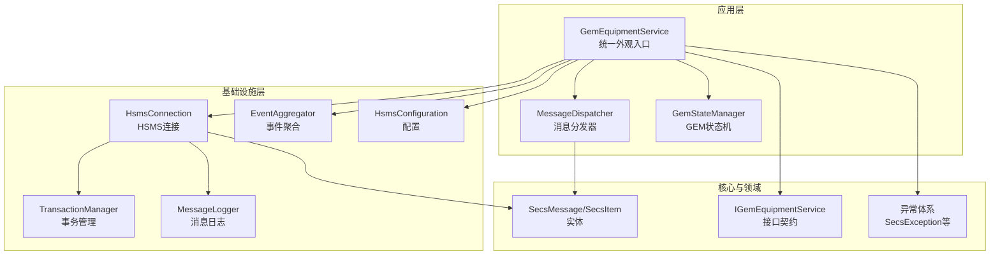
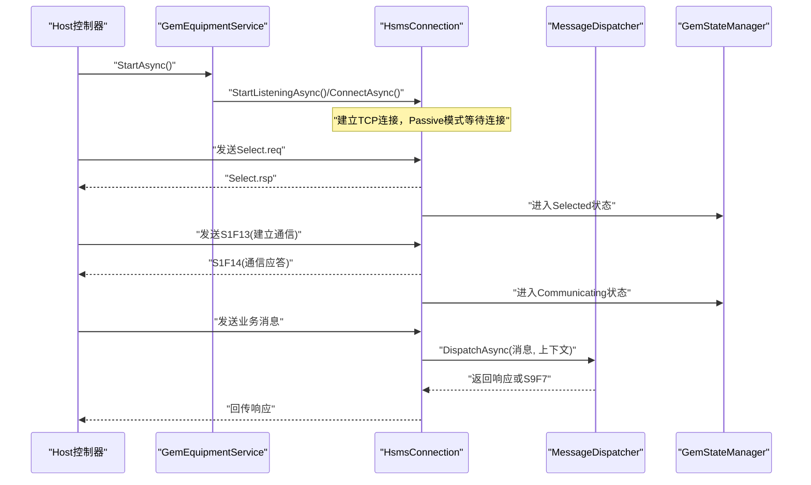
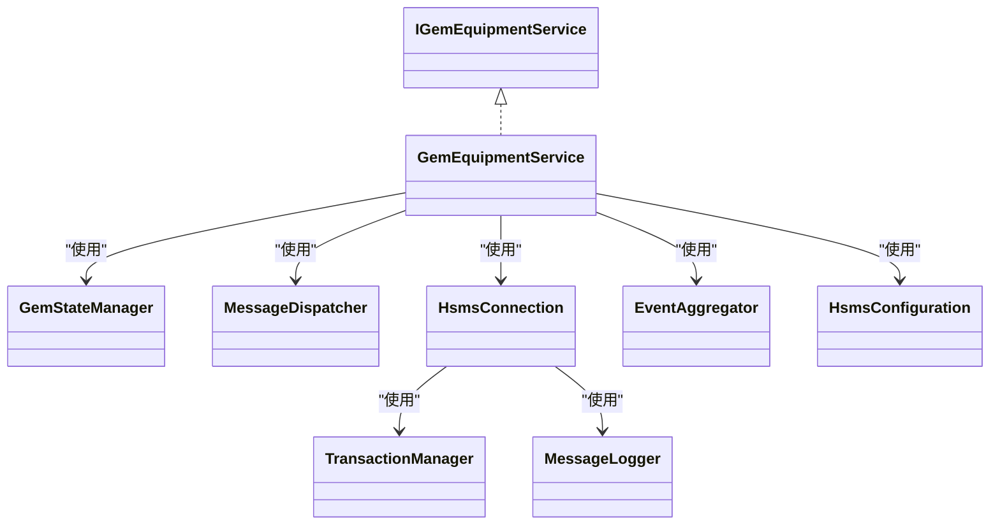

# 最佳实践

<cite>
**本文引用的文件**
- [SECS2GEM.csproj](file://WebGem/SECS2GEM/SECS2GEM.csproj)
- [GemEquipmentService.cs](file://WebGem/SECS2GEM/Application/Services/GemEquipmentService.cs)
- [IGemEquipmentService.cs](file://WebGem/SECS2GEM/Domain/Interfaces/IGemEquipmentService.cs)
- [GemStateManager.cs](file://WebGem/SECS2GEM/Application/State/GemStateManager.cs)
- [MessageDispatcher.cs](file://WebGem/SECS2GEM/Application/Messaging/MessageDispatcher.cs)
- [HsmsConnection.cs](file://WebGem/SECS2GEM/Infrastructure/Connection/HsmsConnection.cs)
- [HsmsConfiguration.cs](file://WebGem/SECS2GEM/Infrastructure/Configuration/HsmsConfiguration.cs)
- [EventAggregator.cs](file://WebGem/SECS2GEM/Infrastructure/Services/EventAggregator.cs)
- [TransactionManager.cs](file://WebGem/SECS2GEM/Infrastructure/Services/TransactionManager.cs)
- [MessageLogger.cs](file://WebGem/SECS2GEM/Infrastructure/Logging/MessageLogger.cs)
- [SecsException.cs](file://WebGem/SECS2GEM/Core/Exceptions/SecsException.cs)
- [IntegrationTests.cs](file://WebGem/SECS2GEM.Tests/IntegrationTests.cs)
- [GemStateManagerTests.cs](file://WebGem/SECS2GEM.Tests/GemStateManagerTests.cs)
- [Program.cs](file://WebGem/WebGem/Program.cs)
</cite>

## 目录
1. [简介](#简介)
2. [项目结构](#项目结构)
3. [核心组件](#核心组件)
4. [架构总览](#架构总览)
5. [详细组件分析](#详细组件分析)
6. [依赖关系分析](#依赖关系分析)
7. [性能考量](#性能考量)
8. [故障排除指南](#故障排除指南)
9. [结论](#结论)
10. [附录](#附录)

## 简介
本最佳实践指南面向在生产环境使用 SECS2GEM 的工程团队，围绕配置管理、错误处理、日志记录与性能优化，总结可落地的实践经验，并给出代码组织、依赖注入、异常与资源管理、单元与集成测试、安全与网络安全配置建议，以及部署运维相关的监控、日志管理和性能调优要点。内容基于仓库现有实现进行提炼与扩展，帮助读者在复杂工业通信场景下稳定、高效地运行 SECS/GEM 设备端服务。

## 项目结构
SECS2GEM 采用分层清晰的领域驱动设计风格，主要分为 Core（实体与枚举）、Domain（接口与领域模型）、Infrastructure（网络、序列化、日志、服务）、Application（服务编排、状态、消息分发）等层次；同时提供 WebGem 示例应用与 SECS2GEM.Tests 测试套件。

图表来源
- [GemEquipmentService.cs:33-454](file://WebGem/SECS2GEM/Application/Services/GemEquipmentService.cs#L33-L454)
- [MessageDispatcher.cs:27-121](file://WebGem/SECS2GEM/Application/Messaging/MessageDispatcher.cs#L27-L121)
- [GemStateManager.cs:22-491](file://WebGem/SECS2GEM/Application/State/GemStateManager.cs#L22-L491)
- [HsmsConnection.cs:30-800](file://WebGem/SECS2GEM/Infrastructure/Connection/HsmsConnection.cs#L30-L800)
- [TransactionManager.cs:24-200](file://WebGem/SECS2GEM/Infrastructure/Services/TransactionManager.cs#L24-L200)
- [EventAggregator.cs:17-218](file://WebGem/SECS2GEM/Infrastructure/Services/EventAggregator.cs#L17-L218)
- [MessageLogger.cs:23-437](file://WebGem/SECS2GEM/Infrastructure/Logging/MessageLogger.cs#L23-L437)
- [HsmsConfiguration.cs:15-265](file://WebGem/SECS2GEM/Infrastructure/Configuration/HsmsConfiguration.cs#L15-L265)
- [IGemEquipmentService.cs:25-158](file://WebGem/SECS2GEM/Domain/Interfaces/IGemEquipmentService.cs#L25-L158)
- [SecsException.cs:10-36](file://WebGem/SECS2GEM/Core/Exceptions/SecsException.cs#L10-L36)

章节来源
- [SECS2GEM.csproj:1-10](file://WebGem/SECS2GEM/SECS2GEM.csproj#L1-L10)

## 核心组件
- 设备服务外观（GemEquipmentService）
  - 聚合连接、状态、分发、事件聚合等子系统，提供统一的 Start/Stop、消息发送、事件与报警上报能力。
  - 在构造函数中创建并注入各子组件，注册默认消息处理器，订阅连接与状态事件，桥接应用层与基础设施层。
- 状态管理（GemStateManager）
  - 封装通信/控制/处理三类状态机，提供状态转换校验与事件通知，内置标准状态变量（如时钟、控制态）。
- 消息分发（MessageDispatcher）
  - 责任链+策略组合，维护处理器列表，按优先级匹配，找不到处理器时根据 WBit 返回 S9F7 或空响应。
- 连接与事务（HsmsConnection + TransactionManager）
  - 基于 Channel 的异步收发循环，支持主动/被动模式、心跳、T7 超时、Select/Deselect/Linktest 控制消息处理；事务管理器通过系统字节映射响应，支持超时与取消。
- 事件聚合（EventAggregator）
  - 并发安全的观察者模式，支持异步/同步处理器，异常隔离，提供订阅凭证以便取消订阅。
- 日志（MessageLogger）
  - 生产者-消费者异步写入，按日期/大小轮换，支持 HEX/SML 双格式输出，保留旧日志清理策略。
- 配置（HsmsConfiguration）
  - 统一管理 HSMS/T3-T8 超时、心跳、缓冲区、消息大小、自动重连、日志开关等参数，含参数校验与 TimeSpan 辅助属性。

章节来源
- [GemEquipmentService.cs:33-454](file://WebGem/SECS2GEM/Application/Services/GemEquipmentService.cs#L33-L454)
- [GemStateManager.cs:22-491](file://WebGem/SECS2GEM/Application/State/GemStateManager.cs#L22-L491)
- [MessageDispatcher.cs:27-121](file://WebGem/SECS2GEM/Application/Messaging/MessageDispatcher.cs#L27-L121)
- [HsmsConnection.cs:30-800](file://WebGem/SECS2GEM/Infrastructure/Connection/HsmsConnection.cs#L30-L800)
- [TransactionManager.cs:24-200](file://WebGem/SECS2GEM/Infrastructure/Services/TransactionManager.cs#L24-L200)
- [EventAggregator.cs:17-218](file://WebGem/SECS2GEM/Infrastructure/Services/EventAggregator.cs#L17-L218)
- [MessageLogger.cs:23-437](file://WebGem/SECS2GEM/Infrastructure/Logging/MessageLogger.cs#L23-L437)
- [HsmsConfiguration.cs:15-265](file://WebGem/SECS2GEM/Infrastructure/Configuration/HsmsConfiguration.cs#L15-L265)

## 架构总览
SECS2GEM 采用“外观 + 分发 + 状态 + 连接”的分层架构，应用层通过外观模式对外提供统一接口，内部通过消息分发器将请求路由至具体处理器，状态机驱动业务流转，连接层负责网络与事务，日志与事件聚合贯穿始终。

图表来源
- [GemEquipmentService.cs:140-183](file://WebGem/SECS2GEM/Application/Services/GemEquipmentService.cs#L140-L183)
- [HsmsConnection.cs:146-541](file://WebGem/SECS2GEM/Infrastructure/Connection/HsmsConnection.cs#L146-L541)
- [MessageDispatcher.cs:67-91](file://WebGem/SECS2GEM/Application/Messaging/MessageDispatcher.cs#L67-L91)
- [GemStateManager.cs:201-223](file://WebGem/SECS2GEM/Application/State/GemStateManager.cs#L201-L223)

## 详细组件分析

### 设备服务外观（GemEquipmentService）
- 设计要点
  - 外观模式：整合连接、状态、分发、事件聚合，向上提供简洁 API。
  - 生命周期：StartAsync/StopAsync/DisposeAsync，确保资源有序释放。
  - 事件桥接：将连接事件与状态变化转化为应用层事件，便于上层订阅。
  - 默认处理器注册：集中注册标准 GEM 消息处理器，支持后续扩展。
- 性能与可靠性
  - 通过状态机与连接状态判断，避免在未就绪状态下发送消息。
  - 事务管理器配合连接层实现请求-响应配对，避免乱序与丢失。
- 建议
  - 在生产中建议通过依赖注入容器创建与注入，避免在构造函数中硬编码依赖。
  - 对外暴露的事件订阅应提供取消订阅机制，避免内存泄漏。

章节来源
- [GemEquipmentService.cs:33-454](file://WebGem/SECS2GEM/Application/Services/GemEquipmentService.cs#L33-L454)
- [IGemEquipmentService.cs:25-158](file://WebGem/SECS2GEM/Domain/Interfaces/IGemEquipmentService.cs#L25-L158)

### 状态管理（GemStateManager）
- 设计要点
  - 三类状态机：通信、控制、处理，均提供严格的转换校验，防止非法状态跃迁。
  - 标准状态变量：内置常用变量（如时钟、控制态），支持静态值与动态值获取器。
  - 设备常量：支持只读与范围校验，保障配置安全性。
- 性能与可靠性
  - 使用锁保护状态转换，保证并发安全；事件通知异步触发，降低阻塞风险。
- 建议
  - 在生产中建议将状态变量与常量注册集中在初始化阶段，避免运行期频繁变更。
  - 对关键状态转换增加审计日志，便于问题定位。

章节来源
- [GemStateManager.cs:22-491](file://WebGem/SECS2GEM/Application/State/GemStateManager.cs#L22-L491)

### 消息分发（MessageDispatcher）
- 设计要点
  - 责任链+策略：按优先级排序处理器，首个 CanHandle 返回 true 的处理器即被委派处理。
  - 无匹配处理器时，若消息要求响应则返回 S9F7，否则返回空。
- 性能与可靠性
  - 处理器列表排序仅在新增/注销时触发，查询时使用副本，避免并发修改。
- 建议
  - 自定义处理器应设置合理 Priority，避免与默认处理器冲突。
  - 对高频消息建议在处理器内做快速拒绝（如非本设备 ID）以降低无效处理。

章节来源
- [MessageDispatcher.cs:27-121](file://WebGem/SECS2GEM/Application/Messaging/MessageDispatcher.cs#L27-L121)

### 连接与事务（HsmsConnection + TransactionManager）
- 设计要点
  - HsmsConnection：Channel 异步队列 + 三个后台任务（接收/发送/心跳），支持主动/被动模式、T7 超时、Select/Deselect/Linktest 控制消息处理。
  - TransactionManager：以系统字节为键管理事务，超时自动取消，支持取消全部事务。
- 性能与可靠性
  - 使用 Channel 解耦发送与接收，避免阻塞；心跳失败阈值与 T7 超时共同保障连接健康。
  - 事务等待采用 TaskCompletionSource，支持取消令牌与超时异常。
- 建议
  - 生产中建议根据设备吞吐量调整接收/发送缓冲区大小与消息最大长度。
  - 对关键控制消息（Select/Linktest）单独统计成功率与耗时，纳入监控指标。

章节来源
- [HsmsConnection.cs:30-800](file://WebGem/SECS2GEM/Infrastructure/Connection/HsmsConnection.cs#L30-L800)
- [TransactionManager.cs:24-200](file://WebGem/SECS2GEM/Infrastructure/Services/TransactionManager.cs#L24-L200)

### 事件聚合（EventAggregator）
- 设计要点
  - 并发安全订阅表，支持异步/同步处理器；异常隔离，单个订阅异常不影响其他订阅者。
  - 提供订阅凭证，便于取消订阅与资源回收。
- 建议
  - 在 DisposeAsync 中调用 ClearAllSubscriptions，避免悬挂订阅导致内存泄漏。
  - 对异步处理器建议使用 Task.Run 包裹，避免阻塞事件发布线程。

章节来源
- [EventAggregator.cs:17-218](file://WebGem/SECS2GEM/Infrastructure/Services/EventAggregator.cs#L17-L218)

### 日志（MessageLogger）
- 设计要点
  - 异步写入，后台任务批量刷新；按日期/大小轮换；支持 HEX/SML 输出；可配置保留天数。
- 建议
  - 生产中建议开启按日期轮换与大小轮换，结合保留天数清理策略，避免磁盘占用过大。
  - 对高并发场景建议增大刷新间隔与批量写入阈值，平衡实时性与 IO 压力。

章节来源
- [MessageLogger.cs:23-437](file://WebGem/SECS2GEM/Infrastructure/Logging/MessageLogger.cs#L23-L437)

### 配置（HsmsConfiguration）
- 设计要点
  - 统一管理网络、超时、心跳、缓冲区、消息大小、自动重连、日志等参数，含参数校验与 TimeSpan 辅助属性。
- 建议
  - 生产中建议将配置从外部注入（如 JSON/环境变量），避免硬编码；不同设备/场景使用独立配置对象。
  - 对 T3/T6/T7 等超时参数应结合网络质量与设备处理能力进行调优。

章节来源
- [HsmsConfiguration.cs:15-265](file://WebGem/SECS2GEM/Infrastructure/Configuration/HsmsConfiguration.cs#L15-L265)

### 异常体系（SecsException）
- 设计要点
  - 所有 SECS/GEM 相关异常的基类，提供统一异常处理入口。
- 建议
  - 在连接层与事务层捕获并包装为特定异常（如连接失败、超时），便于上层识别与恢复。

章节来源
- [SecsException.cs:10-36](file://WebGem/SECS2GEM/Core/Exceptions/SecsException.cs#L10-L36)

## 依赖关系分析
- 应用层依赖基础设施层（连接、事务、日志、服务），通过接口解耦。
- 设备服务外观依赖状态机、分发器、连接、事件聚合与配置。
- 测试层依赖应用层与基础设施层，提供集成测试与单元测试。

图表来源
- [IGemEquipmentService.cs:25-158](file://WebGem/SECS2GEM/Domain/Interfaces/IGemEquipmentService.cs#L25-L158)
- [GemEquipmentService.cs:33-454](file://WebGem/SECS2GEM/Application/Services/GemEquipmentService.cs#L33-L454)
- [GemStateManager.cs:22-491](file://WebGem/SECS2GEM/Application/State/GemStateManager.cs#L22-L491)
- [MessageDispatcher.cs:27-121](file://WebGem/SECS2GEM/Application/Messaging/MessageDispatcher.cs#L27-L121)
- [HsmsConnection.cs:30-800](file://WebGem/SECS2GEM/Infrastructure/Connection/HsmsConnection.cs#L30-L800)
- [TransactionManager.cs:24-200](file://WebGem/SECS2GEM/Infrastructure/Services/TransactionManager.cs#L24-L200)
- [EventAggregator.cs:17-218](file://WebGem/SECS2GEM/Infrastructure/Services/EventAggregator.cs#L17-L218)
- [MessageLogger.cs:23-437](file://WebGem/SECS2GEM/Infrastructure/Logging/MessageLogger.cs#L23-L437)
- [HsmsConfiguration.cs:15-265](file://WebGem/SECS2GEM/Infrastructure/Configuration/HsmsConfiguration.cs#L15-L265)

## 性能考量
- 连接与收发
  - 使用 Channel 实现异步队列，避免阻塞；根据设备吞吐量调整接收/发送缓冲区大小与消息最大长度。
  - 合理设置心跳间隔与失败阈值，确保连接健康的同时降低额外开销。
- 事务与超时
  - T3/T6/T7 超时参数应结合网络质量与设备处理能力调优；对长耗时业务消息建议提升 T3。
- 日志
  - 异步写入与批量刷新，按日期/大小轮换；高并发场景适当增大刷新间隔与批量阈值。
- 状态与事件
  - 状态转换严格校验，避免无效状态导致的重复处理；事件聚合异常隔离，避免单点故障扩散。
- 并发与锁
  - 状态机与事件聚合使用细粒度锁；处理器查询使用副本，减少锁竞争。

[本节为通用指导，无需列出章节来源]

## 故障排除指南
- 连接失败
  - 检查 IP/端口与模式（主动/被动）配置；确认防火墙与网络可达性。
  - 查看连接层异常包装（连接失败），必要时开启消息日志定位问题。
- 未选择（T7 超时）
  - 确认 Host 是否发送 Select.req；检查 T7 超时设置；查看连接层 T7 超时逻辑。
- 超时异常
  - T3/T6 超时异常来自事务管理器；检查消息是否正确配对响应；适当提高超时阈值。
- 心跳失败
  - 检查 Linktest 失败次数与阈值；确认网络抖动与设备处理能力。
- 日志异常
  - 检查日志目录权限与磁盘空间；确认轮换与清理策略生效。
- 单元与集成测试
  - 使用单元测试验证状态机转换与处理器行为；使用集成测试验证完整通信流程（连接、Select、S1F1/S1F13、Linktest）。

章节来源
- [HsmsConnection.cs:280-296](file://WebGem/SECS2GEM/Infrastructure/Connection/HsmsConnection.cs#L280-L296)
- [TransactionManager.cs:104-110](file://WebGem/SECS2GEM/Infrastructure/Services/TransactionManager.cs#L104-L110)
- [MessageLogger.cs:309-365](file://WebGem/SECS2GEM/Infrastructure/Logging/MessageLogger.cs#L309-L365)
- [IntegrationTests.cs:14-194](file://WebGem/SECS2GEM.Tests/IntegrationTests.cs#L14-L194)
- [GemStateManagerTests.cs:10-365](file://WebGem/SECS2GEM.Tests/GemStateManagerTests.cs#L10-L365)

## 结论
SECS2GEM 在架构设计上遵循分层与接口隔离原则，应用层通过外观模式统一对外，基础设施层提供高可靠连接与事务、日志与事件聚合能力。生产实践中，建议通过依赖注入容器管理生命周期，结合完善的配置体系、日志与监控，持续优化超时与缓冲区参数，确保在复杂工业网络环境下稳定运行。

[本节为总结性内容，无需列出章节来源]

## 附录

### 代码组织与架构最佳实践
- 分层清晰：Core/Domain/Infrastructure/Application 明确职责边界，接口向下抽象，实现向上收敛。
- 外观模式：应用层通过外观统一入口，屏蔽底层复杂性，便于上层调用。
- 依赖注入：推荐使用容器注册与注入，避免构造函数硬编码依赖；在示例应用中可参考 Program.cs 的服务注册方式。
- 事件与日志：事件聚合器提供异步/同步处理器与异常隔离；日志器采用异步写入与轮换策略，兼顾性能与可维护性。

章节来源
- [Program.cs:1-24](file://WebGem/WebGem/Program.cs#L1-L24)
- [EventAggregator.cs:17-218](file://WebGem/SECS2GEM/Infrastructure/Services/EventAggregator.cs#L17-L218)
- [MessageLogger.cs:23-437](file://WebGem/SECS2GEM/Infrastructure/Logging/MessageLogger.cs#L23-L437)

### 错误处理与资源管理
- 异常体系：统一继承自 SecsException，便于上层识别与处理。
- 资源管理：连接层提供 DisposeAsync/DisconnectAsync，确保网络流、通道与事务的有序释放。
- 事务管理：事务超时自动取消，支持取消全部事务，避免悬挂资源。

章节来源
- [SecsException.cs:10-36](file://WebGem/SECS2GEM/Core/Exceptions/SecsException.cs#L10-L36)
- [HsmsConnection.cs:301-400](file://WebGem/SECS2GEM/Infrastructure/Connection/HsmsConnection.cs#L301-L400)
- [TransactionManager.cs:112-118](file://WebGem/SECS2GEM/Infrastructure/Services/TransactionManager.cs#L112-L118)

### 单元测试与集成测试
- 单元测试：验证状态机转换、状态变量与设备常量行为，确保业务规则正确。
- 集成测试：验证完整通信流程（连接、Select、S1F1/S1F13、Linktest），确保端到端稳定性。

章节来源
- [GemStateManagerTests.cs:10-365](file://WebGem/SECS2GEM.Tests/GemStateManagerTests.cs#L10-L365)
- [IntegrationTests.cs:14-194](file://WebGem/SECS2GEM.Tests/IntegrationTests.cs#L14-L194)

### 安全与网络安全配置建议
- 网络访问控制：限制监听地址与端口，仅开放必要的端口；在防火墙中配置白名单。
- 传输安全：在需要时启用 TLS/SSL 加密（如需扩展），避免明文传输敏感数据。
- 参数校验：严格校验配置参数（端口、超时、缓冲区），防止越界与资源耗尽。
- 日志脱敏：避免在日志中输出敏感信息；对 HEX/SML 日志进行脱敏处理。

[本节为通用指导，无需列出章节来源]

### 部署与运维最佳实践
- 监控：采集连接状态、事务数量、消息吞吐、日志写入耗时等指标，设置告警阈值。
- 日志管理：按日期/大小轮换，配置保留天数；定期清理过期日志，避免磁盘占满。
- 性能调优：根据设备负载调整缓冲区大小、心跳间隔与超时参数；对高频消息进行限流与批处理。
- 备份与回滚：配置文件与日志目录定期备份；更新前做好回滚准备。

[本节为通用指导，无需列出章节来源]