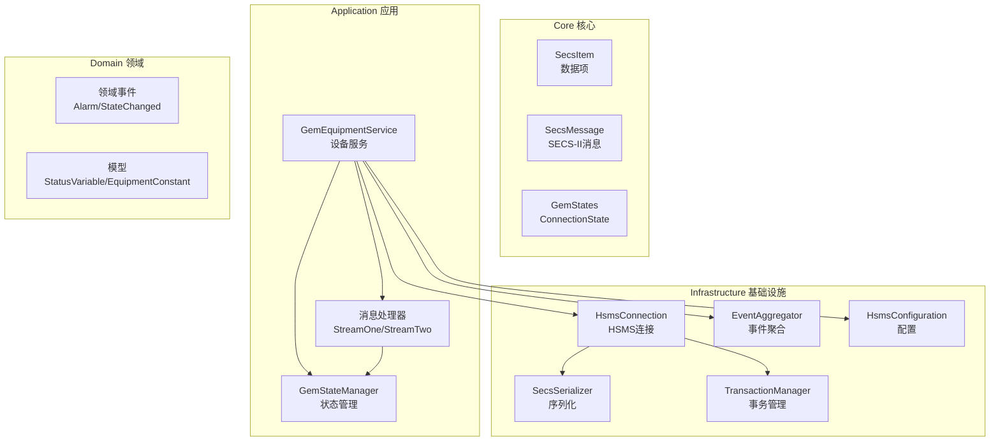
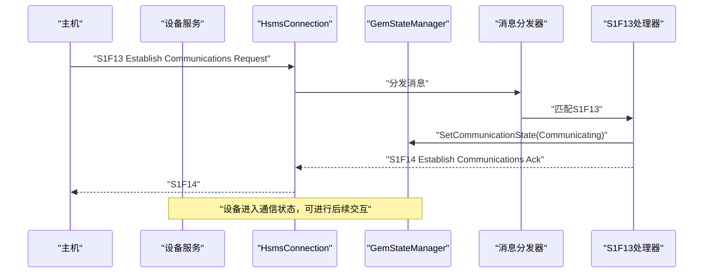
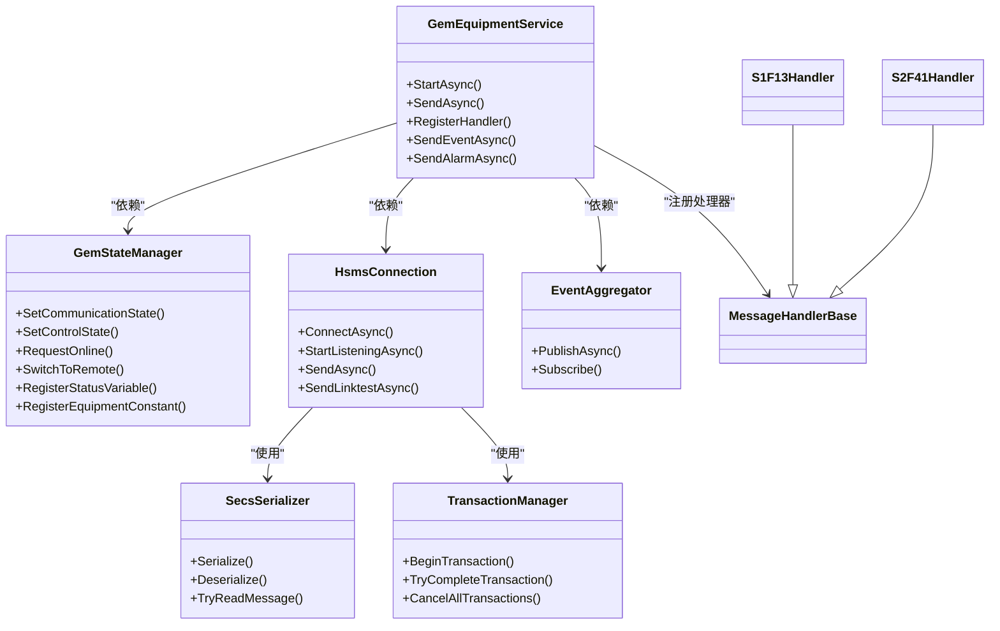

# 示例和教程

<cite>
**本文引用的文件**
- [README.md](file://README.md)
- [GEM协议规范文档.md](file://WebGem/SECS2GEM/GEM_Protocol_Specification.md)
- [SECS2GEM 类图.md](file://WebGem/SECS2GEM/SECS2GEM_Class_Diagram.md)
- [GemEquipmentService.cs](file://WebGem/SECS2GEM/Application/Services/GemEquipmentService.cs)
- [GemStateManager.cs](file://WebGem/SECS2GEM/Application/State/GemStateManager.cs)
- [StreamOneHandlers.cs](file://WebGem/SECS2GEM/Application/Handlers/StreamOneHandlers.cs)
- [StreamTwoHandlers.cs](file://WebGem/SECS2GEM/Application/Handlers/StreamTwoHandlers.cs)
- [HsmsConfiguration.cs](file://WebGem/SECS2GEM/Infrastructure/Configuration/HsmsConfiguration.cs)
- [HsmsConnection.cs](file://WebGem/SECS2GEM/Infrastructure/Connection/HsmsConnection.cs)
- [SecsSerializer.cs](file://WebGem/SECS2GEM/Infrastructure/Serialization/SecsSerializer.cs)
- [EventAggregator.cs](file://WebGem/SECS2GEM/Infrastructure/Services/EventAggregator.cs)
- [TransactionManager.cs](file://WebGem/SECS2GEM/Infrastructure/Services/TransactionManager.cs)
- [SecsItem.cs](file://WebGem/SECS2GEM/Core/Entities/SecsItem.cs)
- [SecsMessage.cs](file://WebGem/SECS2GEM/Core/Entities/SecsMessage.cs)
- [GemStates.cs](file://WebGem/SECS2GEM/Core/Enums/GemStates.cs)
- [ConnectionState.cs](file://WebGem/SECS2GEM/Core/Enums/ConnectionState.cs)
- [SECS2GEM.csproj](file://WebGem/SECS2GEM/SECS2GEM.csproj)
</cite>

## 目录
1. [简介](#简介)
2. [项目结构](#项目结构)
3. [核心组件](#核心组件)
4. [架构总览](#架构总览)
5. [详细组件分析](#详细组件分析)
6. [依赖分析](#依赖分析)
7. [性能考虑](#性能考虑)
8. [故障排除指南](#故障排除指南)
9. [结论](#结论)
10. [附录](#附录)

## 简介
本教程面向希望快速掌握 SECS2-GEM 项目的开发者，提供从基础到高级的完整学习路径。你将学会：
- 如何建立设备与主机之间的 HSMS/SECS-II 连接
- 如何解析与生成 SECS-II 消息
- 如何处理常见的设备状态查询、报警与事件上报
- 如何扩展消息处理器与状态管理器
- 如何在生产环境中部署、优化与排错

本教程配套示例均基于仓库现有代码结构，你可以直接参考对应文件路径进行实现。

## 项目结构
SECS2GEM 采用清晰的分层架构：
- Core 层：协议实体与枚举（SECS-II 数据项、消息、状态枚举）
- Infrastructure 层：连接、序列化、事务与事件聚合
- Application 层：设备服务、状态管理、消息分发与处理器
- Domain 层：领域事件与模型（状态变量、设备常量、报警等）

图表来源
- [SECS2GEM 类图.md:6-166](file://WebGem/SECS2GEM/SECS2GEM_Class_Diagram.md#L6-L166)
- [GemEquipmentService.cs:33-133](file://WebGem/SECS2GEM/Application/Services/GemEquipmentService.cs#L33-L133)
- [HsmsConnection.cs:30-139](file://WebGem/SECS2GEM/Infrastructure/Connection/HsmsConnection.cs#L30-L139)
- [SecsSerializer.cs:27-88](file://WebGem/SECS2GEM/Infrastructure/Serialization/SecsSerializer.cs#L27-L88)
- [TransactionManager.cs:24-118](file://WebGem/SECS2GEM/Infrastructure/Services/TransactionManager.cs#L24-L118)
- [EventAggregator.cs:17-106](file://WebGem/SECS2GEM/Infrastructure/Services/EventAggregator.cs#L17-L106)

章节来源
- [SECS2GEM 类图.md:630-666](file://WebGem/SECS2GEM/SECS2GEM_Class_Diagram.md#L630-L666)
- [SECS2GEM.csproj:1-10](file://WebGem/SECS2GEM/SECS2GEM.csproj#L1-L10)

## 核心组件
- 设备服务（GemEquipmentService）：外观模式封装，负责启动/停止、消息发送、事件上报、报警上报与默认处理器注册。
- 状态管理（GemStateManager）：维护通信/控制/处理三态机，提供状态变量与设备常量管理。
- 连接（HsmsConnection）：支持主动/被动模式，自动 Select、心跳与事务管理。
- 序列化（SecsSerializer）：实现 SECS-II/HSMS 的 TLV 编解码与消息读取。
- 事务（TransactionManager）：为 Primary 消息提供超时等待与响应匹配。
- 事件聚合（EventAggregator）：跨模块事件发布/订阅。
- 处理器（Handlers）：按 Stream/Function 分发消息，实现协议交互。

章节来源
- [GemEquipmentService.cs:33-133](file://WebGem/SECS2GEM/Application/Services/GemEquipmentService.cs#L33-L133)
- [GemStateManager.cs:22-107](file://WebGem/SECS2GEM/Application/State/GemStateManager.cs#L22-L107)
- [HsmsConnection.cs:30-139](file://WebGem/SECS2GEM/Infrastructure/Connection/HsmsConnection.cs#L30-L139)
- [SecsSerializer.cs:27-88](file://WebGem/SECS2GEM/Infrastructure/Serialization/SecsSerializer.cs#L27-L88)
- [TransactionManager.cs:24-118](file://WebGem/SECS2GEM/Infrastructure/Services/TransactionManager.cs#L24-L118)
- [EventAggregator.cs:17-106](file://WebGem/SECS2GEM/Infrastructure/Services/EventAggregator.cs#L17-L106)
- [StreamOneHandlers.cs:20-86](file://WebGem/SECS2GEM/Application/Handlers/StreamOneHandlers.cs#L20-L86)
- [StreamTwoHandlers.cs:13-78](file://WebGem/SECS2GEM/Application/Handlers/StreamTwoHandlers.cs#L13-L78)

## 架构总览
下图展示一次典型的消息交互流程：主机发送 S1F13 建立通信，设备侧状态机切换至 Communicating 并返回 S1F14；随后主机可查询状态、触发事件与报警上报。

图表来源
- [GemEquipmentService.cs:340-384](file://WebGem/SECS2GEM/Application/Services/GemEquipmentService.cs#L340-L384)
- [StreamOneHandlers.cs:122-148](file://WebGem/SECS2GEM/Application/Handlers/StreamOneHandlers.cs#L122-L148)
- [HsmsConnection.cs:727-742](file://WebGem/SECS2GEM/Infrastructure/Connection/HsmsConnection.cs#L727-L742)

章节来源
- [GEM协议规范文档.md:617-639](file://WebGem/SECS2GEM/GEM_Protocol_Specification.md#L617-L639)

## 详细组件分析

### 示例一：基础设备连接与状态查询
目标：演示设备如何作为 Equipment 角色被动等待连接，完成 Select 与建立通信，随后响应 S1F1 查询。

实现步骤
1) 配置被动模式（设备监听端口）
- 参考：[HsmsConfiguration.cs:204-213](file://WebGem/SECS2GEM/Infrastructure/Configuration/HsmsConfiguration.cs#L204-L213)
2) 启动设备服务（被动监听）
- 参考：[GemEquipmentService.cs:140-157](file://WebGem/SECS2GEM/Application/Services/GemEquipmentService.cs#L140-L157)
3) 等待主机发起 Select，设备返回 Select.rsp 并进入 Selected
- 参考：[HsmsConnection.cs:747-764](file://WebGem/SECS2GEM/Infrastructure/Connection/HsmsConnection.cs#L747-L764)
4) 处理 S1F1（Are You There），返回设备型号与软件版本
- 参考：[StreamOneHandlers.cs:94-114](file://WebGem/SECS2GEM/Application/Handlers/StreamOneHandlers.cs#L94-L114)

关键概念
- HSMS 会话状态：NotConnected → Connected → Selected
- W-Bit：S1F1 为 Primary（期望响应），S1F2 为 Secondary（无需响应）
- 设备在线数据：S1F2 返回 MDLN/SOFTREV

章节来源
- [ConnectionState.cs:10-41](file://WebGem/SECS2GEM/Core/Enums/ConnectionState.cs#L10-L41)
- [StreamOneHandlers.cs:94-114](file://WebGem/SECS2GEM/Application/Handlers/StreamOneHandlers.cs#L94-L114)
- [GEM协议规范文档.md:750-800](file://WebGem/SECS2GEM/GEM_Protocol_Specification.md#L750-L800)

### 示例二：消息处理与状态管理
目标：演示如何注册自定义处理器、处理 S2F13（设备常量查询）、以及通过状态管理器切换控制状态。

实现步骤
1) 注册自定义处理器（示例：S2F13 设备常量请求）
- 参考：[GemEquipmentService.cs:448-451](file://WebGem/SECS2GEM/Application/Services/GemEquipmentService.cs#L448-L451)
- 处理器实现：[StreamTwoHandlers.cs:13-78](file://WebGem/SECS2GEM/Application/Handlers/StreamTwoHandlers.cs#L13-L78)
2) 注册设备常量与状态变量
- 参考：[GemStateManager.cs:145-192](file://WebGem/SECS2GEM/Application/State/GemStateManager.cs#L145-L192)
3) 切换控制状态（例如 S1F17 请求上线）
- 参考：[StreamOneHandlers.cs:179-209](file://WebGem/SECS2GEM/Application/Handlers/StreamOneHandlers.cs#L179-L209)
- 状态机验证：[GemStateManager.cs:352-420](file://WebGem/SECS2GEM/Application/State/GemStateManager.cs#L352-L420)

关键概念
- 设备常量（EC）与状态变量（SV）：前者只读或可写，后者用于状态查询
- 控制状态：EquipmentOffline → AttemptOnline → OnlineLocal/Remote
- 处理器优先级：数值越小优先级越高

章节来源
- [GemStateManager.cs:22-107](file://WebGem/SECS2GEM/Application/State/GemStateManager.cs#L22-L107)
- [StreamTwoHandlers.cs:13-78](file://WebGem/SECS2GEM/Application/Handlers/StreamTwoHandlers.cs#L13-L78)
- [StreamOneHandlers.cs:179-209](file://WebGem/SECS2GEM/Application/Handlers/StreamOneHandlers.cs#L179-L209)

### 示例三：复杂状态管理与事件/报警上报
目标：演示设备在通信建立后，如何上报事件与报警，并通过事件聚合器通知订阅者。

实现步骤
1) 事件上报（S6F11）
- 设备服务封装：[GemEquipmentService.cs:207-245](file://WebGem/SECS2GEM/Application/Services/GemEquipmentService.cs#L207-L245)
- 事件聚合器发布：[EventAggregator.cs:24-67](file://WebGem/SECS2GEM/Infrastructure/Services/EventAggregator.cs#L24-L67)
2) 报警上报（S5F1）
- 设备服务封装：[GemEquipmentService.cs:268-317](file://WebGem/SECS2GEM/Application/Services/GemEquipmentService.cs#L268-L317)
- 事件聚合器发布：[EventAggregator.cs:24-67](file://WebGem/SECS2GEM/Infrastructure/Services/EventAggregator.cs#L24-L67)
3) 状态变化事件
- 设备服务订阅状态变化并转发：[GemEquipmentService.cs:360-398](file://WebGem/SECS2GEM/Application/Services/GemEquipmentService.cs#L360-L398)

关键概念
- 事件与报警均通过 EventAggregator 异步发布，避免阻塞消息处理
- 事件上报包含 DATAID、CEID 与报告数据结构
- 报警包含 ALCD、ALID、ALTX 等字段

章节来源
- [GemEquipmentService.cs:207-317](file://WebGem/SECS2GEM/Application/Services/GemEquipmentService.cs#L207-L317)
- [EventAggregator.cs:17-106](file://WebGem/SECS2GEM/Infrastructure/Services/EventAggregator.cs#L17-L106)
- [GEM协议规范文档.md:676-702](file://WebGem/SECS2GEM/GEM_Protocol_Specification.md#L676-L702)

### 示例四：消息编解码与事务管理
目标：深入理解 SECS-II/HSMS 的编解码过程与事务匹配机制。

实现步骤
1) 序列化/反序列化
- 编码：[SecsSerializer.cs:48-88](file://WebGem/SECS2GEM/Infrastructure/Serialization/SecsSerializer.cs#L48-L88)
- 解码：[SecsSerializer.cs:93-126](file://WebGem/SECS2GEM/Infrastructure/Serialization/SecsSerializer.cs#L93-L126)
- 数据项编码细节：[SecsSerializer.cs:248-301](file://WebGem/SECS2GEM/Infrastructure/Serialization/SecsSerializer.cs#L248-L301)
- 数据项解码细节：[SecsSerializer.cs:420-477](file://WebGem/SECS2GEM/Infrastructure/Serialization/SecsSerializer.cs#L420-L477)
2) 事务管理
- 发送消息并等待响应：[HsmsConnection.cs:427-453](file://WebGem/SECS2GEM/Infrastructure/Connection/HsmsConnection.cs#L427-L453)
- 事务创建与超时：[TransactionManager.cs:46-59](file://WebGem/SECS2GEM/Infrastructure/Services/TransactionManager.cs#L46-L59)
- 响应匹配与完成：[HsmsConnection.cs:782-786](file://WebGem/SECS2GEM/Infrastructure/Connection/HsmsConnection.cs#L782-L786)

关键概念
- SECS-II 数据项采用 TLV 结构，格式码高6位表示类型，低2位表示长度字节数
- 事务 ID（SystemBytes）用于匹配请求与响应
- 大端序（Big-Endian）用于多字节整数与长度字段

章节来源
- [SecsSerializer.cs:27-177](file://WebGem/SECS2GEM/Infrastructure/Serialization/SecsSerializer.cs#L27-L177)
- [TransactionManager.cs:24-118](file://WebGem/SECS2GEM/Infrastructure/Services/TransactionManager.cs#L24-L118)
- [HsmsConnection.cs:427-541](file://WebGem/SECS2GEM/Infrastructure/Connection/HsmsConnection.cs#L427-L541)

### 示例五：远程命令与增强命令
目标：演示如何注册并处理主机下发的远程命令（RCMD）。

实现步骤
1) 注册命令处理器
- 参考：[StreamTwoHandlers.cs:270-329](file://WebGem/SECS2GEM/Application/Handlers/StreamTwoHandlers.cs#L270-L329)
2) 发送 S2F41（Host Command Send），设备侧解析 RCMD 与参数并返回 S2F42
- 参考：[StreamTwoHandlers.cs:285-328](file://WebGem/SECS2GEM/Application/Handlers/StreamTwoHandlers.cs#L285-L328)

关键概念
- 命令参数以 CPNAME/CPVAL 形式传递
- 返回 HCACK 与 CPACK 列表指示命令执行结果

章节来源
- [StreamTwoHandlers.cs:270-329](file://WebGem/SECS2GEM/Application/Handlers/StreamTwoHandlers.cs#L270-L329)
- [GEM协议规范文档.md:731-746](file://WebGem/SECS2GEM/GEM_Protocol_Specification.md#L731-L746)

## 依赖分析
组件间的耦合与协作如下：

图表来源
- [GemEquipmentService.cs:33-133](file://WebGem/SECS2GEM/Application/Services/GemEquipmentService.cs#L33-L133)
- [GemStateManager.cs:22-107](file://WebGem/SECS2GEM/Application/State/GemStateManager.cs#L22-L107)
- [HsmsConnection.cs:30-139](file://WebGem/SECS2GEM/Infrastructure/Connection/HsmsConnection.cs#L30-L139)
- [SecsSerializer.cs:27-88](file://WebGem/SECS2GEM/Infrastructure/Serialization/SecsSerializer.cs#L27-L88)
- [TransactionManager.cs:24-118](file://WebGem/SECS2GEM/Infrastructure/Services/TransactionManager.cs#L24-L118)
- [EventAggregator.cs:17-106](file://WebGem/SECS2GEM/Infrastructure/Services/EventAggregator.cs#L17-L106)
- [StreamOneHandlers.cs:20-86](file://WebGem/SECS2GEM/Application/Handlers/StreamOneHandlers.cs#L20-L86)
- [StreamTwoHandlers.cs:270-329](file://WebGem/SECS2GEM/Application/Handlers/StreamTwoHandlers.cs#L270-L329)

章节来源
- [SECS2GEM 类图.md:148-166](file://WebGem/SECS2GEM/SECS2GEM_Class_Diagram.md#L148-L166)

## 性能考虑
- 缓冲区与消息大小
  - 接收/发送缓冲区大小与最大消息大小可在配置中调整，避免频繁分配与拷贝。
  - 参考：[HsmsConfiguration.cs:105-132](file://WebGem/SECS2GEM/Infrastructure/Configuration/HsmsConfiguration.cs#L105-L132)
- 异步与并发
  - 使用 Channel 实现发送队列，避免阻塞；接收/发送/心跳三任务并行。
  - 参考：[HsmsConnection.cs:405-418](file://WebGem/SECS2GEM/Infrastructure/Connection/HsmsConnection.cs#L405-L418)
- 序列化优化
  - 使用 Span/大端序减少装箱与内存拷贝；对不同数据类型采用分支优化。
  - 参考：[SecsSerializer.cs:248-411](file://WebGem/SECS2GEM/Infrastructure/Serialization/SecsSerializer.cs#L248-L411)
- 事务超时
  - T3/T6/T7/T8 超时参数直接影响吞吐与稳定性，建议根据网络状况调优。
  - 参考：[HsmsConfiguration.cs:39-94](file://WebGem/SECS2GEM/Infrastructure/Configuration/HsmsConfiguration.cs#L39-L94)

## 故障排除指南
常见问题与定位方法
- 连接失败
  - 确认 IP/端口与连接模式（Active/Passive）正确；检查防火墙与网络可达性。
  - 参考：[HsmsConnection.cs:146-186](file://WebGem/SECS2GEM/Infrastructure/Connection/HsmsConnection.cs#L146-L186)
- 未选择（Not Selected）
  - 未收到 Select.rsp 或 Select.rsp 超时；检查 T7 与 T6 配置。
  - 参考：[HsmsConnection.cs:278-296](file://WebGem/SECS2GEM/Infrastructure/Connection/HsmsConnection.cs#L278-L296)
- 超时异常（T3/T6）
  - Primary 消息等待 Secondary 响应超时；增大 T3 或检查对端处理能力。
  - 参考：[TransactionManager.cs:160-174](file://WebGem/SECS2GEM/Infrastructure/Services/TransactionManager.cs#L160-L174)
- 消息解析错误
  - 格式码/长度字段不合法或数据不完整；检查 SECS-II 数据项结构。
  - 参考：[SecsSerializer.cs:139-177](file://WebGem/SECS2GEM/Infrastructure/Serialization/SecsSerializer.cs#L139-L177)
- 心跳失败断开
  - 连续心跳失败超过阈值将断开连接；检查网络质量与心跳间隔。
  - 参考：[HsmsConnection.cs:693-723](file://WebGem/SECS2GEM/Infrastructure/Connection/HsmsConnection.cs#L693-L723)

章节来源
- [HsmsConnection.cs:278-296](file://WebGem/SECS2GEM/Infrastructure/Connection/HsmsConnection.cs#L278-L296)
- [TransactionManager.cs:160-174](file://WebGem/SECS2GEM/Infrastructure/Services/TransactionManager.cs#L160-L174)
- [SecsSerializer.cs:139-177](file://WebGem/SECS2GEM/Infrastructure/Serialization/SecsSerializer.cs#L139-L177)

## 结论
通过本教程，你已经掌握了 SECS2-GEM 的核心架构与关键组件，并完成了从基础连接、消息处理到复杂状态管理与事件/报警上报的完整示例。建议在实际项目中：
- 以 GemEquipmentService 为入口，结合 HsmsConfiguration 进行部署
- 通过注册自定义处理器扩展业务消息
- 使用 EventAggregator 实现模块间松耦合
- 基于 TransactionManager 与 HsmsConnection 的超时配置保障稳定性

## 附录
- 协议参考：GEM 协议规范与消息流程
  - 参考：[GEM协议规范文档.md:1-1257](file://WebGem/SECS2GEM/GEM_Protocol_Specification.md#L1-L1257)
- 类图参考：整体架构与层次依赖
  - 参考：[SECS2GEM 类图.md:1-695](file://WebGem/SECS2GEM/SECS2GEM_Class_Diagram.md#L1-L695)