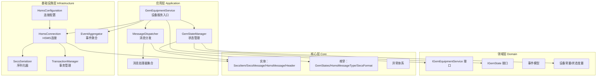
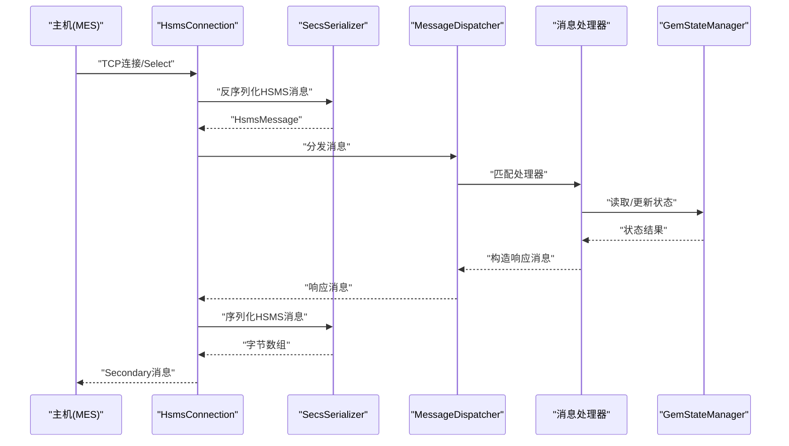
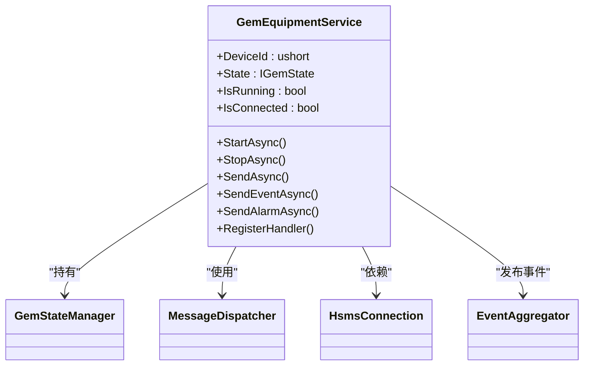
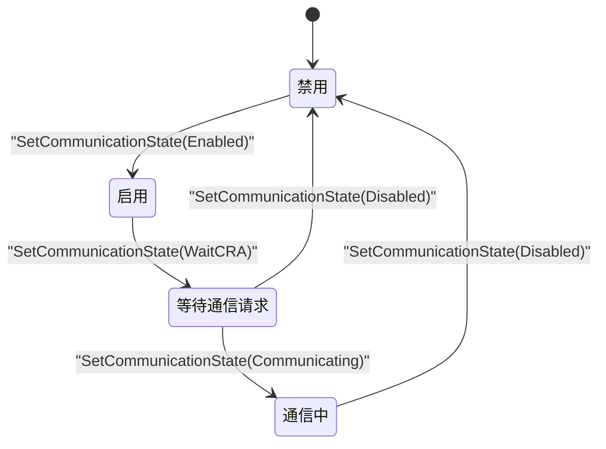
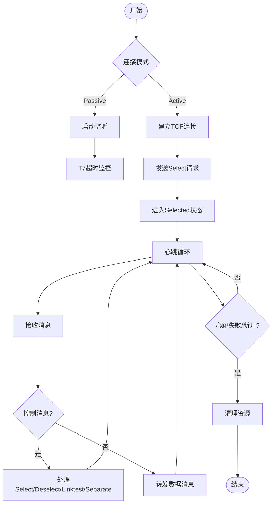
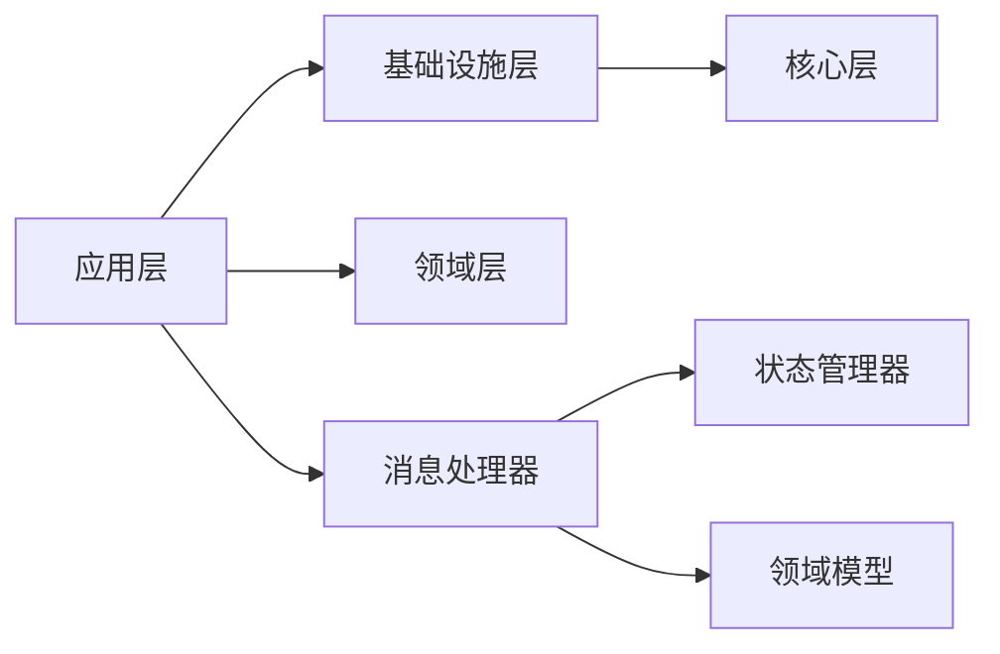

# 实际应用场景案例

<cite>
**本文引用的文件**
- [README.md](file://README.md)
- [SECS2GEM.csproj](file://WebGem/SECS2GEM/SECS2GEM.csproj)
- [GEM协议规范文档.md](file://WebGem/SECS2GEM/GEM_Protocol_Specification.md)
- [SECS2GEM 类图.md](file://WebGem/SECS2GEM/SECS2GEM_Class_Diagram.md)
- [GemEquipmentService.cs](file://WebGem/SECS2GEM/Application/Services/GemEquipmentService.cs)
- [GemStateManager.cs](file://WebGem/SECS2GEM/Application/State/GemStateManager.cs)
- [HsmsConnection.cs](file://WebGem/SECS2GEM/Infrastructure/Connection/HsmsConnection.cs)
- [HsmsConfiguration.cs](file://WebGem/SECS2GEM/Infrastructure/Configuration/HsmsConfiguration.cs)
- [AlarmInfo.cs](file://WebGem/SECS2GEM/Domain/Models/AlarmInfo.cs)
- [StreamOneHandlers.cs](file://WebGem/SECS2GEM/Application/Handlers/StreamOneHandlers.cs)
- [StreamTwoHandlers.cs](file://WebGem/SECS2GEM/Application/Handlers/StreamTwoHandlers.cs)
- [OtherStreamHandlers.cs](file://WebGem/SECS2GEM/Application/Handlers/OtherStreamHandlers.cs)
- [SecsSerializer.cs](file://WebGem/SECS2GEM/Infrastructure/Serialization/SecsSerializer.cs)
- [IntegrationTests.cs](file://WebGem/SECS2GEM.Tests/IntegrationTests.cs)
- [GemStateManagerTests.cs](file://WebGem/SECS2GEM.Tests/GemStateManagerTests.cs)
</cite>

## 目录
1. [引言](#引言)
2. [项目结构](#项目结构)
3. [核心组件](#核心组件)
4. [架构总览](#架构总览)
5. [详细组件分析](#详细组件分析)
6. [依赖关系分析](#依赖关系分析)
7. [性能考虑](#性能考虑)
8. [故障排查指南](#故障排查指南)
9. [结论](#结论)
10. [附录](#附录)

## 引言
本教程面向SECS2GEM项目在半导体制造设备、显示面板设备和太阳能电池设备中的实际应用场景，提供从配置、通信参数、状态管理到故障处理、报警管理、维护流程、多设备集群管理、设备间协调与数据同步，以及与MES、SCADA、ERP系统的集成方案。文档基于仓库中的协议规范、类图、核心实现与测试用例，确保读者能够快速落地实施。

## 项目结构
SECS2GEM采用分层架构，清晰划分应用层、领域层、基础设施层与核心层，便于扩展与维护。项目通过HSMS/TCP实现与主机（MES/SCADA）的通信，遵循SEMI E30（GEM）标准。

图表来源
- [SECS2GEM 类图.md:632-666](file://WebGem/SECS2GEM/SECS2GEM_Class_Diagram.md#L632-L666)

章节来源
- [SECS2GEM.csproj:1-10](file://WebGem/SECS2GEM/SECS2GEM.csproj#L1-L10)
- [SECS2GEM 类图.md:632-666](file://WebGem/SECS2GEM/SECS2GEM_Class_Diagram.md#L632-L666)

## 核心组件
- 设备服务入口：负责生命周期管理、消息发送、事件上报、默认处理器注册等。
- 状态管理器：封装GEM三态模型（通信/控制/处理），提供状态转换与事件发布。
- HSMS连接：实现TCP连接、Select/Deselect、Linktest、事务管理与消息收发。
- 序列化器：实现SECS-II TLV编码与HSMS消息编解码。
- 配置模块：集中管理HSMS超时、心跳、缓冲区、自动重连等参数。
- 事件与模型：报警、事件、设备常量、状态变量等。

章节来源
- [GemEquipmentService.cs:33-455](file://WebGem/SECS2GEM/Application/Services/GemEquipmentService.cs#L33-L455)
- [GemStateManager.cs:22-491](file://WebGem/SECS2GEM/Application/State/GemStateManager.cs#L22-L491)
- [HsmsConnection.cs:30-800](file://WebGem/SECS2GEM/Infrastructure/Connection/HsmsConnection.cs#L30-L800)
- [SecsSerializer.cs:27-662](file://WebGem/SECS2GEM/Infrastructure/Serialization/SecsSerializer.cs#L27-L662)
- [HsmsConfiguration.cs:15-265](file://WebGem/SECS2GEM/Infrastructure/Configuration/HsmsConfiguration.cs#L15-L265)

## 架构总览
SECS2GEM以“外观模式”对外提供统一入口，内部通过连接、序列化、事务、事件等子系统协同工作。消息路径从主机到设备，经过HSMS连接层解析为SECS-II消息，再由消息分发器路由至对应处理器，处理器读写状态管理器并生成响应。

图表来源
- [SECS2GEM 类图.md:668-695](file://WebGem/SECS2GEM/SECS2GEM_Class_Diagram.md#L668-L695)
- [HsmsConnection.cs:727-792](file://WebGem/SECS2GEM/Infrastructure/Connection/HsmsConnection.cs#L727-L792)
- [SecsSerializer.cs:93-126](file://WebGem/SECS2GEM/Infrastructure/Serialization/SecsSerializer.cs#L93-L126)

## 详细组件分析

### 设备服务（GemEquipmentService）
- 角色定位：设备侧HSMS被动/主动连接、消息分发、事件聚合、默认处理器注册。
- 生命周期：StartAsync/StopAsync，根据配置模式启动监听或发起连接。
- 通信状态联动：连接状态变化驱动GEM通信状态转换；进入Communicating后可自动上线并切换控制模式。
- 事件上报：事件报告（S6F11）、报警上报（S5F1）与事件聚合器结合，便于上层订阅。

图表来源
- [GemEquipmentService.cs:33-455](file://WebGem/SECS2GEM/Application/Services/GemEquipmentService.cs#L33-L455)
- [SECS2GEM 类图.md:9-47](file://WebGem/SECS2GEM/SECS2GEM_Class_Diagram.md#L9-L47)

章节来源
- [GemEquipmentService.cs:135-453](file://WebGem/SECS2GEM/Application/Services/GemEquipmentService.cs#L135-L453)

### 状态管理（GemStateManager）
- 三态模型：通信状态（Disabled/Enabled/WaitCRA/WaitDelay/Communicating）、控制状态（EquipmentOffline/AttemptOnline/HostOffline/OnlineLocal/OnlineRemote）、处理状态（Idle/Setup/Ready/Executing/Paused）。
- 状态转换验证：严格的转换规则保证协议合规性。
- 标准状态变量：Clock、ControlState等内置变量，支持动态值获取器。

图表来源
- [GemStateManager.cs:352-387](file://WebGem/SECS2GEM/Application/State/GemStateManager.cs#L352-L387)

章节来源
- [GemStateManager.cs:196-457](file://WebGem/SECS2GEM/Application/State/GemStateManager.cs#L196-L457)

### HSMS连接（HsmsConnection）
- 连接模式：Passive（监听）与Active（主动）两种模式，自动心跳（Linktest）与T7超时控制。
- 异步模型：接收/发送/心跳三个后台任务，Channel队列保障并发安全。
- 控制消息处理：Select/Deselect/Linktest/ Separate等控制消息的响应与状态变更。
- 事务管理：基于SystemBytes的事务跟踪，配合T3/T6超时。

图表来源
- [HsmsConnection.cs:141-725](file://WebGem/SECS2GEM/Infrastructure/Connection/HsmsConnection.cs#L141-L725)

章节来源
- [HsmsConnection.cs:141-800](file://WebGem/SECS2GEM/Infrastructure/Connection/HsmsConnection.cs#L141-L800)

### 序列化器（SecsSerializer）
- SECS-II数据项编码：格式字节+长度字节+数据，支持List/基本类型/Unicode/Binary等。
- HSMS消息编解码：消息长度字段（4字节大端序）+Header（10字节）+SECS-II数据项。
- 错误处理：不完整数据、格式错误、长度超限等异常抛出。

章节来源
- [SecsSerializer.cs:44-177](file://WebGem/SECS2GEM/Infrastructure/Serialization/SecsSerializer.cs#L44-L177)

### 配置（HsmsConfiguration）
- 网络与超时：设备ID、IP/端口、连接模式、T3-T8、T7超时、心跳间隔与最大失败次数。
- 缓冲区与自动重连：接收/发送缓冲区大小、自动重连与重连延迟。
- 验证：端口与超时参数校验。

章节来源
- [HsmsConfiguration.cs:15-265](file://WebGem/SECS2GEM/Infrastructure/Configuration/HsmsConfiguration.cs#L15-L265)

### 报警与事件模型（AlarmInfo）
- 报警信息：包含报警ID、文本、类别、是否Set/Clear、时间戳与ALCD计算。
- 报警定义：报警ID、名称、描述、类别、是否启用、关联事件ID。

章节来源
- [AlarmInfo.cs:8-81](file://WebGem/SECS2GEM/Domain/Models/AlarmInfo.cs#L8-L81)

### 消息处理器（Stream Handlers）
- Stream 1：Are You There（S1F1）、建立通信（S1F13）、请求离线（S1F15）、请求上线（S1F17）。
- Stream 2：设备常量请求/设置、常量名列表、事件报告定义/链接/启用/禁用、远程命令。
- 其他：报警启用/禁用、报警列表、事件报告请求、配方管理、终端显示等。

章节来源
- [StreamOneHandlers.cs:88-211](file://WebGem/SECS2GEM/Application/Handlers/StreamOneHandlers.cs#L88-L211)
- [StreamTwoHandlers.cs:7-331](file://WebGem/SECS2GEM/Application/Handlers/StreamTwoHandlers.cs#L7-L331)
- [OtherStreamHandlers.cs:6-276](file://WebGem/SECS2GEM/Application/Handlers/OtherStreamHandlers.cs#L6-L276)

## 依赖关系分析
- 应用层依赖基础设施层（连接、序列化、事务、事件聚合）与领域层接口。
- 基础设施层依赖核心层实体与枚举，并提供配置与异常体系。
- 消息处理器依赖状态管理器与上下文，实现协议语义。

图表来源
- [SECS2GEM 类图.md:630-666](file://WebGem/SECS2GEM/SECS2GEM_Class_Diagram.md#L630-L666)

章节来源
- [SECS2GEM 类图.md:630-666](file://WebGem/SECS2GEM/SECS2GEM_Class_Diagram.md#L630-L666)

## 性能考虑
- 异步与并发：接收/发送/心跳三任务分离，Channel队列避免阻塞；建议合理设置缓冲区大小与心跳间隔。
- 序列化优化：大消息时注意内存分配与拷贝，必要时采用池化或零拷贝策略。
- 事务与超时：T3/T6/T7合理配置，避免长时间阻塞；Linktest失败阈值控制断开时机。
- 状态变量与设备常量：批量读取/写入，减少频繁序列化开销。

## 故障排查指南
- 连接失败
  - 现象：ConnectAsync/StartListeningAsync抛出异常。
  - 排查：检查IP/端口、防火墙、T7超时、网络连通性。
  - 参考：[HsmsConnection.cs:146-186](file://WebGem/SECS2GEM/Infrastructure/Connection/HsmsConnection.cs#L146-L186)
- 未选择状态（未收到Select响应）
  - 现象：T7超时断开或Select响应超时。
  - 排查：确认主机是否发送Select请求、T6超时设置、网络延迟。
  - 参考：[HsmsConnection.cs:277-296](file://WebGem/SECS2GEM/Infrastructure/Connection/HsmsConnection.cs#L277-L296)
- 心跳失败
  - 现象：连续多次Linktest失败导致断开。
  - 排查：网络抖动、主机负载、心跳间隔设置过短。
  - 参考：[HsmsConnection.cs:693-723](file://WebGem/SECS2GEM/Infrastructure/Connection/HsmsConnection.cs#L693-L723)
- 消息解析错误
  - 现象：TryReadMessage抛出格式或长度异常。
  - 排查：检查消息长度字段、格式码、长度字节数是否正确。
  - 参考：[SecsSerializer.cs:139-177](file://WebGem/SECS2GEM/Infrastructure/Serialization/SecsSerializer.cs#L139-L177)
- 状态转换无效
  - 现象：SetCommunicationState/SetControlState返回false。
  - 排查：核对当前状态与目标状态是否满足转换规则。
  - 参考：[GemStateManager.cs:352-420](file://WebGem/SECS2GEM/Application/State/GemStateManager.cs#L352-L420)

章节来源
- [HsmsConnection.cs:277-723](file://WebGem/SECS2GEM/Infrastructure/Connection/HsmsConnection.cs#L277-L723)
- [SecsSerializer.cs:139-177](file://WebGem/SECS2GEM/Infrastructure/Serialization/SecsSerializer.cs#L139-L177)
- [GemStateManager.cs:352-420](file://WebGem/SECS2GEM/Application/State/GemStateManager.cs#L352-L420)

## 结论
SECS2GEM提供了符合SEMI E30标准的GEM实现，具备完善的HSMS通信、状态管理、消息处理与事件机制。通过合理的配置与扩展，可在半导体、显示面板与太阳能电池等工业场景中稳定运行，并与MES/SCADA/ERP系统实现高效集成。

## 附录

### 实际应用场景配置与实施要点

- 半导体制造设备
  - 场景特征：高可靠性、严格的时间同步、复杂事件与报警管理。
  - 配置要点：
    - 通信模式：推荐Passive模式，便于MES主动连接。
    - 超时参数：T3/T6/T7适中，避免频繁超时；心跳间隔建议≥30秒。
    - 自动上线：AutoOnline=true，InitialRemoteMode=true，便于MES接管。
  - 状态管理：启用标准状态变量（Clock/ControlState），按需扩展SV/EC。
  - 报警与事件：注册AlarmDefinition，启用事件报告（S6F11），与MES联动。
  - 参考：[HsmsConfiguration.cs:233-264](file://WebGem/SECS2GEM/Infrastructure/Configuration/HsmsConfiguration.cs#L233-L264)，[GemEquipmentService.cs:135-184](file://WebGem/SECS2GEM/Application/Services/GemEquipmentService.cs#L135-L184)

- 显示面板设备
  - 场景特征：产线节奏快、配方频繁切换、数据采集密集。
  - 配置要点：
    - 配方管理：启用S7F1/S7F3/S7F5/S7F17，支持配方加载/发送/请求/删除。
    - 数据采集：定义事件与报告，按需启用（S2F33/S2F35/S2F37）。
    - 性能：增大缓冲区与消息大小上限，优化序列化路径。
  - 参考：[OtherStreamHandlers.cs:116-208](file://WebGem/SECS2GEM/Application/Handlers/OtherStreamHandlers.cs#L116-L208)，[StreamTwoHandlers.cs:196-262](file://WebGem/SECS2GEM/Application/Handlers/StreamTwoHandlers.cs#L196-L262)

- 太阳能电池设备
  - 场景特征：设备相对简单、关注能耗与良率指标。
  - 配置要点：
    - 设备常量：通过S2F13/S2F15/S2F29管理EC，支持远程下发与校验。
    - 报警：启用S5F3/S5F5/S5F7，实现报警列表与启用管理。
    - 终端服务：S10F3/S10F5用于显示与提示。
  - 参考：[StreamTwoHandlers.cs:140-193](file://WebGem/SECS2GEM/Application/Handlers/StreamTwoHandlers.cs#L140-L193)，[OtherStreamHandlers.cs:29-67](file://WebGem/SECS2GEM/Application/Handlers/OtherStreamHandlers.cs#L29-L67)

### 与MES/SCADA/ERP集成
- MES（主机）
  - 连接：使用Active模式连接设备，或让设备Passive监听。
  - 协议：遵循GEM标准消息流（S1/S2/S5/S6/S7）。
  - 参考：[GEM协议规范文档.md:617-747](file://WebGem/SECS2GEM/GEM_Protocol_Specification.md#L617-L747)
- SCADA
  - 数据采集：通过事件报告（S6F11）与状态变量（SV）推送数据。
  - 远程控制：通过S2F41（远程命令）与S2F15（设备常量设置）实现。
  - 参考：[StreamTwoHandlers.cs:264-330](file://WebGem/SECS2GEM/Application/Handlers/StreamTwoHandlers.cs#L264-L330)
- ERP
  - 业务数据：通过S7F5/S7F6（配方请求/返回）与S2F13/S2F15（常量）对接。
  - 参考：[OtherStreamHandlers.cs:116-185](file://WebGem/SECS2GEM/Application/Handlers/OtherStreamHandlers.cs#L116-L185)

### 多设备集群管理、设备间协调与数据同步
- 集群部署
  - 每台设备独立运行GemEquipmentService，使用不同设备ID与端口。
  - 通过统一的配置中心或环境变量管理各设备参数。
- 设备间协调
  - 事件与报告：通过事件定义（CollectionEvent）与报告（ReportDefinition）实现跨设备数据联动。
  - 远程命令：S2F41可扩展为跨设备命令分发（需在应用层实现）。
- 数据同步
  - 使用状态变量（SV）与设备常量（EC）作为共享数据源，定期上报（S6F11）。
  - 报警信息（S5F1）统一汇聚，便于上层做全局监控。

### 现场部署经验总结
- 网络与防火墙：确保端口开放与T7超时合理设置，避免误判断开。
- 心跳与超时：根据网络质量调整LinktestInterval与T3/T6/T7，兼顾稳定性与实时性。
- 日志与监控：启用消息日志（MessageLogging），便于问题定位与审计。
- 测试验证：参考集成测试用例，覆盖Select、S1F1、S1F13、Linktest等关键流程。
  - 参考：[IntegrationTests.cs:14-194](file://WebGem/SECS2GEM.Tests/IntegrationTests.cs#L14-L194)