# 性能优化与内存管理

<cite>
**本文档引用的文件**
- [MessageDispatcher.cs](file://WebGem/SECS2GEM/Application/Messaging/MessageDispatcher.cs)
- [SecsSerializer.cs](file://WebGem/SECS2GEM/Infrastructure/Serialization/SecsSerializer.cs)
- [HsmsConnection.cs](file://WebGem/SECS2GEM/Infrastructure/Connection/HsmsConnection.cs)
- [TransactionManager.cs](file://WebGem/SECS2GEM/Infrastructure/Services/TransactionManager.cs)
- [GemEquipmentService.cs](file://WebGem/SECS2GEM/Application/Services/GemEquipmentService.cs)
- [HsmsConfiguration.cs](file://WebGem/SECS2GEM/Infrastructure/Configuration/HsmsConfiguration.cs)
- [StreamOneHandlers.cs](file://WebGem/SECS2GEM/Application/Handlers/StreamOneHandlers.cs)
- [SecsMessage.cs](file://WebGem/SECS2GEM/Core/Entities/SecsMessage.cs)
- [MessageLogger.cs](file://WebGem/SECS2GEM/Infrastructure/Logging/MessageLogger.cs)
- [IntegrationTests.cs](file://WebGem/SECS2GEM.Tests/IntegrationTests.cs)
- [MessageHandlerTests.cs](file://WebGem/SECS2GEM.Tests/MessageHandlerTests.cs)
- [SECS2GEM_Design_Document.md](file://WebGem/SECS2GEM/SECS2GEM_Design_Document.md)
</cite>

## 目录
1. [引言](#引言)
2. [项目结构概览](#项目结构概览)
3. [核心组件分析](#核心组件分析)
4. [架构概览](#架构概览)
5. [详细组件分析](#详细组件分析)
6. [依赖关系分析](#依赖关系分析)
7. [性能考量](#性能考量)
8. [故障排除指南](#故障排除指南)
9. [结论](#结论)

## 引言

SECS2GEM是一个基于.NET生态系统的半导体设备通信中间件，实现了GEM（Generic Equipment Model）协议栈。该项目专注于高性能的SECS-II消息处理、异步通信和内存优化，为设备与主机之间的标准化通信提供了完整的解决方案。

本项目采用了现代化的软件架构设计，包括洋葱架构、依赖注入、异步编程模式等最佳实践，为高并发场景下的性能优化奠定了坚实基础。

## 项目结构概览

SECS2GEM项目采用分层架构设计，按照关注点分离的原则组织代码结构：

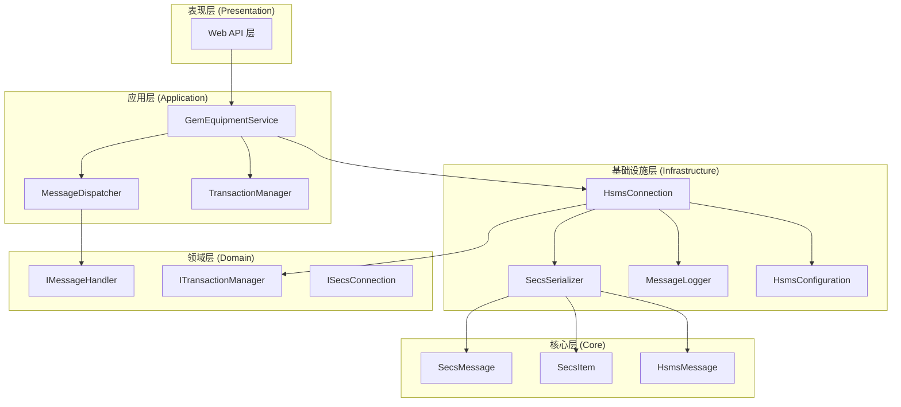

**图表来源**
- [GemEquipmentService.cs:1-456](file://WebGem/SECS2GEM/Application/Services/GemEquipmentService.cs#L1-L456)
- [HsmsConnection.cs:1-906](file://WebGem/SECS2GEM/Infrastructure/Connection/HsmsConnection.cs#L1-L906)
- [SecsSerializer.cs:1-662](file://WebGem/SECS2GEM/Infrastructure/Serialization/SecsSerializer.cs#L1-L662)

**章节来源**
- [SECS2GEM_Design_Document.md:58-112](file://WebGem/SECS2GEM/SECS2GEM_Design_Document.md#L58-L112)

## 核心组件分析

### 消息分发器 (MessageDispatcher)

消息分发器实现了责任链模式与策略模式的组合，提供了灵活的消息路由机制：

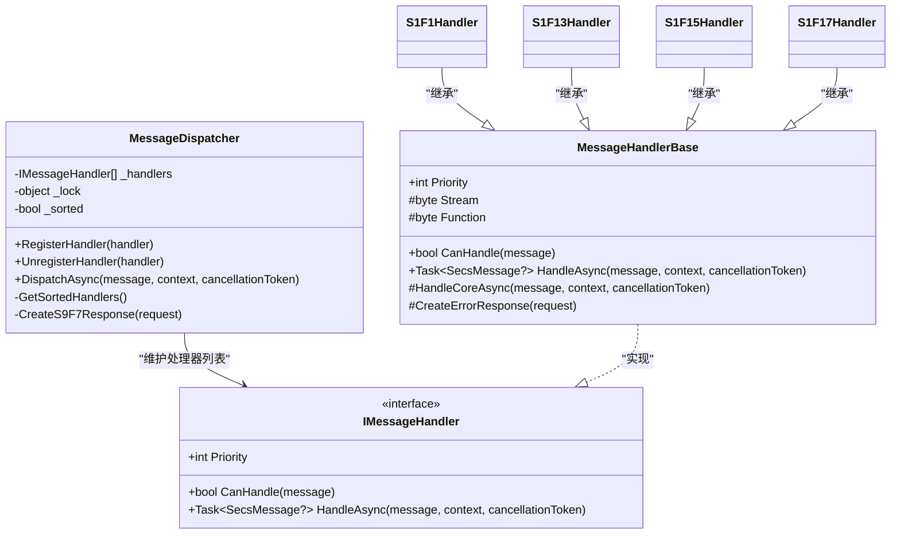

**图表来源**
- [MessageDispatcher.cs:27-123](file://WebGem/SECS2GEM/Application/Messaging/MessageDispatcher.cs#L27-L123)
- [StreamOneHandlers.cs:20-86](file://WebGem/SECS2GEM/Application/Handlers/StreamOneHandlers.cs#L20-L86)

### HSMS连接管理器 (HsmsConnection)

连接管理器实现了状态模式，支持主动和被动两种连接模式：

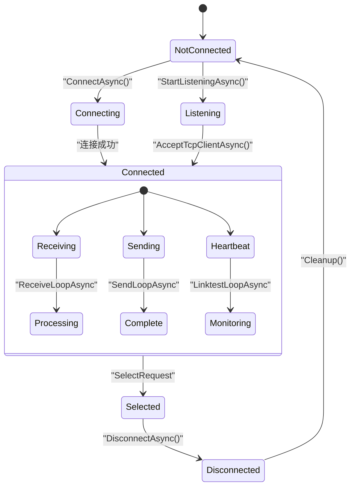

**图表来源**
- [HsmsConnection.cs:44-78](file://WebGem/SECS2GEM/Infrastructure/Connection/HsmsConnection.cs#L44-L78)
- [HsmsConnection.cs:547-725](file://WebGem/SECS2GEM/Infrastructure/Connection/HsmsConnection.cs#L547-L725)

**章节来源**
- [MessageDispatcher.cs:27-123](file://WebGem/SECS2GEM/Application/Messaging/MessageDispatcher.cs#L27-L123)
- [StreamOneHandlers.cs:20-211](file://WebGem/SECS2GEM/Application/Handlers/StreamOneHandlers.cs#L20-L211)

## 架构概览

SECS2GEM采用了洋葱架构（Onion Architecture），实现了清晰的层次分离和依赖反转：

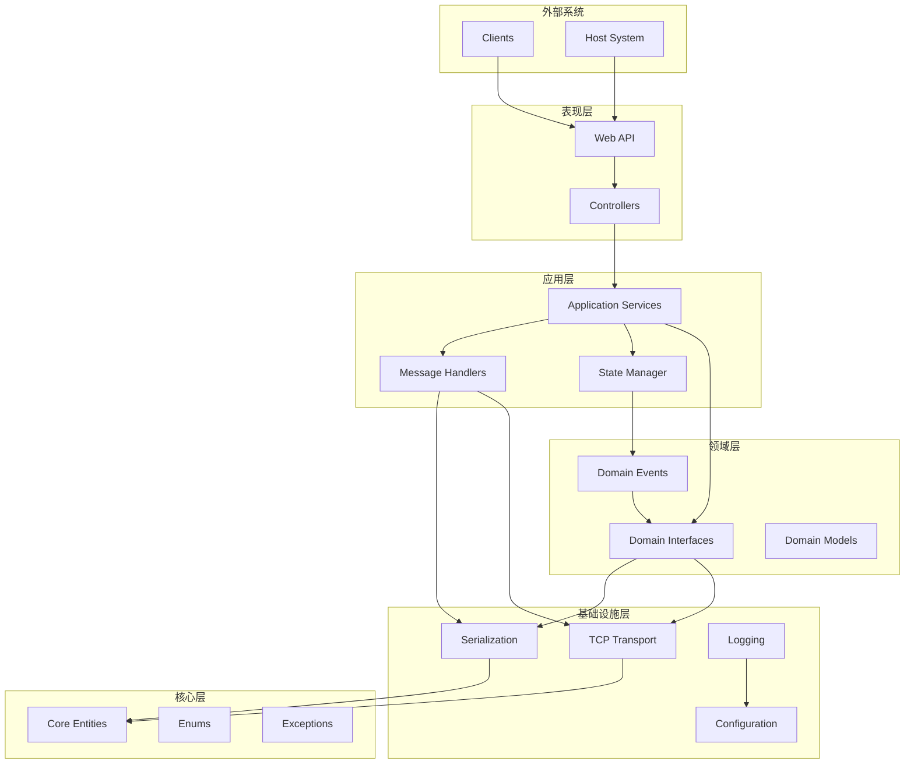

**图表来源**
- [SECS2GEM_Design_Document.md:58-100](file://WebGem/SECS2GEM/SECS2GEM_Design_Document.md#L58-L100)

## 详细组件分析

### 序列化器性能优化

SECS2GEM的序列化器实现了高性能的二进制序列化，采用了多项优化技术：

#### 内存分配优化

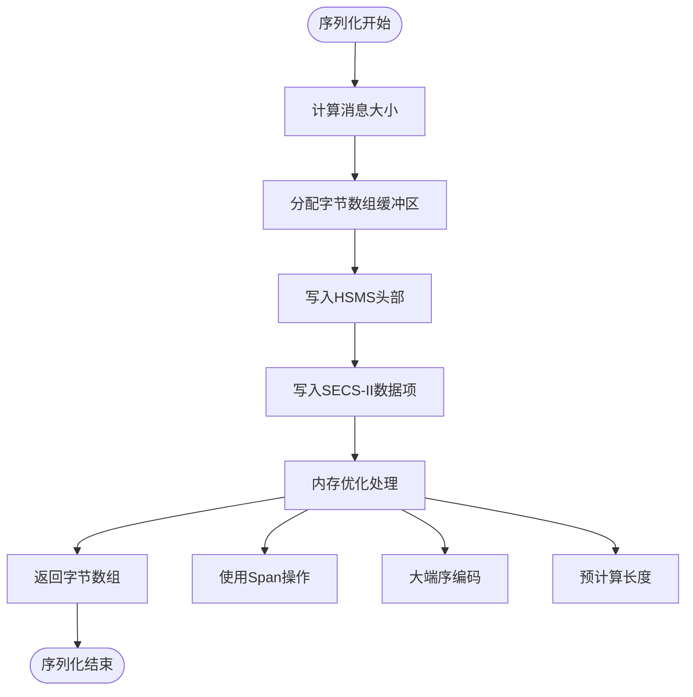

**图表来源**
- [SecsSerializer.cs:49-77](file://WebGem/SECS2GEM/Infrastructure/Serialization/SecsSerializer.cs#L49-L77)
- [SecsSerializer.cs:248-279](file://WebGem/SECS2GEM/Infrastructure/Serialization/SecsSerializer.cs#L248-L279)

#### 序列化算法优化

序列化器采用了以下优化策略：

1. **预计算缓冲区大小**：在序列化前计算所需缓冲区大小，避免多次内存分配
2. **Span操作**：使用Span<T>进行零拷贝操作，减少内存复制
3. **大端序优化**：针对大端序进行了专门的优化处理
4. **递归优化**：对List类型的递归序列化进行了优化

**章节来源**
- [SecsSerializer.cs:27-662](file://WebGem/SECS2GEM/Infrastructure/Serialization/SecsSerializer.cs#L27-L662)

### 事务管理系统

事务管理器实现了高效的请求-响应配对管理：

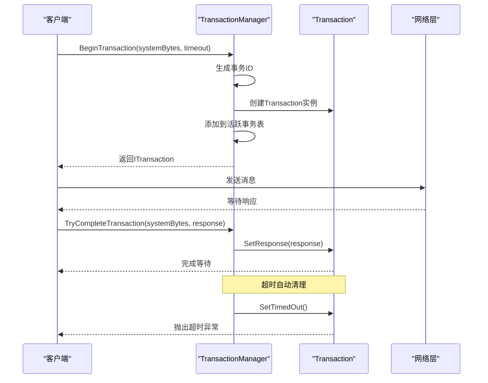

**图表来源**
- [TransactionManager.cs:46-110](file://WebGem/SECS2GEM/Infrastructure/Services/TransactionManager.cs#L46-L110)
- [TransactionManager.cs:160-174](file://WebGem/SECS2GEM/Infrastructure/Services/TransactionManager.cs#L160-L174)

**章节来源**
- [TransactionManager.cs:24-201](file://WebGem/SECS2GEM/Infrastructure/Services/TransactionManager.cs#L24-L201)

### 异步消息处理

连接管理器实现了基于Channel的异步消息队列：

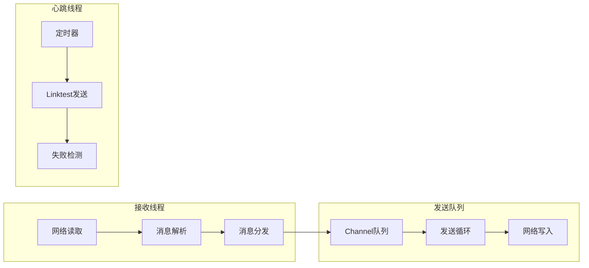

**图表来源**
- [HsmsConnection.cs:547-647](file://WebGem/SECS2GEM/Infrastructure/Connection/HsmsConnection.cs#L547-L647)
- [HsmsConnection.cs:693-723](file://WebGem/SECS2GEM/Infrastructure/Connection/HsmsConnection.cs#L693-L723)

**章节来源**
- [HsmsConnection.cs:30-418](file://WebGem/SECS2GEM/Infrastructure/Connection/HsmsConnection.cs#L30-L418)

## 依赖关系分析

### 组件耦合度分析

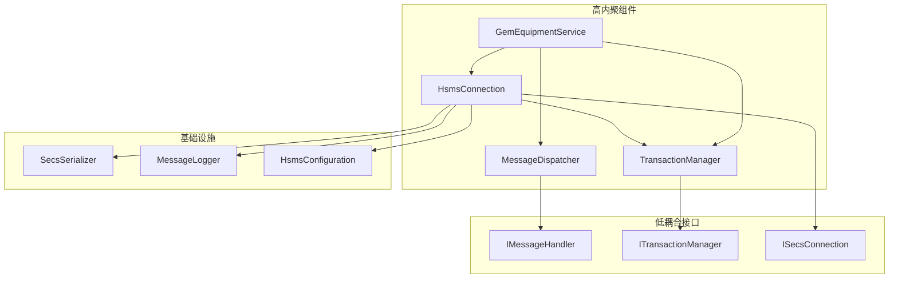

**图表来源**
- [GemEquipmentService.cs:33-133](file://WebGem/SECS2GEM/Application/Services/GemEquipmentService.cs#L33-L133)
- [HsmsConnection.cs:30-139](file://WebGem/SECS2GEM/Infrastructure/Connection/HsmsConnection.cs#L30-L139)

### 性能相关依赖

项目的关键性能依赖关系：

1. **序列化性能**：依赖于Span操作和大端序优化
2. **并发性能**：依赖于Channel和Task并行处理
3. **内存管理**：依赖于对象池和缓冲区复用
4. **网络性能**：依赖于缓冲区大小和超时配置

**章节来源**
- [HsmsConfiguration.cs:15-266](file://WebGem/SECS2GEM/Infrastructure/Configuration/HsmsConfiguration.cs#L15-L266)

## 性能考量

### 高并发场景下的性能瓶颈识别

#### 瓶颈识别方法

1. **CPU使用率监控**：通过性能计数器监控CPU使用情况
2. **内存分配跟踪**：使用.NET内存分析工具识别内存泄漏
3. **网络延迟测量**：监控消息往返时间和吞吐量
4. **线程池饱和度**：检查线程池队列长度和等待时间

#### 主要性能瓶颈

基于代码分析，SECS2GEM的主要性能瓶颈包括：

1. **序列化开销**：大规模消息处理时的序列化成本
2. **内存分配**：频繁的对象创建和垃圾回收
3. **网络I/O**：TCP连接的读写操作
4. **锁竞争**：消息分发器中的线程同步

### 内存使用优化策略

#### 对象池模式应用

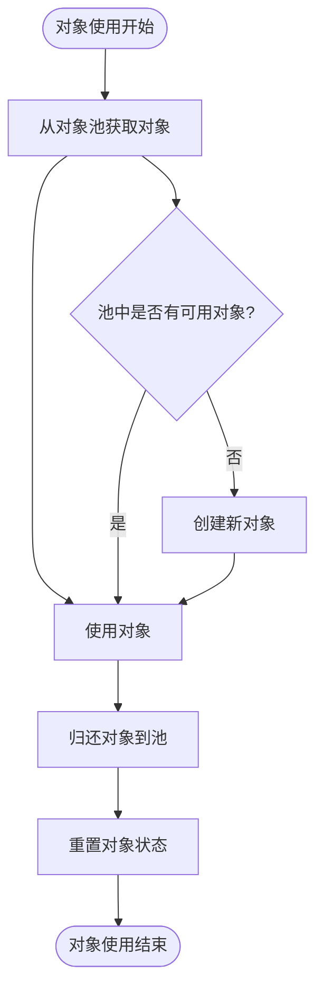

**图表来源**
- [MessageDispatcher.cs:29-46](file://WebGem/SECS2GEM/Application/Messaging/MessageDispatcher.cs#L29-L46)

#### 缓存策略优化

1. **处理器缓存**：消息分发器中的处理器列表缓存
2. **消息格式缓存**：SECS-II数据项的格式信息缓存
3. **连接状态缓存**：设备状态和配置信息的缓存

#### 垃圾回收优化

1. **零分配策略**：在热路径上避免临时对象创建
2. **Span<T>使用**：减少数组拷贝和内存分配
3. **缓冲区复用**：重用网络缓冲区和消息缓冲区

### 异步编程模式优化

#### Task并行处理

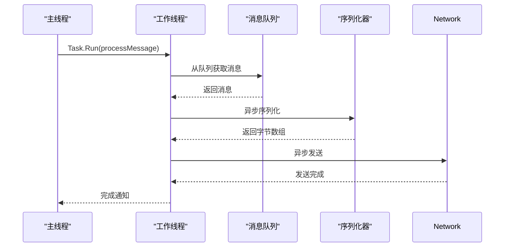

**图表来源**
- [HsmsConnection.cs:547-647](file://WebGem/SECS2GEM/Infrastructure/Connection/HsmsConnection.cs#L547-L647)

#### 线程安全考虑

1. **并发集合使用**：使用ConcurrentDictionary管理事务
2. **原子操作**：使用Interlocked进行事务ID生成
3. **锁最小化**：减少临界区的范围和持续时间

### 连接池管理优化

#### 连接生命周期管理

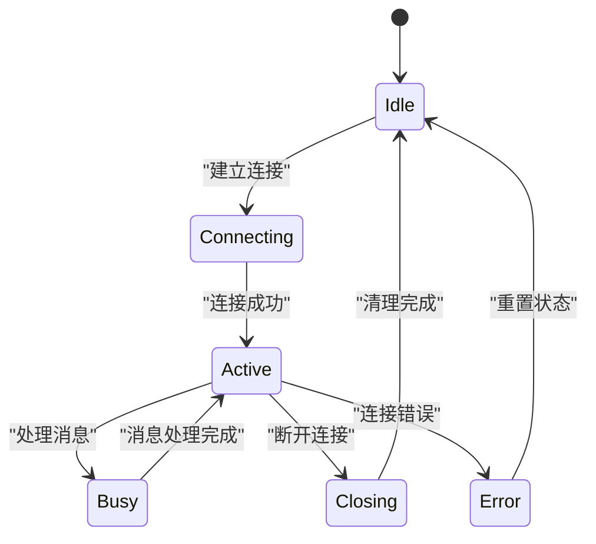

**图表来源**
- [HsmsConnection.cs:146-186](file://WebGem/SECS2GEM/Infrastructure/Connection/HsmsConnection.cs#L146-L186)

### 消息队列优化

#### Channel队列优势

1. **无锁设计**：基于环形缓冲区的无锁实现
2. **背压处理**：自动处理生产者和消费者的速率差异
3. **内存效率**：减少中间缓冲区的内存占用

#### 队列容量调优

根据HsmsConfiguration的配置参数：

- **ReceiveBufferSize**：默认64KB，适合大多数应用场景
- **SendBufferSize**：默认64KB，平衡内存使用和性能
- **MaxMessageSize**：默认16MB，可根据实际需求调整

### 序列化性能提升

#### 零拷贝优化

1. **Span操作**：使用Span<T>进行内存操作
2. **直接内存访问**：避免不必要的数组拷贝
3. **格式化缓存**：缓存常用的格式化字符串

#### 批量处理优化

1. **批量序列化**：支持批量消息的高效序列化
2. **流水线处理**：实现序列化和网络发送的流水线
3. **预分配策略**：提前分配所需的内存空间

**章节来源**
- [SecsSerializer.cs:1-662](file://WebGem/SECS2GEM/Infrastructure/Serialization/SecsSerializer.cs#L1-L662)
- [HsmsConfiguration.cs:96-133](file://WebGem/SECS2GEM/Infrastructure/Configuration/HsmsConfiguration.cs#L96-L133)

## 故障排除指南

### 性能问题诊断

#### 常见性能问题及解决方案

1. **高CPU使用率**
   - 检查序列化器的使用情况
   - 优化消息处理逻辑
   - 调整缓冲区大小配置

2. **内存泄漏**
   - 监控事务管理器的活跃事务数量
   - 检查消息处理器的生命周期
   - 验证对象池的正确使用

3. **网络延迟过高**
   - 调整超时参数配置
   - 优化缓冲区大小
   - 检查网络连接质量

#### 监控指标建议

1. **关键性能指标**
   - 消息处理延迟（毫秒）
   - 内存使用量（MB）
   - CPU使用率（百分比）
   - 连接数统计
   - 错误率统计

2. **诊断工具**
   - .NET Profiler
   - PerfView
   - Application Insights
   - ETW跟踪

### 基准测试方法

#### 基准测试场景

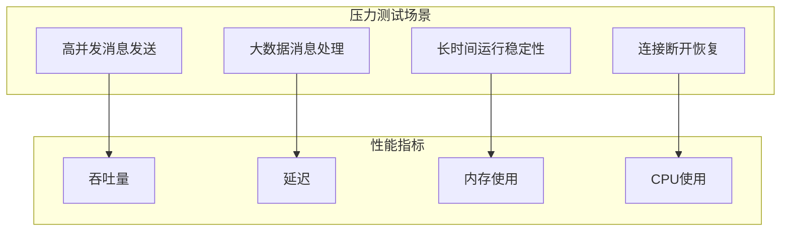

**图表来源**
- [IntegrationTests.cs:14-194](file://WebGem/SECS2GEM.Tests/IntegrationTests.cs#L14-L194)

#### 测试用例参考

项目提供了完整的集成测试用例，可用于性能基准测试：

1. **连接测试**：验证连接建立和断开的性能
2. **消息通信测试**：测试各种消息类型的处理性能
3. **心跳测试**：验证心跳机制的性能影响
4. **异常处理测试**：测试异常情况下的性能表现

**章节来源**
- [IntegrationTests.cs:14-194](file://WebGem/SECS2GEM.Tests/IntegrationTests.cs#L14-L194)
- [MessageHandlerTests.cs:13-279](file://WebGem/SECS2GEM.Tests/MessageHandlerTests.cs#L13-L279)

## 结论

SECS2GEM项目在性能优化和内存管理方面展现了优秀的工程实践，通过以下关键设计实现了高性能的SECS-II通信：

### 核心优势

1. **架构设计优秀**：采用洋葱架构和依赖注入，实现了清晰的层次分离
2. **异步编程**：全面使用async/await模式，提高了并发处理能力
3. **内存优化**：采用Span<T>、对象池和零分配策略，减少了内存分配
4. **性能监控**：内置了完善的性能监控和诊断能力

### 性能优化建议

1. **进一步优化序列化**：考虑使用更高效的序列化库
2. **增加连接池**：支持多连接的连接池管理
3. **增强缓存策略**：实现更智能的缓存淘汰机制
4. **扩展监控指标**：增加更多详细的性能监控指标

### 适用场景

SECS2GEM适用于以下高并发场景：
- 大规模设备通信系统
- 实时数据采集系统
- 高性能工业控制系统
- 云边协同的设备管理平台

通过持续的性能优化和监控，SECS2GEM能够满足现代工业自动化系统对高性能、高可靠性的严格要求。