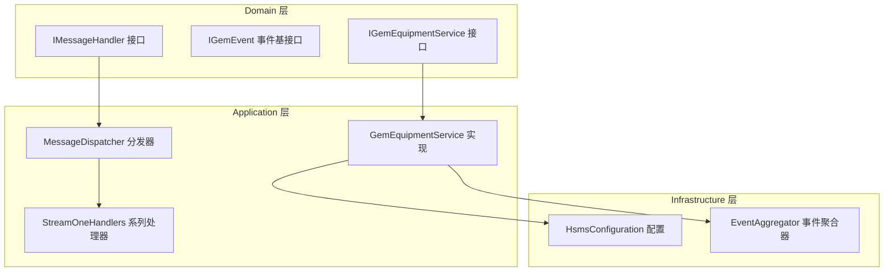
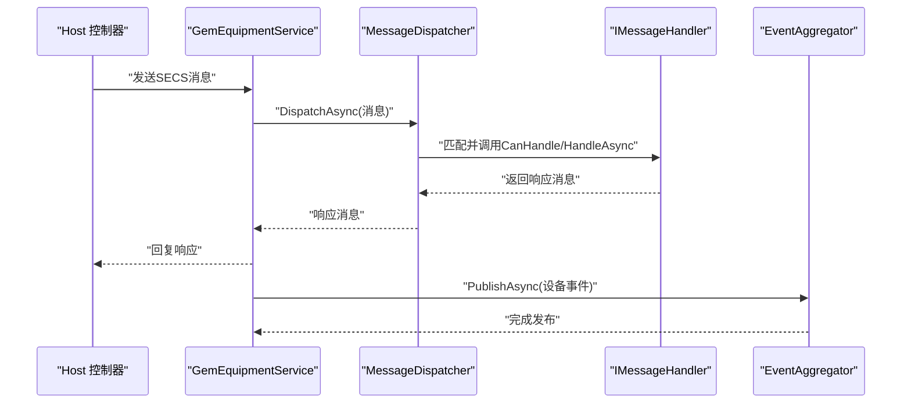
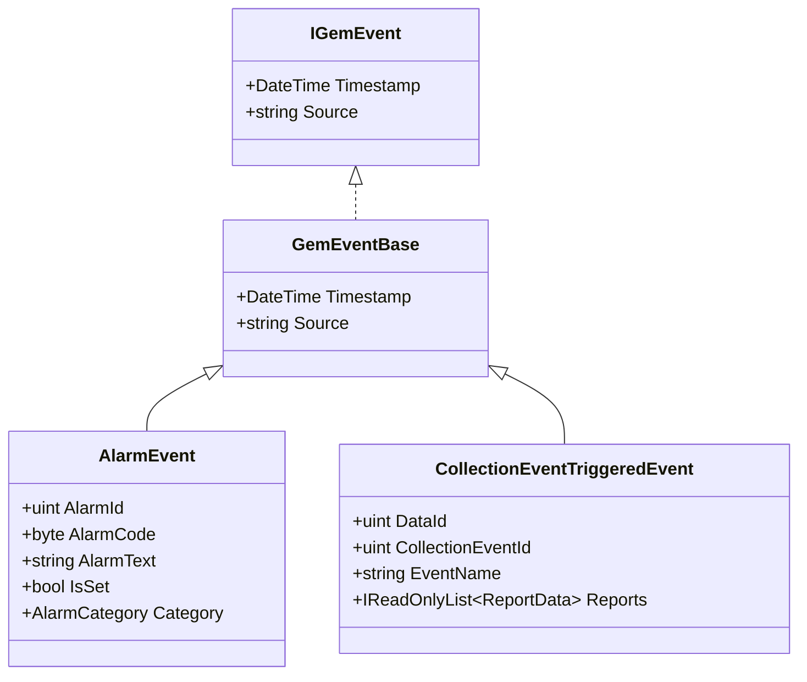
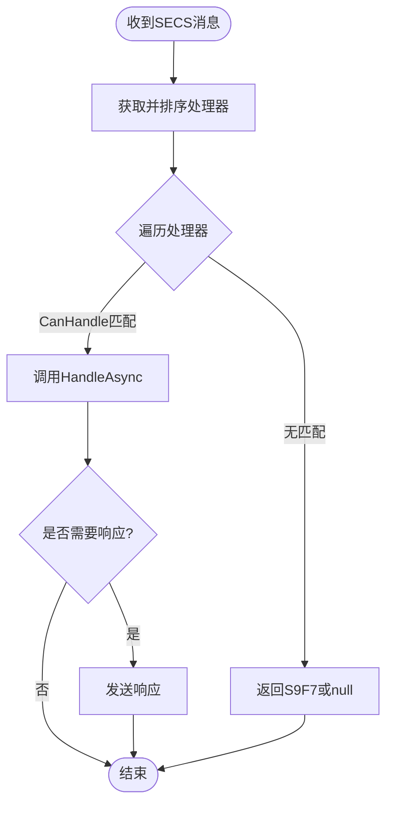
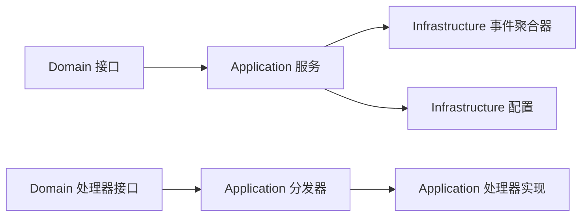

# 自定义扩展开发

<cite>
**本文档引用的文件**
- [IGemEquipmentService.cs](file://WebGem/SECS2GEM/Domain/Interfaces/IGemEquipmentService.cs)
- [GemEquipmentService.cs](file://WebGem/SECS2GEM/Application/Services/GemEquipmentService.cs)
- [IEventAggregator.cs](file://WebGem/SECS2GEM/Domain/Interfaces/IEventAggregator.cs)
- [EventAggregator.cs](file://WebGem/SECS2GEM/Infrastructure/Services/EventAggregator.cs)
- [IGemEvent.cs](file://WebGem/SECS2GEM/Domain/Events/IGemEvent.cs)
- [AlarmEvent.cs](file://WebGem/SECS2GEM/Domain/Events/AlarmEvent.cs)
- [CollectionEventTriggeredEvent.cs](file://WebGem/SECS2GEM/Domain/Events/CollectionEventTriggeredEvent.cs)
- [IMessageHandler.cs](file://WebGem/SECS2GEM/Domain/Interfaces/IMessageHandler.cs)
- [MessageDispatcher.cs](file://WebGem/SECS2GEM/Application/Messaging/MessageDispatcher.cs)
- [StreamOneHandlers.cs](file://WebGem/SECS2GEM/Application/Handlers/StreamOneHandlers.cs)
- [HsmsConfiguration.cs](file://WebGem/SECS2GEM/Infrastructure/Configuration/HsmsConfiguration.cs)
- [GemStateManagerTests.cs](file://WebGem/SECS2GEM.Tests/GemStateManagerTests.cs)
- [SECS2GEM.csproj](file://WebGem/SECS2GEM/SECS2GEM.csproj)
</cite>

## 目录
1. [简介](#简介)
2. [项目结构](#项目结构)
3. [核心组件](#核心组件)
4. [架构总览](#架构总览)
5. [详细组件分析](#详细组件分析)
6. [依赖关系分析](#依赖关系分析)
7. [性能考虑](#性能考虑)
8. [故障排查指南](#故障排查指南)
9. [结论](#结论)
10. [附录](#附录)

## 简介
本教程面向希望在SECS2GEM项目基础上进行自定义扩展开发的工程师，重点围绕以下主题展开：
- 基于IGemEquipmentService接口的扩展与实现
- 事件驱动架构的扩展：自定义事件类型、事件处理器与事件聚合器的使用
- 插件系统开发模式：接口设计、依赖注入与模块化架构
- 配置扩展、中间件开发与第三方集成最佳实践
- 扩展开发的调试技巧与测试策略

通过本教程，您将能够：
- 明确SECS2GEM的分层架构与职责边界
- 在不破坏既有行为的前提下，安全地扩展设备服务、消息处理与事件机制
- 设计可插拔的模块化扩展，并通过配置与依赖注入进行装配

## 项目结构
SECS2GEM采用清晰的分层架构：
- Domain层：定义领域接口与事件模型
- Application层：实现业务编排与消息分发
- Infrastructure层：提供基础设施能力（连接、序列化、事件聚合等）
- Tests层：单元测试与集成测试

图表来源
- [IGemEquipmentService.cs:1-160](file://WebGem/SECS2GEM/Domain/Interfaces/IGemEquipmentService.cs#L1-L160)
- [GemEquipmentService.cs:1-456](file://WebGem/SECS2GEM/Application/Services/GemEquipmentService.cs#L1-L456)
- [IMessageHandler.cs:1-131](file://WebGem/SECS2GEM/Domain/Interfaces/IMessageHandler.cs#L1-L131)
- [MessageDispatcher.cs:1-123](file://WebGem/SECS2GEM/Application/Messaging/MessageDispatcher.cs#L1-L123)
- [StreamOneHandlers.cs:1-211](file://WebGem/SECS2GEM/Application/Handlers/StreamOneHandlers.cs#L1-L211)
- [HsmsConfiguration.cs:1-266](file://WebGem/SECS2GEM/Infrastructure/Configuration/HsmsConfiguration.cs#L1-L266)
- [IEventAggregator.cs:1-67](file://WebGem/SECS2GEM/Domain/Interfaces/IEventAggregator.cs#L1-L67)
- [EventAggregator.cs:1-219](file://WebGem/SECS2GEM/Infrastructure/Services/EventAggregator.cs#L1-L219)

章节来源
- [SECS2GEM.csproj:1-10](file://WebGem/SECS2GEM/SECS2GEM.csproj#L1-L10)

## 核心组件
本节聚焦于扩展开发中最关键的几个组件及其扩展点。

- IGemEquipmentService接口
  - 定义设备服务的统一入口，涵盖生命周期、消息发送、事件报告、报警管理与事件订阅等职责
  - 扩展建议：新增自定义服务时，遵循外观模式，保持对外API稳定，内部通过组合与分发器实现复杂逻辑

- GemEquipmentService实现
  - 作为外观，整合连接、状态管理、消息分发与事件聚合
  - 内置默认消息处理器注册，支持通过RegisterHandler扩展新的消息处理能力
  - 通过事件聚合器发布设备事件，便于外部订阅

- IEventAggregator接口与EventAggregator实现
  - 提供统一的事件发布/订阅入口，支持异步与同步处理器
  - 通过类型化订阅与并发安全的数据结构，确保扩展的可靠性

- IMessageHandler接口与MessageDispatcher分发器
  - 策略模式定义消息处理契约；责任链+策略组合实现按优先级匹配处理器
  - 支持动态注册/注销处理器，便于插件化扩展

章节来源
- [IGemEquipmentService.cs:1-160](file://WebGem/SECS2GEM/Domain/Interfaces/IGemEquipmentService.cs#L1-L160)
- [GemEquipmentService.cs:1-456](file://WebGem/SECS2GEM/Application/Services/GemEquipmentService.cs#L1-L456)
- [IEventAggregator.cs:1-67](file://WebGem/SECS2GEM/Domain/Interfaces/IEventAggregator.cs#L1-L67)
- [EventAggregator.cs:1-219](file://WebGem/SECS2GEM/Infrastructure/Services/EventAggregator.cs#L1-L219)
- [IMessageHandler.cs:1-131](file://WebGem/SECS2GEM/Domain/Interfaces/IMessageHandler.cs#L1-L131)
- [MessageDispatcher.cs:1-123](file://WebGem/SECS2GEM/Application/Messaging/MessageDispatcher.cs#L1-L123)

## 架构总览
SECS2GEM采用“外观+分发器+事件聚合”的架构模式：
- 外观层（设备服务）提供统一入口
- 分发器负责消息路由到具体处理器
- 事件聚合器实现松耦合的事件通知

图表来源
- [GemEquipmentService.cs:343-358](file://WebGem/SECS2GEM/Application/Services/GemEquipmentService.cs#L343-L358)
- [MessageDispatcher.cs:67-91](file://WebGem/SECS2GEM/Application/Messaging/MessageDispatcher.cs#L67-L91)
- [IMessageHandler.cs:74-87](file://WebGem/SECS2GEM/Domain/Interfaces/IMessageHandler.cs#L74-L87)
- [EventAggregator.cs:25-45](file://WebGem/SECS2GEM/Infrastructure/Services/EventAggregator.cs#L25-L45)

## 详细组件分析

### 设备服务扩展：IGemEquipmentService
- 设计要点
  - 保持接口稳定，新增能力通过组合而非侵入式修改
  - 通过配置对象注入外部依赖（如连接、状态、分发器、事件聚合器）
  - 事件发布与订阅解耦，便于扩展监控与审计

- 扩展步骤
  1) 定义新的服务接口，继承或组合现有能力
  2) 实现服务类，构造时注入配置与必要组件
  3) 通过依赖注入容器注册服务
  4) 在设备服务中组合新服务，暴露统一API

- 注意事项
  - 生命周期管理：StartAsync/StopAsync/DisposeAsync需正确实现
  - 线程安全：事件发布与状态变更需考虑并发访问
  - 错误处理：异常隔离，避免影响主流程

章节来源
- [IGemEquipmentService.cs:25-158](file://WebGem/SECS2GEM/Domain/Interfaces/IGemEquipmentService.cs#L25-L158)
- [GemEquipmentService.cs:106-133](file://WebGem/SECS2GEM/Application/Services/GemEquipmentService.cs#L106-L133)

### 事件驱动架构扩展
- 事件模型
  - IGemEvent为所有事件的基接口，提供时间戳与来源标识
  - AlarmEvent与CollectionEventTriggeredEvent分别对应报警与事件报告场景

- 事件聚合器
  - 支持异步/同步处理器订阅
  - 并发安全：内部使用并发集合与锁保护
  - 异常隔离：单个订阅者异常不影响其他订阅者

- 扩展步骤
  1) 定义新的事件类型，继承事件基类
  2) 在设备服务中合适的位置发布事件
  3) 外部模块通过Subscribe订阅事件，实现自定义处理逻辑

图表来源
- [IGemEvent.cs:10-51](file://WebGem/SECS2GEM/Domain/Events/IGemEvent.cs#L10-L51)
- [AlarmEvent.cs:12-57](file://WebGem/SECS2GEM/Domain/Events/AlarmEvent.cs#L12-L57)
- [CollectionEventTriggeredEvent.cs:9-101](file://WebGem/SECS2GEM/Domain/Events/CollectionEventTriggeredEvent.cs#L9-L101)

章节来源
- [IEventAggregator.cs:22-65](file://WebGem/SECS2GEM/Domain/Interfaces/IEventAggregator.cs#L22-L65)
- [EventAggregator.cs:17-219](file://WebGem/SECS2GEM/Infrastructure/Services/EventAggregator.cs#L17-L219)
- [GemEquipmentService.cs:243-244](file://WebGem/SECS2GEM/Application/Services/GemEquipmentService.cs#L243-L244)

### 消息处理扩展：处理器与分发器
- 处理器接口与模板方法
  - IMessageHandler定义CanHandle与HandleAsync
  - MessageHandlerBase提供统一的异常处理与错误响应生成

- 分发器
  - 按优先级排序处理器，首个CanHandle匹配的处理器即被调用
  - 支持动态注册/注销处理器，便于插件化扩展

- 扩展步骤
  1) 新建处理器类，继承MessageHandlerBase并设置Stream/Function
  2) 实现HandleCoreAsync中的业务逻辑
  3) 在设备服务启动时或运行期通过RegisterHandler注册处理器

图表来源
- [MessageDispatcher.cs:67-91](file://WebGem/SECS2GEM/Application/Messaging/MessageDispatcher.cs#L67-L91)
- [IMessageHandler.cs:74-87](file://WebGem/SECS2GEM/Domain/Interfaces/IMessageHandler.cs#L74-L87)
- [MessageHandlerBase.cs:48-86](file://WebGem/SECS2GEM/Application/Handlers/StreamOneHandlers.cs#L48-L86)

章节来源
- [IMessageHandler.cs:63-129](file://WebGem/SECS2GEM/Domain/Interfaces/IMessageHandler.cs#L63-L129)
- [MessageDispatcher.cs:27-123](file://WebGem/SECS2GEM/Application/Messaging/MessageDispatcher.cs#L27-L123)
- [StreamOneHandlers.cs:20-86](file://WebGem/SECS2GEM/Application/Handlers/StreamOneHandlers.cs#L20-L86)

### 配置扩展与中间件开发
- 配置扩展
  - HsmsConfiguration提供HSMS连接参数、超时与心跳等配置项
  - GemConfiguration封装设备模型、初始状态与自动在线等行为
  - 扩展建议：通过配置对象注入，避免硬编码；提供验证方法确保配置有效性

- 中间件开发
  - 基于消息上下文（IMessageContext）扩展消息处理前后的行为
  - 通过分发器注册中间件类型的处理器，实现横切关注点（如鉴权、日志、限流）

章节来源
- [HsmsConfiguration.cs:15-266](file://WebGem/SECS2GEM/Infrastructure/Configuration/HsmsConfiguration.cs#L15-L266)
- [IMessageContext.cs:15-48](file://WebGem/SECS2GEM/Domain/Interfaces/IMessageHandler.cs#L15-L48)

### 第三方集成最佳实践
- 事件聚合器的订阅/发布
  - 使用泛型类型进行强类型事件传递
  - 异步处理器与同步处理器混合使用时注意性能与异常隔离
- 处理器注册
  - 通过工厂或DI容器创建处理器实例，避免直接new带来的紧耦合
- 日志与监控
  - 在处理器中记录关键事件与耗时指标，便于问题定位与性能优化

## 依赖关系分析
SECS2GEM的依赖关系体现了清晰的分层与解耦：
- 应用层依赖领域接口与基础设施能力
- 基础设施层提供通用能力（连接、序列化、事件聚合）
- 测试层验证状态机与配置等核心逻辑

图表来源
- [IGemEquipmentService.cs:1-160](file://WebGem/SECS2GEM/Domain/Interfaces/IGemEquipmentService.cs#L1-L160)
- [IMessageHandler.cs:1-131](file://WebGem/SECS2GEM/Domain/Interfaces/IMessageHandler.cs#L1-L131)
- [MessageDispatcher.cs:1-123](file://WebGem/SECS2GEM/Application/Messaging/MessageDispatcher.cs#L1-L123)
- [StreamOneHandlers.cs:1-211](file://WebGem/SECS2GEM/Application/Handlers/StreamOneHandlers.cs#L1-L211)
- [EventAggregator.cs:1-219](file://WebGem/SECS2GEM/Infrastructure/Services/EventAggregator.cs#L1-L219)
- [HsmsConfiguration.cs:1-266](file://WebGem/SECS2GEM/Infrastructure/Configuration/HsmsConfiguration.cs#L1-L266)

章节来源
- [GemStateManagerTests.cs:1-365](file://WebGem/SECS2GEM.Tests/GemStateManagerTests.cs#L1-L365)

## 性能考虑
- 处理器优先级与匹配效率
  - 合理设置处理器优先级，减少匹配轮询次数
  - 将高频处理器置于更前位置，避免不必要的CanHandle调用
- 事件聚合器并发
  - 异步发布时使用Task.WhenAll并行处理多个订阅者
  - 同步处理器建议在后台线程执行，避免阻塞消息处理
- 内存与对象池
  - 复用消息对象与事件对象，减少GC压力
- 超时与重连
  - 合理配置HSMS超时参数，避免长时间阻塞
  - 自动重连与心跳参数需结合网络环境调整

## 故障排查指南
- 常见问题定位
  - 消息无响应：检查分发器是否注册了对应处理器；确认CanHandle条件
  - 事件未到达：确认事件聚合器订阅是否成功；检查异常隔离导致的吞异常
  - 状态异常：通过状态机测试用例验证状态转换逻辑
- 调试技巧
  - 在处理器中增加关键路径日志，记录消息头与处理耗时
  - 使用事件聚合器的ClearSubscriptions/ClearAllSubscriptions清理异常订阅
  - 通过配置验证方法提前发现无效配置
- 测试策略
  - 单元测试：针对状态机与配置进行断言
  - 集成测试：模拟消息收发与事件发布，验证端到端流程
  - 回归测试：新增扩展后回归既有功能，确保兼容性

章节来源
- [EventAggregator.cs:88-106](file://WebGem/SECS2GEM/Infrastructure/Services/EventAggregator.cs#L88-L106)
- [HsmsConfiguration.cs:178-200](file://WebGem/SECS2GEM/Infrastructure/Configuration/HsmsConfiguration.cs#L178-L200)
- [GemStateManagerTests.cs:19-91](file://WebGem/SECS2GEM.Tests/GemStateManagerTests.cs#L19-L91)

## 结论
SECS2GEM提供了完善的扩展基础：稳定的设备服务接口、灵活的消息分发机制与强大的事件聚合能力。通过遵循本教程的扩展指南，您可以安全地引入自定义功能模块，构建可维护、可测试且高性能的SECS设备服务。

## 附录
- 术语表
  - 设备服务：对外提供统一设备能力的服务外观
  - 事件聚合器：实现观察者模式的事件发布/订阅机制
  - 分发器：负责将消息路由到具体处理器的责任链
  - 处理器：实现特定Stream/Function消息处理的策略对象