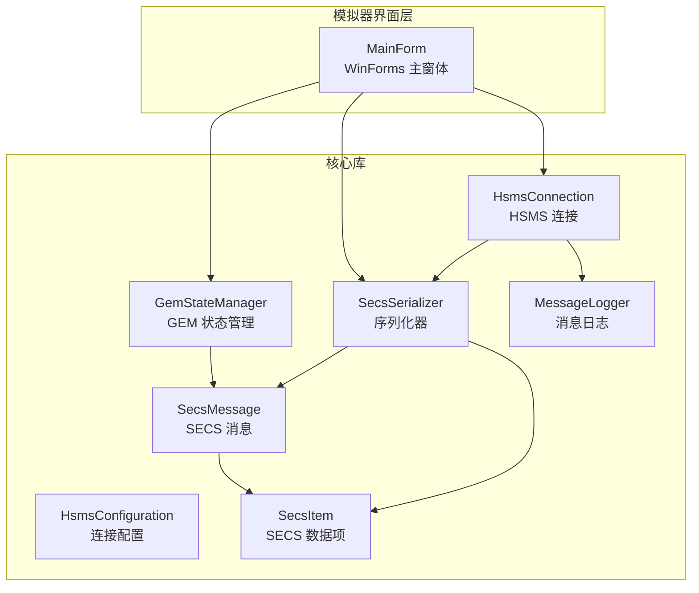
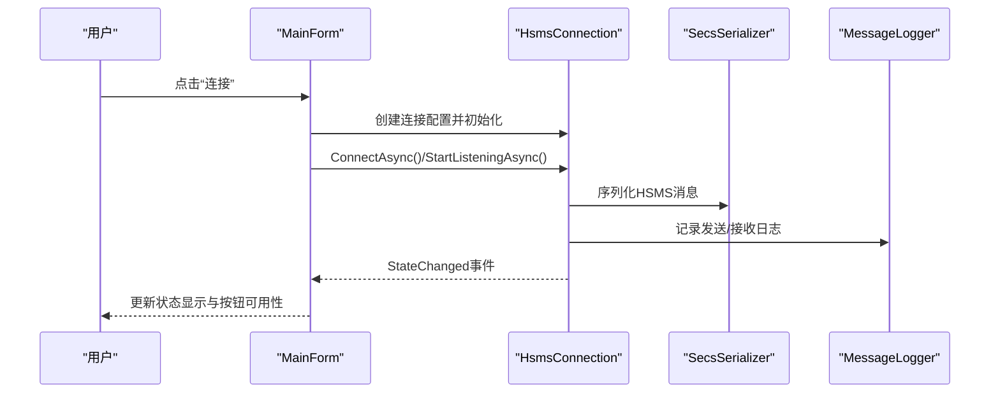
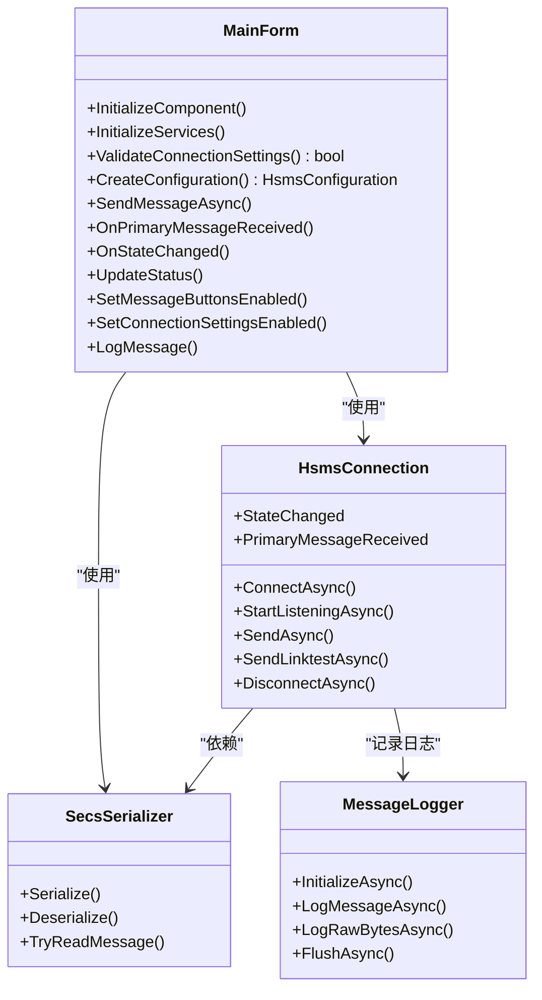
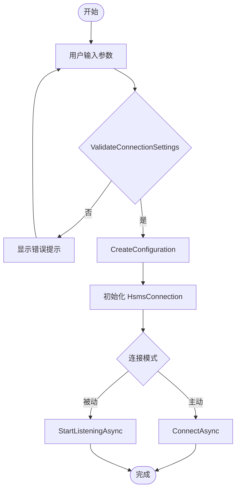
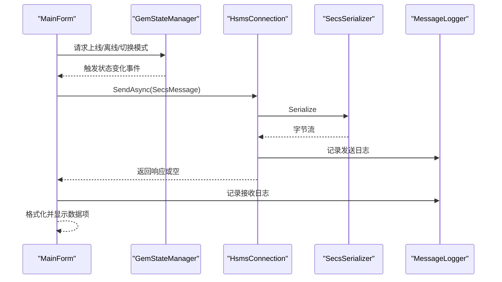
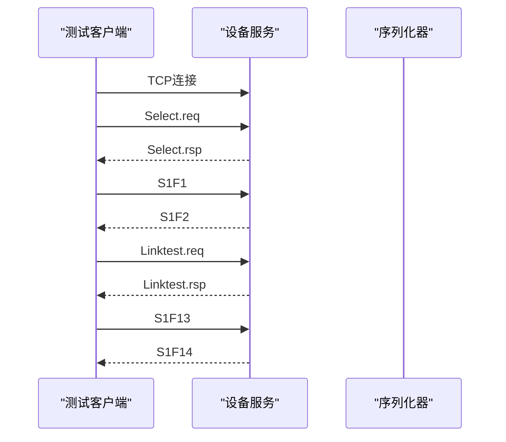
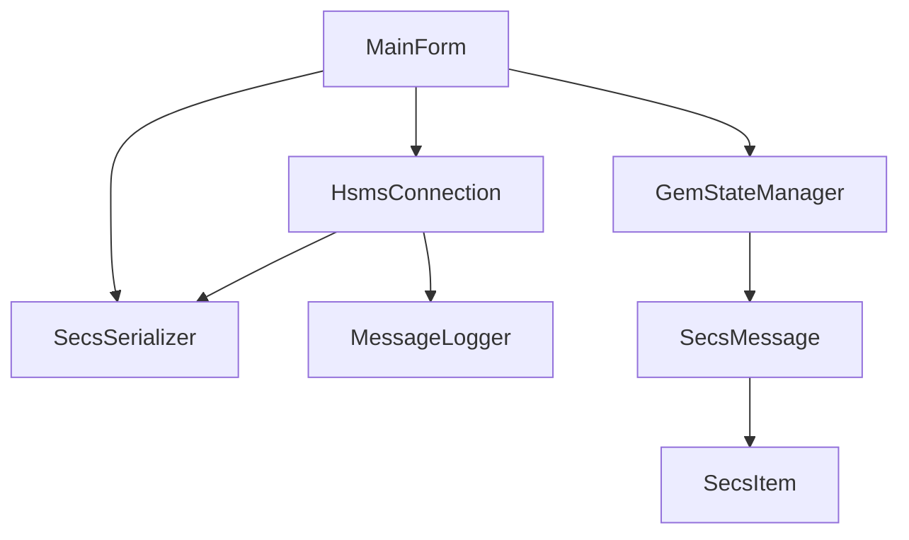

# 设备模拟器高级应用

<cite>
**本文档引用的文件**
- [MainForm.cs](file://WebGem/SECS2GEM.Simulator/MainForm.cs)
- [MainForm.Designer.cs](file://WebGem/SECS2GEM.Simulator/MainForm.Designer.cs)
- [Program.cs](file://WebGem/SECS2GEM.Simulator/Program.cs)
- [SECS2GEM.Simulator.csproj](file://WebGem/SECS2GEM.Simulator/SECS2GEM.Simulator.csproj)
- [HsmsConnection.cs](file://WebGem/SECS2GEM/Infrastructure/Connection/HsmsConnection.cs)
- [HsmsConfiguration.cs](file://WebGem/SECS2GEM/Infrastructure/Configuration/HsmsConfiguration.cs)
- [GemStateManager.cs](file://WebGem/SECS2GEM/Application/State/GemStateManager.cs)
- [SecsMessage.cs](file://WebGem/SECS2GEM/Core/Entities/SecsMessage.cs)
- [SecsItem.cs](file://WebGem/SECS2GEM/Core/Entities/SecsItem.cs)
- [SecsSerializer.cs](file://WebGem/SECS2GEM/Infrastructure/Serialization/SecsSerializer.cs)
- [MessageLogger.cs](file://WebGem/SECS2GEM/Infrastructure/Logging/MessageLogger.cs)
- [IntegrationTests.cs](file://WebGem/SECS2GEM.Tests/IntegrationTests.cs)
- [README.md](file://README.md)
</cite>

## 目录
1. [简介](#简介)
2. [项目结构](#项目结构)
3. [核心组件](#核心组件)
4. [架构总览](#架构总览)
5. [详细组件分析](#详细组件分析)
6. [依赖关系分析](#依赖关系分析)
7. [性能考虑](#性能考虑)
8. [故障排除指南](#故障排除指南)
9. [结论](#结论)
10. [附录](#附录)

## 简介
本教程面向希望深入掌握 SECS/GEM 设备模拟器的开发者与测试工程师，系统讲解基于 WinForms 的图形界面设计与实现、连接配置与参数设置、消息处理与状态模拟、扩展开发方法、调试技巧与日志分析，以及如何将模拟器集成到测试环境进行端到端验证。读者无需深厚的底层网络编程经验，即可通过循序渐进的学习掌握模拟器的高级应用。

## 项目结构
SECS2GEM 项目采用分层架构，模拟器位于独立的 WinForms 应用中，通过项目引用共享核心库。主要模块包括：
- 模拟器界面层：WinForms 主窗体，负责用户交互、控件布局与事件处理
- 连接层：HSMS 连接实现，支持主动/被动模式、心跳与超时管理
- 序列化层：SECS 消息编解码，支持多种数据格式
- 状态层：GEM 状态管理，维护通信/控制/处理三态机
- 日志层：消息日志记录，支持 HEX/SML 文件输出与轮转
- 测试层：集成测试，验证完整通信流程

**图表来源**
- [MainForm.cs:1-868](file://WebGem/SECS2GEM.Simulator/MainForm.cs#L1-L868)
- [HsmsConnection.cs:1-906](file://WebGem/SECS2GEM/Infrastructure/Connection/HsmsConnection.cs#L1-L906)
- [HsmsConfiguration.cs:1-266](file://WebGem/SECS2GEM/Infrastructure/Configuration/HsmsConfiguration.cs#L1-L266)
- [GemStateManager.cs:1-492](file://WebGem/SECS2GEM/Application/State/GemStateManager.cs#L1-L492)
- [SecsMessage.cs:1-209](file://WebGem/SECS2GEM/Core/Entities/SecsMessage.cs#L1-L209)
- [SecsItem.cs:1-480](file://WebGem/SECS2GEM/Core/Entities/SecsItem.cs#L1-L480)
- [SecsSerializer.cs:1-662](file://WebGem/SECS2GEM/Infrastructure/Serialization/SecsSerializer.cs#L1-L662)
- [MessageLogger.cs:1-438](file://WebGem/SECS2GEM/Infrastructure/Logging/MessageLogger.cs#L1-L438)

**章节来源**
- [MainForm.cs:1-868](file://WebGem/SECS2GEM.Simulator/MainForm.cs#L1-L868)
- [MainForm.Designer.cs:1-758](file://WebGem/SECS2GEM.Simulator/MainForm.Designer.cs#L1-L758)
- [Program.cs:1-19](file://WebGem/SECS2GEM.Simulator/Program.cs#L1-L19)
- [SECS2GEM.Simulator.csproj:1-15](file://WebGem/SECS2GEM.Simulator/SECS2GEM.Simulator.csproj#L1-L15)

## 核心组件
本节聚焦模拟器的关键组件及其职责与协作方式。

- WinForms 主窗体（MainForm）
  - 负责用户界面布局、事件绑定与交互反馈
  - 管理连接生命周期、消息发送与状态显示
  - 维护日志输出与 UI 线程安全更新

- HSMS 连接（HsmsConnection）
  - 支持主动/被动两种连接模式
  - 管理状态机（未连接/连接中/已连接/已选择/断开中）
  - 实现心跳、超时与消息队列的异步处理

- 连接配置（HsmsConfiguration）
  - 提供 IP、端口、设备 ID、连接模式与超时参数
  - 支持心跳间隔、缓冲区大小、消息大小限制等高级参数

- GEM 状态管理（GemStateManager）
  - 维护通信/控制/处理三态机
  - 提供状态变量与设备常量的注册与访问接口

- SECS 消息与数据项（SecsMessage、SecsItem）
  - 封装 SECS-II 协议字段与数据格式
  - 提供不可变设计与类型安全的值访问

- 序列化器（SecsSerializer）
  - 实现 HSMS/SECS 编解码，支持大端序与多种数据格式
  - 提供 TryReadMessage 以流式解析

- 消息日志（MessageLogger）
  - 异步写入 HEX/SML 日志文件，支持按日期轮转与保留策略

**章节来源**
- [MainForm.cs:1-868](file://WebGem/SECS2GEM.Simulator/MainForm.cs#L1-L868)
- [HsmsConnection.cs:1-906](file://WebGem/SECS2GEM/Infrastructure/Connection/HsmsConnection.cs#L1-L906)
- [HsmsConfiguration.cs:1-266](file://WebGem/SECS2GEM/Infrastructure/Configuration/HsmsConfiguration.cs#L1-L266)
- [GemStateManager.cs:1-492](file://WebGem/SECS2GEM/Application/State/GemStateManager.cs#L1-L492)
- [SecsMessage.cs:1-209](file://WebGem/SECS2GEM/Core/Entities/SecsMessage.cs#L1-L209)
- [SecsItem.cs:1-480](file://WebGem/SECS2GEM/Core/Entities/SecsItem.cs#L1-L480)
- [SecsSerializer.cs:1-662](file://WebGem/SECS2GEM/Infrastructure/Serialization/SecsSerializer.cs#L1-L662)
- [MessageLogger.cs:1-438](file://WebGem/SECS2GEM/Infrastructure/Logging/MessageLogger.cs#L1-L438)

## 架构总览
下图展示模拟器从界面层到核心库的调用关系与数据流向：

**图表来源**
- [MainForm.cs:51-101](file://WebGem/SECS2GEM.Simulator/MainForm.cs#L51-L101)
- [HsmsConnection.cs:146-186](file://WebGem/SECS2GEM/Infrastructure/Connection/HsmsConnection.cs#L146-L186)
- [SecsSerializer.cs:49-77](file://WebGem/SECS2GEM/Infrastructure/Serialization/SecsSerializer.cs#L49-L77)
- [MessageLogger.cs:99-114](file://WebGem/SECS2GEM/Infrastructure/Logging/MessageLogger.cs#L99-L114)

## 详细组件分析

### WinForms 界面设计与实现
- 布局结构
  - 主面板采用 TableLayoutPanel 分为上下两部分：顶部为连接与消息组，底部为日志区域
  - 连接组包含 IP/端口/设备 ID/模式/超时参数与状态显示
  - 消息组按 Stream 划分（S1/S2/其他），每个按钮对应一个标准消息
  - 日志组使用 RichTextBox 输出 HEX/SML，并提供清空日志按钮

- 控件布局要点
  - 使用 GroupBox 对功能相近的控件进行分组，提升可读性
  - 文本框与标签采用一致的尺寸与间距，保证视觉统一
  - 状态栏实时显示连接状态，便于用户感知

- 事件处理机制
  - 连接/断开：ValidateConnectionSettings → CreateConfiguration → 初始化连接 → 订阅事件 → 更新 UI
  - 消息发送：构建 SecsMessage → 序列化 → 发送 → 记录日志 → 处理响应
  - 状态变更：根据 ConnectionState 更新颜色与按钮可用性
  - 日志记录：Invoke 确保 UI 线程安全更新

- 用户交互优化
  - 在连接/断开过程中禁用相关按钮，防止并发操作
  - 对输入参数进行即时校验，提示错误信息
  - 格式化输出 SECS 数据项，便于调试与分析

**图表来源**
- [MainForm.cs:29-800](file://WebGem/SECS2GEM.Simulator/MainForm.cs#L29-L800)
- [HsmsConnection.cs:30-800](file://WebGem/SECS2GEM/Infrastructure/Connection/HsmsConnection.cs#L30-L800)
- [SecsSerializer.cs:27-662](file://WebGem/SECS2GEM/Infrastructure/Serialization/SecsSerializer.cs#L27-L662)
- [MessageLogger.cs:23-438](file://WebGem/SECS2GEM/Infrastructure/Logging/MessageLogger.cs#L23-L438)

**章节来源**
- [MainForm.Designer.cs:29-758](file://WebGem/SECS2GEM.Simulator/MainForm.Designer.cs#L29-L758)
- [MainForm.cs:29-800](file://WebGem/SECS2GEM.Simulator/MainForm.cs#L29-L800)

### 连接配置与参数设置
- 连接参数
  - IP 地址与端口：支持本地回环与外部网络
  - 设备 ID（Session ID）：用于会话标识
  - 连接模式：主动（Active）或被动（Passive）
  - 超时参数：T3/T5/T6/T7/T8，分别对应回复超时、分离超时、控制事务超时、未选择超时、字符间隔超时
  - 心跳参数：心跳间隔与最大失败次数
  - 缓冲区与消息大小：接收/发送缓冲区大小与最大消息大小
  - 自动重连：可配置重连延迟策略

- 配置验证
  - 端口范围校验（1-65535）
  - 超时参数必须大于 0
  - 模式与地址合法性检查

- 配置应用流程
  - 用户在界面输入参数
  - ValidateConnectionSettings 校验
  - CreateConfiguration 构造 HsmsConfiguration
  - HsmsConnection 接收配置并初始化网络与任务

**图表来源**
- [MainForm.cs:150-194](file://WebGem/SECS2GEM.Simulator/MainForm.cs#L150-L194)
- [HsmsConfiguration.cs:178-228](file://WebGem/SECS2GEM/Infrastructure/Configuration/HsmsConfiguration.cs#L178-L228)

**章节来源**
- [MainForm.cs:150-194](file://WebGem/SECS2GEM.Simulator/MainForm.cs#L150-L194)
- [HsmsConfiguration.cs:15-266](file://WebGem/SECS2GEM/Infrastructure/Configuration/HsmsConfiguration.cs#L15-L266)

### 消息处理与状态模拟
- 消息发送流程
  - 构建 SecsMessage（Stream/Function/WBit/数据项）
  - 通过 SecsSerializer 序列化为 HSMS 消息
  - 通过 HsmsConnection.SendAsync 发送并等待响应（若需要）
  - 记录发送/接收日志，格式化数据项输出

- 状态模拟
  - GEM 状态管理器维护通信/控制/处理三态机
  - 提供状态变量与设备常量注册接口
  - 通过事件通知状态变化，驱动 UI 更新

- 数据项格式化
  - 支持 ASCII/JIS8/Unicode/Binary/Boolean/I1/U1/F4 等格式
  - 提供 SML 格式化输出，便于阅读与调试

**图表来源**
- [MainForm.cs:519-552](file://WebGem/SECS2GEM.Simulator/MainForm.cs#L519-L552)
- [GemStateManager.cs:228-348](file://WebGem/SECS2GEM/Application/State/GemStateManager.cs#L228-L348)
- [SecsSerializer.cs:49-77](file://WebGem/SECS2GEM/Infrastructure/Serialization/SecsSerializer.cs#L49-L77)
- [MessageLogger.cs:99-114](file://WebGem/SECS2GEM/Infrastructure/Logging/MessageLogger.cs#L99-L114)

**章节来源**
- [MainForm.cs:519-552](file://WebGem/SECS2GEM.Simulator/MainForm.cs#L519-L552)
- [GemStateManager.cs:22-492](file://WebGem/SECS2GEM/Application/State/GemStateManager.cs#L22-L492)
- [SecsMessage.cs:18-139](file://WebGem/SECS2GEM/Core/Entities/SecsMessage.cs#L18-L139)
- [SecsItem.cs:23-479](file://WebGem/SECS2GEM/Core/Entities/SecsItem.cs#L23-L479)

### 扩展开发指南
- 自定义设备类型
  - 通过继承或组合扩展 GEM 状态管理器，新增状态变量与设备常量
  - 在应用层注入自定义状态对象，影响消息处理逻辑

- 自定义模拟算法
  - 在消息处理回调中实现业务逻辑，如状态变量动态计算、设备常量校验
  - 通过事件聚合器（EventAggregator）发布领域事件，供其他组件订阅

- 可视化组件扩展
  - 在主窗体中增加新的控件组，映射到新的消息族
  - 使用自定义控件封装复杂交互，保持界面整洁

- 新增消息族支持
  - 在消息构建处添加新的工厂方法或按钮事件
  - 在序列化器中确保数据项格式正确，避免解析异常

- 配置扩展
  - 在 HsmsConfiguration 中新增参数，提供默认值与验证
  - 在 UI 中添加对应控件，绑定到配置对象

**章节来源**
- [GemStateManager.cs:109-194](file://WebGem/SECS2GEM/Application/State/GemStateManager.cs#L109-L194)
- [SecsItem.cs:69-268](file://WebGem/SECS2GEM/Core/Entities/SecsItem.cs#L69-L268)
- [MainForm.Designer.cs:49-758](file://WebGem/SECS2GEM.Simulator/MainForm.Designer.cs#L49-L758)

### 调试技巧、日志分析与性能监控
- 调试技巧
  - 使用 Invoke 确保 UI 线程安全更新
  - 在事件处理中捕获异常并恢复 UI 状态
  - 对布尔数据项输出原始字节，辅助排查格式问题

- 日志分析
  - HEX 日志：查看原始字节流，定位协议问题
  - SML 日志：查看结构化消息，便于理解数据项
  - 按日期轮转与保留策略，避免日志过大

- 性能监控
  - 监控心跳失败次数与断开原因
  - 调整缓冲区大小与消息大小限制，平衡内存与吞吐
  - 使用异步 I/O 与通道队列，避免阻塞主线程

**章节来源**
- [MainForm.cs:669-725](file://WebGem/SECS2GEM.Simulator/MainForm.cs#L669-L725)
- [MessageLogger.cs:176-223](file://WebGem/SECS2GEM/Infrastructure/Logging/MessageLogger.cs#L176-L223)
- [HsmsConnection.cs:405-418](file://WebGem/SECS2GEM/Infrastructure/Connection/HsmsConnection.cs#L405-L418)

### 集成测试与端到端验证
- 测试策略
  - 使用集成测试验证完整通信流程：连接、选择、心跳、消息收发
  - 通过 TCP 客户端模拟主机，与设备服务进行双向通信
  - 验证响应消息的正确性与数据项格式

- 关键测试点
  - 设备接受连接与选择请求
  - S1F1（Are You There）与 S1F13（Establish Communications）响应
  - Linktest 心跳响应
  - 消息序列化/反序列化的完整性

**图表来源**
- [IntegrationTests.cs:53-168](file://WebGem/SECS2GEM.Tests/IntegrationTests.cs#L53-L168)
- [SecsSerializer.cs:93-126](file://WebGem/SECS2GEM/Infrastructure/Serialization/SecsSerializer.cs#L93-L126)

**章节来源**
- [IntegrationTests.cs:14-194](file://WebGem/SECS2GEM.Tests/IntegrationTests.cs#L14-L194)

## 依赖关系分析
- 组件耦合
  - MainForm 与 HsmsConnection 通过接口与事件解耦
  - 序列化器与连接器松耦合，便于替换实现
  - 状态管理器与消息实体通过接口交互，支持扩展

- 外部依赖
  - .NET 9.0（Windows Forms）
  - System.Net.Sockets（网络通信）
  - System.Text.Encoding（编码转换）

**图表来源**
- [MainForm.cs:1-868](file://WebGem/SECS2GEM.Simulator/MainForm.cs#L1-L868)
- [HsmsConnection.cs:1-906](file://WebGem/SECS2GEM/Infrastructure/Connection/HsmsConnection.cs#L1-L906)
- [SecsSerializer.cs:1-662](file://WebGem/SECS2GEM/Infrastructure/Serialization/SecsSerializer.cs#L1-L662)
- [MessageLogger.cs:1-438](file://WebGem/SECS2GEM/Infrastructure/Logging/MessageLogger.cs#L1-L438)

**章节来源**
- [SECS2GEM.Simulator.csproj:11-12](file://WebGem/SECS2GEM.Simulator/SECS2GEM.Simulator.csproj#L11-L12)

## 性能考虑
- 异步 I/O 与通道队列
  - 使用 Channel 实现发送队列，避免阻塞
  - 接收/发送/心跳任务分离，提高并发能力

- 缓冲区与消息大小
  - 合理设置接收/发送缓冲区大小，避免频繁分配
  - 限制最大消息大小，防止内存占用过高

- 心跳与超时
  - 合理配置心跳间隔与失败阈值，平衡可靠性与性能
  - T3/T6/T7 超时参数影响响应时间与资源占用

- 日志写入
  - 异步写入与批量刷新，降低 IO 压力
  - 按日期轮转与文件大小限制，避免磁盘压力

[本节为通用指导，无需特定文件引用]

## 故障排除指南
- 连接失败
  - 检查 IP/端口与防火墙设置
  - 验证设备 ID 与模式配置
  - 查看日志中的 HEX/SML 以定位问题

- 消息未响应
  - 确认是否期望回复（W-Bit）
  - 检查 T3/T6 超时设置
  - 验证消息格式与数据项长度

- UI 卡顿
  - 确保事件处理中使用 Invoke
  - 避免在 UI 线程中执行耗时操作

- 心跳断开
  - 调整心跳间隔与失败阈值
  - 检查网络稳定性与服务器负载

**章节来源**
- [MainForm.cs:90-100](file://WebGem/SECS2GEM.Simulator/MainForm.cs#L90-L100)
- [HsmsConnection.cs:280-296](file://WebGem/SECS2GEM/Infrastructure/Connection/HsmsConnection.cs#L280-L296)
- [MessageLogger.cs:176-223](file://WebGem/SECS2GEM/Infrastructure/Logging/MessageLogger.cs#L176-L223)

## 结论
SECS2GEM 设备模拟器通过清晰的分层架构与完善的 WinForms 界面，提供了强大的 HSMS/SECS-II 通信测试能力。通过对连接配置、消息处理、状态模拟与日志记录的深入理解，开发者可以快速扩展模拟器功能，满足复杂的测试需求。结合集成测试与调试技巧，能够高效完成端到端验证，确保系统稳定可靠。

## 附录
- 快速开始
  - 运行模拟器，配置连接参数
  - 选择连接模式并点击“连接”
  - 在各消息组中发送标准消息进行验证
  - 查看日志窗口分析通信细节

- 常用快捷键
  - Ctrl+R：刷新状态
  - F5：重新连接
  - Esc：取消当前操作

- 版本信息
  - .NET 版本：9.0（Windows）
  - 目标框架：net9.0-windows

**章节来源**
- [Program.cs:11-18](file://WebGem/SECS2GEM.Simulator/Program.cs#L11-L18)
- [README.md:1-1](file://README.md#L1-L1)