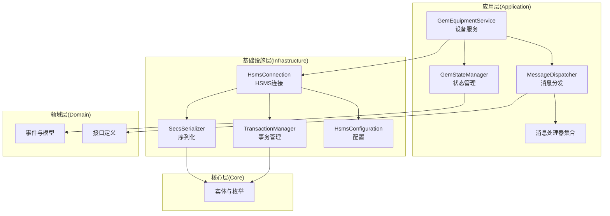
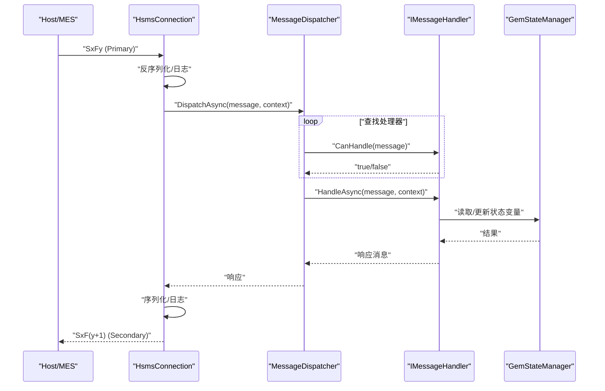
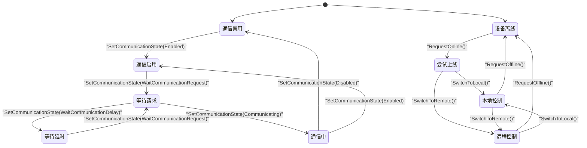
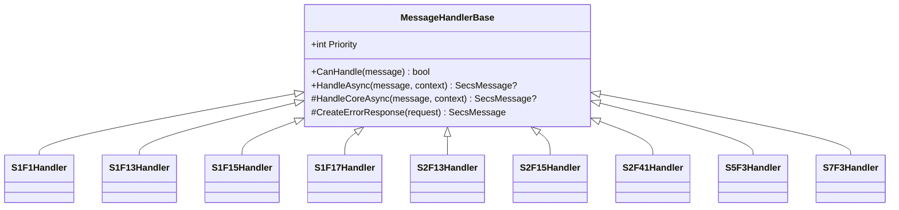
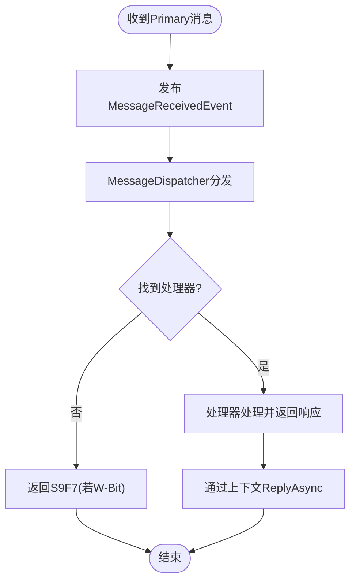
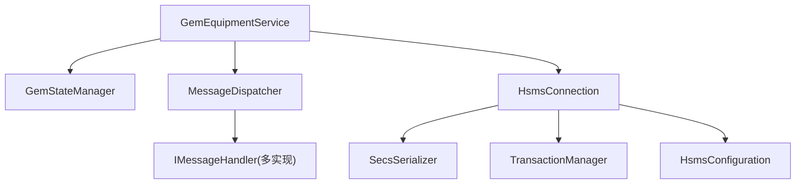

# 进阶教程

<cite>
**本文引用的文件**
- [SECS2GEM.csproj](file://WebGem/SECS2GEM/SECS2GEM.csproj)
- [GEM协议规范文档.md](file://WebGem/SECS2GEM/GEM_Protocol_Specification.md)
- [SECS2GEM 类图.md](file://WebGem/SECS2GEM/SECS2GEM_Class_Diagram.md)
- [GemEquipmentService.cs](file://WebGem/SECS2GEM/Application/Services/GemEquipmentService.cs)
- [GemStateManager.cs](file://WebGem/SECS2GEM/Application/State/GemStateManager.cs)
- [MessageDispatcher.cs](file://WebGem/SECS2GEM/Application/Messaging/MessageDispatcher.cs)
- [StreamOneHandlers.cs](file://WebGem/SECS2GEM/Application/Handlers/StreamOneHandlers.cs)
- [StreamTwoHandlers.cs](file://WebGem/SECS2GEM/Application/Handlers/StreamTwoHandlers.cs)
- [OtherStreamHandlers.cs](file://WebGem/SECS2GEM/Application/Handlers/OtherStreamHandlers.cs)
- [HsmsConnection.cs](file://WebGem/SECS2GEM/Infrastructure/Connection/HsmsConnection.cs)
- [SecsSerializer.cs](file://WebGem/SECS2GEM/Infrastructure/Serialization/SecsSerializer.cs)
- [TransactionManager.cs](file://WebGem/SECS2GEM/Infrastructure/Services/TransactionManager.cs)
- [HsmsConfiguration.cs](file://WebGem/SECS2GEM/Infrastructure/Configuration/HsmsConfiguration.cs)
- [MainForm.cs](file://WebGem/SECS2GEM.Simulator/MainForm.cs)
- [Program.cs](file://WebGem/SECS2GEM.Simulator/Program.cs)
</cite>

## 目录
1. [引言](#引言)
2. [项目结构](#项目结构)
3. [核心组件](#核心组件)
4. [架构总览](#架构总览)
5. [详细组件分析](#详细组件分析)
6. [依赖关系分析](#依赖关系分析)
7. [性能考量](#性能考量)
8. [故障排查指南](#故障排查指南)
9. [结论](#结论)
10. [附录](#附录)

## 引言
本教程面向具备一定SECS-II/GEM经验的工程师，深入讲解SECS2GEM项目的高级用法与扩展能力，涵盖：
- 复杂状态管理与GEM状态机的实现细节与转换逻辑
- 消息处理框架与自定义消息处理器开发
- 设备状态监控、报警处理与事件驱动架构
- 设备模拟器的图形界面与命令行交互使用
- 性能优化与内存管理最佳实践
- 扩展消息处理器以支持自定义SECS消息类型
- 工业场景应用案例与落地建议

## 项目结构
SECS2GEM采用清晰的分层架构：Core（实体与枚举）、Domain（领域模型与接口）、Infrastructure（连接、序列化、事务等基础设施）、Application（服务、状态、消息分发与处理器）。

图表来源
- [SECS2GEM 类图.md:632-666](file://WebGem/SECS2GEM/SECS2GEM_Class_Diagram.md#L632-L666)

章节来源
- [SECS2GEM.csproj:1-10](file://WebGem/SECS2GEM/SECS2GEM.csproj#L1-L10)
- [SECS2GEM 类图.md:632-666](file://WebGem/SECS2GEM/SECS2GEM_Class_Diagram.md#L632-L666)

## 核心组件
- 设备服务（GemEquipmentService）：外观模式封装，负责生命周期、连接、消息分发、事件发布与默认处理器注册。
- 状态管理（GemStateManager）：实现GEM三态模型（通信/控制/处理），提供状态变量与设备常量管理。
- 消息分发（MessageDispatcher）：责任链+策略模式，按优先级匹配处理器。
- 连接层（HsmsConnection）：基于TcpClient/NetworkStream，Channel异步队列，支持心跳与事务。
- 序列化（SecsSerializer）：SECS-II/HSMS编解码，大端序，支持多种数据格式。
- 事务管理（TransactionManager）：基于SystemBytes的请求-响应匹配与超时控制。
- 配置（HsmsConfiguration）：网络、超时、心跳、缓冲区、日志等参数。

章节来源
- [GemEquipmentService.cs:33-133](file://WebGem/SECS2GEM/Application/Services/GemEquipmentService.cs#L33-L133)
- [GemStateManager.cs:22-491](file://WebGem/SECS2GEM/Application/State/GemStateManager.cs#L22-L491)
- [MessageDispatcher.cs:27-121](file://WebGem/SECS2GEM/Application/Messaging/MessageDispatcher.cs#L27-L121)
- [HsmsConnection.cs:30-903](file://WebGem/SECS2GEM/Infrastructure/Connection/HsmsConnection.cs#L30-L903)
- [SecsSerializer.cs:27-661](file://WebGem/SECS2GEM/Infrastructure/Serialization/SecsSerializer.cs#L27-L661)
- [TransactionManager.cs:24-200](file://WebGem/SECS2GEM/Infrastructure/Services/TransactionManager.cs#L24-L200)
- [HsmsConfiguration.cs:15-228](file://WebGem/SECS2GEM/Infrastructure/Configuration/HsmsConfiguration.cs#L15-L228)

## 架构总览
下图展示从Host到设备的典型消息路径与组件协作：

图表来源
- [SECS2GEM 类图.md:669-694](file://WebGem/SECS2GEM/SECS2GEM_Class_Diagram.md#L669-L694)
- [MessageDispatcher.cs:67-91](file://WebGem/SECS2GEM/Application/Messaging/MessageDispatcher.cs#L67-L91)
- [HsmsConnection.cs:797-814](file://WebGem/SECS2GEM/Infrastructure/Connection/HsmsConnection.cs#L797-L814)

## 详细组件分析

### GEM状态机与状态转换
- 通信状态：Disabled → Enabled → WaitCommunicationRequest → WaitCommunicationDelay → Communicating；支持回退与任意状态转换。
- 控制状态：EquipmentOffline → AttemptOnline → OnlineLocal/OnlineRemote；支持本地/远程切换与Host离线状态。
- 处理状态：Idle → Setup → Ready → Executing → Paused；支持暂停/恢复/停止。
- 状态变更通过事件通知，便于订阅者同步UI或业务逻辑。

图表来源
- [GemStateManager.cs:357-455](file://WebGem/SECS2GEM/Application/State/GemStateManager.cs#L357-L455)

章节来源
- [GemStateManager.cs:196-455](file://WebGem/SECS2GEM/Application/State/GemStateManager.cs#L196-L455)
- [GEM协议规范文档.md:542-613](file://WebGem/SECS2GEM/GEM_Protocol_Specification.md#L542-L613)

### 消息处理框架与自定义处理器
- 模板方法模式：MessageHandlerBase定义骨架，子类仅实现HandleCoreAsync。
- 错误处理：当消息带W-Bit且处理异常时，自动返回S9F7（非法数据）。
- 优先级：MessageDispatcher按Priority排序，支持覆盖默认处理器。
- 注册方式：通过GemEquipmentService.RegisterHandler或直接注册到MessageDispatcher。

图表来源
- [StreamOneHandlers.cs:20-86](file://WebGem/SECS2GEM/Application/Handlers/StreamOneHandlers.cs#L20-L86)
- [StreamTwoHandlers.cs:13-138](file://WebGem/SECS2GEM/Application/Handlers/StreamTwoHandlers.cs#L13-L138)
- [OtherStreamHandlers.cs:9-27](file://WebGem/SECS2GEM/Application/Handlers/OtherStreamHandlers.cs#L9-L27)

章节来源
- [MessageDispatcher.cs:27-121](file://WebGem/SECS2GEM/Application/Messaging/MessageDispatcher.cs#L27-L121)
- [StreamOneHandlers.cs:20-86](file://WebGem/SECS2GEM/Application/Handlers/StreamOneHandlers.cs#L20-L86)
- [StreamTwoHandlers.cs:13-138](file://WebGem/SECS2GEM/Application/Handlers/StreamTwoHandlers.cs#L13-L138)
- [OtherStreamHandlers.cs:9-27](file://WebGem/SECS2GEM/Application/Handlers/OtherStreamHandlers.cs#L9-L27)

### 设备状态监控与事件驱动
- 状态变更事件：通信/控制状态变化通过事件发布，便于UI或业务模块订阅。
- 连接事件：连接状态变化、Primary消息到达均触发事件。
- 事件聚合：EventAggregator用于跨组件事件发布/订阅（在设备服务中用于事件报告与报警）。

图表来源
- [GemEquipmentService.cs:343-358](file://WebGem/SECS2GEM/Application/Services/GemEquipmentService.cs#L343-L358)
- [MessageDispatcher.cs:67-91](file://WebGem/SECS2GEM/Application/Messaging/MessageDispatcher.cs#L67-L91)

章节来源
- [GemEquipmentService.cs:87-104](file://WebGem/SECS2GEM/Application/Services/GemEquipmentService.cs#L87-L104)
- [GemEquipmentService.cs:320-400](file://WebGem/SECS2GEM/Application/Services/GemEquipmentService.cs#L320-L400)

### 报警处理与事件报告
- 报警上报：SendAlarmAsync构建S5F1消息并发布AlarmEvent。
- 事件报告：SendEventAsync根据CEID与报告模板构建S6F11并发布CollectionEventTriggeredEvent。
- 报警/事件定义：通过RegisterAlarm/RegisterEvent注册，SetEventEnabled启用/禁用。

章节来源
- [GemEquipmentService.cs:268-317](file://WebGem/SECS2GEM/Application/Services/GemEquipmentService.cs#L268-L317)
- [GemEquipmentService.cs:206-266](file://WebGem/SECS2GEM/Application/Services/GemEquipmentService.cs#L206-L266)

### 设备模拟器使用指南
- 图形界面：MainForm提供可视化操作，支持配置连接参数、发送消息、查看日志。
- 命令行：Program.cs提供入口，可结合命令行参数快速启动不同模式。
- 日志：内置消息日志记录，支持保存原始十六进制与SML格式。

章节来源
- [MainForm.cs](file://WebGem/SECS2GEM.Simulator/MainForm.cs)
- [Program.cs](file://WebGem/SECS2GEM.Simulator/Program.cs)

## 依赖关系分析

图表来源
- [SECS2GEM 类图.md:148-166](file://WebGem/SECS2GEM/SECS2GEM_Class_Diagram.md#L148-L166)
- [GemEquipmentService.cs:114-133](file://WebGem/SECS2GEM/Application/Services/GemEquipmentService.cs#L114-L133)
- [MessageDispatcher.cs:29-46](file://WebGem/SECS2GEM/Application/Messaging/MessageDispatcher.cs#L29-L46)

章节来源
- [SECS2GEM 类图.md:148-166](file://WebGem/SECS2GEM/SECS2GEM_Class_Diagram.md#L148-L166)

## 性能考量
- 异步与并发
  - 使用Channel实现发送队列，避免阻塞主线程。
  - 使用CancellationTokenSource管理后台任务生命周期。
- 序列化优化
  - 大端序编码，Span/ArrayPool减少GC压力。
  - 计算Item大小与长度字节数，避免重复分配。
- 连接与事务
  - 事务超时自动清理，避免悬挂请求占用资源。
  - 心跳失败阈值控制，及时断开异常连接。
- 配置调优
  - 合理设置缓冲区大小、最大消息大小与超时参数。
  - 根据网络环境调整心跳间隔与失败阈值。

章节来源
- [HsmsConnection.cs:405-418](file://WebGem/SECS2GEM/Infrastructure/Connection/HsmsConnection.cs#L405-L418)
- [SecsSerializer.cs:48-77](file://WebGem/SECS2GEM/Infrastructure/Serialization/SecsSerializer.cs#L48-L77)
- [TransactionManager.cs:46-72](file://WebGem/SECS2GEM/Infrastructure/Services/TransactionManager.cs#L46-L72)
- [HsmsConfiguration.cs:96-133](file://WebGem/SECS2GEM/Infrastructure/Configuration/HsmsConfiguration.cs#L96-L133)

## 故障排查指南
- 连接问题
  - 检查HsmsConfiguration配置（IP、端口、模式、T7）。
  - 观察连接状态事件与异常日志，定位T7超时或连接失败。
- 消息处理
  - 若无处理器能处理消息，将返回S9F7；检查MessageDispatcher注册顺序与优先级。
  - 处理器异常时自动返回S9F7，检查日志与异常堆栈。
- 事务超时
  - T3超时抛出SecsTimeoutException；检查网络延迟与对端响应。
- 序列化错误
  - 非法格式或不完整数据抛出SecsFormatException；核对消息格式与长度字段。

章节来源
- [HsmsConnection.cs:280-296](file://WebGem/SECS2GEM/Infrastructure/Connection/HsmsConnection.cs#L280-L296)
- [MessageDispatcher.cs:83-91](file://WebGem/SECS2GEM/Application/Messaging/MessageDispatcher.cs#L83-L91)
- [TransactionManager.cs:160-174](file://WebGem/SECS2GEM/Infrastructure/Services/TransactionManager.cs#L160-L174)
- [SecsSerializer.cs:139-177](file://WebGem/SECS2GEM/Infrastructure/Serialization/SecsSerializer.cs#L139-L177)

## 结论
SECS2GEM提供了完整的SECS-II/GEM实现，具备清晰的分层架构、完善的异常与事务处理、可扩展的消息处理器体系与丰富的配置选项。通过掌握状态机、消息分发与连接管理机制，开发者可以快速扩展自定义消息类型、集成设备监控与报警，并在工业环境中稳定运行。

## 附录

### 扩展消息处理器：自定义SECS消息类型
- 继承MessageHandlerBase，实现CanHandle与HandleCoreAsync。
- 在GemEquipmentService或MessageDispatcher中注册处理器。
- 注意：若消息带W-Bit，务必返回响应；否则返回null。

章节来源
- [StreamOneHandlers.cs:20-86](file://WebGem/SECS2GEM/Application/Handlers/StreamOneHandlers.cs#L20-L86)
- [GemEquipmentService.cs:448-453](file://WebGem/SECS2GEM/Application/Services/GemEquipmentService.cs#L448-L453)

### 工业应用场景案例
- 设备在线/离线与远程/本地控制：通过S1F17/S1F15实现，结合状态事件驱动UI与业务逻辑。
- 报警与事件：S5F1/S6F11用于异常上报与数据采集，配合事件聚合器实现跨模块联动。
- 配方管理：S7F1/S7F3/S7F5/S7F17实现配方加载、发送与删除，满足产线切换需求。
- 终端服务：S10F3/S10F5支持设备端显示与多块显示，提升人机交互体验。

章节来源
- [GEM协议规范文档.md:750-747](file://WebGem/SECS2GEM/GEM_Protocol_Specification.md#L750-L747)
- [OtherStreamHandlers.cs:230-274](file://WebGem/SECS2GEM/Application/Handlers/OtherStreamHandlers.cs#L230-L274)