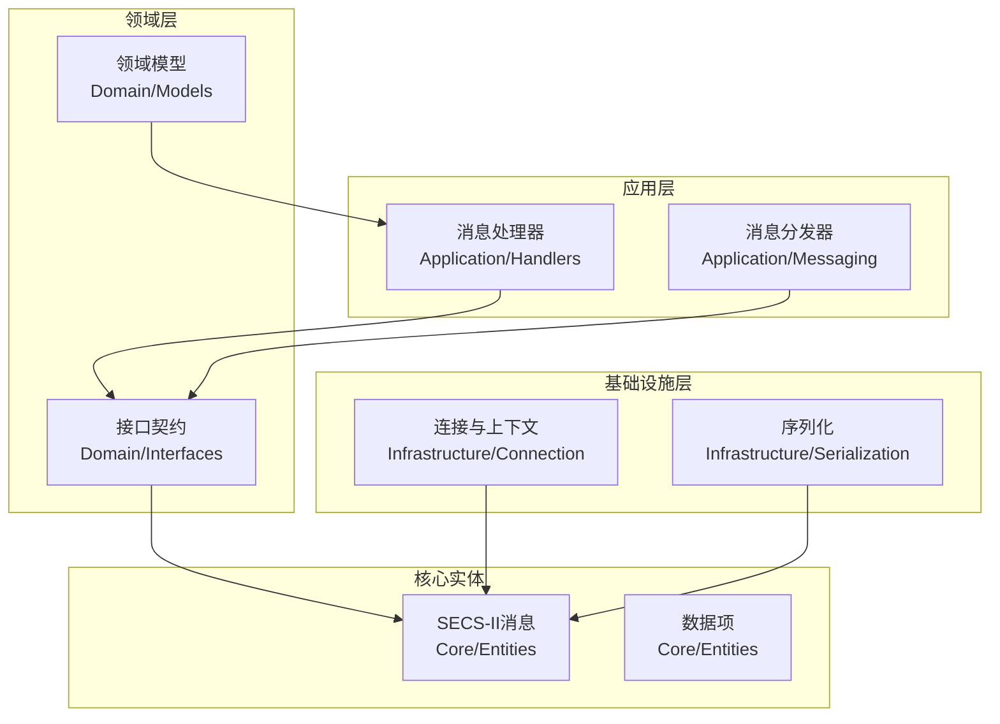
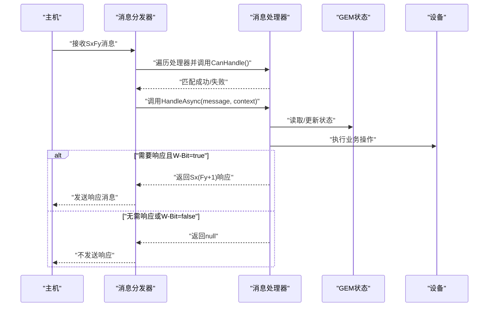
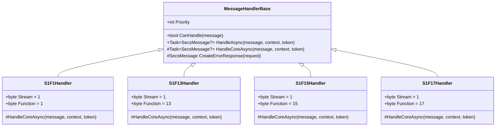
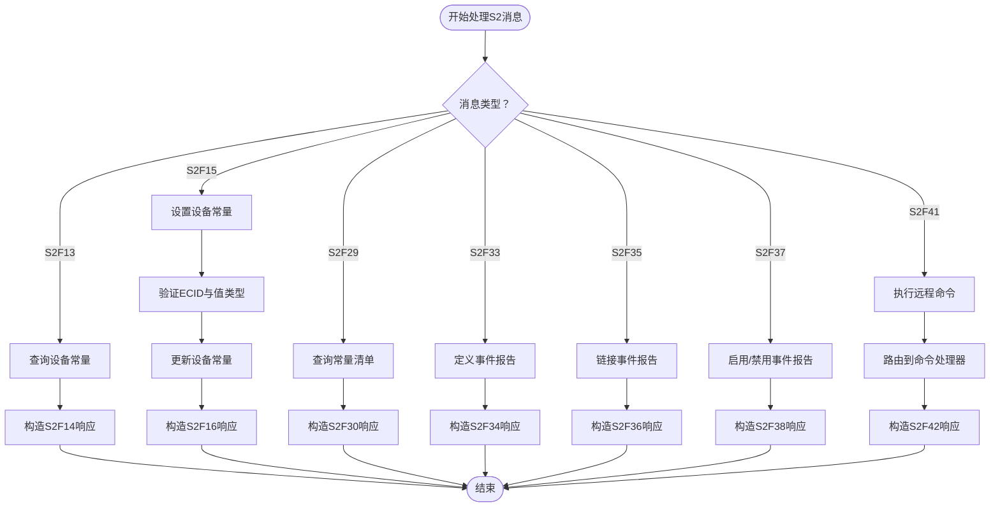
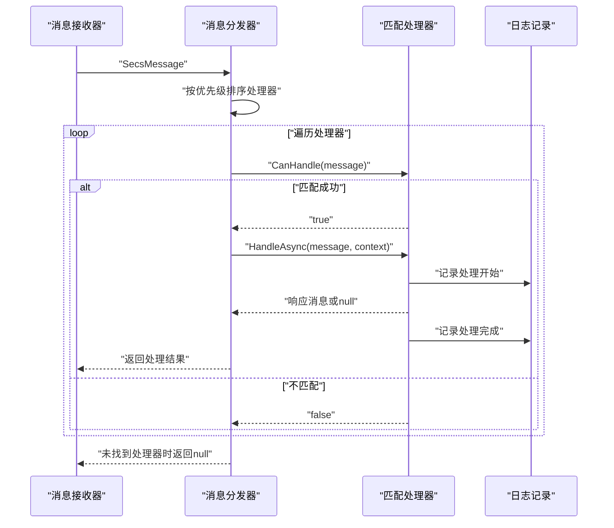
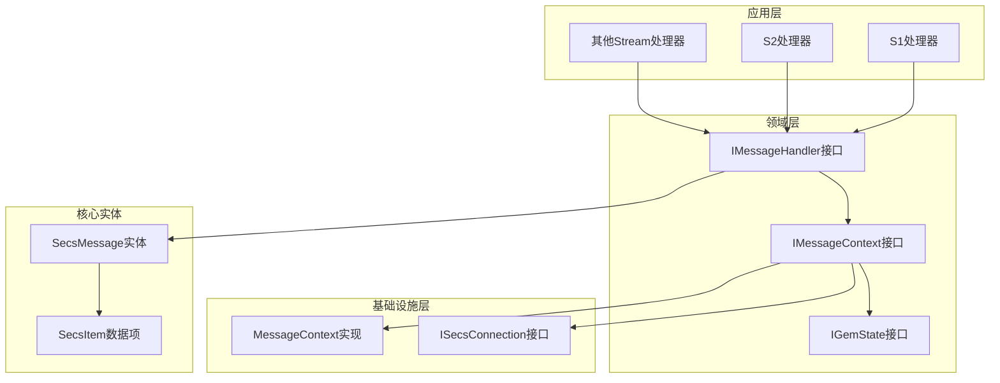

# Stream消息处理差异

<cite>
**本文引用的文件**
- [StreamOneHandlers.cs](file://WebGem/SECS2GEM/Application/Handlers/StreamOneHandlers.cs)
- [StreamTwoHandlers.cs](file://WebGem/SECS2GEM/Application/Handlers/StreamTwoHandlers.cs)
- [OtherStreamHandlers.cs](file://WebGem/SECS2GEM/Application/Handlers/OtherStreamHandlers.cs)
- [SecsMessage.cs](file://WebGem/SECS2GEM/Core/Entities/SecsMessage.cs)
- [IMessageHandler.cs](file://WebGem/SECS2GEM/Domain/Interfaces/IMessageHandler.cs)
- [MessageContext.cs](file://WebGem/SECS2GEM/Infrastructure/Connection/MessageContext.cs)
- [GEM协议规范.md](file://WebGem/SECS2GEM/GEM_Protocol_Specification.md)
</cite>

## 目录
1. [引言](#引言)
2. [项目结构](#项目结构)
3. [核心组件](#核心组件)
4. [架构概览](#架构概览)
5. [详细组件分析](#详细组件分析)
6. [依赖关系分析](#依赖关系分析)
7. [性能考虑](#性能考虑)
8. [故障排除指南](#故障排除指南)
9. [结论](#结论)
10. [附录](#附录)

## 引言
本文件专注于SECS2GEM项目中Stream消息处理的差异性分析，重点对比Stream One（S1）与Stream Two（S2）消息的处理差异，同时涵盖Stream Three（S3）、Stream Five（S5）、Stream Six（S6）、Stream Seven（S7）、Stream Ten（S10）等其他Stream类型的扩展处理方法。文档从消息结构、处理逻辑、响应模式、消息类型识别、路由决策和处理策略选择等方面进行深入解析，并提供基于源码路径的实现模式参考。

## 项目结构
SECS2GEM项目采用按功能域划分的层次化组织方式，其中消息处理相关的核心文件分布如下：
- Application/Handlers：按Stream分类的消息处理器集合
- Core/Entities：SECS-II消息实体定义
- Domain/Interfaces：消息处理接口契约
- Infrastructure/Connection：消息上下文与连接抽象
- GEM协议规范.md：GEM协议与消息流程的权威说明

**图表来源**
- [StreamOneHandlers.cs:1-211](file://WebGem/SECS2GEM/Application/Handlers/StreamOneHandlers.cs#L1-L211)
- [StreamTwoHandlers.cs:1-331](file://WebGem/SECS2GEM/Application/Handlers/StreamTwoHandlers.cs#L1-L331)
- [OtherStreamHandlers.cs:1-276](file://WebGem/SECS2GEM/Application/Handlers/OtherStreamHandlers.cs#L1-L276)
- [SecsMessage.cs:1-209](file://WebGem/SECS2GEM/Core/Entities/SecsMessage.cs#L1-L209)

**章节来源**
- [StreamOneHandlers.cs:1-211](file://WebGem/SECS2GEM/Application/Handlers/StreamOneHandlers.cs#L1-L211)
- [StreamTwoHandlers.cs:1-331](file://WebGem/SECS2GEM/Application/Handlers/StreamTwoHandlers.cs#L1-L331)
- [OtherStreamHandlers.cs:1-276](file://WebGem/SECS2GEM/Application/Handlers/OtherStreamHandlers.cs#L1-L276)
- [SecsMessage.cs:1-209](file://WebGem/SECS2GEM/Core/Entities/SecsMessage.cs#L1-L209)

## 核心组件
本节概述消息处理的关键组件及其职责：
- 消息实体（SecsMessage）：封装Stream、Function、W-Bit、数据项等协议字段，提供消息构建与响应生成能力
- 消息处理器接口（IMessageHandler）：定义CanHandle与HandleAsync方法，支持优先级与策略模式
- 消息上下文（MessageContext）：提供设备ID、连接、GEM状态、回复能力等上下文信息
- Stream处理器：按Stream分类的专用处理器，如S1F1、S1F13、S2F13、S2F15等

关键特性：
- 不可变设计保证线程安全
- 模板方法模式统一异常处理与日志记录
- 策略模式支持动态注册与优先级调度

**章节来源**
- [SecsMessage.cs:18-139](file://WebGem/SECS2GEM/Core/Entities/SecsMessage.cs#L18-L139)
- [IMessageHandler.cs:63-88](file://WebGem/SECS2GEM/Domain/Interfaces/IMessageHandler.cs#L63-L88)
- [MessageContext.cs:12-62](file://WebGem/SECS2GEM/Infrastructure/Connection/MessageContext.cs#L12-L62)

## 架构概览
SECS2GEM采用责任链+策略组合的分发架构：
- 消息分发器遍历所有处理器，通过CanHandle匹配目标Stream/Function
- 找到匹配处理器后委托其HandleAsync执行核心逻辑
- 处理器根据W-Bit决定是否返回响应消息
- 异常处理统一捕获并按需生成S9F7错误响应

**图表来源**
- [IMessageHandler.cs:104-129](file://WebGem/SECS2GEM/Domain/Interfaces/IMessageHandler.cs#L104-L129)
- [StreamOneHandlers.cs:48-86](file://WebGem/SECS2GEM/Application/Handlers/StreamOneHandlers.cs#L48-L86)
- [StreamTwoHandlers.cs:18-138](file://WebGem/SECS2GEM/Application/Handlers/StreamTwoHandlers.cs#L18-L138)

## 详细组件分析

### Stream One（S1）消息处理差异
S1消息主要负责设备状态与通信建立，典型消息包括Are You There（S1F1）、建立通信（S1F13）、离线/上线请求（S1F15/S1F17）等。

#### 消息结构与处理逻辑
- S1F1（Are You There）：无数据项，设备返回S1F2（On Line Data），包含设备型号与软件版本
- S1F13（Establish Communications Request）：请求建立通信，设备返回S1F14（Establish Communications Ack）
- S1F15（Request OFF-LINE）：请求离线，设备返回S1F16（OFF-LINE Acknowledge）
- S1F17（Request ON-LINE）：请求上线，设备返回S1F18（ON-LINE Acknowledge）

#### 响应模式与错误处理
- 所有S1处理器均继承MessageHandlerBase，统一实现异常捕获与S9F7错误响应生成
- 对于W-Bit=true的请求消息，若发生异常且消息标记W-Bit，则生成S9F7作为错误响应

**图表来源**
- [StreamOneHandlers.cs:20-211](file://WebGem/SECS2GEM/Application/Handlers/StreamOneHandlers.cs#L20-L211)

**章节来源**
- [StreamOneHandlers.cs:88-211](file://WebGem/SECS2GEM/Application/Handlers/StreamOneHandlers.cs#L88-L211)
- [SecsMessage.cs:145-206](file://WebGem/SECS2GEM/Core/Entities/SecsMessage.cs#L145-L206)

### Stream Two（S2）消息处理差异
S2消息负责设备控制与数据采集，典型消息包括设备常量查询/设置（S2F13/S2F15）、事件报告定义与链接（S2F33/S2F35/S2F37）、远程命令（S2F41）等。

#### 消息结构与处理逻辑
- S2F13（Equipment Constant Request）：查询设备常量，支持全量查询与指定ECID查询
- S2F15（New Equipment Constant Send）：设置设备常量，逐项验证并返回EAC（Equipment Constant Ack）
- S2F29（Equipment Constant Namelist Request）：查询设备常量名称清单
- S2F33/S2F35/S2F37：事件报告定义、链接与启用/禁用
- S2F41（Host Command Send）：执行主机远程命令，支持动态注册命令处理器

#### 响应模式与数据类型处理
- 统一使用SecsItem工厂方法构造响应数据项
- 支持多种数据格式自动推断与转换（ASCII、I4/U4、F4/F8、Boolean、Binary等）
- 对于批量操作，使用L（List）容器封装多个子项

**图表来源**
- [StreamTwoHandlers.cs:13-331](file://WebGem/SECS2GEM/Application/Handlers/StreamTwoHandlers.cs#L13-L331)

**章节来源**
- [StreamTwoHandlers.cs:7-331](file://WebGem/SECS2GEM/Application/Handlers/StreamTwoHandlers.cs#L7-L331)
- [SecsMessage.cs:458-540](file://WebGem/SECS2GEM/GEM_Protocol_Specification.md#L458-L540)

### 其他Stream类型扩展处理
除S1/S2外，项目还实现了S5（报警）、S6（数据采集）、S7（配方管理）、S10（终端服务）等Stream的简化处理。

#### 报警处理（S5）
- S5F3：启用/禁用报警请求（ACKC5）
- S5F5/S5F7：列出报警与启用报警请求（返回空列表）

#### 数据采集（S6）
- S6F15/S6F19：事件报告与个别报告请求（返回空报告）

#### 配方管理（S7）
- S7F1/S7F3/S7F5/S7F17/S7F19：配方加载、发送、请求、删除与当前EPPD请求（均返回简化响应）

#### 终端服务（S10）
- S10F3/S10F5：单块/多块终端显示请求（ACKC10）

这些处理器均遵循统一的模板方法模式，确保一致的异常处理与响应生成。

**章节来源**
- [OtherStreamHandlers.cs:1-276](file://WebGem/SECS2GEM/Application/Handlers/OtherStreamHandlers.cs#L1-L276)

### 消息类型识别、路由决策与处理策略
消息处理遵循以下指导原则：

#### 类型识别
- 通过SecsMessage的Stream与Function属性识别消息类型
- 使用IMessageHandler.CanHandle(message)进行精确匹配
- 支持优先级机制，数值越小优先级越高

#### 路由决策
- 消息分发器遍历已注册处理器
- 依据Stream/Function精确匹配，优先选择匹配度最高的处理器
- 对于S1/S2等常用消息，采用专用处理器以获得最佳性能

#### 处理策略
- Primary消息（奇数Function，W-Bit=true）：必须返回Secondary响应
- Secondary消息（偶数Function，W-Bit=false）：通常不期望响应
- 异常处理：统一捕获并按需生成S9F7错误响应

**图表来源**
- [IMessageHandler.cs:104-129](file://WebGem/SECS2GEM/Domain/Interfaces/IMessageHandler.cs#L104-L129)
- [StreamOneHandlers.cs:40-66](file://WebGem/SECS2GEM/Application/Handlers/StreamOneHandlers.cs#L40-L66)

**章节来源**
- [IMessageHandler.cs:50-88](file://WebGem/SECS2GEM/Domain/Interfaces/IMessageHandler.cs#L50-L88)
- [MessageContext.cs:56-62](file://WebGem/SECS2GEM/Infrastructure/Connection/MessageContext.cs#L56-L62)

## 依赖关系分析
消息处理模块的依赖关系清晰，遵循分层架构原则：

**图表来源**
- [IMessageHandler.cs:63-131](file://WebGem/SECS2GEM/Domain/Interfaces/IMessageHandler.cs#L63-L131)
- [MessageContext.cs:12-62](file://WebGem/SECS2GEM/Infrastructure/Connection/MessageContext.cs#L12-L62)
- [SecsMessage.cs:18-139](file://WebGem/SECS2GEM/Core/Entities/SecsMessage.cs#L18-L139)

**章节来源**
- [IMessageHandler.cs:1-131](file://WebGem/SECS2GEM/Domain/Interfaces/IMessageHandler.cs#L1-L131)
- [MessageContext.cs:1-65](file://WebGem/SECS2GEM/Infrastructure/Connection/MessageContext.cs#L1-L65)

## 性能考虑
- 处理器优先级：通过Priority属性优化匹配效率，常用消息处理器置于更高优先级
- 模板方法模式：减少重复代码，提高维护效率
- 不可变消息实体：避免并发访问问题，提升线程安全性
- 数据类型自动推断：减少显式类型转换开销
- 批量操作优化：使用L容器封装多个子项，减少消息拆分成本

## 故障排除指南
常见问题与解决方案：
- 消息无响应：检查W-Bit标志与消息类型，确认是否需要Secondary响应
- 异常导致S9F7：查看异常捕获逻辑，确认错误响应生成条件
- 数据类型不匹配：核对SecsItem格式码与数据类型转换逻辑
- 处理器未匹配：确认CanHandle实现与Stream/Function配置

**章节来源**
- [StreamOneHandlers.cs:53-86](file://WebGem/SECS2GEM/Application/Handlers/StreamOneHandlers.cs#L53-L86)
- [StreamTwoHandlers.cs:123-138](file://WebGem/SECS2GEM/Application/Handlers/StreamTwoHandlers.cs#L123-L138)

## 结论
SECS2GEM项目通过清晰的分层架构与策略模式，实现了Stream消息处理的模块化与可扩展性。S1与S2消息处理体现了不同的业务关注点：前者侧重设备状态与通信建立，后者聚焦设备控制与数据采集。通过统一的模板方法模式与消息分发机制，项目在保证一致性的同时提供了良好的扩展能力。建议在新增Stream类型时遵循现有模式，确保处理流程的一致性与可维护性。

## 附录
- GEM协议权威参考：[GEM协议规范.md](file://WebGem/SECS2GEM/GEM_Protocol_Specification.md)
- 消息实体定义：[SecsMessage.cs](file://WebGem/SECS2GEM/Core/Entities/SecsMessage.cs)
- 处理器接口契约：[IMessageHandler.cs](file://WebGem/SECS2GEM/Domain/Interfaces/IMessageHandler.cs)
- 消息上下文实现：[MessageContext.cs](file://WebGem/SECS2GEM/Infrastructure/Connection/MessageContext.cs)