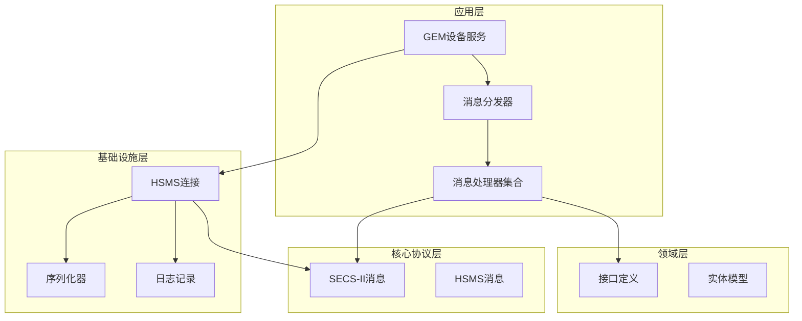
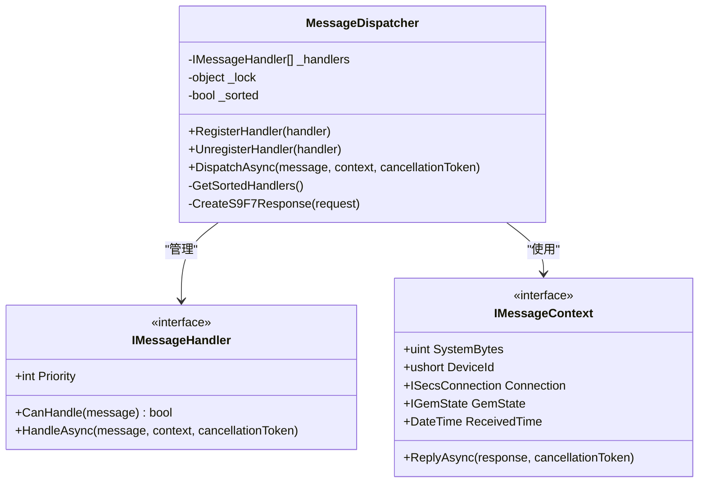
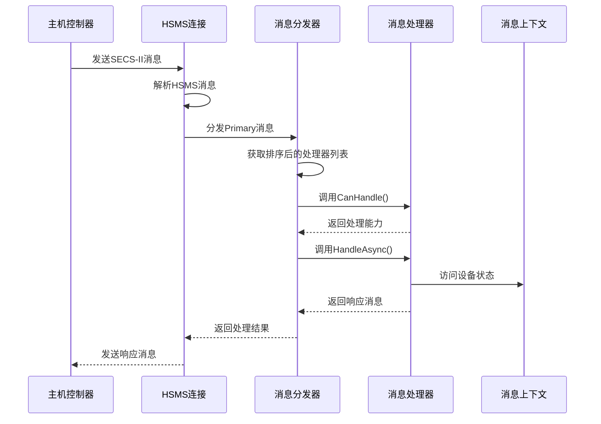
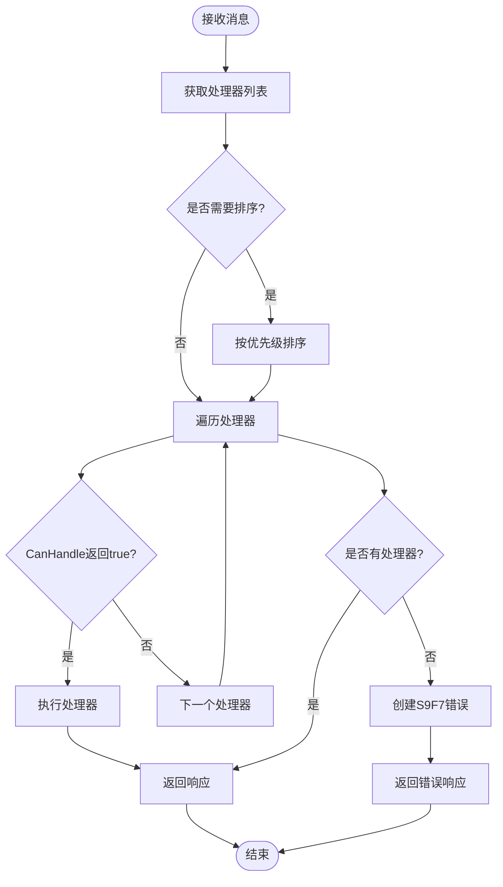
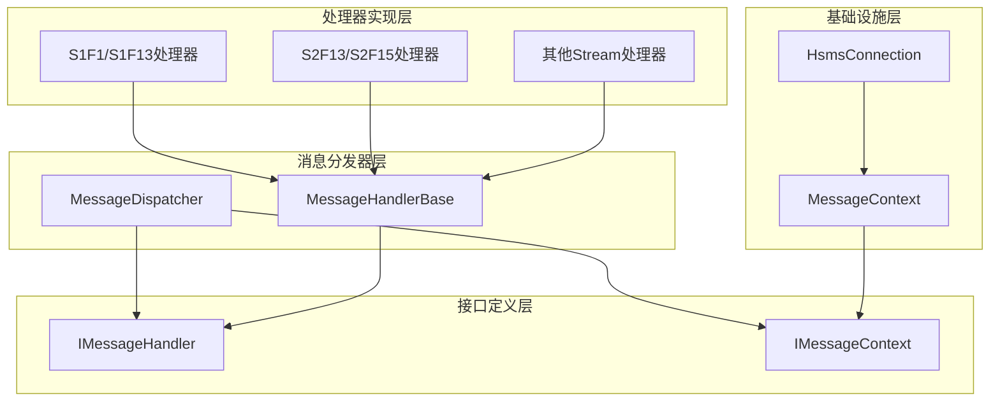

# 消息分发器核心机制

<cite>
**本文档引用的文件**
- [MessageDispatcher.cs](file://WebGem/SECS2GEM/Application/Messaging/MessageDispatcher.cs)
- [IMessageHandler.cs](file://WebGem/SECS2GEM/Domain/Interfaces/IMessageHandler.cs)
- [MessageContext.cs](file://WebGem/SECS2GEM/Infrastructure/Connection/MessageContext.cs)
- [StreamOneHandlers.cs](file://WebGem/SECS2GEM/Application/Handlers/StreamOneHandlers.cs)
- [StreamTwoHandlers.cs](file://WebGem/SECS2GEM/Application/Handlers/StreamTwoHandlers.cs)
- [OtherStreamHandlers.cs](file://WebGem/SECS2GEM/Application/Handlers/OtherStreamHandlers.cs)
- [SecsMessage.cs](file://WebGem/SECS2GEM/Core/Entities/SecsMessage.cs)
- [HsmsConnection.cs](file://WebGem/SECS2GEM/Infrastructure/Connection/HsmsConnection.cs)
- [GemEquipmentService.cs](file://WebGem/SECS2GEM/Application/Services/GemEquipmentService.cs)
- [MessageHandlerTests.cs](file://WebGem/SECS2GEM.Tests/MessageHandlerTests.cs)
</cite>

## 目录
1. [简介](#简介)
2. [项目结构](#项目结构)
3. [核心组件](#核心组件)
4. [架构概览](#架构概览)
5. [详细组件分析](#详细组件分析)
6. [依赖关系分析](#依赖关系分析)
7. [性能考虑](#性能考虑)
8. [故障排除指南](#故障排除指南)
9. [结论](#结论)
10. [附录](#附录)

## 简介

SECS2GEM项目的消息分发器是一个基于责任链模式和策略模式组合的核心组件，负责在SECS-II协议中实现消息的智能路由和处理。该系统通过动态处理器注册机制，实现了高度模块化的消息处理架构，支持优先级排序、线程安全保证和高性能的并发处理。

消息分发器的核心设计理念是将消息处理逻辑与业务逻辑解耦，通过接口抽象实现处理器的可插拔性，同时保持系统的可扩展性和维护性。该机制特别适用于半导体制造设备的通信需求，能够处理来自主机控制器的各种消息类型。

## 项目结构

SECS2GEM项目的整体架构采用分层设计，消息分发器位于应用层的核心位置，向上提供统一的接口，向下协调各个消息处理器。



**图表来源**
- [GemEquipmentService.cs:13](file://WebGem/SECS2GEM/Application/Services/GemEquipmentService.cs#L13-L133)
- [MessageDispatcher.cs:27](file://WebGem/SECS2GEM/Application/Messaging/MessageDispatcher.cs#L27-L123)

**章节来源**
- [GemEquipmentService.cs:13-133](file://WebGem/SECS2GEM/Application/Services/GemEquipmentService.cs#L13-L133)
- [MessageDispatcher.cs:6-26](file://WebGem/SECS2GEM/Application/Messaging/MessageDispatcher.cs#L6-L26)

## 核心组件

### 消息分发器(MessageDispatcher)

消息分发器是整个系统的核心组件，实现了责任链模式和策略模式的完美结合。其主要职责包括：

- **处理器管理**：维护处理器列表，支持动态注册和注销
- **消息路由**：根据消息特征查找合适的处理器
- **优先级排序**：按照优先级顺序执行处理器
- **错误处理**：生成标准的S9F7错误响应



**图表来源**
- [MessageDispatcher.cs:27-123](file://WebGem/SECS2GEM/Application/Messaging/MessageDispatcher.cs#L27-L123)
- [IMessageHandler.cs:63-88](file://WebGem/SECS2GEM/Domain/Interfaces/IMessageHandler.cs#L63-L88)

### 消息处理器接口体系

系统采用策略模式设计，每个消息处理器专注于特定的Stream/Function组合：

- **IMessageHandler接口**：定义处理器的标准行为
- **MessageHandlerBase抽象类**：提供模板方法模式的基础实现
- **具体处理器实现**：针对不同消息类型的专门处理逻辑

**章节来源**
- [IMessageHandler.cs:50-88](file://WebGem/SECS2GEM/Domain/Interfaces/IMessageHandler.cs#L50-L88)
- [StreamOneHandlers.cs:20-86](file://WebGem/SECS2GEM/Application/Handlers/StreamOneHandlers.cs#L20-L86)

## 架构概览

消息分发器在整个系统中的工作流程如下：



**图表来源**
- [GemEquipmentService.cs:343-358](file://WebGem/SECS2GEM/Application/Services/GemEquipmentService.cs#L343-L358)
- [MessageDispatcher.cs:67-91](file://WebGem/SECS2GEM/Application/Messaging/MessageDispatcher.cs#L67-L91)

## 详细组件分析

### 消息分发器设计原理

消息分发器采用了双重设计模式的组合：

#### 责任链模式实现
- **处理器链**：维护一个有序的处理器列表
- **责任传递**：逐个检查处理器的处理能力
- **短路执行**：找到第一个能处理的处理器立即执行

#### 策略模式实现
- **策略选择**：根据消息特征选择合适的处理器
- **算法封装**：将处理逻辑封装在独立的策略中
- **动态替换**：支持运行时替换和扩展处理器



**图表来源**
- [MessageDispatcher.cs:67-91](file://WebGem/SECS2GEM/Application/Messaging/MessageDispatcher.cs#L67-L91)

### 处理器注册和注销机制

消息分发器提供了完整的处理器生命周期管理：

#### 注册机制
- **线程安全**：使用锁机制保证并发安全
- **延迟排序**：注册后标记需要重新排序
- **动态更新**：支持运行时动态添加处理器

#### 注销机制
- **即时移除**：立即从处理器列表中移除
- **无影响**：不影响其他处理器的正常工作
- **内存清理**：确保不再使用的处理器被及时回收

**章节来源**
- [MessageDispatcher.cs:37-58](file://WebGem/SECS2GEM/Application/Messaging/MessageDispatcher.cs#L37-L58)

### 优先级排序算法

优先级排序是消息分发器的核心特性之一：

#### 排序策略
- **数值越小优先级越高**：符合常见的优先级约定
- **稳定排序**：相同优先级的处理器保持相对顺序
- **懒加载排序**：只在需要时进行排序操作

#### 性能优化
- **缓存机制**：排序结果缓存到下次更新
- **增量更新**：只在处理器列表发生变化时重新排序
- **浅拷贝返回**：避免外部修改内部状态

**章节来源**
- [MessageDispatcher.cs:96-108](file://WebGem/SECS2GEM/Application/Messaging/MessageDispatcher.cs#L96-L108)

### 线程安全保证

消息分发器通过多重机制确保线程安全：

#### 并发控制
- **全局锁**：保护处理器列表的访问
- **原子操作**：确保状态变更的原子性
- **不可变设计**：返回的处理器列表是副本而非引用

#### 竞态条件防护
- **读写分离**：读操作不加锁，写操作独占锁
- **状态同步**：确保处理器状态的一致性
- **异常隔离**：单个处理器异常不影响其他处理器

**章节来源**
- [MessageDispatcher.cs:29-31](file://WebGem/SECS2GEM/Application/Messaging/MessageDispatcher.cs#L29-L31)

### 性能优化策略

消息分发器采用了多项性能优化技术：

#### 缓存优化
- **处理器列表缓存**：避免重复排序操作
- **优先级缓存**：减少比较操作次数
- **对象池**：复用临时对象减少GC压力

#### 内存优化
- **延迟初始化**：只在需要时创建处理器实例
- **弱引用**：避免循环引用导致的内存泄漏
- **批量操作**：支持批量注册和注销处理器

#### 并发优化
- **无锁读取**：读操作不使用锁提高并发性能
- **分段锁**：在高并发场景下使用更细粒度的锁
- **异步处理**：支持非阻塞的消息处理

**章节来源**
- [MessageDispatcher.cs:96-108](file://WebGem/SECS2GEM/Application/Messaging/MessageDispatcher.cs#L96-L108)

### S9F7错误响应生成逻辑

当没有处理器能够处理消息时，消息分发器会生成标准的S9F7错误响应：

#### 错误响应规则
- **W-Bit检查**：只有在消息期望回复时才生成错误响应
- **消息头保留**：错误响应包含原始消息的头部信息
- **标准格式**：严格遵循SECS-II协议的错误格式规范

#### 错误类型映射
- **S9F7**：非法数据错误，对应原始消息的Stream和Function
- **S9F1**：设备ID错误
- **S9F3**：Stream错误
- **S9F5**：Function错误

**章节来源**
- [MessageDispatcher.cs:83-91](file://WebGem/SECS2GEM/Application/Messaging/MessageDispatcher.cs#L83-L91)

### W-Bit处理机制

W-Bit（期望回复位）是SECS-II协议的重要特性：

#### W-Bit语义
- **true**：期望接收响应消息
- **false**：不期望接收响应消息
- **协议要求**：Primary消息通常设置为true，Secondary消息设置为false

#### 处理逻辑
- **期望回复**：生成并返回错误响应
- **不期望回复**：直接返回null，不产生任何响应
- **协议一致性**：严格遵循SECS-II协议规范

**章节来源**
- [SecsMessage.cs:46-55](file://WebGem/SECS2GEM/Core/Entities/SecsMessage.cs#L46-L55)

## 依赖关系分析

消息分发器与其他组件的依赖关系如下：



**图表来源**
- [MessageDispatcher.cs:27-123](file://WebGem/SECS2GEM/Application/Messaging/MessageDispatcher.cs#L27-L123)
- [IMessageHandler.cs:63-129](file://WebGem/SECS2GEM/Domain/Interfaces/IMessageHandler.cs#L63-L129)

**章节来源**
- [GemEquipmentService.cs:407-443](file://WebGem/SECS2GEM/Application/Services/GemEquipmentService.cs#L407-L443)

## 性能考虑

### 并发处理最佳实践

在高并发场景下使用消息分发器的最佳实践：

#### 处理器设计
- **无状态处理器**：避免在处理器中存储共享状态
- **轻量级实现**：减少处理器的内存占用和CPU消耗
- **快速失败**：在CanHandle阶段尽早判断处理能力

#### 注册策略
- **预注册**：在应用启动时完成所有处理器的注册
- **批量操作**：避免频繁的注册和注销操作
- **优先级规划**：合理设置处理器的优先级以优化性能

#### 监控和调优
- **性能指标**：监控消息处理延迟和吞吐量
- **内存使用**：关注处理器实例的内存占用
- **并发测试**：进行压力测试验证系统的稳定性

### 内存管理

消息分发器在内存管理方面的考虑：

#### 对象生命周期
- **短生命周期**：处理器实例通常具有较短的生命周期
- **垃圾回收**：合理设计处理器结构以减少GC压力
- **资源释放**：确保处理器正确释放持有的资源

#### 缓存策略
- **适度缓存**：平衡缓存带来的性能提升和内存占用
- **缓存失效**：设计合理的缓存失效机制
- **内存监控**：监控系统的内存使用情况

## 故障排除指南

### 常见问题诊断

#### 处理器未被调用
- **检查CanHandle实现**：确认处理器正确实现了消息匹配逻辑
- **验证优先级设置**：确保处理器的优先级设置合理
- **确认注册状态**：验证处理器确实已注册到分发器

#### 错误响应异常
- **检查W-Bit设置**：确认消息的W-Bit标志正确设置
- **验证错误类型**：确认生成的错误响应类型正确
- **查看日志输出**：检查系统日志中的错误信息

#### 性能问题
- **分析处理器复杂度**：评估处理器的处理复杂度
- **监控并发冲突**：检查是否存在严重的并发竞争
- **优化排序算法**：考虑使用更高效的排序策略

**章节来源**
- [MessageHandlerTests.cs:165-200](file://WebGem/SECS2GEM.Tests/MessageHandlerTests.cs#L165-L200)

### 调试技巧

#### 单元测试
- **模拟消息上下文**：使用MockMessageContext进行测试
- **验证处理器行为**：确保处理器按预期工作
- **测试边界条件**：验证异常情况下的处理逻辑

#### 集成测试
- **端到端测试**：验证完整的消息处理流程
- **并发测试**：测试高并发场景下的系统表现
- **性能基准测试**：建立性能基准以便优化

## 结论

SECS2GEM项目的消息分发器通过巧妙地结合责任链模式和策略模式，实现了高度模块化和可扩展的消息处理架构。该系统的主要优势包括：

1. **高度解耦**：处理器之间完全独立，互不干扰
2. **动态扩展**：支持运行时注册和注销处理器
3. **优先级控制**：通过优先级实现灵活的消息路由
4. **线程安全**：采用多种机制确保并发安全性
5. **性能优化**：通过缓存和懒加载提升处理效率

该设计模式特别适合工业自动化和半导体制造设备的通信需求，能够处理复杂的SECS-II协议消息，为设备与主机控制器之间的通信提供了可靠的技术基础。

## 附录

### 实际使用示例

以下是如何正确使用消息分发器的实际示例：

#### 基本使用模式
```csharp
// 创建消息分发器实例
var dispatcher = new MessageDispatcher();

// 注册处理器
dispatcher.RegisterHandler(new S1F1Handler());
dispatcher.RegisterHandler(new S1F13Handler());

// 处理消息
var response = await dispatcher.DispatchAsync(message, context);
```

#### 高并发场景最佳实践
```csharp
// 预注册所有处理器
var dispatcher = new MessageDispatcher();
RegisterDefaultHandlers(dispatcher);

// 在应用启动时完成注册
// 避免运行时频繁注册和注销
```

#### 自定义处理器开发
```csharp
public class CustomHandler : MessageHandlerBase
{
    protected override byte Stream => 1;
    protected override byte Function => 100;
    
    protected override Task<SecsMessage?> HandleCoreAsync(
        SecsMessage message, 
        IMessageContext context, 
        CancellationToken cancellationToken)
    {
        // 实现自定义处理逻辑
        return Task.FromResult<SecsMessage?>(response);
    }
}
```

**章节来源**
- [GemEquipmentService.cs:407-443](file://WebGem/SECS2GEM/Application/Services/GemEquipmentService.cs#L407-L443)
- [MessageHandlerTests.cs:165-200](file://WebGem/SECS2GEM.Tests/MessageHandlerTests.cs#L165-L200)