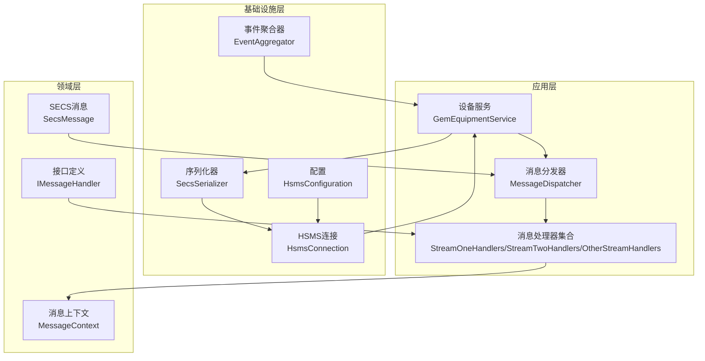
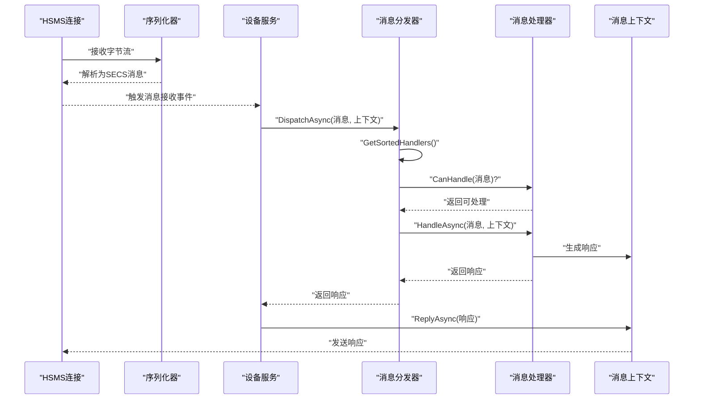
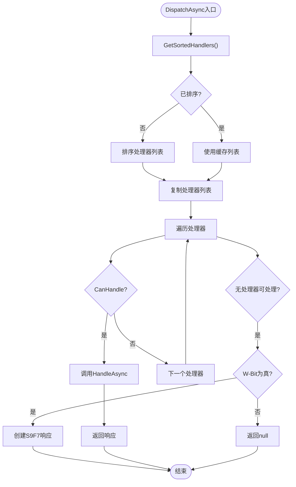
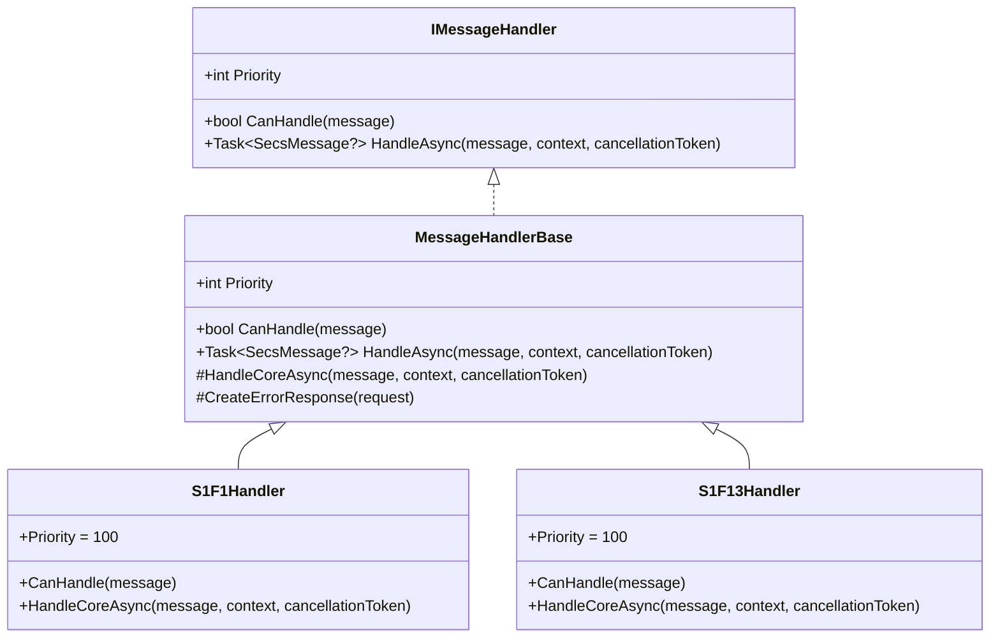
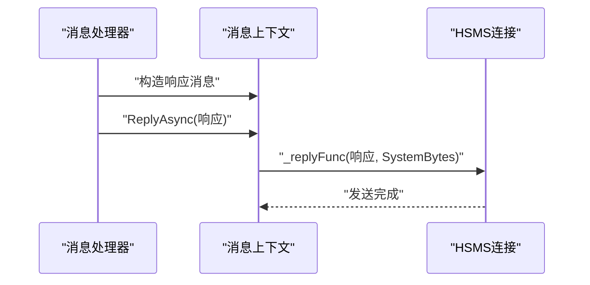
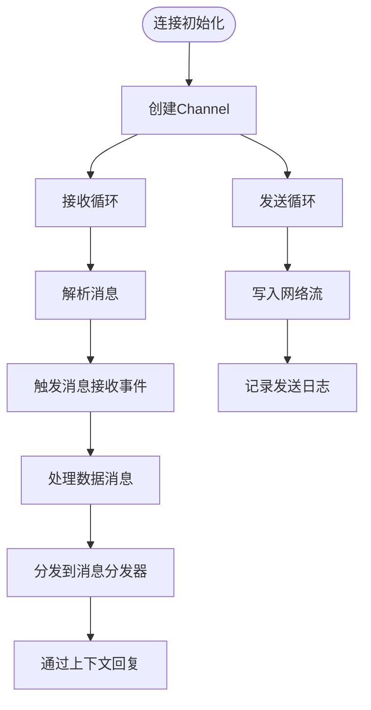
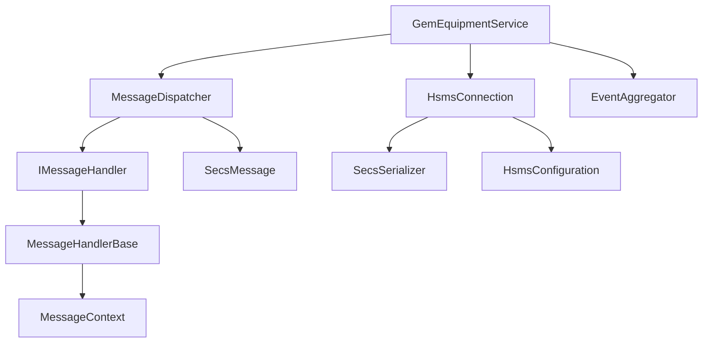

# 消息处理性能优化

<cite>
**本文档引用的文件**
- [MessageDispatcher.cs](file://WebGem/SECS2GEM/Application/Messaging/MessageDispatcher.cs)
- [MessageContext.cs](file://WebGem/SECS2GEM/Infrastructure/Connection/MessageContext.cs)
- [StreamOneHandlers.cs](file://WebGem/SECS2GEM/Application/Handlers/StreamOneHandlers.cs)
- [StreamTwoHandlers.cs](file://WebGem/SECS2GEM/Application/Handlers/StreamTwoHandlers.cs)
- [OtherStreamHandlers.cs](file://WebGem/SECS2GEM/Application/Handlers/OtherStreamHandlers.cs)
- [SecsMessage.cs](file://WebGem/SECS2GEM/Core/Entities/SecsMessage.cs)
- [IMessageHandler.cs](file://WebGem/SECS2GEM/Domain/Interfaces/IMessageHandler.cs)
- [HsmsConnection.cs](file://WebGem/SECS2GEM/Infrastructure/Connection/HsmsConnection.cs)
- [EventAggregator.cs](file://WebGem/SECS2GEM/Infrastructure/Services/EventAggregator.cs)
- [GemEquipmentService.cs](file://WebGem/SECS2GEM/Application/Services/GemEquipmentService.cs)
- [SecsSerializer.cs](file://WebGem/SECS2GEM/Infrastructure/Serialization/SecsSerializer.cs)
- [HsmsConfiguration.cs](file://WebGem/SECS2GEM/Infrastructure/Configuration/HsmsConfiguration.cs)
- [MessageHandlerTests.cs](file://WebGem/SECS2GEM.Tests/MessageHandlerTests.cs)
</cite>

## 目录
1. [简介](#简介)
2. [项目结构](#项目结构)
3. [核心组件](#核心组件)
4. [架构概览](#架构概览)
5. [详细组件分析](#详细组件分析)
6. [依赖关系分析](#依赖关系分析)
7. [性能考虑因素](#性能考虑因素)
8. [故障排除指南](#故障排除指南)
9. [结论](#结论)
10. [附录](#附录)

## 简介
本指南聚焦于SECS2GEM项目的消息处理性能优化，围绕消息分发器的性能瓶颈与优化策略展开，涵盖处理器排序缓存、线程安全锁优化、内存分配减少、批量消息处理最佳实践、消息上下文复用、对象池技术、垃圾回收优化、性能监控指标、基准测试方法以及高吞吐量场景下的架构建议与扩展策略。通过对代码库中消息分发、处理器、连接与序列化等关键模块的深入分析，提供可操作的优化方案与实施路径。

## 项目结构
SECS2GEM采用分层架构，消息处理主要分布在应用层（消息分发与处理器）、基础设施层（连接、序列化、事件聚合）与领域层（实体与接口）。消息从连接层接收，经由消息分发器路由至对应处理器，处理器通过消息上下文进行响应发送与状态交互，最终通过序列化器进行网络传输。

**图表来源**
- [GemEquipmentService.cs:106-133](file://WebGem/SECS2GEM/Application/Services/GemEquipmentService.cs#L106-L133)
- [MessageDispatcher.cs:27-121](file://WebGem/SECS2GEM/Application/Messaging/MessageDispatcher.cs#L27-L121)
- [HsmsConnection.cs:30-95](file://WebGem/SECS2GEM/Infrastructure/Connection/HsmsConnection.cs#L30-L95)
- [SecsSerializer.cs:27-77](file://WebGem/SECS2GEM/Infrastructure/Serialization/SecsSerializer.cs#L27-L77)
- [EventAggregator.cs:17-45](file://WebGem/SECS2GEM/Infrastructure/Services/EventAggregator.cs#L17-L45)
- [HsmsConfiguration.cs:15-133](file://WebGem/SECS2GEM/Infrastructure/Configuration/HsmsConfiguration.cs#L15-L133)
- [SecsMessage.cs:18-104](file://WebGem/SECS2GEM/Core/Entities/SecsMessage.cs#L18-L104)
- [IMessageHandler.cs:63-88](file://WebGem/SECS2GEM/Domain/Interfaces/IMessageHandler.cs#L63-L88)
- [MessageContext.cs:12-63](file://WebGem/SECS2GEM/Infrastructure/Connection/MessageContext.cs#L12-L63)

**章节来源**
- [GemEquipmentService.cs:106-133](file://WebGem/SECS2GEM/Application/Services/GemEquipmentService.cs#L106-L133)
- [HsmsConnection.cs:30-95](file://WebGem/SECS2GEM/Infrastructure/Connection/HsmsConnection.cs#L30-L95)

## 核心组件
- 消息分发器：维护处理器列表，按优先级排序并查找首个可处理的消息处理器，委托执行并返回响应；支持动态注册/注销处理器。
- 消息处理器：基于模板方法模式，定义处理流程骨架，子类仅实现核心逻辑；支持优先级与错误响应生成。
- 消息上下文：封装设备ID、连接、状态与回复能力，供处理器在处理过程中使用。
- HSMS连接：基于Channel实现异步消息队列，支持接收与发送循环、心跳检测与事务管理。
- 序列化器：负责SECS-II消息的序列化与反序列化，支持大端序编码与长度计算。
- 事件聚合器：观察者模式实现，支持异步/同步事件处理与异常隔离。
- 设备服务：外观模式整合连接、分发与状态管理，自动注册默认处理器并处理消息接收事件。

**章节来源**
- [MessageDispatcher.cs:27-121](file://WebGem/SECS2GEM/Application/Messaging/MessageDispatcher.cs#L27-L121)
- [StreamOneHandlers.cs:20-86](file://WebGem/SECS2GEM/Application/Handlers/StreamOneHandlers.cs#L20-L86)
- [MessageContext.cs:12-63](file://WebGem/SECS2GEM/Infrastructure/Connection/MessageContext.cs#L12-L63)
- [HsmsConnection.cs:30-95](file://WebGem/SECS2GEM/Infrastructure/Connection/HsmsConnection.cs#L30-L95)
- [SecsSerializer.cs:27-77](file://WebGem/SECS2GEM/Infrastructure/Serialization/SecsSerializer.cs#L27-L77)
- [EventAggregator.cs:17-45](file://WebGem/SECS2GEM/Infrastructure/Services/EventAggregator.cs#L17-L45)
- [GemEquipmentService.cs:33-133](file://WebGem/SECS2GEM/Application/Services/GemEquipmentService.cs#L33-L133)

## 架构概览
消息从HSMS连接接收，经过序列化器解析为SECS消息，触发设备服务的消息接收事件，随后由消息分发器根据优先级匹配处理器，处理器通过消息上下文生成响应并回传。

**图表来源**
- [HsmsConnection.cs:727-742](file://WebGem/SECS2GEM/Infrastructure/Connection/HsmsConnection.cs#L727-L742)
- [GemEquipmentService.cs:342-358](file://WebGem/SECS2GEM/Application/Services/GemEquipmentService.cs#L342-L358)
- [MessageDispatcher.cs:66-91](file://WebGem/SECS2GEM/Application/Messaging/MessageDispatcher.cs#L66-L91)
- [MessageContext.cs:59-62](file://WebGem/SECS2GEM/Infrastructure/Connection/MessageContext.cs#L59-L62)

## 详细组件分析

### 消息分发器性能分析
- 处理器排序缓存：分发器内部维护处理器列表与排序标记，首次访问时对处理器按优先级排序并缓存，后续访问直接使用缓存列表，避免重复排序开销。
- 线程安全锁优化：使用细粒度锁保护处理器列表的变更与读取，注册/注销与排序阶段加锁，读取阶段复制列表避免长时间持有锁。
- 内存分配减少：排序后复制处理器列表，避免每次遍历时的锁竞争；当无处理器可处理时，按需返回S9F7响应，减少无效处理。

**图表来源**
- [MessageDispatcher.cs:66-108](file://WebGem/SECS2GEM/Application/Messaging/MessageDispatcher.cs#L66-L108)

**章节来源**
- [MessageDispatcher.cs:27-121](file://WebGem/SECS2GEM/Application/Messaging/MessageDispatcher.cs#L27-L121)

### 消息处理器与优先级机制
- 模板方法模式：MessageHandlerBase定义处理流程骨架，子类仅实现核心逻辑，统一异常处理与错误响应生成。
- 优先级控制：处理器通过Priority属性控制匹配顺序，数值越小优先级越高；分发器按优先级排序，确保高优先级处理器优先匹配。

**图表来源**
- [IMessageHandler.cs:63-88](file://WebGem/SECS2GEM/Domain/Interfaces/IMessageHandler.cs#L63-L88)
- [StreamOneHandlers.cs:20-86](file://WebGem/SECS2GEM/Application/Handlers/StreamOneHandlers.cs#L20-L86)

**章节来源**
- [StreamOneHandlers.cs:20-86](file://WebGem/SECS2GEM/Application/Handlers/StreamOneHandlers.cs#L20-L86)
- [IMessageHandler.cs:63-88](file://WebGem/SECS2GEM/Domain/Interfaces/IMessageHandler.cs#L63-L88)

### 消息上下文与响应发送
- 上下文封装：MessageContext提供设备ID、连接、状态与回复能力，处理器通过上下文发送响应。
- 回复机制：处理器在HandleCoreAsync中构造响应消息，分发器将响应传递给上下文的ReplyAsync，由连接层发送。

**图表来源**
- [MessageContext.cs:59-62](file://WebGem/SECS2GEM/Infrastructure/Connection/MessageContext.cs#L59-L62)
- [GemEquipmentService.cs:354-357](file://WebGem/SECS2GEM/Application/Services/GemEquipmentService.cs#L354-L357)

**章节来源**
- [MessageContext.cs:12-63](file://WebGem/SECS2GEM/Infrastructure/Connection/MessageContext.cs#L12-L63)
- [GemEquipmentService.cs:342-358](file://WebGem/SECS2GEM/Application/Services/GemEquipmentService.cs#L342-L358)

### HSMS连接与异步消息队列
- Channel队列：使用无界Channel存储待发送数据，发送循环异步读取并写入网络流，降低阻塞风险。
- 接收循环：持续从网络流读取字节，尝试解析完整消息，解析成功后触发事件与消息处理。
- 心跳与事务：周期性发送Linktest，配合事务管理器实现超时控制与响应等待。

**图表来源**
- [HsmsConnection.cs:405-418](file://WebGem/SECS2GEM/Infrastructure/Connection/HsmsConnection.cs#L405-L418)
- [HsmsConnection.cs:547-610](file://WebGem/SECS2GEM/Infrastructure/Connection/HsmsConnection.cs#L547-L610)
- [HsmsConnection.cs:612-647](file://WebGem/SECS2GEM/Infrastructure/Connection/HsmsConnection.cs#L612-L647)

**章节来源**
- [HsmsConnection.cs:405-418](file://WebGem/SECS2GEM/Infrastructure/Connection/HsmsConnection.cs#L405-L418)
- [HsmsConnection.cs:547-647](file://WebGem/SECS2GEM/Infrastructure/Connection/HsmsConnection.cs#L547-L647)

### 序列化器与内存效率
- 大端序编码：使用BinaryPrimitives进行大端序读写，保证跨平台兼容性。
- 长度计算：根据数据格式与长度动态计算所需字节，避免多余缓冲区分配。
- 无额外拷贝：序列化过程直接写入Span，减少中间数组拷贝。

**章节来源**
- [SecsSerializer.cs:48-77](file://WebGem/SECS2GEM/Infrastructure/Serialization/SecsSerializer.cs#L48-L77)
- [SecsSerializer.cs:248-279](file://WebGem/SECS2GEM/Infrastructure/Serialization/SecsSerializer.cs#L248-L279)

## 依赖关系分析
消息分发器依赖于处理器接口与消息实体；处理器依赖于消息上下文与状态；设备服务协调连接、分发与事件聚合；序列化器贯穿接收与发送路径；配置驱动连接行为。

**图表来源**
- [MessageDispatcher.cs:27-121](file://WebGem/SECS2GEM/Application/Messaging/MessageDispatcher.cs#L27-L121)
- [IMessageHandler.cs:63-88](file://WebGem/SECS2GEM/Domain/Interfaces/IMessageHandler.cs#L63-L88)
- [GemEquipmentService.cs:33-133](file://WebGem/SECS2GEM/Application/Services/GemEquipmentService.cs#L33-L133)
- [HsmsConnection.cs:30-95](file://WebGem/SECS2GEM/Infrastructure/Connection/HsmsConnection.cs#L30-L95)
- [SecsSerializer.cs:27-77](file://WebGem/SECS2GEM/Infrastructure/Serialization/SecsSerializer.cs#L27-L77)
- [HsmsConfiguration.cs:15-133](file://WebGem/SECS2GEM/Infrastructure/Configuration/HsmsConfiguration.cs#L15-L133)

**章节来源**
- [IMessageHandler.cs:63-88](file://WebGem/SECS2GEM/Domain/Interfaces/IMessageHandler.cs#L63-L88)
- [GemEquipmentService.cs:33-133](file://WebGem/SECS2GEM/Application/Services/GemEquipmentService.cs#L33-L133)

## 性能考虑因素

### 处理器排序缓存与优先级匹配
- 缓存策略：分发器在处理器列表变更后标记未排序，首次访问时排序并缓存，后续读取直接使用缓存列表，避免重复排序。
- 优先级控制：处理器通过Priority属性控制匹配顺序，数值越小优先级越高；分发器按优先级排序，确保高优先级处理器优先匹配。
- 优化建议：
  - 在高频消息场景下，尽量减少处理器注册/注销频率，降低排序触发次数。
  - 合理设置处理器优先级，避免过多处理器参与匹配导致遍历成本上升。

**章节来源**
- [MessageDispatcher.cs:96-108](file://WebGem/SECS2GEM/Application/Messaging/MessageDispatcher.cs#L96-L108)
- [IMessageHandler.cs:63-88](file://WebGem/SECS2GEM/Domain/Interfaces/IMessageHandler.cs#L63-L88)

### 线程安全锁优化
- 细粒度锁：分发器使用单把锁保护处理器列表的变更与排序，读取阶段复制列表，避免长时间持有锁。
- 并发控制：连接层使用Channel实现异步消息队列，发送循环与接收循环并行运行，减少阻塞。
- 优化建议：
  - 避免在锁内执行耗时操作，保持临界区最小化。
  - 对频繁读取的只读数据采用不可变结构或复制策略，降低锁竞争。

**章节来源**
- [MessageDispatcher.cs:96-108](file://WebGem/SECS2GEM/Application/Messaging/MessageDispatcher.cs#L96-L108)
- [HsmsConnection.cs:405-418](file://WebGem/SECS2GEM/Infrastructure/Connection/HsmsConnection.cs#L405-L418)

### 内存分配减少与对象复用
- 列表复制：分发器在排序后复制处理器列表，避免每次遍历时的锁竞争，同时减少锁持有时间。
- 序列化优化：序列化器直接写入Span，减少中间数组拷贝；长度计算按格式动态确定，避免多余缓冲区。
- 优化建议：
  - 在处理器内部避免创建临时对象，尽量复用已有的数据结构。
  - 对频繁使用的响应消息进行池化或复用，减少GC压力。

**章节来源**
- [MessageDispatcher.cs:106-107](file://WebGem/SECS2GEM/Application/Messaging/MessageDispatcher.cs#L106-L107)
- [SecsSerializer.cs:248-279](file://WebGem/SECS2GEM/Infrastructure/Serialization/SecsSerializer.cs#L248-L279)

### 批量消息处理最佳实践
- 消息合并：在连接层或应用层对同一批次的响应进行合并发送，减少网络往返。
- 异步处理：利用Task与Channel实现异步处理，避免阻塞主线程。
- 并发控制：通过配置参数（如缓冲区大小、超时时间）控制并发度，防止资源耗尽。

**章节来源**
- [HsmsConnection.cs:405-418](file://WebGem/SECS2GEM/Infrastructure/Connection/HsmsConnection.cs#L405-L418)
- [HsmsConfiguration.cs:96-133](file://WebGem/SECS2GEM/Infrastructure/Configuration/HsmsConfiguration.cs#L96-L133)

### 消息上下文复用与对象池
- 上下文复用：消息上下文在一次消息处理周期内复用，避免重复创建。
- 对象池：对于频繁创建的临时对象（如列表、数组），可引入对象池减少GC压力。
- 垃圾回收优化：减少短生命周期对象的创建，采用结构化内存布局，降低GC停顿。

**章节来源**
- [MessageContext.cs:12-63](file://WebGem/SECS2GEM/Infrastructure/Connection/MessageContext.cs#L12-L63)

### 性能监控指标与基准测试
- 监控指标：
  - 消息吞吐量（QPS）
  - 处理延迟（P50/P95/P99）
  - 处理器命中率（按优先级匹配）
  - 线程池与Channel队列长度
  - GC暂停时间与分配速率
- 基准测试：
  - 单元测试验证处理器正确性与优先级匹配。
  - 集成测试模拟高并发消息场景，评估系统性能与稳定性。

**章节来源**
- [MessageHandlerTests.cs:163-219](file://WebGem/SECS2GEM.Tests/MessageHandlerTests.cs#L163-L219)

### 高吞吐量场景架构建议与扩展策略
- 水平扩展：多实例部署，通过负载均衡分发消息。
- 垂直扩展：提升CPU与内存资源，优化序列化与网络栈。
- 异步化：进一步异步化处理器逻辑，减少同步阻塞。
- 缓存策略：对热点数据（如设备常量）进行缓存，减少状态查询开销。

**章节来源**
- [HsmsConfiguration.cs:15-133](file://WebGem/SECS2GEM/Infrastructure/Configuration/HsmsConfiguration.cs#L15-L133)

## 故障排除指南
- 无处理器可处理：当消息无法匹配任何处理器时，分发器按需返回S9F7响应（若W-Bit为真），否则返回null。
- 错误处理：处理器基类统一捕获异常并生成错误响应，确保系统稳定性。
- 事件聚合异常隔离：事件聚合器对订阅者的异常进行隔离，避免影响其他订阅者。

**章节来源**
- [MessageDispatcher.cs:83-91](file://WebGem/SECS2GEM/Application/Messaging/MessageDispatcher.cs#L83-L91)
- [StreamOneHandlers.cs:53-66](file://WebGem/SECS2GEM/Application/Handlers/StreamOneHandlers.cs#L53-L66)
- [EventAggregator.cs:169-197](file://WebGem/SECS2GEM/Infrastructure/Services/EventAggregator.cs#L169-L197)

## 结论
SECS2GEM的消息处理体系通过责任链与策略模式实现了良好的解耦与扩展性。针对性能优化，重点在于：利用处理器排序缓存减少重复排序、采用细粒度锁与列表复制降低锁竞争、优化序列化与内存分配、结合批量处理与异步化提升吞吐量，并通过监控与基准测试持续评估与改进。在高吞吐量场景下，应结合水平与垂直扩展策略，配合缓存与异步化手段，构建稳定高效的SECS消息处理系统。

## 附录
- 性能优化清单：
  - 减少处理器注册/注销频率，降低排序触发。
  - 使用不可变结构与列表复制，避免锁持有时间过长。
  - 优化序列化路径，减少中间拷贝与临时对象。
  - 合理设置连接配置参数，平衡吞吐与资源占用。
  - 引入对象池与缓存，降低GC压力与状态查询开销。
  - 建立完善的监控与基准测试体系，持续跟踪性能指标。