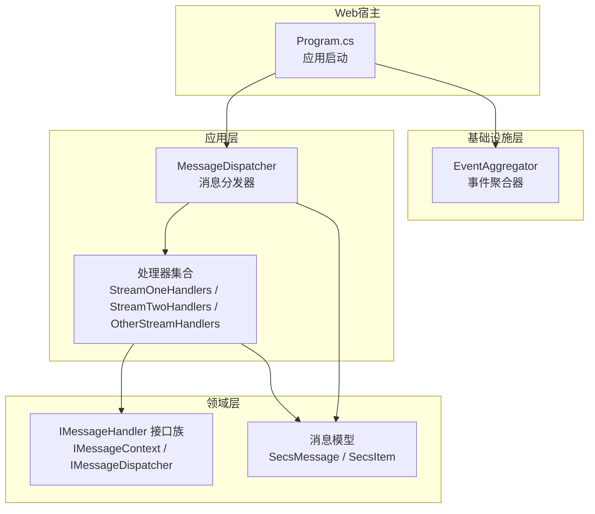
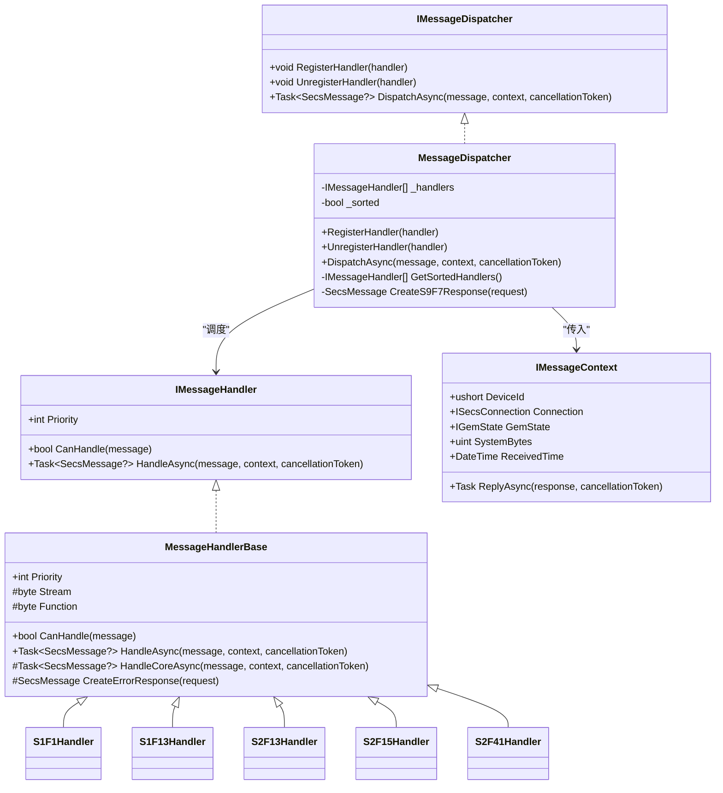
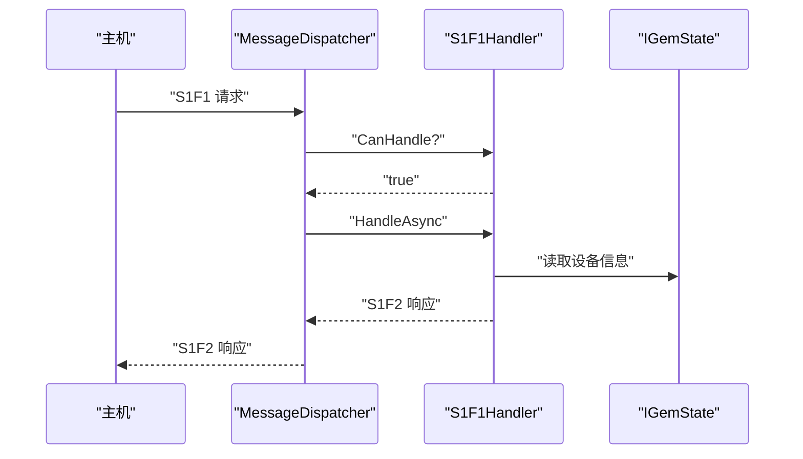
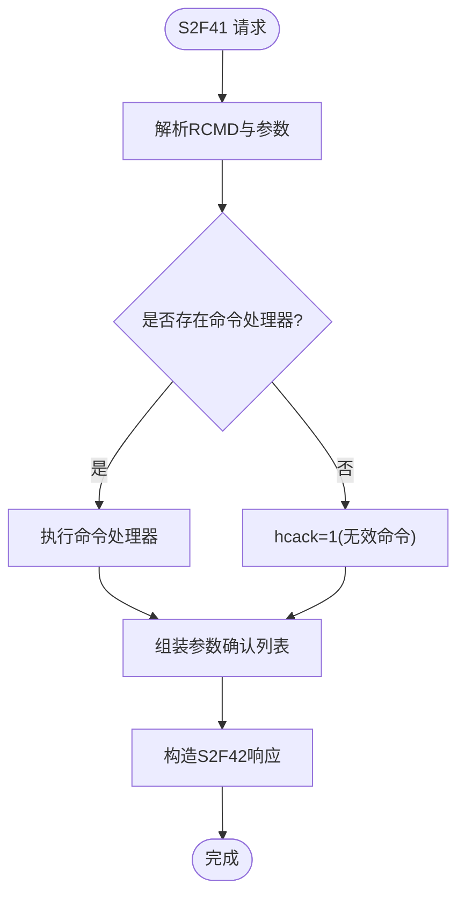
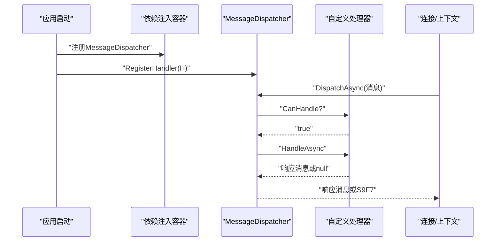
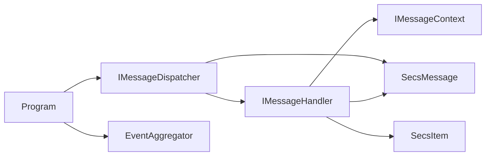

# 自定义消息处理器开发

<cite>
**本文引用的文件**
- [IMessageHandler.cs](file://WebGem/SECS2GEM/Domain/Interfaces/IMessageHandler.cs)
- [MessageDispatcher.cs](file://WebGem/SECS2GEM/Application/Messaging/MessageDispatcher.cs)
- [StreamOneHandlers.cs](file://WebGem/SECS2GEM/Application/Handlers/StreamOneHandlers.cs)
- [StreamTwoHandlers.cs](file://WebGem/SECS2GEM/Application/Handlers/StreamTwoHandlers.cs)
- [OtherStreamHandlers.cs](file://WebGem/SECS2GEM/Application/Handlers/OtherStreamHandlers.cs)
- [SecsMessage.cs](file://WebGem/SECS2GEM/Core/Entities/SecsMessage.cs)
- [EventAggregator.cs](file://WebGem/SECS2GEM/Infrastructure/Services/EventAggregator.cs)
- [RemoteCommand.cs](file://WebGem/SECS2GEM/Domain/Models/RemoteCommand.cs)
- [Program.cs](file://WebGem/WebGem/Program.cs)
</cite>

## 目录
1. [简介](#简介)
2. [项目结构](#项目结构)
3. [核心组件](#核心组件)
4. [架构总览](#架构总览)
5. [详细组件分析](#详细组件分析)
6. [依赖关系分析](#依赖关系分析)
7. [性能考量](#性能考量)
8. [故障排查指南](#故障排查指南)
9. [结论](#结论)
10. [附录](#附录)

## 简介
本指南面向希望在SECS2GEM项目中开发自定义消息处理器的开发者，系统讲解IMessageHandler接口的实现规范与最佳实践，涵盖CanHandle与HandleAsync的职责边界、消息优先级设置、异常处理策略、响应消息构造、处理器生命周期管理与资源清理、以及从接口实现到注册使用的完整开发流程。文档同时提供Stream One与Stream Two处理器的具体实现示例，帮助快速上手。

## 项目结构
SECS2GEM采用分层+领域驱动的设计，消息处理能力集中在Application层的Handlers目录，并通过Application层的MessageDispatcher进行统一调度；核心实体与协议模型位于Core层；事件总线与服务位于Infrastructure层；Web宿主在WebGem项目中提供运行环境。

图表来源
- [MessageDispatcher.cs:1-123](file://WebGem/SECS2GEM/Application/Messaging/MessageDispatcher.cs#L1-L123)
- [StreamOneHandlers.cs:1-211](file://WebGem/SECS2GEM/Application/Handlers/StreamOneHandlers.cs#L1-L211)
- [StreamTwoHandlers.cs:1-331](file://WebGem/SECS2GEM/Application/Handlers/StreamTwoHandlers.cs#L1-L331)
- [OtherStreamHandlers.cs:1-276](file://WebGem/SECS2GEM/Application/Handlers/OtherStreamHandlers.cs#L1-L276)
- [IMessageHandler.cs:1-131](file://WebGem/SECS2GEM/Domain/Interfaces/IMessageHandler.cs#L1-L131)
- [SecsMessage.cs:1-209](file://WebGem/SECS2GEM/Core/Entities/SecsMessage.cs#L1-L209)
- [EventAggregator.cs:1-219](file://WebGem/SECS2GEM/Infrastructure/Services/EventAggregator.cs#L1-L219)
- [Program.cs:1-24](file://WebGem/WebGem/Program.cs#L1-L24)

章节来源
- [MessageDispatcher.cs:1-123](file://WebGem/SECS2GEM/Application/Messaging/MessageDispatcher.cs#L1-L123)
- [IMessageHandler.cs:1-131](file://WebGem/SECS2GEM/Domain/Interfaces/IMessageHandler.cs#L1-L131)
- [Program.cs:1-24](file://WebGem/WebGem/Program.cs#L1-L24)

## 核心组件
- IMessageHandler接口：定义处理器的优先级、CanHandle判定与HandleAsync处理逻辑，支持按Stream/Function组合的策略式路由。
- IMessageContext上下文：提供设备ID、当前连接、GEM状态、SystemBytes、ReceivedTime以及ReplyAsync发送响应的能力。
- IMessageDispatcher分发器：维护处理器列表，按Priority排序，使用责任链+策略模式定位首个CanHandle的消息处理器并委托执行。
- SecsMessage消息模型：封装Stream/Function/WBit/Item等协议字段，提供CreateReply便捷方法与常用工厂方法。

章节来源
- [IMessageHandler.cs:63-88](file://WebGem/SECS2GEM/Domain/Interfaces/IMessageHandler.cs#L63-L88)
- [IMessageHandler.cs:15-48](file://WebGem/SECS2GEM/Domain/Interfaces/IMessageHandler.cs#L15-L48)
- [IMessageHandler.cs:104-129](file://WebGem/SECS2GEM/Domain/Interfaces/IMessageHandler.cs#L104-L129)
- [MessageDispatcher.cs:27-91](file://WebGem/SECS2GEM/Application/Messaging/MessageDispatcher.cs#L27-L91)
- [SecsMessage.cs:18-120](file://WebGem/SECS2GEM/Core/Entities/SecsMessage.cs#L18-L120)

## 架构总览
消息处理遵循“接口抽象 + 责任链 + 策略 + 模板方法”的组合架构：
- IMessageHandler定义处理契约；
- MessageDispatcher维护处理器集合，按Priority排序后顺序匹配CanHandle；
- MessageHandlerBase提供模板方法骨架，统一异常捕获与错误响应生成；
- 具体处理器（如S1F1、S2F13等）仅需实现目标Stream/Function与核心业务逻辑。

图表来源
- [IMessageHandler.cs:63-88](file://WebGem/SECS2GEM/Domain/Interfaces/IMessageHandler.cs#L63-L88)
- [IMessageHandler.cs:104-129](file://WebGem/SECS2GEM/Domain/Interfaces/IMessageHandler.cs#L104-L129)
- [MessageDispatcher.cs:27-121](file://WebGem/SECS2GEM/Application/Messaging/MessageDispatcher.cs#L27-L121)
- [StreamOneHandlers.cs:20-86](file://WebGem/SECS2GEM/Application/Handlers/StreamOneHandlers.cs#L20-L86)
- [StreamTwoHandlers.cs:13-138](file://WebGem/SECS2GEM/Application/Handlers/StreamTwoHandlers.cs#L13-L138)

## 详细组件分析

### IMessageHandler接口实现要求
- Priority属性：数值越小优先级越高，默认值为0，可通过重写调整覆盖默认处理器。
- CanHandle：基于消息的Stream与Function进行精确匹配，确保单一职责与最小耦合。
- HandleAsync：返回响应消息或null（当消息为WBit=false时）。若发生异常且消息需要响应，则应返回S9F7（非法数据）错误响应。

章节来源
- [IMessageHandler.cs:63-88](file://WebGem/SECS2GEM/Domain/Interfaces/IMessageHandler.cs#L63-L88)
- [IMessageHandler.cs:68](file://WebGem/SECS2GEM/Domain/Interfaces/IMessageHandler.cs#L68)
- [IMessageHandler.cs:75](file://WebGem/SECS2GEM/Domain/Interfaces/IMessageHandler.cs#L75)
- [IMessageHandler.cs:84-87](file://WebGem/SECS2GEM/Domain/Interfaces/IMessageHandler.cs#L84-L87)

### MessageHandlerBase模板方法模式
- 统一的CanHandle实现：通过受保护的Stream/Function属性限定目标消息。
- HandleAsync统一捕获异常并根据WBit决定是否返回S9F7错误响应。
- CreateErrorResponse提供标准错误响应构造，便于扩展。
- HandleCoreAsync由子类实现具体业务逻辑，保持模板与业务分离。

章节来源
- [StreamOneHandlers.cs:20-86](file://WebGem/SECS2GEM/Application/Handlers/StreamOneHandlers.cs#L20-L86)

### Stream One处理器示例
- S1F1 Are You There：返回设备型号与软件版本，作为设备存活检测响应。
- S1F13 Establish Communications Request：建立通信，返回COMMACK与设备信息。
- S1F15 Request OFF-LINE：请求离线，返回OFLACK。
- S1F17 Request ON-LINE：请求在线，返回ONLACK并切换至Remote模式。

图表来源
- [StreamOneHandlers.cs:94-114](file://WebGem/SECS2GEM/Application/Handlers/StreamOneHandlers.cs#L94-L114)
- [MessageDispatcher.cs:67-91](file://WebGem/SECS2GEM/Application/Messaging/MessageDispatcher.cs#L67-L91)

章节来源
- [StreamOneHandlers.cs:94-210](file://WebGem/SECS2GEM/Application/Handlers/StreamOneHandlers.cs#L94-L210)

### Stream Two处理器示例
- S2F13 Equipment Constant Request：查询设备常量，支持全量或指定列表查询。
- S2F15 New Equipment Constant Send：设置设备常量，返回EAC确认码。
- S2F29 Equipment Constant Namelist Request：返回设备常量清单（含ID、名称、单位等元数据）。
- S2F33/S2F35/S2F37 Define/Link/Enable Event Report：简化实现，均返回Accepted确认。
- S2F41 Host Command Send：注册远程命令处理函数，按RCMD分派执行并返回HCACK与CPACK列表。

图表来源
- [StreamTwoHandlers.cs:270-330](file://WebGem/SECS2GEM/Application/Handlers/StreamTwoHandlers.cs#L270-L330)

章节来源
- [StreamTwoHandlers.cs:13-193](file://WebGem/SECS2GEM/Application/Handlers/StreamTwoHandlers.cs#L13-L193)
- [StreamTwoHandlers.cs:270-330](file://WebGem/SECS2GEM/Application/Handlers/StreamTwoHandlers.cs#L270-L330)

### 其他流处理器示例
- S5F3/S5F5/S5F7：启用/禁用报警、列出报警等，简化实现返回空列表或Accepted。
- S6F15/S6F19：事件报告请求，返回空报告。
- S7F1/S7F3/S7F5/S7F17/S7F19：配方加载/发送/请求/删除/当前EPPD请求，简化实现返回Accepted或空数据。
- S10F3/S10F5：终端显示请求，简化实现返回Accepted。

章节来源
- [OtherStreamHandlers.cs:1-276](file://WebGem/SECS2GEM/Application/Handlers/OtherStreamHandlers.cs#L1-L276)

### 消息优先级设置
- IMessageHandler.Priority默认为0，数值越小优先级越高。
- MessageDispatcher内部按Priority升序排序，确保高优先级处理器优先匹配。
- 建议：自定义处理器如需覆盖默认行为，应设置更低的Priority值；如需被默认处理器覆盖，应设置更高的Priority值。

章节来源
- [IMessageHandler.cs:68](file://WebGem/SECS2GEM/Domain/Interfaces/IMessageHandler.cs#L68)
- [MessageDispatcher.cs:96-108](file://WebGem/SECS2GEM/Application/Messaging/MessageDispatcher.cs#L96-L108)

### 异常处理策略
- MessageHandlerBase.HandleAsync统一捕获异常，若消息需要响应（WBit=true），返回S9F7（非法数据）错误响应；否则返回null。
- 具体处理器应在HandleCoreAsync中进行业务异常处理，必要时转换为可识别的确认码（如S2F15的EAC、S2F41的HCACK）。

章节来源
- [StreamOneHandlers.cs:53-66](file://WebGem/SECS2GEM/Application/Handlers/StreamOneHandlers.cs#L53-L66)
- [MessageDispatcher.cs:83-91](file://WebGem/SECS2GEM/Application/Messaging/MessageDispatcher.cs#L83-L91)

### 响应消息构造
- 使用SecsMessage构造函数指定Stream/Function/WBit/Item。
- 使用SecsItem工厂方法（如A/I4/U4/F4/F8/Boolean/B/L等）构建数据项。
- 对于需要自动构造响应的场景，可使用SecsMessage.CreateReply便捷方法（仅适用于Primary消息）。

章节来源
- [SecsMessage.cs:93-120](file://WebGem/SECS2GEM/Core/Entities/SecsMessage.cs#L93-L120)
- [SecsMessage.cs:140-206](file://WebGem/SECS2GEM/Core/Entities/SecsMessage.cs#L140-L206)
- [StreamOneHandlers.cs:107-112](file://WebGem/SECS2GEM/Application/Handlers/StreamOneHandlers.cs#L107-L112)
- [StreamTwoHandlers.cs:118](file://WebGem/SECS2GEM/Application/Handlers/StreamTwoHandlers.cs#L118)

### 处理器生命周期管理与资源清理
- 注册与注销：通过MessageDispatcher.RegisterHandler与UnregisterHandler动态管理处理器集合。
- 线程安全：内部使用锁保护处理器列表，排序状态缓存以减少重复排序开销。
- 生命周期建议：处理器应无状态或持有不可变依赖；如需共享资源，应使用单例或依赖注入容器管理。

章节来源
- [MessageDispatcher.cs:37-58](file://WebGem/SECS2GEM/Application/Messaging/MessageDispatcher.cs#L37-L58)
- [MessageDispatcher.cs:96-108](file://WebGem/SECS2GEM/Application/Messaging/MessageDispatcher.cs#L96-L108)

### 完整开发流程（从接口实现到注册使用）
- 步骤1：创建处理器类，继承MessageHandlerBase并重写Stream/Function与HandleCoreAsync。
- 步骤2：在HandleCoreAsync中实现业务逻辑，构造响应消息或返回null。
- 步骤3：根据需要重写Priority以调整匹配优先级。
- 步骤4：在应用启动阶段（如Program.cs所在项目）通过MessageDispatcher.RegisterHandler注册处理器。
- 步骤5：确保上下文IMessageContext可用（设备ID、连接、状态、ReplyAsync等）。
- 步骤6：测试不同消息类型的处理路径，验证异常分支与错误响应。

图表来源
- [MessageDispatcher.cs:37-91](file://WebGem/SECS2GEM/Application/Messaging/MessageDispatcher.cs#L37-L91)
- [StreamOneHandlers.cs:20-86](file://WebGem/SECS2GEM/Application/Handlers/StreamOneHandlers.cs#L20-L86)
- [Program.cs:1-24](file://WebGem/WebGem/Program.cs#L1-L24)

章节来源
- [MessageDispatcher.cs:37-91](file://WebGem/SECS2GEM/Application/Messaging/MessageDispatcher.cs#L37-L91)
- [Program.cs:1-24](file://WebGem/WebGem/Program.cs#L1-L24)

## 依赖关系分析
- IMessageHandler与IMessageContext：处理器通过上下文访问设备状态与连接，实现松耦合。
- MessageDispatcher与IMessageHandler：通过接口解耦，支持动态注册与优先级排序。
- SecsMessage与SecsItem：消息与数据项的不可变设计提升线程安全性与可维护性。
- EventAggregator：与消息处理解耦，适合事件驱动扩展（如触发状态变更事件）。

图表来源
- [IMessageHandler.cs:15-48](file://WebGem/SECS2GEM/Domain/Interfaces/IMessageHandler.cs#L15-L48)
- [IMessageHandler.cs:104-129](file://WebGem/SECS2GEM/Domain/Interfaces/IMessageHandler.cs#L104-L129)
- [MessageDispatcher.cs:27-91](file://WebGem/SECS2GEM/Application/Messaging/MessageDispatcher.cs#L27-L91)
- [SecsMessage.cs:18-120](file://WebGem/SECS2GEM/Core/Entities/SecsMessage.cs#L18-L120)
- [EventAggregator.cs:17-219](file://WebGem/SECS2GEM/Infrastructure/Services/EventAggregator.cs#L17-L219)
- [Program.cs:1-24](file://WebGem/WebGem/Program.cs#L1-L24)

章节来源
- [IMessageHandler.cs:15-48](file://WebGem/SECS2GEM/Domain/Interfaces/IMessageHandler.cs#L15-L48)
- [MessageDispatcher.cs:27-91](file://WebGem/SECS2GEM/Application/Messaging/MessageDispatcher.cs#L27-L91)
- [EventAggregator.cs:17-219](file://WebGem/SECS2GEM/Infrastructure/Services/EventAggregator.cs#L17-L219)

## 性能考量
- 优先级排序：MessageDispatcher内部缓存排序状态，避免重复排序；频繁注册/注销会重置排序标记，建议批量操作。
- 线程安全：处理器列表访问加锁，避免并发修改；处理器实现应尽量无状态，减少锁竞争。
- 异常处理：统一捕获异常并返回S9F7，避免异常传播影响整体吞吐。
- 响应构造：使用SecsItem工厂方法与消息工厂方法，减少字符串拼接与格式转换开销。

## 故障排查指南
- 无处理器响应：检查MessageDispatcher是否注册了对应Stream/Function的处理器，或是否因CanHandle条件未满足导致未命中。
- 错误响应S9F7：确认消息WBit为true且处理器未抛出可恢复异常；必要时在HandleCoreAsync中捕获并返回业务确认码。
- 上下文缺失：确保IMessageContext中的设备ID、连接、状态、ReplyAsync可用；检查依赖注入配置。
- 事件通知：如需事件驱动扩展，使用EventAggregator进行订阅与发布，注意异常隔离与订阅清理。

章节来源
- [MessageDispatcher.cs:83-91](file://WebGem/SECS2GEM/Application/Messaging/MessageDispatcher.cs#L83-L91)
- [StreamOneHandlers.cs:53-66](file://WebGem/SECS2GEM/Application/Handlers/StreamOneHandlers.cs#L53-L66)
- [EventAggregator.cs:168-197](file://WebGem/SECS2GEM/Infrastructure/Services/EventAggregator.cs#L168-L197)

## 结论
通过IMessageHandler接口与MessageDispatcher的组合，SECS2GEM实现了高度可扩展的消息处理框架。遵循模板方法模式与策略模式，开发者可以快速实现自定义处理器，合理设置优先级、处理异常并构造响应消息。结合依赖注入与事件总线，可在不破坏现有代码的前提下灵活扩展设备控制与状态管理能力。

## 附录
- 远程命令模型：RemoteCommandDefinition/CommandParameter/RemoteCommandContext/RemoteCommandResult提供命令注册、参数校验与执行结果的标准化结构，便于S2F41等命令处理器扩展。

章节来源
- [RemoteCommand.cs:9-189](file://WebGem/SECS2GEM/Domain/Models/RemoteCommand.cs#L9-L189)