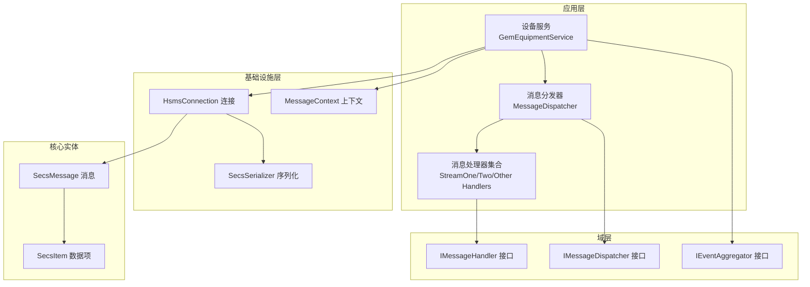
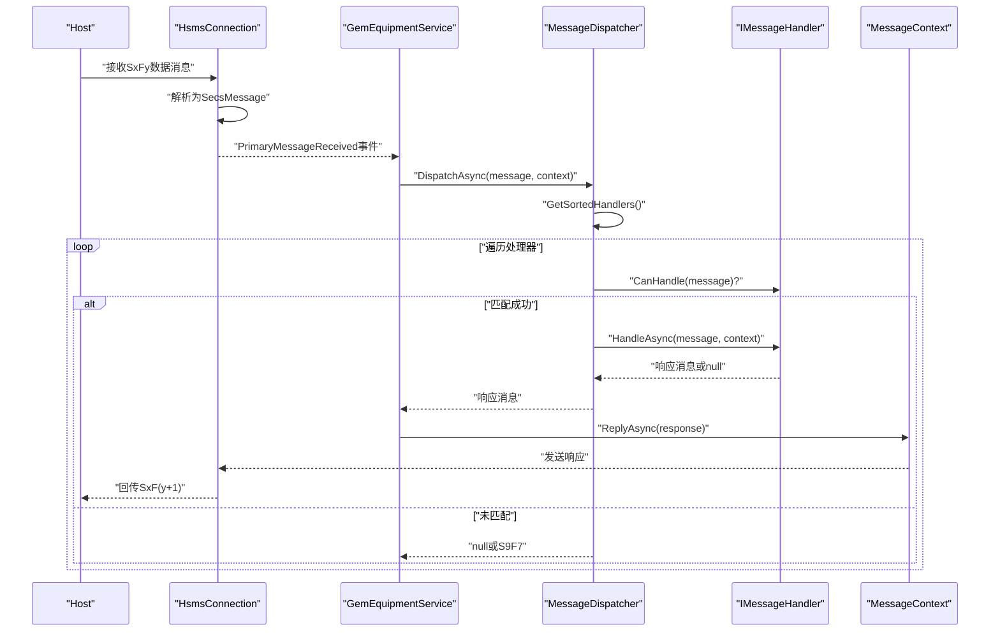
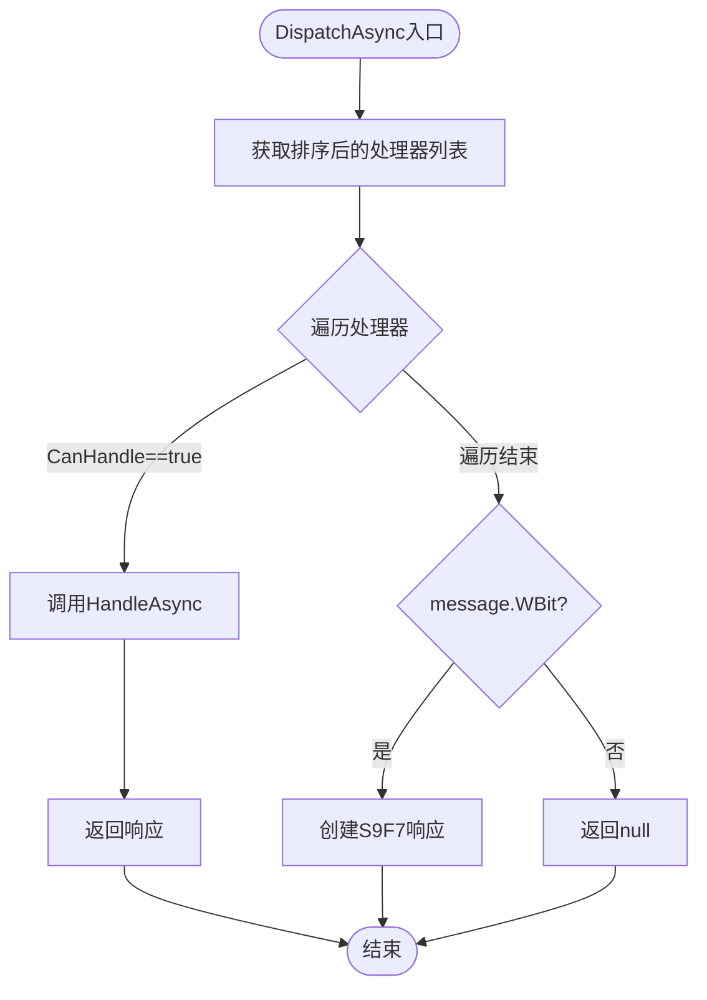
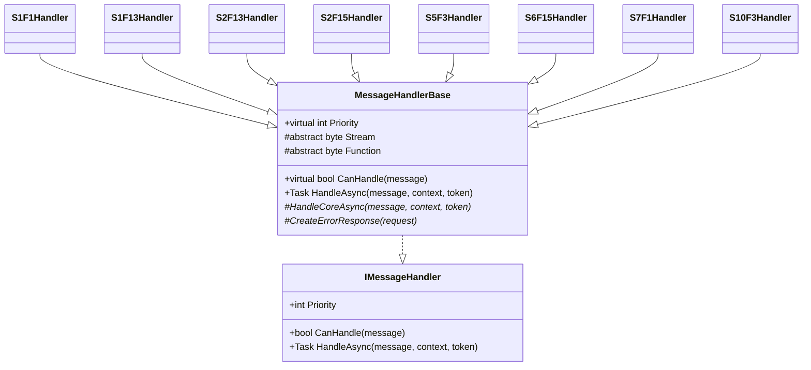
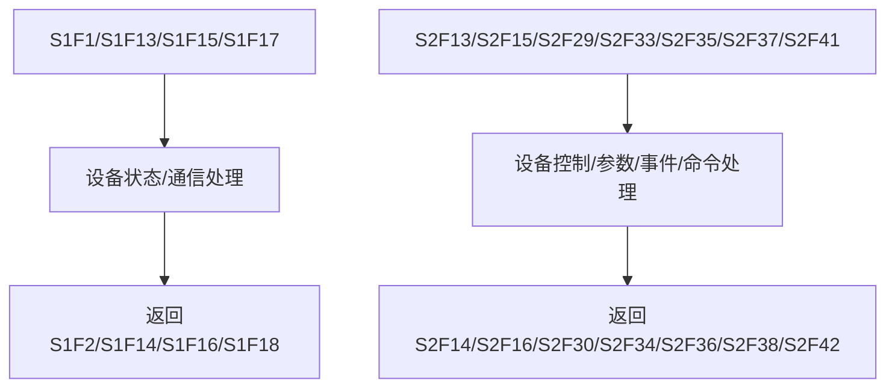
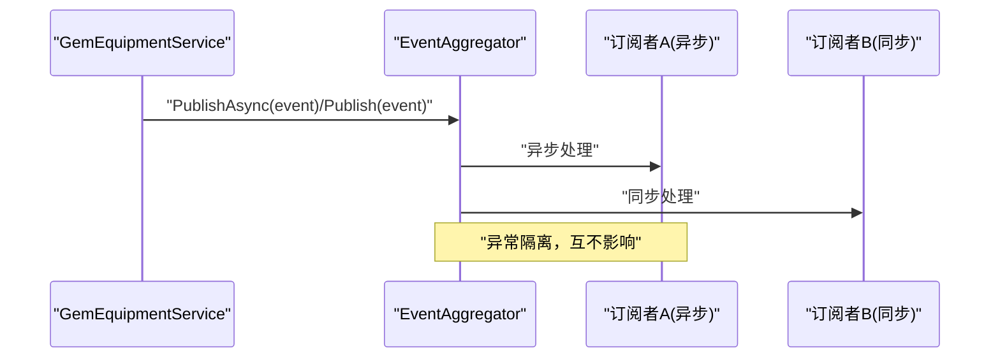
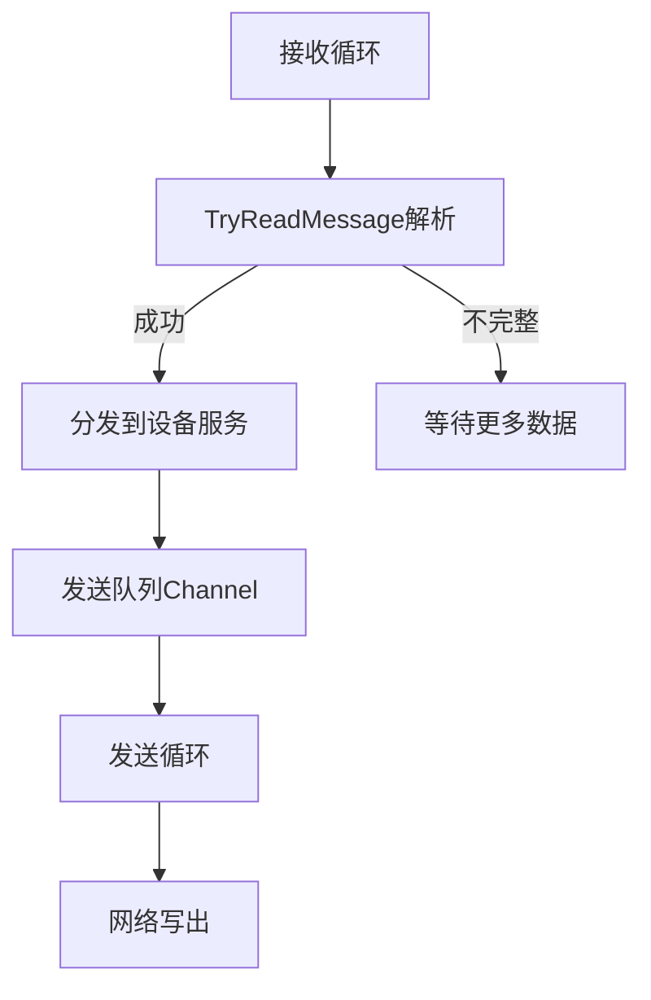
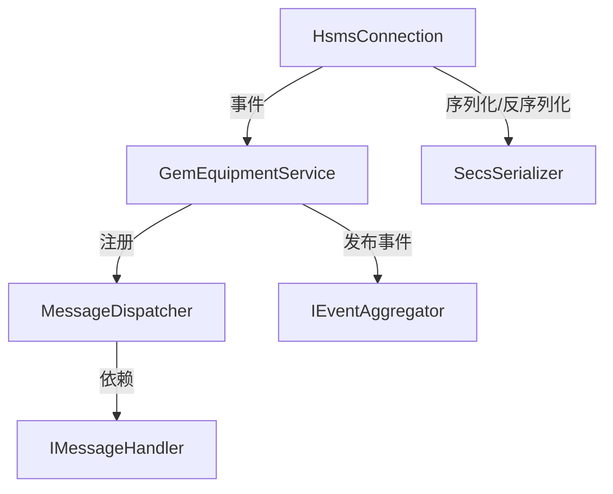

# 高级消息处理

<cite>
**本文引用的文件**   
- [MessageDispatcher.cs](file://WebGem/SECS2GEM/Application/Messaging/MessageDispatcher.cs)
- [IMessageHandler.cs](file://WebGem/SECS2GEM/Domain/Interfaces/IMessageHandler.cs)
- [StreamOneHandlers.cs](file://WebGem/SECS2GEM/Application/Handlers/StreamOneHandlers.cs)
- [StreamTwoHandlers.cs](file://WebGem/SECS2GEM/Application/Handlers/StreamTwoHandlers.cs)
- [OtherStreamHandlers.cs](file://WebGem/SECS2GEM/Application/Handlers/OtherStreamHandlers.cs)
- [SecsMessage.cs](file://WebGem/SECS2GEM/Core/Entities/SecsMessage.cs)
- [MessageContext.cs](file://WebGem/SECS2GEM/Infrastructure/Connection/MessageContext.cs)
- [IEventAggregator.cs](file://WebGem/SECS2GEM/Domain/Interfaces/IEventAggregator.cs)
- [EventAggregator.cs](file://WebGem/SECS2GEM/Infrastructure/Services/EventAggregator.cs)
- [GemEquipmentService.cs](file://WebGem/SECS2GEM/Application/Services/GemEquipmentService.cs)
- [SecsSerializer.cs](file://WebGem/SECS2GEM/Infrastructure/Serialization/SecsSerializer.cs)
- [HsmsConnection.cs](file://WebGem/SECS2GEM/Infrastructure/Connection/HsmsConnection.cs)
- [MessageHandlerTests.cs](file://WebGem/SECS2GEM.Tests/MessageHandlerTests.cs)
- [SecsItem.cs](file://WebGem/SECS2GEM/Core/Entities/SecsItem.cs)
- [HsmsMessageType.cs](file://WebGem/SECS2GEM/Core/Enums/HsmsMessageType.cs)
</cite>

## 目录
1. [简介](#简介)
2. [项目结构](#项目结构)
3. [核心组件](#核心组件)
4. [架构总览](#架构总览)
5. [详细组件分析](#详细组件分析)
6. [依赖关系分析](#依赖关系分析)
7. [性能考量](#性能考量)
8. [故障排查指南](#故障排查指南)
9. [结论](#结论)
10. [附录](#附录)

## 简介
本教程面向SECS2GEM项目中的高级消息处理场景，系统讲解消息分发器的工作机制与路由策略，提供自定义消息处理器的开发指南（IMessageHandler接口实现、处理流程与异常处理），对比Stream One与Stream Two消息类型的处理差异，并给出扩展其他Stream类型处理器的方法。同时涵盖消息优先级管理、批量处理与异步处理的最佳实践，以及性能优化与内存管理策略。

## 项目结构
SECS2GEM采用清晰的分层与职责分离设计：
- 应用层：消息分发器、处理器集合、设备服务
- 域层：接口契约（处理器、分发器、事件聚合器等）
- 基础设施层：连接管理、序列化、事务管理、日志
- 核心实体：SECS消息与数据项模型
- 测试：单元测试验证分发器与处理器行为

**图表来源**
- [GemEquipmentService.cs:33-455](file://WebGem/SECS2GEM/Application/Services/GemEquipmentService.cs#L33-L455)
- [MessageDispatcher.cs:27-121](file://WebGem/SECS2GEM/Application/Messaging/MessageDispatcher.cs#L27-L121)
- [IMessageHandler.cs:63-129](file://WebGem/SECS2GEM/Domain/Interfaces/IMessageHandler.cs#L63-L129)
- [HsmsConnection.cs:30-800](file://WebGem/SECS2GEM/Infrastructure/Connection/HsmsConnection.cs#L30-L800)
- [SecsSerializer.cs:27-662](file://WebGem/SECS2GEM/Infrastructure/Serialization/SecsSerializer.cs#L27-L662)
- [MessageContext.cs:12-64](file://WebGem/SECS2GEM/Infrastructure/Connection/MessageContext.cs#L12-L64)
- [SecsMessage.cs:18-209](file://WebGem/SECS2GEM/Core/Entities/SecsMessage.cs#L18-L209)
- [SecsItem.cs:23-480](file://WebGem/SECS2GEM/Core/Entities/SecsItem.cs#L23-L480)

**章节来源**
- [GemEquipmentService.cs:33-455](file://WebGem/SECS2GEM/Application/Services/GemEquipmentService.cs#L33-L455)
- [MessageDispatcher.cs:27-121](file://WebGem/SECS2GEM/Application/Messaging/MessageDispatcher.cs#L27-L121)
- [IMessageHandler.cs:63-129](file://WebGem/SECS2GEM/Domain/Interfaces/IMessageHandler.cs#L63-L129)
- [HsmsConnection.cs:30-800](file://WebGem/SECS2GEM/Infrastructure/Connection/HsmsConnection.cs#L30-L800)
- [SecsSerializer.cs:27-662](file://WebGem/SECS2GEM/Infrastructure/Serialization/SecsSerializer.cs#L27-L662)
- [MessageContext.cs:12-64](file://WebGem/SECS2GEM/Infrastructure/Connection/MessageContext.cs#L12-L64)
- [SecsMessage.cs:18-209](file://WebGem/SECS2GEM/Core/Entities/SecsMessage.cs#L18-L209)
- [SecsItem.cs:23-480](file://WebGem/SECS2GEM/Core/Entities/SecsItem.cs#L23-L480)

## 核心组件
- 消息分发器（MessageDispatcher）：维护处理器列表，按优先级排序，责任链+策略模式结合，支持动态注册/注销处理器，未匹配时根据W-Bit返回S9F7或空响应。
- 消息处理器（IMessageHandler）：策略接口，定义CanHandle与HandleAsync；MessageHandlerBase提供模板方法，统一异常处理与S9F7错误响应。
- Stream处理器：按Stream/Function划分（S1/S2/其他），每个处理器专注单一消息类型。
- 设备服务（GemEquipmentService）：外观模式整合连接、分发、状态与事件聚合，自动注册默认处理器，桥接消息接收与响应。
- 连接与序列化（HsmsConnection/SecsSerializer）：负责网络收发、事务管理、心跳、消息解析与构建。
- 上下文（MessageContext）：封装设备ID、连接、状态、SystemBytes与回复能力。

**章节来源**
- [MessageDispatcher.cs:27-121](file://WebGem/SECS2GEM/Application/Messaging/MessageDispatcher.cs#L27-L121)
- [IMessageHandler.cs:63-129](file://WebGem/SECS2GEM/Domain/Interfaces/IMessageHandler.cs#L63-L129)
- [StreamOneHandlers.cs:20-86](file://WebGem/SECS2GEM/Application/Handlers/StreamOneHandlers.cs#L20-L86)
- [StreamTwoHandlers.cs:13-330](file://WebGem/SECS2GEM/Application/Handlers/StreamTwoHandlers.cs#L13-L330)
- [OtherStreamHandlers.cs:9-275](file://WebGem/SECS2GEM/Application/Handlers/OtherStreamHandlers.cs#L9-L275)
- [GemEquipmentService.cs:33-455](file://WebGem/SECS2GEM/Application/Services/GemEquipmentService.cs#L33-L455)
- [HsmsConnection.cs:30-800](file://WebGem/SECS2GEM/Infrastructure/Connection/HsmsConnection.cs#L30-L800)
- [SecsSerializer.cs:27-662](file://WebGem/SECS2GEM/Infrastructure/Serialization/SecsSerializer.cs#L27-L662)
- [MessageContext.cs:12-64](file://WebGem/SECS2GEM/Infrastructure/Connection/MessageContext.cs#L12-L64)

## 架构总览
SECS消息在连接层被解析为高层对象，随后由设备服务触发分发器，分发器按优先级顺序匹配处理器，处理器完成业务处理并返回响应（若需要）。连接层负责将响应序列化并通过网络发送。

**图表来源**
- [GemEquipmentService.cs:343-358](file://WebGem/SECS2GEM/Application/Services/GemEquipmentService.cs#L343-L358)
- [MessageDispatcher.cs:67-91](file://WebGem/SECS2GEM/Application/Messaging/MessageDispatcher.cs#L67-L91)
- [IMessageHandler.cs:75-87](file://WebGem/SECS2GEM/Domain/Interfaces/IMessageHandler.cs#L75-L87)
- [MessageContext.cs:59-62](file://WebGem/SECS2GEM/Infrastructure/Connection/MessageContext.cs#L59-L62)
- [HsmsConnection.cs:797-800](file://WebGem/SECS2GEM/Infrastructure/Connection/HsmsConnection.cs#L797-L800)

## 详细组件分析

### 消息分发器（MessageDispatcher）
- 机制：维护处理器列表，首次访问时按优先级排序；遍历处理器调用CanHandle，首个匹配即委托HandleAsync；未匹配时根据W-Bit决定返回S9F7或null。
- 线程安全：内部锁保护处理器列表与排序标记，避免并发修改。
- 性能：排序缓存（_sorted标志）减少重复排序；每次GetSortedHandlers返回副本，避免外部并发修改。

**图表来源**
- [MessageDispatcher.cs:67-91](file://WebGem/SECS2GEM/Application/Messaging/MessageDispatcher.cs#L67-L91)
- [MessageDispatcher.cs:96-108](file://WebGem/SECS2GEM/Application/Messaging/MessageDispatcher.cs#L96-L108)
- [MessageDispatcher.cs:113-120](file://WebGem/SECS2GEM/Application/Messaging/MessageDispatcher.cs#L113-L120)

**章节来源**
- [MessageDispatcher.cs:27-121](file://WebGem/SECS2GEM/Application/Messaging/MessageDispatcher.cs#L27-L121)

### 消息处理器接口与基类（IMessageHandler、MessageHandlerBase）
- IMessageHandler：定义优先级、CanHandle、HandleAsync；分发器据此匹配与执行。
- MessageHandlerBase：模板方法模式，统一异常捕获与S9F7错误响应；子类仅实现HandleCoreAsync。
- 错误处理：异常时若W-Bit为真则返回S9F7，否则返回null；避免异常传播影响整体流程。

**图表来源**
- [IMessageHandler.cs:63-88](file://WebGem/SECS2GEM/Domain/Interfaces/IMessageHandler.cs#L63-L88)
- [StreamOneHandlers.cs:20-86](file://WebGem/SECS2GEM/Application/Handlers/StreamOneHandlers.cs#L20-L86)
- [StreamTwoHandlers.cs:13-330](file://WebGem/SECS2GEM/Application/Handlers/StreamTwoHandlers.cs#L13-L330)
- [OtherStreamHandlers.cs:9-275](file://WebGem/SECS2GEM/Application/Handlers/OtherStreamHandlers.cs#L9-L275)

**章节来源**
- [IMessageHandler.cs:63-129](file://WebGem/SECS2GEM/Domain/Interfaces/IMessageHandler.cs#L63-L129)
- [StreamOneHandlers.cs:20-86](file://WebGem/SECS2GEM/Application/Handlers/StreamOneHandlers.cs#L20-L86)
- [StreamTwoHandlers.cs:13-330](file://WebGem/SECS2GEM/Application/Handlers/StreamTwoHandlers.cs#L13-L330)
- [OtherStreamHandlers.cs:9-275](file://WebGem/SECS2GEM/Application/Handlers/OtherStreamHandlers.cs#L9-L275)

### Stream One 与 Stream Two 处理差异
- Stream One（S1）：设备状态与通信建立相关，典型消息如Are You There（S1F1）、建立通信（S1F13）、请求离线/在线（S1F15/S1F17）。处理器直接返回设备型号与版本、通信确认码等。
- Stream Two（S2）：设备控制与参数管理，典型消息如查询/设置设备常量（S2F13/S2F15）、事件报告定义/链接/启停（S2F33/S2F35/S2F37）、主机命令（S2F41）。处理器涉及状态查询、参数提取与ACK返回。

**图表来源**
- [StreamOneHandlers.cs:94-210](file://WebGem/SECS2GEM/Application/Handlers/StreamOneHandlers.cs#L94-L210)
- [StreamTwoHandlers.cs:13-330](file://WebGem/SECS2GEM/Application/Handlers/StreamTwoHandlers.cs#L13-L330)

**章节来源**
- [StreamOneHandlers.cs:94-210](file://WebGem/SECS2GEM/Application/Handlers/StreamOneHandlers.cs#L94-L210)
- [StreamTwoHandlers.cs:13-330](file://WebGem/SECS2GEM/Application/Handlers/StreamTwoHandlers.cs#L13-L330)

### 自定义消息处理器开发指南
- 实现步骤
  - 继承MessageHandlerBase或直接实现IMessageHandler。
  - 指定Stream与Function，重写CanHandle；在HandleCoreAsync中实现业务逻辑。
  - 使用MessageContext访问设备状态、连接与回复能力；必要时通过ReplyAsync发送响应。
  - 若发生异常且消息要求响应（W-Bit），MessageHandlerBase会自动返回S9F7。
- 优先级管理
  - 通过Priority属性控制处理器优先级（数值越小优先级越高）；分发器按优先级排序后匹配。
- 异常处理
  - 建议在HandleCoreAsync中捕获并记录异常；若需要错误响应，确保W-Bit为true。
- 扩展其他Stream类型
  - 在对应文件中新增处理器类，或在设备服务中注册自定义处理器；注意与默认处理器的优先级协调。

**章节来源**
- [IMessageHandler.cs:63-88](file://WebGem/SECS2GEM/Domain/Interfaces/IMessageHandler.cs#L63-L88)
- [StreamOneHandlers.cs:20-86](file://WebGem/SECS2GEM/Application/Handlers/StreamOneHandlers.cs#L20-L86)
- [MessageContext.cs:12-64](file://WebGem/SECS2GEM/Infrastructure/Connection/MessageContext.cs#L12-L64)
- [GemEquipmentService.cs:448-451](file://WebGem/SECS2GEM/Application/Services/GemEquipmentService.cs#L448-L451)

### 设备服务与事件聚合（GemEquipmentService、EventAggregator）
- 设备服务（GemEquipmentService）：作为外观，负责启动连接、注册默认处理器、分发消息、发送事件与报警、发布状态变化事件。
- 事件聚合（EventAggregator）：观察者模式实现，支持异步/同步订阅，异常隔离，避免单个订阅者异常影响其他订阅者。

**图表来源**
- [GemEquipmentService.cs:343-358](file://WebGem/SECS2GEM/Application/Services/GemEquipmentService.cs#L343-L358)
- [EventAggregator.cs:25-67](file://WebGem/SECS2GEM/Infrastructure/Services/EventAggregator.cs#L25-L67)
- [IEventAggregator.cs:22-65](file://WebGem/SECS2GEM/Domain/Interfaces/IEventAggregator.cs#L22-L65)

**章节来源**
- [GemEquipmentService.cs:33-455](file://WebGem/SECS2GEM/Application/Services/GemEquipmentService.cs#L33-L455)
- [EventAggregator.cs:17-219](file://WebGem/SECS2GEM/Infrastructure/Services/EventAggregator.cs#L17-L219)
- [IEventAggregator.cs:22-65](file://WebGem/SECS2GEM/Domain/Interfaces/IEventAggregator.cs#L22-L65)

### 连接与序列化（HsmsConnection、SecsSerializer）
- HsmsConnection：状态机驱动的网络层，使用Channel实现异步发送队列，支持主动/被动模式、心跳、事务管理与消息日志。
- SecsSerializer：实现HSMS与SECS-II消息的序列化/反序列化，支持多种数据格式与长度编码，提供TryReadMessage以流式解析。

**图表来源**
- [HsmsConnection.cs:550-610](file://WebGem/SECS2GEM/Infrastructure/Connection/HsmsConnection.cs#L550-L610)
- [SecsSerializer.cs:139-177](file://WebGem/SECS2GEM/Infrastructure/Serialization/SecsSerializer.cs#L139-L177)

**章节来源**
- [HsmsConnection.cs:30-800](file://WebGem/SECS2GEM/Infrastructure/Connection/HsmsConnection.cs#L30-L800)
- [SecsSerializer.cs:27-662](file://WebGem/SECS2GEM/Infrastructure/Serialization/SecsSerializer.cs#L27-L662)

## 依赖关系分析
- 松耦合：分发器与处理器通过接口解耦；处理器间互不感知。
- 动态注册：运行时可注册/注销处理器，便于扩展与热插拔。
- 优先级与覆盖：通过优先级实现默认行为与覆盖策略。
- 事件驱动：设备服务通过事件聚合器发布状态与消息事件，便于观测与扩展。

**图表来源**
- [MessageDispatcher.cs:27-121](file://WebGem/SECS2GEM/Application/Messaging/MessageDispatcher.cs#L27-L121)
- [IMessageHandler.cs:63-129](file://WebGem/SECS2GEM/Domain/Interfaces/IMessageHandler.cs#L63-L129)
- [GemEquipmentService.cs:407-443](file://WebGem/SECS2GEM/Application/Services/GemEquipmentService.cs#L407-L443)
- [IEventAggregator.cs:22-65](file://WebGem/SECS2GEM/Domain/Interfaces/IEventAggregator.cs#L22-L65)
- [HsmsConnection.cs:30-800](file://WebGem/SECS2GEM/Infrastructure/Connection/HsmsConnection.cs#L30-L800)
- [SecsSerializer.cs:27-662](file://WebGem/SECS2GEM/Infrastructure/Serialization/SecsSerializer.cs#L27-L662)

**章节来源**
- [MessageDispatcher.cs:27-121](file://WebGem/SECS2GEM/Application/Messaging/MessageDispatcher.cs#L27-L121)
- [GemEquipmentService.cs:407-443](file://WebGem/SECS2GEM/Application/Services/GemEquipmentService.cs#L407-L443)
- [IEventAggregator.cs:22-65](file://WebGem/SECS2GEM/Domain/Interfaces/IEventAggregator.cs#L22-L65)
- [HsmsConnection.cs:30-800](file://WebGem/SECS2GEM/Infrastructure/Connection/HsmsConnection.cs#L30-L800)
- [SecsSerializer.cs:27-662](file://WebGem/SECS2GEM/Infrastructure/Serialization/SecsSerializer.cs#L27-L662)

## 性能考量
- 分发器
  - 优先级排序缓存：避免重复排序，提升匹配效率。
  - 处理器列表副本：GetSortedHandlers返回副本，避免外部并发修改导致的锁竞争。
- 序列化/反序列化
  - 使用Span与预分配缓冲区，减少GC压力；TryReadMessage支持流式解析，降低内存峰值。
  - 大消息限制（MaxMessageSize）防止异常消息占用过多内存。
- 异步与并发
  - 发送队列使用Channel实现无锁并发；接收/发送/心跳三任务分离，避免阻塞。
  - 事件聚合器异步发布，异常隔离，避免单点故障。
- 批量处理
  - 建议在应用层聚合多条同类型请求，减少处理器调用次数与上下文切换。
- 内存管理
  - 使用不可变数据结构（SecsMessage/SecsItem）减少拷贝与竞态；及时释放大对象与缓冲区。
  - 控制日志级别与消息大小，避免日志成为瓶颈。

[本节为通用指导，无需特定文件引用]

## 故障排查指南
- 未匹配处理器
  - 症状：返回S9F7或null。
  - 排查：确认处理器是否注册、CanHandle条件是否满足、优先级是否过低导致被更高优先级覆盖。
- 异常导致无响应
  - 症状：消息无响应或S9F7。
  - 排查：检查MessageHandlerBase的异常捕获逻辑；确保W-Bit为true时应返回S9F7。
- 事件未触发
  - 症状：订阅者未收到事件。
  - 排查：确认事件聚合器订阅是否正确；检查异常隔离是否吞掉异常；验证事件类型与泛型约束。
- 连接问题
  - 症状：心跳失败、T7超时、Select失败。
  - 排查：检查网络连通性、防火墙、配置参数（T7/T6/Linktest间隔）；查看连接状态事件。

**章节来源**
- [MessageHandlerTests.cs:165-220](file://WebGem/SECS2GEM.Tests/MessageHandlerTests.cs#L165-L220)
- [MessageDispatcher.cs:83-91](file://WebGem/SECS2GEM/Application/Messaging/MessageDispatcher.cs#L83-L91)
- [EventAggregator.cs:170-197](file://WebGem/SECS2GEM/Infrastructure/Services/EventAggregator.cs#L170-L197)
- [HsmsConnection.cs:280-296](file://WebGem/SECS2GEM/Infrastructure/Connection/HsmsConnection.cs#L280-L296)

## 结论
SECS2GEM的消息处理体系以分发器为核心，结合策略与模板方法模式实现高度可扩展与可维护的处理器架构。通过优先级管理、动态注册与事件驱动，系统既能快速响应标准消息，也能灵活扩展新类型。配合高性能的序列化与异步连接层，可在工业场景中稳定高效地处理大量SECS-II消息。

[本节为总结，无需特定文件引用]

## 附录
- Stream类型与典型消息
  - S1：Are You There（S1F1）、建立通信（S1F13）、请求离线/在线（S1F15/S1F17）
  - S2：设备常量查询/设置（S2F13/S2F15）、事件报告（S2F33/S2F35/S2F37）、主机命令（S2F41）
  - 其他：报警（S5F3/S5F5/S5F7）、事件报告请求（S6F15/S6F19）、配方管理（S7F1/S7F3/S7F5/S7F17/S7F19）、终端显示（S10F3/S10F5）
- 数据模型
  - SecsMessage：封装Stream/Function/W-Bit与数据项，提供响应消息工厂方法。
  - SecsItem：不可变数据项，支持递归结构与多种格式，提供类型安全的访问器。

**章节来源**
- [SecsMessage.cs:18-209](file://WebGem/SECS2GEM/Core/Entities/SecsMessage.cs#L18-L209)
- [SecsItem.cs:23-480](file://WebGem/SECS2GEM/Core/Entities/SecsItem.cs#L23-L480)
- [HsmsMessageType.cs:10-67](file://WebGem/SECS2GEM/Core/Enums/HsmsMessageType.cs#L10-L67)