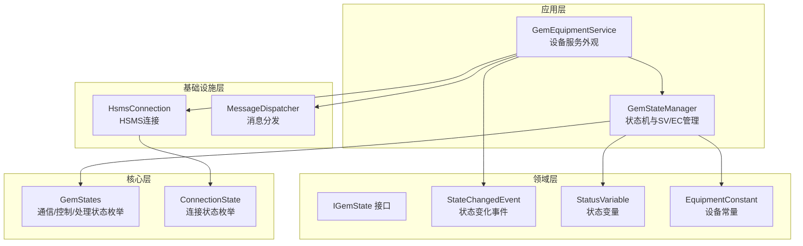
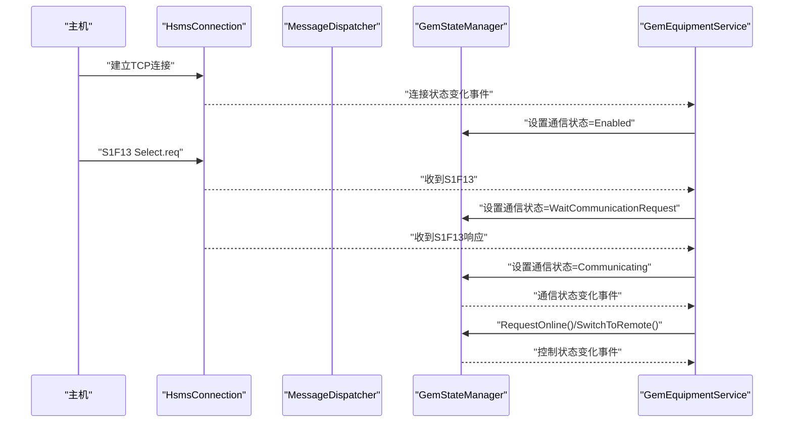
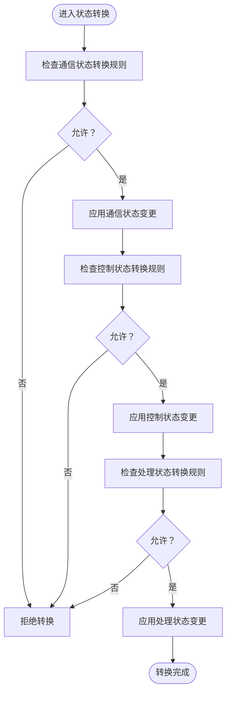
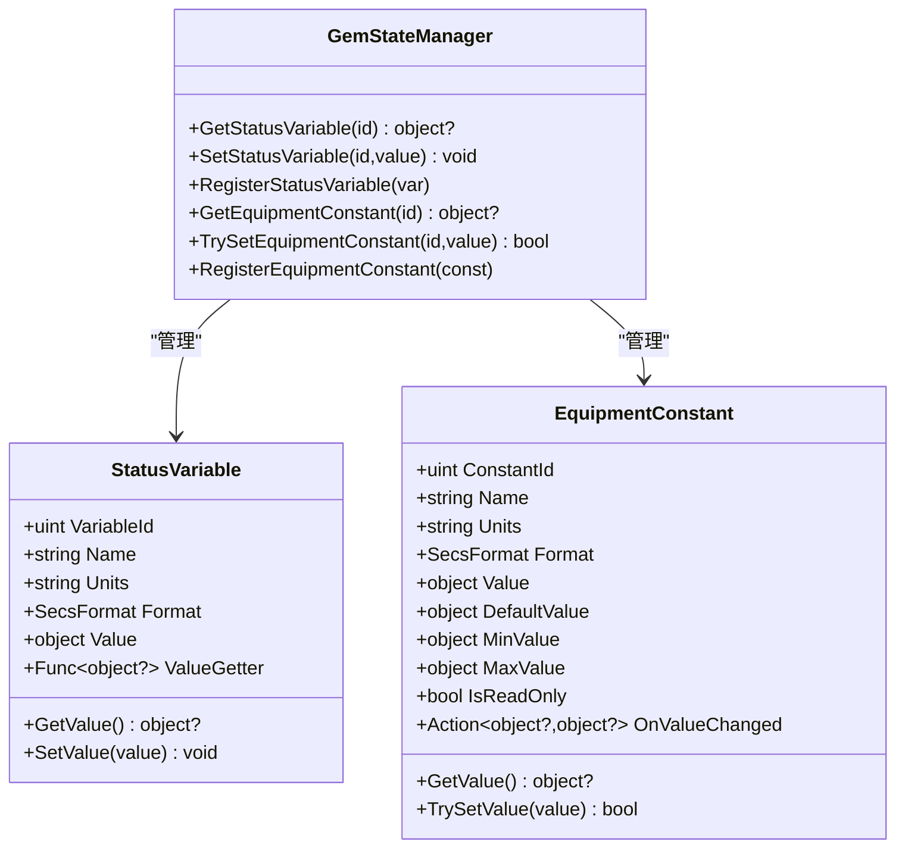
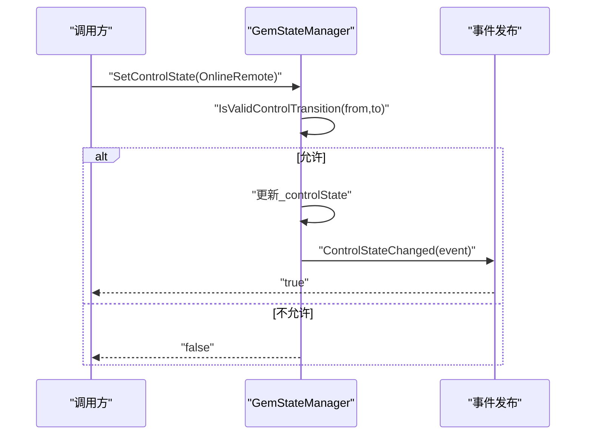
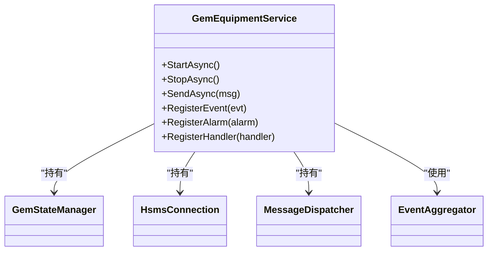
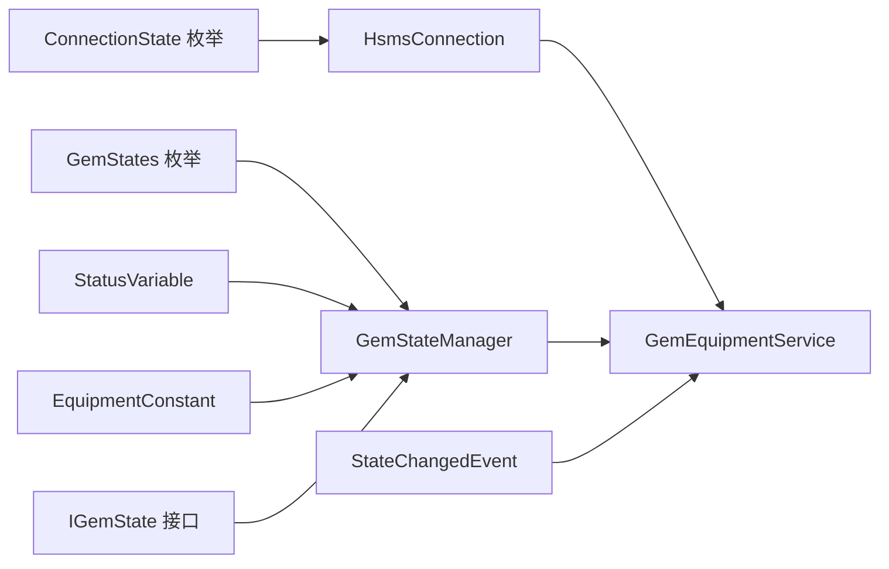

# 高级状态管理

<cite>
**本文引用的文件**
- [GemStateManager.cs](file://WebGem/SECS2GEM/Application/State/GemStateManager.cs)
- [GemStates.cs](file://WebGem/SECS2GEM/Core/Enums/GemStates.cs)
- [StatusVariable.cs](file://WebGem/SECS2GEM/Domain/Models/StatusVariable.cs)
- [EquipmentConstant.cs](file://WebGem/SECS2GEM/Domain/Models/EquipmentConstant.cs)
- [ConnectionState.cs](file://WebGem/SECS2GEM/Core/Enums/ConnectionState.cs)
- [IGemState.cs](file://WebGem/SECS2GEM/Domain/Interfaces/IGemState.cs)
- [StateChangedEvent.cs](file://WebGem/SECS2GEM/Domain/Events/StateChangedEvent.cs)
- [GemEquipmentService.cs](file://WebGem/SECS2GEM/Application/Services/GemEquipmentService.cs)
- [IGemEquipmentService.cs](file://WebGem/SECS2GEM/Domain/Interfaces/IGemEquipmentService.cs)
- [GemStateManagerTests.cs](file://WebGem/SECS2GEM.Tests/GemStateManagerTests.cs)
</cite>

## 目录
1. [简介](#简介)
2. [项目结构](#项目结构)
3. [核心组件](#核心组件)
4. [架构总览](#架构总览)
5. [详细组件分析](#详细组件分析)
6. [依赖关系分析](#依赖关系分析)
7. [性能考量](#性能考量)
8. [故障排查指南](#故障排查指南)
9. [结论](#结论)
10. [附录](#附录)

## 简介
本教程面向SECS2GEM项目中的高级状态管理，系统讲解GEM状态机的实现原理与最佳实践，覆盖通信状态、控制状态与处理状态的完整转换逻辑；详解状态变量（SV）与设备常量（EC）的注册、管理与访问机制；提供自定义状态变量的开发指南（数据类型支持、值获取器与设置器实现）；解释状态转换验证的规则与约束，并给出扩展状态机以适配特定工业设备需求的方法；最后总结状态监控、状态持久化与状态同步的最佳实践。

## 项目结构
SECS2GEM采用分层与模块化组织：
- 应用层：状态管理器、设备服务、消息分发与事件聚合
- 领域层：状态接口、事件模型、状态变量与设备常量模型
- 核心层：枚举（状态、连接、格式）、实体（SECS消息与数据项）
- 基础设施层：连接、序列化、日志等

图表来源
- [GemStateManager.cs:22-492](file://WebGem/SECS2GEM/Application/State/GemStateManager.cs#L22-L492)
- [GemEquipmentService.cs:33-456](file://WebGem/SECS2GEM/Application/Services/GemEquipmentService.cs#L33-L456)
- [IGemState.cs:20-166](file://WebGem/SECS2GEM/Domain/Interfaces/IGemState.cs#L20-L166)
- [GemStates.cs:10-121](file://WebGem/SECS2GEM/Core/Enums/GemStates.cs#L10-L121)
- [ConnectionState.cs:10-41](file://WebGem/SECS2GEM/Core/Enums/ConnectionState.cs#L10-L41)

章节来源
- [GemStateManager.cs:22-492](file://WebGem/SECS2GEM/Application/State/GemStateManager.cs#L22-L492)
- [GemEquipmentService.cs:33-456](file://WebGem/SECS2GEM/Application/Services/GemEquipmentService.cs#L33-L456)
- [IGemState.cs:20-166](file://WebGem/SECS2GEM/Domain/Interfaces/IGemState.cs#L20-L166)
- [GemStates.cs:10-121](file://WebGem/SECS2GEM/Core/Enums/GemStates.cs#L10-L121)
- [ConnectionState.cs:10-41](file://WebGem/SECS2GEM/Core/Enums/ConnectionState.cs#L10-L41)

## 核心组件
- 状态管理器（GemStateManager）：封装三态（通信/控制/处理），提供状态转换验证、事件发布、SV/EC注册与访问。
- 设备服务（GemEquipmentService）：外观模式整合连接、消息分发与状态管理，负责生命周期与事件桥接。
- 状态接口（IGemState）：统一暴露状态属性、事件与SV/EC访问能力。
- 状态模型（StatusVariable、EquipmentConstant）：描述SV/EC的元数据、值与校验策略。
- 状态枚举（GemStates、ConnectionState）：定义合法状态与连接生命周期。

章节来源
- [GemStateManager.cs:22-492](file://WebGem/SECS2GEM/Application/State/GemStateManager.cs#L22-L492)
- [IGemState.cs:20-166](file://WebGem/SECS2GEM/Domain/Interfaces/IGemState.cs#L20-L166)
- [StatusVariable.cs:12-61](file://WebGem/SECS2GEM/Domain/Models/StatusVariable.cs#L12-L61)
- [EquipmentConstant.cs:12-122](file://WebGem/SECS2GEM/Domain/Models/EquipmentConstant.cs#L12-L122)
- [GemStates.cs:10-121](file://WebGem/SECS2GEM/Core/Enums/GemStates.cs#L10-L121)
- [ConnectionState.cs:10-41](file://WebGem/SECS2GEM/Core/Enums/ConnectionState.cs#L10-L41)

## 架构总览
下图展示状态管理在整体系统中的位置与交互：

图表来源
- [GemEquipmentService.cs:33-456](file://WebGem/SECS2GEM/Application/Services/GemEquipmentService.cs#L33-L456)
- [GemStateManager.cs:22-492](file://WebGem/SECS2GEM/Application/State/GemStateManager.cs#L22-L492)

章节来源
- [GemEquipmentService.cs:33-456](file://WebGem/SECS2GEM/Application/Services/GemEquipmentService.cs#L33-L456)
- [GemStateManager.cs:22-492](file://WebGem/SECS2GEM/Application/State/GemStateManager.cs#L22-L492)

## 详细组件分析

### GEM状态机与转换验证
- 通信状态（Disabled/Enabled/WaitCommunicationRequest/WaitCommunicationDelay/Communicating）
- 控制状态（EquipmentOffline/AttemptOnline/HostOffline/OnlineLocal/OnlineRemote）
- 处理状态（Idle/Setup/Ready/Executing/Paused）

转换验证通过“模式匹配”实现，严格限定允许的转换路径，避免非法状态跃迁。

图表来源
- [GemStateManager.cs:357-455](file://WebGem/SECS2GEM/Application/State/GemStateManager.cs#L357-L455)

章节来源
- [GemStateManager.cs:357-455](file://WebGem/SECS2GEM/Application/State/GemStateManager.cs#L357-L455)
- [GemStates.cs:10-121](file://WebGem/SECS2GEM/Core/Enums/GemStates.cs#L10-L121)

### 状态变量（SV）与设备常量（EC）
- 状态变量（SV）：用于实时上报设备状态，可通过S1F3/S1F4查询，S6F11事件上报。
- 设备常量（EC）：用于配置参数，S2F13/S2F14查询，S2F15/S2F16设置。

两者均支持：
- 元数据：ID、名称、单位、数据格式
- 动态值：SV支持ValueGetter，EC支持范围校验与只读控制

图表来源
- [StatusVariable.cs:12-61](file://WebGem/SECS2GEM/Domain/Models/StatusVariable.cs#L12-L61)
- [EquipmentConstant.cs:12-122](file://WebGem/SECS2GEM/Domain/Models/EquipmentConstant.cs#L12-L122)
- [GemStateManager.cs:114-194](file://WebGem/SECS2GEM/Application/State/GemStateManager.cs#L114-L194)

章节来源
- [StatusVariable.cs:12-61](file://WebGem/SECS2GEM/Domain/Models/StatusVariable.cs#L12-L61)
- [EquipmentConstant.cs:12-122](file://WebGem/SECS2GEM/Domain/Models/EquipmentConstant.cs#L12-L122)
- [GemStateManager.cs:114-194](file://WebGem/SECS2GEM/Application/State/GemStateManager.cs#L114-L194)

### 状态转换API与事件
- SetCommunicationState/SetControlState/SetProcessingState：受验证规则保护，失败时不改变状态。
- RequestOnline/SwitchToLocal/SwitchToRemote/RequestOffline：高层操作API，内部驱动状态机。
- 事件：CommunicationStateChanged/ControlStateChanged，便于外部订阅与联动。

图表来源
- [GemStateManager.cs:228-241](file://WebGem/SECS2GEM/Application/State/GemStateManager.cs#L228-L241)
- [GemStateManager.cs:392-420](file://WebGem/SECS2GEM/Application/State/GemStateManager.cs#L392-L420)

章节来源
- [GemStateManager.cs:228-241](file://WebGem/SECS2GEM/Application/State/GemStateManager.cs#L228-L241)
- [GemStateManager.cs:392-420](file://WebGem/SECS2GEM/Application/State/GemStateManager.cs#L392-L420)

### 设备服务与状态机集成
- 设备服务作为外观，组合状态管理器、连接与消息分发。
- 连接状态变化驱动通信状态转换；通信状态变化触发自动上线与模式切换。
- 事件聚合器发布状态变化事件，供上层订阅。

图表来源
- [GemEquipmentService.cs:33-456](file://WebGem/SECS2GEM/Application/Services/GemEquipmentService.cs#L33-L456)

章节来源
- [GemEquipmentService.cs:33-456](file://WebGem/SECS2GEM/Application/Services/GemEquipmentService.cs#L33-L456)

## 依赖关系分析
- 状态管理器依赖状态枚举与模型，提供线程安全的并发访问与事件发布。
- 设备服务依赖状态管理器与连接，负责生命周期与消息分发。
- 事件模型用于跨组件解耦，便于监控与扩展。

图表来源
- [GemStates.cs:10-121](file://WebGem/SECS2GEM/Core/Enums/GemStates.cs#L10-L121)
- [GemStateManager.cs:22-492](file://WebGem/SECS2GEM/Application/State/GemStateManager.cs#L22-L492)
- [StatusVariable.cs:12-61](file://WebGem/SECS2GEM/Domain/Models/StatusVariable.cs#L12-L61)
- [EquipmentConstant.cs:12-122](file://WebGem/SECS2GEM/Domain/Models/EquipmentConstant.cs#L12-L122)
- [IGemState.cs:20-166](file://WebGem/SECS2GEM/Domain/Interfaces/IGemState.cs#L20-L166)
- [ConnectionState.cs:10-41](file://WebGem/SECS2GEM/Core/Enums/ConnectionState.cs#L10-L41)
- [GemEquipmentService.cs:33-456](file://WebGem/SECS2GEM/Application/Services/GemEquipmentService.cs#L33-L456)
- [StateChangedEvent.cs:11-110](file://WebGem/SECS2GEM/Domain/Events/StateChangedEvent.cs#L11-L110)

章节来源
- [GemStateManager.cs:22-492](file://WebGem/SECS2GEM/Application/State/GemStateManager.cs#L22-L492)
- [GemEquipmentService.cs:33-456](file://WebGem/SECS2GEM/Application/Services/GemEquipmentService.cs#L33-L456)
- [IGemState.cs:20-166](file://WebGem/SECS2GEM/Domain/Interfaces/IGemState.cs#L20-L166)
- [GemStates.cs:10-121](file://WebGem/SECS2GEM/Core/Enums/GemStates.cs#L10-L121)
- [ConnectionState.cs:10-41](file://WebGem/SECS2GEM/Core/Enums/ConnectionState.cs#L10-L41)
- [StateChangedEvent.cs:11-110](file://WebGem/SECS2GEM/Domain/Events/StateChangedEvent.cs#L11-L110)

## 性能考量
- 并发安全：状态管理器使用锁保护状态字段与字典访问，保证多线程安全。
- 事件发布：事件在状态变更后同步触发，建议订阅者异步处理以避免阻塞。
- SV/EC访问：字典查找O(1)，动态值获取器应尽量轻量，避免频繁高成本计算。
- 连接与消息：设备服务在连接状态变化时触发状态机转换，注意避免频繁切换导致抖动。

[本节为通用性能指导，无需具体文件引用]

## 故障排查指南
- 状态转换失败：确认当前状态与目标状态是否满足验证规则；检查是否存在非法跃迁。
- 通信状态异常：检查连接状态（NotConnected/Connected/Selected）与通信状态转换链路。
- 控制状态切换无效：确认通信状态为Communicating且当前控制状态允许切换。
- SV/EC访问为空：确认变量是否已注册；SV若使用ValueGetter，确保其返回非空。
- EC设置失败：检查IsReadOnly、范围校验与类型兼容性。

章节来源
- [GemStateManager.cs:357-455](file://WebGem/SECS2GEM/Application/State/GemStateManager.cs#L357-L455)
- [EquipmentConstant.cs:76-96](file://WebGem/SECS2GEM/Domain/Models/EquipmentConstant.cs#L76-L96)
- [GemStateManagerTests.cs:19-365](file://WebGem/SECS2GEM.Tests/GemStateManagerTests.cs#L19-L365)

## 结论
SECS2GEM的状态管理以清晰的三态模型与严格的转换验证为核心，结合SV/EC机制实现了对设备状态与配置的统一管理。通过事件与外观模式，系统实现了良好的可扩展性与可维护性。遵循本文的开发与扩展指南，可在保持协议合规的同时，灵活适配各类工业设备的特殊需求。

[本节为总结性内容，无需具体文件引用]

## 附录

### 自定义状态变量开发指南
- 数据类型支持：通过SecsFormat指定，常见包括ASCII、Unicode、I1/I2/I4/I8、U1/U2/U4/U8、Boolean、Binary等。
- 值获取器（SV）：使用ValueGetter实现动态值，适合时间戳、计数器等需要实时计算的场景。
- 设置器（EC）：使用TrySetValue进行设置，支持最小/最大值校验与只读保护。
- 注册与访问：通过RegisterStatusVariable/RegisterEquipmentConstant注册，使用GetStatusVariable/TrySetEquipmentConstant访问。

章节来源
- [StatusVariable.cs:12-61](file://WebGem/SECS2GEM/Domain/Models/StatusVariable.cs#L12-L61)
- [EquipmentConstant.cs:12-122](file://WebGem/SECS2GEM/Domain/Models/EquipmentConstant.cs#L12-L122)
- [GemStateManager.cs:114-194](file://WebGem/SECS2GEM/Application/State/GemStateManager.cs#L114-L194)

### 状态转换验证规则与约束
- 通信状态：Disabled↔Enabled↔WaitCommunicationRequest↔WaitCommunicationDelay↔Communicating，部分路径双向，部分单向。
- 控制状态：EquipmentOffline↔AttemptOnline↔(OnlineLocal/OnlineRemote)，支持HostOffline与在线模式切换。
- 处理状态：Idle↔Setup↔Ready↔Executing↔Paused，支持暂停与恢复。
- 约束：相同状态允许；非法组合直接拒绝；离开Communicating时重置控制状态。

章节来源
- [GemStateManager.cs:357-455](file://WebGem/SECS2GEM/Application/State/GemStateManager.cs#L357-L455)
- [GemStateManager.cs:213-218](file://WebGem/SECS2GEM/Application/State/GemStateManager.cs#L213-L218)

### 状态监控、持久化与同步最佳实践
- 状态监控：订阅CommunicationStateChanged/ControlStateChanged事件，记录状态变化轨迹；在设备服务侧发布StateChangedEvent，便于上层统一监控。
- 状态持久化：将关键状态（如控制状态）持久化至本地存储，在重启后恢复；注意与协议一致性，避免违反转换规则。
- 状态同步：在分布式或多进程场景下，使用事件总线或消息队列同步状态变化；对EC变更增加幂等性与冲突检测。

章节来源
- [StateChangedEvent.cs:11-110](file://WebGem/SECS2GEM/Domain/Events/StateChangedEvent.cs#L11-L110)
- [GemEquipmentService.cs:363-398](file://WebGem/SECS2GEM/Application/Services/GemEquipmentService.cs#L363-L398)