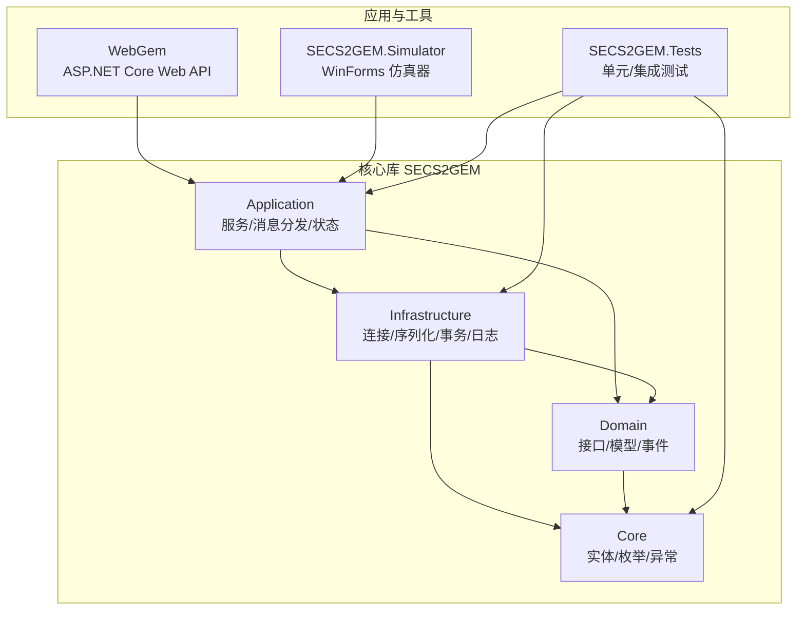
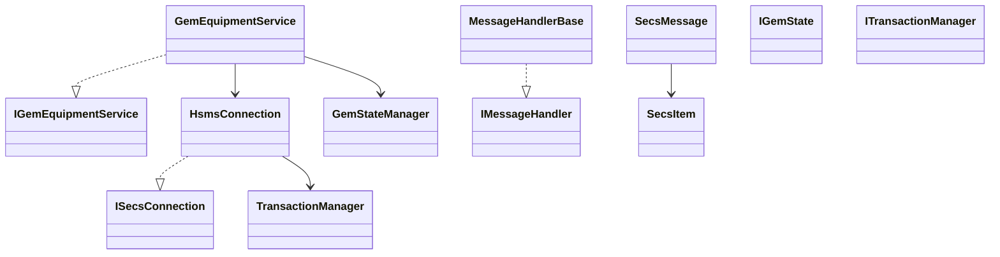
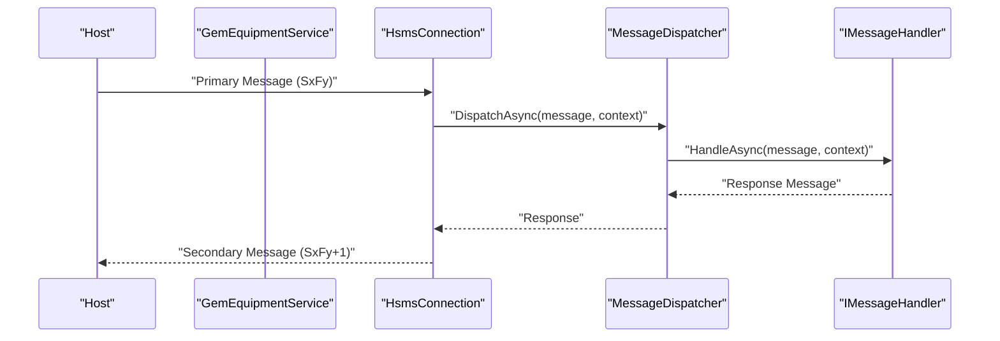
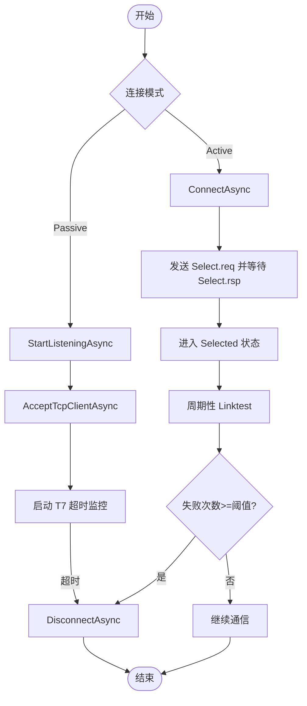
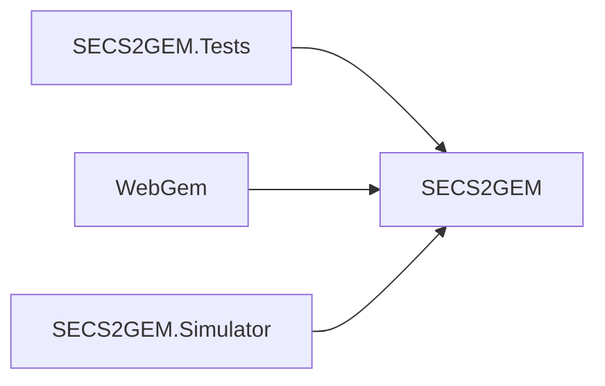

# 贡献指南

<cite>
**本文引用的文件**
- [README.md](file://README.md)
- [SECS2GEM.csproj](file://WebGem/SECS2GEM/SECS2GEM.csproj)
- [SECS2GEM.Tests.csproj](file://WebGem/SECS2GEM.Tests/SECS2GEM.Tests.csproj)
- [WebGem.csproj](file://WebGem/WebGem/WebGem.csproj)
- [SECS2GEM.Simulator.csproj](file://WebGem/SECS2GEM.Simulator/SECS2GEM.Simulator.csproj)
- [GEM协议规范文档.md](file://WebGem/SECS2GEM/GEM_Protocol_Specification.md)
- [SECS2GEM 类图.md](file://WebGem/SECS2GEM/SECS2GEM_Class_Diagram.md)
- [GemEquipmentService.cs](file://WebGem/SECS2GEM/Application/Services/GemEquipmentService.cs)
- [SecsMessage.cs](file://WebGem/SECS2GEM/Core/Entities/SecsMessage.cs)
- [GemStates.cs](file://WebGem/SECS2GEM/Core/Enums/GemStates.cs)
- [StreamOneHandlers.cs](file://WebGem/SECS2GEM/Application/Handlers/StreamOneHandlers.cs)
- [HsmsConnection.cs](file://WebGem/SECS2GEM/Infrastructure/Connection/HsmsConnection.cs)
- [GemStateManagerTests.cs](file://WebGem/SECS2GEM.Tests/GemStateManagerTests.cs)
- [IntegrationTests.cs](file://WebGem/SECS2GEM.Tests/IntegrationTests.cs)
- [SecsSerializerTests.cs](file://WebGem/SECS2GEM.Tests/SecsSerializerTests.cs)
</cite>

## 目录
1. [简介](#简介)
2. [项目结构](#项目结构)
3. [核心组件](#核心组件)
4. [架构总览](#架构总览)
5. [详细组件分析](#详细组件分析)
6. [依赖分析](#依赖分析)
7. [性能考虑](#性能考虑)
8. [故障排查指南](#故障排查指南)
9. [结论](#结论)
10. [附录](#附录)

## 简介
本指南面向希望参与 SECS2-GEM 项目的贡献者，涵盖开发环境搭建、代码规范、提交与评审流程、问题报告与功能请求、测试与质量保证、社区行为准则与沟通渠道、新贡献者入门与学习资源，以及项目治理结构与决策流程。目标是帮助你快速理解项目架构、高效开展开发，并确保贡献符合项目质量与协作标准。

## 项目结构
项目采用多项目解决方案组织，包含核心库、应用服务、基础设施、领域模型、测试套件与演示/仿真工具。核心模块遵循分层架构：Core（实体与枚举）、Domain（接口与模型）、Infrastructure（连接、序列化、事务、日志）、Application（服务、消息分发、状态管理）、Web（ASP.NET Core Web API）、Simulator（WinForms 仿真器）、Tests（单元与集成测试）。

图表来源
- [SECS2GEM.csproj:1-10](file://WebGem/SECS2GEM/SECS2GEM.csproj#L1-L10)
- [WebGem.csproj:1-14](file://WebGem/WebGem/WebGem.csproj#L1-L14)
- [SECS2GEM.Simulator.csproj:1-15](file://WebGem/SECS2GEM.Simulator/SECS2GEM.Simulator.csproj#L1-L15)
- [SECS2GEM.Tests.csproj:1-25](file://WebGem/SECS2GEM.Tests/SECS2GEM.Tests.csproj#L1-L25)

章节来源
- [SECS2GEM.csproj:1-10](file://WebGem/SECS2GEM/SECS2GEM.csproj#L1-L10)
- [WebGem.csproj:1-14](file://WebGem/WebGem/WebGem.csproj#L1-L14)
- [SECS2GEM.Simulator.csproj:1-15](file://WebGem/SECS2GEM.Simulator/SECS2GEM.Simulator.csproj#L1-L15)
- [SECS2GEM.Tests.csproj:1-25](file://WebGem/SECS2GEM.Tests/SECS2GEM.Tests.csproj#L1-L25)

## 核心组件
- 应用服务：GemEquipmentService 负责设备生命周期、消息发送、事件与报警上报、默认处理器注册与事件聚合。
- 连接层：HsmsConnection 实现 HSMS/TCP 连接、消息收发、事务管理、心跳与日志记录。
- 消息与实体：SecsMessage 封装 Stream/Function/WBit 等协议字段；SecsItem 支持多种 SECS-II 数据格式。
- 状态模型：GemCommunicationState、GemControlState、GemProcessingState 定义 GEM 状态机。
- 处理器：MessageHandlerBase 及各 Stream/Function 处理器（如 S1F1/S1F13/S1F15/S1F17）实现消息路由与响应生成。
- 测试：单元测试覆盖状态管理、序列化往返、集成测试覆盖连接、选择、链路测试与 S1F1/S1F13 流程。

章节来源
- [GemEquipmentService.cs:1-456](file://WebGem/SECS2GEM/Application/Services/GemEquipmentService.cs#L1-L456)
- [HsmsConnection.cs:1-906](file://WebGem/SECS2GEM/Infrastructure/Connection/HsmsConnection.cs#L1-L906)
- [SecsMessage.cs:1-209](file://WebGem/SECS2GEM/Core/Entities/SecsMessage.cs#L1-L209)
- [GemStates.cs:1-176](file://WebGem/SECS2GEM/Core/Enums/GemStates.cs#L1-L176)
- [StreamOneHandlers.cs:1-211](file://WebGem/SECS2GEM/Application/Handlers/StreamOneHandlers.cs#L1-L211)
- [GemStateManagerTests.cs:1-365](file://WebGem/SECS2GEM.Tests/GemStateManagerTests.cs#L1-L365)
- [IntegrationTests.cs:1-194](file://WebGem/SECS2GEM.Tests/IntegrationTests.cs#L1-L194)
- [SecsSerializerTests.cs:1-296](file://WebGem/SECS2GEM.Tests/SecsSerializerTests.cs#L1-L296)

## 架构总览
SECS2-GEM 采用清晰的分层与接口隔离设计，应用层通过服务聚合基础设施与领域能力，基础设施负责网络、序列化与事务，核心层提供协议实体与枚举，测试贯穿各层以保障质量。

图表来源
- [SECS2GEM 类图.md:1-695](file://WebGem/SECS2GEM/SECS2GEM_Class_Diagram.md#L1-L695)
- [GemEquipmentService.cs:1-456](file://WebGem/SECS2GEM/Application/Services/GemEquipmentService.cs#L1-L456)
- [HsmsConnection.cs:1-906](file://WebGem/SECS2GEM/Infrastructure/Connection/HsmsConnection.cs#L1-L906)
- [SecsMessage.cs:1-209](file://WebGem/SECS2GEM/Core/Entities/SecsMessage.cs#L1-L209)

## 详细组件分析

### 应用服务：GemEquipmentService
- 职责：外观模式整合连接、消息分发、状态管理与事件聚合；提供启动/停止、消息发送、事件与报警上报、默认处理器注册。
- 生命周期：StartAsync/StopAsync；根据配置模式（Active/Passive）选择连接方式。
- 事件：消息接收、状态变化、连接状态变化。
- 默认处理器：按 Stream/Function 注册标准处理器，支持扩展注册。

图表来源
- [GemEquipmentService.cs:1-456](file://WebGem/SECS2GEM/Application/Services/GemEquipmentService.cs#L1-L456)
- [HsmsConnection.cs:1-906](file://WebGem/SECS2GEM/Infrastructure/Connection/HsmsConnection.cs#L1-L906)

章节来源
- [GemEquipmentService.cs:1-456](file://WebGem/SECS2GEM/Application/Services/GemEquipmentService.cs#L1-L456)

### 连接层：HsmsConnection
- 职责：HSMS/TCP 连接管理、消息收发、事务管理、心跳、日志记录。
- 模式：支持 Active/Passive；Passive 下 T7 超时监控；心跳失败阈值断连。
- 线程模型：接收/发送/心跳三任务；Channel 异步队列；事务超时 T3/T6/T8。
- 控制消息：Select/Deselect/Linktest/Separate；数据消息：封装为 SecsMessage。

图表来源
- [HsmsConnection.cs:1-906](file://WebGem/SECS2GEM/Infrastructure/Connection/HsmsConnection.cs#L1-L906)

章节来源
- [HsmsConnection.cs:1-906](file://WebGem/SECS2GEM/Infrastructure/Connection/HsmsConnection.cs#L1-L906)

### 消息与实体：SecsMessage 与 SecsItem
- SecsMessage：封装 Stream/Function/WBit、Primary/Secondary 判定、响应构造、SML 输出。
- SecsItem：支持 List/二进制/布尔/ASCII/JIS8/I1/I2/I4/I8/U1/U2/U4/U8/F4/F8 等格式，提供序列化/反序列化与 SML 转换。

章节来源
- [SecsMessage.cs:1-209](file://WebGem/SECS2GEM/Core/Entities/SecsMessage.cs#L1-L209)

### 状态模型：GemStates
- 通信状态：Disabled/Enabled/WaitCommunicationRequest/WaitCommunicationDelay/Communicating。
- 控制状态：EquipmentOffline/AttemptOnline/HostOffline/OnlineLocal/OnlineRemote。
- 处理状态：Idle/Setup/Ready/Executing/Paused。
- 报警类别：PersonalSafety/EquipmentSafety/ParameterControlWarning/Error/IrrecoverableError/EquipmentStatusWarning/AttentionFlags/DataIntegrity。

章节来源
- [GemStates.cs:1-176](file://WebGem/SECS2GEM/Core/Enums/GemStates.cs#L1-L176)

### 处理器：MessageHandlerBase 与 StreamOneHandlers
- MessageHandlerBase：模板方法模式，统一异常与错误响应（S9F7）。
- StreamOneHandlers：S1F1/S1F13/S1F15/S1F17 等处理器，基于上下文访问状态并生成响应。

章节来源
- [StreamOneHandlers.cs:1-211](file://WebGem/SECS2GEM/Application/Handlers/StreamOneHandlers.cs#L1-L211)

### 协议与规范参考
- GEM 协议规范文档提供了完整的协议栈、HSMS 消息结构、SECS-II 数据项类型、GEM 状态模型与核心消息流程，建议在开发前通读以确保实现正确性。

章节来源
- [GEM协议规范文档.md:1-1257](file://WebGem/SECS2GEM/GEM_Protocol_Specification.md#L1-L1257)

## 依赖分析
- 项目间依赖：SECS2GEM.Tests 引用 SECS2GEM；WebGem 与 SECS2GEM.Simulator 均引用 SECS2GEM。
- 运行时框架：SECS2GEM 使用 net9.0；WebGem 使用 net10.0；Simulator 使用 net9.0-windows；测试项目使用 net10.0。
- 测试框架：xUnit、Microsoft.NET.Test.Sdk、coverlet.collector。

图表来源
- [SECS2GEM.Tests.csproj:1-25](file://WebGem/SECS2GEM.Tests/SECS2GEM.Tests.csproj#L1-L25)
- [WebGem.csproj:1-14](file://WebGem/WebGem/WebGem.csproj#L1-L14)
- [SECS2GEM.Simulator.csproj:1-15](file://WebGem/SECS2GEM.Simulator/SECS2GEM.Simulator.csproj#L1-L15)

章节来源
- [SECS2GEM.Tests.csproj:1-25](file://WebGem/SECS2GEM.Tests/SECS2GEM.Tests.csproj#L1-L25)
- [WebGem.csproj:1-14](file://WebGem/WebGem/WebGem.csproj#L1-L14)
- [SECS2GEM.Simulator.csproj:1-15](file://WebGem/SECS2GEM.Simulator/SECS2GEM.Simulator.csproj#L1-L15)

## 性能考虑
- 异步与并发：连接层使用 Channel 与异步任务，避免阻塞；事务超时参数（T3/T6/T7/T8）需结合实际网络环境合理配置。
- 序列化：大消息与频繁序列化场景下，注意缓冲区大小与内存分配；日志开启会增加 I/O 成本。
- 心跳与断连：心跳失败阈值与 T7 超时应平衡健壮性与资源消耗。
- 线程模型：接收/发送/心跳三任务分离，避免相互影响；断连清理顺序确保资源有序释放。

## 故障排查指南
- 连接失败：检查 IP/端口、防火墙、连接模式（Active/Passive）与 T6/T7 超时。
- 未选择状态：确认 Select.req/resp 流程与事务完成；查看日志定位卡顿点。
- 无响应：Primary 消息未触发响应，检查消息分发与处理器注册；验证 W-Bit 与 Function 映射。
- 序列化异常：核对 SECS-II 数据项格式与长度字节；使用往返测试验证编解码一致性。
- 集成测试：通过 IntegrationTests 验证连接、选择、S1F1/S1F13、链路测试等关键流程。

章节来源
- [HsmsConnection.cs:1-906](file://WebGem/SECS2GEM/Infrastructure/Connection/HsmsConnection.cs#L1-L906)
- [SecsSerializerTests.cs:1-296](file://WebGem/SECS2GEM.Tests/SecsSerializerTests.cs#L1-L296)
- [IntegrationTests.cs:1-194](file://WebGem/SECS2GEM.Tests/IntegrationTests.cs#L1-L194)

## 结论
SECS2-GEM 项目结构清晰、分层明确，具备完善的测试体系与协议规范支撑。贡献者应优先熟悉协议规范与核心类图，严格遵循测试驱动与质量门禁，确保新增功能与修复符合 GEM 标准与项目最佳实践。

## 附录

### 开发环境搭建
- .NET SDK
  - 核心库：.NET 9.0（net9.0）
  - Web 应用：.NET 10.0（net10.0）
  - 仿真器：.NET 9.0-windows（net9.0-windows）
  - 测试项目：.NET 10.0（net10.0）
- IDE 建议：Visual Studio 2022 或 VS Code + C# 扩展
- 依赖安装：通过 NuGet 恢复包（随项目文件自动解析）

章节来源
- [SECS2GEM.csproj:1-10](file://WebGem/SECS2GEM/SECS2GEM.csproj#L1-L10)
- [WebGem.csproj:1-14](file://WebGem/WebGem/WebGem.csproj#L1-L14)
- [SECS2GEM.Simulator.csproj:1-15](file://WebGem/SECS2GEM.Simulator/SECS2GEM.Simulator.csproj#L1-L15)
- [SECS2GEM.Tests.csproj:1-25](file://WebGem/SECS2GEM.Tests/SECS2GEM.Tests.csproj#L1-L25)

### 代码规范与编程标准
- 命名约定
  - 类型：PascalCase（如 GemEquipmentService、HsmsConnection）
  - 方法/属性：PascalCase（如 StartAsync、IsSelected）
  - 字段：私有字段使用下划线前缀（如 _stateManager、_connection）
  - 接口：IPrefix（如 IGemEquipmentService、ISecsConnection）
- 注释规范
  - 类/方法使用 XML 注释，说明职责、参数、返回值与异常
  - 关键算法与协议实现处添加行内注释，解释设计思路与边界条件
- 架构原则
  - 分层与接口隔离：Infrastructure/Domain/Core 解耦
  - 领域驱动：状态模型与事件驱动消息处理
  - 可测试性：通过接口注入与工厂方法降低耦合

### 提交流程与代码审查
- 分支策略：建议采用功能分支（feature/*）与发布分支（release/*），变更合并前进行代码审查
- 提交流程：提交前运行全部测试，确保通过；提交信息清晰描述变更目的与影响
- 代码审查：至少一名维护者审查；关注架构一致性、测试覆盖率、异常处理与性能影响

### Bug 报告与功能请求
- Bug 报告：提供最小可复现步骤、预期/实际行为、环境信息（.NET 版本、平台、配置参数）、日志片段
- 功能请求：描述背景、需求细节、影响范围与验收标准；必要时附带协议规范引用

### 测试要求与质量保证
- 单元测试：覆盖核心类（状态管理、序列化、消息构造）与边界条件
- 集成测试：覆盖连接、选择、链路测试与关键消息流程
- 质量门禁：通过测试覆盖率与静态分析工具（如 SonarQube/CodeQL）检查

章节来源
- [GemStateManagerTests.cs:1-365](file://WebGem/SECS2GEM.Tests/GemStateManagerTests.cs#L1-L365)
- [SecsSerializerTests.cs:1-296](file://WebGem/SECS2GEM.Tests/SecsSerializerTests.cs#L1-L296)
- [IntegrationTests.cs:1-194](file://WebGem/SECS2GEM.Tests/IntegrationTests.cs#L1-L194)

### 社区行为准则与沟通渠道
- 行为准则：尊重、包容、专业、建设性反馈
- 沟通渠道：Issue/PR 讨论、邮件组/即时通讯群组（如有）

### 新贡献者入门与学习资源
- 入门路径：先阅读 GEM 协议规范文档与类图，再逐层阅读核心类与测试
- 学习资源：SECS-II/HSMS/E30 标准文档、项目测试用例、示例工程（Simulator）

### 项目治理结构与决策流程
- 维护者：负责代码审查、版本发布与重大变更决策
- 决策流程：重大变更通过 Issue 讨论与 PR 审查，达成共识后合并