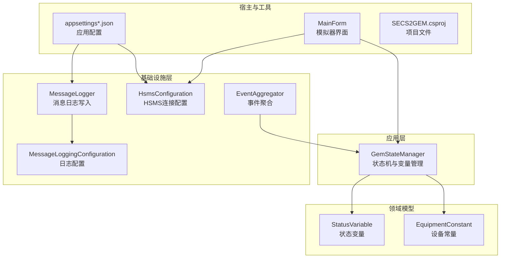
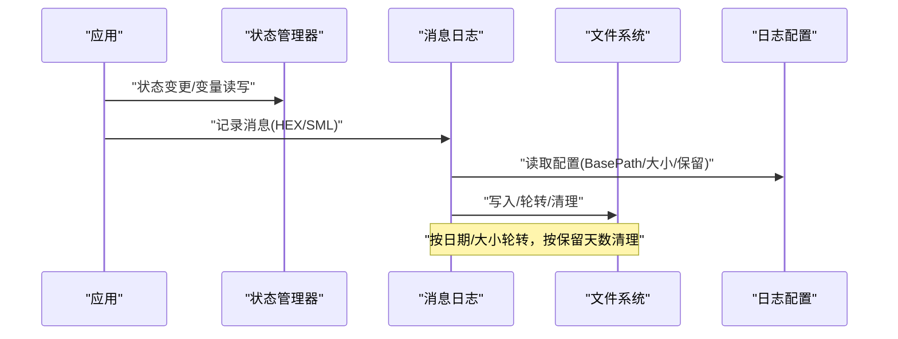
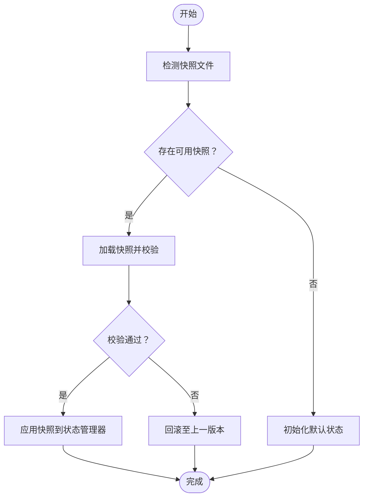
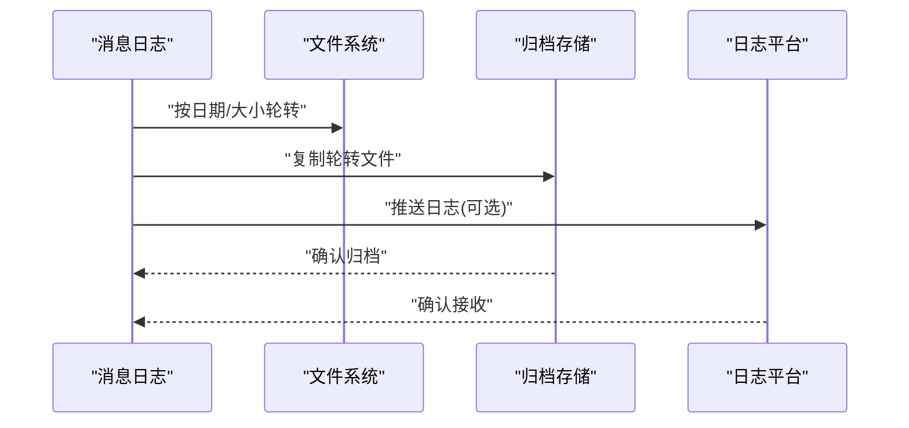
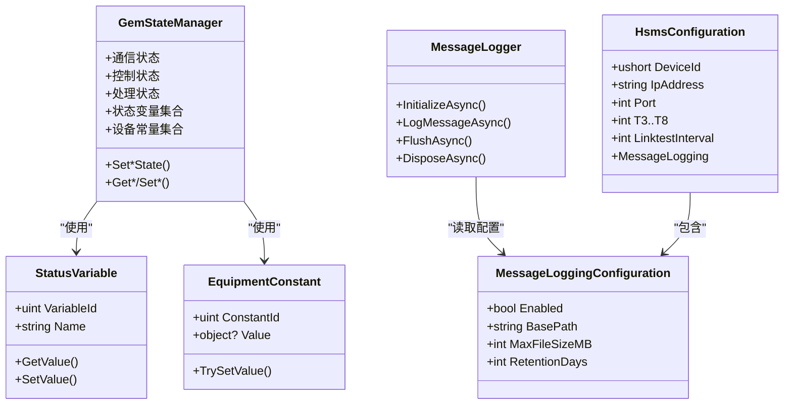

# 备份恢复

<cite>
**本文引用的文件**
- [README.md](file://README.md)
- [GemStateManager.cs](file://WebGem/SECS2GEM/Application/State/GemStateManager.cs)
- [MessageLogger.cs](file://WebGem/SECS2GEM/Infrastructure/Logging/MessageLogger.cs)
- [MessageLoggingConfiguration.cs](file://WebGem/SECS2GEM/Infrastructure/Logging/MessageLoggingConfiguration.cs)
- [HsmsConfiguration.cs](file://WebGem/SECS2GEM/Infrastructure/Configuration/HsmsConfiguration.cs)
- [EquipmentConstant.cs](file://WebGem/SECS2GEM/Domain/Models/EquipmentConstant.cs)
- [StatusVariable.cs](file://WebGem/SECS2GEM/Domain/Models/StatusVariable.cs)
- [EventAggregator.cs](file://WebGem/SECS2GEM/Infrastructure/Services/EventAggregator.cs)
- [GemStateManagerTests.cs](file://WebGem/SECS2GEM.Tests/GemStateManagerTests.cs)
- [appsettings.json](file://WebGem/WebGem/appsettings.json)
- [appsettings.Development.json](file://WebGem/WebGem/appsettings.Development.json)
- [MainForm.cs](file://WebGem/SECS2GEM.Simulator/MainForm.cs)
- [SECS2GEM.csproj](file://WebGem/SECS2GEM/SECS2GEM.csproj)
</cite>

## 目录
1. [简介](#简介)
2. [项目结构](#项目结构)
3. [核心组件](#核心组件)
4. [架构总览](#架构总览)
5. [详细组件分析](#详细组件分析)
6. [依赖关系分析](#依赖关系分析)
7. [性能考量](#性能考量)
8. [故障排查指南](#故障排查指南)
9. [结论](#结论)
10. [附录](#附录)

## 简介
本文件面向SECS2-GEM项目的备份与恢复，围绕“配置文件备份、运行状态快照、日志归档”三大主题，结合代码实现，给出可落地的数据备份策略、灾难恢复计划、存储位置与安全保护建议、自动化与验证流程、紧急恢复与回滚策略、加密与访问控制，以及演练与应急预案测试方法。由于当前仓库未包含持久化存储与外部备份工具集成代码，本文在不虚构实现的前提下，基于现有组件能力与最佳实践，提供可扩展的方案设计。

## 项目结构
SECS2-GEM采用分层架构，核心模块包括应用层的状态管理、基础设施层的日志与配置、领域模型的状态变量与设备常量等。WebGem为Web宿主，SECS2GEM.Simulator为HSMS通信测试工具。

**图表来源**
- [GemStateManager.cs:1-492](file://WebGem/SECS2GEM/Application/State/GemStateManager.cs#L1-L492)
- [MessageLogger.cs:1-438](file://WebGem/SECS2GEM/Infrastructure/Logging/MessageLogger.cs#L1-L438)
- [MessageLoggingConfiguration.cs:1-82](file://WebGem/SECS2GEM/Infrastructure/Logging/MessageLoggingConfiguration.cs#L1-L82)
- [HsmsConfiguration.cs:1-266](file://WebGem/SECS2GEM/Infrastructure/Configuration/HsmsConfiguration.cs#L1-L266)
- [StatusVariable.cs:1-61](file://WebGem/SECS2GEM/Domain/Models/StatusVariable.cs#L1-L61)
- [EquipmentConstant.cs:1-122](file://WebGem/SECS2GEM/Domain/Models/EquipmentConstant.cs#L1-L122)
- [EventAggregator.cs:1-219](file://WebGem/SECS2GEM/Infrastructure/Services/EventAggregator.cs#L1-L219)
- [appsettings.json:1-10](file://WebGem/WebGem/appsettings.json#L1-L10)
- [appsettings.Development.json:1-9](file://WebGem/WebGem/appsettings.Development.json#L1-L9)
- [MainForm.cs:1-868](file://WebGem/SECS2GEM.Simulator/MainForm.cs#L1-L868)
- [SECS2GEM.csproj:1-10](file://WebGem/SECS2GEM/SECS2GEM.csproj#L1-L10)

**章节来源**
- [README.md:1-1](file://README.md#L1-L1)
- [SECS2GEM.csproj:1-10](file://WebGem/SECS2GEM/SECS2GEM.csproj#L1-L10)

## 核心组件
- 状态管理器：封装通信/控制/处理三类状态机，维护状态变量与设备常量，提供状态转换校验与事件通知。
- 日志记录器：异步写入HEX与SML消息日志，按日期/大小轮转，支持保留期清理。
- 日志配置：定义日志开关、基础路径、文件大小、保留天数、文件名格式等。
- HSMS配置：网络参数、超时参数、心跳参数、消息日志配置等。
- 状态变量与设备常量：状态变量用于查询与事件上报；设备常量用于配置项的读取与设置。
- 事件聚合器：异步/同步事件发布，异常隔离，订阅管理。
- 应用配置：Web宿主的日志级别与跨域设置，影响日志输出行为。

**章节来源**
- [GemStateManager.cs:1-492](file://WebGem/SECS2GEM/Application/State/GemStateManager.cs#L1-L492)
- [MessageLogger.cs:1-438](file://WebGem/SECS2GEM/Infrastructure/Logging/MessageLogger.cs#L1-L438)
- [MessageLoggingConfiguration.cs:1-82](file://WebGem/SECS2GEM/Infrastructure/Logging/MessageLoggingConfiguration.cs#L1-L82)
- [HsmsConfiguration.cs:1-266](file://WebGem/SECS2GEM/Infrastructure/Configuration/HsmsConfiguration.cs#L1-L266)
- [StatusVariable.cs:1-61](file://WebGem/SECS2GEM/Domain/Models/StatusVariable.cs#L1-L61)
- [EquipmentConstant.cs:1-122](file://WebGem/SECS2GEM/Domain/Models/EquipmentConstant.cs#L1-L122)
- [EventAggregator.cs:1-219](file://WebGem/SECS2GEM/Infrastructure/Services/EventAggregator.cs#L1-L219)
- [appsettings.json:1-10](file://WebGem/WebGem/appsettings.json#L1-L10)
- [appsettings.Development.json:1-9](file://WebGem/WebGem/appsettings.Development.json#L1-L9)

## 架构总览
下图展示备份与恢复相关的关键交互：状态管理器承载运行时状态，日志记录器负责消息日志归档，配置组件决定日志落盘策略，Web配置影响日志输出级别。

**图表来源**
- [GemStateManager.cs:1-492](file://WebGem/SECS2GEM/Application/State/GemStateManager.cs#L1-L492)
- [MessageLogger.cs:1-438](file://WebGem/SECS2GEM/Infrastructure/Logging/MessageLogger.cs#L1-L438)
- [MessageLoggingConfiguration.cs:1-82](file://WebGem/SECS2GEM/Infrastructure/Logging/MessageLoggingConfiguration.cs#L1-L82)

## 详细组件分析

### 设备状态数据备份与恢复
- 状态数据构成：通信状态、控制状态、处理状态、状态变量集合、设备常量集合。
- 现状与限制：状态数据保存在内存中，进程重启后丢失；无内置持久化或快照序列化机制。
- 建议策略：
  - 快照采集：在关键节点（如状态转换、设备常量变更、周期性）生成快照，序列化为JSON/二进制文件，包含时间戳与版本标识。
  - 存储位置：独立磁盘分区或网络共享存储，按日期/主机名分层组织，设置访问权限与配额。
  - 恢复流程：启动时加载最近一次快照，回放必要的事件或重放消息，确保状态一致性。
  - 校验与回滚：快照包含校验和；失败时回滚至上一版本；支持增量快照与差异合并。

**图表来源**
- [GemStateManager.cs:1-492](file://WebGem/SECS2GEM/Application/State/GemStateManager.cs#L1-L492)
- [EquipmentConstant.cs:1-122](file://WebGem/SECS2GEM/Domain/Models/EquipmentConstant.cs#L1-L122)
- [StatusVariable.cs:1-61](file://WebGem/SECS2GEM/Domain/Models/StatusVariable.cs#L1-L61)

**章节来源**
- [GemStateManager.cs:1-492](file://WebGem/SECS2GEM/Application/State/GemStateManager.cs#L1-L492)
- [EquipmentConstant.cs:1-122](file://WebGem/SECS2GEM/Domain/Models/EquipmentConstant.cs#L1-L122)
- [StatusVariable.cs:1-61](file://WebGem/SECS2GEM/Domain/Models/StatusVariable.cs#L1-L61)

### 配置文件备份
- 影响范围：HSMS连接配置、消息日志配置、Web应用配置。
- 备份内容：HsmsConfiguration、MessageLoggingConfiguration、appsettings*.json。
- 建议：
  - 版本化：每次变更记录变更集，保留历史版本。
  - 分层备份：网络参数、超时参数、日志参数分别归档。
  - 自动化：变更检测+触发备份+校验+告警。
  - 恢复：按环境（开发/测试/生产）恢复对应配置。

**章节来源**
- [HsmsConfiguration.cs:1-266](file://WebGem/SECS2GEM/Infrastructure/Configuration/HsmsConfiguration.cs#L1-L266)
- [MessageLoggingConfiguration.cs:1-82](file://WebGem/SECS2GEM/Infrastructure/Logging/MessageLoggingConfiguration.cs#L1-L82)
- [appsettings.json:1-10](file://WebGem/WebGem/appsettings.json#L1-L10)
- [appsettings.Development.json:1-9](file://WebGem/WebGem/appsettings.Development.json#L1-L9)

### 日志文件归档
- 现状：MessageLogger按日期/大小轮转，支持保留天数清理；日志目录结构按IP-端口-设备ID组织。
- 归档策略：
  - 本地归档：轮转后立即复制到归档目录，保留原始文件名与时间戳。
  - 远程归档：通过脚本/工具推送至集中日志平台或对象存储。
  - 清理策略：到期删除、压缩归档、保留最小必要日志。
- 验证：校验归档完整性、索引一致性、检索可用性。

**图表来源**
- [MessageLogger.cs:1-438](file://WebGem/SECS2GEM/Infrastructure/Logging/MessageLogger.cs#L1-L438)
- [MessageLoggingConfiguration.cs:1-82](file://WebGem/SECS2GEM/Infrastructure/Logging/MessageLoggingConfiguration.cs#L1-L82)

**章节来源**
- [MessageLogger.cs:1-438](file://WebGem/SECS2GEM/Infrastructure/Logging/MessageLogger.cs#L1-L438)
- [MessageLoggingConfiguration.cs:1-82](file://WebGem/SECS2GEM/Infrastructure/Logging/MessageLoggingConfiguration.cs#L1-L82)

### 灾难恢复计划（DRP）
- 场景分析：
  - 系统崩溃：依赖快照与日志回放恢复状态。
  - 配置错误：回滚到上一版本配置。
  - 存储损坏：从归档恢复日志与快照。
- RTO/RPO目标：
  - RTO：根据业务SLA设定（例如分钟级/小时级）。
  - RPO：基于快照频率与日志保留窗口确定（例如5分钟/15分钟）。
- 恢复步骤：
  - 评估影响范围与数据丢失量。
  - 选择最近可用快照与日志区间。
  - 恢复配置→加载快照→回放事件→验证一致性→上线。
- 回滚策略：快照版本回退、配置版本回滚、日志回放撤销。

**章节来源**
- [GemStateManager.cs:1-492](file://WebGem/SECS2GEM/Application/State/GemStateManager.cs#L1-L492)
- [MessageLogger.cs:1-438](file://WebGem/SECS2GEM/Infrastructure/Logging/MessageLogger.cs#L1-L438)

### 存储位置选择与安全保护
- 位置选择：
  - 快照与配置：本地SSD（高吞吐）+异地NAS/对象存储（高可靠）。
  - 日志归档：集中日志平台或云存储，支持冷热分层。
- 安全保护：
  - 访问控制：最小权限原则，仅授权人员可访问。
  - 加密：静态加密（AES）、传输加密（TLS）。
  - 完整性：校验和/哈希，审计日志。
  - 备份介质：物理隔离、离线存储、定期抽样检查。

**章节来源**
- [MessageLoggingConfiguration.cs:1-82](file://WebGem/SECS2GEM/Infrastructure/Logging/MessageLoggingConfiguration.cs#L1-L82)
- [HsmsConfiguration.cs:1-266](file://WebGem/SECS2GEM/Infrastructure/Configuration/HsmsConfiguration.cs#L1-L266)

### 自动化与验证
- 自动化任务：
  - 快照：定时任务（如每5分钟）+事件触发（状态变更）。
  - 日志归档：轮转后触发归档脚本。
  - 配置备份：Git钩子或专用工具监控配置文件变更。
- 验证流程：
  - 结构校验：JSON/二进制快照格式校验。
  - 一致性校验：加载快照后执行状态机规则验证。
  - 回放验证：对关键日志进行回放，比对结果。
  - 压力测试：模拟大规模回放与恢复。

**章节来源**
- [GemStateManager.cs:1-492](file://WebGem/SECS2GEM/Application/State/GemStateManager.cs#L1-L492)
- [MessageLogger.cs:1-438](file://WebGem/SECS2GEM/Infrastructure/Logging/MessageLogger.cs#L1-L438)

### 紧急恢复操作指南与回滚策略
- 紧急恢复：
  - 停机→定位最近快照→恢复配置→加载快照→回放日志→自检→试运行→正式上线。
  - 若无快照：基于日志重建状态，优先保证一致性。
- 回滚策略：
  - 快照回滚：选择上一版本覆盖当前版本。
  - 配置回滚：使用版本控制系统或配置库回退。
  - 日志回滚：删除错误归档，重新归档正确版本。

**章节来源**
- [GemStateManager.cs:1-492](file://WebGem/SECS2GEM/Application/State/GemStateManager.cs#L1-L492)
- [MessageLogger.cs:1-438](file://WebGem/SECS2GEM/Infrastructure/Logging/MessageLogger.cs#L1-L438)

### 加密存储与访问控制
- 加密：
  - 静态：对快照与日志文件启用透明加密。
  - 传输：备份通道使用TLS/SSH隧道。
- 访问控制：
  - IAM策略：仅授权运维账号访问备份存储。
  - 审计：记录所有访问与修改操作。
  - 密钥管理：使用KMS或HSM管理密钥轮换。

**章节来源**
- [MessageLoggingConfiguration.cs:1-82](file://WebGem/SECS2GEM/Infrastructure/Logging/MessageLoggingConfiguration.cs#L1-L82)
- [HsmsConfiguration.cs:1-266](file://WebGem/SECS2GEM/Infrastructure/Configuration/HsmsConfiguration.cs#L1-L266)

### 备份恢复演练与应急预案测试
- 演练计划：
  - 月度：完整恢复演练（含快照/日志/配置）。
  - 季度：破坏性演练（模拟磁盘损坏、配置错误）。
  - 年度：跨区域演练（异地容灾）。
- 测试指标：
  - RTO/RPO达标率、恢复成功率、回放一致性、回滚时间。
- 应急预案：
  - 明确角色职责、沟通渠道、升级流程、外部协作。

**章节来源**
- [GemStateManager.cs:1-492](file://WebGem/SECS2GEM/Application/State/GemStateManager.cs#L1-L492)
- [MessageLogger.cs:1-438](file://WebGem/SECS2GEM/Infrastructure/Logging/MessageLogger.cs#L1-L438)

## 依赖关系分析
- 组件耦合：
  - 状态管理器依赖状态变量与设备常量模型。
  - 日志记录器依赖日志配置，受应用配置影响输出级别。
  - 模拟器依赖HSMS配置与状态管理器进行演示。
- 外部依赖：
  - 文件系统（日志写入/归档）。
  - 可能的外部备份/归档系统（需在部署层集成）。

**图表来源**
- [GemStateManager.cs:1-492](file://WebGem/SECS2GEM/Application/State/GemStateManager.cs#L1-L492)
- [StatusVariable.cs:1-61](file://WebGem/SECS2GEM/Domain/Models/StatusVariable.cs#L1-L61)
- [EquipmentConstant.cs:1-122](file://WebGem/SECS2GEM/Domain/Models/EquipmentConstant.cs#L1-L122)
- [MessageLogger.cs:1-438](file://WebGem/SECS2GEM/Infrastructure/Logging/MessageLogger.cs#L1-L438)
- [MessageLoggingConfiguration.cs:1-82](file://WebGem/SECS2GEM/Infrastructure/Logging/MessageLoggingConfiguration.cs#L1-L82)
- [HsmsConfiguration.cs:1-266](file://WebGem/SECS2GEM/Infrastructure/Configuration/HsmsConfiguration.cs#L1-L266)

**章节来源**
- [GemStateManager.cs:1-492](file://WebGem/SECS2GEM/Application/State/GemStateManager.cs#L1-L492)
- [StatusVariable.cs:1-61](file://WebGem/SECS2GEM/Domain/Models/StatusVariable.cs#L1-L61)
- [EquipmentConstant.cs:1-122](file://WebGem/SECS2GEM/Domain/Models/EquipmentConstant.cs#L1-L122)
- [MessageLogger.cs:1-438](file://WebGem/SECS2GEM/Infrastructure/Logging/MessageLogger.cs#L1-L438)
- [MessageLoggingConfiguration.cs:1-82](file://WebGem/SECS2GEM/Infrastructure/Logging/MessageLoggingConfiguration.cs#L1-L82)
- [HsmsConfiguration.cs:1-266](file://WebGem/SECS2GEM/Infrastructure/Configuration/HsmsConfiguration.cs#L1-L266)

## 性能考量
- 日志写入：异步队列+批量刷新，降低IO放大；合理设置文件大小阈值与保留天数。
- 状态快照：增量快照与压缩；在低峰期执行，避免影响在线业务。
- 回放性能：预热缓存、并行回放、断点续回放。
- 存储I/O：归档与恢复使用独立卷或SSD缓存，避免与业务I/O争抢。

## 故障排查指南
- 日志无法写入：
  - 检查日志配置路径是否存在、权限是否足够。
  - 查看轮转与清理逻辑是否触发异常。
- 快照加载失败：
  - 校验快照格式与版本兼容性。
  - 检查状态变量/设备常量ID映射是否一致。
- 恢复后状态不一致：
  - 对比恢复前后的状态机规则。
  - 回放关键事件与消息，定位偏差点。

**章节来源**
- [MessageLogger.cs:1-438](file://WebGem/SECS2GEM/Infrastructure/Logging/MessageLogger.cs#L1-L438)
- [GemStateManager.cs:1-492](file://WebGem/SECS2GEM/Application/State/GemStateManager.cs#L1-L492)

## 结论
SECS2-GEM当前具备完善的日志归档能力与清晰的状态模型，但缺少内置的持久化与快照机制。建议在现有基础上引入快照与归档流程，结合自动化与验证体系，形成闭环的备份恢复能力，并配套演练与应急预案，确保系统在故障场景下的快速恢复与状态一致性。

## 附录
- 相关测试参考：状态管理器单元测试覆盖了状态转换与变量/常量的基本行为，可用于回归验证恢复流程的正确性。

**章节来源**
- [GemStateManagerTests.cs:1-365](file://WebGem/SECS2GEM.Tests/GemStateManagerTests.cs#L1-L365)