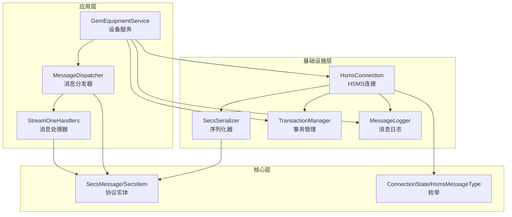
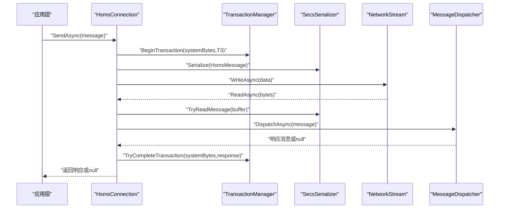
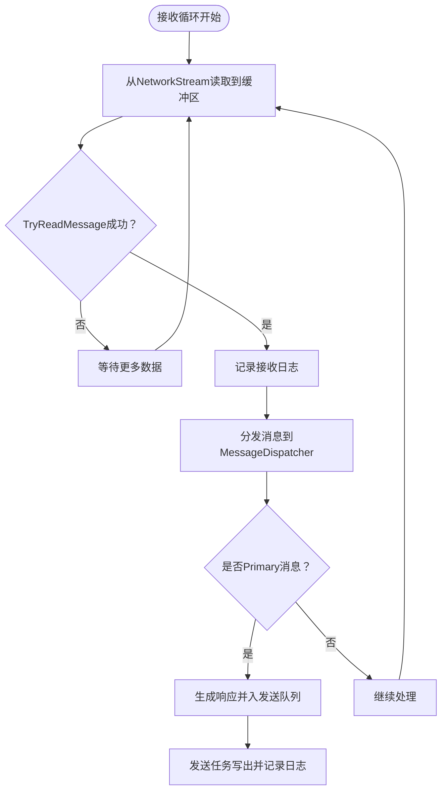
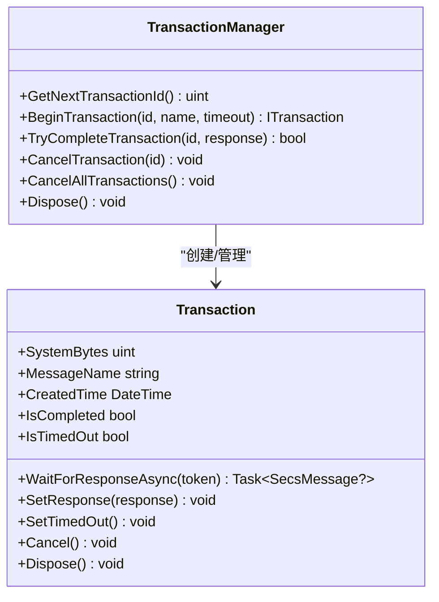
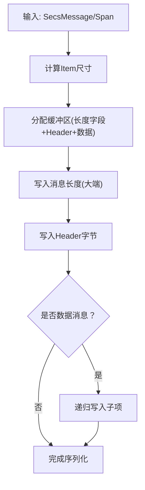
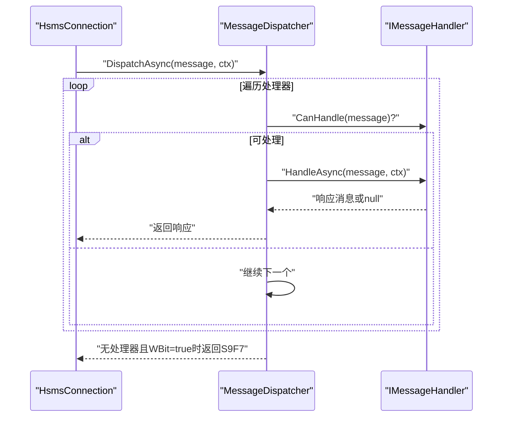
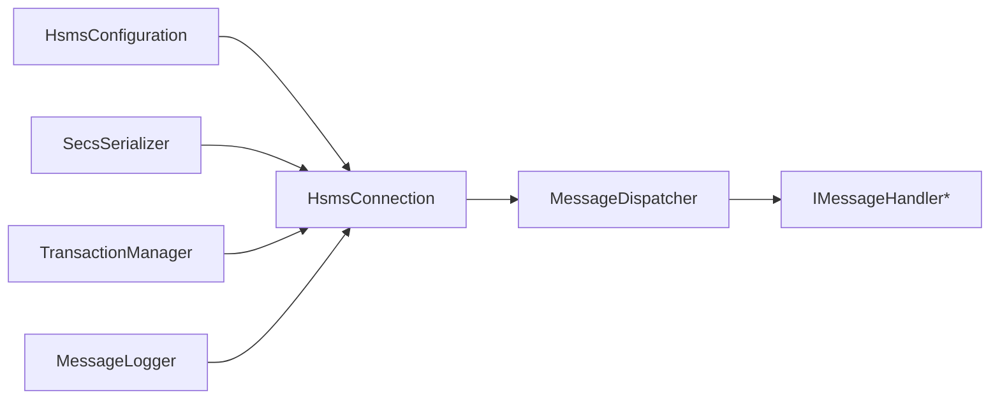

# 性能调优

<cite>
**本文引用的文件**
- [HsmsConnection.cs](file://WebGem/SECS2GEM/Infrastructure/Connection/HsmsConnection.cs)
- [HsmsConfiguration.cs](file://WebGem/SECS2GEM/Infrastructure/Configuration/HsmsConfiguration.cs)
- [SecsSerializer.cs](file://WebGem/SECS2GEM/Infrastructure/Serialization/SecsSerializer.cs)
- [TransactionManager.cs](file://WebGem/SECS2GEM/Infrastructure/Services/TransactionManager.cs)
- [MessageDispatcher.cs](file://WebGem/SECS2GEM/Application/Messaging/MessageDispatcher.cs)
- [GemEquipmentService.cs](file://WebGem/SECS2GEM/Application/Services/GemEquipmentService.cs)
- [MessageLogger.cs](file://WebGem/SECS2GEM/Infrastructure/Logging/MessageLogger.cs)
- [SecsMessage.cs](file://WebGem/SECS2GEM/Core/Entities/SecsMessage.cs)
- [SecsItem.cs](file://WebGem/SECS2GEM/Core/Entities/SecsItem.cs)
- [ConnectionState.cs](file://WebGem/SECS2GEM/Core/Enums/ConnectionState.cs)
- [HsmsMessageType.cs](file://WebGem/SECS2GEM/Core/Enums/HsmsMessageType.cs)
- [StreamOneHandlers.cs](file://WebGem/SECS2GEM/Application/Handlers/StreamOneHandlers.cs)
- [SECS2GEM.csproj](file://WebGem/SECS2GEM/SECS2GEM.csproj)
</cite>

## 目录
1. [简介](#简介)
2. [项目结构](#项目结构)
3. [核心组件](#核心组件)
4. [架构总览](#架构总览)
5. [详细组件分析](#详细组件分析)
6. [依赖关系分析](#依赖关系分析)
7. [性能考虑](#性能考虑)
8. [故障排查指南](#故障排查指南)
9. [结论](#结论)
10. [附录](#附录)

## 简介
本文件面向SECS2-GEM项目，提供系统级性能调优指南，涵盖内存使用与垃圾回收优化、内存泄漏预防、HSMS连接池与连接复用策略、并发处理优化（线程池、异步与锁竞争）、网络性能调优（缓冲区、超时、带宽）、数据库与缓存策略、性能监控与基准测试，以及高并发场景下的瓶颈识别与解决方案。

## 项目结构
SECS2GEM采用分层架构：应用层负责设备服务与消息分发；基础设施层提供连接、序列化、事务、日志等通用能力；核心层封装SECS协议实体与枚举；域层定义接口契约。整体以异步I/O与无锁/低锁设计为主，配合通道与并发容器提升吞吐。

图示来源
- [GemEquipmentService.cs:33-133](file://WebGem/SECS2GEM/Application/Services/GemEquipmentService.cs#L33-L133)
- [HsmsConnection.cs:30-139](file://WebGem/SECS2GEM/Infrastructure/Connection/HsmsConnection.cs#L30-L139)
- [SecsSerializer.cs:27-77](file://WebGem/SECS2GEM/Infrastructure/Serialization/SecsSerializer.cs#L27-L77)
- [TransactionManager.cs:24-118](file://WebGem/SECS2GEM/Infrastructure/Services/TransactionManager.cs#L24-L118)
- [MessageDispatcher.cs:27-91](file://WebGem/SECS2GEM/Application/Messaging/MessageDispatcher.cs#L27-L91)
- [SecsMessage.cs:18-120](file://WebGem/SECS2GEM/Core/Entities/SecsMessage.cs#L18-L120)
- [SecsItem.cs:23-66](file://WebGem/SECS2GEM/Core/Entities/SecsItem.cs#L23-L66)
- [ConnectionState.cs:10-41](file://WebGem/SECS2GEM/Core/Enums/ConnectionState.cs#L10-L41)
- [HsmsMessageType.cs:10-65](file://WebGem/SECS2GEM/Core/Enums/HsmsMessageType.cs#L10-L65)

章节来源
- [GemEquipmentService.cs:33-133](file://WebGem/SECS2GEM/Application/Services/GemEquipmentService.cs#L33-L133)
- [HsmsConnection.cs:30-139](file://WebGem/SECS2GEM/Infrastructure/Connection/HsmsConnection.cs#L30-L139)
- [SecsSerializer.cs:27-77](file://WebGem/SECS2GEM/Infrastructure/Serialization/SecsSerializer.cs#L27-L77)
- [TransactionManager.cs:24-118](file://WebGem/SECS2GEM/Infrastructure/Services/TransactionManager.cs#L24-L118)
- [MessageDispatcher.cs:27-91](file://WebGem/SECS2GEM/Application/Messaging/MessageDispatcher.cs#L27-L91)
- [SecsMessage.cs:18-120](file://WebGem/SECS2GEM/Core/Entities/SecsMessage.cs#L18-L120)
- [SecsItem.cs:23-66](file://WebGem/SECS2GEM/Core/Entities/SecsItem.cs#L23-L66)
- [ConnectionState.cs:10-41](file://WebGem/SECS2GEM/Core/Enums/ConnectionState.cs#L10-L41)
- [HsmsMessageType.cs:10-65](file://WebGem/SECS2GEM/Core/Enums/HsmsMessageType.cs#L10-L65)

## 核心组件
- HSMS连接与消息通道：基于Channel实现发送队列，接收/发送/心跳三任务并行，避免阻塞。
- 事务管理：基于并发字典与TCS，支持超时自动清理，降低堆积风险。
- 序列化器：大端序、Span写入，减少中间对象与拷贝。
- 消息分发：责任链+策略，处理器可插拔，便于扩展与隔离。
- 日志：异步写入，批量刷新，避免阻塞主通讯线程。
- 配置：集中式超时、缓冲区、心跳、自动重连等参数化。

章节来源
- [HsmsConnection.cs:405-418](file://WebGem/SECS2GEM/Infrastructure/Connection/HsmsConnection.cs#L405-L418)
- [TransactionManager.cs:24-118](file://WebGem/SECS2GEM/Infrastructure/Services/TransactionManager.cs#L24-L118)
- [SecsSerializer.cs:44-177](file://WebGem/SECS2GEM/Infrastructure/Serialization/SecsSerializer.cs#L44-L177)
- [MessageDispatcher.cs:27-91](file://WebGem/SECS2GEM/Application/Messaging/MessageDispatcher.cs#L27-L91)
- [MessageLogger.cs:23-94](file://WebGem/SECS2GEM/Infrastructure/Logging/MessageLogger.cs#L23-L94)

## 架构总览
下图展示一次典型消息往返的性能路径：应用层触发发送，经连接层入队、序列化、网络写出；接收侧从网络读取、反序列化、分发至处理器，事务完成并返回响应。

图示来源
- [HsmsConnection.cs:427-453](file://WebGem/SECS2GEM/Infrastructure/Connection/HsmsConnection.cs#L427-L453)
- [TransactionManager.cs:46-72](file://WebGem/SECS2GEM/Infrastructure/Services/TransactionManager.cs#L46-L72)
- [SecsSerializer.cs:93-177](file://WebGem/SECS2GEM/Infrastructure/Serialization/SecsSerializer.cs#L93-L177)
- [MessageDispatcher.cs:67-91](file://WebGem/SECS2GEM/Application/Messaging/MessageDispatcher.cs#L67-L91)

## 详细组件分析

### HSMS连接与通道
- 并发模型：接收、发送、心跳三个后台任务，独立生命周期，通过CancellationToken协调退出。
- 发送队列：无界Channel，发送侧写入即返回，避免阻塞；发送任务异步写出并记录日志。
- 接收循环：固定大小缓冲区，累积后再尝试解析，减少反序列化次数；解析成功后立即分发。
- 心跳与超时：周期性Linktest，失败累计达阈值断开；T7/T3/T6/T8超时分别控制“未选择”“回复”“控制事务”“字符间隔”。

图示来源
- [HsmsConnection.cs:550-610](file://WebGem/SECS2GEM/Infrastructure/Connection/HsmsConnection.cs#L550-L610)
- [HsmsConnection.cs:615-647](file://WebGem/SECS2GEM/Infrastructure/Connection/HsmsConnection.cs#L615-L647)
- [MessageLogger.cs:99-145](file://WebGem/SECS2GEM/Infrastructure/Logging/MessageLogger.cs#L99-L145)

章节来源
- [HsmsConnection.cs:146-186](file://WebGem/SECS2GEM/Infrastructure/Connection/HsmsConnection.cs#L146-L186)
- [HsmsConnection.cs:191-275](file://WebGem/SECS2GEM/Infrastructure/Connection/HsmsConnection.cs#L191-L275)
- [HsmsConnection.cs:280-296](file://WebGem/SECS2GEM/Infrastructure/Connection/HsmsConnection.cs#L280-L296)
- [HsmsConnection.cs:301-337](file://WebGem/SECS2GEM/Infrastructure/Connection/HsmsConnection.cs#L301-L337)
- [HsmsConnection.cs:405-418](file://WebGem/SECS2GEM/Infrastructure/Connection/HsmsConnection.cs#L405-L418)
- [HsmsConnection.cs:550-610](file://WebGem/SECS2GEM/Infrastructure/Connection/HsmsConnection.cs#L550-L610)
- [HsmsConnection.cs:615-647](file://WebGem/SECS2GEM/Infrastructure/Connection/HsmsConnection.cs#L615-L647)
- [HsmsConnection.cs:693-723](file://WebGem/SECS2GEM/Infrastructure/Connection/HsmsConnection.cs#L693-L723)

### 事务管理与超时
- 事务ID：原子递增，避免竞态。
- 并发容器：活跃事务字典，快速查找与移除。
- 超时机制：基于CancellationTokenSource延时取消，异常携带耗时与消息名，便于定位。
- 资源释放：显式Dispose，取消所有事务，防止泄漏。

图示来源
- [TransactionManager.cs:24-118](file://WebGem/SECS2GEM/Infrastructure/Services/TransactionManager.cs#L24-L118)
- [TransactionManager.cs:124-200](file://WebGem/SECS2GEM/Infrastructure/Services/TransactionManager.cs#L124-L200)

章节来源
- [TransactionManager.cs:24-118](file://WebGem/SECS2GEM/Infrastructure/Services/TransactionManager.cs#L24-L118)
- [TransactionManager.cs:124-200](file://WebGem/SECS2GEM/Infrastructure/Services/TransactionManager.cs#L124-L200)

### 序列化与反序列化
- 大端序：符合HSMS/SECS标准。
- Span写入：计算尺寸后一次性分配，避免多次扩容与拷贝。
- 递归解析：List类型按子项逐一解析，空数据项快速分支。
- 最大消息限制：防止异常/恶意消息导致内存暴涨。

图示来源
- [SecsSerializer.cs:49-77](file://WebGem/SECS2GEM/Infrastructure/Serialization/SecsSerializer.cs#L49-L77)
- [SecsSerializer.cs:248-279](file://WebGem/SECS2GEM/Infrastructure/Serialization/SecsSerializer.cs#L248-L279)
- [SecsSerializer.cs:139-177](file://WebGem/SECS2GEM/Infrastructure/Serialization/SecsSerializer.cs#L139-L177)

章节来源
- [SecsSerializer.cs:44-177](file://WebGem/SECS2GEM/Infrastructure/Serialization/SecsSerializer.cs#L44-L177)
- [SecsSerializer.cs:181-413](file://WebGem/SECS2GEM/Infrastructure/Serialization/SecsSerializer.cs#L181-L413)
- [SecsSerializer.cs:415-659](file://WebGem/SECS2GEM/Infrastructure/Serialization/SecsSerializer.cs#L415-L659)

### 消息分发与处理器
- 责任链模式：处理器按优先级排序，首个CanHandle返回true的处理器执行。
- 错误回退：若无处理器处理且消息需要响应，返回S9F7（非法数据）。
- 处理器基类：统一异常捕获与错误响应生成，降低重复代码。

图示来源
- [MessageDispatcher.cs:67-91](file://WebGem/SECS2GEM/Application/Messaging/MessageDispatcher.cs#L67-L91)
- [StreamOneHandlers.cs:20-86](file://WebGem/SECS2GEM/Application/Handlers/StreamOneHandlers.cs#L20-L86)

章节来源
- [MessageDispatcher.cs:27-121](file://WebGem/SECS2GEM/Application/Messaging/MessageDispatcher.cs#L27-L121)
- [StreamOneHandlers.cs:20-86](file://WebGem/SECS2GEM/Application/Handlers/StreamOneHandlers.cs#L20-L86)

### 设备服务与状态
- 设备服务聚合连接、状态、分发与事件聚合，对外暴露简洁API。
- 生命周期：Start/Stop/Dispose，根据配置模式选择主动或被动连接。
- 事件发布：消息接收、状态变化、连接状态变化均通过事件上报。

章节来源
- [GemEquipmentService.cs:106-184](file://WebGem/SECS2GEM/Application/Services/GemEquipmentService.cs#L106-L184)
- [GemEquipmentService.cs:187-204](file://WebGem/SECS2GEM/Application/Services/GemEquipmentService.cs#L187-L204)
- [GemEquipmentService.cs:319-400](file://WebGem/SECS2GEM/Application/Services/GemEquipmentService.cs#L319-L400)

## 依赖关系分析
- HsmsConnection依赖配置、序列化、事务、日志与状态接口，耦合集中在接口契约上，利于替换与测试。
- MessageDispatcher依赖处理器集合，处理器可插拔，便于扩展。
- TransactionManager与HsmsConnection通过SystemBytes关联，形成消息-事务映射。
- MessageLogger异步写入，与连接线程解耦。

图示来源
- [HsmsConnection.cs:122-139](file://WebGem/SECS2GEM/Infrastructure/Connection/HsmsConnection.cs#L122-L139)
- [MessageDispatcher.cs:36-58](file://WebGem/SECS2GEM/Application/Messaging/MessageDispatcher.cs#L36-L58)
- [TransactionManager.cs:24-59](file://WebGem/SECS2GEM/Infrastructure/Services/TransactionManager.cs#L24-L59)
- [MessageLogger.cs:23-60](file://WebGem/SECS2GEM/Infrastructure/Logging/MessageLogger.cs#L23-L60)

章节来源
- [HsmsConnection.cs:122-139](file://WebGem/SECS2GEM/Infrastructure/Connection/HsmsConnection.cs#L122-L139)
- [MessageDispatcher.cs:36-58](file://WebGem/SECS2GEM/Application/Messaging/MessageDispatcher.cs#L36-L58)
- [TransactionManager.cs:24-59](file://WebGem/SECS2GEM/Infrastructure/Services/TransactionManager.cs#L24-L59)
- [MessageLogger.cs:23-60](file://WebGem/SECS2GEM/Infrastructure/Logging/MessageLogger.cs#L23-L60)

## 性能考虑

### 内存使用优化与GC调优
- 零拷贝与Span：序列化/反序列化大量使用Span与大端序写入，减少中间数组与装箱。
- 固定缓冲区：接收侧使用固定大小缓冲区，避免频繁扩容；解析成功后只保留必要数据。
- 无界通道：发送队列使用无界Channel，注意在高并发下内存占用；建议结合背压策略或限流。
- 字符串与编码：SML/HEX日志按需开启，避免不必要的字符串拼接与编码。
- 并发容器：事务与状态变量使用ConcurrentDictionary/ConcurrentQueue，降低锁粒度。

优化建议
- 评估Channel容量：在高吞吐场景下，考虑引入有界Channel并实现背压。
- 控制日志级别：生产环境建议关闭SML或限制日志大小，仅保留HEX。
- 大消息拆分：若业务允许，将超大SECS消息拆分为多个较小消息，降低峰值内存。

章节来源
- [SecsSerializer.cs:49-77](file://WebGem/SECS2GEM/Infrastructure/Serialization/SecsSerializer.cs#L49-L77)
- [SecsSerializer.cs:139-177](file://WebGem/SECS2GEM/Infrastructure/Serialization/SecsSerializer.cs#L139-L177)
- [HsmsConnection.cs:552-592](file://WebGem/SECS2GEM/Infrastructure/Connection/HsmsConnection.cs#L552-L592)
- [MessageLogger.cs:176-223](file://WebGem/SECS2GEM/Infrastructure/Logging/MessageLogger.cs#L176-L223)

### 垃圾回收与内存泄漏预防
- 使用ValueTask/Dispose模式：连接与事务均实现释放逻辑，避免句柄泄漏。
- 避免闭包与临时对象：序列化器内部方法尽量复用缓冲区，减少局部变量。
- 取消令牌：所有长时间任务均支持取消，防止悬挂任务导致内存无法回收。
- 日志异步：日志写入异步化，避免阻塞主通讯线程。

预防措施
- 定期检查ActiveTransactionCount，发现异常增长及时排查。
- 监控日志队列长度，防止积压导致内存上涨。
- 使用分析工具（如dotTrace/dotMemory）定位热点与泄漏点。

章节来源
- [TransactionManager.cs:112-118](file://WebGem/SECS2GEM/Infrastructure/Services/TransactionManager.cs#L112-L118)
- [HsmsConnection.cs:342-400](file://WebGem/SECS2GEM/Infrastructure/Connection/HsmsConnection.cs#L342-L400)
- [MessageLogger.cs:400-435](file://WebGem/SECS2GEM/Infrastructure/Logging/MessageLogger.cs#L400-L435)

### HSMS连接池与连接复用
现状
- 单连接模型：每个设备使用单一HsmsConnection实例，不支持多路复用。
- 主动/被动模式：通过配置切换，不涉及连接池。

优化建议
- 多连接并行：为高并发场景增加连接池，按会话ID或设备ID路由。
- 连接复用：在应用层维护连接映射，避免重复建立/断开。
- 连接健康检查：心跳失败阈值与T7超时联动，及时剔除异常连接。

章节来源
- [HsmsConfiguration.cs:15-133](file://WebGem/SECS2GEM/Infrastructure/Configuration/HsmsConfiguration.cs#L15-L133)
- [HsmsConnection.cs:146-186](file://WebGem/SECS2GEM/Infrastructure/Connection/HsmsConnection.cs#L146-L186)
- [HsmsConnection.cs:191-275](file://WebGem/SECS2GEM/Infrastructure/Connection/HsmsConnection.cs#L191-L275)

### 并发处理优化
- 线程模型：接收/发送/心跳三任务并行，避免阻塞。
- 无锁队列：Channel作为发送队列，降低锁竞争。
- 事务并发：基于并发容器管理事务，原子ID生成，避免锁争用。
- 处理器并发：分发器遍历处理器，处理器内部应避免长时间阻塞。

优化建议
- 合理设置ReceiveBufferSize/SendBufferSize，平衡吞吐与内存。
- 控制处理器数量与优先级，避免过度竞争。
- 对长耗时处理器进行异步化或拆分。

章节来源
- [HsmsConnection.cs:405-418](file://WebGem/SECS2GEM/Infrastructure/Connection/HsmsConnection.cs#L405-L418)
- [TransactionManager.cs:26-41](file://WebGem/SECS2GEM/Infrastructure/Services/TransactionManager.cs#L26-L41)
- [MessageDispatcher.cs:96-108](file://WebGem/SECS2GEM/Application/Messaging/MessageDispatcher.cs#L96-L108)

### 网络性能调优
- 缓冲区大小：ReceiveBufferSize/SendBufferSize影响吞吐与延迟，建议根据网络RTT与MTU调整。
- 超时参数：T3（回复超时）、T6（控制事务）、T7（未选择）、T8（字符间隔）需结合业务SLA设定。
- 心跳：LinktestInterval与MaxLinktestFailures决定链路健康判定灵敏度。
- 自动重连：AutoReconnect与ReconnectDelay控制断线恢复速度。

章节来源
- [HsmsConfiguration.cs:39-94](file://WebGem/SECS2GEM/Infrastructure/Configuration/HsmsConfiguration.cs#L39-L94)
- [HsmsConfiguration.cs:135-173](file://WebGem/SECS2GEM/Infrastructure/Configuration/HsmsConfiguration.cs#L135-L173)
- [HsmsConnection.cs:280-296](file://WebGem/SECS2GEM/Infrastructure/Connection/HsmsConnection.cs#L280-L296)
- [HsmsConnection.cs:693-723](file://WebGem/SECS2GEM/Infrastructure/Connection/HsmsConnection.cs#L693-L723)

### 数据库与缓存（如适用）
- 当前代码未直接出现数据库访问逻辑，如需持久化可采用以下策略：
  - 缓存：使用ConcurrentDictionary缓存高频查询结果，设置过期策略。
  - 连接池：若接入数据库，使用官方连接池（如Pomelo/SqlClient），合理设置最小/最大连接数。
  - 读写分离：热点数据读取走缓存，写入异步落库。

[本节为通用指导，不直接分析具体文件]

### 性能监控与基准测试
- 指标建议
  - 吞吐：消息/秒（发送/接收）
  - 延迟：P50/P95/P99往返延迟
  - 资源：CPU、内存、GC暂停时间、活跃事务数
  - 稳定性：连接断开率、超时次数、日志积压长度
- 基准测试
  - 使用压力测试工具模拟高并发消息流，逐步提升并发与消息大小，观察指标拐点。
  - 对比不同缓冲区大小、超时参数与心跳间隔对性能的影响。

[本节为通用指导，不直接分析具体文件]

### 高并发瓶颈识别与解决
- 瓶颈识别
  - CPU瓶颈：序列化/反序列化热点，检查Span使用与装箱。
  - IO瓶颈：网络带宽或磁盘IO，关注日志写入频率与文件大小。
  - 内存瓶颈：超大消息或日志未关闭导致内存上涨。
  - 锁瓶颈：处理器内部同步或事务字典竞争。
- 解决方案
  - 优化序列化路径，减少临时对象。
  - 引入有界Channel与背压，控制内存占用。
  - 限流与批处理日志，降低IO压力。
  - 分离长耗时处理，使用异步或工作线程池。

[本节为通用指导，不直接分析具体文件]

## 故障排查指南
- 连接断开
  - 检查T7超时与心跳失败次数，确认链路质量。
  - 查看日志文件是否存在异常断开记录。
- 超时异常
  - T3超时：检查上游响应是否延迟或丢失，适当增大T3。
  - T6超时：控制消息（Select/Linktest）响应慢，检查处理器与网络。
- 消息积压
  - 发送队列长度增长：检查Channel容量与发送任务是否滞后。
  - 日志队列积压：降低日志级别或关闭SML。
- 内存上涨
  - 大消息或频繁日志：限制MaxMessageSize与日志大小。
  - 事务未清理：检查ActiveTransactionCount与超时日志。

章节来源
- [HsmsConnection.cs:280-296](file://WebGem/SECS2GEM/Infrastructure/Connection/HsmsConnection.cs#L280-L296)
- [HsmsConnection.cs:693-723](file://WebGem/SECS2GEM/Infrastructure/Connection/HsmsConnection.cs#L693-L723)
- [TransactionManager.cs:104-110](file://WebGem/SECS2GEM/Infrastructure/Services/TransactionManager.cs#L104-L110)
- [MessageLogger.cs:176-223](file://WebGem/SECS2GEM/Infrastructure/Logging/MessageLogger.cs#L176-L223)

## 结论
SECS2GEM在异步I/O、无锁队列与事务管理方面具备良好基础，适合高并发场景。建议在现有基础上引入连接池与背压策略、优化日志与缓冲区、细化超时参数，并通过监控与基准测试持续迭代，以获得更稳健的性能表现。

## 附录
- 目标框架：.NET 9.0
- 项目SDK：Microsoft.NET.Sdk

章节来源
- [SECS2GEM.csproj:1-10](file://WebGem/SECS2GEM/SECS2GEM.csproj#L1-L10)