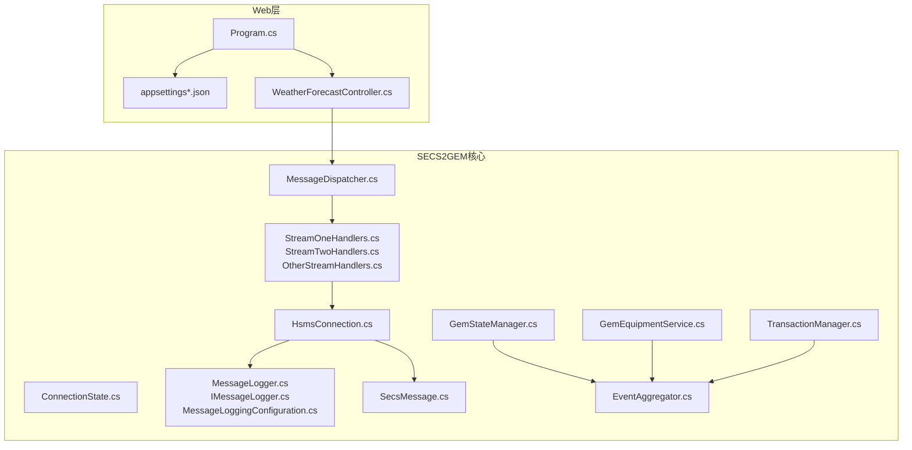
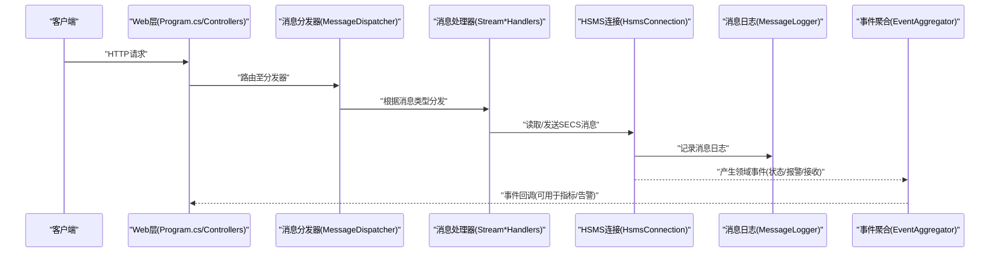
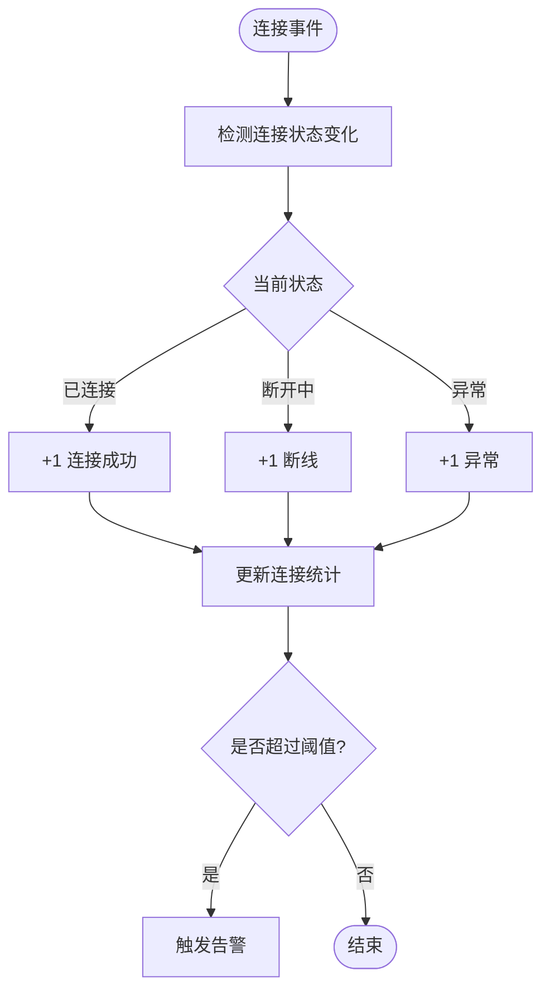
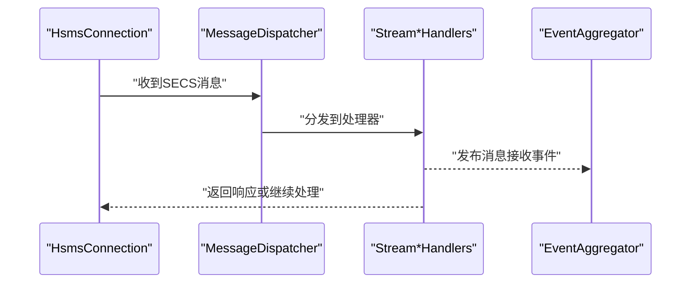
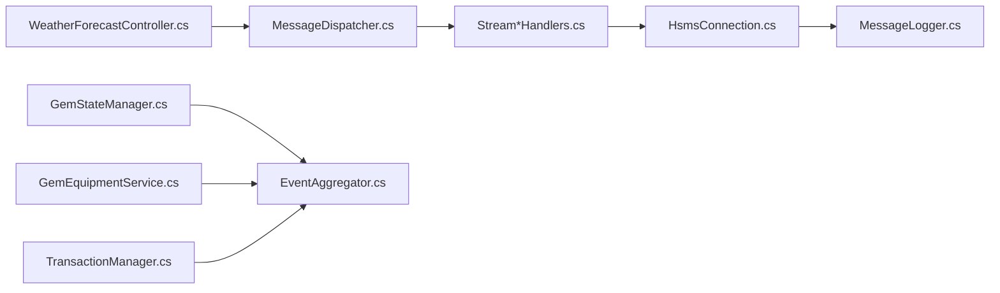

# 监控告警

<cite>
**本文引用的文件**
- [README.md](file://README.md)
- [appsettings.json](file://WebGem/WebGem/appsettings.json)
- [appsettings.Development.json](file://WebGem/WebGem/appsettings.Development.json)
- [Program.cs](file://WebGem/WebGem/Program.cs)
- [WeatherForecastController.cs](file://WebGem/WebGem/Controllers/WeatherForecastController.cs)
- [ConnectionState.cs](file://WebGem/SECS2GEM/Core/Enums/ConnectionState.cs)
- [HsmsConnection.cs](file://WebGem/SECS2GEM/Infrastructure/Connection/HsmsConnection.cs)
- [MessageLogger.cs](file://WebGem/SECS2GEM/Infrastructure/Logging/MessageLogger.cs)
- [IMessageLogger.cs](file://WebGem/SECS2GEM/Infrastructure/Logging/IMessageLogger.cs)
- [MessageLoggingConfiguration.cs](file://WebGem/SECS2GEM/Infrastructure/Logging/MessageLoggingConfiguration.cs)
- [SecsMessage.cs](file://WebGem/SECS2GEM/Core/Entities/SecsMessage.cs)
- [GemEquipmentService.cs](file://WebGem/SECS2GEM/Application/Services/GemEquipmentService.cs)
- [GemStateManager.cs](file://WebGem/SECS2GEM/Application/State/GemStateManager.cs)
- [AlarmEvent.cs](file://WebGem/SECS2GEM/Domain/Events/AlarmEvent.cs)
- [StateChangedEvent.cs](file://WebGem/SECS2GEM/Domain/Events/StateChangedEvent.cs)
- [MessageReceivedEvent.cs](file://WebGem/SECS2GEM/Domain/Events/MessageReceivedEvent.cs)
- [IGemEquipmentService.cs](file://WebGem/SECS2GEM/Domain/Interfaces/IGemEquipmentService.cs)
- [ITransactionManager.cs](file://WebGem/SECS2GEM/Domain/Interfaces/ITransactionManager.cs)
- [TransactionManager.cs](file://WebGem/SECS2GEM/Infrastructure/Services/TransactionManager.cs)
- [EventAggregator.cs](file://WebGem/SECS2GEM/Infrastructure/Services/EventAggregator.cs)
- [MessageDispatcher.cs](file://WebGem/SECS2GEM/Application/Handlers/MessageDispatcher.cs)
- [StreamOneHandlers.cs](file://WebGem/SECS2GEM/Application/Handlers/StreamOneHandlers.cs)
- [StreamTwoHandlers.cs](file://WebGem/SECS2GEM/Application/Handlers/StreamTwoHandlers.cs)
- [OtherStreamHandlers.cs](file://WebGem/SECS2GEM/Application/Handlers/OtherStreamHandlers.cs)
- [SECS2GEM.csproj](file://WebGem/SECS2GEM/SECS2GEM.csproj)
- [WebGem.csproj](file://WebGem/WebGem/WebGem.csproj)
</cite>

## 目录
1. [简介](#简介)
2. [项目结构](#项目结构)
3. [核心组件](#核心组件)
4. [架构总览](#架构总览)
5. [详细组件分析](#详细组件分析)
6. [依赖关系分析](#依赖关系分析)
7. [性能考量](#性能考量)
8. [故障排查指南](#故障排查指南)
9. [结论](#结论)
10. [附录](#附录)

## 简介
本文件面向SECS2-GEM项目的监控与告警建设，围绕连接状态监控、消息处理统计、性能指标采集、日志监控配置、关键业务指标（设备连接成功率、消息处理延迟、错误率）、告警规则与通知渠道、第三方监控工具集成（Prometheus、Grafana、ELK Stack）、监控仪表板与自定义报表、故障自动检测与恢复机制以及监控数据存储与长期趋势分析等方面进行系统化说明。文档在不直接展示代码内容的前提下，通过源码路径定位与结构化分析，帮助开发者与运维人员快速落地可观察性体系。

## 项目结构
SECS2-GEM采用分层架构：WebGem作为ASP.NET Core应用承载控制器与运行时；SECS2GEM为核心协议实现，包含连接、序列化、事件、状态管理、消息处理等模块。监控关注点主要落在以下区域：
- 连接层：HSMS连接状态与消息收发
- 应用层：消息分发器与处理器
- 领域层：事件聚合与状态变更
- 基础设施层：日志记录与序列化
- Web层：HTTP请求入口与配置

图表来源
- [Program.cs:1-24](file://WebGem/WebGem/Program.cs#L1-L24)
- [WeatherForecastController.cs:1-27](file://WebGem/WebGem/Controllers/WeatherForecastController.cs#L1-L27)
- [HsmsConnection.cs](file://WebGem/SECS2GEM/Infrastructure/Connection/HsmsConnection.cs)
- [ConnectionState.cs](file://WebGem/SECS2GEM/Core/Enums/ConnectionState.cs)
- [MessageLogger.cs](file://WebGem/SECS2GEM/Infrastructure/Logging/MessageLogger.cs)
- [IMessageLogger.cs](file://WebGem/SECS2GEM/Infrastructure/Logging/IMessageLogger.cs)
- [MessageLoggingConfiguration.cs](file://WebGem/SECS2GEM/Infrastructure/Logging/MessageLoggingConfiguration.cs)
- [SecsMessage.cs](file://WebGem/SECS2GEM/Core/Entities/SecsMessage.cs)
- [MessageDispatcher.cs](file://WebGem/SECS2GEM/Application/Handlers/MessageDispatcher.cs)
- [StreamOneHandlers.cs](file://WebGem/SECS2GEM/Application/Handlers/StreamOneHandlers.cs)
- [StreamTwoHandlers.cs](file://WebGem/SECS2GEM/Application/Handlers/StreamTwoHandlers.cs)
- [OtherStreamHandlers.cs](file://WebGem/SECS2GEM/Application/Handlers/OtherStreamHandlers.cs)
- [EventAggregator.cs](file://WebGem/SECS2GEM/Infrastructure/Services/EventAggregator.cs)
- [GemStateManager.cs](file://WebGem/SECS2GEM/Application/State/GemStateManager.cs)
- [GemEquipmentService.cs](file://WebGem/SECS2GEM/Application/Services/GemEquipmentService.cs)
- [TransactionManager.cs](file://WebGem/SECS2GEM/Infrastructure/Services/TransactionManager.cs)

章节来源
- [Program.cs:1-24](file://WebGem/WebGem/Program.cs#L1-L24)
- [appsettings.json:1-10](file://WebGem/WebGem/appsettings.json#L1-L10)
- [appsettings.Development.json:1-9](file://WebGem/WebGem/appsettings.Development.json#L1-L9)

## 核心组件
- 连接与状态
  - 连接状态枚举用于统一表达连接生命周期与异常状态，便于监控与告警。
  - HSMS连接负责底层通信，是监控连接可用性的关键节点。
- 日志与消息记录
  - 消息日志接口与实现提供统一的消息记录能力，支持按配置启用/禁用与格式化输出。
- 事件与状态
  - 事件聚合器集中处理各类领域事件（状态变更、报警、消息接收），是业务指标统计与告警触发的基础。
- 消息处理
  - 消息分发器与处理器负责将收到的SECS消息路由到对应处理逻辑，是消息处理统计与延迟分析的核心。
- 事务与服务
  - 事务管理器与设备服务封装了业务操作，可用于追踪耗时与错误率。

章节来源
- [ConnectionState.cs](file://WebGem/SECS2GEM/Core/Enums/ConnectionState.cs)
- [HsmsConnection.cs](file://WebGem/SECS2GEM/Infrastructure/Connection/HsmsConnection.cs)
- [IMessageLogger.cs](file://WebGem/SECS2GEM/Infrastructure/Logging/IMessageLogger.cs)
- [MessageLogger.cs](file://WebGem/SECS2GEM/Infrastructure/Logging/MessageLogger.cs)
- [MessageLoggingConfiguration.cs](file://WebGem/SECS2GEM/Infrastructure/Logging/MessageLoggingConfiguration.cs)
- [EventAggregator.cs](file://WebGem/SECS2GEM/Infrastructure/Services/EventAggregator.cs)
- [GemStateManager.cs](file://WebGem/SECS2GEM/Application/State/GemStateManager.cs)
- [GemEquipmentService.cs](file://WebGem/SECS2GEM/Application/Services/GemEquipmentService.cs)
- [TransactionManager.cs](file://WebGem/SECS2GEM/Infrastructure/Services/TransactionManager.cs)
- [MessageDispatcher.cs](file://WebGem/SECS2GEM/Application/Handlers/MessageDispatcher.cs)
- [StreamOneHandlers.cs](file://WebGem/SECS2GEM/Application/Handlers/StreamOneHandlers.cs)
- [StreamTwoHandlers.cs](file://WebGem/SECS2GEM/Application/Handlers/StreamTwoHandlers.cs)
- [OtherStreamHandlers.cs](file://WebGem/SECS2GEM/Application/Handlers/OtherStreamHandlers.cs)

## 架构总览
下图展示了从HTTP请求到SECS消息处理的端到端流程，以及监控关注点的落点：

图表来源
- [Program.cs:1-24](file://WebGem/WebGem/Program.cs#L1-L24)
- [WeatherForecastController.cs:1-27](file://WebGem/WebGem/Controllers/WeatherForecastController.cs#L1-L27)
- [MessageDispatcher.cs](file://WebGem/SECS2GEM/Application/Handlers/MessageDispatcher.cs)
- [StreamOneHandlers.cs](file://WebGem/SECS2GEM/Application/Handlers/StreamOneHandlers.cs)
- [StreamTwoHandlers.cs](file://WebGem/SECS2GEM/Application/Handlers/StreamTwoHandlers.cs)
- [OtherStreamHandlers.cs](file://WebGem/SECS2GEM/Application/Handlers/OtherStreamHandlers.cs)
- [HsmsConnection.cs](file://WebGem/SECS2GEM/Infrastructure/Connection/HsmsConnection.cs)
- [MessageLogger.cs](file://WebGem/SECS2GEM/Infrastructure/Logging/MessageLogger.cs)
- [EventAggregator.cs](file://WebGem/SECS2GEM/Infrastructure/Services/EventAggregator.cs)

## 详细组件分析

### 连接状态监控
- 监控目标
  - 连接建立/断开次数与持续时间
  - 异常断线与重连次数
  - 连接健康度（可用/不可用）
- 关键实现位置
  - 连接状态枚举用于统一状态表达，便于统计与告警。
  - HSMS连接负责实际连接与异常上报，是监控数据的主要来源。
- 建议指标
  - 连接状态计数（已连接、断开中、异常）
  - 连接失败率（单位时间内断线次数/总尝试次数）
  - 平均连接时长与断线间隔
- 告警建议
  - 连续断线超过阈值（如N次/分钟）
  - 连接可用率低于阈值（如95%）

图表来源
- [ConnectionState.cs](file://WebGem/SECS2GEM/Core/Enums/ConnectionState.cs)
- [HsmsConnection.cs](file://WebGem/SECS2GEM/Infrastructure/Connection/HsmsConnection.cs)

章节来源
- [ConnectionState.cs](file://WebGem/SECS2GEM/Core/Enums/ConnectionState.cs)
- [HsmsConnection.cs](file://WebGem/SECS2GEM/Infrastructure/Connection/HsmsConnection.cs)

### 消息处理统计
- 监控目标
  - 消息接收/发送总量与时序
  - 各类消息类型处理次数与成功率
  - 处理耗时分布（P50/P95/P99）
- 关键实现位置
  - 消息分发器与处理器负责消息路由与执行。
  - 事件聚合器汇聚消息接收事件，便于统计与可视化。
- 建议指标
  - 消息接收速率（QPS）
  - 消息处理延迟（从接收至完成）
  - 错误消息比例（解析/处理失败）
- 告警建议
  - 接收/发送队列堆积
  - 处理延迟超阈值
  - 错误率突增

图表来源
- [MessageDispatcher.cs](file://WebGem/SECS2GEM/Application/Handlers/MessageDispatcher.cs)
- [StreamOneHandlers.cs](file://WebGem/SECS2GEM/Application/Handlers/StreamOneHandlers.cs)
- [StreamTwoHandlers.cs](file://WebGem/SECS2GEM/Application/Handlers/StreamTwoHandlers.cs)
- [OtherStreamHandlers.cs](file://WebGem/SECS2GEM/Application/Handlers/OtherStreamHandlers.cs)
- [EventAggregator.cs](file://WebGem/SECS2GEM/Infrastructure/Services/EventAggregator.cs)

章节来源
- [MessageDispatcher.cs](file://WebGem/SECS2GEM/Application/Handlers/MessageDispatcher.cs)
- [StreamOneHandlers.cs](file://WebGem/SECS2GEM/Application/Handlers/StreamOneHandlers.cs)
- [StreamTwoHandlers.cs](file://WebGem/SECS2GEM/Application/Handlers/StreamTwoHandlers.cs)
- [OtherStreamHandlers.cs](file://WebGem/SECS2GEM/Application/Handlers/OtherStreamHandlers.cs)
- [EventAggregator.cs](file://WebGem/SECS2GEM/Infrastructure/Services/EventAggregator.cs)

### 性能指标采集
- 监控目标
  - 设备交互耗时（请求-响应时延）
  - 事务处理吞吐量
  - 内存/CPU使用情况（结合外部监控）
- 关键实现位置
  - 事务管理器与设备服务封装业务调用，适合埋点统计。
- 建议指标
  - 设备命令平均耗时、错误率
  - 事务并发数与排队长度
- 告警建议
  - 耗时P95/P99超阈值
  - 并发阻塞或队列增长

章节来源
- [TransactionManager.cs](file://WebGem/SECS2GEM/Infrastructure/Services/TransactionManager.cs)
- [GemEquipmentService.cs](file://WebGem/SECS2GEM/Application/Services/GemEquipmentService.cs)

### 日志监控配置
- 日志级别
  - 默认级别与Microsoft.AspNetCore警告级别已在配置中体现，适合生产环境分级输出。
- 日志轮转
  - 可通过日志框架配置（如Serilog、NLog）实现文件大小/时间轮转，建议保留最近N天的日志。
- 异常告警
  - 将错误/致命日志接入告警通道，结合关键词过滤与去重策略。
- 日志格式
  - 使用结构化日志，便于字段提取与查询。

章节来源
- [appsettings.json:1-10](file://WebGem/WebGem/appsettings.json#L1-L10)
- [appsettings.Development.json:1-9](file://WebGem/WebGem/appsettings.Development.json#L1-L9)
- [MessageLogger.cs](file://WebGem/SECS2GEM/Infrastructure/Logging/MessageLogger.cs)
- [IMessageLogger.cs](file://WebGem/SECS2GEM/Infrastructure/Logging/IMessageLogger.cs)
- [MessageLoggingConfiguration.cs](file://WebGem/SECS2GEM/Infrastructure/Logging/MessageLoggingConfiguration.cs)

### 关键业务指标
- 设备连接成功率
  - 计算公式：成功连接次数 / 总连接尝试次数
  - 可基于连接状态事件统计
- 消息处理延迟
  - 从接收事件到处理完成的时间差
  - 分布统计（P50/P95/P99）
- 错误率统计
  - 错误消息/总消息 或 异常断线次数/总连接次数
  - 可按消息类型与设备维度细分

章节来源
- [EventAggregator.cs](file://WebGem/SECS2GEM/Infrastructure/Services/EventAggregator.cs)
- [ConnectionState.cs](file://WebGem/SECS2GEM/Core/Enums/ConnectionState.cs)
- [MessageReceivedEvent.cs](file://WebGem/SECS2GEM/Domain/Events/MessageReceivedEvent.cs)

### 告警规则配置
- 阈值设置
  - 连接可用率 < X%
  - 连续断线 > N次/分钟
  - 处理延迟 P95/P99 > T毫秒
  - 错误率 > E%
- 告警级别
  - 信息级：连接抖动预警
  - 一般：延迟/错误率轻微上升
  - 严重：可用率低/连续断线
  - 紧急：服务不可用
- 通知渠道
  - 邮件、即时通讯群组、电话（按级别分级）
- 去重与静默
  - 同一指标在周期内仅一次告警
  - 重要变更窗口内静默告警

章节来源
- [ConnectionState.cs](file://WebGem/SECS2GEM/Core/Enums/ConnectionState.cs)
- [EventAggregator.cs](file://WebGem/SECS2GEM/Infrastructure/Services/EventAggregator.cs)

### 第三方监控工具集成
- Prometheus
  - 通过应用内置指标导出（如使用Prometheus客户端库）暴露连接、消息、错误等指标
- Grafana
  - 基于Prometheus数据源构建仪表板，展示趋势与告警
- ELK Stack
  - 收集结构化日志，建立索引，实现日志检索、聚合与异常告警
- 集成要点
  - 统一日志格式与标签
  - 指标命名规范与单位统一
  - 告警规则与通知通道对接

章节来源
- [Program.cs:1-24](file://WebGem/WebGem/Program.cs#L1-L24)
- [MessageLogger.cs](file://WebGem/SECS2GEM/Infrastructure/Logging/MessageLogger.cs)

### 监控仪表板设计与自定义报表
- 仪表板建议
  - 连接健康看板：连接数、断线率、重连次数
  - 消息处理看板：QPS、延迟分布、错误率
  - 业务指标看板：设备连接成功率、命令耗时
- 自定义报表
  - 按日/周/月生成趋势报告
  - 导出异常时段日志与指标快照

章节来源
- [EventAggregator.cs](file://WebGem/SECS2GEM/Infrastructure/Services/EventAggregator.cs)
- [MessageLogger.cs](file://WebGem/SECS2GEM/Infrastructure/Logging/MessageLogger.cs)

### 故障自动检测与恢复
- 自动检测
  - 连续断线、处理延迟激增、错误率飙升
  - 基于滑动窗口统计与阈值比较
- 自动恢复
  - 连接断线后自动重连（指数退避）
  - 处理队列拥塞时降载或限流
  - 服务不可用时切换备用实例（需配合负载均衡）

章节来源
- [HsmsConnection.cs](file://WebGem/SECS2GEM/Infrastructure/Connection/HsmsConnection.cs)
- [TransactionManager.cs](file://WebGem/SECS2GEM/Infrastructure/Services/TransactionManager.cs)

### 监控数据存储与长期趋势分析
- 存储建议
  - 指标：时序数据库（如Prometheus TSDB、InfluxDB）
  - 日志：对象存储+索引（如ES）
- 趋势分析
  - 周期性峰值识别与容量规划
  - 回归分析定位异常根因

章节来源
- [ConnectionState.cs](file://WebGem/SECS2GEM/Core/Enums/ConnectionState.cs)
- [MessageLogger.cs](file://WebGem/SECS2GEM/Infrastructure/Logging/MessageLogger.cs)

## 依赖关系分析
SECS2GEM各模块之间存在清晰的依赖边界：Web层通过控制器与消息分发器交互；分发器与处理器依赖连接层进行消息收发；事件聚合器贯穿状态、报警与消息接收事件，是监控数据汇总的关键枢纽。

图表来源
- [WeatherForecastController.cs:1-27](file://WebGem/WebGem/Controllers/WeatherForecastController.cs#L1-L27)
- [MessageDispatcher.cs](file://WebGem/SECS2GEM/Application/Handlers/MessageDispatcher.cs)
- [StreamOneHandlers.cs](file://WebGem/SECS2GEM/Application/Handlers/StreamOneHandlers.cs)
- [StreamTwoHandlers.cs](file://WebGem/SECS2GEM/Application/Handlers/StreamTwoHandlers.cs)
- [OtherStreamHandlers.cs](file://WebGem/SECS2GEM/Application/Handlers/OtherStreamHandlers.cs)
- [HsmsConnection.cs](file://WebGem/SECS2GEM/Infrastructure/Connection/HsmsConnection.cs)
- [MessageLogger.cs](file://WebGem/SECS2GEM/Infrastructure/Logging/MessageLogger.cs)
- [GemStateManager.cs](file://WebGem/SECS2GEM/Application/State/GemStateManager.cs)
- [GemEquipmentService.cs](file://WebGem/SECS2GEM/Application/Services/GemEquipmentService.cs)
- [TransactionManager.cs](file://WebGem/SECS2GEM/Infrastructure/Services/TransactionManager.cs)
- [EventAggregator.cs](file://WebGem/SECS2GEM/Infrastructure/Services/EventAggregator.cs)

章节来源
- [Program.cs:1-24](file://WebGem/WebGem/Program.cs#L1-L24)
- [SECS2GEM.csproj](file://WebGem/SECS2GEM/SECS2GEM.csproj)
- [WebGem.csproj](file://WebGem/WebGem/WebGem.csproj)

## 性能考量
- 指标采集开销
  - 控制采样频率与字段数量，避免对业务造成额外压力
- 日志性能
  - 结构化日志与异步写入，减少I/O阻塞
- 事件风暴
  - 对高频事件进行聚合与限速，防止监控系统过载

## 故障排查指南
- 连接问题
  - 检查连接状态事件与异常日志，确认网络与设备可达性
- 消息处理问题
  - 定位具体处理器与消息类型，查看处理耗时与错误日志
- 告警误报
  - 校验阈值与静默窗口配置，调整去重策略

章节来源
- [ConnectionState.cs](file://WebGem/SECS2GEM/Core/Enums/ConnectionState.cs)
- [MessageLogger.cs](file://WebGem/SECS2GEM/Infrastructure/Logging/MessageLogger.cs)
- [EventAggregator.cs](file://WebGem/SECS2GEM/Infrastructure/Services/EventAggregator.cs)

## 结论
通过在连接层、消息处理链路、事件聚合与日志记录四个关键点部署监控指标与告警规则，并结合Prometheus/Grafana/ELK实现可观测性闭环，SECS2-GEM项目可以有效保障设备连接稳定性、消息处理可靠性与业务指标透明化。建议优先实现基础指标与告警，再逐步完善仪表板与自动化恢复能力。

## 附录
- 项目文件清单
  - WebGem配置与入口：Program.cs、appsettings*.json
  - 示例控制器：WeatherForecastController.cs
  - SECS2GEM核心：连接、枚举、日志、事件、状态、服务、事务、消息分发与处理器

章节来源
- [Program.cs:1-24](file://WebGem/WebGem/Program.cs#L1-L24)
- [appsettings.json:1-10](file://WebGem/WebGem/appsettings.json#L1-L10)
- [appsettings.Development.json:1-9](file://WebGem/WebGem/appsettings.Development.json#L1-L9)
- [WeatherForecastController.cs:1-27](file://WebGem/WebGem/Controllers/WeatherForecastController.cs#L1-L27)
- [SECS2GEM.csproj](file://WebGem/SECS2GEM/SECS2GEM.csproj)
- [WebGem.csproj](file://WebGem/WebGem/WebGem.csproj)