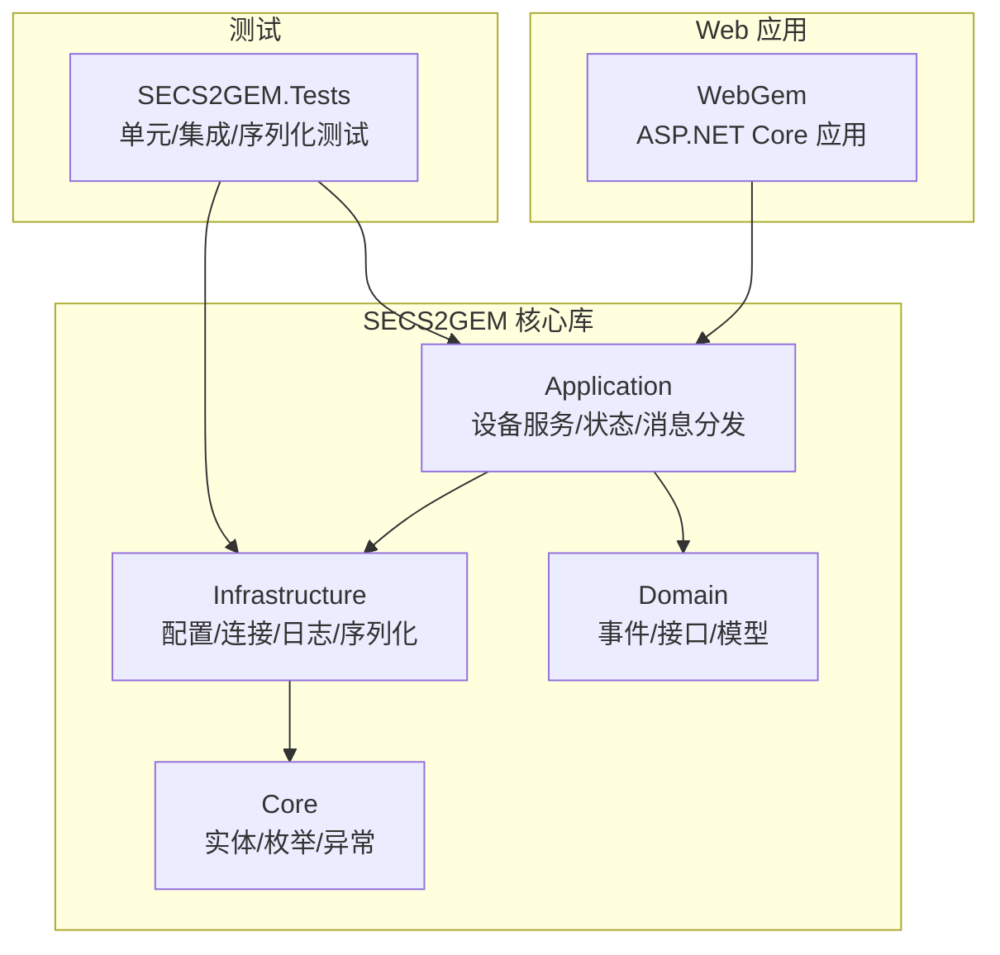
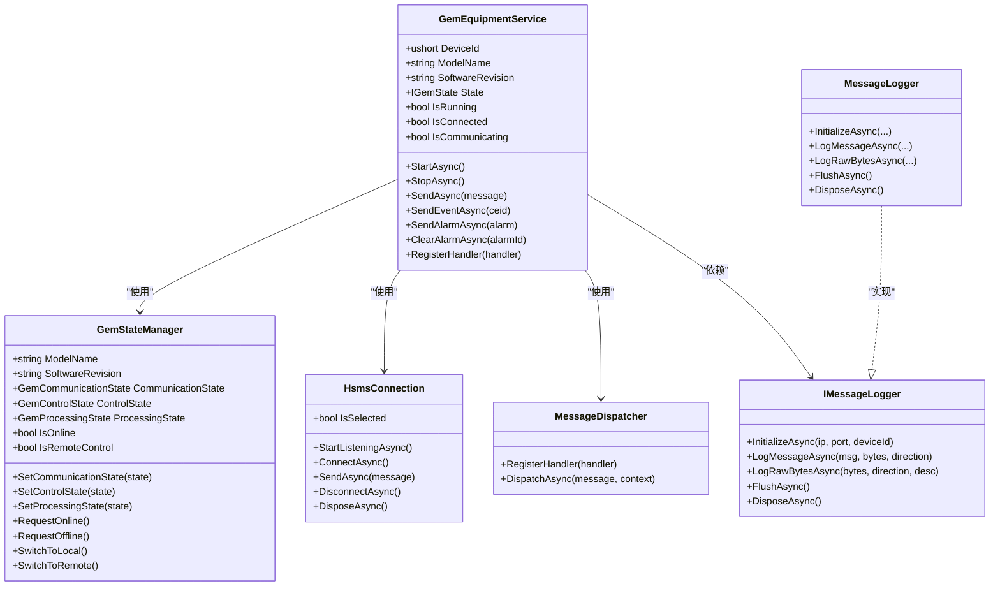
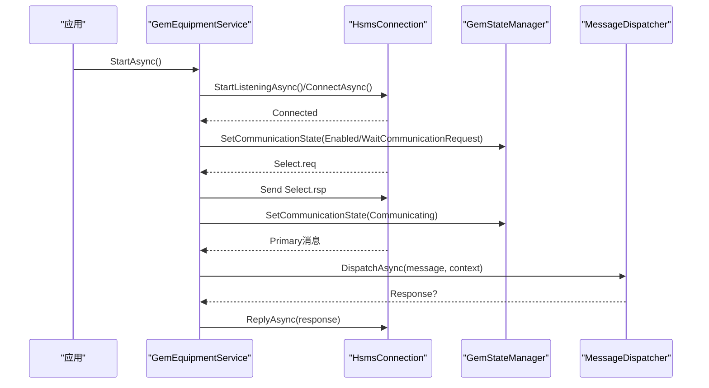
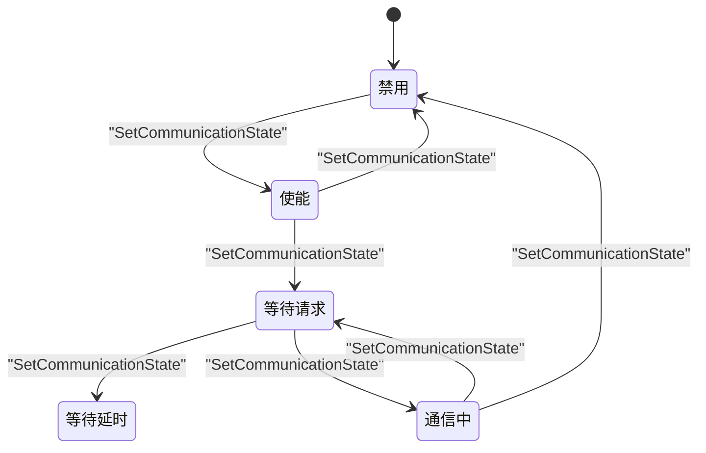
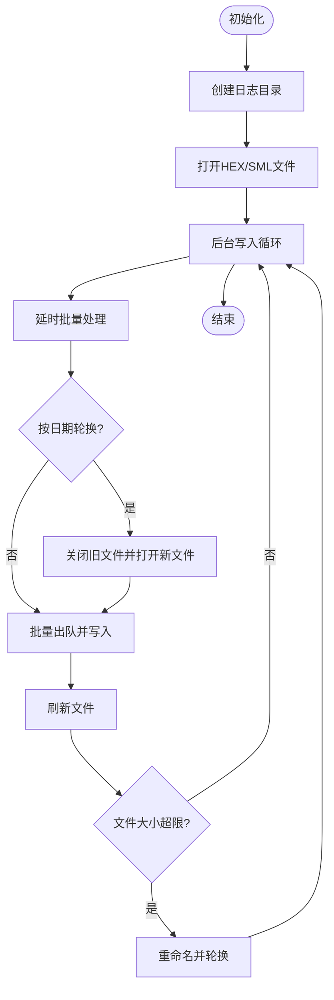
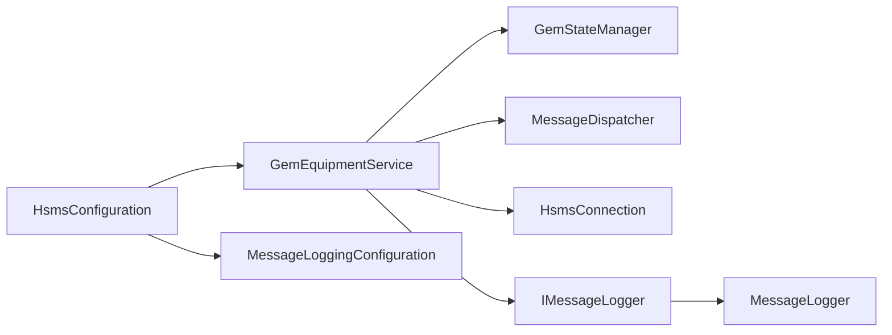

# 维护自动化

<cite>
**本文引用的文件**
- [README.md](file://README.md)
- [WebGem\SECS2GEM\SECS2GEM.csproj](file://WebGem/SECS2GEM/SECS2GEM.csproj)
- [WebGem\WebGem\WebGem.csproj](file://WebGem/WebGem/WebGem.csproj)
- [WebGem\WebGem\appsettings.json](file://WebGem/WebGem/appsettings.json)
- [WebGem\WebGem\appsettings.Development.json](file://WebGem/WebGem/appsettings.Development.json)
- [WebGem\SECS2GEM\Application\Services\GemEquipmentService.cs](file://WebGem/SECS2GEM/Application/Services/GemEquipmentService.cs)
- [WebGem\SECS2GEM\Application\State\GemStateManager.cs](file://WebGem/SECS2GEM/Application/State/GemStateManager.cs)
- [WebGem\SECS2GEM\Infrastructure\Configuration\HsmsConfiguration.cs](file://WebGem/SECS2GEM/Infrastructure/Configuration/HsmsConfiguration.cs)
- [WebGem\SECS2GEM\Infrastructure\Logging\MessageLogger.cs](file://WebGem/SECS2GEM/Infrastructure/Logging/MessageLogger.cs)
- [WebGem\SECS2GEM\Infrastructure\Logging\IMessageLogger.cs](file://WebGem/SECS2GEM/Infrastructure/Logging/IMessageLogger.cs)
- [WebGem\SECS2GEM.Tests\GemStateManagerTests.cs](file://WebGem/SECS2GEM.Tests/GemStateManagerTests.cs)
- [WebGem\SECS2GEM.Tests\MessageHandlerTests.cs](file://WebGem/SECS2GEM.Tests/MessageHandlerTests.cs)
- [WebGem\SECS2GEM.Tests\SecsSerializerTests.cs](file://WebGem/SECS2GEM.Tests/SecsSerializerTests.cs)
- [WebGem\SECS2GEM.Tests\IntegrationTests.cs](file://WebGem/SECS2GEM.Tests/IntegrationTests.cs)
</cite>

## 目录
1. [简介](#简介)
2. [项目结构](#项目结构)
3. [核心组件](#核心组件)
4. [架构总览](#架构总览)
5. [详细组件分析](#详细组件分析)
6. [依赖关系分析](#依赖关系分析)
7. [性能考量](#性能考量)
8. [故障排查指南](#故障排查指南)
9. [结论](#结论)
10. [附录](#附录)

## 简介
本文件面向SECS2-GEM项目的维护与自动化运维，围绕以下目标展开：
- 运维自动化脚本与工具：部署、配置更新、健康检查
- CI/CD流水线集成：自动化构建、测试与部署
- 系统维护任务自动化：日志清理、临时文件清理、资源回收
- 远程维护与诊断：日志记录、状态查询、事件上报
- 批量操作与命令行工具：开发与使用指南
- 维护任务调度与执行监控：状态机驱动的自动化
- 审计与记录：日志与事件的可追溯性
- 自动化测试与质量保证：单元测试、集成测试与序列化测试
- 工具安装、配置与使用：基于现有配置与日志能力

本项目采用分层架构与模块化设计，核心围绕GEM状态机、HSMS连接、消息分发与日志记录展开，为自动化运维提供了清晰的切入点。

## 项目结构
项目采用多项目解决方案，包含核心库、Web应用、测试与仿真组件。与维护自动化密切相关的模块包括：
- 应用层：设备服务、状态管理、消息分发
- 基础设施层：配置、连接、日志、序列化
- 测试层：单元测试、集成测试、序列化测试

图示来源
- [WebGem\SECS2GEM\SECS2GEM.csproj:1-10](file://WebGem/SECS2GEM/SECS2GEM.csproj#L1-L10)
- [WebGem\WebGem\WebGem.csproj:1-14](file://WebGem/WebGem/WebGem.csproj#L1-L14)

章节来源
- [WebGem\SECS2GEM\SECS2GEM.csproj:1-10](file://WebGem/SECS2GEM/SECS2GEM.csproj#L1-L10)
- [WebGem\WebGem\WebGem.csproj:1-14](file://WebGem/WebGem/WebGem.csproj#L1-L14)
- [WebGem\WebGem\appsettings.json:1-10](file://WebGem/WebGem/appsettings.json#L1-L10)
- [WebGem\WebGem\appsettings.Development.json:1-9](file://WebGem/WebGem/appsettings.Development.json#L1-L9)

## 核心组件
- 设备服务：封装HSMS连接、消息分发、状态管理与事件发布，提供生命周期管理（启动/停止/释放）与事件/报警上报能力。
- 状态管理器：实现GEM协议的状态机（通信/控制/处理），支持状态转换验证与标准状态变量注册。
- 配置系统：集中管理HSMS连接参数、超时、心跳、缓冲区、自动重连与消息日志配置。
- 日志系统：异步消息日志记录器，支持按日期/大小轮换、保留期清理、HEX/SML双格式输出。

章节来源
- [WebGem\SECS2GEM\Application\Services\GemEquipmentService.cs:1-456](file://WebGem/SECS2GEM/Application/Services/GemEquipmentService.cs#L1-L456)
- [WebGem\SECS2GEM\Application\State\GemStateManager.cs:1-492](file://WebGem/SECS2GEM/Application/State/GemStateManager.cs#L1-L492)
- [WebGem\SECS2GEM\Infrastructure\Configuration\HsmsConfiguration.cs:1-266](file://WebGem/SECS2GEM/Infrastructure/Configuration/HsmsConfiguration.cs#L1-L266)
- [WebGem\SECS2GEM\Infrastructure\Logging\MessageLogger.cs:1-438](file://WebGem/SECS2GEM/Infrastructure/Logging/MessageLogger.cs#L1-L438)
- [WebGem\SECS2GEM\Infrastructure\Logging\IMessageLogger.cs:1-70](file://WebGem/SECS2GEM/Infrastructure/Logging/IMessageLogger.cs#L1-L70)

## 架构总览
SECS2-GEM通过“外观模式”对外提供统一入口，内部由状态管理器、消息分发器与HSMS连接协同工作。日志系统以异步队列+后台任务的方式解耦消息处理与IO写入，确保通信线程不被阻塞。

图示来源
- [WebGem\SECS2GEM\Application\Services\GemEquipmentService.cs:1-456](file://WebGem/SECS2GEM/Application/Services/GemEquipmentService.cs#L1-L456)
- [WebGem\SECS2GEM\Application\State\GemStateManager.cs:1-492](file://WebGem/SECS2GEM/Application/State/GemStateManager.cs#L1-L492)
- [WebGem\SECS2GEM\Infrastructure\Logging\IMessageLogger.cs:1-70](file://WebGem/SECS2GEM/Infrastructure/Logging/IMessageLogger.cs#L1-L70)
- [WebGem\SECS2GEM\Infrastructure\Logging\MessageLogger.cs:1-438](file://WebGem/SECS2GEM/Infrastructure/Logging/MessageLogger.cs#L1-L438)

## 详细组件分析

### 设备服务（GemEquipmentService）
- 生命周期管理：启动/停止/释放，根据配置决定连接模式（主动/被动），并在连接建立后进入通信状态。
- 事件与报警：支持事件报告（S6F11）与报警上报（S5F1），并发布事件聚合器事件。
- 默认处理器注册：覆盖多个流（1/2/5/6/7/10）的关键消息处理器，确保协议交互完整。
- 状态联动：连接状态变化、通信状态变化、控制状态变化均触发事件通知。

图示来源
- [WebGem\SECS2GEM\Application\Services\GemEquipmentService.cs:140-184](file://WebGem/SECS2GEM/Application/Services/GemEquipmentService.cs#L140-L184)
- [WebGem\SECS2GEM\Application\Services\GemEquipmentService.cs:324-385](file://WebGem/SECS2GEM/Application/Services/GemEquipmentService.cs#L324-L385)

章节来源
- [WebGem\SECS2GEM\Application\Services\GemEquipmentService.cs:1-456](file://WebGem/SECS2GEM/Application/Services/GemEquipmentService.cs#L1-L456)

### 状态管理器（GemStateManager）
- 三类状态机：通信状态（禁用/使能/等待请求/等待延时/通信中）、控制状态（离线/尝试上线/本地/远程/主机离线）、处理状态（初始化/空闲/设置/就绪/执行/暂停）。
- 状态转换验证：通过显式规则校验转换合法性，防止非法状态跃迁。
- 标准状态变量：内置时钟、控制状态等标准变量，便于查询与上报。

图示来源
- [WebGem\SECS2GEM\Application\State\GemStateManager.cs:357-387](file://WebGem/SECS2GEM/Application/State/GemStateManager.cs#L357-L387)

章节来源
- [WebGem\SECS2GEM\Application\State\GemStateManager.cs:1-492](file://WebGem/SECS2GEM/Application/State/GemStateManager.cs#L1-L492)

### 配置系统（HsmsConfiguration）
- HSMS连接参数：设备ID、IP/端口、连接模式、超时（T3/T5/T6/T7/T8）、心跳间隔与失败阈值、缓冲区大小、自动重连与延迟。
- GEM设备配置：设备型号、软件版本、初始控制状态、自动上线、初始在线模式（本地/远程）。
- 参数校验：对端口与关键超时进行范围校验，确保运行稳定性。

章节来源
- [WebGem\SECS2GEM\Infrastructure\Configuration\HsmsConfiguration.cs:1-266](file://WebGem/SECS2GEM/Infrastructure/Configuration/HsmsConfiguration.cs#L1-L266)

### 日志系统（MessageLogger）
- 异步写入：生产者-消费者队列+后台任务，避免阻塞消息处理线程。
- 文件管理：按日期轮换、按大小轮换、保留期清理；支持HEX与SML两种格式。
- 初始化与释放：创建目录、打开文件、后台写入循环、刷新与关闭。

图示来源
- [WebGem\SECS2GEM\Infrastructure\Logging\MessageLogger.cs:176-366](file://WebGem/SECS2GEM/Infrastructure/Logging/MessageLogger.cs#L176-L366)

章节来源
- [WebGem\SECS2GEM\Infrastructure\Logging\MessageLogger.cs:1-438](file://WebGem/SECS2GEM/Infrastructure/Logging/MessageLogger.cs#L1-L438)
- [WebGem\SECS2GEM\Infrastructure\Logging\IMessageLogger.cs:1-70](file://WebGem/SECS2GEM/Infrastructure/Logging/IMessageLogger.cs#L1-L70)

## 依赖关系分析
- 设备服务依赖状态管理器、消息分发器与HSMS连接，并通过事件聚合器发布事件。
- 日志系统通过接口解耦，便于替换实现与测试。
- 配置系统贯穿连接与日志模块，提供统一参数来源。

图示来源
- [WebGem\SECS2GEM\Application\Services\GemEquipmentService.cs:1-133](file://WebGem/SECS2GEM/Application/Services/GemEquipmentService.cs#L1-L133)
- [WebGem\SECS2GEM\Infrastructure\Logging\IMessageLogger.cs:1-70](file://WebGem/SECS2GEM/Infrastructure/Logging/IMessageLogger.cs#L1-L70)
- [WebGem\SECS2GEM\Infrastructure\Logging\MessageLogger.cs:1-94](file://WebGem/SECS2GEM/Infrastructure/Logging/MessageLogger.cs#L1-L94)
- [WebGem\SECS2GEM\Infrastructure\Configuration\HsmsConfiguration.cs:1-134](file://WebGem/SECS2GEM/Infrastructure/Configuration/HsmsConfiguration.cs#L1-L134)

章节来源
- [WebGem\SECS2GEM\Application\Services\GemEquipmentService.cs:1-133](file://WebGem/SECS2GEM/Application/Services/GemEquipmentService.cs#L1-L133)
- [WebGem\SECS2GEM\Infrastructure\Configuration\HsmsConfiguration.cs:1-134](file://WebGem/SECS2GEM/Infrastructure/Configuration/HsmsConfiguration.cs#L1-L134)

## 性能考量
- 异步日志写入：通过后台任务与信号量控制，降低消息处理线程阻塞风险。
- 批量写入与定时刷新：减少频繁IO操作，提升吞吐。
- 文件轮换策略：按日期与大小轮换，避免单文件过大影响性能与磁盘占用。
- 状态机验证：严格的转换规则减少无效状态带来的额外处理成本。

## 故障排查指南
- 连接问题：检查HSMS配置（IP/端口/模式/超时），确认自动重连与心跳参数合理。
- 通信状态异常：关注设备服务的连接状态变化事件与状态管理器的通信状态流转。
- 日志缺失：确认日志器已初始化、启用且后台任务未被取消；检查保留期与轮换策略。
- 报警与事件：核对事件定义与启用状态，确认事件/报警上报路径与事件聚合器发布逻辑。

章节来源
- [WebGem\SECS2GEM\Application\Services\GemEquipmentService.cs:324-385](file://WebGem/SECS2GEM/Application/Services/GemEquipmentService.cs#L324-L385)
- [WebGem\SECS2GEM\Infrastructure\Logging\MessageLogger.cs:176-223](file://WebGem/SECS2GEM/Infrastructure/Logging/MessageLogger.cs#L176-L223)
- [WebGem\SECS2GEM\Infrastructure\Configuration\HsmsConfiguration.cs:178-199](file://WebGem/SECS2GEM/Infrastructure/Configuration/HsmsConfiguration.cs#L178-L199)

## 结论
SECS2-GEM在架构层面为维护自动化提供了坚实基础：清晰的生命周期管理、完善的事件与状态机制、可配置的日志与连接参数。结合这些能力，可构建覆盖部署、配置、健康检查、日志清理、资源回收、远程诊断与批量操作的全栈自动化体系。

## 附录

### 运维自动化脚本与工具建议
- 部署脚本
  - 基于现有项目文件与运行时框架，编写跨平台部署脚本，自动拉取构建产物、生成配置文件、启动/停止服务。
  - 参考路径：[WebGem\SECS2GEM\SECS2GEM.csproj:1-10](file://WebGem/SECS2GEM/SECS2GEM.csproj#L1-L10)、[WebGem\WebGem\WebGem.csproj:1-14](file://WebGem/WebGem/WebGem.csproj#L1-L14)
- 配置更新脚本
  - 通过配置对象（如HSMS配置）集中管理参数，脚本负责注入环境变量或替换配置文件，随后触发服务重启。
  - 参考路径：[WebGem\SECS2GEM\Infrastructure\Configuration\HsmsConfiguration.cs:1-266](file://WebGem/SECS2GEM/Infrastructure/Configuration/HsmsConfiguration.cs#L1-L266)
- 健康检查脚本
  - 基于设备服务的运行状态（IsRunning/IsConnected/IsCommunicating）与状态管理器的通信/控制状态，编写探针脚本输出健康状态。
  - 参考路径：[WebGem\SECS2GEM\Application\Services\GemEquipmentService.cs:70-84](file://WebGem/SECS2GEM/Application/Services/GemEquipmentService.cs#L70-L84)、[WebGem\SECS2GEM\Application\State\GemStateManager.cs:48-78](file://WebGem/SECS2GEM/Application/State/GemStateManager.cs#L48-L78)

### CI/CD流水线集成
- 自动化构建与测试
  - 单元测试：覆盖状态机、序列化、消息处理等核心逻辑。
    - 参考路径：[WebGem\SECS2GEM.Tests\GemStateManagerTests.cs](file://WebGem/SECS2GEM.Tests/GemStateManagerTests.cs)、[WebGem\SECS2GEM.Tests\SecsSerializerTests.cs](file://WebGem/SECS2GEM.Tests/SecsSerializerTests.cs)
  - 集成测试：验证设备服务与连接、分发、日志的协同工作。
    - 参考路径：[WebGem\SECS2GEM.Tests\IntegrationTests.cs](file://WebGem/SECS2GEM.Tests/IntegrationTests.cs)
  - 消息处理测试：验证消息处理器注册与分发逻辑。
    - 参考路径：[WebGem\SECS2GEM.Tests\MessageHandlerTests.cs](file://WebGem/SECS2GEM.Tests/MessageHandlerTests.cs)
- 部署与发布
  - 使用项目文件中的SDK与目标框架信息，配合打包与发布命令，输出可部署包。

章节来源
- [WebGem\SECS2GEM.Tests\GemStateManagerTests.cs](file://WebGem/SECS2GEM.Tests/GemStateManagerTests.cs)
- [WebGem\SECS2GEM.Tests\MessageHandlerTests.cs](file://WebGem/SECS2GEM.Tests/MessageHandlerTests.cs)
- [WebGem\SECS2GEM.Tests\SecsSerializerTests.cs](file://WebGem/SECS2GEM.Tests/SecsSerializerTests.cs)
- [WebGem\SECS2GEM.Tests\IntegrationTests.cs](file://WebGem/SECS2GEM.Tests/IntegrationTests.cs)

### 系统维护任务自动化
- 日志清理
  - 基于日志器的保留期配置与轮换策略，定期扫描并删除过期文件。
  - 参考路径：[WebGem\SECS2GEM\Infrastructure\Logging\MessageLogger.cs:371-395](file://WebGem/SECS2GEM/Infrastructure/Logging/MessageLogger.cs#L371-L395)
- 临时文件清理
  - 在日志目录下按日期/大小轮换策略，自动重命名并轮换文件，避免临时文件堆积。
  - 参考路径：[WebGem\SECS2GEM\Infrastructure\Logging\MessageLogger.cs:309-366](file://WebGem/SECS2GEM/Infrastructure/Logging/MessageLogger.cs#L309-L366)
- 资源回收
  - 在服务停止或释放时，确保后台写入任务被取消、文件被刷新与关闭、信号量与CancellationToken被释放。
  - 参考路径：[WebGem\SECS2GEM\Infrastructure\Logging\MessageLogger.cs:400-435](file://WebGem/SECS2GEM/Infrastructure/Logging/MessageLogger.cs#L400-L435)、[WebGem\SECS2GEM\Application\Services\GemEquipmentService.cs:163-183](file://WebGem/SECS2GEM/Application/Services/GemEquipmentService.cs#L163-L183)

### 远程维护与诊断
- 远程诊断
  - 通过事件聚合器与事件上报（事件报告/报警），远程监控设备状态与异常。
  - 参考路径：[WebGem\SECS2GEM\Application\Services\GemEquipmentService.cs:243-245](file://WebGem/SECS2GEM/Application/Services/GemEquipmentService.cs#L243-L245)、[WebGem\SECS2GEM\Application\Services\GemEquipmentService.cs:292-294](file://WebGem/SECS2GEM/Application/Services/GemEquipmentService.cs#L292-L294)
- 日志检索
  - 基于日志目录结构与轮换策略，定位对应IP/端口/设备ID的HEX/SML日志文件，进行离线分析。
  - 参考路径：[WebGem\SECS2GEM\Infrastructure\Logging\MessageLogger.cs:65-94](file://WebGem/SECS2GEM/Infrastructure/Logging/MessageLogger.cs#L65-L94)

### 批量操作与命令行工具开发指南
- 开发要点
  - 基于设备服务的生命周期方法（启动/停止/发送消息），封装命令行工具或批处理脚本。
  - 参考路径：[WebGem\SECS2GEM\Application\Services\GemEquipmentService.cs:140-184](file://WebGem/SECS2GEM/Application/Services/GemEquipmentService.cs#L140-L184)、[WebGem\SECS2GEM\Application\Services\GemEquipmentService.cs:192-202](file://WebGem/SECS2GEM/Application/Services/GemEquipmentService.cs#L192-L202)
- 使用建议
  - 通过配置对象注入参数（如设备ID、IP/端口、模式），在工具中调用设备服务相应方法，实现批量启停、批量事件上报等。

### 维护任务调度与执行监控
- 调度
  - 基于状态机的通信状态（使能/等待请求/通信中）与控制状态（离线/尝试上线/在线），设计定时任务（如心跳检测、状态巡检）。
  - 参考路径：[WebGem\SECS2GEM\Application\State\GemStateManager.cs:201-223](file://WebGem/SECS2GEM/Application/State/GemStateManager.cs#L201-L223)、[WebGem\SECS2GEM\Application\State\GemStateManager.cs:228-241](file://WebGem/SECS2GEM/Application/State/GemStateManager.cs#L228-L241)
- 监控
  - 通过事件聚合器订阅状态变化与消息接收事件，形成监控告警链路。
  - 参考路径：[WebGem\SECS2GEM\Application\Services\GemEquipmentService.cs:92-103](file://WebGem/SECS2GEM/Application/Services/GemEquipmentService.cs#L92-L103)、[WebGem\SECS2GEM\Application\Services\GemEquipmentService.cs:363-398](file://WebGem/SECS2GEM/Application/Services/GemEquipmentService.cs#L363-L398)

### 审计与记录要求
- 审计范围
  - 连接状态变化、通信状态变化、控制状态变化、事件上报、报警上报、日志写入与轮换。
- 记录方式
  - 事件聚合器发布事件，日志器记录HEX/SML内容，便于回溯与取证。
- 参考路径
  - [WebGem\SECS2GEM\Application\Services\GemEquipmentService.cs:92-103](file://WebGem/SECS2GEM/Application/Services/GemEquipmentService.cs#L92-L103)、[WebGem\SECS2GEM\Infrastructure\Logging\MessageLogger.cs:99-145](file://WebGem/SECS2GEM/Infrastructure/Logging/MessageLogger.cs#L99-L145)

### 自动化测试与质量保证
- 单元测试
  - 状态机转换有效性、序列化正确性、消息处理器注册与分发。
  - 参考路径：[WebGem\SECS2GEM.Tests\GemStateManagerTests.cs](file://WebGem/SECS2GEM.Tests/GemStateManagerTests.cs)、[WebGem\SECS2GEM.Tests\SecsSerializerTests.cs](file://WebGem/SECS2GEM.Tests/SecsSerializerTests.cs)
- 集成测试
  - 设备服务与连接、分发、日志的协同行为。
  - 参考路径：[WebGem\SECS2GEM.Tests\IntegrationTests.cs](file://WebGem/SECS2GEM.Tests/IntegrationTests.cs)

### 维护工具安装、配置与使用
- 安装
  - 使用项目文件中的SDK与目标框架，准备运行时环境。
  - 参考路径：[WebGem\SECS2GEM\SECS2GEM.csproj:1-10](file://WebGem/SECS2GEM/SECS2GEM.csproj#L1-L10)、[WebGem\WebGem\WebGem.csproj:1-14](file://WebGem/WebGem/WebGem.csproj#L1-L14)
- 配置
  - 通过配置对象设置HSMS参数与日志参数，应用到设备服务与日志器。
  - 参考路径：[WebGem\SECS2GEM\Infrastructure\Configuration\HsmsConfiguration.cs:1-266](file://WebGem/SECS2GEM/Infrastructure/Configuration/HsmsConfiguration.cs#L1-L266)、[WebGem\SECS2GEM\Infrastructure\Logging\MessageLogger.cs:65-94](file://WebGem/SECS2GEM/Infrastructure/Logging/MessageLogger.cs#L65-L94)
- 使用
  - 启动服务、发送消息、上报事件/报警、停止服务与释放资源。
  - 参考路径：[WebGem\SECS2GEM\Application\Services\GemEquipmentService.cs:140-184](file://WebGem/SECS2GEM/Application/Services/GemEquipmentService.cs#L140-L184)、[WebGem\SECS2GEM\Application\Services\GemEquipmentService.cs:192-202](file://WebGem/SECS2GEM/Application/Services/GemEquipmentService.cs#L192-L202)