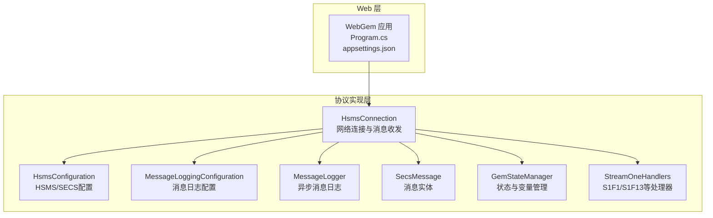
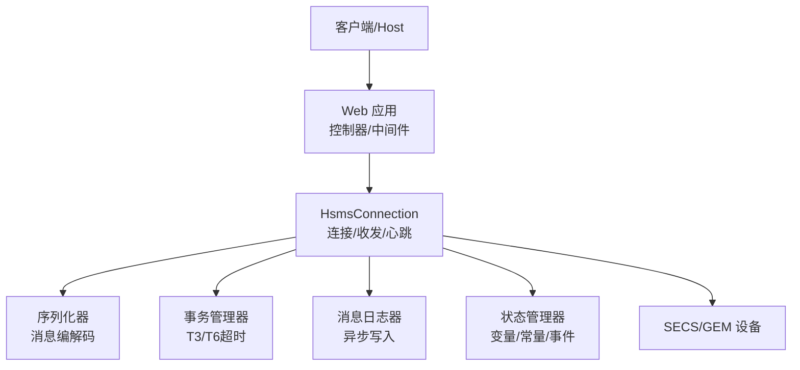
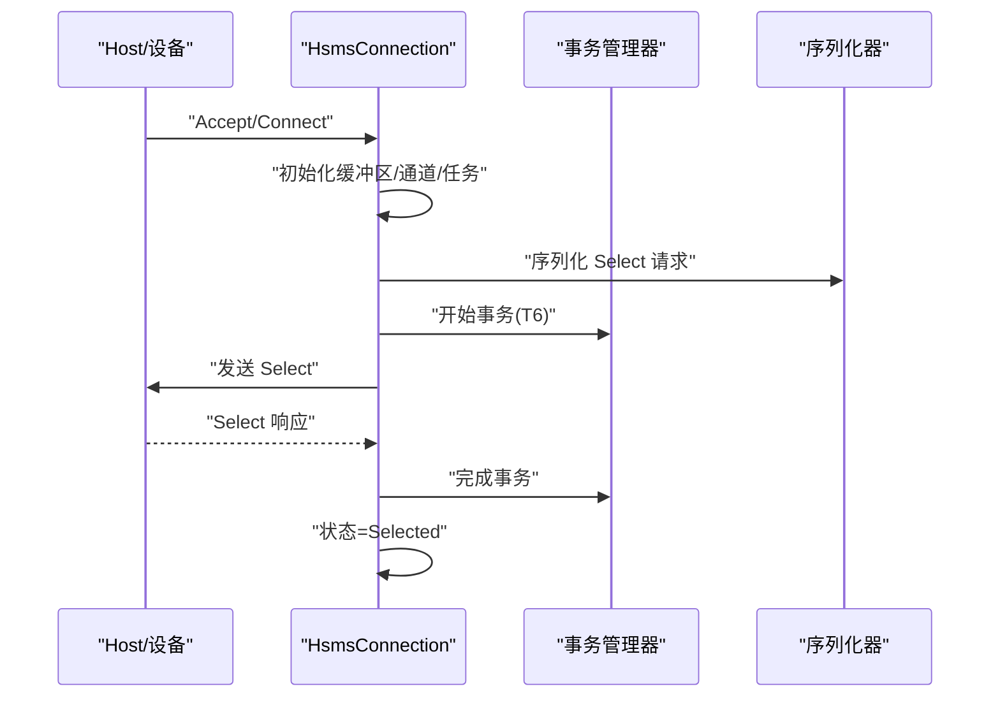
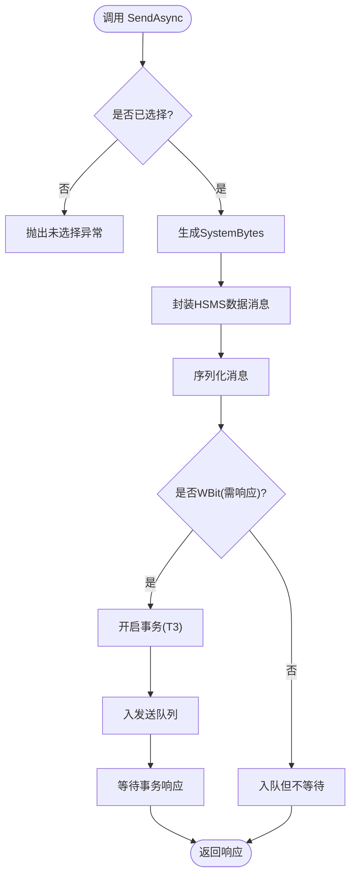
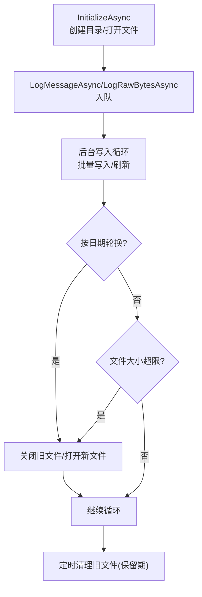
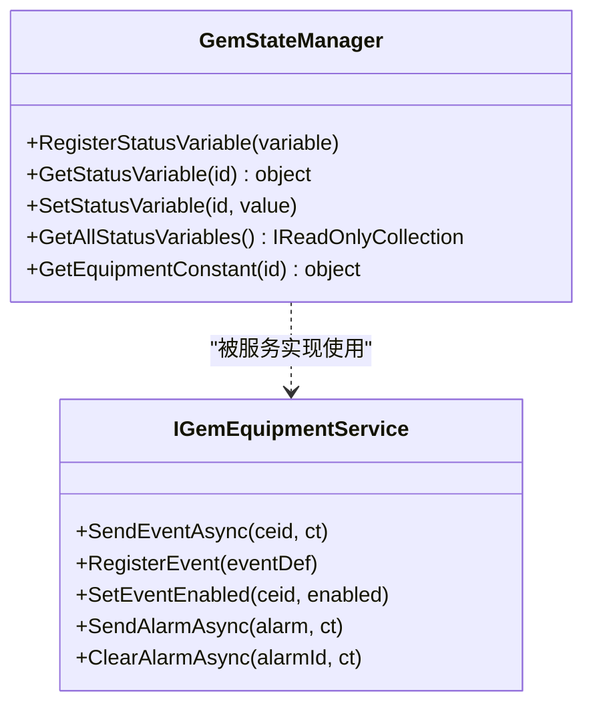
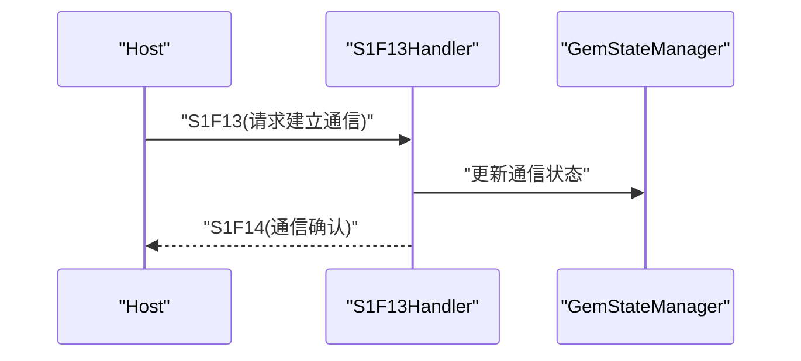
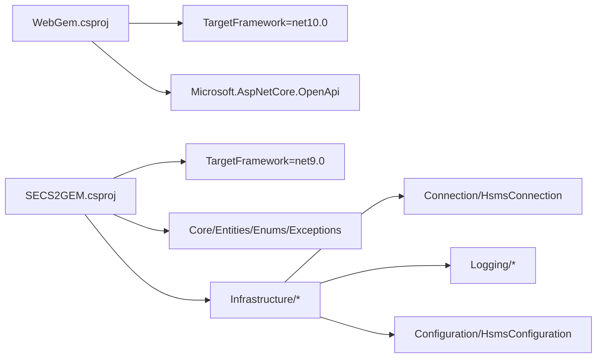

# 部署和运维

<cite>
**本文引用的文件**
- [README.md](file://README.md)
- [WebGem.csproj](file://WebGem/WebGem/WebGem.csproj)
- [SECS2GEM.csproj](file://WebGem/SECS2GEM/SECS2GEM.csproj)
- [Program.cs](file://WebGem/WebGem/Program.cs)
- [appsettings.json](file://WebGem/WebGem/appsettings.json)
- [appsettings.Development.json](file://WebGem/WebGem/appsettings.Development.json)
- [launchSettings.json](file://WebGem/WebGem/Properties/launchSettings.json)
- [HsmsConfiguration.cs](file://WebGem/SECS2GEM/Infrastructure/Configuration/HsmsConfiguration.cs)
- [MessageLoggingConfiguration.cs](file://WebGem/SECS2GEM/Infrastructure/Logging/MessageLoggingConfiguration.cs)
- [HsmsConnection.cs](file://WebGem/SECS2GEM/Infrastructure/Connection/HsmsConnection.cs)
- [MessageLogger.cs](file://WebGem/SECS2GEM/Infrastructure/Logging/MessageLogger.cs)
- [StreamOneHandlers.cs](file://WebGem/SECS2GEM/Application/Handlers/StreamOneHandlers.cs)
- [GemStateManager.cs](file://WebGem/SECS2GEM/Application/State/GemStateManager.cs)
- [IGemEquipmentService.cs](file://WebGem/SECS2GEM/Domain/Interfaces/IGemEquipmentService.cs)
- [SecsMessage.cs](file://WebGem/SECS2GEM/Core/Entities/SecsMessage.cs)
</cite>

## 目录
1. [简介](#简介)
2. [项目结构](#项目结构)
3. [核心组件](#核心组件)
4. [架构总览](#架构总览)
5. [详细组件分析](#详细组件分析)
6. [依赖关系分析](#依赖关系分析)
7. [性能考虑](#性能考虑)
8. [故障排查指南](#故障排查指南)
9. [结论](#结论)
10. [附录](#附录)

## 简介
本文件面向SECS2-GEM项目的生产部署与运维，覆盖服务器配置、网络与安全加固、容器化与云平台集成、性能调优、监控与告警、备份与灾备、日志与审计、运维自动化、版本升级与回滚以及合规与安全最佳实践。内容基于仓库现有代码与配置进行提炼，确保可操作性与可追溯性。

## 项目结构
项目采用多项目解决方案，包含SECS2协议栈实现与Web API示例：
- WebGem：ASP.NET Core Web应用，提供HTTP接口与OpenAPI能力
- SECS2GEM：SECS/GEM协议实现，包含连接、序列化、消息处理、状态管理与日志等模块
- SECS2GEM.Simulator：SECS2消息模拟器（便于测试与演示）

图表来源
- [Program.cs:1-24](file://WebGem/WebGem/Program.cs#L1-L24)
- [HsmsConnection.cs:1-120](file://WebGem/SECS2GEM/Infrastructure/Connection/HsmsConnection.cs#L1-L120)
- [HsmsConfiguration.cs:1-120](file://WebGem/SECS2GEM/Infrastructure/Configuration/HsmsConfiguration.cs#L1-L120)
- [MessageLoggingConfiguration.cs:1-82](file://WebGem/SECS2GEM/Infrastructure/Logging/MessageLoggingConfiguration.cs#L1-L82)
- [MessageLogger.cs:1-120](file://WebGem/SECS2GEM/Infrastructure/Logging/MessageLogger.cs#L1-L120)
- [SecsMessage.cs:160-196](file://WebGem/SECS2GEM/Core/Entities/SecsMessage.cs#L160-L196)
- [GemStateManager.cs:117-168](file://WebGem/SECS2GEM/Application/State/GemStateManager.cs#L117-L168)
- [StreamOneHandlers.cs:46-128](file://WebGem/SECS2GEM/Application/Handlers/StreamOneHandlers.cs#L46-L128)

章节来源
- [README.md:1-1](file://README.md#L1-L1)
- [WebGem.csproj:1-14](file://WebGem/WebGem/WebGem.csproj#L1-L14)
- [SECS2GEM.csproj:1-10](file://WebGem/SECS2GEM/SECS2GEM.csproj#L1-L10)
- [Program.cs:1-24](file://WebGem/WebGem/Program.cs#L1-L24)

## 核心组件
- Web应用与配置
  - Web应用通过构建器注册控制器与OpenAPI，按环境启用OpenAPI文档；强制HTTPS重定向与授权中间件；默认允许所有主机。
  - 开发环境与生产环境的日志级别配置分离，开发环境提供更宽松的默认日志策略。
- 协议与连接
  - HSMS连接支持主动/被动模式，具备超时参数（T3-T8）、心跳间隔与失败阈值、自动重连、缓冲区大小与最大消息尺寸等配置。
  - 连接内部采用Channel异步队列、独立接收/发送/心跳任务，确保高并发下的稳定性。
- 日志系统
  - 消息日志支持HEX与SML双格式输出，按IP-端口-设备ID组织目录，支持按日期与大小轮换、保留期清理。
  - 异步写入与文件句柄管理，避免阻塞通讯线程。
- 状态与事件
  - 状态管理器提供状态变量注册与动态值获取、设备常量访问、事件与报警接口契约，支撑GEM设备状态机与上报机制。

章节来源
- [Program.cs:1-24](file://WebGem/WebGem/Program.cs#L1-L24)
- [appsettings.json:1-10](file://WebGem/WebGem/appsettings.json#L1-L10)
- [appsettings.Development.json:1-9](file://WebGem/WebGem/appsettings.Development.json#L1-L9)
- [HsmsConfiguration.cs:1-266](file://WebGem/SECS2GEM/Infrastructure/Configuration/HsmsConfiguration.cs#L1-L266)
- [HsmsConnection.cs:1-420](file://WebGem/SECS2GEM/Infrastructure/Connection/HsmsConnection.cs#L1-L420)
- [MessageLoggingConfiguration.cs:1-82](file://WebGem/SECS2GEM/Infrastructure/Logging/MessageLoggingConfiguration.cs#L1-L82)
- [MessageLogger.cs:1-220](file://WebGem/SECS2GEM/Infrastructure/Logging/MessageLogger.cs#L1-L220)
- [GemStateManager.cs:117-168](file://WebGem/SECS2GEM/Application/State/GemStateManager.cs#L117-L168)
- [IGemEquipmentService.cs:87-128](file://WebGem/SECS2GEM/Domain/Interfaces/IGemEquipmentService.cs#L87-L128)

## 架构总览
SECS2-GEM在运行时由Web应用承载业务入口，底层通过HsmsConnection与SECS/GEM设备进行HSMS通信。消息经由序列化器编码，事务管理器跟踪请求-响应配对，日志器异步落盘，状态管理器维护设备状态与变量。

图表来源
- [Program.cs:1-24](file://WebGem/WebGem/Program.cs#L1-L24)
- [HsmsConnection.cs:1-200](file://WebGem/SECS2GEM/Infrastructure/Connection/HsmsConnection.cs#L1-L200)
- [MessageLogger.cs:1-120](file://WebGem/SECS2GEM/Infrastructure/Logging/MessageLogger.cs#L1-L120)
- [GemStateManager.cs:117-168](file://WebGem/SECS2GEM/Application/State/GemStateManager.cs#L117-L168)

## 详细组件分析

### 组件一：HSMS连接与消息处理
- 主要职责
  - 管理TCP连接生命周期（Active/Passive），执行Select/Deselect/Linktest/ Separate控制流程
  - 异步消息队列发送，接收循环解析HSMS消息，触发上层事件
  - 心跳检测与超时控制，自动断开与重连策略
- 关键流程（连接建立）

图表来源
- [HsmsConnection.cs:140-210](file://WebGem/SECS2GEM/Infrastructure/Connection/HsmsConnection.cs#L140-L210)
- [HsmsConnection.cs:518-541](file://WebGem/SECS2GEM/Infrastructure/Connection/HsmsConnection.cs#L518-L541)

- 关键流程（消息发送与等待响应）

图表来源
- [HsmsConnection.cs:427-470](file://WebGem/SECS2GEM/Infrastructure/Connection/HsmsConnection.cs#L427-L470)

章节来源
- [HsmsConnection.cs:1-800](file://WebGem/SECS2GEM/Infrastructure/Connection/HsmsConnection.cs#L1-L800)

### 组件二：消息日志与审计
- 功能特性
  - 异步写入：生产者-消费者队列+信号量保护，避免阻塞通讯线程
  - 文件轮换：按日期与大小轮换，支持保留期清理
  - 输出格式：HEX与SML双轨，可选时间戳
- 目录结构与保留策略
  - 目录：{BasePath}/{IP}-{Port}-{DeviceId}/
  - 文件：按日期命名，超过大小自动重命名并新建文件
  - 清理：超过保留天数的旧文件自动删除

图表来源
- [MessageLogger.cs:65-120](file://WebGem/SECS2GEM/Infrastructure/Logging/MessageLogger.cs#L65-L120)
- [MessageLogger.cs:176-223](file://WebGem/SECS2GEM/Infrastructure/Logging/MessageLogger.cs#L176-L223)
- [MessageLogger.cs:309-366](file://WebGem/SECS2GEM/Infrastructure/Logging/MessageLogger.cs#L309-L366)
- [MessageLogger.cs:371-395](file://WebGem/SECS2GEM/Infrastructure/Logging/MessageLogger.cs#L371-L395)

章节来源
- [MessageLoggingConfiguration.cs:1-82](file://WebGem/SECS2GEM/Infrastructure/Logging/MessageLoggingConfiguration.cs#L1-L82)
- [MessageLogger.cs:1-438](file://WebGem/SECS2GEM/Infrastructure/Logging/MessageLogger.cs#L1-L438)

### 组件三：状态与事件处理
- 状态变量与设备常量
  - 提供注册、查询、动态值获取与批量导出能力，支撑设备状态与参数上报
- 事件与报警
  - 事件报告（S6F11）与报警（S5F1）接口契约，便于上层业务驱动

图表来源
- [GemStateManager.cs:117-168](file://WebGem/SECS2GEM/Application/State/GemStateManager.cs#L117-L168)
- [IGemEquipmentService.cs:87-128](file://WebGem/SECS2GEM/Domain/Interfaces/IGemEquipmentService.cs#L87-L128)

章节来源
- [GemStateManager.cs:117-168](file://WebGem/SECS2GEM/Application/State/GemStateManager.cs#L117-L168)
- [IGemEquipmentService.cs:87-128](file://WebGem/SECS2GEM/Domain/Interfaces/IGemEquipmentService.cs#L87-L128)

### 组件四：消息处理器（示例：S1F1/S1F13）
- S1F1：Are You There，返回设备型号与软件版本
- S1F13：Establish Communications Request，建立通信并进入通信状态
- 错误处理：当消息含WBit且处理异常时，按规范返回S9F7错误响应

图表来源
- [StreamOneHandlers.cs:116-140](file://WebGem/SECS2GEM/Application/Handlers/StreamOneHandlers.cs#L116-L140)
- [SecsMessage.cs:160-196](file://WebGem/SECS2GEM/Core/Entities/SecsMessage.cs#L160-L196)

章节来源
- [StreamOneHandlers.cs:46-128](file://WebGem/SECS2GEM/Application/Handlers/StreamOneHandlers.cs#L46-L128)
- [SecsMessage.cs:160-196](file://WebGem/SECS2GEM/Core/Entities/SecsMessage.cs#L160-L196)

## 依赖关系分析
- 语言与框架
  - WebGem：.NET 10.0（Web SDK）
  - SECS2GEM：.NET 9.0（通用SDK）
- 运行时依赖
  - Web应用依赖ASP.NET Core OpenAPI包
  - 协议实现依赖连接、序列化、事务与日志模块
- 配置耦合
  - HsmsConfiguration与MessageLoggingConfiguration贯穿连接与日志子系统
  - HsmsConnection依赖配置进行超时、缓冲区与日志初始化

图表来源
- [WebGem.csproj:1-14](file://WebGem/WebGem/WebGem.csproj#L1-L14)
- [SECS2GEM.csproj:1-10](file://WebGem/SECS2GEM/SECS2GEM.csproj#L1-L10)

章节来源
- [WebGem.csproj:1-14](file://WebGem/WebGem/WebGem.csproj#L1-L14)
- [SECS2GEM.csproj:1-10](file://WebGem/SECS2GEM/SECS2GEM.csproj#L1-L10)

## 性能考虑
- 内存与缓冲区
  - 建议根据设备吞吐与消息大小调整接收/发送缓冲区与最大消息尺寸，避免频繁GC与溢出
- 并发与异步
  - 发送队列采用无界Channel，建议结合背压策略或有界队列以防止内存膨胀
  - 接收/发送/心跳三任务分离，确保高并发场景下各环节不互相阻塞
- 超时与心跳
  - T3/T6/T7/T8与心跳间隔应结合网络RTT与设备处理能力调优，避免误判断连
- 日志写入
  - 异步写入与批量刷新降低IO开销；合理设置文件大小阈值与保留期，平衡磁盘占用与检索效率
- 线程与锁
  - 连接状态变更使用轻量锁保护；日志写入使用信号量串行化，避免竞争

[本节为通用指导，无需列出具体文件来源]

## 故障排查指南
- 连接问题
  - 检查HSMS配置端口范围与模式（Active/Passive），确认防火墙放行
  - 关注T7超时（Passive模式）与Select失败导致的状态机异常
- 心跳与断连
  - 心跳失败次数达到阈值将断开连接；检查网络抖动与设备侧心跳响应
- 日志定位
  - 查看消息日志目录结构与文件轮换情况，确认HEX/SML文件是否存在
  - 若日志写入异常，检查目录权限与磁盘空间
- 错误响应
  - 当消息含WBit且处理异常时，设备侧可能收到S9F7；核对处理器实现与异常分支

章节来源
- [HsmsConfiguration.cs:175-200](file://WebGem/SECS2GEM/Infrastructure/Configuration/HsmsConfiguration.cs#L175-L200)
- [HsmsConnection.cs:278-296](file://WebGem/SECS2GEM/Infrastructure/Connection/HsmsConnection.cs#L278-L296)
- [MessageLogger.cs:309-366](file://WebGem/SECS2GEM/Infrastructure/Logging/MessageLogger.cs#L309-L366)
- [StreamOneHandlers.cs:46-86](file://WebGem/SECS2GEM/Application/Handlers/StreamOneHandlers.cs#L46-L86)

## 结论
SECS2-GEM项目提供了完整的SECS/GEM协议实现与Web接入示例。生产部署应重点关注网络与安全加固、连接与日志配置、异步与超时参数调优、日志与审计策略以及自动化运维与版本管理。以上文档基于仓库现有代码提炼，建议在实际环境中结合业务负载与硬件条件进一步细化参数与流程。

[本节为总结性内容，无需列出具体文件来源]

## 附录

### A. 生产环境部署步骤（分步指引）
- 服务器准备
  - 操作系统：Linux/Windows（建议Linux以获得更好性能与资源控制）
  - .NET运行时：安装对应TargetFramework版本（.NET 10.0/.NET 9.0）
  - 系统资源：CPU/内存/磁盘容量满足预期并发与日志写入需求
- 网络设置
  - 端口开放：根据HSMS配置的端口放行TCP流量
  - 防火墙：仅允许可信Host访问；建议内网隔离
  - DNS/主机名：如需域名访问，配置反向代理与证书
- 安全加固
  - HTTPS：生产环境必须启用HTTPS重定向与强密码套件
  - Host白名单：限制AllowedHosts，避免泛解析风险
  - 权限最小化：运行账户仅授予必要文件与端口权限
  - 日志目录：限制日志目录访问权限，避免敏感信息泄露
- 配置管理
  - appsettings生产环境：设置合适的日志级别与AllowedHosts
  - HSMS配置：根据设备能力设置T3-T8、心跳与缓冲区
  - 日志配置：设定BasePath、保留期与文件大小阈值

章节来源
- [Program.cs:17-21](file://WebGem/WebGem/Program.cs#L17-L21)
- [appsettings.json:1-10](file://WebGem/WebGem/appsettings.json#L1-L10)
- [HsmsConfiguration.cs:1-120](file://WebGem/SECS2GEM/Infrastructure/Configuration/HsmsConfiguration.cs#L1-L120)
- [MessageLoggingConfiguration.cs:1-82](file://WebGem/SECS2GEM/Infrastructure/Logging/MessageLoggingConfiguration.cs#L1-L82)

### B. 容器化与云平台集成
- Docker镜像
  - 基于官方ASP.NET Core运行时镜像，复制发布产物并设置运行用户
  - 暴露端口与挂载日志卷（持久化BasePath目录）
- 编排与编排
  - Kubernetes：Deployment/Service/ConfigMap/Secret；健康检查与探针
  - 容器编排：使用Compose或Helm管理多实例与滚动升级
- 云平台
  - Azure/AWS/GCP：结合托管容器服务（AKS/EKS/GKE）与负载均衡
  - 安全组/网络安全组：限制入站流量与出站DNS/证书验证

[本节为通用指导，无需列出具体文件来源]

### C. 监控与告警
- 连接与状态
  - 指标：连接状态、心跳成功率、消息发送/接收速率、队列长度
  - 告警：心跳失败阈值、T7超时、Select失败、断连次数
- 日志与审计
  - 指标：日志写入延迟、文件轮换频率、磁盘使用率
  - 告警：日志写入失败、磁盘空间不足、旧日志清理失败
- Web应用
  - 指标：HTTP请求QPS/延迟/P95、异常率、HTTPS重定向命中
  - 告警：异常率突增、证书即将过期

[本节为通用指导，无需列出具体文件来源]

### D. 备份与灾难恢复
- 配置备份
  - appsettings与HSMS配置文件定期备份至安全位置
- 日志备份
  - 日志目录定期归档，保留期外自动清理
- 灾难恢复
  - 快速拉起：容器镜像与配置清单可一键恢复
  - 数据一致性：日志为审计依据，配合设备侧备份策略

[本节为通用指导，无需列出具体文件来源]

### E. 日志管理与审计
- 日志类型
  - 消息日志：HEX/SML双轨，按日期与大小轮换
  - 应用日志：按环境配置日志级别，生产环境避免过度详细
- 审计要求
  - 保留期：按法规与企业政策设置
  - 访问控制：仅授权人员可查看日志
  - 审计追踪：关键事件（断连、报警、状态变更）应可追溯

章节来源
- [MessageLoggingConfiguration.cs:1-82](file://WebGem/SECS2GEM/Infrastructure/Logging/MessageLoggingConfiguration.cs#L1-L82)
- [MessageLogger.cs:371-395](file://WebGem/SECS2GEM/Infrastructure/Logging/MessageLogger.cs#L371-L395)
- [appsettings.json:1-10](file://WebGem/WebGem/appsettings.json#L1-L10)

### F. 运维自动化脚本与工具
- 部署脚本
  - CI/CD流水线：构建→测试→打包→推送镜像→编排部署
  - 滚动升级：灰度发布与回滚策略
- 健康检查
  - HTTP探针：/health 或自定义健康端点
  - 协议探针：心跳与Select测试
- 监控采集
  - Exporter：Prometheus/CloudWatch/OpenTelemetry
  - 日志采集：Filebeat/Fluent Bit/云原生日志服务

[本节为通用指导，无需列出具体文件来源]

### G. 版本升级与回滚
- 升级流程
  - 预检：兼容性检查、配置迁移、依赖版本校验
  - 灰度：先升级部分实例，观察指标与日志
  - 全量：确认稳定后升级剩余实例
- 回滚策略
  - 快速回滚：回退到上一稳定镜像与配置
  - 数据回滚：如涉及数据库Schema变更，准备逆向迁移脚本

[本节为通用指导，无需列出具体文件来源]

### H. 合规性与安全最佳实践
- 数据保护
  - 传输加密：TLS 1.2+；证书轮换
  - 存储加密：日志目录所在磁盘加密
- 访问控制
  - 最小权限原则；凭据管理（Secrets Manager/密钥库）
- 审计与合规
  - 审计日志：连接、断连、错误、状态变更
  - 合规检查：定期渗透测试与配置基线核查

[本节为通用指导，无需列出具体文件来源]