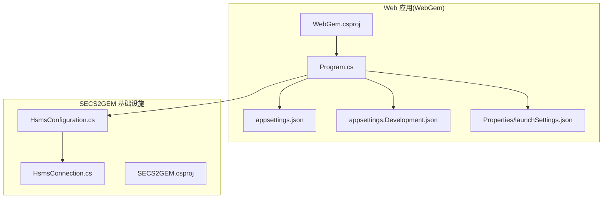
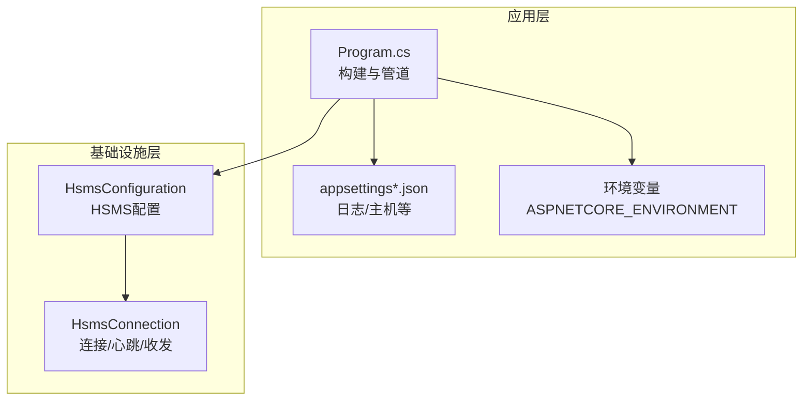
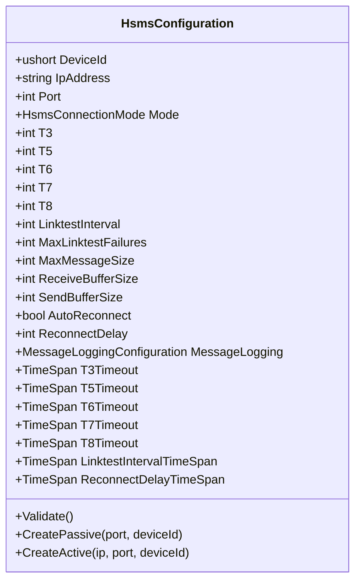
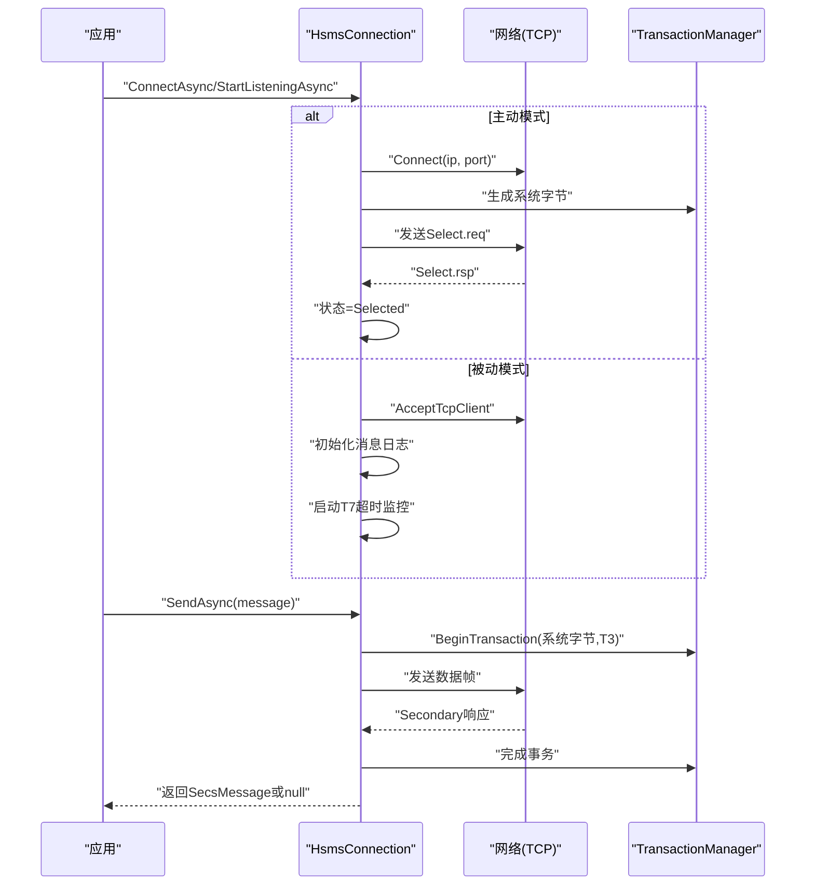
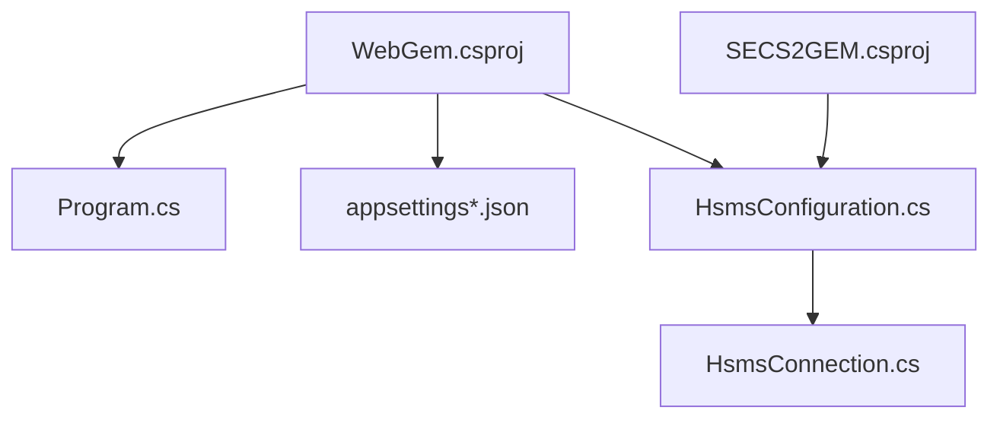

# 部署配置

<cite>
**本文引用的文件**
- [WebGem/appsettings.json](file://WebGem/WebGem/appsettings.json)
- [WebGem/appsettings.Development.json](file://WebGem/WebGem/appsettings.Development.json)
- [WebGem/Properties/launchSettings.json](file://WebGem/WebGem/Properties/launchSettings.json)
- [WebGem/Program.cs](file://WebGem/WebGem/Program.cs)
- [SECS2GEM/Infrastructure/Configuration/HsmsConfiguration.cs](file://WebGem/SECS2GEM/Infrastructure/Configuration/HsmsConfiguration.cs)
- [SECS2GEM/Infrastructure/Connection/HsmsConnection.cs](file://WebGem/SECS2GEM/Infrastructure/Connection/HsmsConnection.cs)
- [SECS2GEM/SECS2GEM.csproj](file://WebGem/SECS2GEM/SECS2GEM.csproj)
- [WebGem/WebGem.csproj](file://WebGem/WebGem/WebGem.csproj)
- [SECS2GEM/Simulator/bin/Debug/net9.0-windows/logs/127_0_0_1-5000-0/messages_20260331.hex](file://WebGem/SECS2GEM.Simulator/bin/Debug/net9.0-windows/logs/127_0_0_1-5000-0/messages_20260331.hex)
</cite>

## 目录
1. [简介](#简介)
2. [项目结构](#项目结构)
3. [核心组件](#核心组件)
4. [架构总览](#架构总览)
5. [详细组件分析](#详细组件分析)
6. [依赖分析](#依赖分析)
7. [性能考虑](#性能考虑)
8. [故障排除指南](#故障排除指南)
9. [结论](#结论)
10. [附录](#附录)

## 简介
本文件面向SECS2-GEM项目的生产部署，系统性说明应用与HSMS连接的配置项、环境变量与敏感信息保护策略、不同部署环境的配置模板、配置热更新与验证方法、网络安全（含TLS/SSL与防火墙建议），以及常见问题排查路径。内容基于仓库中现有配置文件与代码实现进行归纳总结。

## 项目结构
- Web应用位于 WebGem/WebGem，采用 ASP.NET Core 10.0，提供最小化HTTP服务与控制器映射。
- SECS2GEM基础设施位于 WebGem/SECS2GEM，包含HSMS连接配置与实现，支持主动/被动两种连接模式，并内置超时、心跳、缓冲区等参数。
- 配置文件采用 .NET 默认约定：appsettings.json 为主配置，appsettings.{Environment}.json 为环境特定配置；launchSettings.json 提供本地开发的启动配置与环境变量。

**图表来源**
- [WebGem/WebGem.csproj:1-14](file://WebGem/WebGem/WebGem.csproj#L1-L14)
- [WebGem/SECS2GEM/SECS2GEM.csproj:1-10](file://WebGem/SECS2GEM/SECS2GEM.csproj#L1-L10)
- [WebGem/WebGem/Program.cs:1-24](file://WebGem/WebGem/Program.cs#L1-L24)
- [WebGem/WebGem/appsettings.json:1-10](file://WebGem/WebGem/appsettings.json#L1-L10)
- [WebGem/WebGem/appsettings.Development.json:1-9](file://WebGem/WebGem/appsettings.Development.json#L1-L9)
- [WebGem/WebGem/Properties/launchSettings.json:1-24](file://WebGem/WebGem/Properties/launchSettings.json#L1-L24)
- [WebGem/SECS2GEM/Infrastructure/Configuration/HsmsConfiguration.cs:1-266](file://WebGem/SECS2GEM/Infrastructure/Configuration/HsmsConfiguration.cs#L1-L266)
- [WebGem/SECS2GEM/Infrastructure/Connection/HsmsConnection.cs:1-906](file://WebGem/SECS2GEM/Infrastructure/Connection/HsmsConnection.cs#L1-L906)

**章节来源**
- [WebGem/WebGem.csproj:1-14](file://WebGem/WebGem/WebGem.csproj#L1-L14)
- [WebGem/SECS2GEM/SECS2GEM.csproj:1-10](file://WebGem/SECS2GEM/SECS2GEM.csproj#L1-L10)
- [WebGem/WebGem/Program.cs:1-24](file://WebGem/WebGem/Program.cs#L1-L24)
- [WebGem/WebGem/appsettings.json:1-10](file://WebGem/WebGem/appsettings.json#L1-L10)
- [WebGem/WebGem/appsettings.Development.json:1-9](file://WebGem/WebGem/appsettings.Development.json#L1-L9)
- [WebGem/WebGem/Properties/launchSettings.json:1-24](file://WebGem/WebGem/Properties/launchSettings.json#L1-L24)

## 核心组件
- 应用配置（appsettings）
  - 日志级别、允许主机等基础配置项。
  - 开发环境额外覆盖日志级别。
- 环境变量
  - ASPNETCORE_ENVIRONMENT 用于区分开发/测试/生产环境。
- HSMS连接配置（HsmsConfiguration）
  - 设备ID、IP地址、端口、连接模式（主动/被动）、超时参数（T3-T8）、心跳参数、缓冲区大小、消息大小限制、自动重连与重连延迟、消息日志配置等。
- HSMS连接实现（HsmsConnection）
  - 主动/被动连接流程、选择/去选择、心跳、超时监控（T7）、断开与清理、发送/接收循环、消息序列化与日志记录。

**章节来源**
- [WebGem/WebGem/appsettings.json:1-10](file://WebGem/WebGem/appsettings.json#L1-L10)
- [WebGem/WebGem/appsettings.Development.json:1-9](file://WebGem/WebGem/appsettings.Development.json#L1-L9)
- [WebGem/WebGem/Properties/launchSettings.json:1-24](file://WebGem/WebGem/Properties/launchSettings.json#L1-L24)
- [WebGem/SECS2GEM/Infrastructure/Configuration/HsmsConfiguration.cs:1-266](file://WebGem/SECS2GEM/Infrastructure/Configuration/HsmsConfiguration.cs#L1-L266)
- [WebGem/SECS2GEM/Infrastructure/Connection/HsmsConnection.cs:1-906](file://WebGem/SECS2GEM/Infrastructure/Connection/HsmsConnection.cs#L1-L906)

## 架构总览
下图展示应用如何加载配置并通过HSMS连接与外部设备通信：

**图表来源**
- [WebGem/WebGem/Program.cs:1-24](file://WebGem/WebGem/Program.cs#L1-L24)
- [WebGem/WebGem/appsettings.json:1-10](file://WebGem/WebGem/appsettings.json#L1-L10)
- [WebGem/WebGem/appsettings.Development.json:1-9](file://WebGem/WebGem/appsettings.Development.json#L1-L9)
- [WebGem/WebGem/Properties/launchSettings.json:1-24](file://WebGem/WebGem/Properties/launchSettings.json#L1-L24)
- [WebGem/SECS2GEM/Infrastructure/Configuration/HsmsConfiguration.cs:1-266](file://WebGem/SECS2GEM/Infrastructure/Configuration/HsmsConfiguration.cs#L1-L266)
- [WebGem/SECS2GEM/Infrastructure/Connection/HsmsConnection.cs:1-906](file://WebGem/SECS2GEM/Infrastructure/Connection/HsmsConnection.cs#L1-L906)

## 详细组件分析

### 应用配置（appsettings）
- 默认配置
  - 日志级别：Default 与 Microsoft.AspNetCore 的日志等级。
  - 允许主机：通配符“*”。
- 开发环境配置
  - 继承默认日志级别设置，便于本地调试。
- 环境变量
  - ASPNETCORE_ENVIRONMENT 通过 launchSettings.json 设置为 Development，用于区分开发与生产环境。

建议在生产环境中：
- 明确 AllowedHosts，避免通配符带来的潜在风险。
- 降低默认日志级别以减少I/O开销。
- 通过环境变量或密钥管理服务注入敏感信息，避免硬编码。

**章节来源**
- [WebGem/WebGem/appsettings.json:1-10](file://WebGem/WebGem/appsettings.json#L1-L10)
- [WebGem/WebGem/appsettings.Development.json:1-9](file://WebGem/WebGem/appsettings.Development.json#L1-L9)
- [WebGem/WebGem/Properties/launchSettings.json:1-24](file://WebGem/WebGem/Properties/launchSettings.json#L1-L24)

### HSMS连接配置（HsmsConfiguration）
- 基本参数
  - 设备ID（Session ID）、IP地址、端口、连接模式（主动/被动）。
- 超时参数（秒）
  - T3：等待Secondary回复的超时。
  - T5：连接分离后的重连等待。
  - T6：控制事务（Select/Deselect/Linktest）响应超时。
  - T7：TCP连接建立后等待Select.req的超时。
  - T8：消息传输中字符之间的最大间隔。
- 心跳参数
  - LinktestInterval：心跳间隔（0禁用心跳）。
  - MaxLinktestFailures：连续心跳失败阈值。
- 缓冲区与消息
  - 接收/发送缓冲区大小、最大消息大小。
- 自动重连
  - AutoReconnect：是否自动重连。
  - ReconnectDelay：重连延迟（0使用T5）。
- 消息日志
  - MessageLogging：消息日志配置对象。
- 辅助属性
  - TimeSpan形式的超时与心跳间隔，便于跨模块使用。
- 验证逻辑
  - 对端口与关键超时参数进行有效性校验。

**图表来源**
- [WebGem/SECS2GEM/Infrastructure/Configuration/HsmsConfiguration.cs:1-266](file://WebGem/SECS2GEM/Infrastructure/Configuration/HsmsConfiguration.cs#L1-L266)

**章节来源**
- [WebGem/SECS2GEM/Infrastructure/Configuration/HsmsConfiguration.cs:1-266](file://WebGem/SECS2GEM/Infrastructure/Configuration/HsmsConfiguration.cs#L1-L266)

### HSMS连接实现（HsmsConnection）
- 连接管理
  - 主动连接：ConnectAsync，建立TCP连接后发送Select.req并进入Selected。
  - 被动监听：StartListeningAsync，AcceptTcpClientAsync等待连接，进入Connected并启动T7超时监控。
  - 断开：SendSeparateRequest（带超时）+ Cleanup，确保资源释放与事务取消。
- 异步循环
  - 接收循环：按接收缓冲区大小读取，尝试解析消息，触发事件与日志。
  - 发送循环：从无界通道读取并写入NetworkStream，记录发送日志。
  - 心跳循环：周期性发送Linktest，统计失败次数，超过阈值断开。
- 事务与超时
  - 通过TransactionManager管理系统字节与超时，T3/T6/T7对应不同场景。
- 状态与事件
  - ConnectionState枚举驱动状态机，暴露StateChanged与PrimaryMessageReceived事件。

**图表来源**
- [WebGem/SECS2GEM/Infrastructure/Connection/HsmsConnection.cs:1-906](file://WebGem/SECS2GEM/Infrastructure/Connection/HsmsConnection.cs#L1-L906)

**章节来源**
- [WebGem/SECS2GEM/Infrastructure/Connection/HsmsConnection.cs:1-906](file://WebGem/SECS2GEM/Infrastructure/Connection/HsmsConnection.cs#L1-L906)

### 配置热更新与验证
- 配置热更新
  - 当前代码未显式实现配置热更新。建议在生产中结合配置提供者（如Azure App Configuration、Consul、Kubernetes ConfigMap）与IOptionsSnapshot/IOptionsMonitor实现按需刷新。
- 配置验证
  - HsmsConfiguration.Validate对端口与关键超时参数进行校验，可在应用启动阶段调用以尽早发现配置错误。

**章节来源**
- [WebGem/SECS2GEM/Infrastructure/Configuration/HsmsConfiguration.cs:175-200](file://WebGem/SECS2GEM/Infrastructure/Configuration/HsmsConfiguration.cs#L175-L200)

### 网络安全与防火墙
- HTTPS与重定向
  - 生产环境建议启用HTTPS并强制重定向，当前程序集包含UseHttpsRedirection调用，部署时应确保证书可用。
- TLS/SSL
  - 在容器或云平台部署时，通过反向代理或负载均衡器终止TLS，或在Kestrel上配置证书。
- 防火墙与端口
  - HSMS端口（默认5000）需在防火墙放行；若为被动模式，需监听0.0.0.0或指定内网IP；主动模式需允许出站连接至对端IP:端口。
- Hosts与域名
  - 生产环境应明确AllowedHosts，避免通配符导致的安全隐患。

**章节来源**
- [WebGem/WebGem/Program.cs:17-17](file://WebGem/WebGem/Program.cs#L17-L17)
- [WebGem/WebGem/appsettings.json:8-8](file://WebGem/WebGem/appsettings.json#L8-L8)
- [WebGem/SECS2GEM/Infrastructure/Configuration/HsmsConfiguration.cs:27-32](file://WebGem/SECS2GEM/Infrastructure/Configuration/HsmsConfiguration.cs#L27-L32)

## 依赖分析
- 项目依赖
  - WebGem 为Web SDK，依赖 ASP.NET Core OpenAPI 包。
  - SECS2GEM 为普通SDK，作为基础设施库被WebGem引用。
- 组件耦合
  - HsmsConfiguration 与 HsmsConnection 解耦良好，前者专注参数与验证，后者专注连接生命周期与消息循环。
- 外部依赖
  - 网络层依赖System.Net/TcpListener/TcpClient；消息序列化依赖内部序列化器；事务管理依赖TransactionManager。

**图表来源**
- [WebGem/WebGem/WebGem.csproj:1-14](file://WebGem/WebGem/WebGem.csproj#L1-L14)
- [WebGem/SECS2GEM/SECS2GEM.csproj:1-10](file://WebGem/SECS2GEM/SECS2GEM.csproj#L1-L10)
- [WebGem/WebGem/Program.cs:1-24](file://WebGem/WebGem/Program.cs#L1-L24)
- [WebGem/WebGem/appsettings.json:1-10](file://WebGem/WebGem/appsettings.json#L1-L10)
- [WebGem/SECS2GEM/Infrastructure/Configuration/HsmsConfiguration.cs:1-266](file://WebGem/SECS2GEM/Infrastructure/Configuration/HsmsConfiguration.cs#L1-L266)
- [WebGem/SECS2GEM/Infrastructure/Connection/HsmsConnection.cs:1-906](file://WebGem/SECS2GEM/Infrastructure/Connection/HsmsConnection.cs#L1-L906)

**章节来源**
- [WebGem/WebGem/WebGem.csproj:1-14](file://WebGem/WebGem/WebGem.csproj#L1-L14)
- [WebGem/SECS2GEM/SECS2GEM.csproj:1-10](file://WebGem/SECS2GEM/SECS2GEM.csproj#L1-L10)
- [WebGem/WebGem/Program.cs:1-24](file://WebGem/WebGem/Program.cs#L1-L24)

## 性能考虑
- 缓冲区与消息大小
  - 合理设置接收/发送缓冲区与最大消息大小，避免频繁分配与内存碎片。
- 心跳与超时
  - LinktestInterval与MaxLinktestFailures影响连接稳定性与资源占用；T3/T6/T7需根据网络RTT与设备响应能力调整。
- 并发与队列
  - 发送通道为无界队列，生产环境需配合背压与限流策略，防止内存膨胀。
- 日志与I/O
  - 消息日志开启会增加磁盘I/O，建议在高吞吐场景下按需开启或分级输出。

[本节为通用指导，无需具体文件引用]

## 故障排除指南
- 无法连接HSMS
  - 检查IP与端口配置、防火墙放行、连接模式（主动/被动）是否正确。
  - 查看T7超时（被动模式）与Select请求响应情况。
- 连接频繁断开
  - 检查心跳失败次数与阈值，适当增大LinktestInterval或MaxLinktestFailures。
  - 关注T3/T6超时是否过短，必要时延长。
- 消息丢失或乱序
  - 检查缓冲区大小与消息大小限制，确保序列化与日志记录未阻塞发送循环。
- 日志定位
  - 参考模拟器日志目录下的消息记录，核对发送/接收方向与协议字段。
- 环境变量与配置
  - 确认ASPNETCORE_ENVIRONMENT设置正确，避免加载了错误的appsettings文件。
  - 生产环境避免使用通配符AllowedHosts，建议精确配置。

**章节来源**
- [WebGem/SECS2GEM/Infrastructure/Connection/HsmsConnection.cs:278-296](file://WebGem/SECS2GEM/Infrastructure/Connection/HsmsConnection.cs#L278-L296)
- [WebGem/SECS2GEM/Infrastructure/Connection/HsmsConnection.cs:690-723](file://WebGem/SECS2GEM/Infrastructure/Connection/HsmsConnection.cs#L690-L723)
- [WebGem/SECS2GEM.Simulator/bin/Debug/net9.0-windows/logs/127_0_0_1-5000-0/messages_20260331.hex:1-42](file://WebGem/SECS2GEM.Simulator/bin/Debug/net9.0-windows/logs/127_0_0_1-5000-0/messages_20260331.hex#L1-L42)

## 结论
本文基于仓库现有配置与代码，给出了SECS2-GEM生产部署的配置要点与实施建议：明确应用配置与环境变量、合理设置HSMS连接参数、关注网络安全与防火墙策略、结合日志与超时机制进行故障定位。对于未实现的配置热更新，建议在生产中引入外部配置中心或Kubernetes ConfigMap方案。

[本节为总结性内容，无需具体文件引用]

## 附录

### 配置模板与建议
- 开发环境
  - 环境变量：ASPNETCORE_ENVIRONMENT=Development
  - appsettings.Development.json：覆盖日志级别
  - HSMS：可使用默认端口与被动监听，便于联调
- 测试环境
  - 环境变量：ASPNETCORE_ENVIRONMENT=Staging
  - appsettings.Staging.json：适度收紧日志与AllowedHosts
  - HSMS：与生产一致的超时与心跳参数
- 生产环境
  - 环境变量：ASPNETCORE_ENVIRONMENT=Production
  - appsettings.Production.json：严格AllowedHosts、合理日志级别
  - HSMS：根据网络与设备能力优化T3/T6/T7、心跳与缓冲区
  - 网络：仅开放必需端口，启用HTTPS与证书管理

[本节为通用模板说明，无需具体文件引用]

### 敏感信息保护
- 使用环境变量或密钥管理服务（如Azure Key Vault、HashiCorp Vault、K8s Secret）注入密码、证书路径等敏感数据。
- 避免将敏感信息提交到版本控制系统，使用占位符并在部署时替换。

[本节为通用指导，无需具体文件引用]