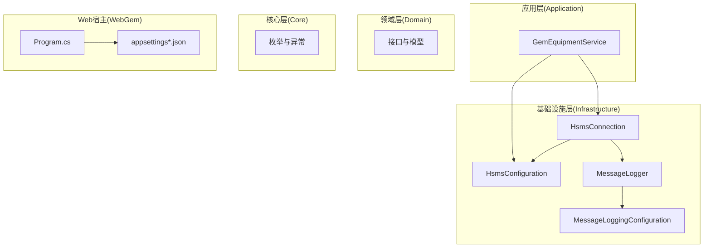
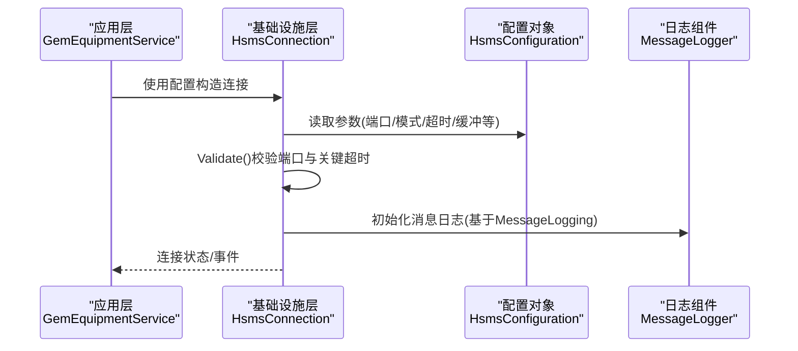
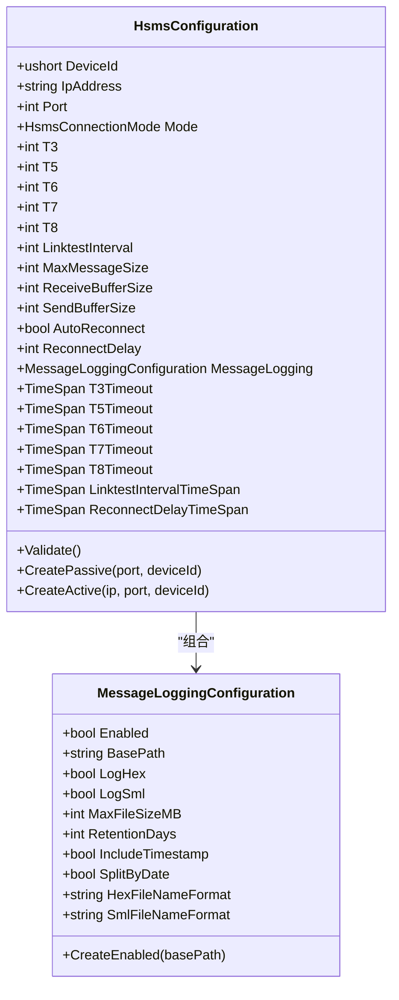
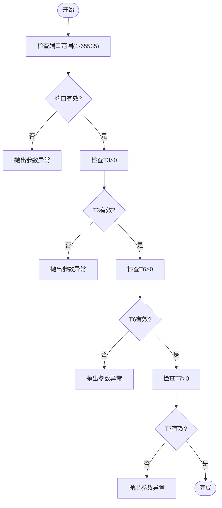
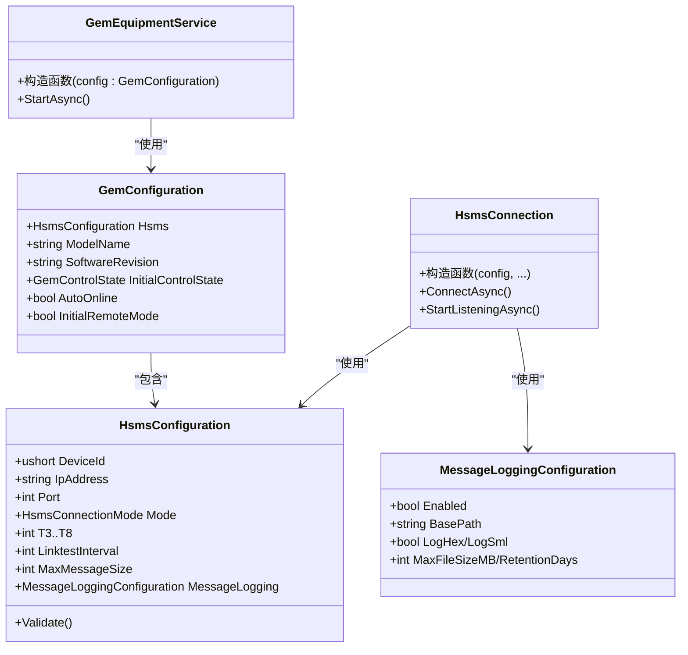

# 配置管理

<cite>
**本文引用的文件**
- [HsmsConfiguration.cs](file://WebGem/SECS2GEM/Infrastructure/Configuration/HsmsConfiguration.cs)
- [MessageLoggingConfiguration.cs](file://WebGem/SECS2GEM/Infrastructure/Logging/MessageLoggingConfiguration.cs)
- [MessageLogger.cs](file://WebGem/SECS2GEM/Infrastructure/Logging/MessageLogger.cs)
- [HsmsConnection.cs](file://WebGem/SECS2GEM/Infrastructure/Connection/HsmsConnection.cs)
- [GemEquipmentService.cs](file://WebGem/SECS2GEM/Application/Services/GemEquipmentService.cs)
- [appsettings.json](file://WebGem/WebGem/appsettings.json)
- [appsettings.Development.json](file://WebGem/WebGem/appsettings.Development.json)
- [Program.cs](file://WebGem/WebGem/Program.cs)
- [MainForm.cs](file://WebGem/SECS2GEM.Simulator/MainForm.cs)
- [SECS2GEM_Class_Diagram.md](file://WebGem/SECS2GEM/SECS2GEM_Class_Diagram.md)
</cite>

## 目录
1. [简介](#简介)
2. [项目结构](#项目结构)
3. [核心组件](#核心组件)
4. [架构总览](#架构总览)
5. [详细组件分析](#详细组件分析)
6. [依赖关系分析](#依赖关系分析)
7. [性能考量](#性能考量)
8. [故障排查指南](#故障排查指南)
9. [结论](#结论)
10. [附录](#附录)

## 简介
本文件面向SECS2-GEM系统的配置管理，重点围绕HSMS连接配置类HsmsConfiguration展开，涵盖连接参数、超时设置、性能优化选项、配置验证与错误处理、以及在不同环境下的配置示例与优先级规则。同时提供动态调整配置的最佳实践与安全建议。

## 项目结构
SECS2GEM采用分层架构，配置相关的核心位于基础设施层的Configuration与Logging子模块；应用层通过GemEquipmentService消费配置并驱动底层连接与状态管理。

图表来源
- [GemEquipmentService.cs:110-133](file://WebGem/SECS2GEM/Application/Services/GemEquipmentService.cs#L110-L133)
- [HsmsConnection.cs:122-139](file://WebGem/SECS2GEM/Infrastructure/Connection/HsmsConnection.cs#L122-L139)
- [HsmsConfiguration.cs:15-228](file://WebGem/SECS2GEM/Infrastructure/Configuration/HsmsConfiguration.cs#L15-L228)
- [MessageLoggingConfiguration.cs:10-81](file://WebGem/SECS2GEM/Infrastructure/Logging/MessageLoggingConfiguration.cs#L10-L81)
- [MessageLogger.cs:55-75](file://WebGem/SECS2GEM/Infrastructure/Logging/MessageLogger.cs#L55-L75)
- [Program.cs:1-24](file://WebGem/WebGem/Program.cs#L1-L24)

章节来源
- [SECS2GEM_Class_Diagram.md:587-628](file://WebGem/SECS2GEM/SECS2GEM_Class_Diagram.md#L587-L628)

## 核心组件
本节聚焦HsmsConfiguration配置类及其关联的日志配置，说明各字段含义、默认值、取值范围与验证规则。

- 连接参数
  - 设备ID(DeviceId)：会话标识，默认0
  - IP地址(IpAddress)：被动模式为绑定地址(默认0.0.0.0)，主动模式为目标地址
  - 端口(Port)：默认5000，必须在1-65535范围内
  - 连接模式(Mode)：Passive或Active
- 超时参数(秒)
  - T3：等待Secondary回复的超时，默认45
  - T5：连接分离超时，默认10
  - T6：控制事务超时(Select/Deselect/Linktest)，默认5
  - T7：TCP连接后等待Select.req的超时，默认10
  - T8：网络字符间隔超时，默认5
- 心跳参数
  - LinktestInterval：心跳间隔(秒)，0表示禁用心跳，默认30
  - MaxLinktestFailures：最大连续心跳失败次数，默认3
- 性能与缓冲
  - MaxMessageSize：最大消息大小，默认16MB
  - ReceiveBufferSize/SendBufferSize：接收/发送缓冲区大小，默认64KB
  - AutoReconnect：是否自动重连，默认true
  - ReconnectDelay：重连延迟(秒)，0则使用T5
- 日志配置(MessageLogging)
  - Enabled：是否启用消息日志，默认true
  - BasePath：日志基础路径，默认"logs"
  - LogHex/LogSml：是否记录HEX/SML格式，默认true
  - MaxFileSizeMB：单文件最大大小(MB)，默认50
  - RetentionDays：保留天数(0表示不清理)，默认30
  - IncludeTimestamp/SplitByDate：是否包含时间戳、按日期分割，默认true
  - 文件名格式：HexFileNameFormat/SmlFileNameFormat，默认按日期

章节来源
- [HsmsConfiguration.cs:15-228](file://WebGem/SECS2GEM/Infrastructure/Configuration/HsmsConfiguration.cs#L15-L228)
- [MessageLoggingConfiguration.cs:10-81](file://WebGem/SECS2GEM/Infrastructure/Logging/MessageLoggingConfiguration.cs#L10-L81)

## 架构总览
下图展示配置在系统中的传递与使用路径，从应用层到基础设施层再到连接与日志组件。

图表来源
- [GemEquipmentService.cs:110-133](file://WebGem/SECS2GEM/Application/Services/GemEquipmentService.cs#L110-L133)
- [HsmsConnection.cs:122-139](file://WebGem/SECS2GEM/Infrastructure/Connection/HsmsConnection.cs#L122-L139)
- [HsmsConfiguration.cs:178-199](file://WebGem/SECS2GEM/Infrastructure/Configuration/HsmsConfiguration.cs#L178-L199)
- [MessageLogger.cs:55-75](file://WebGem/SECS2GEM/Infrastructure/Logging/MessageLogger.cs#L55-L75)

## 详细组件分析

### HsmsConfiguration类分析
该类封装了HSMS连接的所有可配置项，并提供验证与便捷的时间跨度转换属性。

图表来源
- [HsmsConfiguration.cs:15-228](file://WebGem/SECS2GEM/Infrastructure/Configuration/HsmsConfiguration.cs#L15-L228)
- [MessageLoggingConfiguration.cs:10-81](file://WebGem/SECS2GEM/Infrastructure/Logging/MessageLoggingConfiguration.cs#L10-L81)

章节来源
- [HsmsConfiguration.cs:15-228](file://WebGem/SECS2GEM/Infrastructure/Configuration/HsmsConfiguration.cs#L15-L228)

### 配置验证与错误处理
- Validate()方法对端口与关键超时进行校验，抛出ArgumentException以阻止非法配置进入运行期。
- HsmsConnection在构造时调用配置的Validate()，确保连接建立前的参数有效性。
- 错误处理策略：参数非法直接中断启动；运行期可通过事件与日志定位问题。

图表来源
- [HsmsConfiguration.cs:178-199](file://WebGem/SECS2GEM/Infrastructure/Configuration/HsmsConfiguration.cs#L178-L199)
- [HsmsConnection.cs:128-129](file://WebGem/SECS2GEM/Infrastructure/Connection/HsmsConnection.cs#L128-L129)

章节来源
- [HsmsConfiguration.cs:178-199](file://WebGem/SECS2GEM/Infrastructure/Configuration/HsmsConfiguration.cs#L178-L199)
- [HsmsConnection.cs:128-129](file://WebGem/SECS2GEM/Infrastructure/Connection/HsmsConnection.cs#L128-L129)

### 应用配置(appsettings.json)结构与参数
- Web宿主使用ASP.NET Core默认配置加载机制，appsettings.json用于定义日志级别与允许的主机列表等。
- 当前仓库中appsettings.json包含日志与允许主机配置，未包含SECS2-GEM专用配置键。

章节来源
- [appsettings.json:1-10](file://WebGem/WebGem/appsettings.json#L1-L10)
- [appsettings.Development.json:1-9](file://WebGem/WebGem/appsettings.Development.json#L1-L9)
- [Program.cs:1-24](file://WebGem/WebGem/Program.cs#L1-L24)

### 不同环境下的配置示例
- 开发环境
  - 建议启用更详细的日志，便于调试
  - 可在appsettings.Development.json中调整日志级别
- 测试环境
  - 使用较小的消息缓冲与较短的心跳间隔，便于模拟网络波动
  - 可开启消息日志以便回放与分析
- 生产环境
  - 调整超时参数以适应实际网络条件
  - 合理设置日志保留天数与文件大小，避免磁盘压力
  - 关闭不必要的日志或降低日志级别以减少I/O开销

注：以上为通用实践建议，具体数值需结合实际网络与设备能力评估。

### 配置优先级与覆盖规则
- 代码内默认值：HsmsConfiguration提供各字段默认值，保证最小可用配置。
- 运行时配置：通过HsmsConfiguration实例传入，可覆盖默认值。
- Web宿主配置：appsettings.json与appsettings.Development.json遵循ASP.NET Core的配置合并规则，但当前仓库未包含SECS2-GEM专用键，因此不会直接影响HSMS配置。
- 覆盖顺序建议：代码默认值 → 运行时实例 → 环境变量/外部配置源(如需要扩展)。

章节来源
- [HsmsConfiguration.cs:15-228](file://WebGem/SECS2GEM/Infrastructure/Configuration/HsmsConfiguration.cs#L15-L228)
- [appsettings.json:1-10](file://WebGem/WebGem/appsettings.json#L1-L10)
- [appsettings.Development.json:1-9](file://WebGem/WebGem/appsettings.Development.json#L1-L9)

### 动态调整配置而不重启服务
- 当前实现中，HsmsConnection在构造时读取配置并进行一次性初始化；运行期修改HsmsConfiguration不会自动生效。
- 动态调整建议：
  - 在应用层引入配置热更新机制，当检测到配置变更时触发“优雅降级”流程：停止当前连接、应用新配置、重建连接。
  - 对于日志配置(MessageLoggingConfiguration)，MessageLogger支持初始化阶段的路径与格式设定，动态切换需谨慎评估文件句柄与并发写入风险。
  - 对超时与缓冲等参数，建议在低负载时段执行，避免影响正在进行的事务与消息流。

章节来源
- [HsmsConnection.cs:122-139](file://WebGem/SECS2GEM/Infrastructure/Connection/HsmsConnection.cs#L122-L139)
- [MessageLogger.cs:55-75](file://WebGem/SECS2GEM/Infrastructure/Logging/MessageLogger.cs#L55-L75)

## 依赖关系分析
配置类之间的依赖关系如下：

图表来源
- [GemEquipmentService.cs:110-133](file://WebGem/SECS2GEM/Application/Services/GemEquipmentService.cs#L110-L133)
- [HsmsConfiguration.cs:233-264](file://WebGem/SECS2GEM/Infrastructure/Configuration/HsmsConfiguration.cs#L233-L264)
- [HsmsConnection.cs:122-139](file://WebGem/SECS2GEM/Infrastructure/Connection/HsmsConnection.cs#L122-L139)
- [MessageLoggingConfiguration.cs:10-81](file://WebGem/SECS2GEM/Infrastructure/Logging/MessageLoggingConfiguration.cs#L10-L81)

章节来源
- [SECS2GEM_Class_Diagram.md:587-628](file://WebGem/SECS2GEM/SECS2GEM_Class_Diagram.md#L587-L628)

## 性能考量
- 缓冲区大小：根据消息吞吐量与内存预算调整ReceiveBufferSize/SendBufferSize，默认64KB；过大可能导致内存占用上升，过小可能引发频繁I/O。
- 最大消息大小：MaxMessageSize默认16MB，应结合设备能力与网络MTU合理设置，避免碎片化与超时。
- 超时参数：T3/T6/T7/T8需与网络RTT、设备处理能力匹配；过短易误判超时，过长增加资源占用。
- 心跳与重连：LinktestInterval与MaxLinktestFailures决定链路健康探测频率与容忍度；ReconnectDelay影响故障恢复时间。
- 日志开销：启用日志会带来磁盘I/O与CPU开销，建议在生产环境按需开启并设置合理的文件大小与保留策略。

## 故障排查指南
- 参数异常
  - 端口不在1-65535范围：检查配置或环境变量
  - T3/T6/T7非正值：修正超时配置
- 连接失败
  - 主动模式需确保目标IP与端口可达；被动模式需确认绑定地址与防火墙策略
  - 检查T7(等待Select.req)与T3(等待Secondary)是否过短
- 心跳与断线
  - LinktestInterval过短导致频繁探测；MaxLinktestFailures过低导致误断
- 日志问题
  - MessageLogger初始化失败：检查BasePath权限与磁盘空间
  - 日志文件未生成：确认MessageLogging.Enabled与日志格式开关

章节来源
- [HsmsConfiguration.cs:178-199](file://WebGem/SECS2GEM/Infrastructure/Configuration/HsmsConfiguration.cs#L178-L199)
- [MessageLogger.cs:55-75](file://WebGem/SECS2GEM/Infrastructure/Logging/MessageLogger.cs#L55-L75)

## 结论
HsmsConfiguration提供了SECS2-GEM系统HSMS连接的完整配置面，配合MessageLoggingConfiguration可实现灵活的消息记录策略。通过严格的参数验证与清晰的超时/心跳/缓冲配置，可在不同环境下获得稳定与高性能的通信体验。建议在生产环境中结合监控与日志策略，持续优化超时与缓冲参数，并制定配置热更新与故障恢复方案。

## 附录
- 配置使用示例路径
  - 通过代码创建配置：[HsmsConfiguration.CreatePassive:204-213](file://WebGem/SECS2GEM/Infrastructure/Configuration/HsmsConfiguration.cs#L204-L213)、[HsmsConfiguration.CreateActive:218-227](file://WebGem/SECS2GEM/Infrastructure/Configuration/HsmsConfiguration.cs#L218-L227)
  - 在模拟器中构建配置：[MainForm.CreateConfiguration:176-194](file://WebGem/SECS2GEM.Simulator/MainForm.cs#L176-L194)
- 配置验证入口
  - [HsmsConfiguration.Validate:178-199](file://WebGem/SECS2GEM/Infrastructure/Configuration/HsmsConfiguration.cs#L178-L199)
- 连接初始化与验证
  - [HsmsConnection 构造函数:122-139](file://WebGem/SECS2GEM/Infrastructure/Connection/HsmsConnection.cs#L122-L139)