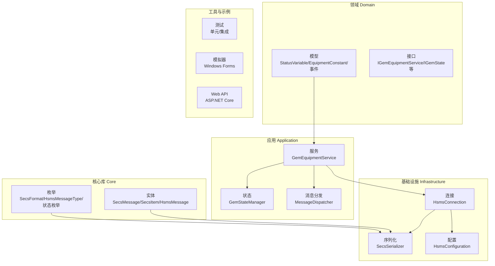
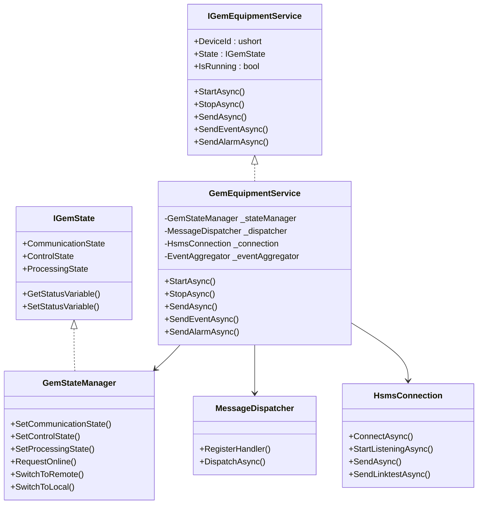
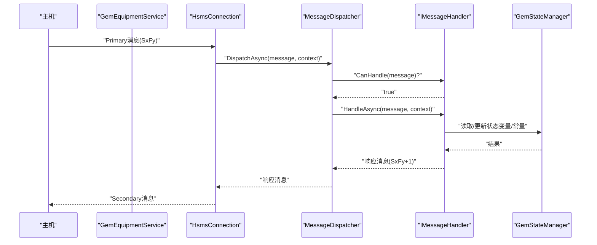
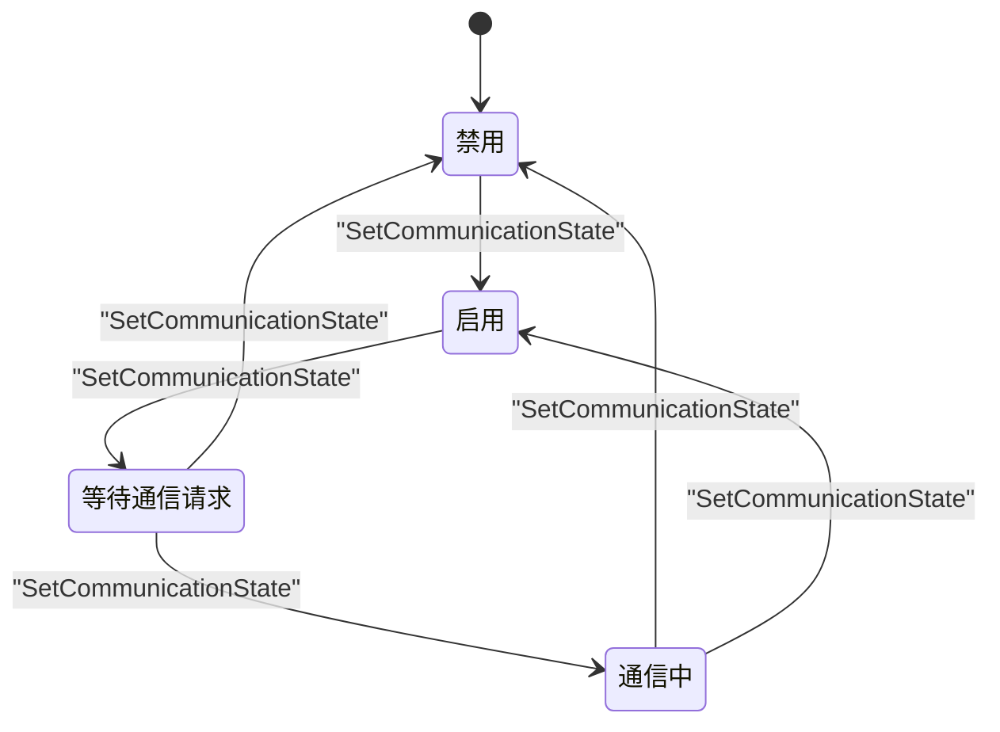
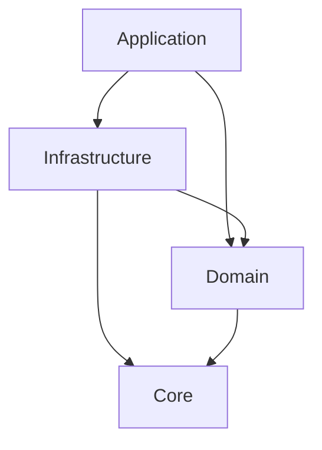

# 项目概述

<cite>
**本文档引用的文件**
- [README.md](file://README.md)
- [SECS2GEM.csproj](file://WebGem/SECS2GEM/SECS2GEM.csproj)
- [IGemEquipmentService.cs](file://WebGem/SECS2GEM/Domain/Interfaces/IGemEquipmentService.cs)
- [GemEquipmentService.cs](file://WebGem/SECS2GEM/Application/Services/GemEquipmentService.cs)
- [SecsMessage.cs](file://WebGem/SECS2GEM/Core/Entities/SecsMessage.cs)
- [HsmsConnection.cs](file://WebGem/SECS2GEM/Infrastructure/Connection/HsmsConnection.cs)
- [GemStateManager.cs](file://WebGem/SECS2GEM/Application/State/GemStateManager.cs)
- [MessageDispatcher.cs](file://WebGem/SECS2GEM/Application/Messaging/MessageDispatcher.cs)
- [SecsSerializer.cs](file://WebGem/SECS2GEM/Infrastructure/Serialization/SecsSerializer.cs)
- [HsmsConfiguration.cs](file://WebGem/SECS2GEM/Infrastructure/Configuration/HsmsConfiguration.cs)
- [EquipmentConstant.cs](file://WebGem/SECS2GEM/Domain/Models/EquipmentConstant.cs)
- [SECS2GEM 类图.md](file://WebGem/SECS2GEM/SECS2GEM_Class_Diagram.md)
- [GemStateManagerTests.cs](file://WebGem/SECS2GEM.Tests/GemStateManagerTests.cs)
- [IntegrationTests.cs](file://WebGem/SECS2GEM.Tests/IntegrationTests.cs)
</cite>

## 目录
1. [引言](#引言)
2. [项目结构](#项目结构)
3. [核心组件](#核心组件)
4. [架构总览](#架构总览)
5. [详细组件分析](#详细组件分析)
6. [依赖分析](#依赖分析)
7. [性能考虑](#性能考虑)
8. [故障排除指南](#故障排除指南)
9. [结论](#结论)
10. [附录](#附录)

## 引言
SECS2-GEM 是一个基于 .NET 9.0 的半导体设备通信中间件项目，专注于实现 SECS-II 和 SEMI E57/GEM（Equipment/Host Interface）协议标准。该项目旨在为设备制造商与厂务系统（如MES、SCADA）之间提供标准化、可靠且高性能的设备通信能力，覆盖设备状态上报、控制指令下发、事件与报警上报、配方与参数管理等关键业务场景。

项目采用模块化分层架构，包含核心库（Core）、领域模型（Domain）、应用服务（Application）、基础设施（Infrastructure）以及配套的设备模拟器（Simulator）与测试框架（Tests）。通过清晰的接口抽象与可插拔的消息处理器机制，项目既满足工业级稳定性要求，又便于扩展与维护。

## 项目结构
项目采用“按层次+按功能”的混合组织方式，主要目录如下：
- Core：协议实体与枚举（SECS-II/HSMS 消息、数据项、格式、状态枚举）
- Domain：领域模型与接口（状态变量、设备常量、事件、接口契约）
- Application：应用服务与状态管理（设备服务外观、消息分发、状态机）
- Infrastructure：基础设施（连接管理、序列化、事务管理、日志）
- Tests：单元测试与集成测试
- Simulator：设备模拟器（Windows Forms）
- WebGem：ASP.NET Core Web API 示例（可选）

图表来源
- [SECS2GEM 类图.md](file://WebGem/SECS2GEM/SECS2GEM_Class_Diagram.md)
- [GemEquipmentService.cs](file://WebGem/SECS2GEM/Application/Services/GemEquipmentService.cs)
- [HsmsConnection.cs](file://WebGem/SECS2GEM/Infrastructure/Connection/HsmsConnection.cs)
- [SecsSerializer.cs](file://WebGem/SECS2GEM/Infrastructure/Serialization/SecsSerializer.cs)
- [HsmsConfiguration.cs](file://WebGem/SECS2GEM/Infrastructure/Configuration/HsmsConfiguration.cs)
- [GemStateManager.cs](file://WebGem/SECS2GEM/Application/State/GemStateManager.cs)
- [MessageDispatcher.cs](file://WebGem/SECS2GEM/Application/Messaging/MessageDispatcher.cs)

章节来源
- [SECS2GEM.csproj](file://WebGem/SECS2GEM/SECS2GEM.csproj)
- [SECS2GEM 类图.md](file://WebGem/SECS2GEM/SECS2GEM_Class_Diagram.md)

## 核心组件
- 设备服务外观（IGemEquipmentService/GemEquipmentService）：对外提供统一的设备通信入口，封装连接、消息分发、事件与报警上报、状态机管理等功能。
- 状态管理器（GemStateManager）：实现 GEM 协议的通信/控制/处理三态机，管理状态变量与设备常量。
- 消息分发器（MessageDispatcher）：责任链+策略模式，按优先级匹配消息处理器，实现松耦合的消息路由。
- HSMS 连接（HsmsConnection）：基于 TCP 的 HSMS 会话管理，支持主动/被动模式、心跳、事务管理与消息日志。
- 序列化器（SecsSerializer）：实现 SECS-II/HSMS 的二进制序列化与反序列化，支持多种数据格式与边界校验。
- 配置（HsmsConfiguration/GemConfiguration）：集中管理网络、超时、心跳、缓冲区与消息日志等参数。
- 领域模型（StatusVariable/EquipmentConstant 等）：承载设备状态与参数，支持动态值与范围校验。

章节来源
- [IGemEquipmentService.cs](file://WebGem/SECS2GEM/Domain/Interfaces/IGemEquipmentService.cs)
- [GemEquipmentService.cs](file://WebGem/SECS2GEM/Application/Services/GemEquipmentService.cs)
- [GemStateManager.cs](file://WebGem/SECS2GEM/Application/State/GemStateManager.cs)
- [MessageDispatcher.cs](file://WebGem/SECS2GEM/Application/Messaging/MessageDispatcher.cs)
- [HsmsConnection.cs](file://WebGem/SECS2GEM/Infrastructure/Connection/HsmsConnection.cs)
- [SecsSerializer.cs](file://WebGem/SECS2GEM/Infrastructure/Serialization/SecsSerializer.cs)
- [HsmsConfiguration.cs](file://WebGem/SECS2GEM/Infrastructure/Configuration/HsmsConfiguration.cs)
- [EquipmentConstant.cs](file://WebGem/SECS2GEM/Domain/Models/EquipmentConstant.cs)

## 架构总览
项目采用分层架构与接口隔离原则，确保各层职责清晰、可替换性强。应用层通过外观模式聚合基础设施与领域能力；基础设施层提供网络、序列化、事务与日志等通用能力；核心层封装协议实体与枚举；领域层定义业务模型与事件。

图表来源
- [IGemEquipmentService.cs](file://WebGem/SECS2GEM/Domain/Interfaces/IGemEquipmentService.cs)
- [GemEquipmentService.cs](file://WebGem/SECS2GEM/Application/Services/GemEquipmentService.cs)
- [GemStateManager.cs](file://WebGem/SECS2GEM/Application/State/GemStateManager.cs)
- [MessageDispatcher.cs](file://WebGem/SECS2GEM/Application/Messaging/MessageDispatcher.cs)
- [HsmsConnection.cs](file://WebGem/SECS2GEM/Infrastructure/Connection/HsmsConnection.cs)

## 详细组件分析

### 设备服务外观（GemEquipmentService）
- 角色定位：作为 Equipment 角色的统一入口，负责生命周期管理、连接建立、消息分发与事件上报。
- 关键流程：
  - 启动：根据配置决定主动连接或被动监听，建立 HSMS 会话。
  - 连接：处理 Select/Deselect/Linktest 控制消息，进入 Selected 状态。
  - 通信：注册默认消息处理器，分发 Primary 消息至对应处理器生成 Secondary 响应。
  - 事件与报警：支持事件报告（S6F11）与报警（S5F1）的发送与状态同步。
- 事件发布：通过事件聚合器发布消息接收、状态变化、连接状态等事件，便于上层订阅。

图表来源
- [GemEquipmentService.cs](file://WebGem/SECS2GEM/Application/Services/GemEquipmentService.cs)
- [MessageDispatcher.cs](file://WebGem/SECS2GEM/Application/Messaging/MessageDispatcher.cs)
- [HsmsConnection.cs](file://WebGem/SECS2GEM/Infrastructure/Connection/HsmsConnection.cs)
- [GemStateManager.cs](file://WebGem/SECS2GEM/Application/State/GemStateManager.cs)

章节来源
- [GemEquipmentService.cs](file://WebGem/SECS2GEM/Application/Services/GemEquipmentService.cs)
- [IGemEquipmentService.cs](file://WebGem/SECS2GEM/Domain/Interfaces/IGemEquipmentService.cs)

### 状态管理器（GemStateManager）
- 功能：实现 GEM 协议的通信/控制/处理三态机，提供状态变量与设备常量的注册与访问。
- 状态转换：严格遵循 GEM 状态转换规则，支持在线/离线、本地/远程控制切换，并在通信状态变化时触发事件。
- 标准变量：内置标准状态变量（如时钟、控制状态），便于快速接入。

图表来源
- [GemStateManager.cs](file://WebGem/SECS2GEM/Application/State/GemStateManager.cs)

章节来源
- [GemStateManager.cs](file://WebGem/SECS2GEM/Application/State/GemStateManager.cs)
- [GemStateManagerTests.cs](file://WebGem/SECS2GEM.Tests/GemStateManagerTests.cs)

### 消息分发器（MessageDispatcher）
- 设计：责任链+策略模式，按优先级排序处理器，首个 CanHandle 的处理器即被调用。
- 错误处理：若无处理器能处理，对于期望响应的消息返回 S9F7（非法数据）错误。
- 可扩展性：支持动态注册/注销处理器，便于按需扩展新的消息类型。

章节来源
- [MessageDispatcher.cs](file://WebGem/SECS2GEM/Application/Messaging/MessageDispatcher.cs)

### HSMS 连接（HsmsConnection）
- 连接模式：支持主动（Active）与被动（Passive）两种模式，满足不同部署场景。
- 事务管理：为 Primary 消息建立事务，等待 Secondary 响应并在超时后清理。
- 心跳与超时：周期性发送 Linktest 并统计失败次数，超过阈值自动断开。
- 日志：可配置消息日志记录，便于调试与审计。

章节来源
- [HsmsConnection.cs](file://WebGem/SECS2GEM/Infrastructure/Connection/HsmsConnection.cs)
- [HsmsConfiguration.cs](file://WebGem/SECS2GEM/Infrastructure/Configuration/HsmsConfiguration.cs)

### 序列化器（SecsSerializer）
- 功能：实现 SECS-II/HSMS 的二进制序列化与反序列化，支持多种数据格式（ASCII、Unicode、整数、浮点、布尔、二进制等）。
- 性能：使用 Span/大端序优化，减少内存分配与拷贝。
- 边界校验：严格的头部与长度校验，防止异常数据导致崩溃。

章节来源
- [SecsSerializer.cs](file://WebGem/SECS2GEM/Infrastructure/Serialization/SecsSerializer.cs)

### 领域模型（StatusVariable/EquipmentConstant）
- StatusVariable：设备状态变量，支持静态值与动态值（ValueGetter）。
- EquipmentConstant：设备常量，支持只读、范围校验与变更回调。

章节来源
- [EquipmentConstant.cs](file://WebGem/SECS2GEM/Domain/Models/EquipmentConstant.cs)

## 依赖分析
- 组件内聚：应用层通过外观模式聚合状态、连接、分发与事件，降低外部依赖复杂度。
- 组件耦合：基础设施层通过接口与核心层交互，避免直接依赖具体实现；领域层仅依赖核心层实体与枚举。
- 外部依赖：项目基于 .NET 9.0，使用 System.Net、System.Buffers、System.Threading.Channels 等标准库；测试框架为 xUnit。

图表来源
- [SECS2GEM 类图.md](file://WebGem/SECS2GEM/SECS2GEM_Class_Diagram.md)

章节来源
- [SECS2GEM.csproj](file://WebGem/SECS2GEM/SECS2GEM.csproj)
- [SECS2GEM 类图.md](file://WebGem/SECS2GEM/SECS2GEM_Class_Diagram.md)

## 性能考虑
- 异步与并发：连接层使用 Channel 与多后台任务实现异步发送/接收与心跳，避免阻塞主线程。
- 内存优化：序列化器使用 Span 与大端序，减少 GC 压力；消息大小上限可配置，防止内存溢出。
- 超时与重连：合理的 T3/T6/T7 超时配置与自动重连策略，提升网络异常下的可用性。
- 日志开销：消息日志可按需开启，避免生产环境不必要的 IO 开销。

## 故障排除指南
- 连接失败：检查 IP/端口、防火墙与连接模式配置；查看连接状态事件与异常日志。
- 通信超时：调整 T3/T6/T7 超时参数；确认心跳是否正常；排查网络抖动。
- 消息解析错误：检查消息格式与长度字段；确认序列化器版本兼容性。
- 状态异常：核对状态转换规则；确认通信状态与控制状态一致性。

章节来源
- [HsmsConnection.cs](file://WebGem/SECS2GEM/Infrastructure/Connection/HsmsConnection.cs)
- [HsmsConfiguration.cs](file://WebGem/SECS2GEM/Infrastructure/Configuration/HsmsConfiguration.cs)
- [SecsSerializer.cs](file://WebGem/SECS2GEM/Infrastructure/Serialization/SecsSerializer.cs)

## 结论
SECS2-GEM 项目以清晰的分层架构与接口抽象，实现了对 SECS-II/HSMS 与 GEM 协议的完整支持。通过设备服务外观、状态机与消息分发器，项目在保证工业级可靠性的同时，提供了良好的可扩展性与可维护性。结合测试框架与模拟器，开发者可以快速验证与集成设备通信能力，缩短开发周期并降低风险。

## 附录

### 技术栈与优势
- .NET 9.0：跨平台、高性能、现代化语言特性与生态。
- C#：强类型、异步编程模型与丰富的并发原语。
- Windows Forms：用于设备模拟器的桌面应用开发，界面直观。
- ASP.NET Core：用于 Web API 示例，便于与上位系统对接。

章节来源
- [SECS2GEM.csproj](file://WebGem/SECS2GEM/SECS2GEM.csproj)

### 快速开始指南
- 准备工作：安装 .NET 9.0 SDK。
- 运行设备服务：创建 GemConfiguration 与 HsmsConfiguration，初始化 GemEquipmentService 并调用 StartAsync。
- 连接验证：使用集成测试或模拟器发起 HSMS 连接与消息交互（如 S1F1、S1F13、Linktest）。
- 扩展消息：实现 IMessageHandler 并通过 RegisterHandler 注册，即可处理自定义消息。

章节来源
- [IntegrationTests.cs](file://WebGem/SECS2GEM.Tests/IntegrationTests.cs)
- [GemEquipmentService.cs](file://WebGem/SECS2GEM/Application/Services/GemEquipmentService.cs)
- [HsmsConfiguration.cs](file://WebGem/SECS2GEM/Infrastructure/Configuration/HsmsConfiguration.cs)

### 应用场景与预期收益
- 场景：晶圆制造、封装测试、检测设备与自动化产线。
- 收益：标准化设备通信接口、降低集成成本、提升系统稳定性与可观测性。