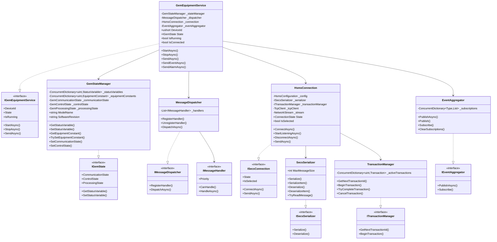
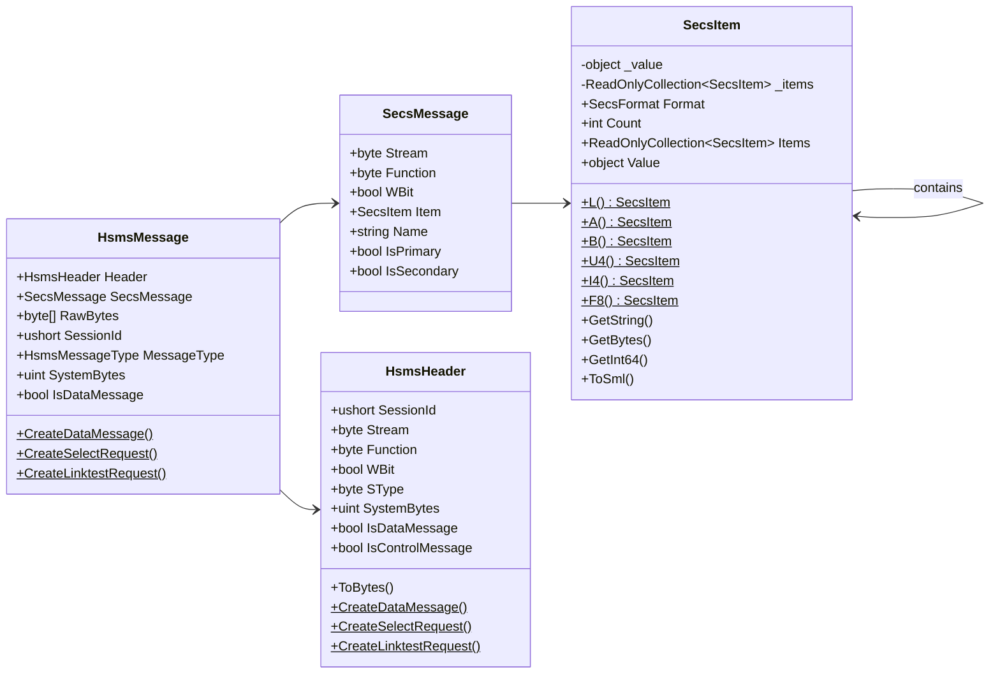
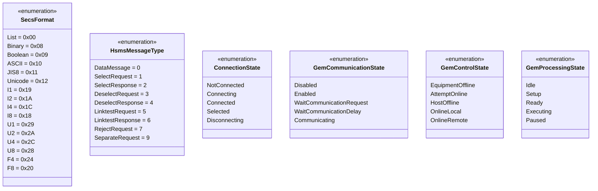
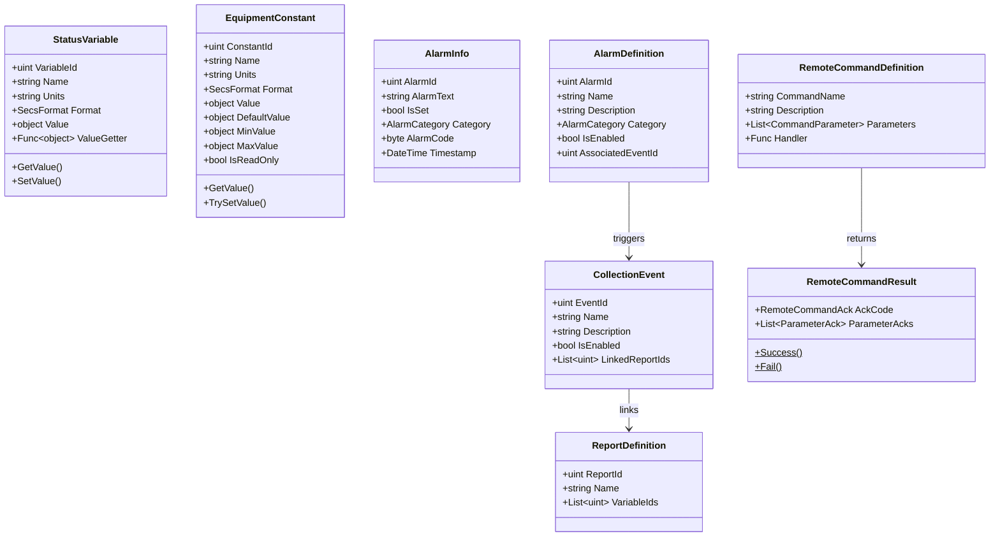
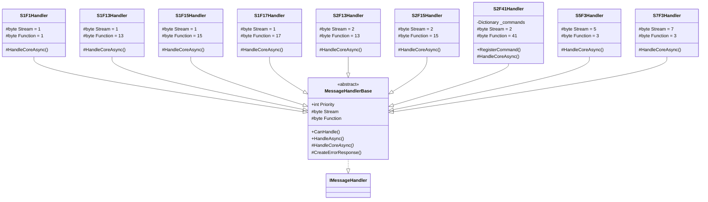
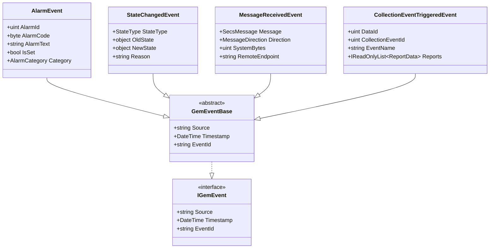
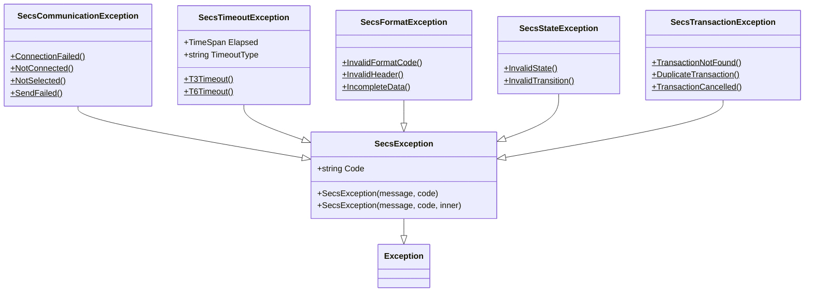
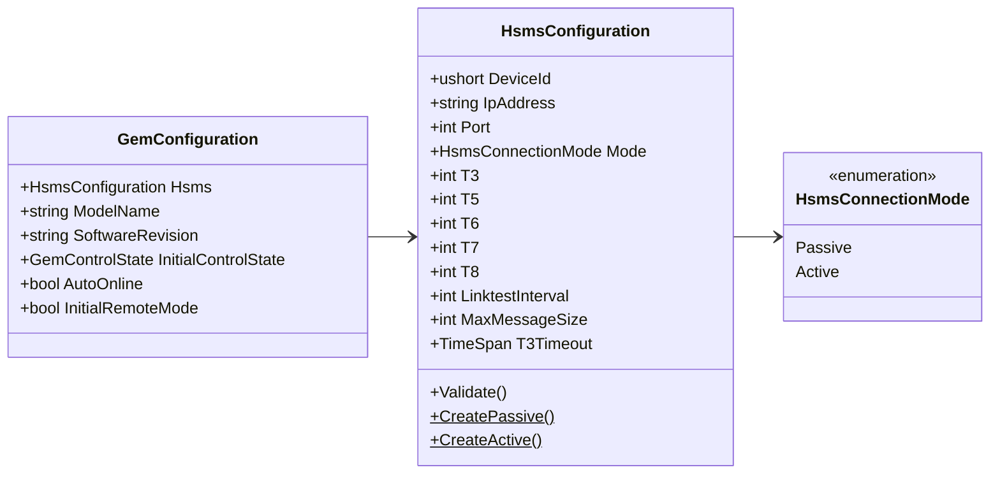
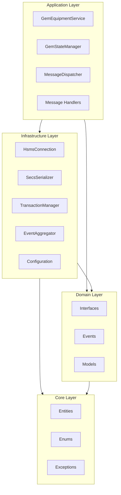
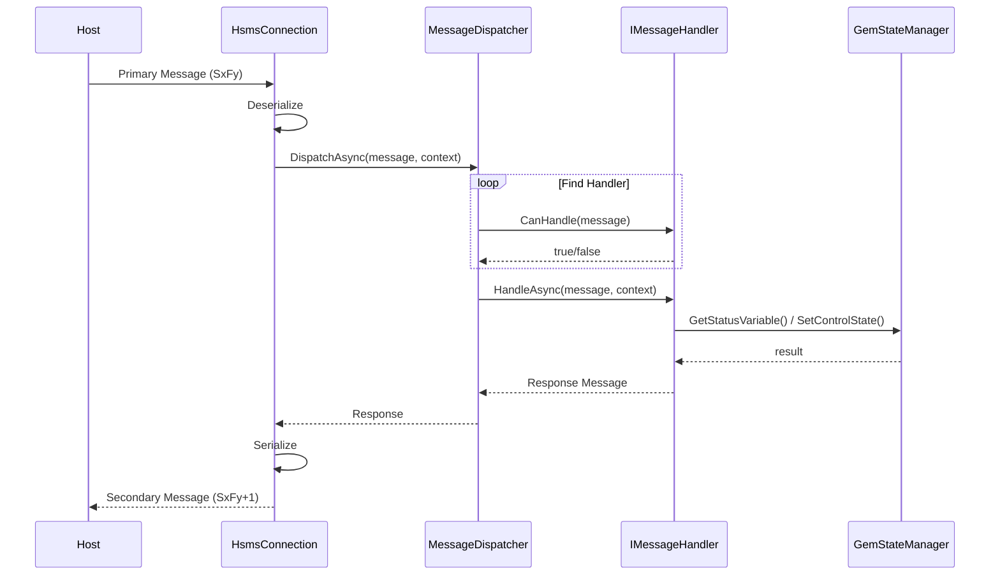

# SECS2GEM 类图

## 1. 整体架构类图

## 2. Core层 - 实体类图

## 3. Core层 - 枚举类图

## 4. Domain层 - 模型类图

## 5. Application层 - 消息处理器类图

## 6. Domain层 - 事件类图

## 7. 异常类图

## 8. 配置类图

## 9. 层次依赖关系图

## 10. 消息处理流程图

